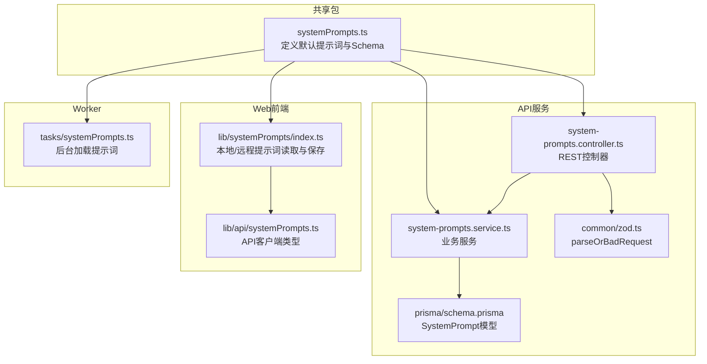
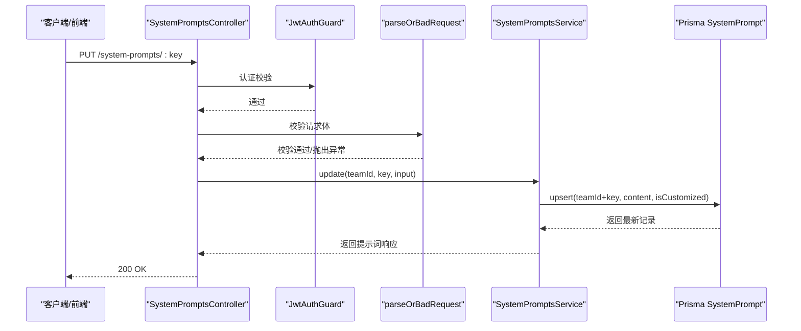
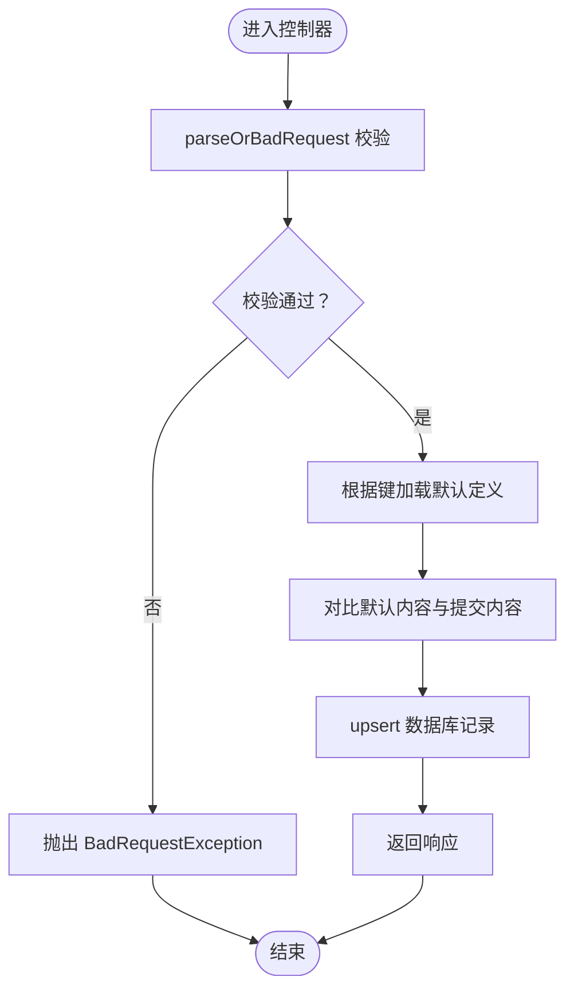
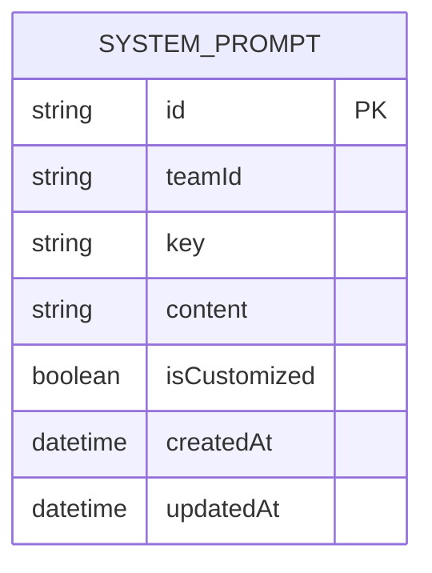
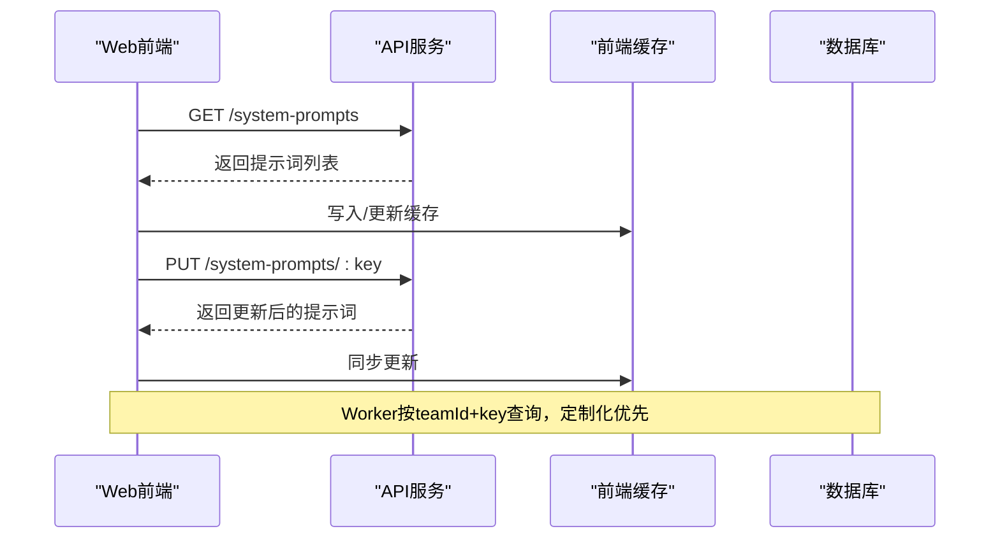
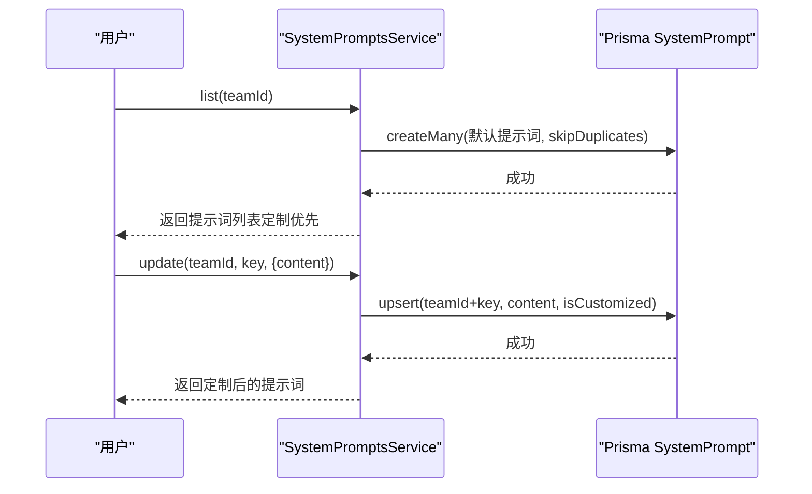
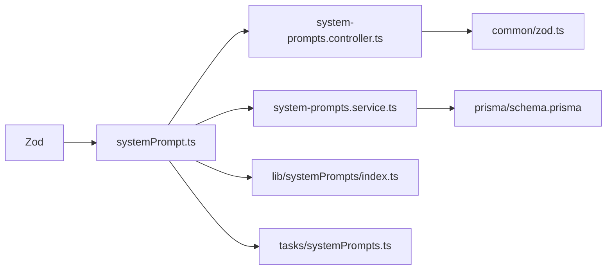

# 系统提示词Schema（System Prompt Schema）

<cite>
**本文档引用的文件**
- [packages/shared/src/schemas/systemPrompt.ts](file://packages/shared/src/schemas/systemPrompt.ts)
- [apps/api/src/system-prompts/system-prompts.controller.ts](file://apps/api/src/system-prompts/system-prompts.controller.ts)
- [apps/api/src/system-prompts/system-prompts.service.ts](file://apps/api/src/system-prompts/system-prompts.service.ts)
- [apps/api/src/common/zod.ts](file://apps/api/src/common/zod.ts)
- [apps/web/src/lib/systemPrompts/index.ts](file://apps/web/src/lib/systemPrompts/index.ts)
- [apps/web/src/lib/api/systemPrompts.ts](file://apps/web/src/lib/api/systemPrompts.ts)
- [apps/worker/src/tasks/systemPrompts.ts](file://apps/worker/src/tasks/systemPrompts.ts)
- [packages/shared/src/systemPrompts.ts](file://packages/shared/src/systemPrompts.ts)
- [apps/api/prisma/schema.prisma](file://apps/api/prisma/schema.prisma)
</cite>

## 目录

1. [简介](#简介)
2. [项目结构](#项目结构)
3. [核心组件](#核心组件)
4. [架构总览](#架构总览)
5. [详细组件分析](#详细组件分析)
6. [依赖分析](#依赖分析)
7. [性能考虑](#性能考虑)
8. [故障排除指南](#故障排除指南)
9. [结论](#结论)
10. [附录](#附录)

## 简介

本文件围绕系统提示词Schema展开，系统性阐述Zod Schema定义、验证规则、版本管理、批量操作、内容格式与安全控制、模板参数与占位符替换、以及在API、Web前端与Worker中的使用与集成方式。重点覆盖以下方面：

- Zod Schema定义与验证流程
- 系统提示词内容与模板参数的验证规则
- 多语言支持与内容格式约束
- 版本管理与默认值回退策略
- 批量操作与内容安全检查
- 创建、定制、使用的完整验证示例
- 质量控制保障机制

## 项目结构

系统提示词Schema涉及共享包、API服务、Web前端与Worker四个层面，职责清晰、边界明确：

- 共享包：定义系统提示词Schema与默认内容清单
- API服务：提供REST接口、Zod验证与数据库持久化
- Web前端：提供本地模式与API模式下的提示词读取与保存
- Worker：在后台任务中加载团队级别的定制提示词

**图表来源**

- [packages/shared/src/systemPrompts.ts](file://packages/shared/src/systemPrompts.ts#L1-L20)
- [apps/api/src/system-prompts/system-prompts.controller.ts](file://apps/api/src/system-prompts/system-prompts.controller.ts#L1-L26)
- [apps/api/src/system-prompts/system-prompts.service.ts](file://apps/api/src/system-prompts/system-prompts.service.ts#L1-L85)
- [apps/api/src/common/zod.ts](file://apps/api/src/common/zod.ts#L1-L16)
- [apps/api/prisma/schema.prisma](file://apps/api/prisma/schema.prisma#L337-L350)
- [apps/web/src/lib/systemPrompts/index.ts](file://apps/web/src/lib/systemPrompts/index.ts#L1-L197)
- [apps/web/src/lib/api/systemPrompts.ts](file://apps/web/src/lib/api/systemPrompts.ts#L1-L30)
- [apps/worker/src/tasks/systemPrompts.ts](file://apps/worker/src/tasks/systemPrompts.ts#L1-L27)

**章节来源**

- [packages/shared/src/systemPrompts.ts](file://packages/shared/src/systemPrompts.ts#L1-L20)
- [apps/api/src/system-prompts/system-prompts.controller.ts](file://apps/api/src/system-prompts/system-prompts.controller.ts#L1-L26)
- [apps/api/src/system-prompts/system-prompts.service.ts](file://apps/api/src/system-prompts/system-prompts.service.ts#L1-L85)
- [apps/api/src/common/zod.ts](file://apps/api/src/common/zod.ts#L1-L16)
- [apps/api/prisma/schema.prisma](file://apps/api/prisma/schema.prisma#L337-L350)
- [apps/web/src/lib/systemPrompts/index.ts](file://apps/web/src/lib/systemPrompts/index.ts#L1-L197)
- [apps/web/src/lib/api/systemPrompts.ts](file://apps/web/src/lib/api/systemPrompts.ts#L1-L30)
- [apps/worker/src/tasks/systemPrompts.ts](file://apps/worker/src/tasks/systemPrompts.ts#L1-L27)

## 核心组件

- Zod Schema定义：统一的输入验证入口，确保请求体符合预期格式
- 系统提示词定义：包含键、标题、分类、默认内容等元数据
- API控制器：接收HTTP请求，调用Zod验证，转发至服务层
- 服务层：处理默认值注入、定制化判断、数据库upsert
- Web前端：本地模式与API模式的提示词读取、保存与重置
- Worker：后台任务按团队与键加载提示词，支持降级回退

**章节来源**

- [packages/shared/src/schemas/systemPrompt.ts](file://packages/shared/src/schemas/systemPrompt.ts#L1-L9)
- [packages/shared/src/systemPrompts.ts](file://packages/shared/src/systemPrompts.ts#L10-L20)
- [apps/api/src/system-prompts/system-prompts.controller.ts](file://apps/api/src/system-prompts/system-prompts.controller.ts#L19-L23)
- [apps/api/src/system-prompts/system-prompts.service.ts](file://apps/api/src/system-prompts/system-prompts.service.ts#L61-L83)
- [apps/web/src/lib/systemPrompts/index.ts](file://apps/web/src/lib/systemPrompts/index.ts#L109-L163)
- [apps/worker/src/tasks/systemPrompts.ts](file://apps/worker/src/tasks/systemPrompts.ts#L4-L26)

## 架构总览

系统提示词在各层的职责与交互如下：

**图表来源**

- [apps/api/src/system-prompts/system-prompts.controller.ts](file://apps/api/src/system-prompts/system-prompts.controller.ts#L19-L23)
- [apps/api/src/common/zod.ts](file://apps/api/src/common/zod.ts#L4-L13)
- [apps/api/src/system-prompts/system-prompts.service.ts](file://apps/api/src/system-prompts/system-prompts.service.ts#L61-L83)
- [apps/api/prisma/schema.prisma](file://apps/api/prisma/schema.prisma#L337-L350)

## 详细组件分析

### Zod Schema定义与验证流程

- 输入Schema：仅包含字符串类型的content字段，执行trim、最小长度与最大长度限制
- 控制器：使用parseOrBadRequest对请求体进行安全解析，失败时抛出400错误
- 服务层：基于键查找默认定义，计算是否定制化，再进行数据库upsert

**图表来源**

- [packages/shared/src/schemas/systemPrompt.ts](file://packages/shared/src/schemas/systemPrompt.ts#L3-L5)
- [apps/api/src/common/zod.ts](file://apps/api/src/common/zod.ts#L4-L13)
- [apps/api/src/system-prompts/system-prompts.controller.ts](file://apps/api/src/system-prompts/system-prompts.controller.ts#L21-L22)
- [apps/api/src/system-prompts/system-prompts.service.ts](file://apps/api/src/system-prompts/system-prompts.service.ts#L61-L83)

**章节来源**

- [packages/shared/src/schemas/systemPrompt.ts](file://packages/shared/src/schemas/systemPrompt.ts#L1-L9)
- [apps/api/src/common/zod.ts](file://apps/api/src/common/zod.ts#L1-L16)
- [apps/api/src/system-prompts/system-prompts.controller.ts](file://apps/api/src/system-prompts/system-prompts.controller.ts#L1-L26)
- [apps/api/src/system-prompts/system-prompts.service.ts](file://apps/api/src/system-prompts/system-prompts.service.ts#L61-L83)

### 系统提示词定义与版本管理

- 定义结构：包含键、标题、描述、分类、默认内容等
- 键唯一性：通过索引映射确保键到定义的唯一映射
- 版本策略：通过默认内容与定制化标志实现“默认回退”与“定制优先”
- 数据库模型：SystemPrompt包含teamId+key唯一索引、内容与定制化标志

**图表来源**

- [apps/api/prisma/schema.prisma](file://apps/api/prisma/schema.prisma#L337-L350)
- [packages/shared/src/systemPrompts.ts](file://packages/shared/src/systemPrompts.ts#L10-L20)
- [packages/shared/src/systemPrompts.ts](file://packages/shared/src/systemPrompts.ts#L1393-L1394)

**章节来源**

- [packages/shared/src/systemPrompts.ts](file://packages/shared/src/systemPrompts.ts#L10-L20)
- [apps/api/prisma/schema.prisma](file://apps/api/prisma/schema.prisma#L337-L350)
- [packages/shared/src/systemPrompts.ts](file://packages/shared/src/systemPrompts.ts#L1393-L1394)

### Web前端与Worker中的使用

- Web前端：
  - 本地模式：从localStorage读取覆盖内容，若为空则回退到默认内容
  - API模式：通过缓存Map存储远端返回，支持更新后同步缓存
- Worker：
  - 从数据库按teamId+key查询，若存在定制化内容则返回，否则回退默认内容

**图表来源**

- [apps/web/src/lib/systemPrompts/index.ts](file://apps/web/src/lib/systemPrompts/index.ts#L64-L82)
- [apps/web/src/lib/systemPrompts/index.ts](file://apps/web/src/lib/systemPrompts/index.ts#L126-L163)
- [apps/worker/src/tasks/systemPrompts.ts](file://apps/worker/src/tasks/systemPrompts.ts#L4-L26)

**章节来源**

- [apps/web/src/lib/systemPrompts/index.ts](file://apps/web/src/lib/systemPrompts/index.ts#L1-L197)
- [apps/web/src/lib/api/systemPrompts.ts](file://apps/web/src/lib/api/systemPrompts.ts#L1-L30)
- [apps/worker/src/tasks/systemPrompts.ts](file://apps/worker/src/tasks/systemPrompts.ts#L1-L27)

### 模板参数验证与占位符替换

- 默认内容中包含占位符（如{key}、{text}、{style}等），用于在运行时注入上下文
- 占位符替换发生在调用侧（Web前端或Worker），而非Schema层面
- Schema仅保证content为非空字符串，不强制占位符完整性

**章节来源**

- [packages/shared/src/systemPrompts.ts](file://packages/shared/src/systemPrompts.ts#L816-L866)
- [packages/shared/src/systemPrompts.ts](file://packages/shared/src/systemPrompts.ts#L868-L916)
- [packages/shared/src/systemPrompts.ts](file://packages/shared/src/systemPrompts.ts#L918-L999)
- [packages/shared/src/systemPrompts.ts](file://packages/shared/src/systemPrompts.ts#L1002-L1106)
- [packages/shared/src/systemPrompts.ts](file://packages/shared/src/systemPrompts.ts#L1110-L1121)

### 多语言支持验证

- 默认内容同时提供中文与英文两版（如场景锚点、关键帧提示词等）
- Schema不强制语言，但默认定义中通常包含中英双语字段
- Web前端在读取时可结合UI语言偏好进行展示

**章节来源**

- [packages/shared/src/systemPrompts.ts](file://packages/shared/src/systemPrompts.ts#L52-L93)
- [packages/shared/src/systemPrompts.ts](file://packages/shared/src/systemPrompts.ts#L1150-L1172)

### 批量操作验证

- 当前API仅支持单键更新；批量操作可通过多次调用实现
- Web前端提供本地覆盖与重置功能，支持批量覆盖与清理

**章节来源**

- [apps/api/src/system-prompts/system-prompts.controller.ts](file://apps/api/src/system-prompts/system-prompts.controller.ts#L19-L23)
- [apps/web/src/lib/systemPrompts/index.ts](file://apps/web/src/lib/systemPrompts/index.ts#L126-L196)

### 内容格式验证与安全控制

- 格式约束：content为字符串，经过trim与长度限制（最小1，最大100000）
- 结构修复：针对JSON输出失败的系统提示词，提供专门的修复提示词
- 安全检查：默认内容中包含严格的“只输出JSON/不要解释/不要多余文字”等约束，降低输出不可解析风险

**章节来源**

- [packages/shared/src/schemas/systemPrompt.ts](file://packages/shared/src/schemas/systemPrompt.ts#L4-L4)
- [packages/shared/src/systemPrompts.ts](file://packages/shared/src/systemPrompts.ts#L360-L428)
- [packages/shared/src/systemPrompts.ts](file://packages/shared/src/systemPrompts.ts#L795-L813)

### 创建、定制、使用的完整验证示例

- 创建（默认）：服务层在首次访问时为团队确保默认提示词存在
- 定制：提交content，服务层比较与默认内容差异，设置定制化标志并upsert
- 使用：Web前端优先返回定制内容，否则回退默认内容；Worker按teamId+key查询定制化内容

**图表来源**

- [apps/api/src/system-prompts/system-prompts.service.ts](file://apps/api/src/system-prompts/system-prompts.service.ts#L17-L28)
- [apps/api/src/system-prompts/system-prompts.service.ts](file://apps/api/src/system-prompts/system-prompts.service.ts#L30-L59)
- [apps/api/src/system-prompts/system-prompts.service.ts](file://apps/api/src/system-prompts/system-prompts.service.ts#L61-L83)

**章节来源**

- [apps/api/src/system-prompts/system-prompts.service.ts](file://apps/api/src/system-prompts/system-prompts.service.ts#L17-L83)

## 依赖分析

- 共享包依赖Zod进行Schema定义
- API控制器依赖Zod解析器与服务层
- 服务层依赖Prisma模型与共享包的定义
- Web前端依赖API客户端与本地存储
- Worker依赖共享包的定义与Prisma查询

**图表来源**

- [packages/shared/src/schemas/systemPrompt.ts](file://packages/shared/src/schemas/systemPrompt.ts#L1-L9)
- [apps/api/src/system-prompts/system-prompts.controller.ts](file://apps/api/src/system-prompts/system-prompts.controller.ts#L1-L26)
- [apps/api/src/system-prompts/system-prompts.service.ts](file://apps/api/src/system-prompts/system-prompts.service.ts#L1-L85)
- [apps/api/src/common/zod.ts](file://apps/api/src/common/zod.ts#L1-L16)
- [apps/api/prisma/schema.prisma](file://apps/api/prisma/schema.prisma#L337-L350)
- [apps/web/src/lib/systemPrompts/index.ts](file://apps/web/src/lib/systemPrompts/index.ts#L1-L197)
- [apps/worker/src/tasks/systemPrompts.ts](file://apps/worker/src/tasks/systemPrompts.ts#L1-L27)

**章节来源**

- [packages/shared/src/schemas/systemPrompt.ts](file://packages/shared/src/schemas/systemPrompt.ts#L1-L9)
- [apps/api/src/system-prompts/system-prompts.controller.ts](file://apps/api/src/system-prompts/system-prompts.controller.ts#L1-L26)
- [apps/api/src/system-prompts/system-prompts.service.ts](file://apps/api/src/system-prompts/system-prompts.service.ts#L1-L85)
- [apps/api/src/common/zod.ts](file://apps/api/src/common/zod.ts#L1-L16)
- [apps/api/prisma/schema.prisma](file://apps/api/prisma/schema.prisma#L337-L350)
- [apps/web/src/lib/systemPrompts/index.ts](file://apps/web/src/lib/systemPrompts/index.ts#L1-L197)
- [apps/worker/src/tasks/systemPrompts.ts](file://apps/worker/src/tasks/systemPrompts.ts#L1-L27)

## 性能考虑

- 前端缓存：API模式下使用Map缓存提示词列表，避免重复请求
- 数据库去重：首次确保默认提示词时使用skipDuplicates，减少重复插入
- 查询优化：按teamId+key唯一索引查询，避免全表扫描

**章节来源**

- [apps/web/src/lib/systemPrompts/index.ts](file://apps/web/src/lib/systemPrompts/index.ts#L61-L82)
- [apps/api/src/system-prompts/system-prompts.service.ts](file://apps/api/src/system-prompts/system-prompts.service.ts#L17-L28)
- [apps/api/prisma/schema.prisma](file://apps/api/prisma/schema.prisma#L348-L349)

## 故障排除指南

- 验证失败：parseOrBadRequest会在Schema不匹配时抛出400错误，检查请求体结构
- 提示词不存在：服务层按键查找默认定义，若键无效会抛出“未找到”异常
- 数据库异常：Worker在读取数据库失败时会回退到默认内容，保证流程可用
- 内容为空：Web前端保存时会校验content非空，否则抛出错误

**章节来源**

- [apps/api/src/common/zod.ts](file://apps/api/src/common/zod.ts#L4-L13)
- [apps/api/src/system-prompts/system-prompts.service.ts](file://apps/api/src/system-prompts/system-prompts.service.ts#L62-L63)
- [apps/worker/src/tasks/systemPrompts.ts](file://apps/worker/src/tasks/systemPrompts.ts#L21-L23)
- [apps/web/src/lib/systemPrompts/index.ts](file://apps/web/src/lib/systemPrompts/index.ts#L133-L135)

## 结论

系统提示词Schema通过Zod实现了严格的输入验证，结合默认内容与定制化标志，提供了可靠的版本管理与回退机制。在API、Web前端与Worker中形成了完整的读取、保存与使用闭环，配合结构修复与安全约束，有效保障了提示词的质量与稳定性。

## 附录

- 提示词键唯一性与索引映射：确保键到定义的快速查找
- 默认内容清单：涵盖工作流、修复、故事板等多个类别
- API类型定义：Web前端与API服务共享的类型声明

**章节来源**

- [packages/shared/src/systemPrompts.ts](file://packages/shared/src/systemPrompts.ts#L1393-L1394)
- [packages/shared/src/systemPrompts.ts](file://packages/shared/src/systemPrompts.ts#L22-L1391)
- [apps/web/src/lib/api/systemPrompts.ts](file://apps/web/src/lib/api/systemPrompts.ts#L9-L18)
