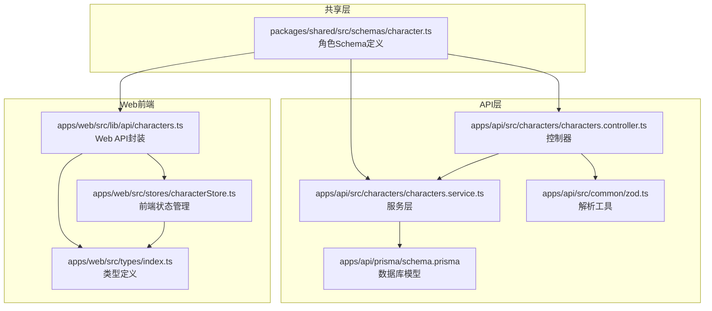
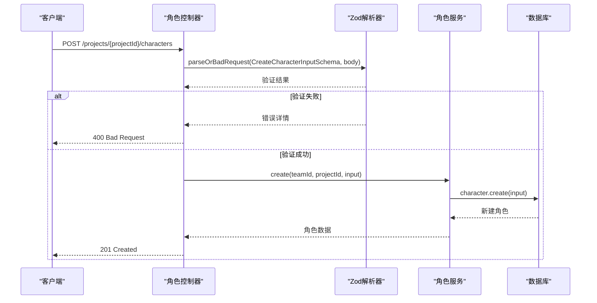
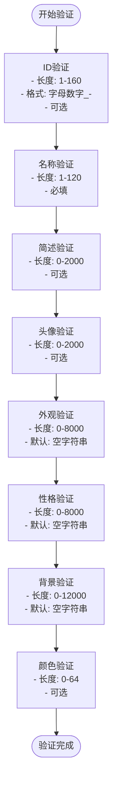
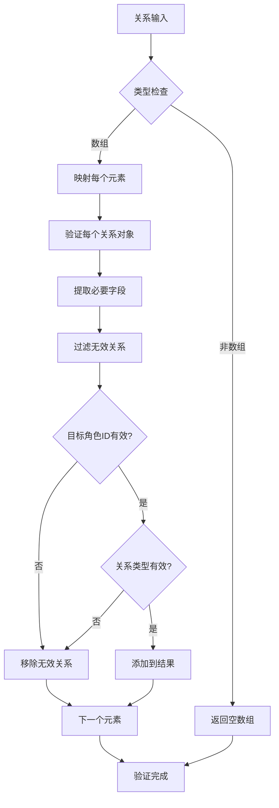
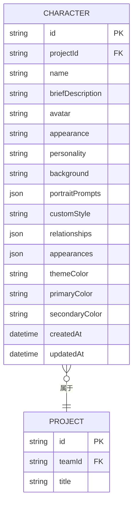
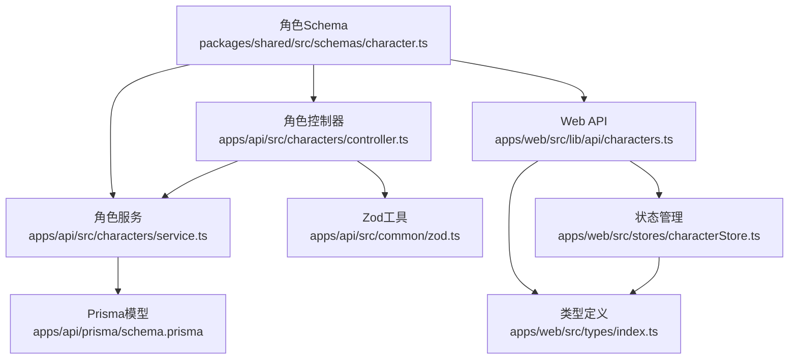
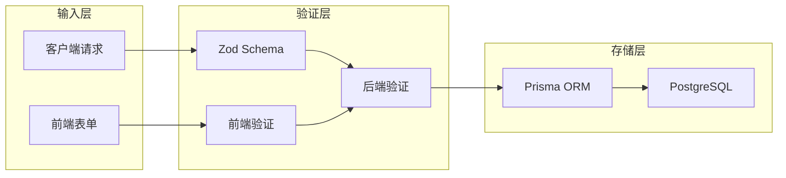

# 角色Schema（角色实体Zod Schema设计）

<cite>
**本文档引用的文件**
- [packages/shared/src/schemas/character.ts](file://packages/shared/src/schemas/character.ts)
- [apps/api/src/characters/characters.controller.ts](file://apps/api/src/characters/characters.controller.ts)
- [apps/api/src/characters/characters.service.ts](file://apps/api/src/characters/characters.service.ts)
- [apps/api/src/common/zod.ts](file://apps/api/src/common/zod.ts)
- [apps/api/prisma/schema.prisma](file://apps/api/prisma/schema.prisma)
- [apps/web/src/lib/api/characters.ts](file://apps/web/src/lib/api/characters.ts)
- [apps/web/src/stores/characterStore.ts](file://apps/web/src/stores/characterStore.ts)
- [apps/web/src/types/index.ts](file://apps/web/src/types/index.ts)
</cite>

## 目录

1. [简介](#简介)
2. [项目结构](#项目结构)
3. [核心组件](#核心组件)
4. [架构概览](#架构概览)
5. [详细组件分析](#详细组件分析)
6. [依赖分析](#依赖分析)
7. [性能考虑](#性能考虑)
8. [故障排除指南](#故障排除指南)
9. [结论](#结论)

## 简介

本文件为角色Schema（Character Schema）提供全面的技术文档，涵盖角色实体的Zod Schema设计、验证规则、关系验证、出场场景关联、状态管理等复杂验证逻辑。文档重点说明角色基本信息、性格特征、背景故事、出场记录等字段的验证规则，并深入解释嵌套对象验证、数组字段长度和内容验证、条件字段依赖关系等高级特性。同时提供角色创建、编辑、关系维护的完整验证示例，以及数据完整性检查的最佳实践。

## 项目结构

角色Schema位于共享包中，被API服务和Web前端共同使用，确保前后端一致的验证行为。

**图表来源**

- [packages/shared/src/schemas/character.ts](file://packages/shared/src/schemas/character.ts#L1-L32)
- [apps/api/src/characters/characters.controller.ts](file://apps/api/src/characters/characters.controller.ts#L1-L47)
- [apps/api/src/characters/characters.service.ts](file://apps/api/src/characters/characters.service.ts#L1-L118)
- [apps/api/src/common/zod.ts](file://apps/api/src/common/zod.ts#L1-L16)
- [apps/api/prisma/schema.prisma](file://apps/api/prisma/schema.prisma#L235-L257)
- [apps/web/src/lib/api/characters.ts](file://apps/web/src/lib/api/characters.ts#L1-L76)
- [apps/web/src/stores/characterStore.ts](file://apps/web/src/stores/characterStore.ts#L45-L125)
- [apps/web/src/types/index.ts](file://apps/web/src/types/index.ts#L852-L891)

**章节来源**

- [packages/shared/src/schemas/character.ts](file://packages/shared/src/schemas/character.ts#L1-L32)
- [apps/api/prisma/schema.prisma](file://apps/api/prisma/schema.prisma#L235-L257)

## 核心组件

角色Schema的核心组件包括创建输入Schema、更新输入Schema以及相关的类型定义。这些组件共同确保角色数据在创建、编辑和查询过程中的完整性。

### 角色Schema定义

角色Schema采用Zod进行强类型验证，支持可选字段和默认值设置：

- **基础字段验证**：字符串长度限制、正则表达式验证
- **可选字段支持**：所有非必需字段均标记为可选
- **默认值处理**：敏感字段提供合理默认值
- **复杂类型支持**：JSON字段支持任意结构

**章节来源**

- [packages/shared/src/schemas/character.ts](file://packages/shared/src/schemas/character.ts#L3-L23)
- [apps/web/src/types/index.ts](file://apps/web/src/types/index.ts#L852-L877)

## 架构概览

角色验证架构采用分层设计，确保数据在进入系统前得到严格验证。

**图表来源**

- [apps/api/src/characters/characters.controller.ts](file://apps/api/src/characters/characters.controller.ts#L19-L23)
- [apps/api/src/common/zod.ts](file://apps/api/src/common/zod.ts#L4-L13)
- [apps/api/src/characters/characters.service.ts](file://apps/api/src/characters/characters.service.ts#L44-L68)

## 详细组件分析

### 角色Schema设计详解

#### 基础字段验证规则

角色Schema对每个字段都设置了严格的验证规则：

**图表来源**

- [packages/shared/src/schemas/character.ts](file://packages/shared/src/schemas/character.ts#L4-L23)

#### 复杂字段验证

角色Schema支持多种复杂字段的验证：

**JSON字段验证**

- `portraitPrompts`: 未知类型，允许任意JSON结构
- `relationships`: 未知类型，允许任意JSON结构
- `appearances`: 未知类型，允许任意JSON结构

**颜色字段验证**

- `themeColor`: 兼容字段，长度0-64
- `primaryColor`: 主色调，长度0-64
- `secondaryColor`: 辅色调，长度0-64

**章节来源**

- [packages/shared/src/schemas/character.ts](file://packages/shared/src/schemas/character.ts#L16-L23)
- [apps/web/src/types/index.ts](file://apps/web/src/types/index.ts#L863-L874)

### 关系验证机制

#### 角色关系验证流程

角色关系通过前端状态管理器进行验证和规范化：

**图表来源**

- [apps/web/src/stores/characterStore.ts](file://apps/web/src/stores/characterStore.ts#L61-L72)

#### 出场记录验证

出场记录包含场景ID、角色类型和备注信息的验证：

**出场记录规范化流程**：

1. 验证输入必须为数组
2. 过滤无效元素
3. 标准化角色类型（main/supporting/background）
4. 验证场景ID存在性
5. 清理空字符串

**章节来源**

- [apps/web/src/stores/characterStore.ts](file://apps/web/src/stores/characterStore.ts#L74-L92)
- [apps/web/src/types/index.ts](file://apps/web/src/types/index.ts#L886-L891)

### 数据库集成验证

#### 数据库模型映射

角色Schema与数据库模型保持一致的字段映射：

**图表来源**

- [apps/api/prisma/schema.prisma](file://apps/api/prisma/schema.prisma#L235-L257)

#### 服务层验证逻辑

服务层确保项目存在性和角色唯一性：

**创建流程验证**：

1. 验证项目存在且未删除
2. 应用默认值处理
3. 处理可选字段的undefined情况
4. 存储JSON字段

**更新流程验证**：

1. 验证项目存在性
2. 验证角色存在性
3. 条件更新字段
4. 处理JSON字段更新

**章节来源**

- [apps/api/src/characters/characters.service.ts](file://apps/api/src/characters/characters.service.ts#L27-L33)
- [apps/api/src/characters/characters.service.ts](file://apps/api/src/characters/characters.service.ts#L70-L102)

### 前端集成验证

#### Web API封装验证

Web API层提供与后端一致的验证行为：

**创建请求构建**：

- 条件性包含可选字段
- 类型安全的字段处理
- JSON字段的直接传递

**更新请求构建**：

- 仅包含变更的字段
- 类型检查确保数据正确性
- 支持部分更新

**章节来源**

- [apps/web/src/lib/api/characters.ts](file://apps/web/src/lib/api/characters.ts#L12-L38)
- [apps/web/src/lib/api/characters.ts](file://apps/web/src/lib/api/characters.ts#L40-L68)

#### 前端状态管理验证

前端状态管理器提供额外的验证和规范化：

**数据规范化流程**：

1. ID生成和验证
2. 字符串清理和标准化
3. JSON对象的深度验证
4. 数组元素的类型检查
5. 默认值的智能应用

**章节来源**

- [apps/web/src/stores/characterStore.ts](file://apps/web/src/stores/characterStore.ts#L94-L120)

## 依赖分析

### 组件间依赖关系

**图表来源**

- [packages/shared/src/schemas/character.ts](file://packages/shared/src/schemas/character.ts#L1-L32)
- [apps/api/src/characters/characters.controller.ts](file://apps/api/src/characters/characters.controller.ts#L1-L47)
- [apps/api/src/characters/characters.service.ts](file://apps/api/src/characters/characters.service.ts#L1-L118)
- [apps/api/src/common/zod.ts](file://apps/api/src/common/zod.ts#L1-L16)
- [apps/api/prisma/schema.prisma](file://apps/api/prisma/schema.prisma#L235-L257)
- [apps/web/src/lib/api/characters.ts](file://apps/web/src/lib/api/characters.ts#L1-L76)
- [apps/web/src/stores/characterStore.ts](file://apps/web/src/stores/characterStore.ts#L1-L125)
- [apps/web/src/types/index.ts](file://apps/web/src/types/index.ts#L852-L891)

### 数据流验证

**图表来源**

- [apps/api/src/common/zod.ts](file://apps/api/src/common/zod.ts#L4-L13)
- [apps/web/src/stores/characterStore.ts](file://apps/web/src/stores/characterStore.ts#L94-L120)
- [apps/api/src/characters/characters.service.ts](file://apps/api/src/characters/characters.service.ts#L44-L68)

## 性能考虑

角色Schema设计考虑了以下性能优化：

1. **延迟验证**：仅在必要时执行验证逻辑
2. **最小化数据传输**：支持部分更新减少网络开销
3. **缓存友好**：合理的字段长度限制避免内存浪费
4. **索引优化**：数据库层面的索引设计支持高效查询

## 故障排除指南

### 常见验证错误及解决方案

**ID格式错误**

- 问题：ID包含不允许的字符
- 解决方案：确保ID只包含字母、数字、连字符和下划线

**字段长度超限**

- 问题：字符串字段超过最大长度限制
- 解决方案：检查字段长度并进行截断或提示用户

**关系验证失败**

- 问题：角色关系缺少必要字段
- 解决方案：确保每个关系都有targetCharacterId和relationshipType

**JSON字段格式错误**

- 问题：JSON字段不是有效的JSON格式
- 解决方案：使用JSON.parse验证字符串格式

### 调试技巧

1. 使用parseOrBadRequest捕获详细的验证错误信息
2. 在前端和后端分别进行验证以确保数据完整性
3. 利用Prisma的类型安全特性避免运行时错误
4. 实施适当的日志记录以便追踪验证失败原因

**章节来源**

- [apps/api/src/common/zod.ts](file://apps/api/src/common/zod.ts#L4-L13)
- [apps/api/src/characters/characters.service.ts](file://apps/api/src/characters/characters.service.ts#L70-L102)

## 结论

角色Schema通过Zod实现了强类型的验证机制，确保角色数据在创建、编辑和查询过程中的完整性。其设计特点包括：

1. **全面的字段验证**：每个字段都有明确的长度和格式要求
2. **灵活的可选字段**：支持部分更新和渐进式数据完善
3. **复杂类型支持**：JSON字段允许存储复杂的嵌套结构
4. **前后端一致性**：共享Schema确保验证行为的一致性
5. **性能优化**：合理的验证策略和数据结构设计

该Schema为角色管理系统提供了坚实的基础，支持角色关系、出场记录等复杂业务场景的验证需求。
