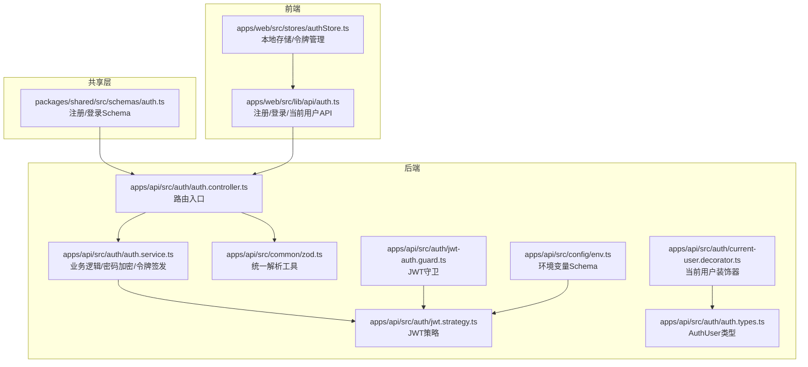
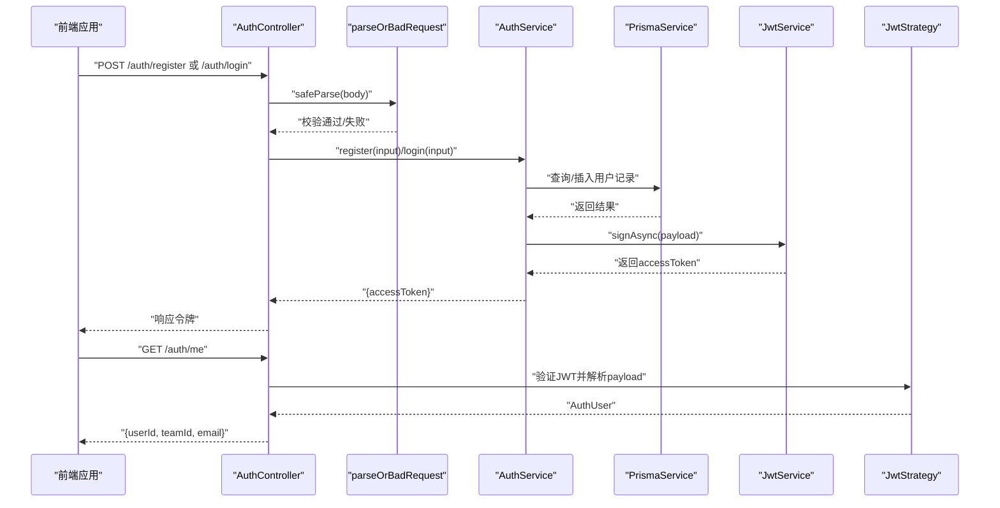
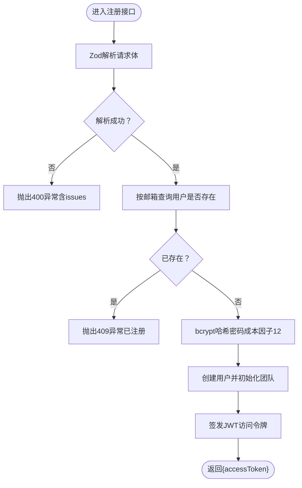
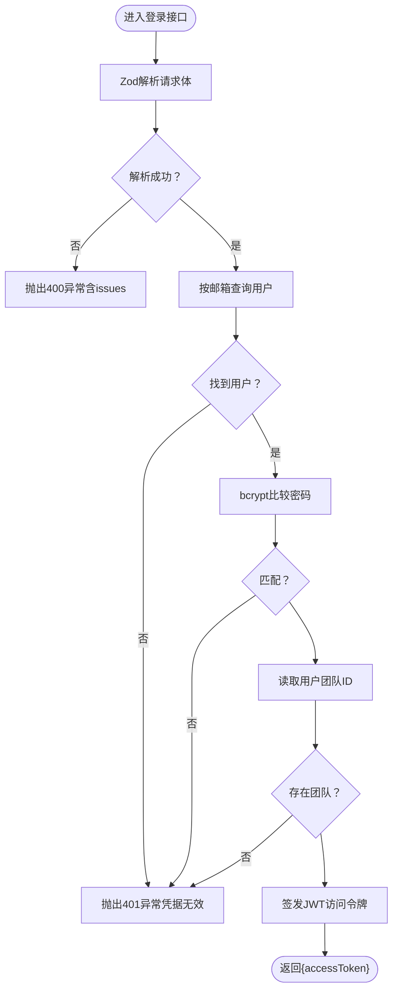
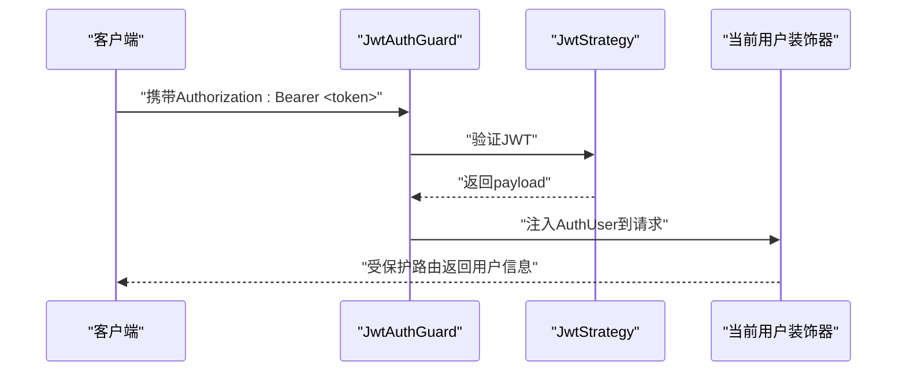
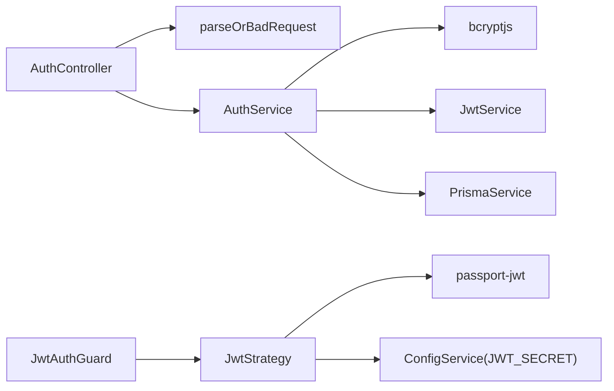

# 认证Schema（Auth Schema）

<cite>
**本文引用的文件**
- [packages/shared/src/schemas/auth.ts](file://packages/shared/src/schemas/auth.ts)
- [apps/api/src/common/zod.ts](file://apps/api/src/common/zod.ts)
- [apps/api/src/auth/auth.controller.ts](file://apps/api/src/auth/auth.controller.ts)
- [apps/api/src/auth/auth.service.ts](file://apps/api/src/auth/auth.service.ts)
- [apps/api/src/auth/jwt.strategy.ts](file://apps/api/src/auth/jwt.strategy.ts)
- [apps/api/src/auth/jwt-auth.guard.ts](file://apps/api/src/auth/jwt-auth.guard.ts)
- [apps/api/src/auth/current-user.decorator.ts](file://apps/api/src/auth/current-user.decorator.ts)
- [apps/api/src/auth/auth.types.ts](file://apps/api/src/auth/auth.types.ts)
- [apps/api/src/config/env.ts](file://apps/api/src/config/env.ts)
- [apps/web/src/lib/api/auth.ts](file://apps/web/src/lib/api/auth.ts)
- [apps/web/src/stores/authStore.ts](file://apps/web/src/stores/authStore.ts)
</cite>

## 目录

1. [简介](#简介)
2. [项目结构](#项目结构)
3. [核心组件](#核心组件)
4. [架构总览](#架构总览)
5. [详细组件分析](#详细组件分析)
6. [依赖关系分析](#依赖关系分析)
7. [性能考量](#性能考量)
8. [故障排查指南](#故障排查指南)
9. [结论](#结论)
10. [附录](#附录)

## 简介

本文件系统性梳理认证Schema与认证流程，围绕以下目标展开：

- 认证实体的Zod Schema设计：用户注册、登录、邮箱格式、密码长度等字段规则
- 数据验证、安全验证与会话管理验证的关键逻辑
- 敏感信息处理、密码加密、令牌签发与校验的安全特性
- 完整的注册、登录、查询当前用户流程的验证示例
- 认证安全性最佳实践与防护建议

## 项目结构

认证能力由共享Schema层、后端控制器/服务/策略、前端API封装与状态管理共同组成，采用分层解耦与跨端复用的设计。

图表来源

- [packages/shared/src/schemas/auth.ts](file://packages/shared/src/schemas/auth.ts#L1-L19)
- [apps/api/src/auth/auth.controller.ts](file://apps/api/src/auth/auth.controller.ts#L1-L33)
- [apps/api/src/auth/auth.service.ts](file://apps/api/src/auth/auth.service.ts#L1-L77)
- [apps/api/src/common/zod.ts](file://apps/api/src/common/zod.ts#L1-L16)
- [apps/api/src/auth/jwt.strategy.ts](file://apps/api/src/auth/jwt.strategy.ts#L1-L34)
- [apps/api/src/auth/jwt-auth.guard.ts](file://apps/api/src/auth/jwt-auth.guard.ts#L1-L8)
- [apps/api/src/auth/current-user.decorator.ts](file://apps/api/src/auth/current-user.decorator.ts#L1-L10)
- [apps/api/src/auth/auth.types.ts](file://apps/api/src/auth/auth.types.ts#L1-L8)
- [apps/api/src/config/env.ts](file://apps/api/src/config/env.ts#L1-L17)
- [apps/web/src/lib/api/auth.ts](file://apps/web/src/lib/api/auth.ts#L1-L21)
- [apps/web/src/stores/authStore.ts](file://apps/web/src/stores/authStore.ts#L1-L82)

章节来源

- [packages/shared/src/schemas/auth.ts](file://packages/shared/src/schemas/auth.ts#L1-L19)
- [apps/api/src/auth/auth.controller.ts](file://apps/api/src/auth/auth.controller.ts#L1-L33)
- [apps/api/src/auth/auth.service.ts](file://apps/api/src/auth/auth.service.ts#L1-L77)
- [apps/api/src/common/zod.ts](file://apps/api/src/common/zod.ts#L1-L16)
- [apps/api/src/auth/jwt.strategy.ts](file://apps/api/src/auth/jwt.strategy.ts#L1-L34)
- [apps/api/src/auth/jwt-auth.guard.ts](file://apps/api/src/auth/jwt-auth.guard.ts#L1-L8)
- [apps/api/src/auth/current-user.decorator.ts](file://apps/api/src/auth/current-user.decorator.ts#L1-L10)
- [apps/api/src/auth/auth.types.ts](file://apps/api/src/auth/auth.types.ts#L1-L8)
- [apps/api/src/config/env.ts](file://apps/api/src/config/env.ts#L1-L17)
- [apps/web/src/lib/api/auth.ts](file://apps/web/src/lib/api/auth.ts#L1-L21)
- [apps/web/src/stores/authStore.ts](file://apps/web/src/stores/authStore.ts#L1-L82)

## 核心组件

- 共享Schema层：定义注册与登录请求体的字段约束，确保前后端一致的输入校验
- 控制器层：接收HTTP请求，调用Zod解析工具进行参数校验，再委派给服务层
- 服务层：执行业务逻辑（去重、密码哈希、团队初始化、JWT签发）
- 守卫与策略：基于Passport的JWT守卫与策略，完成令牌提取、签名验证与用户上下文注入
- 前端API与状态：封装REST调用、本地持久化令牌、自动刷新当前用户信息

章节来源

- [packages/shared/src/schemas/auth.ts](file://packages/shared/src/schemas/auth.ts#L1-L19)
- [apps/api/src/auth/auth.controller.ts](file://apps/api/src/auth/auth.controller.ts#L1-L33)
- [apps/api/src/auth/auth.service.ts](file://apps/api/src/auth/auth.service.ts#L1-L77)
- [apps/api/src/auth/jwt.strategy.ts](file://apps/api/src/auth/jwt.strategy.ts#L1-L34)
- [apps/api/src/auth/jwt-auth.guard.ts](file://apps/api/src/auth/jwt-auth.guard.ts#L1-L8)
- [apps/web/src/lib/api/auth.ts](file://apps/web/src/lib/api/auth.ts#L1-L21)
- [apps/web/src/stores/authStore.ts](file://apps/web/src/stores/authStore.ts#L1-L82)

## 架构总览

下图展示从浏览器到后端再到数据库与JWT策略的整体交互：

图表来源

- [apps/api/src/auth/auth.controller.ts](file://apps/api/src/auth/auth.controller.ts#L1-L33)
- [apps/api/src/common/zod.ts](file://apps/api/src/common/zod.ts#L1-L16)
- [apps/api/src/auth/auth.service.ts](file://apps/api/src/auth/auth.service.ts#L1-L77)
- [apps/api/src/auth/jwt.strategy.ts](file://apps/api/src/auth/jwt.strategy.ts#L1-L34)

## 详细组件分析

### 注册Schema与验证规则

- 字段与约束
  - 邮箱：字符串且符合邮箱格式
  - 密码：字符串，最小长度8，最大长度128
  - 团队名称：可选字符串，最小长度1，最大长度64；未提供时使用默认值
- 解析与异常
  - 使用统一解析工具对请求体进行安全解析，失败时抛出包含具体问题的异常

图表来源

- [packages/shared/src/schemas/auth.ts](file://packages/shared/src/schemas/auth.ts#L1-L19)
- [apps/api/src/common/zod.ts](file://apps/api/src/common/zod.ts#L1-L16)
- [apps/api/src/auth/auth.service.ts](file://apps/api/src/auth/auth.service.ts#L1-L77)

章节来源

- [packages/shared/src/schemas/auth.ts](file://packages/shared/src/schemas/auth.ts#L1-L19)
- [apps/api/src/common/zod.ts](file://apps/api/src/common/zod.ts#L1-L16)
- [apps/api/src/auth/auth.service.ts](file://apps/api/src/auth/auth.service.ts#L1-L77)

### 登录Schema与验证规则

- 字段与约束
  - 邮箱：字符串且符合邮箱格式
  - 密码：字符串，最小长度1，最大长度128
- 安全流程
  - 按邮箱查找用户，不存在则拒绝
  - 使用bcrypt比较明文密码与哈希值，不匹配则拒绝
  - 确保用户所属团队存在，否则拒绝
  - 成功后签发JWT访问令牌

图表来源

- [packages/shared/src/schemas/auth.ts](file://packages/shared/src/schemas/auth.ts#L1-L19)
- [apps/api/src/common/zod.ts](file://apps/api/src/common/zod.ts#L1-L16)
- [apps/api/src/auth/auth.service.ts](file://apps/api/src/auth/auth.service.ts#L1-L77)

章节来源

- [packages/shared/src/schemas/auth.ts](file://packages/shared/src/schemas/auth.ts#L1-L19)
- [apps/api/src/common/zod.ts](file://apps/api/src/common/zod.ts#L1-L16)
- [apps/api/src/auth/auth.service.ts](file://apps/api/src/auth/auth.service.ts#L1-L77)

### 会话管理与令牌验证

- 令牌签发
  - 服务层在注册与登录成功后，使用JWT服务以用户ID、邮箱、团队ID为载荷签发访问令牌
- 令牌提取与验证
  - 策略从Authorization头中提取Bearer令牌，使用配置的密钥验证签名并设置过期策略
  - 守卫用于保护受控路由，装饰器将解析后的用户信息注入到请求对象
- 前端令牌生命周期
  - 存储令牌于本地，发起请求时自动附加到HTTP头
  - 启动时尝试拉取当前用户信息，若失败则清理本地令牌并重置状态

图表来源

- [apps/api/src/auth/jwt-auth.guard.ts](file://apps/api/src/auth/jwt-auth.guard.ts#L1-L8)
- [apps/api/src/auth/jwt.strategy.ts](file://apps/api/src/auth/jwt.strategy.ts#L1-L34)
- [apps/api/src/auth/current-user.decorator.ts](file://apps/api/src/auth/current-user.decorator.ts#L1-L10)
- [apps/web/src/stores/authStore.ts](file://apps/web/src/stores/authStore.ts#L1-L82)

章节来源

- [apps/api/src/auth/auth.service.ts](file://apps/api/src/auth/auth.service.ts#L1-L77)
- [apps/api/src/auth/jwt.strategy.ts](file://apps/api/src/auth/jwt.strategy.ts#L1-L34)
- [apps/api/src/auth/jwt-auth.guard.ts](file://apps/api/src/auth/jwt-auth.guard.ts#L1-L8)
- [apps/api/src/auth/current-user.decorator.ts](file://apps/api/src/auth/current-user.decorator.ts#L1-L10)
- [apps/web/src/stores/authStore.ts](file://apps/web/src/stores/authStore.ts#L1-L82)

### 安全特性与最佳实践

- 输入校验
  - 使用Zod对所有入站请求进行严格校验，并在失败时返回结构化的错误信息
- 密码安全
  - 使用bcrypt进行密码哈希，成本因子为12；登录时使用compare进行验证
- 令牌安全
  - JWT密钥来自环境变量，且要求最小长度；策略启用过期检查
- 会话与权限
  - 受保护路由通过守卫与策略强制令牌验证；当前用户信息仅在令牌有效时可用
- 前端令牌治理
  - 本地持久化令牌，启动时自动校验有效性；失败时清理并重置状态

章节来源

- [apps/api/src/common/zod.ts](file://apps/api/src/common/zod.ts#L1-L16)
- [apps/api/src/auth/auth.service.ts](file://apps/api/src/auth/auth.service.ts#L1-L77)
- [apps/api/src/config/env.ts](file://apps/api/src/config/env.ts#L1-L17)
- [apps/web/src/stores/authStore.ts](file://apps/web/src/stores/authStore.ts#L1-L82)

## 依赖关系分析

- 组件内聚与耦合
  - 控制器仅负责编排与参数解析，业务逻辑集中在服务层，降低控制器复杂度
  - JWT策略与守卫解耦，便于在不同路由上灵活应用
- 外部依赖
  - bcrypt用于密码哈希与比对
  - passport-jwt用于令牌提取与验证
  - NestJS JwtService用于签发访问令牌
- 环境变量约束
  - JWT_SECRET与API_KEY_ENCRYPTION_KEY均要求最小长度，保障密钥强度

图表来源

- [apps/api/src/auth/auth.controller.ts](file://apps/api/src/auth/auth.controller.ts#L1-L33)
- [apps/api/src/auth/auth.service.ts](file://apps/api/src/auth/auth.service.ts#L1-L77)
- [apps/api/src/auth/jwt.strategy.ts](file://apps/api/src/auth/jwt.strategy.ts#L1-L34)
- [apps/api/src/auth/jwt-auth.guard.ts](file://apps/api/src/auth/jwt-auth.guard.ts#L1-L8)
- [apps/api/src/config/env.ts](file://apps/api/src/config/env.ts#L1-L17)

章节来源

- [apps/api/src/auth/auth.controller.ts](file://apps/api/src/auth/auth.controller.ts#L1-L33)
- [apps/api/src/auth/auth.service.ts](file://apps/api/src/auth/auth.service.ts#L1-L77)
- [apps/api/src/auth/jwt.strategy.ts](file://apps/api/src/auth/jwt.strategy.ts#L1-L34)
- [apps/api/src/auth/jwt-auth.guard.ts](file://apps/api/src/auth/jwt-auth.guard.ts#L1-L8)
- [apps/api/src/config/env.ts](file://apps/api/src/config/env.ts#L1-L17)

## 性能考量

- 密码哈希成本因子为12，平衡安全与性能；可根据硬件条件调整
- JWT签发为轻量操作，主要开销在bcrypt与数据库查询
- 建议对高频查询（如按邮箱查重）建立索引，减少数据库压力
- 前端令牌缓存与失效自动清理，避免重复无效请求

## 故障排查指南

- 参数校验失败
  - 现象：收到400错误并包含issues数组
  - 排查：检查请求体字段是否满足邮箱格式、长度限制
- 邮箱已被注册
  - 现象：409冲突
  - 排查：确认邮箱唯一性或更换邮箱
- 凭据无效
  - 现象：401未授权
  - 排查：确认邮箱存在、密码正确、用户关联团队存在
- 令牌无效或过期
  - 现象：受保护路由返回401
  - 排查：重新登录获取新令牌；检查JWT_SECRET配置与过期策略

章节来源

- [apps/api/src/common/zod.ts](file://apps/api/src/common/zod.ts#L1-L16)
- [apps/api/src/auth/auth.service.ts](file://apps/api/src/auth/auth.service.ts#L1-L77)
- [apps/web/src/stores/authStore.ts](file://apps/web/src/stores/authStore.ts#L1-L82)

## 结论

该认证体系通过共享Schema实现前后端一致的输入约束，结合bcrypt与JWT策略构建了基础而稳健的安全防线。控制器与服务层职责清晰，配合守卫与策略实现受控访问。建议持续关注令牌密钥强度、数据库索引与查询性能，并在前端完善错误提示与用户体验。

## 附录

- 常用API路径与行为
  - POST /auth/register：注册，返回{accessToken}
  - POST /auth/login：登录，返回{accessToken}
  - GET /auth/me：获取当前用户信息（需携带有效令牌）
- 前端集成要点
  - 将accessToken写入本地存储并在请求拦截器中附加到Authorization头
  - 应用启动时尝试调用/me校验令牌有效性，失败则清空令牌并重置状态

章节来源

- [apps/web/src/lib/api/auth.ts](file://apps/web/src/lib/api/auth.ts#L1-L21)
- [apps/web/src/stores/authStore.ts](file://apps/web/src/stores/authStore.ts#L1-L82)
- [apps/api/src/auth/auth.controller.ts](file://apps/api/src/auth/auth.controller.ts#L1-L33)
