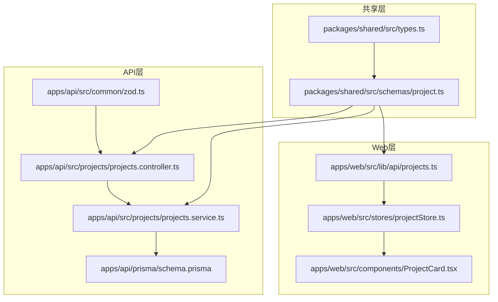
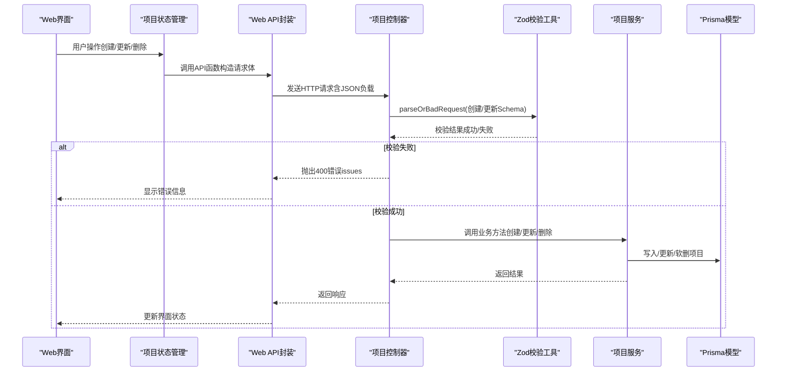
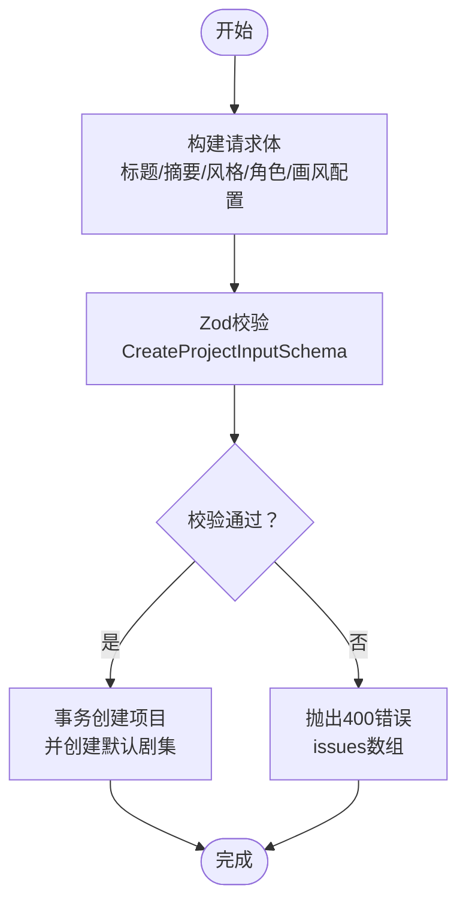
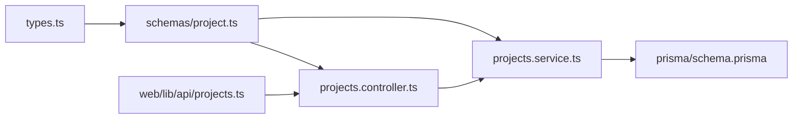

# 项目Schema (Project Schema)

<cite>
**本文引用的文件**
- [packages/shared/src/schemas/project.ts](file://packages/shared/src/schemas/project.ts)
- [packages/shared/src/schemas/index.ts](file://packages/shared/src/schemas/index.ts)
- [packages/shared/src/types.ts](file://packages/shared/src/types.ts)
- [apps/api/src/projects/projects.controller.ts](file://apps/api/src/projects/projects.controller.ts)
- [apps/api/src/projects/projects.service.ts](file://apps/api/src/projects/projects.service.ts)
- [apps/api/src/common/zod.ts](file://apps/api/src/common/zod.ts)
- [apps/api/prisma/schema.prisma](file://apps/api/prisma/schema.prisma)
- [apps/web/src/lib/api/projects.ts](file://apps/web/src/lib/api/projects.ts)
- [apps/web/src/stores/projectStore.ts](file://apps/web/src/stores/projectStore.ts)
- [apps/web/src/components/ProjectCard.tsx](file://apps/web/src/components/ProjectCard.tsx)
</cite>

## 目录

1. [简介](#简介)
2. [项目结构](#项目结构)
3. [核心组件](#核心组件)
4. [架构总览](#架构总览)
5. [详细组件分析](#详细组件分析)
6. [依赖关系分析](#依赖关系分析)
7. [性能考量](#性能考量)
8. [故障排查指南](#故障排查指南)
9. [结论](#结论)

## 简介

本文件围绕项目实体的Zod Schema定义进行系统性技术说明，覆盖以下方面：

- 项目基本信息、创作状态、元数据字段的验证规则
- 项目状态枚举、时间戳字段、字符串长度限制、数值范围验证等约束
- 项目Schema与其他实体（场景、角色、剧集）的关系映射
- 项目创建、更新、删除操作的Schema验证流程与常见错误处理
- Schema在项目生命周期管理中的作用与数据一致性保障机制

## 项目结构

项目Schema位于共享包中，前后端均复用同一套Schema定义，确保一致的输入校验与类型推断。核心文件分布如下：

- 共享Schema：packages/shared/src/schemas/project.ts
- 类型定义：packages/shared/src/types.ts（包含工作流状态、场景步骤等枚举）
- API控制器与服务：apps/api/src/projects/\*（负责HTTP请求解析、业务逻辑与数据库交互）
- Web端API封装：apps/web/src/lib/api/projects.ts（负责前端调用与参数构造）
- Web端状态管理：apps/web/src/stores/projectStore.ts（负责前端本地状态与持久化）

图表来源

- [packages/shared/src/schemas/project.ts](file://packages/shared/src/schemas/project.ts#L1-L33)
- [packages/shared/src/types.ts](file://packages/shared/src/types.ts#L1-L77)
- [apps/api/src/projects/projects.controller.ts](file://apps/api/src/projects/projects.controller.ts#L1-L43)
- [apps/api/src/projects/projects.service.ts](file://apps/api/src/projects/projects.service.ts#L1-L215)
- [apps/api/prisma/schema.prisma](file://apps/api/prisma/schema.prisma#L116-L141)
- [apps/api/src/common/zod.ts](file://apps/api/src/common/zod.ts#L1-L16)
- [apps/web/src/lib/api/projects.ts](file://apps/web/src/lib/api/projects.ts#L1-L53)
- [apps/web/src/stores/projectStore.ts](file://apps/web/src/stores/projectStore.ts#L1-L181)

章节来源

- [packages/shared/src/schemas/project.ts](file://packages/shared/src/schemas/project.ts#L1-L33)
- [packages/shared/src/schemas/index.ts](file://packages/shared/src/schemas/index.ts#L1-L11)
- [packages/shared/src/types.ts](file://packages/shared/src/types.ts#L1-L77)
- [apps/api/src/projects/projects.controller.ts](file://apps/api/src/projects/projects.controller.ts#L1-L43)
- [apps/api/src/projects/projects.service.ts](file://apps/api/src/projects/projects.service.ts#L1-L215)
- [apps/api/prisma/schema.prisma](file://apps/api/prisma/schema.prisma#L116-L141)
- [apps/api/src/common/zod.ts](file://apps/api/src/common/zod.ts#L1-L16)
- [apps/web/src/lib/api/projects.ts](file://apps/web/src/lib/api/projects.ts#L1-L53)
- [apps/web/src/stores/projectStore.ts](file://apps/web/src/stores/projectStore.ts#L1-L181)

## 核心组件

- 工作流状态枚举与场景步骤枚举：来源于共享类型定义，用于约束项目与场景的状态流转。
- 创建Schema（CreateProjectInputSchema）：定义项目创建所需的最小字段集合及长度、格式约束。
- 更新Schema（UpdateProjectInputSchema）：在创建Schema基础上扩展工作流状态、当前场景序号与步骤、上下文缓存等字段。
- 控制器与服务：控制器负责HTTP请求解析与鉴权，服务负责业务逻辑与数据库交互，并在更新时自动记录叙事因果链版本。
- 数据库模型：Prisma模型定义了项目表及其与剧集、场景、角色、世界观等实体的外键关系。

章节来源

- [packages/shared/src/schemas/project.ts](file://packages/shared/src/schemas/project.ts#L4-L28)
- [packages/shared/src/types.ts](file://packages/shared/src/types.ts#L6-L35)
- [apps/api/src/projects/projects.controller.ts](file://apps/api/src/projects/projects.controller.ts#L19-L39)
- [apps/api/src/projects/projects.service.ts](file://apps/api/src/projects/projects.service.ts#L112-L198)
- [apps/api/prisma/schema.prisma](file://apps/api/prisma/schema.prisma#L116-L141)

## 架构总览

下图展示了项目Schema在端到端流程中的作用：前端通过API封装构造请求体，控制器使用Zod进行严格校验，服务层执行业务逻辑并持久化到数据库，同时在必要时触发版本记录。

图表来源

- [apps/web/src/lib/api/projects.ts](file://apps/web/src/lib/api/projects.ts#L14-L46)
- [apps/api/src/projects/projects.controller.ts](file://apps/api/src/projects/projects.controller.ts#L19-L39)
- [apps/api/src/common/zod.ts](file://apps/api/src/common/zod.ts#L4-L13)
- [apps/api/src/projects/projects.service.ts](file://apps/api/src/projects/projects.service.ts#L112-L212)
- [apps/api/prisma/schema.prisma](file://apps/api/prisma/schema.prisma#L116-L141)

## 详细组件分析

### 1) 项目Schema定义与约束

- 工作流状态与场景步骤
  - 工作流状态枚举：包含从“收集资料”到“导出”的完整流程，用于驱动项目进度与界面状态。
  - 场景步骤枚举：包含场景描述、关键帧提示、运动提示、对白等创作阶段。
- 创建Schema（CreateProjectInputSchema）
  - id：可选，字符串，长度1~120，仅允许字母数字、下划线、连字符；若提供需唯一。
  - title：必填，长度1~120。
  - summary/protagonist/style：可选，长度0~2000，默认空字符串。
  - artStyleConfig：可选，任意JSON结构，用于存储画风配置。
- 更新Schema（UpdateProjectInputSchema）
  - 继承创建Schema的字段，部分字段变为可选。
  - 新增：workflowState（工作流状态）、currentSceneOrder（非负整数）、currentSceneStep（场景步骤）、contextCache（任意JSON）。

章节来源

- [packages/shared/src/schemas/project.ts](file://packages/shared/src/schemas/project.ts#L4-L28)
- [packages/shared/src/types.ts](file://packages/shared/src/types.ts#L6-L35)

### 2) 项目状态枚举与时间戳字段

- 工作流状态枚举（ProjectWorkflowState）
  - 定义于Prisma模型与共享类型，涵盖项目从初始化到导出的完整生命周期。
- 时间戳字段
  - createdAt/updatedAt：由Prisma默认生成与更新。
  - deletedAt：软删除标记，用于保留历史数据。
- 数值范围与格式
  - currentSceneOrder：整数且非负。
  - id正则：仅允许字母数字、下划线、连字符。

章节来源

- [apps/api/prisma/schema.prisma](file://apps/api/prisma/schema.prisma#L16-L32)
- [apps/api/prisma/schema.prisma](file://apps/api/prisma/schema.prisma#L116-L130)
- [packages/shared/src/schemas/project.ts](file://packages/shared/src/schemas/project.ts#L8-L28)

### 3) 项目Schema与其他实体的关系映射

- 项目与剧集（Episode）
  - 一对多关系：一个项目包含多个剧集，按顺序排列。
  - 创建项目时会自动创建默认剧集。
- 项目与场景（Scene）
  - 一对多关系：一个项目包含多个场景，场景归属到剧集。
- 项目与角色（Character）
  - 一对多关系：一个项目包含多个角色。
- 项目与世界观元素（WorldViewElement）
  - 一对多关系：一个项目包含多个世界观元素。
- 项目与叙事因果链版本（NarrativeCausalChainVersion）
  - 一对多关系：项目可拥有多个因果链版本，用于版本追踪与回溯。

章节来源

- [apps/api/prisma/schema.prisma](file://apps/api/prisma/schema.prisma#L116-L141)
- [apps/api/prisma/schema.prisma](file://apps/api/prisma/schema.prisma#L176-L195)
- [apps/api/prisma/schema.prisma](file://apps/api/prisma/schema.prisma#L197-L233)
- [apps/api/prisma/schema.prisma](file://apps/api/prisma/schema.prisma#L235-L257)
- [apps/api/prisma/schema.prisma](file://apps/api/prisma/schema.prisma#L259-L273)
- [apps/api/prisma/schema.prisma](file://apps/api/prisma/schema.prisma#L143-L174)

### 4) 项目创建、更新、删除的Schema验证流程

- 创建流程
  - 前端通过API封装构造请求体，包含title、summary、style、protagonist、artStyleConfig等字段。
  - 控制器使用parseOrBadRequest对CreateProjectInputSchema进行校验，失败抛出400错误。
  - 服务层在事务中创建项目，并自动创建默认剧集。
- 更新流程
  - 前端发送部分字段更新，控制器同样使用parseOrBadRequest对UpdateProjectInputSchema进行校验。
  - 服务层根据传入字段动态更新项目；若检测到叙事因果链发生推进或变更，自动写入版本记录。
- 删除流程
  - 前端调用删除接口，服务层执行软删除（设置deletedAt）。

图表来源

- [apps/web/src/lib/api/projects.ts](file://apps/web/src/lib/api/projects.ts#L14-L24)
- [apps/api/src/projects/projects.controller.ts](file://apps/api/src/projects/projects.controller.ts#L19-L23)
- [apps/api/src/common/zod.ts](file://apps/api/src/common/zod.ts#L4-L13)
- [apps/api/src/projects/projects.service.ts](file://apps/api/src/projects/projects.service.ts#L112-L139)

章节来源

- [apps/web/src/lib/api/projects.ts](file://apps/web/src/lib/api/projects.ts#L14-L24)
- [apps/api/src/projects/projects.controller.ts](file://apps/api/src/projects/projects.controller.ts#L19-L23)
- [apps/api/src/common/zod.ts](file://apps/api/src/common/zod.ts#L4-L13)
- [apps/api/src/projects/projects.service.ts](file://apps/api/src/projects/projects.service.ts#L112-L139)

### 5) 常见验证错误与解决方案

- 字段缺失或类型不符
  - 现象：title未提供或非字符串；id格式非法；workflowState不在枚举内。
  - 解决：确保必填字段存在且类型正确；id仅使用允许字符；使用预定义枚举值。
- 长度超限
  - 现象：title超过120字符；summary/protagonist/style超过2000字符。
  - 解决：截断或提示用户缩短内容。
- 数值范围错误
  - 现象：currentSceneOrder为负数或非整数。
  - 解决：确保为非负整数。
- 上下文缓存格式问题
  - 现象：contextCache为无效JSON。
  - 解决：确保为合法JSON对象；若为空则省略该字段。

章节来源

- [packages/shared/src/schemas/project.ts](file://packages/shared/src/schemas/project.ts#L7-L28)
- [apps/api/src/common/zod.ts](file://apps/api/src/common/zod.ts#L4-L13)

### 6) Schema在项目生命周期管理中的作用与一致性保障

- 输入一致性
  - 前后端共享Schema，避免因类型差异导致的数据不一致。
- 状态机约束
  - 工作流状态枚举与场景步骤枚举确保项目与场景的状态变化符合预期。
- 版本追踪
  - 更新时检测叙事因果链变更并自动写入版本，保证创作过程可追溯。
- 软删除与时间戳
  - 软删除保留历史，时间戳统一格式，便于统计与审计。

章节来源

- [packages/shared/src/schemas/project.ts](file://packages/shared/src/schemas/project.ts#L4-L28)
- [packages/shared/src/types.ts](file://packages/shared/src/types.ts#L6-L35)
- [apps/api/src/projects/projects.service.ts](file://apps/api/src/projects/projects.service.ts#L171-L196)
- [apps/api/prisma/schema.prisma](file://apps/api/prisma/schema.prisma#L116-L130)

## 依赖关系分析

- 共享Schema依赖共享类型（WORKFLOW_STATES、SCENE_STEPS），控制器与服务依赖共享Schema，Web API封装依赖共享类型与Schema的推断类型。
- Prisma模型定义了项目与其子实体的外键关系，服务层在业务逻辑中体现这些关系。

图表来源

- [packages/shared/src/types.ts](file://packages/shared/src/types.ts#L6-L35)
- [packages/shared/src/schemas/project.ts](file://packages/shared/src/schemas/project.ts#L1-L33)
- [apps/api/src/projects/projects.controller.ts](file://apps/api/src/projects/projects.controller.ts#L1-L43)
- [apps/api/src/projects/projects.service.ts](file://apps/api/src/projects/projects.service.ts#L1-L215)
- [apps/api/prisma/schema.prisma](file://apps/api/prisma/schema.prisma#L116-L141)
- [apps/web/src/lib/api/projects.ts](file://apps/web/src/lib/api/projects.ts#L1-L53)

章节来源

- [packages/shared/src/schemas/project.ts](file://packages/shared/src/schemas/project.ts#L1-L33)
- [packages/shared/src/types.ts](file://packages/shared/src/types.ts#L1-L77)
- [apps/api/src/projects/projects.controller.ts](file://apps/api/src/projects/projects.controller.ts#L1-L43)
- [apps/api/src/projects/projects.service.ts](file://apps/api/src/projects/projects.service.ts#L1-L215)
- [apps/api/prisma/schema.prisma](file://apps/api/prisma/schema.prisma#L116-L141)
- [apps/web/src/lib/api/projects.ts](file://apps/web/src/lib/api/projects.ts#L1-L53)

## 性能考量

- 校验前置：在API入口处进行Zod校验，尽早失败，减少无效数据库访问。
- 事务写入：创建项目时在单事务中完成项目与默认剧集的创建，保证原子性。
- 最小更新：更新时仅对传入字段进行写入，减少不必要的数据库写操作。
- 统计聚合：列表查询时批量统计各项目指标，避免N+1查询问题。

章节来源

- [apps/api/src/common/zod.ts](file://apps/api/src/common/zod.ts#L4-L13)
- [apps/api/src/projects/projects.service.ts](file://apps/api/src/projects/projects.service.ts#L112-L139)
- [apps/api/src/projects/projects.service.ts](file://apps/api/src/projects/projects.service.ts#L55-L102)

## 故障排查指南

- 400错误（Validation failed）
  - 检查请求体是否满足CreateProjectInputSchema/UpdateProjectInputSchema约束。
  - 关注issues数组中的具体字段与原因。
- 404错误（Project not found）
  - 确认项目ID是否存在且属于当前团队，且未被软删除。
- 版本未记录
  - 确认contextCache中包含有效的叙事因果链结构与更新时间戳。
  - 检查服务层tryCreateVersion调用是否被异常捕获。

章节来源

- [apps/api/src/common/zod.ts](file://apps/api/src/common/zod.ts#L4-L13)
- [apps/api/src/projects/projects.controller.ts](file://apps/api/src/projects/projects.controller.ts#L36-L39)
- [apps/api/src/projects/projects.service.ts](file://apps/api/src/projects/projects.service.ts#L141-L198)

## 结论

项目Schema通过严格的字段约束、枚举约束与前后端共享设计，确保了项目数据在全生命周期内的完整性与一致性。配合Prisma模型的外键关系与服务层的事务处理，项目创建、更新、删除流程具备明确的边界与可观测性。在实际开发中，应遵循Schema约束与错误处理规范，以获得最佳的用户体验与数据质量。
