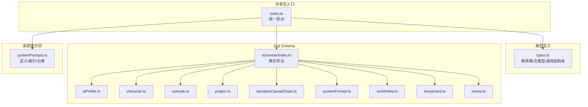
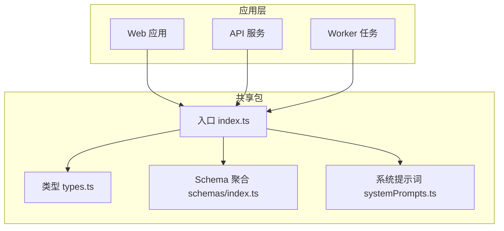
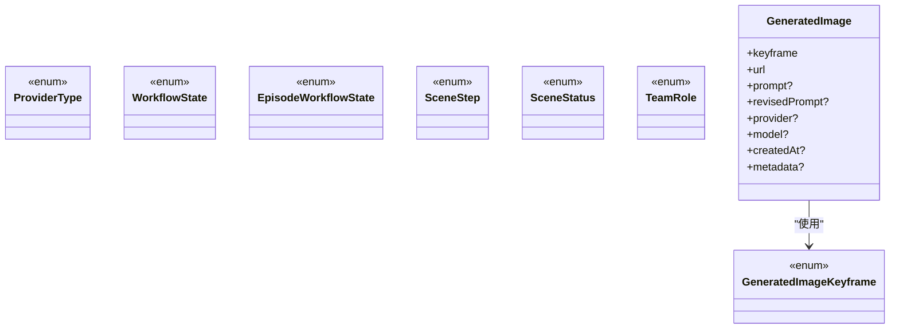
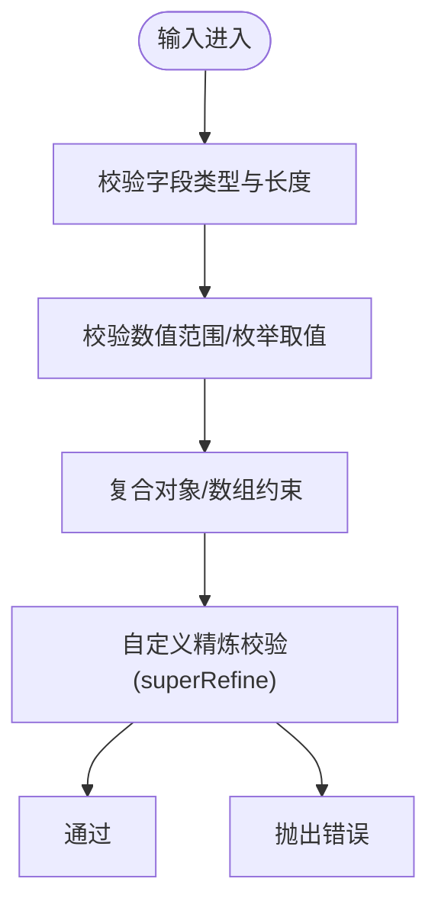
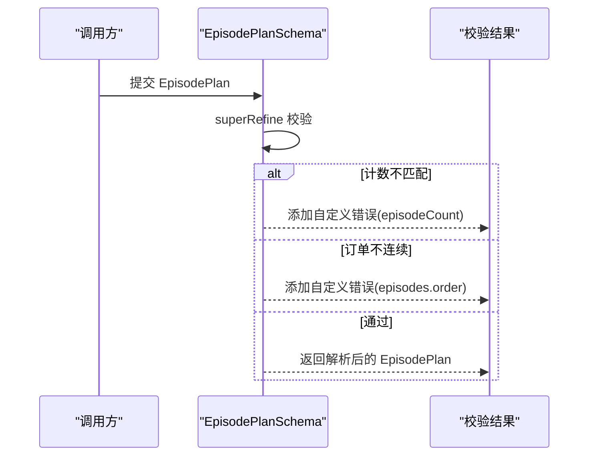
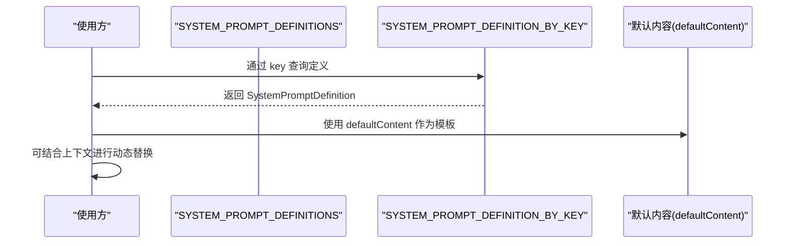
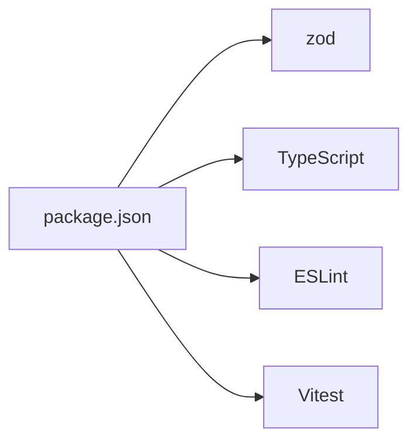

# 共享包 (packages/shared)

<cite>
**本文引用的文件**   
- [packages/shared/src/index.ts](file://packages/shared/src/index.ts)
- [packages/shared/src/types.ts](file://packages/shared/src/types.ts)
- [packages/shared/src/systemPrompts.ts](file://packages/shared/src/systemPrompts.ts)
- [packages/shared/src/schemas/index.ts](file://packages/shared/src/schemas/index.ts)
- [packages/shared/src/schemas/aiProfile.ts](file://packages/shared/src/schemas/aiProfile.ts)
- [packages/shared/src/schemas/character.ts](file://packages/shared/src/schemas/character.ts)
- [packages/shared/src/schemas/episode.ts](file://packages/shared/src/schemas/episode.ts)
- [packages/shared/src/schemas/project.ts](file://packages/shared/src/schemas/project.ts)
- [packages/shared/src/schemas/narrativeCausalChain.ts](file://packages/shared/src/schemas/narrativeCausalChain.ts)
- [packages/shared/src/schemas/systemPrompt.ts](file://packages/shared/src/schemas/systemPrompt.ts)
- [packages/shared/src/schemas/worldView.ts](file://packages/shared/src/schemas/worldView.ts)
- [packages/shared/src/schemas/storyboard.ts](file://packages/shared/src/schemas/storyboard.ts)
- [packages/shared/src/schemas/scene.ts](file://packages/shared/src/schemas/scene.ts)
- [packages/shared/src/schemas/episode.test.ts](file://packages/shared/src/schemas/episode.test.ts)
- [packages/shared/src/systemPrompts.test.ts](file://packages/shared/src/systemPrompts.test.ts)
- [packages/shared/package.json](file://packages/shared/package.json)
- [packages/shared/tsconfig.json](file://packages/shared/tsconfig.json)
- [packages/shared/vitest.config.ts](file://packages/shared/vitest.config.ts)
</cite>

## 目录

1. [简介](#简介)
2. [项目结构](#项目结构)
3. [核心组件](#核心组件)
4. [架构总览](#架构总览)
5. [详细组件分析](#详细组件分析)
6. [依赖分析](#依赖分析)
7. [性能考虑](#性能考虑)
8. [故障排查指南](#故障排查指南)
9. [结论](#结论)
10. [附录](#附录)

## 简介

本文件为 AIXSSS 共享包（packages/shared）的全面技术文档，面向前端、后端与 Worker 三方共同使用的类型与验证体系。文档重点涵盖：

- 前后端共享类型定义与导出
- Zod Schema 验证与接口规范
- TypeScript 类型系统设计与数据模型统一
- 系统提示词的组织结构、模板管理与动态生成机制
- 工具函数库、通用验证函数与辅助方法
- 模块化设计原则、依赖关系与版本管理策略
- 实际使用示例、最佳实践与常见问题解决方案
- 扩展指南与自定义开发指导

## 项目结构

共享包采用“类型 + Schema + 系统提示词”的三层结构，通过统一入口导出，供 web/api/worker 复用。

图表来源

- [packages/shared/src/index.ts](file://packages/shared/src/index.ts#L1-L6)
- [packages/shared/src/types.ts](file://packages/shared/src/types.ts#L1-L77)
- [packages/shared/src/schemas/index.ts](file://packages/shared/src/schemas/index.ts#L1-L11)
- [packages/shared/src/systemPrompts.ts](file://packages/shared/src/systemPrompts.ts#L1-L22)

章节来源

- [packages/shared/src/index.ts](file://packages/shared/src/index.ts#L1-L6)
- [packages/shared/src/types.ts](file://packages/shared/src/types.ts#L1-L77)
- [packages/shared/src/schemas/index.ts](file://packages/shared/src/schemas/index.ts#L1-L11)
- [packages/shared/src/systemPrompts.ts](file://packages/shared/src/systemPrompts.ts#L1-L22)

## 核心组件

- 统一类型导出：通过入口文件集中导出 types 与 schemas，确保跨应用一致性。
- Zod Schema 验证：围绕实体输入/输出建立强类型与运行时校验，覆盖业务边界、数值范围与组合约束。
- 系统提示词：以结构化定义承载工作流提示词模板，支持分类、索引与可解析内容约束。

章节来源

- [packages/shared/src/index.ts](file://packages/shared/src/index.ts#L1-L6)
- [packages/shared/src/types.ts](file://packages/shared/src/types.ts#L1-L77)
- [packages/shared/src/schemas/index.ts](file://packages/shared/src/schemas/index.ts#L1-L11)
- [packages/shared/src/systemPrompts.ts](file://packages/shared/src/systemPrompts.ts#L1-L22)

## 架构总览

共享包在系统中的定位与交互如下：

图表来源

- [packages/shared/src/index.ts](file://packages/shared/src/index.ts#L1-L6)
- [packages/shared/src/types.ts](file://packages/shared/src/types.ts#L1-L77)
- [packages/shared/src/schemas/index.ts](file://packages/shared/src/schemas/index.ts#L1-L11)
- [packages/shared/src/systemPrompts.ts](file://packages/shared/src/systemPrompts.ts#L1-L22)

## 详细组件分析

### 类型系统与数据模型统一

- ProviderType、WorkflowState、EpisodeWorkflowState、SceneStep、SceneStatus、GeneratedImageKeyframe、TeamRole 等枚举/联合类型，确保跨模块一致的取值域。
- GeneratedImage 作为统一的生成媒体元数据结构，包含 keyframe、url、prompt、provider、model、createdAt、metadata 等字段，便于统一处理与持久化。
- 通过 z.enum([...]) 与常量数组配合，实现“编译期类型安全 + 运行期枚举校验”。

图表来源

- [packages/shared/src/types.ts](file://packages/shared/src/types.ts#L3-L77)

章节来源

- [packages/shared/src/types.ts](file://packages/shared/src/types.ts#L1-L77)

### Zod Schema 验证与接口规范

#### 项目与场景工作流

- WorkflowStateSchema、SceneStepSchema：工作流状态与步骤的强类型枚举。
- CreateProjectInputSchema、UpdateProjectInputSchema：项目输入/更新的字段约束与可选状态同步。
- CreateSceneInputSchema、UpdateSceneInputSchema：场景输入/更新的字段约束，包含 generatedImages、generatedVideos、storyboard 相关 JSON 字段与状态字段。

图表来源

- [packages/shared/src/schemas/project.ts](file://packages/shared/src/schemas/project.ts#L4-L28)
- [packages/shared/src/schemas/scene.ts](file://packages/shared/src/schemas/scene.ts#L26-L55)

章节来源

- [packages/shared/src/schemas/project.ts](file://packages/shared/src/schemas/project.ts#L1-L33)
- [packages/shared/src/schemas/scene.ts](file://packages/shared/src/schemas/scene.ts#L1-L56)

#### 剧集与核心表达

- EpisodeWorkflowStateSchema：剧集工作流状态枚举。
- EpisodePlanSchema：剧集规划的复合校验，包括 episodeCount 与 episodes.length 一致性、episodes.order 连续性。
- CoreExpressionSchema：核心表达的结构化约束，如 emotionalArc 固定长度。

图表来源

- [packages/shared/src/schemas/episode.ts](file://packages/shared/src/schemas/episode.ts#L38-L64)

章节来源

- [packages/shared/src/schemas/episode.ts](file://packages/shared/src/schemas/episode.ts#L1-L80)
- [packages/shared/src/schemas/episode.test.ts](file://packages/shared/src/schemas/episode.test.ts#L1-L72)

#### 世界观与角色

- WorldViewTypeSchema：世界观元素类型枚举。
- CreateCharacterInputSchema、UpdateCharacterInputSchema：角色输入/更新字段约束，含默认值与可选字段。
- CreateWorldViewElementInputSchema、UpdateWorldViewElementInputSchema：世界观元素输入/更新字段约束。

章节来源

- [packages/shared/src/schemas/worldView.ts](file://packages/shared/src/schemas/worldView.ts#L1-L26)
- [packages/shared/src/schemas/character.ts](file://packages/shared/src/schemas/character.ts#L1-L32)

#### AI 配置与定价

- ProviderTypeSchema：供应商类型枚举。
- AIPricingSchema：定价结构的货币、单价范围约束。
- CreateAIProfileInputSchema、UpdateAIProfileInputSchema：AI 配置输入/更新，包含基础参数、推理强度、可选定价与模型选择。

章节来源

- [packages/shared/src/schemas/aiProfile.ts](file://packages/shared/src/schemas/aiProfile.ts#L1-L51)

#### 叙事因果链（增强版）

- Phase1/2/3/4 各阶段 Schema：通过 preprocess/coerce 实现字符串到数字/枚举的容错转换，支持中文映射与数组分隔符兼容。
- NarrativeCausalChainSchema：完整因果链的版本、完成阶段、校验状态与各阶段数据的统一结构。
- CAUSAL_CHAIN_PHASES：阶段名称映射。

章节来源

- [packages/shared/src/schemas/narrativeCausalChain.ts](file://packages/shared/src/schemas/narrativeCausalChain.ts#L1-L270)

#### 分镜故事板

- StoryboardGroupIdSchema、StoryboardCameraModeSchema、StoryboardGroupStatusSchema：故事板分组标识、相机模式与状态枚举。
- StoryboardPanelSchema、ContinuityStateSchema、SceneBibleSchema：面板、连续性状态与场景圣经结构。
- StoryboardPlanSchema、StoryboardGroupDraftSchema、StoryboardGroupRenderSchema、StoryboardGroupSchema、StoryboardGroupsJsonSchema：完整故事板计划与渲染结构。

章节来源

- [packages/shared/src/schemas/storyboard.ts](file://packages/shared/src/schemas/storyboard.ts#L1-L180)

#### 系统提示词输入

- UpdateSystemPromptInputSchema：系统提示词更新输入的最小/最大长度与 trim 约束。

章节来源

- [packages/shared/src/schemas/systemPrompt.ts](file://packages/shared/src/schemas/systemPrompt.ts#L1-L9)

### 系统提示词组织结构、模板管理与动态生成机制

- SystemPromptCategory 与 SystemPromptDefinition：定义提示词的分类与结构，包含 key、title、description、category、defaultContent。
- SYSTEM_PROMPT_DEFINITIONS：内置提示词清单，覆盖工作流、动作节拍、因果链、UI 等类别。
- SYSTEM_PROMPT_DEFINITION_BY_KEY：按 key 索引的提示词字典，便于快速检索与替换。
- 测试保障：通过单元测试确保 key 唯一、索引正确与字段完整性。

图表来源

- [packages/shared/src/systemPrompts.ts](file://packages/shared/src/systemPrompts.ts#L1-L22)

章节来源

- [packages/shared/src/systemPrompts.ts](file://packages/shared/src/systemPrompts.ts#L1-L1395)
- [packages/shared/src/systemPrompts.test.ts](file://packages/shared/src/systemPrompts.test.ts#L1-L21)

### 工具函数库、通用验证函数与辅助方法

- 通用验证函数：通过 zod 的 parse/parseStrict/safeParse 与自定义 superRefine 实现强约束与容错处理。
- 辅助方法：preprocess/coerce 用于字符串到数字/枚举/布尔的转换，字符串数组分隔兼容（中文顿号/逗号/顿号）。
- 类型推断：使用 z.infer<typeof Schema> 获取类型别名，减少重复声明。

章节来源

- [packages/shared/src/schemas/narrativeCausalChain.ts](file://packages/shared/src/schemas/narrativeCausalChain.ts#L29-L91)
- [packages/shared/src/schemas/narrativeCausalChain.ts](file://packages/shared/src/schemas/narrativeCausalChain.ts#L127-L152)

### 模块化设计原则、依赖关系与版本管理策略

- 模块化：types 与 schemas 分离，types 负责类型，schemas 负责验证；systemPrompts 单独模块，便于独立维护。
- 依赖关系：入口 index.ts 聚合导出，避免循环依赖；schema 间通过 types.ts 的枚举/联合类型耦合。
- 版本管理：NarrativeCausalChainSchema 包含 version 字段与 validationStatus，便于数据迁移与状态跟踪。

章节来源

- [packages/shared/src/index.ts](file://packages/shared/src/index.ts#L1-L6)
- [packages/shared/src/schemas/narrativeCausalChain.ts](file://packages/shared/src/schemas/narrativeCausalChain.ts#L3-L4)
- [packages/shared/src/schemas/narrativeCausalChain.ts](file://packages/shared/src/schemas/narrativeCausalChain.ts#L175-L182)

## 依赖分析

- 运行时依赖：zod（版本 ^3.25.76）
- 开发依赖：TypeScript、ESLint、Vitest、globals 等
- 构建配置：tsconfig.json 指定 NodeNext 模块解析与 ES2022 目标
- 测试配置：vitest.config.ts 指定测试范围与环境

图表来源

- [packages/shared/package.json](file://packages/shared/package.json#L18-L30)

章节来源

- [packages/shared/package.json](file://packages/shared/package.json#L1-L32)
- [packages/shared/tsconfig.json](file://packages/shared/tsconfig.json#L1-L19)
- [packages/shared/vitest.config.ts](file://packages/shared/vitest.config.ts#L1-L12)

## 性能考虑

- Schema 精细化：通过精确的字段长度、数值范围与枚举约束，减少无效数据传输与后续处理开销。
- 预处理与容错：coerce/preprocess 将字符串转换为期望类型，降低外部输入不确定性带来的校验失败成本。
- 分阶段 Schema：叙事因果链分阶段生成，降低单次生成复杂度，提高成功率与稳定性。

## 故障排查指南

- EpisodePlan 校验失败
  - 现象：episodeCount 与 episodes.length 不一致，或 episodes.order 非连续。
  - 处理：确保计数与数组长度一致，且 order 从 1..N 连续。
  - 参考
    - [packages/shared/src/schemas/episode.ts](file://packages/shared/src/schemas/episode.ts#L44-L64)
    - [packages/shared/src/schemas/episode.test.ts](file://packages/shared/src/schemas/episode.test.ts#L34-L55)

- CoreExpression 校验失败
  - 现象：emotionalArc 长度不是 4。
  - 处理：确保数组长度为 4。
  - 参考
    - [packages/shared/src/schemas/episode.ts](file://packages/shared/src/schemas/episode.ts#L68-L76)
    - [packages/shared/src/schemas/episode.test.ts](file://packages/shared/src/schemas/episode.test.ts#L57-L69)

- 系统提示词索引异常
  - 现象：key 重复或索引不一致。
  - 处理：确保 key 唯一，检查 SYSTEM_PROMPT_DEFINITION_BY_KEY 与定义列表一致性。
  - 参考
    - [packages/shared/src/systemPrompts.test.ts](file://packages/shared/src/systemPrompts.test.ts#L5-L18)

## 结论

共享包通过“类型 + Zod Schema + 系统提示词”的三位一体设计，实现了跨应用的数据模型统一与强约束验证。其模块化与版本化策略为后续扩展与演进提供了坚实基础。建议在新功能接入时遵循现有命名与约束风格，优先使用既有 Schema 与类型，确保一致性与可维护性。

## 附录

### 使用示例与最佳实践

- 输入校验
  - 使用对应 Schema 的 parse/parseStrict/safeParse，结合自定义错误处理。
  - 示例路径
    - [packages/shared/src/schemas/episode.ts](file://packages/shared/src/schemas/episode.ts#L38-L64)
    - [packages/shared/src/schemas/aiProfile.ts](file://packages/shared/src/schemas/aiProfile.ts#L13-L41)

- 类型推断
  - 通过 z.infer<typeof Schema> 获取类型别名，避免重复定义。
  - 示例路径
    - [packages/shared/src/schemas/scene.ts](file://packages/shared/src/schemas/scene.ts#L51-L55)

- 系统提示词替换
  - 通过 SYSTEM_PROMPT_DEFINITION_BY_KEY 获取定义，再以 defaultContent 为基础进行上下文替换。
  - 示例路径
    - [packages/shared/src/systemPrompts.ts](file://packages/shared/src/systemPrompts.ts#L1-L22)

### 扩展指南与自定义开发

- 新增 Schema
  - 在 schemas 目录下新建文件，定义 Schema 与类型别名，最后在 schemas/index.ts 聚合导出。
  - 示例路径
    - [packages/shared/src/schemas/index.ts](file://packages/shared/src/schemas/index.ts#L1-L11)

- 新增系统提示词
  - 在 systemPrompts.ts 中添加新的 SystemPromptDefinition，确保 key 唯一并加入 SYSTEM_PROMPT_DEFINITIONS。
  - 示例路径
    - [packages/shared/src/systemPrompts.ts](file://packages/shared/src/systemPrompts.ts#L22-L44)

- 版本管理
  - 在 Schema 中维护版本字段与校验状态，便于数据迁移与兼容性判断。
  - 示例路径
    - [packages/shared/src/schemas/narrativeCausalChain.ts](file://packages/shared/src/schemas/narrativeCausalChain.ts#L175-L182)
