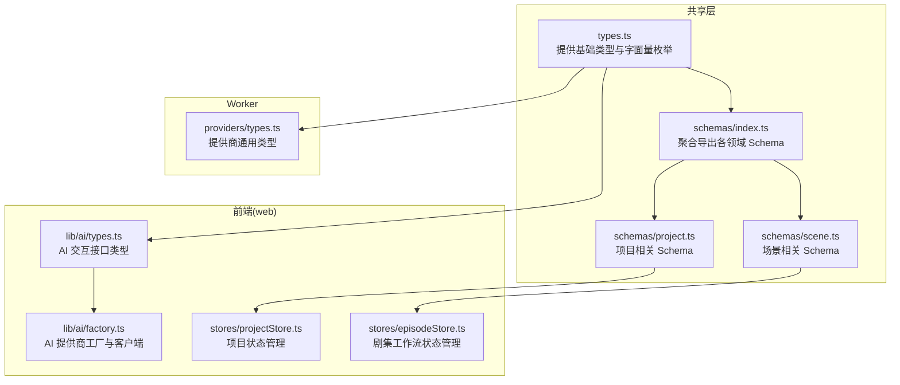
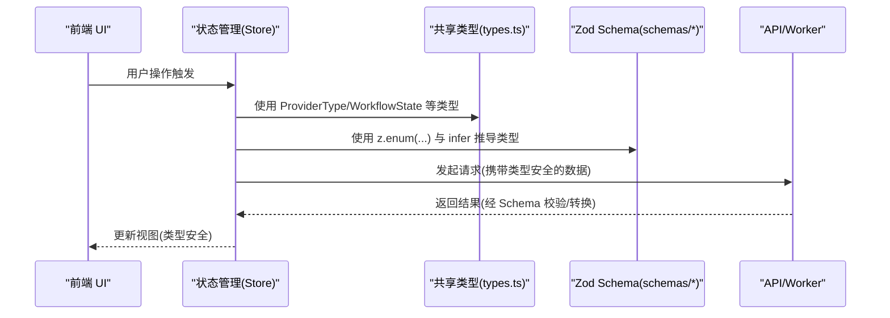
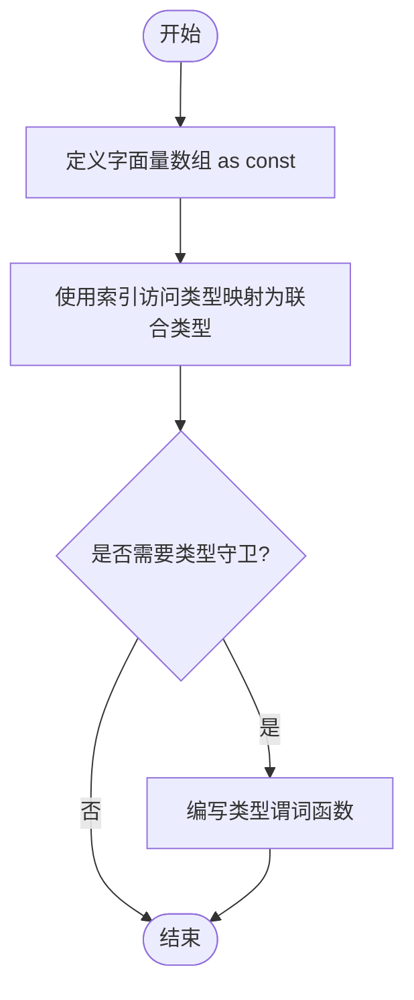
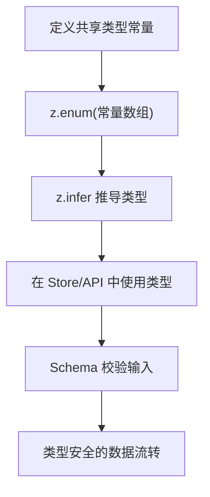
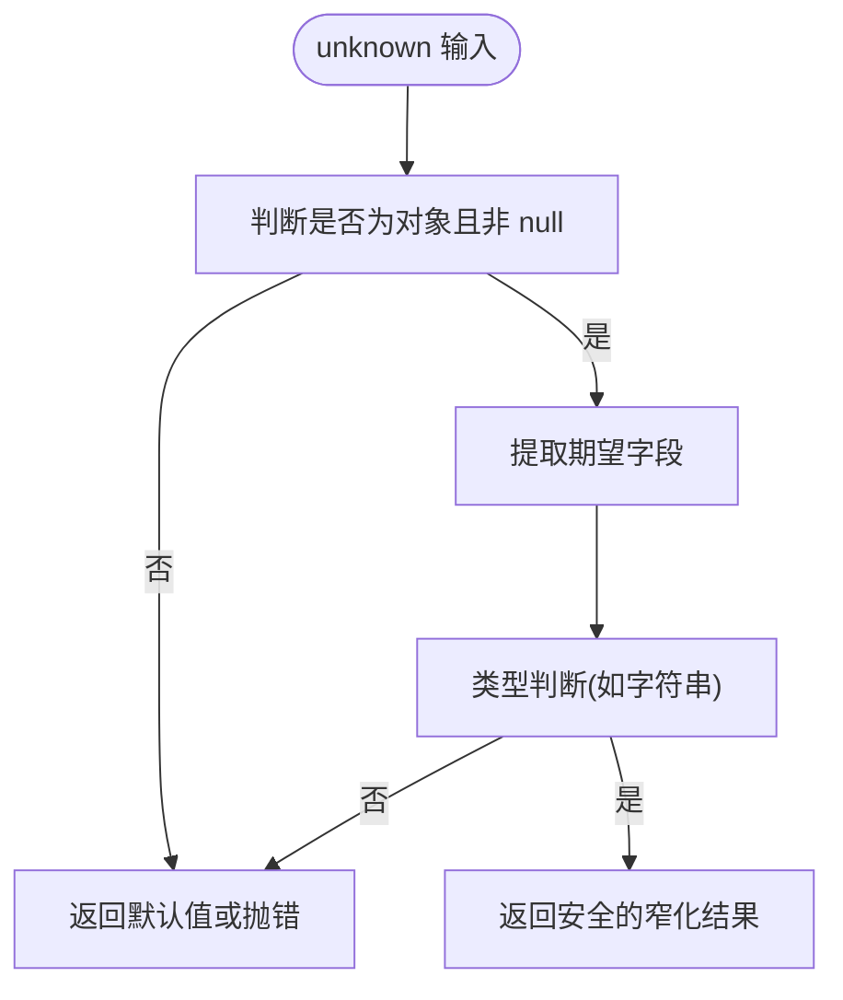
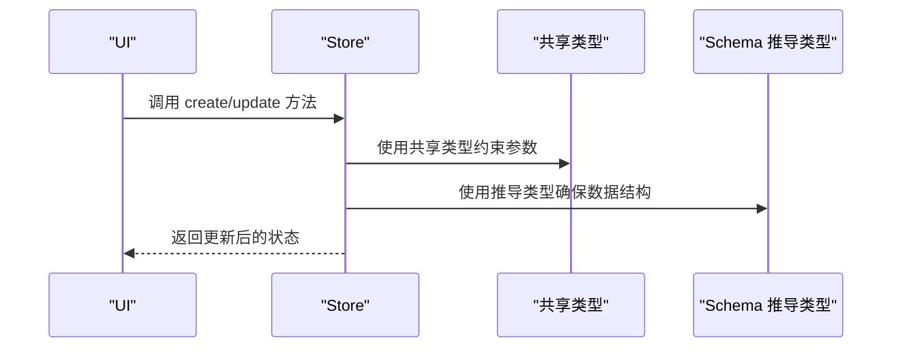
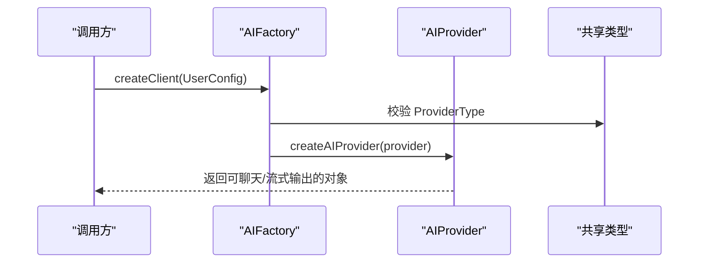
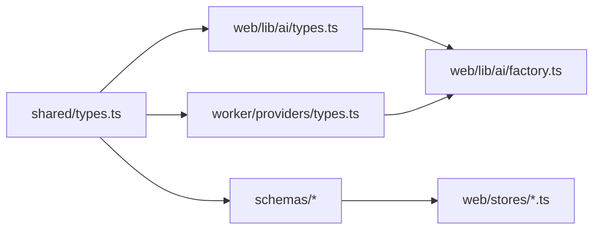

# 类型定义 (types.ts)

<cite>
**本文引用的文件**
- [packages/shared/src/types.ts](file://packages/shared/src/types.ts)
- [packages/shared/src/index.ts](file://packages/shared/src/index.ts)
- [packages/shared/src/schemas/index.ts](file://packages/shared/src/schemas/index.ts)
- [packages/shared/src/schemas/project.ts](file://packages/shared/src/schemas/project.ts)
- [packages/shared/src/schemas/scene.ts](file://packages/shared/src/schemas/scene.ts)
- [apps/web/src/lib/ai/types.ts](file://apps/web/src/lib/ai/types.ts)
- [apps/worker/src/providers/types.ts](file://apps/worker/src/providers/types.ts)
- [apps/web/src/lib/ai/factory.ts](file://apps/web/src/lib/ai/factory.ts)
- [apps/api/src/jobs/planningValidation.ts](file://apps/api/src/jobs/planningValidation.ts)
- [apps/web/src/stores/projectStore.ts](file://apps/web/src/stores/projectStore.ts)
- [apps/web/src/stores/episodeStore.ts](file://apps/web/src/stores/episodeStore.ts)
</cite>

## 目录

1. [引言](#引言)
2. [项目结构](#项目结构)
3. [核心组件](#核心组件)
4. [架构总览](#架构总览)
5. [详细组件分析](#详细组件分析)
6. [依赖分析](#依赖分析)
7. [性能考量](#性能考量)
8. [故障排查指南](#故障排查指南)
9. [结论](#结论)
10. [附录](#附录)

## 引言

本文件围绕 AIXSSS 的共享类型定义进行系统化技术说明，重点聚焦于 packages/shared 包中的共享领域类型与 Zod Schema 的协同设计。文档将从 TypeScript 类型系统的设计理念出发，深入解析基础类型、联合类型、字面量元组映射类型、类型守卫与类型推导的应用方式；并结合实际业务场景（工作流状态、场景步骤、场景状态、角色权限等），阐述类型安全最佳实践、类型兼容性与向后兼容性策略，以及模块化组织与命名约定。读者可据此理解跨前端、API、Worker 三端共享的类型体系如何支撑工程稳定性与可维护性。

## 项目结构

共享类型与 Schema 主要位于 packages/shared 包内，采用“类型常量 + 类型别名 + Zod 枚举”的组合模式，既保证了编译期类型安全，又通过运行时 Schema 实现数据校验与转换。前端与 Worker 端在各自目录下扩展了与具体实现相关的类型，形成“共享类型 + 专用类型”的分层设计。

图表来源

- [packages/shared/src/types.ts](file://packages/shared/src/types.ts#L1-L77)
- [packages/shared/src/schemas/index.ts](file://packages/shared/src/schemas/index.ts#L1-L11)
- [packages/shared/src/schemas/project.ts](file://packages/shared/src/schemas/project.ts#L1-L33)
- [packages/shared/src/schemas/scene.ts](file://packages/shared/src/schemas/scene.ts#L1-L56)
- [apps/web/src/lib/ai/types.ts](file://apps/web/src/lib/ai/types.ts#L1-L30)
- [apps/web/src/lib/ai/factory.ts](file://apps/web/src/lib/ai/factory.ts#L1-L98)
- [apps/web/src/stores/projectStore.ts](file://apps/web/src/stores/projectStore.ts#L1-L181)
- [apps/web/src/stores/episodeStore.ts](file://apps/web/src/stores/episodeStore.ts#L1-L504)
- [apps/worker/src/providers/types.ts](file://apps/worker/src/providers/types.ts#L1-L84)

章节来源

- [packages/shared/src/types.ts](file://packages/shared/src/types.ts#L1-L77)
- [packages/shared/src/index.ts](file://packages/shared/src/index.ts#L1-L6)
- [packages/shared/src/schemas/index.ts](file://packages/shared/src/schemas/index.ts#L1-L11)

## 核心组件

本节聚焦共享类型定义文件中的核心类型与常量，解释其设计动机与使用方式，并给出与 Schema 的对应关系。

- 供应商类型 ProviderType
  - 定义：通过字面量数组配合索引访问类型，生成严格的联合类型，确保只接受预设值。
  - 使用：贯穿前端 AI 工厂与 Worker 提供商配置，统一约束供应商来源。
  - 参考路径：[packages/shared/src/types.ts](file://packages/shared/src/types.ts#L3-L4)

- 工作流状态 WorkflowState 与剧集工作流状态 EpisodeWorkflowState
  - 定义：分别以字面量数组映射为联合类型，覆盖项目级与剧集级工作流阶段。
  - 使用：在 Store 中作为状态字段，驱动 UI 与工作流控制。
  - 参考路径：[packages/shared/src/types.ts](file://packages/shared/src/types.ts#L6-L23), [packages/shared/src/types.ts](file://packages/shared/src/types.ts#L25-L32)

- 场景步骤 SceneStep 与场景状态 SceneStatus
  - 定义：场景生成流程的阶段性与状态机枚举，配合 Schema 确保输入合法性。
  - 使用：在项目与场景 Schema 中作为可选字段出现，保障数据一致性。
  - 参考路径：[packages/shared/src/types.ts](file://packages/shared/src/types.ts#L34-L47)

- 场景演员类型 SceneCastCharacterIds
  - 定义：字符串数组别名，表示场景演员 ID 列表。
  - 使用：在场景 Schema 中作为 castCharacterIds 字段类型。
  - 参考路径：[packages/shared/src/types.ts](file://packages/shared/src/types.ts#L49)

- 生成图像关键帧 GeneratedImageKeyframe 与生成图像 GeneratedImage
  - 定义：关键帧枚举与图像结果结构，包含 URL、提示词、提供商、模型、时间戳与任意元数据。
  - 使用：在场景 Schema 中作为生成图像数组元素类型。
  - 参考路径：[packages/shared/src/types.ts](file://packages/shared/src/types.ts#L51-L73)

- 团队角色 TeamRole
  - 定义：团队成员角色枚举，用于权限控制与协作管理。
  - 参考路径：[packages/shared/src/types.ts](file://packages/shared/src/types.ts#L75-L76)

章节来源

- [packages/shared/src/types.ts](file://packages/shared/src/types.ts#L1-L77)

## 架构总览

共享类型与 Schema 的协作模式如下：共享层提供强类型常量与接口，前端与 Worker 层在此基础上扩展业务类型；Zod Schema 将运行时数据校验与类型推导结合，既保证数据正确性，又保持与编译期类型的语义一致。

图表来源

- [packages/shared/src/types.ts](file://packages/shared/src/types.ts#L1-L77)
- [packages/shared/src/schemas/project.ts](file://packages/shared/src/schemas/project.ts#L1-L33)
- [packages/shared/src/schemas/scene.ts](file://packages/shared/src/schemas/scene.ts#L1-L56)
- [apps/web/src/lib/ai/factory.ts](file://apps/web/src/lib/ai/factory.ts#L1-L98)
- [apps/web/src/stores/projectStore.ts](file://apps/web/src/stores/projectStore.ts#L1-L181)
- [apps/web/src/stores/episodeStore.ts](file://apps/web/src/stores/episodeStore.ts#L1-L504)

## 详细组件分析

### 组件一：共享类型与字面量枚举映射

- 设计要点
  - 使用 as const 与索引访问类型 (typeof X)[number] 生成精确的联合类型，避免字符串字面量漂移。
  - 将枚举值与类型一一对应，便于后续在 Switch/分支判断中实现穷尽校验。
- 典型应用
  - ProviderType 在前端工厂函数中被用作分支选择依据，确保新增供应商时必须同步更新类型与实现。
  - WorkflowState/EpisodeWorkflowState 在 Store 中作为状态字段，驱动 UI 与工作流推进。
- 复杂度与性能
  - 类型层面无运行时开销；编译期即可完成分支穷尽检查，降低运行时错误概率。
- 可能的陷阱与修复
  - 若忘记在类型常量中添加新值，会导致类型与实现不匹配，编译器会报错。
  - 解决方案：新增值时同步更新常量数组与类型别名。

图表来源

- [packages/shared/src/types.ts](file://packages/shared/src/types.ts#L3-L4)
- [packages/shared/src/types.ts](file://packages/shared/src/types.ts#L6-L23)
- [packages/shared/src/types.ts](file://packages/shared/src/types.ts#L25-L32)

章节来源

- [packages/shared/src/types.ts](file://packages/shared/src/types.ts#L1-L77)

### 组件二：Zod Schema 与类型推导

- 设计要点
  - 使用 z.enum(枚举数组) 将共享类型映射为运行时可序列化的枚举。
  - 使用 z.infer<typeof Schema> 将 Schema 推导为对应的 TypeScript 类型，实现“一份定义，双重安全”。
- 典型应用
  - 项目与场景 Schema 中使用 WorkflowState/SceneStep/SceneStatus 等枚举，确保输入合法。
  - Store 与 API 层直接消费推导出的类型，减少重复定义。
- 复杂度与性能
  - Schema 校验发生在运行时，但类型推导在编译期完成，不影响运行时性能。
- 可能的陷阱与修复
  - 若共享类型更新而 Schema 未同步，可能导致运行时校验失败。
  - 解决方案：建立同步检查清单或自动化脚本，确保类型与 Schema 保持一致。

图表来源

- [packages/shared/src/schemas/project.ts](file://packages/shared/src/schemas/project.ts#L4-L5)
- [packages/shared/src/schemas/project.ts](file://packages/shared/src/schemas/project.ts#L21-L30)
- [packages/shared/src/schemas/scene.ts](file://packages/shared/src/schemas/scene.ts#L4)
- [packages/shared/src/schemas/scene.ts](file://packages/shared/src/schemas/scene.ts#L51-L55)

章节来源

- [packages/shared/src/schemas/project.ts](file://packages/shared/src/schemas/project.ts#L1-L33)
- [packages/shared/src/schemas/scene.ts](file://packages/shared/src/schemas/scene.ts#L1-L56)

### 组件三：类型守卫与运行时校验

- 设计要点
  - 在 API 层使用类型守卫函数对未知数据进行窄化，确保后续逻辑基于安全假设执行。
  - 结合 Prisma JsonValue 与 Record<string, unknown>，实现灵活的 JSON 数据处理。
- 典型应用
  - planningValidation 中的 isRecord 与 styleFullPrompt，展示了如何在运行时安全地提取结构化信息。
- 复杂度与性能
  - 类型守卫为 O(1) 检查，开销极小；但能显著提升运行时安全性。
- 可能的陷阱与修复
  - 忽略对 null/undefined 的检查，可能导致运行时异常。
  - 解决方案：在类型守卫中明确判空与类型判断，必要时提供默认值。

图表来源

- [apps/api/src/jobs/planningValidation.ts](file://apps/api/src/jobs/planningValidation.ts#L3-L13)

章节来源

- [apps/api/src/jobs/planningValidation.ts](file://apps/api/src/jobs/planningValidation.ts#L1-L32)

### 组件四：前端 Store 与类型安全

- 设计要点
  - Store 接口显式声明状态与方法签名，结合共享类型确保状态字段的类型安全。
  - 在异步操作中，通过类型守卫与 Schema 推导类型，保证数据在进入 Store 前后保持一致。
- 典型应用
  - projectStore 与 episodeStore 使用共享类型与 Schema 推导类型，驱动工作流状态与进度展示。
- 复杂度与性能
  - Store 本身为内存态，类型安全不引入额外计算成本。
- 可能的陷阱与修复
  - 忘记在更新时设置 updatedAt 或遗漏字段，导致 UI 不一致。
  - 解决方案：在创建/更新逻辑中强制设置必要字段，并在 Store 中进行字段校验。

图表来源

- [apps/web/src/stores/projectStore.ts](file://apps/web/src/stores/projectStore.ts#L32-L44)
- [apps/web/src/stores/episodeStore.ts](file://apps/web/src/stores/episodeStore.ts#L69-L122)
- [packages/shared/src/types.ts](file://packages/shared/src/types.ts#L6-L23)

章节来源

- [apps/web/src/stores/projectStore.ts](file://apps/web/src/stores/projectStore.ts#L1-L181)
- [apps/web/src/stores/episodeStore.ts](file://apps/web/src/stores/episodeStore.ts#L1-L504)

### 组件五：AI 类型与工厂模式

- 设计要点
  - AIProviderConfig/AIRequestOptions/AIProvider 等接口统一了前端与 Worker 的交互契约。
  - 工厂函数根据 ProviderType 创建对应提供商实例，实现多供应商抽象。
- 典型应用
  - AIFactory.createClient 根据运行时配置选择本地或后端模式，确保类型安全与行为一致。
- 复杂度与性能
  - 工厂模式为 O(1) 分支选择，类型约束在编译期完成。
- 可能的陷阱与修复
  - 未设置 aiProfileId 导致后端模式初始化失败。
  - 解决方案：在工厂创建前进行配置校验，提供清晰的错误提示。

图表来源

- [apps/web/src/lib/ai/factory.ts](file://apps/web/src/lib/ai/factory.ts#L13-L28)
- [apps/web/src/lib/ai/factory.ts](file://apps/web/src/lib/ai/factory.ts#L77-L96)
- [apps/web/src/lib/ai/types.ts](file://apps/web/src/lib/ai/types.ts#L3-L29)
- [packages/shared/src/types.ts](file://packages/shared/src/types.ts#L3-L4)

章节来源

- [apps/web/src/lib/ai/factory.ts](file://apps/web/src/lib/ai/factory.ts#L1-L98)
- [apps/web/src/lib/ai/types.ts](file://apps/web/src/lib/ai/types.ts#L1-L30)

## 依赖分析

- 模块耦合
  - shared/types 为上游依赖核心，web 与 worker 两端均依赖该包提供的类型与 Schema。
  - schemas/index 聚合导出，便于上层按需导入，降低耦合度。
- 直接与间接依赖
  - Store 依赖 shared/types 与 schemas 推导类型，间接依赖 API/Worker 的实现。
  - 工厂与 AI 类型依赖 shared/types 的 ProviderType。
- 循环依赖风险
  - 当前结构为单向依赖（shared -> web/worker），未见循环依赖迹象。
- 外部依赖与集成点
  - Zod 用于运行时校验与类型推导；Prisma JsonValue 用于数据库 JSON 字段处理。

图表来源

- [packages/shared/src/types.ts](file://packages/shared/src/types.ts#L1-L77)
- [packages/shared/src/schemas/index.ts](file://packages/shared/src/schemas/index.ts#L1-L11)
- [apps/web/src/lib/ai/types.ts](file://apps/web/src/lib/ai/types.ts#L1-L30)
- [apps/worker/src/providers/types.ts](file://apps/worker/src/providers/types.ts#L1-L84)
- [apps/web/src/lib/ai/factory.ts](file://apps/web/src/lib/ai/factory.ts#L1-L98)

章节来源

- [packages/shared/src/schemas/index.ts](file://packages/shared/src/schemas/index.ts#L1-L11)

## 性能考量

- 编译期优化
  - 字面量枚举映射与类型守卫均为编译期特性，不引入运行时开销。
- 运行时开销
  - Zod 校验在输入端发生，属于一次性成本；类型推导不产生运行时代码。
- 最佳实践
  - 将昂贵的校验集中在入口（Store/API），并在内部使用已验证的类型，减少重复校验。
  - 对频繁使用的枚举值进行缓存或复用，避免重复构造。

## 故障排查指南

- 常见类型错误
  - 供应商类型不匹配：当新增供应商但未更新 ProviderType 时，编译器会报错。
  - 工作流状态非法：若传入未在枚举中的状态，Zod 校验会失败。
  - JSON 字段缺失：Prisma JsonValue 未满足预期结构，类型守卫返回默认值或抛错。
- 解决方案
  - 新增枚举值时同步更新 shared/types 与 schemas 对应部分。
  - 在 Store 更新逻辑中补充缺失字段（如 updatedAt），并进行类型守卫。
  - 对外部输入进行 Schema 校验，必要时提供默认值或错误提示。

章节来源

- [apps/api/src/jobs/planningValidation.ts](file://apps/api/src/jobs/planningValidation.ts#L15-L30)
- [apps/web/src/stores/projectStore.ts](file://apps/web/src/stores/projectStore.ts#L108-L134)

## 结论

AIXSSS 的共享类型体系通过“字面量枚举 + 索引访问类型 + Zod Schema + 类型守卫”的组合，实现了编译期与运行时的双重安全保障。该体系在前端、API、Worker 三端复用，既保证了类型安全，又提升了开发效率与可维护性。遵循本文档的命名约定、模块化设计与最佳实践，可在扩展新功能时保持类型系统的稳定与一致。

## 附录

- 命名约定
  - 类型常量使用全大写 + 下划线风格（如 WORKFLOW_STATES），类型别名使用 PascalCase（如 WorkflowState）。
  - 接口与类型别名统一使用名词短语，避免动词开头。
- 模块化设计原则
  - shared 层仅暴露稳定接口，web/worker 层在自身域内扩展专用类型。
  - schemas/index 聚合导出，便于上层按需导入，降低耦合。
- 向后兼容性
  - 新增枚举值时保持既有值不变，避免破坏既有逻辑。
  - 对可选字段优先使用可选属性，确保旧数据也能通过校验。
