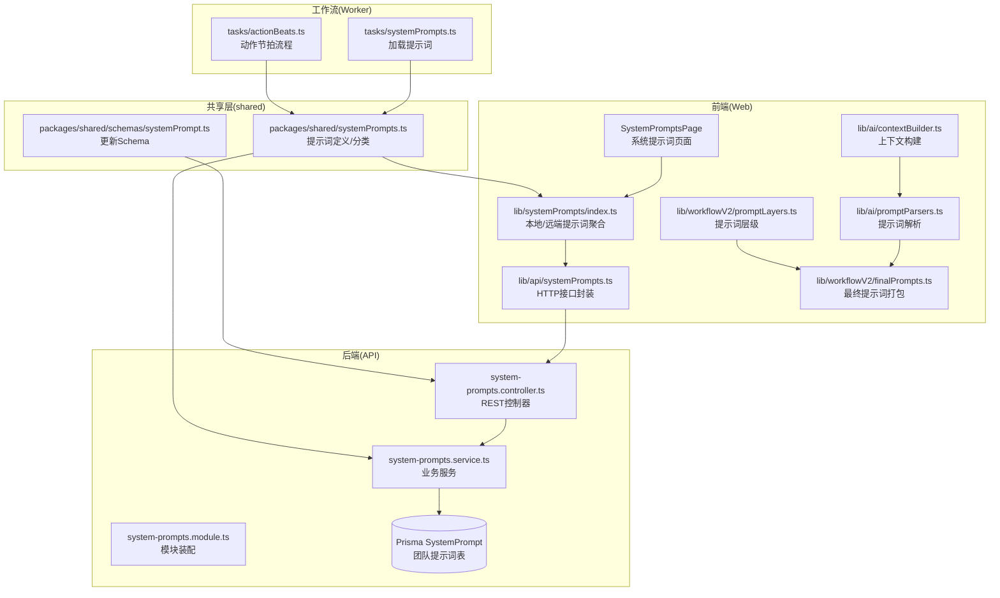
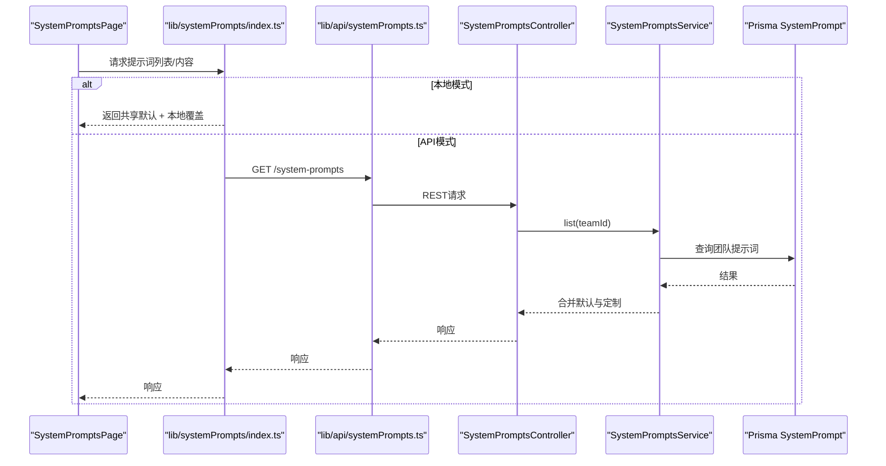
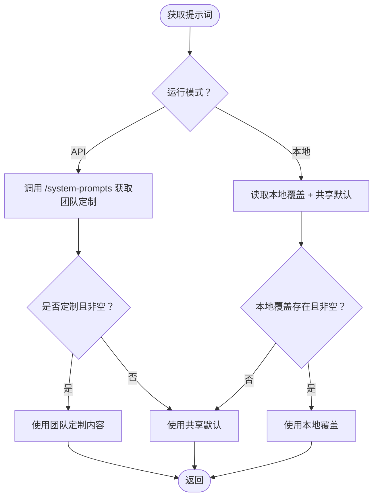
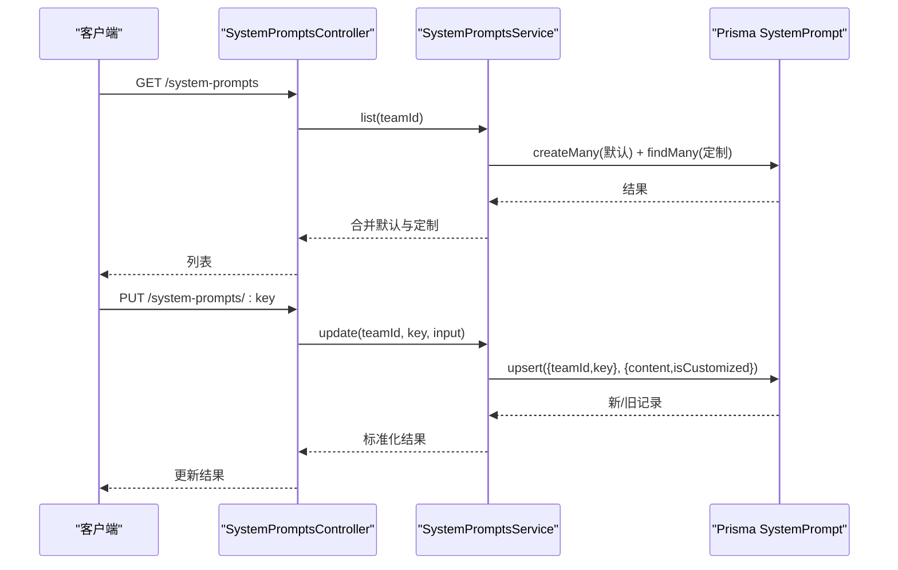
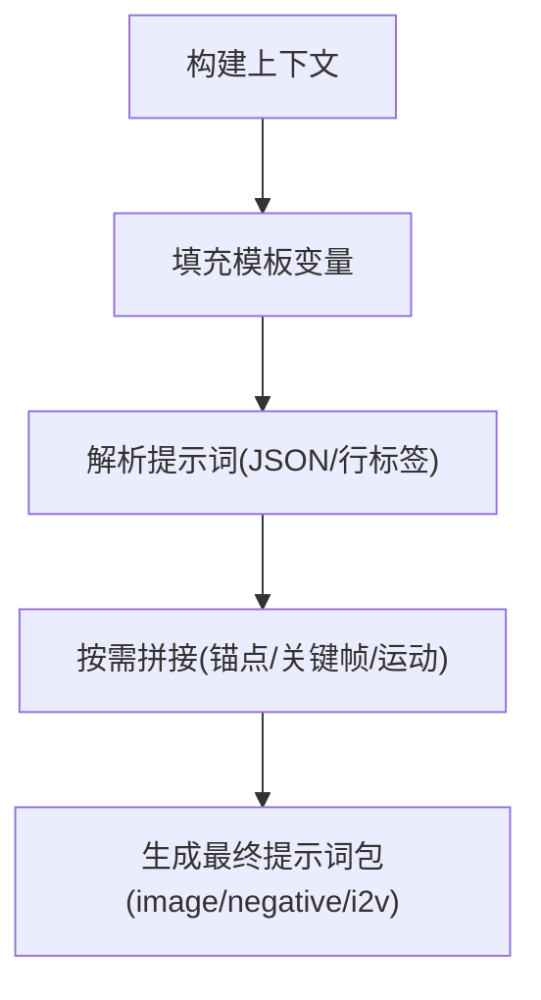
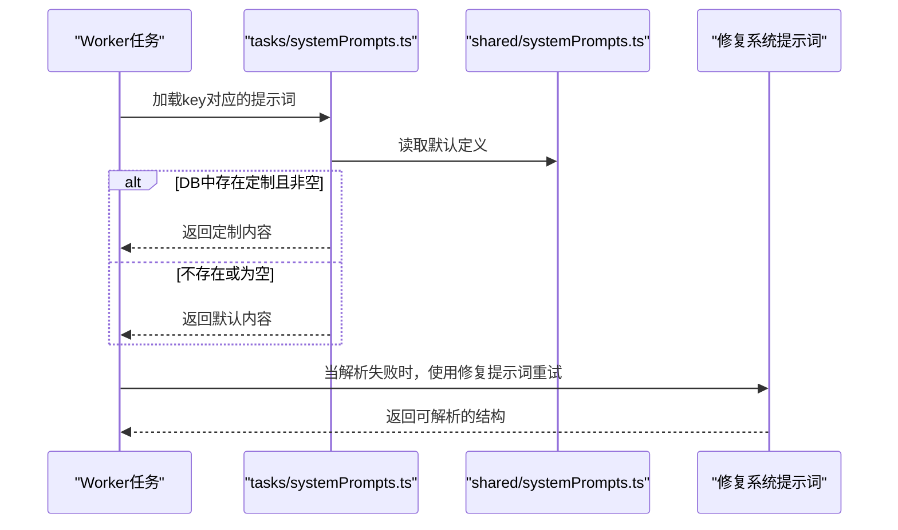
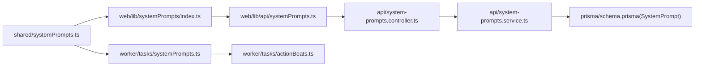

# 系统提示词管理

<cite>
**本文档引用的文件**
- [apps/api/src/system-prompts/system-prompts.module.ts](file://apps/api/src/system-prompts/system-prompts.module.ts)
- [apps/api/src/system-prompts/system-prompts.controller.ts](file://apps/api/src/system-prompts/system-prompts.controller.ts)
- [apps/api/src/system-prompts/system-prompts.service.ts](file://apps/api/src/system-prompts/system-prompts.service.ts)
- [apps/api/prisma/schema.prisma](file://apps/api/prisma/schema.prisma)
- [packages/shared/src/systemPrompts.ts](file://packages/shared/src/systemPrompts.ts)
- [packages/shared/src/systemPrompts.test.ts](file://packages/shared/src/systemPrompts.test.ts)
- [packages/shared/src/schemas/systemPrompt.ts](file://packages/shared/src/schemas/systemPrompt.ts)
- [apps/web/src/lib/systemPrompts/index.ts](file://apps/web/src/lib/systemPrompts/index.ts)
- [apps/web/src/lib/api/systemPrompts.ts](file://apps/web/src/lib/api/systemPrompts.ts)
- [apps/web/src/components/SystemPromptsPage.tsx](file://apps/web/src/components/SystemPromptsPage.tsx)
- [apps/web/src/lib/workflowV2/finalPrompts.ts](file://apps/web/src/lib/workflowV2/finalPrompts.ts)
- [apps/web/src/lib/workflowV2/promptLayers.ts](file://apps/web/src/lib/workflowV2/promptLayers.ts)
- [apps/web/src/lib/ai/contextBuilder.ts](file://apps/web/src/lib/ai/contextBuilder.ts)
- [apps/web/src/lib/ai/worldViewInjection.ts](file://apps/web/src/lib/ai/worldViewInjection.ts)
- [apps/web/src/lib/ai/promptParsers.ts](file://apps/web/src/lib/ai/promptParsers.ts)
- [apps/worker/src/tasks/systemPrompts.ts](file://apps/worker/src/tasks/systemPrompts.ts)
- [apps/worker/src/tasks/actionBeats.ts](file://apps/worker/src/tasks/actionBeats.ts)
- [apps/web/src/lib/systemPrompts/index.test.ts](file://apps/web/src/lib/systemPrompts/index.test.ts)
</cite>

## 目录

1. [简介](#简介)
2. [项目结构](#项目结构)
3. [核心组件](#核心组件)
4. [架构总览](#架构总览)
5. [详细组件分析](#详细组件分析)
6. [依赖分析](#依赖分析)
7. [性能考虑](#性能考虑)
8. [故障排查指南](#故障排查指南)
9. [结论](#结论)
10. [附录](#附录)

## 简介

本文件面向AIXSSS系统中的“系统提示词管理”模块，系统性阐述提示词的组织结构、模板系统与动态生成机制，涵盖分类体系、优先级与版本控制策略、参数化设计、上下文注入与条件渲染逻辑，并提供编写规范、测试策略与维护指南。同时，文档解释提示词在不同AI供应商间的适配与优化方法，并给出实际使用场景与最佳实践。

## 项目结构

提示词管理横跨前端Web应用、后端API服务与工作流Worker三大层面，共享层提供统一的提示词定义与校验Schema，数据库层持久化团队级别的提示词定制内容。



**图表来源**

- [apps/web/src/components/SystemPromptsPage.tsx](file://apps/web/src/components/SystemPromptsPage.tsx#L104-L131)
- [apps/web/src/lib/systemPrompts/index.ts](file://apps/web/src/lib/systemPrompts/index.ts#L84-L124)
- [apps/web/src/lib/api/systemPrompts.ts](file://apps/web/src/lib/api/systemPrompts.ts#L20-L29)
- [apps/api/src/system-prompts/system-prompts.controller.ts](file://apps/api/src/system-prompts/system-prompts.controller.ts#L14-L23)
- [apps/api/src/system-prompts/system-prompts.service.ts](file://apps/api/src/system-prompts/system-prompts.service.ts#L30-L59)
- [apps/api/prisma/schema.prisma](file://apps/api/prisma/schema.prisma#L337-L351)
- [packages/shared/src/systemPrompts.ts](file://packages/shared/src/systemPrompts.ts#L1-L22)
- [packages/shared/src/schemas/systemPrompt.ts](file://packages/shared/src/schemas/systemPrompt.ts#L3-L5)
- [apps/worker/src/tasks/systemPrompts.ts](file://apps/worker/src/tasks/systemPrompts.ts#L4-L26)
- [apps/worker/src/tasks/actionBeats.ts](file://apps/worker/src/tasks/actionBeats.ts#L573-L732)

**章节来源**

- [apps/api/src/system-prompts/system-prompts.module.ts](file://apps/api/src/system-prompts/system-prompts.module.ts#L1-L11)
- [apps/api/src/system-prompts/system-prompts.controller.ts](file://apps/api/src/system-prompts/system-prompts.controller.ts#L1-L26)
- [apps/api/src/system-prompts/system-prompts.service.ts](file://apps/api/src/system-prompts/system-prompts.service.ts#L1-L85)
- [apps/api/prisma/schema.prisma](file://apps/api/prisma/schema.prisma#L337-L351)
- [packages/shared/src/systemPrompts.ts](file://packages/shared/src/systemPrompts.ts#L1-L22)
- [packages/shared/src/schemas/systemPrompt.ts](file://packages/shared/src/schemas/systemPrompt.ts#L1-L9)
- [apps/web/src/lib/systemPrompts/index.ts](file://apps/web/src/lib/systemPrompts/index.ts#L1-L124)
- [apps/web/src/lib/api/systemPrompts.ts](file://apps/web/src/lib/api/systemPrompts.ts#L1-L29)
- [apps/web/src/components/SystemPromptsPage.tsx](file://apps/web/src/components/SystemPromptsPage.tsx#L47-L131)
- [apps/web/src/lib/workflowV2/finalPrompts.ts](file://apps/web/src/lib/workflowV2/finalPrompts.ts#L1-L231)
- [apps/web/src/lib/workflowV2/promptLayers.ts](file://apps/web/src/lib/workflowV2/promptLayers.ts#L1-L82)
- [apps/web/src/lib/ai/contextBuilder.ts](file://apps/web/src/lib/ai/contextBuilder.ts#L1-L435)
- [apps/web/src/lib/ai/worldViewInjection.ts](file://apps/web/src/lib/ai/worldViewInjection.ts#L1-L192)
- [apps/web/src/lib/ai/promptParsers.ts](file://apps/web/src/lib/ai/promptParsers.ts#L1-L637)
- [apps/worker/src/tasks/systemPrompts.ts](file://apps/worker/src/tasks/systemPrompts.ts#L1-L27)
- [apps/worker/src/tasks/actionBeats.ts](file://apps/worker/src/tasks/actionBeats.ts#L573-L732)

## 核心组件

- 提示词定义与分类：共享层提供统一的提示词定义数组与按key索引的对象，定义包含key、title、description、category与defaultContent。
- 前端提示词聚合：本地模式与API模式双通道，本地模式读取共享层默认定义并支持本地覆盖；API模式通过HTTP接口获取团队定制内容。
- 后端提示词服务：按团队ID确保默认提示词入库，提供列表查询与更新能力，支持定制标记与时间戳。
- 数据持久化：Prisma模型SystemPrompt按teamId+key唯一，存储content与isCustomized标志。
- 工作流集成：Worker任务按key加载提示词，动作节拍链路中使用修复系统提示词进行结构化输出纠偏。

**章节来源**

- [packages/shared/src/systemPrompts.ts](file://packages/shared/src/systemPrompts.ts#L1-L22)
- [apps/web/src/lib/systemPrompts/index.ts](file://apps/web/src/lib/systemPrompts/index.ts#L84-L124)
- [apps/api/src/system-prompts/system-prompts.service.ts](file://apps/api/src/system-prompts/system-prompts.service.ts#L17-L59)
- [apps/api/prisma/schema.prisma](file://apps/api/prisma/schema.prisma#L337-L351)
- [apps/worker/src/tasks/systemPrompts.ts](file://apps/worker/src/tasks/systemPrompts.ts#L4-L26)

## 架构总览

系统提示词管理采用“共享定义 + 前后端协同 + 工作流集成”的架构。共享层定义提示词清单与分类；前端负责UI展示、本地覆盖与优化；后端负责团队级持久化与鉴权访问；工作流在执行阶段按key加载提示词并参与结构化输出修复。



**图表来源**

- [apps/web/src/components/SystemPromptsPage.tsx](file://apps/web/src/components/SystemPromptsPage.tsx#L118-L131)
- [apps/web/src/lib/systemPrompts/index.ts](file://apps/web/src/lib/systemPrompts/index.ts#L84-L124)
- [apps/web/src/lib/api/systemPrompts.ts](file://apps/web/src/lib/api/systemPrompts.ts#L20-L29)
- [apps/api/src/system-prompts/system-prompts.controller.ts](file://apps/api/src/system-prompts/system-prompts.controller.ts#L14-L17)
- [apps/api/src/system-prompts/system-prompts.service.ts](file://apps/api/src/system-prompts/system-prompts.service.ts#L30-L59)
- [apps/api/prisma/schema.prisma](file://apps/api/prisma/schema.prisma#L337-L351)

## 详细组件分析

### 提示词定义与分类体系

- 分类类型：包括工作流（workflow）、修复（workflow.fix）、动作节拍（workflow.actionBeats）、叙事因果链（workflow.narrativeCausalChain）、UI系统提示词（ui.systemPrompts）、画布代理（agent.canvas）等。
- 结构字段：key（稳定键，用于DB查找）、title（UI显示）、description（可选描述）、category（分类）、defaultContent（默认提示词内容）。
- 唯一性与索引：共享层提供按key索引的对象，确保key唯一且可快速定位定义。

```mermaid
classDiagram
class SystemPromptDefinition {
+string key
+string title
+string description
+SystemPromptCategory category
+string defaultContent
}
class SystemPromptCategory {
<<enumeration>>
"workflow"
"workflow.fix"
"workflow.actionBeats"
"workflow.narrativeCausalChain"
"ui.systemPrompts"
"agent.canvas"
}
SystemPromptDefinition --> SystemPromptCategory : "使用"
```

**图表来源**

- [packages/shared/src/systemPrompts.ts](file://packages/shared/src/systemPrompts.ts#L1-L22)

**章节来源**

- [packages/shared/src/systemPrompts.ts](file://packages/shared/src/systemPrompts.ts#L1-L22)
- [packages/shared/src/systemPrompts.test.ts](file://packages/shared/src/systemPrompts.test.ts#L4-L19)

### 前端提示词聚合与本地覆盖

- 本地覆盖存储：localStorage中以JSON形式存储覆盖内容，键为提示词key，值包含content与updatedAt。
- 优先级策略：API模式优先使用后端定制内容，若为空或未定制则回退到共享默认；本地模式优先使用本地覆盖，否则使用共享默认。
- 缓存与失效：提供缓存失效函数，避免陈旧数据影响。



**图表来源**

- [apps/web/src/lib/systemPrompts/index.ts](file://apps/web/src/lib/systemPrompts/index.ts#L84-L124)
- [apps/web/src/lib/api/systemPrompts.ts](file://apps/web/src/lib/api/systemPrompts.ts#L20-L29)

**章节来源**

- [apps/web/src/lib/systemPrompts/index.ts](file://apps/web/src/lib/systemPrompts/index.ts#L1-L124)
- [apps/web/src/lib/systemPrompts/index.test.ts](file://apps/web/src/lib/systemPrompts/index.test.ts#L1-L44)

### 后端提示词服务与数据库

- 默认初始化：按团队ID批量插入共享默认提示词，使用“跳过重复”策略避免并发冲突。
- 列表查询：确保默认存在后，按共享定义keys查询团队定制，定制且非空则优先使用，否则回退默认。
- 更新逻辑：根据提交内容与默认内容对比决定isCustomized标记，UPSERT写入数据库并返回标准化结果。



**图表来源**

- [apps/api/src/system-prompts/system-prompts.controller.ts](file://apps/api/src/system-prompts/system-prompts.controller.ts#L14-L23)
- [apps/api/src/system-prompts/system-prompts.service.ts](file://apps/api/src/system-prompts/system-prompts.service.ts#L17-L83)
- [apps/api/prisma/schema.prisma](file://apps/api/prisma/schema.prisma#L337-L351)

**章节来源**

- [apps/api/src/system-prompts/system-prompts.controller.ts](file://apps/api/src/system-prompts/system-prompts.controller.ts#L1-L26)
- [apps/api/src/system-prompts/system-prompts.service.ts](file://apps/api/src/system-prompts/system-prompts.service.ts#L1-L85)
- [apps/api/prisma/schema.prisma](file://apps/api/prisma/schema.prisma#L337-L351)

### 提示词参数化设计与上下文注入

- 模板变量：上下文构建器提供丰富的占位符，如{style}、{characters}、{worldview}、{shot_prompt}、{motion_prompt}等，支持多语言与多模式（视觉/故事/全量）。
- 上下文注入时机：提供世界观注入设置，支持在分镜列表生成、场景锚点生成、角色设定生成等时机开启/关闭注入。
- 提示词解析与拼接：解析器支持JSON与旧版行标签两种格式，解析后可按需拼接为最终提示词；最终提示词打包器将风格、锚点、关键帧、运动提示词等组合为图像/负向/I2V提示词包。



**图表来源**

- [apps/web/src/lib/ai/contextBuilder.ts](file://apps/web/src/lib/ai/contextBuilder.ts#L310-L387)
- [apps/web/src/lib/ai/worldViewInjection.ts](file://apps/web/src/lib/ai/worldViewInjection.ts#L103-L126)
- [apps/web/src/lib/ai/promptParsers.ts](file://apps/web/src/lib/ai/promptParsers.ts#L389-L470)
- [apps/web/src/lib/workflowV2/finalPrompts.ts](file://apps/web/src/lib/workflowV2/finalPrompts.ts#L193-L231)

**章节来源**

- [apps/web/src/lib/ai/contextBuilder.ts](file://apps/web/src/lib/ai/contextBuilder.ts#L276-L387)
- [apps/web/src/lib/ai/worldViewInjection.ts](file://apps/web/src/lib/ai/worldViewInjection.ts#L1-L192)
- [apps/web/src/lib/ai/promptParsers.ts](file://apps/web/src/lib/ai/promptParsers.ts#L1-L637)
- [apps/web/src/lib/workflowV2/finalPrompts.ts](file://apps/web/src/lib/workflowV2/finalPrompts.ts#L1-L231)

### 版本控制与修复策略

- 版本化提示词：提示词定义为“静态版本”，通过数据库的isCustomized字段标识团队定制版本；更新时比较默认内容决定是否标记定制。
- 结构化输出修复：针对关键提示词（场景锚点、关键帧、运动提示词、剧集规划、因果链等）提供专门的修复系统提示词，配合工作流中的纠偏步骤，确保输出可解析与一致性。



**图表来源**

- [apps/worker/src/tasks/systemPrompts.ts](file://apps/worker/src/tasks/systemPrompts.ts#L4-L26)
- [packages/shared/src/systemPrompts.ts](file://packages/shared/src/systemPrompts.ts#L360-L428)
- [apps/worker/src/tasks/actionBeats.ts](file://apps/worker/src/tasks/actionBeats.ts#L573-L732)

**章节来源**

- [apps/api/src/system-prompts/system-prompts.service.ts](file://apps/api/src/system-prompts/system-prompts.service.ts#L61-L83)
- [apps/worker/src/tasks/systemPrompts.ts](file://apps/worker/src/tasks/systemPrompts.ts#L1-L27)
- [packages/shared/src/systemPrompts.ts](file://packages/shared/src/systemPrompts.ts#L360-L428)

### 供应商适配与优化

- 统一消息格式：工作流中将统一的Message格式转换为各供应商特定格式，处理认证、错误码映射与流式响应。
- 结构化输出测试：针对特定供应商（如Doubao/ARK）提供强制JSON输出的测试流程，验证长JSON可解析性与Schema一致性。
- 参数调优：提供温度、采样等参数预设与实时调整，结合最大token策略，平衡创意与稳定性。

**章节来源**

- [apps/worker/src/tasks/actionBeats.ts](file://apps/worker/src/tasks/actionBeats.ts#L573-L732)
- [apps/web/src/components/ConfigDialog.tsx](file://apps/web/src/components/ConfigDialog.tsx#L1602-L1634)
- [apps/web/src/components/editor/AIParameterTuner.tsx](file://apps/web/src/components/editor/AIParameterTuner.tsx#L61-L92)

## 依赖分析

- 组件耦合
  - 前端：SystemPromptsPage依赖lib/systemPrompts/index.ts；index.ts依赖shared定义与API封装；API封装依赖HTTP请求工具。
  - 后端：Controller依赖Service；Service依赖Prisma与shared定义；Prisma模型SystemPrompt承载定制内容。
  - 工作流：Worker任务依赖shared定义与Service加载逻辑，动作节拍任务依赖修复系统提示词。
- 外部依赖
  - Prisma用于数据库访问与模型定义。
  - Zod用于输入校验（更新Schema）。



**图表来源**

- [packages/shared/src/systemPrompts.ts](file://packages/shared/src/systemPrompts.ts#L1-L22)
- [apps/web/src/lib/systemPrompts/index.ts](file://apps/web/src/lib/systemPrompts/index.ts#L1-L124)
- [apps/web/src/lib/api/systemPrompts.ts](file://apps/web/src/lib/api/systemPrompts.ts#L1-L29)
- [apps/api/src/system-prompts/system-prompts.controller.ts](file://apps/api/src/system-prompts/system-prompts.controller.ts#L1-L26)
- [apps/api/src/system-prompts/system-prompts.service.ts](file://apps/api/src/system-prompts/system-prompts.service.ts#L1-L85)
- [apps/api/prisma/schema.prisma](file://apps/api/prisma/schema.prisma#L337-L351)
- [apps/worker/src/tasks/systemPrompts.ts](file://apps/worker/src/tasks/systemPrompts.ts#L1-L27)
- [apps/worker/src/tasks/actionBeats.ts](file://apps/worker/src/tasks/actionBeats.ts#L573-L732)

**章节来源**

- [packages/shared/src/schemas/systemPrompt.ts](file://packages/shared/src/schemas/systemPrompt.ts#L1-L9)
- [apps/api/src/system-prompts/system-prompts.service.ts](file://apps/api/src/system-prompts/system-prompts.service.ts#L1-L85)

## 性能考虑

- 前端缓存：API模式下提供缓存与失效机制，避免频繁网络请求；本地模式通过localStorage减少IO开销。
- 数据库写入：默认初始化使用“跳过重复”策略，降低并发写入冲突与重复写入成本。
- 解析与拼接：解析器支持JSON与旧格式双通道，解析后按需拼接，避免重复计算；最终提示词打包器仅对非空片段进行拼接。
- 供应商适配：统一消息格式转换与流式响应处理，减少不必要的序列化/反序列化。

[本节为通用指导，无需特定文件引用]

## 故障排查指南

- 提示词未生效
  - 检查是否处于API模式且后端已初始化默认提示词；确认数据库中是否存在定制内容且非空。
  - 本地模式检查localStorage覆盖是否为空或无效。
- 输出不可解析
  - 使用对应修复系统提示词进行纠偏；检查工作流中是否正确调用修复提示词。
- 上下文注入异常
  - 检查世界观注入设置是否启用及注入时机配置；确认上下文构建器中占位符是否正确填充。
- 供应商适配问题
  - 验证供应商特定的消息格式转换与认证参数；必要时启用结构化输出测试以验证JSON可解析性。

**章节来源**

- [apps/api/src/system-prompts/system-prompts.service.ts](file://apps/api/src/system-prompts/system-prompts.service.ts#L17-L28)
- [apps/web/src/lib/systemPrompts/index.ts](file://apps/web/src/lib/systemPrompts/index.ts#L31-L40)
- [apps/worker/src/tasks/actionBeats.ts](file://apps/worker/src/tasks/actionBeats.ts#L573-L732)
- [apps/web/src/lib/ai/worldViewInjection.ts](file://apps/web/src/lib/ai/worldViewInjection.ts#L66-L81)

## 结论

系统提示词管理通过共享定义、前后端协同与工作流集成，实现了可定制、可修复、可适配的提示词体系。其分类明确、优先级清晰、版本可控，并提供了强大的上下文注入与参数化能力，能够满足多供应商、多场景下的高质量提示词生成需求。

[本节为总结，无需特定文件引用]

## 附录

### 编写规范

- 结构化输出：优先使用JSON格式，明确“必须/禁止/只输出”等强约束；避免解释性文字与代码块。
- 模板变量：遵循上下文构建器约定的占位符命名；确保变量可解析且不依赖外部上下文。
- 修复提示词：针对常见解析失败场景提供最小修改的修复提示词，确保可解析性与一致性。

**章节来源**

- [packages/shared/src/systemPrompts.ts](file://packages/shared/src/systemPrompts.ts#L360-L428)
- [apps/web/src/lib/ai/contextBuilder.ts](file://apps/web/src/lib/ai/contextBuilder.ts#L310-L387)

### 测试策略

- 单元测试：共享层提示词定义唯一性与完整性测试；前端本地模式覆盖保存/重置测试。
- 集成测试：API模式下提示词列表与更新流程测试；修复系统提示词纠偏有效性测试。
- 结构化输出测试：针对特定供应商的JSON强制输出测试，验证Schema一致性。

**章节来源**

- [packages/shared/src/systemPrompts.test.ts](file://packages/shared/src/systemPrompts.test.ts#L4-L19)
- [apps/web/src/lib/systemPrompts/index.test.ts](file://apps/web/src/lib/systemPrompts/index.test.ts#L1-L44)
- [apps/worker/src/tasks/actionBeats.ts](file://apps/worker/src/tasks/actionBeats.ts#L573-L732)

### 维护指南

- 新增提示词：在共享层添加定义与分类；前端页面与工作流中按需引用；后端确保默认初始化。
- 更新提示词：通过API更新团队定制内容；注意isCustomized标记与默认内容对比；必要时提供修复提示词。
- 供应商适配：根据供应商特性调整消息格式与参数；提供结构化输出测试与参数调优预设。

**章节来源**

- [packages/shared/src/systemPrompts.ts](file://packages/shared/src/systemPrompts.ts#L1-L22)
- [apps/api/src/system-prompts/system-prompts.service.ts](file://apps/api/src/system-prompts/system-prompts.service.ts#L61-L83)
- [apps/web/src/lib/api/systemPrompts.ts](file://apps/web/src/lib/api/systemPrompts.ts#L24-L29)
