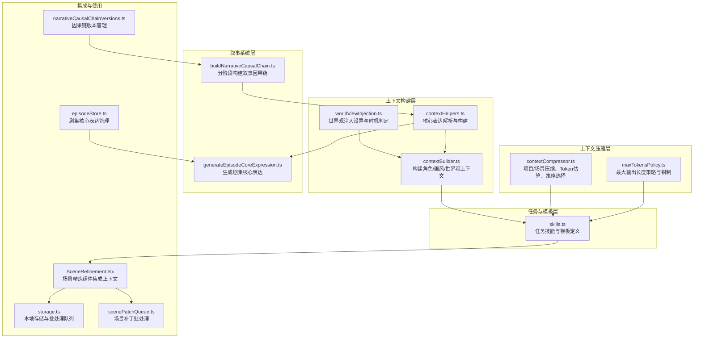
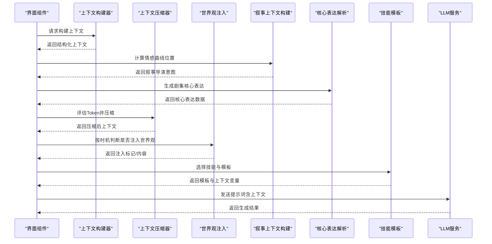
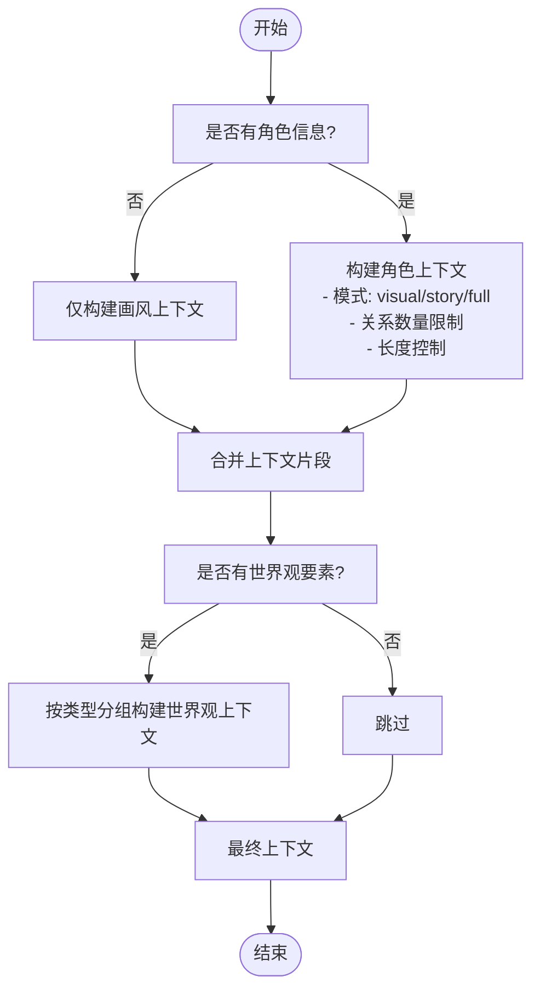
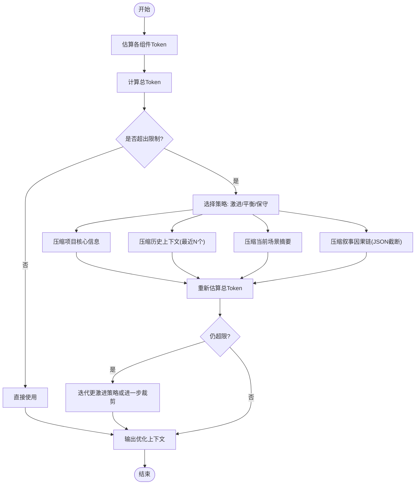
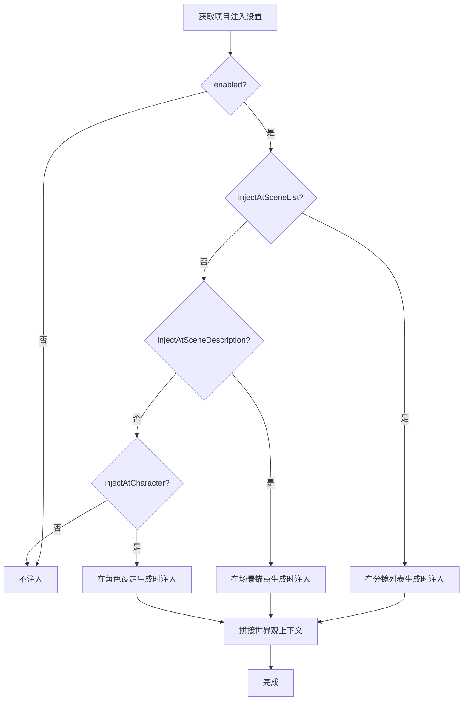
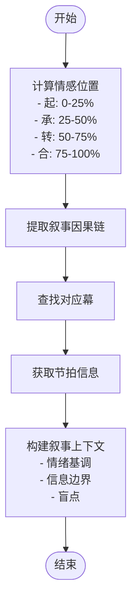
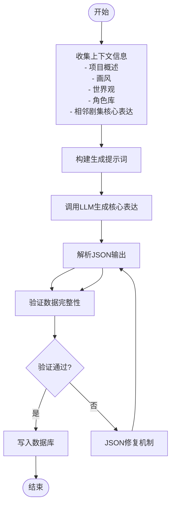
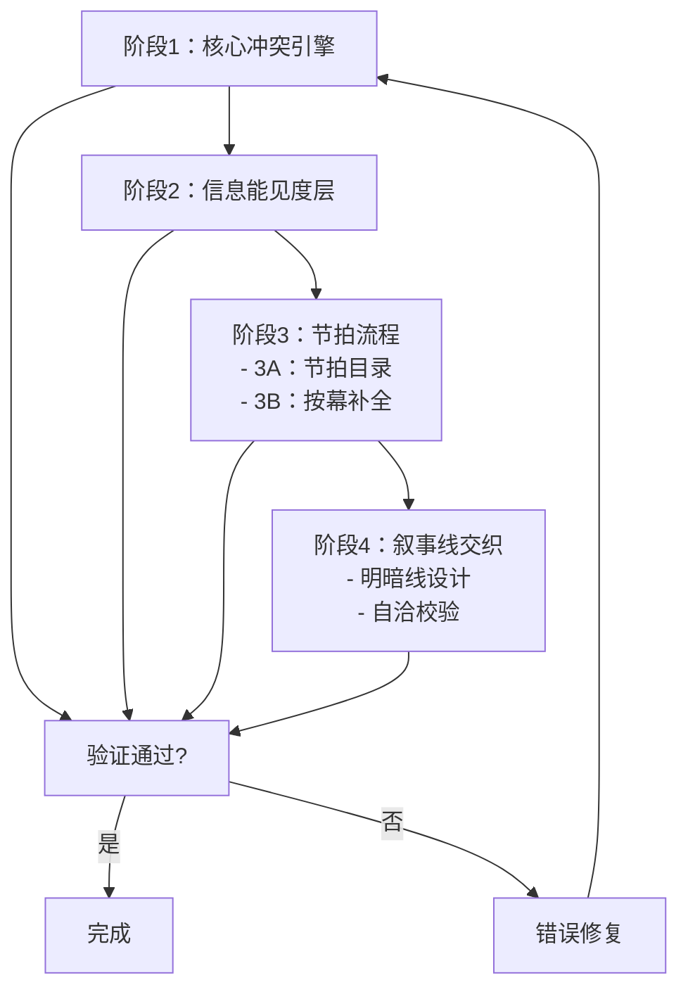
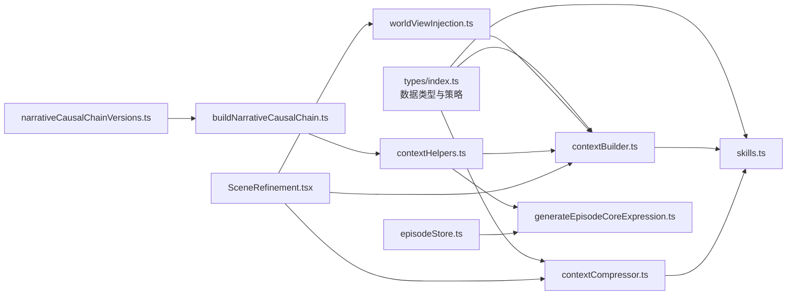

# AI上下文管理

<cite>
**本文档引用的文件**
- [apps/web/src/lib/ai/contextBuilder.ts](file://apps/web/src/lib/ai/contextBuilder.ts)
- [apps/web/src/lib/ai/contextCompressor.ts](file://apps/web/src/lib/ai/contextCompressor.ts)
- [apps/web/src/lib/ai/worldViewInjection.ts](file://apps/web/src/lib/ai/worldViewInjection.ts)
- [apps/web/src/lib/ai/maxTokensPolicy.ts](file://apps/web/src/lib/ai/maxTokensPolicy.ts)
- [apps/web/src/lib/ai/skills.ts](file://apps/web/src/lib/ai/skills.ts)
- [apps/worker/src/tasks/contextHelpers.ts](file://apps/worker/src/tasks/contextHelpers.ts)
- [apps/worker/src/tasks/generateEpisodeCoreExpression.ts](file://apps/worker/src/tasks/generateEpisodeCoreExpression.ts)
- [apps/worker/src/tasks/buildNarrativeCausalChain.ts](file://apps/worker/src/tasks/buildNarrativeCausalChain.ts)
- [packages/shared/src/schemas/narrativeCausalChain.ts](file://packages/shared/src/schemas/narrativeCausalChain.ts)
- [apps/web/src/lib/api/narrativeCausalChainVersions.ts](file://apps/web/src/lib/api/narrativeCausalChainVersions.ts)
- [apps/web/src/components/editor/EpisodeWorkflow.tsx](file://apps/web/src/components/editor/EpisodeWorkflow.tsx)
- [apps/web/src/stores/episodeStore.ts](file://apps/web/src/stores/episodeStore.ts)
- [apps/web/src/lib/ai/contextBuilder.test.ts](file://apps/web/src/lib/ai/contextBuilder.test.ts)
- [apps/web/src/lib/ai/contextCompressor.test.ts](file://apps/web/src/lib/ai/contextCompressor.test.ts)
- [apps/web/src/lib/ai/worldViewInjection.test.ts](file://apps/web/src/lib/ai/worldViewInjection.test.ts)
- [apps/web/src/lib/storage.ts](file://apps/web/src/lib/storage.ts)
- [apps/web/src/lib/api/scenePatchQueue.ts](file://apps/web/src/lib/api/scenePatchQueue.ts)
- [apps/web/src/components/editor/SceneRefinement.tsx](file://apps/web/src/components/editor/SceneRefinement.tsx)
- [apps/web/src/types/index.ts](file://apps/web/src/types/index.ts)
</cite>

## 更新摘要

**变更内容**

- 新增叙事上下文构建能力，支持分镜位置到情感曲线的映射
- 新增核心表达解析功能，为每个剧集生成主题、情感曲线、视觉母题等核心数据
- 新增叙事因果链分阶段构建系统，支持四阶段完整叙事结构
- 扩展上下文辅助函数，提供核心表达构建和解析工具
- 增强上下文压缩算法，支持叙事因果链的智能截断

## 目录

1. [简介](#简介)
2. [项目结构](#项目结构)
3. [核心组件](#核心组件)
4. [架构总览](#架构总览)
5. [详细组件分析](#详细组件分析)
6. [依赖关系分析](#依赖关系分析)
7. [性能考量](#性能考量)
8. [故障排查指南](#故障排查指南)
9. [结论](#结论)
10. [附录](#附录)

## 简介

本文件系统性梳理AIXSSS的AI上下文管理系统，围绕上下文构建器、上下文压缩器、世界观注入、叙事因果链构建、核心表达解析、上下文窗口管理与滚动更新、以及性能与质量保障展开。文档旨在帮助开发者与产品人员理解设计原理、实现细节与最佳实践，并提供可操作的优化建议与问题排查路径。

## 项目结构

上下文管理相关代码主要位于前端Web应用的AI工具库中，采用按功能域划分的模块化组织：

- 上下文构建：负责将角色、画风、世界观等信息格式化为可注入提示词模板的结构化上下文
- 上下文压缩：在Token预算与质量之间动态权衡，支持规则引擎与AI智能两种模式
- 世界观注入：控制在不同生成时机（分镜列表、场景锚点、角色设定）注入世界观
- 叙事上下文：基于分镜位置计算情感曲线，构建叙事导演意图
- 核心表达：为每个剧集生成主题、情感曲线、视觉母题等核心表达数据
- 技能与模板：为不同任务（分镜、关键帧、运动、台词等）提供所需上下文与提示词模板
- 类型与策略：统一的数据结构、Token估算、最大输出长度策略

**图表来源**

- [apps/web/src/lib/ai/contextBuilder.ts](file://apps/web/src/lib/ai/contextBuilder.ts#L1-L435)
- [apps/web/src/lib/ai/worldViewInjection.ts](file://apps/web/src/lib/ai/worldViewInjection.ts#L1-L192)
- [apps/worker/src/tasks/contextHelpers.ts](file://apps/worker/src/tasks/contextHelpers.ts#L1-L335)
- [apps/worker/src/tasks/buildNarrativeCausalChain.ts](file://apps/worker/src/tasks/buildNarrativeCausalChain.ts#L1-L1605)
- [apps/worker/src/tasks/generateEpisodeCoreExpression.ts](file://apps/worker/src/tasks/generateEpisodeCoreExpression.ts#L1-L426)
- [apps/web/src/stores/episodeStore.ts](file://apps/web/src/stores/episodeStore.ts#L269-L361)
- [apps/web/src/lib/api/narrativeCausalChainVersions.ts](file://apps/web/src/lib/api/narrativeCausalChainVersions.ts#L1-L57)

**章节来源**

- [apps/web/src/lib/ai/contextBuilder.ts](file://apps/web/src/lib/ai/contextBuilder.ts#L1-L435)
- [apps/web/src/lib/ai/contextCompressor.ts](file://apps/web/src/lib/ai/contextCompressor.ts#L1-L519)
- [apps/web/src/lib/ai/worldViewInjection.ts](file://apps/web/src/lib/ai/worldViewInjection.ts#L1-L192)
- [apps/web/src/lib/ai/skills.ts](file://apps/web/src/lib/ai/skills.ts#L1-L517)
- [apps/worker/src/tasks/contextHelpers.ts](file://apps/worker/src/tasks/contextHelpers.ts#L1-L335)
- [apps/worker/src/tasks/buildNarrativeCausalChain.ts](file://apps/worker/src/tasks/buildNarrativeCausalChain.ts#L1-L1605)
- [apps/worker/src/tasks/generateEpisodeCoreExpression.ts](file://apps/worker/src/tasks/generateEpisodeCoreExpression.ts#L1-L426)

## 核心组件

- 上下文构建器：将角色、画风、世界观等信息格式化为结构化上下文，并支持模板变量填充
- 上下文压缩器：在Token预算内动态压缩项目与场景摘要，保留关键信息，支持规则引擎与AI智能两种模式
- 世界观注入：提供注入时机开关与持久化设置，支持在分镜列表、场景锚点、角色设定等时机注入
- 叙事上下文构建：基于分镜位置计算情感曲线位置，构建叙事导演意图
- 核心表达解析：为每个剧集生成主题、情感曲线、视觉母题等核心表达数据
- 叙事因果链：分阶段构建完整的故事结构，包括核心冲突、信息层、节拍流程、叙事线交织
- 技能与模板：为不同任务定义所需上下文类型与提示词模板，驱动上下文构建
- Token策略：提供最大输出长度策略与钳制逻辑，确保与供应商模型能力匹配

**章节来源**

- [apps/web/src/lib/ai/contextBuilder.ts](file://apps/web/src/lib/ai/contextBuilder.ts#L105-L304)
- [apps/web/src/lib/ai/contextCompressor.ts](file://apps/web/src/lib/ai/contextCompressor.ts#L55-L298)
- [apps/web/src/lib/ai/worldViewInjection.ts](file://apps/web/src/lib/ai/worldViewInjection.ts#L66-L191)
- [apps/worker/src/tasks/contextHelpers.ts](file://apps/worker/src/tasks/contextHelpers.ts#L78-L199)
- [apps/worker/src/tasks/generateEpisodeCoreExpression.ts](file://apps/worker/src/tasks/generateEpisodeCoreExpression.ts#L22-L37)
- [apps/worker/src/tasks/buildNarrativeCausalChain.ts](file://apps/worker/src/tasks/buildNarrativeCausalChain.ts#L411-L708)
- [apps/web/src/lib/ai/skills.ts](file://apps/web/src/lib/ai/skills.ts#L7-L517)
- [apps/web/src/lib/ai/maxTokensPolicy.ts](file://apps/web/src/lib/ai/maxTokensPolicy.ts#L26-L62)

## 架构总览

上下文管理贯穿"构建—压缩—注入—模板—执行"的闭环，新增的叙事系统提供了更深层的上下文支撑：

- 构建：按需组装角色、画风、世界观等上下文
- 压缩：在Token预算内压缩项目/场景摘要，保留关键信息
- 注入：根据注入设置在指定生成阶段注入世界观
- 叙事：基于分镜位置构建情感曲线，生成核心表达
- 模板：按任务类型选择技能与模板，填充上下文变量
- 执行：调用LLM生成，结合进度桥接与降级策略

**图表来源**

- [apps/web/src/lib/ai/contextBuilder.ts](file://apps/web/src/lib/ai/contextBuilder.ts#L276-L387)
- [apps/worker/src/tasks/contextHelpers.ts](file://apps/worker/src/tasks/contextHelpers.ts#L154-L199)
- [apps/worker/src/tasks/generateEpisodeCoreExpression.ts](file://apps/worker/src/tasks/generateEpisodeCoreExpression.ts#L320-L349)
- [apps/web/src/lib/ai/contextCompressor.ts](file://apps/web/src/lib/ai/contextCompressor.ts#L240-L298)
- [apps/web/src/lib/ai/worldViewInjection.ts](file://apps/web/src/lib/ai/worldViewInjection.ts#L108-L126)
- [apps/web/src/lib/ai/skills.ts](file://apps/web/src/lib/ai/skills.ts#L420-L437)

## 详细组件分析

### 上下文构建器

- 设计原则
  - 按需构建：仅在任务需要时加载对应上下文，避免Context Rot
  - 结构化输出：角色、画风、世界观分别格式化，便于模板替换
  - 可配置裁剪：支持最大长度、角色模式（视觉/故事/全量）、关系数量等
- 内容组织策略
  - 角色上下文：名称、定位、外貌、性格、背景、主辅色、定妆照参考、关系、出场统计
  - 画风上下文：优先使用完整提示词，否则按风格、技法、色彩、文化特征组合
  - 世界观上下文：按类型分组（时代背景、地理设定、社会制度、科技水平、魔法体系、其他设定）
- 信息提取机制
  - 模板变量填充：支持{style}/{styleFullPrompt}、{characters}/{characters_visual}/{characters_story}/{characters_full}、{protagonist}、{worldview}、{scene_description}/{scene_summary}、{shot_prompt}/{motion_prompt}等
  - 技能导向构建：根据技能的requiredContext自动选择构建策略
- 关键实现要点
  - 角色模式与关系数量控制，避免过度膨胀
  - 画风配置兼容旧版与新版，支持合成完整提示词
  - 世界观按类型分组输出，提升可读性与检索效率

**图表来源**

- [apps/web/src/lib/ai/contextBuilder.ts](file://apps/web/src/lib/ai/contextBuilder.ts#L105-L304)

**章节来源**

- [apps/web/src/lib/ai/contextBuilder.ts](file://apps/web/src/lib/ai/contextBuilder.ts#L105-L304)
- [apps/web/src/lib/ai/contextBuilder.test.ts](file://apps/web/src/lib/ai/contextBuilder.test.ts#L16-L294)
- [apps/web/src/types/index.ts](file://apps/web/src/types/index.ts#L13-L26)

### 上下文压缩器

- 设计原则
  - 动态预算：根据策略（激进/平衡/保守）分配项目与场景的Token预算
  - 关键信息保留：提取情绪基调与关键元素，压缩摘要而非丢弃语义
  - 双模式：规则引擎零延迟，AI智能生成语义摘要并带回退
- 压缩算法与长度优化
  - Token估算：按汉字、英文词、其他字符权重估算，便于预算控制
  - 项目核心压缩：风格直接保留，主角与故事梗概按比例截断
  - 场景摘要压缩：摘要截断，同时提取情绪与关键元素
  - 历史上下文：按策略保留最近N个分镜摘要，避免无限增长
  - 叙事因果链压缩：智能截断超过阈值的JSON，保持信息完整性
- 相关性计算与质量保证
  - 情绪提取：关键词匹配或AI抽取，保证场景基调一致性
  - 关键元素提取：名词性短语抽取或AI抽取，保证场景锚点稳定性
  - 智能摘要：按目标长度压缩，保留核心人物、事件、地点
- 上下文窗口管理与滚动更新
  - 窗口构成：系统提示、项目核心、历史上下文、当前场景、任务提示
  - 滚动更新：基于当前索引与历史窗口大小，滑动保留最近N个场景摘要
  - 内存优化：按策略裁剪，避免一次性加载全部历史

**图表来源**

- [apps/web/src/lib/ai/contextCompressor.ts](file://apps/web/src/lib/ai/contextCompressor.ts#L18-L200)
- [apps/web/src/lib/ai/contextCompressor.ts](file://apps/web/src/lib/ai/contextCompressor.ts#L240-L298)

**章节来源**

- [apps/web/src/lib/ai/contextCompressor.ts](file://apps/web/src/lib/ai/contextCompressor.ts#L18-L200)
- [apps/web/src/lib/ai/contextCompressor.test.ts](file://apps/web/src/lib/ai/contextCompressor.test.ts#L22-L502)

### 世界观注入

- 注入时机与开关
  - 支持四种时机：分镜列表生成、场景锚点生成、角色设定生成、全部或关闭
  - 默认启用，可在项目维度持久化设置
- 时机判定与回推
  - 提供从设置推断时机的函数，以及从时机生成设置的工厂方法
- 实际使用
  - 在场景精炼等界面中，根据注入设置决定是否拼接世界观上下文

**图表来源**

- [apps/web/src/lib/ai/worldViewInjection.ts](file://apps/web/src/lib/ai/worldViewInjection.ts#L66-L191)
- [apps/web/src/components/editor/SceneRefinement.tsx](file://apps/web/src/components/editor/SceneRefinement.tsx#L459-L477)

**章节来源**

- [apps/web/src/lib/ai/worldViewInjection.ts](file://apps/web/src/lib/ai/worldViewInjection.ts#L66-L191)
- [apps/web/src/lib/ai/worldViewInjection.test.ts](file://apps/web/src/lib/ai/worldViewInjection.test.ts#L13-L173)
- [apps/web/src/components/editor/SceneRefinement.tsx](file://apps/web/src/components/editor/SceneRefinement.tsx#L459-L490)

### 叙事上下文构建

- 情感曲线计算
  - 基于分镜序号与总数计算情感位置（起承转合）
  - 支持三幕结构与五幕结构的映射
- 节拍信息提取
  - 从叙事因果链中提取当前幕的节拍信息
  - 提供情绪基调、信息边界、盲点等关键信息
- 角色上下文构建
  - 构建角色视觉描述与性格信息
  - 支持角色名称列表的简化输出
- 核心表达构建
  - 将主题、情感曲线、视觉母题等核心信息格式化
  - 支持当前阶段情绪的动态计算

**图表来源**

- [apps/worker/src/tasks/contextHelpers.ts](file://apps/worker/src/tasks/contextHelpers.ts#L82-L199)

**章节来源**

- [apps/worker/src/tasks/contextHelpers.ts](file://apps/worker/src/tasks/contextHelpers.ts#L78-L199)

### 核心表达解析

- 数据结构设计
  - 主题：故事的核心主题思想
  - 情感曲线：四阶段情感变化（起承转合）
  - 视觉母题：重要的视觉元素集合
  - 核心冲突：推动故事发展的关键冲突
  - 回报：故事的最终收获或结果
  - 结尾节拍：故事的最终场景设计
  - 下一钩子：为后续剧集留下的线索
- 解析与构建
  - 从数据库JSON解析核心表达数据
  - 构建可用于提示词的核心表达上下文
  - 支持当前阶段情绪的动态计算
- 生成流程
  - 收集项目概述、画风、世界观、角色信息
  - 获取相邻剧集的核心表达数据
  - 使用JSON Schema约束生成结构化输出
  - 支持JSON修复机制确保输出质量

**图表来源**

- [apps/worker/src/tasks/generateEpisodeCoreExpression.ts](file://apps/worker/src/tasks/generateEpisodeCoreExpression.ts#L320-L425)

**章节来源**

- [apps/worker/src/tasks/generateEpisodeCoreExpression.ts](file://apps/worker/src/tasks/generateEpisodeCoreExpression.ts#L22-L37)
- [apps/worker/src/tasks/generateEpisodeCoreExpression.ts](file://apps/worker/src/tasks/generateEpisodeCoreExpression.ts#L194-L248)
- [apps/worker/src/tasks/generateEpisodeCoreExpression.ts](file://apps/worker/src/tasks/generateEpisodeCoreExpression.ts#L320-L425)

### 叙事因果链构建

- 分阶段架构
  - 阶段1：核心冲突引擎（大纲 + 冲突）
  - 阶段2：信息能见度层 + 角色矩阵
  - 阶段3：节拍流程（场景化设计）
  - 阶段4：叙事线交织 + 自洽校验
- 数据结构设计
  - 版本控制：支持数据迁移与版本管理
  - 完整结构：合并所有阶段的综合数据
  - 校验机制：自动生成一致性检查结果
- 生成流程
  - 阶段间依赖：必须按顺序完成前一阶段才能进入下一阶段
  - 错误恢复：支持断点续跑与错误修复
  - 版本快照：每次成功生成都会创建版本记录

**图表来源**

- [apps/worker/src/tasks/buildNarrativeCausalChain.ts](file://apps/worker/src/tasks/buildNarrativeCausalChain.ts#L782-L1600)

**章节来源**

- [apps/worker/src/tasks/buildNarrativeCausalChain.ts](file://apps/worker/src/tasks/buildNarrativeCausalChain.ts#L411-L708)
- [packages/shared/src/schemas/narrativeCausalChain.ts](file://packages/shared/src/schemas/narrativeCausalChain.ts#L1-L270)

### 技能与模板

- 任务导向的上下文需求
  - 不同任务（分镜列表、场景锚点、关键帧、运动、台词、角色基础信息、角色定妆照）定义了所需的上下文类型
- 模板变量与占位符
  - 模板中使用统一占位符风格，构建器负责替换为实际上下文
- 输出格式与长度控制
  - 每个技能定义输出格式（文本/JSON）与最大Token，配合最大输出长度策略进行钳制

**章节来源**

- [apps/web/src/lib/ai/skills.ts](file://apps/web/src/lib/ai/skills.ts#L7-L517)
- [apps/web/src/lib/ai/contextBuilder.ts](file://apps/web/src/lib/ai/contextBuilder.ts#L307-L387)
- [apps/web/src/lib/ai/maxTokensPolicy.ts](file://apps/web/src/lib/ai/maxTokensPolicy.ts#L26-L62)

## 依赖关系分析

- 组件耦合
  - 上下文构建器依赖类型定义（角色、画风、世界设定等）
  - 上下文压缩器依赖技能定义与系统提示内容，用于AI智能模式
  - 世界观注入与上下文构建器在界面层协作
  - 叙事上下文构建依赖核心表达解析与叙事因果链数据
  - 核心表达生成依赖上下文构建与JSON Schema验证
- 外部依赖
  - 系统提示内容（用于AI智能模式的提示词模板）
  - 类型系统（统一的数据结构与策略）
  - 数据库Schema（支持版本管理和数据迁移）

**图表来源**

- [apps/web/src/types/index.ts](file://apps/web/src/types/index.ts#L13-L26)
- [apps/web/src/lib/ai/contextBuilder.ts](file://apps/web/src/lib/ai/contextBuilder.ts#L12-L18)
- [apps/web/src/lib/ai/contextCompressor.ts](file://apps/web/src/lib/ai/contextCompressor.ts#L14-L16)
- [apps/web/src/lib/ai/skills.ts](file://apps/web/src/lib/ai/skills.ts#L1-L2)
- [apps/web/src/lib/ai/worldViewInjection.ts](file://apps/web/src/lib/ai/worldViewInjection.ts#L14-L24)
- [apps/worker/src/tasks/contextHelpers.ts](file://apps/worker/src/tasks/contextHelpers.ts#L6-L8)
- [apps/worker/src/tasks/generateEpisodeCoreExpression.ts](file://apps/worker/src/tasks/generateEpisodeCoreExpression.ts#L7-L8)
- [apps/worker/src/tasks/buildNarrativeCausalChain.ts](file://apps/worker/src/tasks/buildNarrativeCausalChain.ts#L21-L22)
- [apps/web/src/components/editor/SceneRefinement.tsx](file://apps/web/src/components/editor/SceneRefinement.tsx#L459-L490)

**章节来源**

- [apps/web/src/types/index.ts](file://apps/web/src/types/index.ts#L13-L26)
- [apps/web/src/lib/ai/contextBuilder.ts](file://apps/web/src/lib/ai/contextBuilder.ts#L12-L18)
- [apps/web/src/lib/ai/contextCompressor.ts](file://apps/web/src/lib/ai/contextCompressor.ts#L14-L16)
- [apps/web/src/lib/ai/skills.ts](file://apps/web/src/lib/ai/skills.ts#L1-L2)
- [apps/web/src/lib/ai/worldViewInjection.ts](file://apps/web/src/lib/ai/worldViewInjection.ts#L14-L24)
- [apps/worker/src/tasks/contextHelpers.ts](file://apps/worker/src/tasks/contextHelpers.ts#L6-L8)
- [apps/worker/src/tasks/generateEpisodeCoreExpression.ts](file://apps/worker/src/tasks/generateEpisodeCoreExpression.ts#L7-L8)
- [apps/worker/src/tasks/buildNarrativeCausalChain.ts](file://apps/worker/src/tasks/buildNarrativeCausalChain.ts#L21-L22)
- [apps/web/src/components/editor/SceneRefinement.tsx](file://apps/web/src/components/editor/SceneRefinement.tsx#L459-L490)

## 性能考量

- Token估算与预算控制
  - 采用字符权重估算，便于在构建阶段快速判断是否超限
  - 压缩策略按预算分配，优先保留风格与关键摘要
  - 叙事因果链采用智能截断策略，超过阈值时使用JSON截断
- 压缩策略选择
  - 激进：最小化Token，适合长历史与复杂内容
  - 平衡：兼顾质量与长度，适用于大多数场景
  - 保守：保留更多信息，适合短历史与高一致性要求
- AI智能模式的降级
  - AI抽取/压缩失败时自动回退到规则引擎，保证可用性
  - 核心表达生成支持JSON修复机制，提高输出稳定性
- UI与存储层面的优化
  - 场景保存与补丁写入采用批处理队列，降低localStorage压力
  - 缓存与节流工具用于减少重复计算与渲染抖动
  - 剧集核心表达支持批量生成，提升工作效率

**章节来源**

- [apps/web/src/lib/ai/contextCompressor.ts](file://apps/web/src/lib/ai/contextCompressor.ts#L18-L50)
- [apps/web/src/lib/ai/contextCompressor.ts](file://apps/web/src/lib/ai/contextCompressor.ts#L375-L430)
- [apps/worker/src/tasks/generateEpisodeCoreExpression.ts](file://apps/worker/src/tasks/generateEpisodeCoreExpression.ts#L370-L399)
- [apps/web/src/lib/storage.ts](file://apps/web/src/lib/storage.ts#L39-L64)
- [apps/web/src/lib/performance.test.ts](file://apps/web/src/lib/performance.test.ts#L115-L178)

## 故障排查指南

- 上下文过长导致API失败
  - 现象：Token估算过高，调用失败
  - 处理：切换到更激进的压缩策略，或减少角色/场景数量
  - 参考：上下文压缩器的策略配置与Token估算
- 世界观未注入
  - 现象：生成内容缺乏一致性
  - 处理：检查项目注入设置，确认时机开关
  - 参考：世界观注入设置与界面集成
- AI智能模式不稳定
  - 现象：抽取/压缩失败
  - 处理：查看降级日志，确认回退到规则引擎
  - 参考：AI智能函数的降级通知
- 核心表达生成失败
  - 现象：JSON解析错误或输出格式不符
  - 处理：检查JSON修复机制，确认Schema约束
  - 参考：核心表达生成的错误处理与修复流程
- 叙事因果链构建中断
  - 现象：阶段间依赖错误或数据校验失败
  - 处理：检查前置阶段是否完成，确认数据完整性
  - 参考：分阶段构建的依赖关系与校验机制
- 输出长度异常
  - 现象：输出过短或过长
  - 处理：调整最大输出长度策略，或优化模板变量
  - 参考：最大输出长度策略与技能定义

**章节来源**

- [apps/web/src/lib/ai/contextCompressor.ts](file://apps/web/src/lib/ai/contextCompressor.ts#L375-L430)
- [apps/web/src/lib/ai/worldViewInjection.ts](file://apps/web/src/lib/ai/worldViewInjection.ts#L66-L97)
- [apps/worker/src/tasks/generateEpisodeCoreExpression.ts](file://apps/worker/src/tasks/generateEpisodeCoreExpression.ts#L370-L399)
- [apps/worker/src/tasks/buildNarrativeCausalChain.ts](file://apps/worker/src/tasks/buildNarrativeCausalChain.ts#L824-L831)

## 结论

AIXSSS的AI上下文管理系统通过"构建—压缩—注入—模板—执行"的闭环，实现了高效、可控、可扩展的上下文管理。新增的叙事系统进一步增强了系统的理论基础和实践应用能力，包括：

- **叙事上下文构建**：通过分镜位置到情感曲线的映射，为创作提供深层的叙事指导
- **核心表达解析**：为每个剧集生成主题、情感曲线、视觉母题等核心表达数据，确保创作的一致性
- **叙事因果链**：分阶段构建完整的故事结构，支持四阶段的深度叙事设计

系统设计强调按需构建、动态预算、关键信息保留与多模式降级，既满足了创作流程的连贯性与一致性，又兼顾了性能与稳定性。建议在实际使用中结合任务类型选择合适的压缩策略，并通过注入设置与模板变量精细化控制上下文质量。

## 附录

- 最佳实践
  - 优先使用技能导向的上下文构建，确保上下文与任务匹配
  - 在长历史场景中采用激进策略，短历史场景采用保守策略
  - 启用世界观注入以提升场景一致性，按项目维度管理注入时机
  - 使用模板变量集中管理上下文，避免硬编码
  - 利用核心表达系统确保剧集间的一致性
  - 通过叙事因果链构建完整的创作框架
- 常见问题
  - Token超限：调整策略或减少上下文规模
  - 生成质量不稳定：启用AI智能模式并观察降级日志
  - 输出长度异常：核对最大输出长度策略与模板
  - 核心表达生成失败：检查JSON修复机制与Schema约束
  - 叙事因果链构建中断：确保前置阶段完成并验证数据完整性
