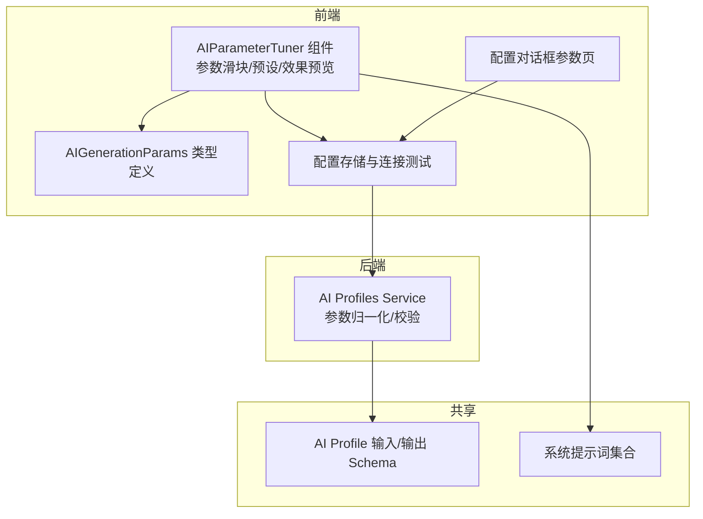
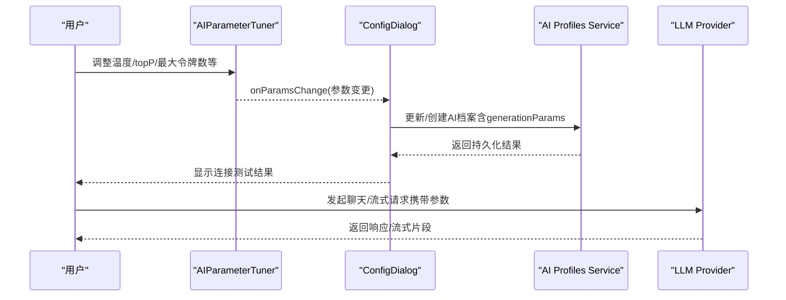
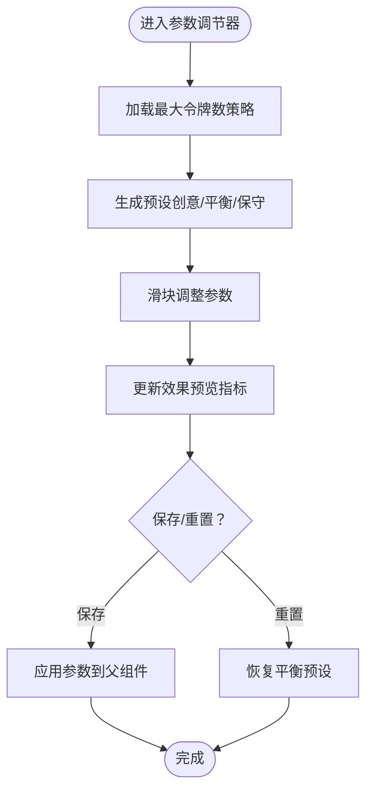
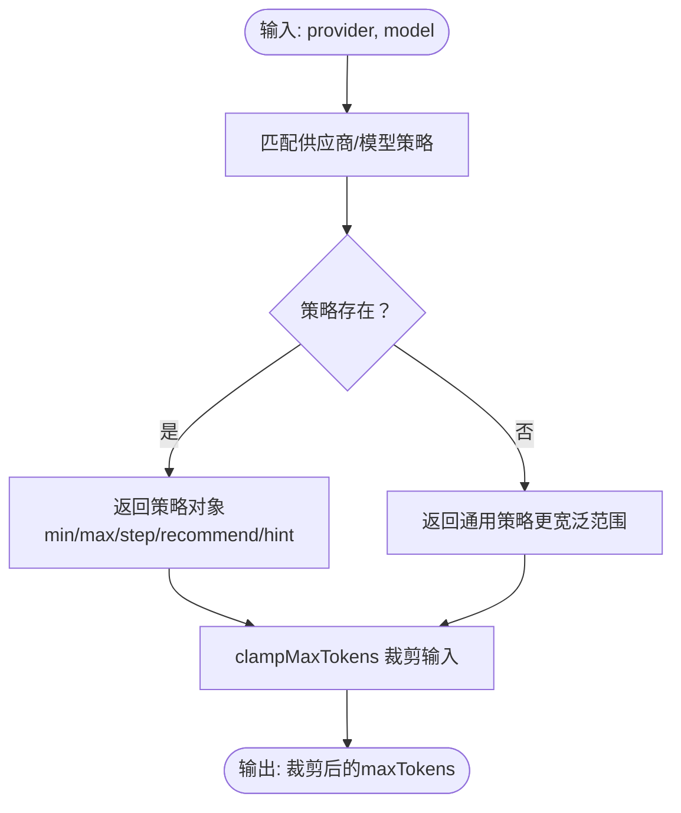
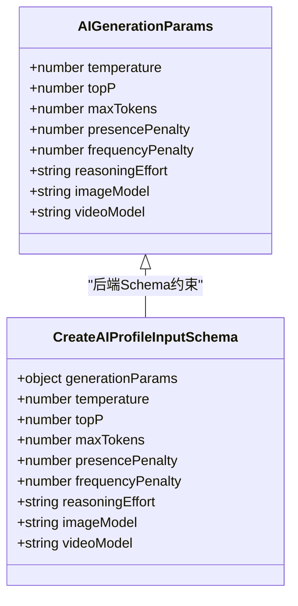
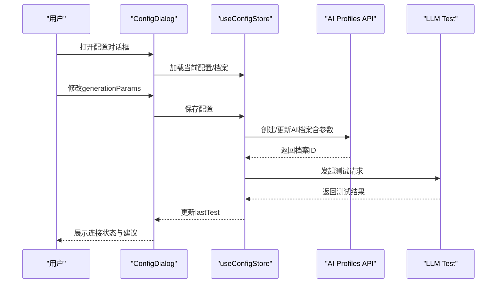
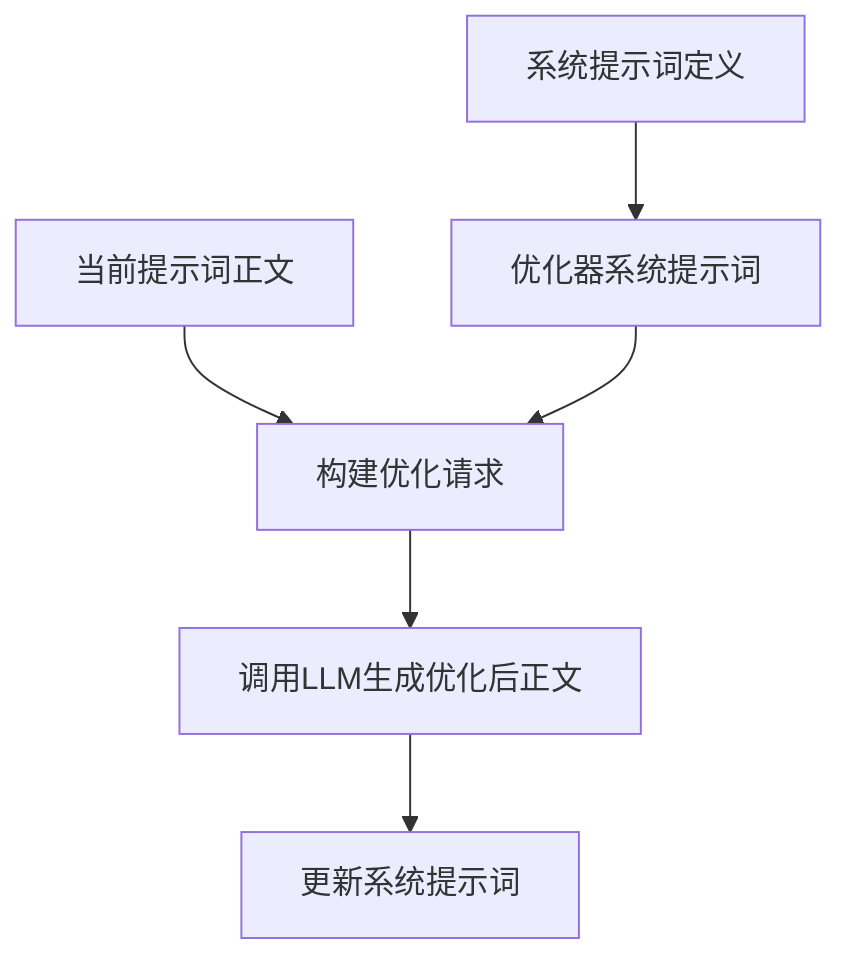
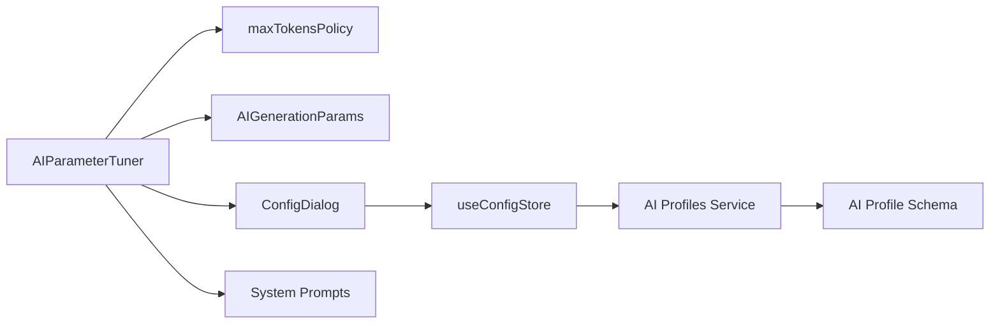

# AI参数调节

<cite>
**本文引用的文件**
- [AIParameterTuner.tsx](file://apps/web/src/components/editor/AIParameterTuner.tsx)
- [maxTokensPolicy.ts](file://apps/web/src/lib/ai/maxTokensPolicy.ts)
- [types.ts](file://apps/web/src/types/index.ts)
- [aiProfile.ts](file://packages/shared/src/schemas/aiProfile.ts)
- [ai-profiles.service.ts](file://apps/api/src/ai-profiles/ai-profiles.service.ts)
- [configStore.ts](file://apps/web/src/stores/configStore.ts)
- [ConfigDialog.tsx](file://apps/web/src/components/ConfigDialog.tsx)
- [systemPrompts.ts](file://packages/shared/src/systemPrompts.ts)
- [SystemPromptsPage.tsx](file://apps/web/src/components/SystemPromptsPage.tsx)
</cite>

## 目录

1. [简介](#简介)
2. [项目结构](#项目结构)
3. [核心组件](#核心组件)
4. [架构总览](#架构总览)
5. [详细组件分析](#详细组件分析)
6. [依赖关系分析](#依赖关系分析)
7. [性能考量](#性能考量)
8. [故障排除指南](#故障排除指南)
9. [结论](#结论)
10. [附录](#附录)

## 简介

本文件面向AIXSSS的AI参数调节功能，系统性阐述参数调节器的实现原理、动态配置调整机制与效果预览功能，深入解释最大令牌数策略、温度控制、top-p调节与系统提示优化，并覆盖参数验证、默认值管理、用户界面交互设计、参数组合的效果预测、性能影响评估与成本控制策略。文档还提供实际应用场景、最佳实践与故障排除指南，帮助开发者与使用者高效、稳健地使用AI参数调节能力。

## 项目结构

AI参数调节功能主要分布在前端组件与共享类型定义中，后端提供参数校验与归一化处理，数据库层面存储AI档案与定价信息。整体结构围绕“参数UI组件 + 类型约束 + 存储与校验 + 系统提示优化”展开。

图表来源

- [AIParameterTuner.tsx](file://apps/web/src/components/editor/AIParameterTuner.tsx#L1-L457)
- [types.ts](file://apps/web/src/types/index.ts#L929-L953)
- [configStore.ts](file://apps/web/src/stores/configStore.ts#L1-L822)
- [aiProfile.ts](file://packages/shared/src/schemas/aiProfile.ts#L1-L51)
- [ai-profiles.service.ts](file://apps/api/src/ai-profiles/ai-profiles.service.ts#L1-L202)
- [systemPrompts.ts](file://packages/shared/src/systemPrompts.ts#L1-L800)

章节来源

- [AIParameterTuner.tsx](file://apps/web/src/components/editor/AIParameterTuner.tsx#L1-L457)
- [types.ts](file://apps/web/src/types/index.ts#L929-L953)
- [configStore.ts](file://apps/web/src/stores/configStore.ts#L1-L822)
- [aiProfile.ts](file://packages/shared/src/schemas/aiProfile.ts#L1-L51)
- [ai-profiles.service.ts](file://apps/api/src/ai-profiles/ai-profiles.service.ts#L1-L202)
- [systemPrompts.ts](file://packages/shared/src/systemPrompts.ts#L1-L800)

## 核心组件

- 参数调节器组件：提供温度、top-p、最大令牌数、主题惩罚、重复惩罚等参数的滑块调节与预设切换，支持推理强度（针对特定模型）。
- 最大令牌数策略：按供应商与模型动态计算UI范围与推荐默认值，保障参数在可用范围内。
- 参数效果预览：通过创意度、稳定性、多样性与长度倾向指标直观呈现参数组合的影响。
- 参数验证与默认值管理：前端类型约束与后端Schema校验，确保参数合法；对不支持的参数（如豆包/方舟的惩罚项）进行自动剔除。
- 系统提示优化：提供系统提示词的优化器与分类体系，辅助提升提示词质量与稳定性。

章节来源

- [AIParameterTuner.tsx](file://apps/web/src/components/editor/AIParameterTuner.tsx#L42-L357)
- [maxTokensPolicy.ts](file://apps/web/src/lib/ai/maxTokensPolicy.ts#L1-L62)
- [types.ts](file://apps/web/src/types/index.ts#L929-L953)
- [aiProfile.ts](file://packages/shared/src/schemas/aiProfile.ts#L25-L40)
- [ai-profiles.service.ts](file://apps/api/src/ai-profiles/ai-profiles.service.ts#L31-L54)
- [systemPrompts.ts](file://packages/shared/src/systemPrompts.ts#L1-L800)

## 架构总览

参数调节功能的端到端流程包括：用户在参数调节器中调整参数，前端组件将变更通过回调通知父组件；配置对话框负责参数的持久化与连接测试；后端服务对参数进行归一化与校验；最终参数随请求下发至LLM Provider。

图表来源

- [AIParameterTuner.tsx](file://apps/web/src/components/editor/AIParameterTuner.tsx#L106-L120)
- [ConfigDialog.tsx](file://apps/web/src/components/ConfigDialog.tsx#L216-L225)
- [ai-profiles.service.ts](file://apps/api/src/ai-profiles/ai-profiles.service.ts#L101-L132)
- [ai-profiles.service.ts](file://apps/api/src/ai-profiles/ai-profiles.service.ts#L134-L189)

## 详细组件分析

### 参数调节器组件（AIParameterTuner）

- 功能要点
  - 预设模板：创意/平衡/保守三档，自动根据最大令牌数策略调整推荐值。
  - 参数滑块：温度、top-p、最大令牌数、主题惩罚、重复惩罚（除特定供应商外）。
  - 推理强度：仅对特定模型开放，支持多档位。
  - 效果预览：创意度、稳定性、多样性与长度倾向指标。
  - 重置与自定义标记：一键恢复平衡预设，切换非预设参数时标记为自定义。
- 关键实现
  - 预设计算：基于最大令牌数策略的推荐默认值，结合步进与上下限生成预设。
  - 参数更新：通过回调将数值型参数变更合并到当前参数对象。
  - 效果指标：基于参数组合的启发式公式，映射到0-100的百分比显示。
  - 供应商适配：对不支持惩罚项的供应商（如豆包/方舟）隐藏相应滑块并提示。

图表来源

- [AIParameterTuner.tsx](file://apps/web/src/components/editor/AIParameterTuner.tsx#L61-L120)
- [AIParameterTuner.tsx](file://apps/web/src/components/editor/AIParameterTuner.tsx#L324-L331)

章节来源

- [AIParameterTuner.tsx](file://apps/web/src/components/editor/AIParameterTuner.tsx#L42-L357)

### 最大令牌数策略（getMaxTokensPolicy）

- 设计目标
  - 为不同供应商与模型提供UI范围、步进、推荐默认值与提示文案，确保参数在可用范围内。
  - 对特定模型（如DeepSeek Reasoner）提供更大上限，同时对通用模型提供更宽泛的范围。
- 关键实现
  - 基于供应商与模型名匹配策略，返回策略对象。
  - clampMaxTokens用于将用户输入裁剪到策略范围内，避免越界。

图表来源

- [maxTokensPolicy.ts](file://apps/web/src/lib/ai/maxTokensPolicy.ts#L26-L62)

章节来源

- [maxTokensPolicy.ts](file://apps/web/src/lib/ai/maxTokensPolicy.ts#L1-L62)

### 参数类型与验证（AIGenerationParams 与 Schema）

- 类型定义
  - AIGenerationParams涵盖温度、top-p、最大令牌数、主题惩罚、重复惩罚、推理强度、图像/视频模型等。
- Schema校验
  - 后端Schema对参数范围进行严格限制，确保温度0-2、top-p0-1、maxTokens1-65536等。
  - 对特定供应商（如豆包/方舟）自动剔除惩罚项，避免不支持的参数传入。
- 默认值管理
  - 前端在配置对话框中对未提供的参数赋予默认值，并通过策略裁剪maxTokens。

图表来源

- [types.ts](file://apps/web/src/types/index.ts#L929-L953)
- [aiProfile.ts](file://packages/shared/src/schemas/aiProfile.ts#L25-L40)

章节来源

- [types.ts](file://apps/web/src/types/index.ts#L929-L953)
- [aiProfile.ts](file://packages/shared/src/schemas/aiProfile.ts#L13-L48)
- [ai-profiles.service.ts](file://apps/api/src/ai-profiles/ai-profiles.service.ts#L31-L54)

### 配置存储与连接测试（ConfigDialog 与 configStore）

- 配置对话框
  - 参数页：加载并保存generationParams，结合策略裁剪maxTokens，默认填充惩罚项。
  - 连接测试：在后端模式下创建/更新AI档案并发起测试请求，返回成功/失败与建议。
- 存储与模式
  - 本地模式：持久化到本地存储，包含多档案管理与激活。
  - 后端模式：仅保存档案ID，前端不保存API Key，通过服务端管理密钥与参数。

图表来源

- [ConfigDialog.tsx](file://apps/web/src/components/ConfigDialog.tsx#L216-L225)
- [configStore.ts](file://apps/web/src/stores/configStore.ts#L189-L287)
- [configStore.ts](file://apps/web/src/stores/configStore.ts#L343-L488)

章节来源

- [ConfigDialog.tsx](file://apps/web/src/components/ConfigDialog.tsx#L216-L225)
- [configStore.ts](file://apps/web/src/stores/configStore.ts#L189-L287)
- [configStore.ts](file://apps/web/src/stores/configStore.ts#L343-L488)

### 系统提示优化（System Prompts）

- 系统提示词体系
  - 定义了多种工作流相关的系统提示词，覆盖分镜、关键帧、运动提示词、台词、叙事因果链等。
  - 提供优化器与分类体系，支持对提示词进行结构化优化，减少歧义，提高可解析性。
- 优化流程
  - 使用优化器系统提示词与当前提示词正文，生成优化后的提示词正文，便于在工作流中稳定使用。

图表来源

- [systemPrompts.ts](file://packages/shared/src/systemPrompts.ts#L1-L800)
- [SystemPromptsPage.tsx](file://apps/web/src/components/SystemPromptsPage.tsx#L53-L89)

章节来源

- [systemPrompts.ts](file://packages/shared/src/systemPrompts.ts#L1-L800)
- [SystemPromptsPage.tsx](file://apps/web/src/components/SystemPromptsPage.tsx#L47-L89)

## 依赖关系分析

- 组件耦合
  - AIParameterTuner依赖最大令牌数策略与类型定义，耦合度低，便于扩展新供应商与模型。
  - 配置对话框与存储层通过回调与API交互，职责清晰。
- 数据流
  - 参数从UI流向存储，再流向后端服务，最终随请求下发至Provider。
  - Schema与服务端归一化确保参数在边界内，避免无效请求。
- 外部依赖
  - Provider差异（如豆包/方舟不支持惩罚项）通过服务端归一化与UI隐藏策略处理。

图表来源

- [AIParameterTuner.tsx](file://apps/web/src/components/editor/AIParameterTuner.tsx#L28-L28)
- [maxTokensPolicy.ts](file://apps/web/src/lib/ai/maxTokensPolicy.ts#L1-L62)
- [types.ts](file://apps/web/src/types/index.ts#L929-L953)
- [aiProfile.ts](file://packages/shared/src/schemas/aiProfile.ts#L13-L48)
- [ai-profiles.service.ts](file://apps/api/src/ai-profiles/ai-profiles.service.ts#L31-L54)

章节来源

- [AIParameterTuner.tsx](file://apps/web/src/components/editor/AIParameterTuner.tsx#L1-L457)
- [maxTokensPolicy.ts](file://apps/web/src/lib/ai/maxTokensPolicy.ts#L1-L62)
- [types.ts](file://apps/web/src/types/index.ts#L929-L953)
- [aiProfile.ts](file://packages/shared/src/schemas/aiProfile.ts#L13-L48)
- [ai-profiles.service.ts](file://apps/api/src/ai-profiles/ai-profiles.service.ts#L31-L54)

## 性能考量

- 令牌数与成本
  - 最大令牌数直接影响生成长度与成本，应结合任务需求与预算设置上限。
  - 建议在创意/平衡/保守三档中选择合适上限，避免过度增长导致成本飙升。
- 生成速度与稳定性
  - 温度与top-p影响输出多样性与可预测性，高温度可能增加生成时间与不确定性。
  - 频率惩罚与主题惩罚有助于减少重复与提升新颖性，但需注意对某些模型的兼容性。
- 推理强度
  - 针对推理类模型的推理强度档位会影响耗时与成本，建议在需要深度推理时适度提升，其他场景优先选择较低档位。

[本节为通用指导，无需特定文件引用]

## 故障排除指南

- 参数越界
  - 现象：参数超出策略范围或Schema限制。
  - 处理：使用策略裁剪或调整到合法范围；检查供应商与模型是否支持相应参数。
- 供应商不支持的参数
  - 现象：惩罚项在某些供应商下不生效或被忽略。
  - 处理：UI会自动隐藏或提示；服务端也会进行归一化剔除。
- 连接测试失败
  - 现象：鉴权失败、资源不存在、限流/配额、网络/跨域问题。
  - 处理：根据建议检查API Key、Base URL、模型名称与权限，必要时更换节点或提升配额。
- 参数组合效果不佳
  - 现象：创意度/稳定性/多样性不符合预期。
  - 处理：参考效果预览指标，微调温度、top-p与最大令牌数；结合任务类型选择预设。

章节来源

- [configStore.ts](file://apps/web/src/stores/configStore.ts#L72-L181)
- [ai-profiles.service.ts](file://apps/api/src/ai-profiles/ai-profiles.service.ts#L31-L54)
- [AIParameterTuner.tsx](file://apps/web/src/components/editor/AIParameterTuner.tsx#L311-L315)

## 结论

AIXSSS的AI参数调节功能通过“策略驱动的参数范围 + 类型约束 + 服务端归一化 + 效果预览”的闭环设计，实现了对温度、top-p、最大令牌数与推理强度等关键参数的可控调节。配合系统提示优化与连接测试机制，能够在保证输出质量的同时，兼顾性能与成本控制。建议在实际使用中结合任务类型与预算，采用预设起步、效果预览与微调相结合的方式，持续优化参数组合。

[本节为总结性内容，无需特定文件引用]

## 附录

- 实际应用场景
  - 场景锚点：建议使用平衡或保守模式，确保锚点清晰稳定。
  - 动作描述：建议使用平衡模式，兼顾细节与连贯性。
  - 提示词生成：可尝试创意模式，获得更多样化的表达。
- 最佳实践
  - 以预设为起点，结合效果预览进行微调。
  - 对推理类任务谨慎提升推理强度，关注耗时与成本。
  - 定期进行连接测试，确保参数与供应商配置有效。
- 参数优化技巧
  - 温度与top-p协同：高温度+较高top-p提升创意，低温度+较低top-p提升稳定。
  - 最大令牌数：按任务复杂度与预算设置上限，避免过度增长。
  - 惩罚项：在支持的供应商上适度使用，减少重复与提升新颖性。

[本节为通用指导，无需特定文件引用]
