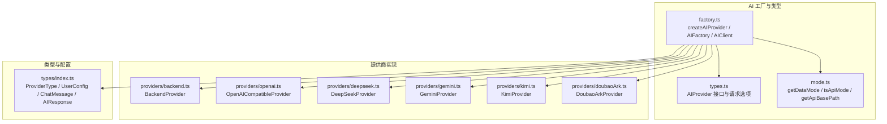
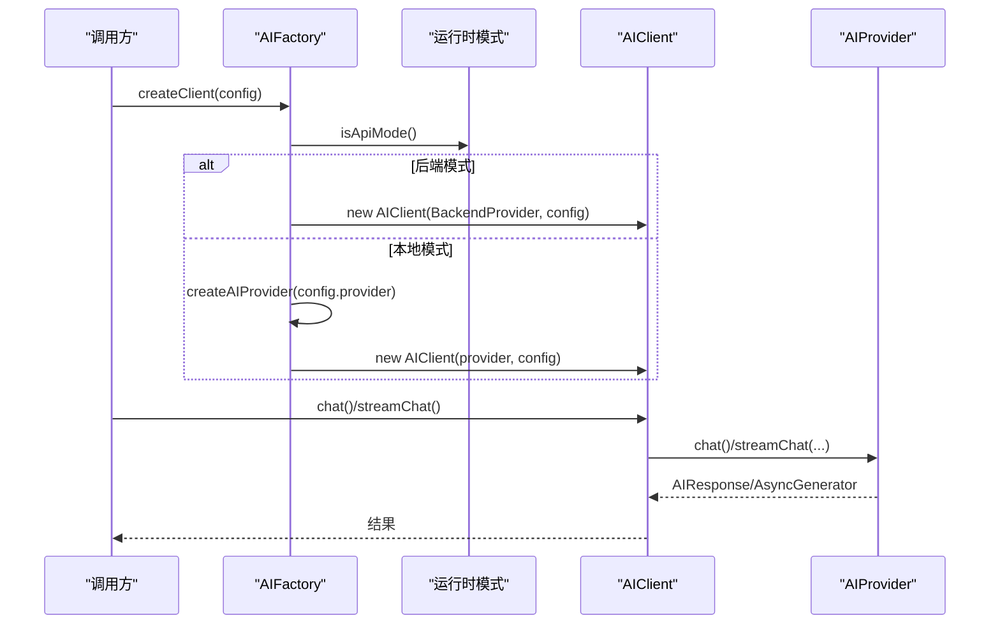
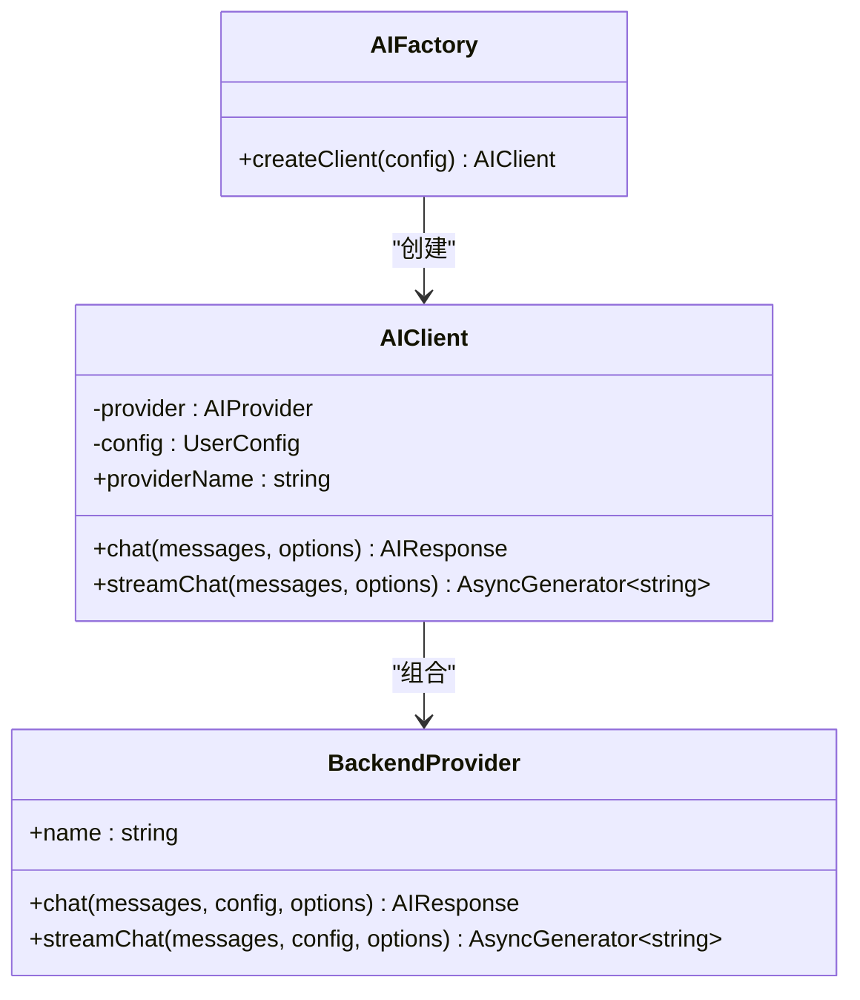
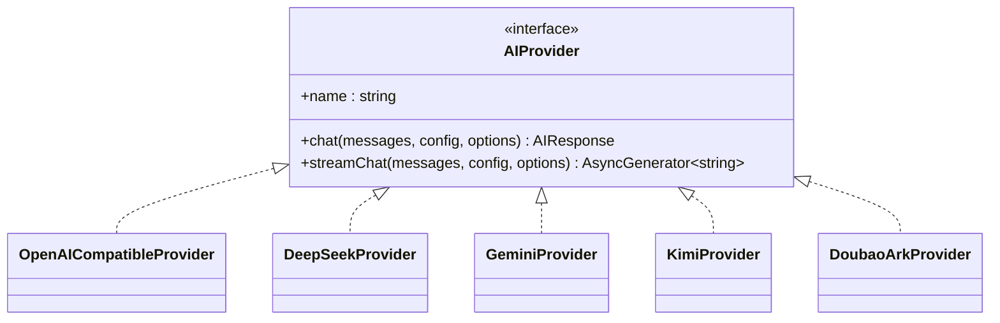
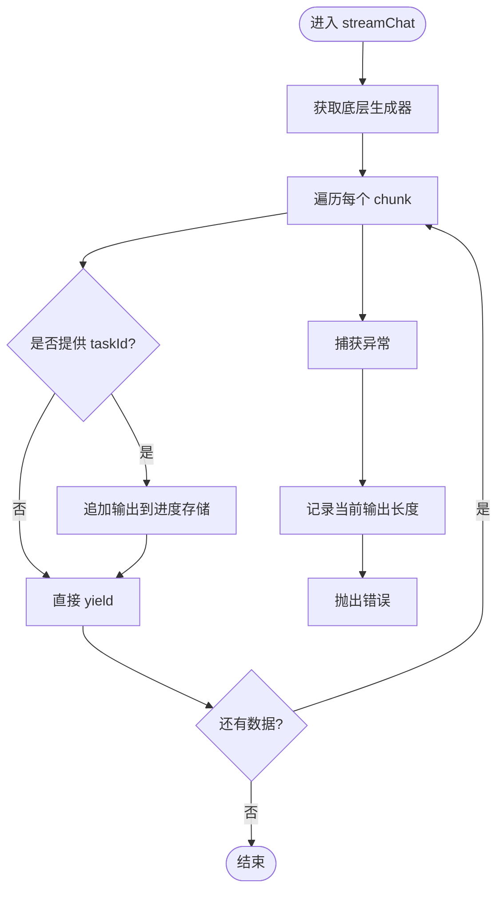
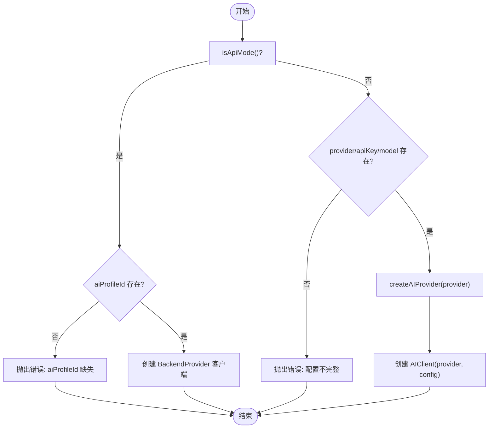
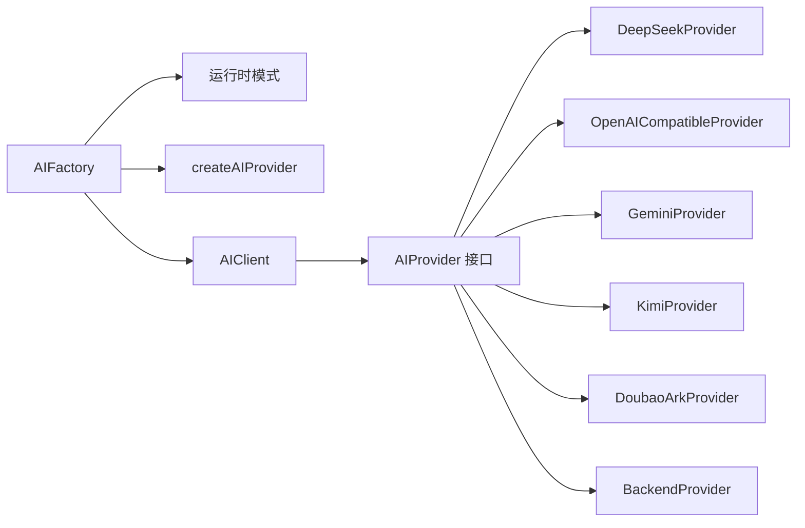

# AI提供商工厂

<cite>
**本文档引用的文件**
- [apps/web/src/lib/ai/factory.ts](file://apps/web/src/lib/ai/factory.ts)
- [apps/web/src/lib/ai/types.ts](file://apps/web/src/lib/ai/types.ts)
- [apps/web/src/lib/runtime/mode.ts](file://apps/web/src/lib/runtime/mode.ts)
- [apps/web/src/lib/ai/providers/backend.ts](file://apps/web/src/lib/ai/providers/backend.ts)
- [apps/web/src/lib/ai/providers/openai.ts](file://apps/web/src/lib/ai/providers/openai.ts)
- [apps/web/src/lib/ai/providers/deepseek.ts](file://apps/web/src/lib/ai/providers/deepseek.ts)
- [apps/web/src/lib/ai/providers/gemini.ts](file://apps/web/src/lib/ai/providers/gemini.ts)
- [apps/web/src/lib/ai/providers/kimi.ts](file://apps/web/src/lib/ai/providers/kimi.ts)
- [apps/web/src/lib/ai/providers/doubaoArk.ts](file://apps/web/src/lib/ai/providers/doubaoArk.ts)
- [apps/web/src/types/index.ts](file://apps/web/src/types/index.ts)
- [apps/web/src/lib/ai/factory.test.ts](file://apps/web/src/lib/ai/factory.test.ts)
- [apps/web/src/lib/ai/providers/providers.test.ts](file://apps/web/src/lib/ai/providers/providers.test.ts)
</cite>

## 目录

1. [简介](#简介)
2. [项目结构](#项目结构)
3. [核心组件](#核心组件)
4. [架构总览](#架构总览)
5. [详细组件分析](#详细组件分析)
6. [依赖关系分析](#依赖关系分析)
7. [性能考量](#性能考量)
8. [故障排查指南](#故障排查指南)
9. [结论](#结论)
10. [附录](#附录)

## 简介

本文件系统化梳理 AIXSSS 的 AI 提供商工厂模式，围绕以下目标展开：

- 工厂函数 createAIProvider 的设计原理与实现机制
- 各 AI 提供商的初始化流程与配置管理
- AIClient 封装模式、客户端生命周期与配置传递
- 后端模式与本地模式的差异、切换逻辑与安全考量
- 具体提供商创建示例、错误处理策略与最佳实践
- 扩展新 AI 提供商的步骤与代码模板

## 项目结构

AI 工厂与提供商相关代码主要位于 Web 前端应用中，采用按功能模块组织：

- 工厂与类型定义：apps/web/src/lib/ai
- 运行时模式判定：apps/web/src/lib/runtime/mode.ts
- 提供商实现：apps/web/src/lib/ai/providers/\*
- 类型定义：apps/web/src/types/index.ts

**图表来源**

- [apps/web/src/lib/ai/factory.ts](file://apps/web/src/lib/ai/factory.ts#L1-L98)
- [apps/web/src/lib/ai/types.ts](file://apps/web/src/lib/ai/types.ts#L1-L30)
- [apps/web/src/lib/runtime/mode.ts](file://apps/web/src/lib/runtime/mode.ts#L1-L30)
- [apps/web/src/lib/ai/providers/backend.ts](file://apps/web/src/lib/ai/providers/backend.ts#L1-L25)
- [apps/web/src/lib/ai/providers/openai.ts](file://apps/web/src/lib/ai/providers/openai.ts#L1-L384)
- [apps/web/src/lib/ai/providers/deepseek.ts](file://apps/web/src/lib/ai/providers/deepseek.ts#L1-L140)
- [apps/web/src/lib/ai/providers/gemini.ts](file://apps/web/src/lib/ai/providers/gemini.ts#L1-L172)
- [apps/web/src/lib/ai/providers/kimi.ts](file://apps/web/src/lib/ai/providers/kimi.ts#L1-L164)
- [apps/web/src/lib/ai/providers/doubaoArk.ts](file://apps/web/src/lib/ai/providers/doubaoArk.ts#L1-L186)
- [apps/web/src/types/index.ts](file://apps/web/src/types/index.ts#L643-L726)

**章节来源**

- [apps/web/src/lib/ai/factory.ts](file://apps/web/src/lib/ai/factory.ts#L1-L98)
- [apps/web/src/lib/ai/types.ts](file://apps/web/src/lib/ai/types.ts#L1-L30)
- [apps/web/src/lib/runtime/mode.ts](file://apps/web/src/lib/runtime/mode.ts#L1-L30)
- [apps/web/src/types/index.ts](file://apps/web/src/types/index.ts#L643-L726)

## 核心组件

- 工厂函数 createAIProvider：依据 ProviderType 返回具体提供商实例，集中管理提供商注册与选择逻辑。
- AIFactory.createClient：根据运行时模式（后端/本地）与用户配置创建 AIClient。
- AIClient：对 AIProvider 的轻量封装，统一 chat 与 streamChat 调用，并负责流式输出进度上报。
- AIProvider 接口：定义 chat 与 streamChat 的统一契约，屏蔽各提供商差异。
- 运行时模式：通过 getDataMode/isApiMode 控制后端模式与本地模式的切换。

**章节来源**

- [apps/web/src/lib/ai/factory.ts](file://apps/web/src/lib/ai/factory.ts#L12-L97)
- [apps/web/src/lib/ai/types.ts](file://apps/web/src/lib/ai/types.ts#L17-L29)
- [apps/web/src/lib/runtime/mode.ts](file://apps/web/src/lib/runtime/mode.ts#L8-L21)

## 架构总览

工厂模式将“选择提供商”与“调用提供商”的职责分离，配合运行时模式实现灵活部署与安全隔离。

**图表来源**

- [apps/web/src/lib/ai/factory.ts](file://apps/web/src/lib/ai/factory.ts#L77-L97)
- [apps/web/src/lib/runtime/mode.ts](file://apps/web/src/lib/runtime/mode.ts#L19-L21)
- [apps/web/src/lib/ai/providers/backend.ts](file://apps/web/src/lib/ai/providers/backend.ts#L5-L24)

## 详细组件分析

### 工厂函数 createAIProvider

- 设计原则
  - 单一职责：仅负责提供商实例化，不关心配置与运行时模式。
  - 可扩展性：新增提供商只需在 switch 中添加分支并导入类。
  - 明确错误：未知类型直接抛错，便于上层捕获与提示。
- 实现要点
  - 支持类型：deepseek、kimi、doubao-ark、openai-compatible、gemini。
  - 默认分支抛出错误，避免静默失败。
- 使用建议
  - 在 AIFactory.createClient 中统一调用，确保配置与模式校验前置完成。

**章节来源**

- [apps/web/src/lib/ai/factory.ts](file://apps/web/src/lib/ai/factory.ts#L13-L28)

### AIFactory.createClient 与 AIClient

- AIFactory.createClient
  - 后端模式：校验 aiProfileId，创建 BackendProvider 客户端，避免浏览器暴露 apiKey。
  - 本地模式：校验 provider、apiKey、model，创建对应提供商客户端。
- AIClient
  - 封装 provider 与 config，提供统一的 chat 与 streamChat 接口。
  - streamChat 包装底层生成器，拦截每个 chunk 并更新进度存储（若提供 taskId）。
  - 错误处理：即使发生异常，也会在 store 中记录当前已接收输出长度，便于调试与恢复。

**图表来源**

- [apps/web/src/lib/ai/factory.ts](file://apps/web/src/lib/ai/factory.ts#L30-L97)
- [apps/web/src/lib/ai/providers/backend.ts](file://apps/web/src/lib/ai/providers/backend.ts#L5-L24)

**章节来源**

- [apps/web/src/lib/ai/factory.ts](file://apps/web/src/lib/ai/factory.ts#L77-L97)

### 运行时模式与安全考虑

- 模式判定
  - getDataMode：优先读取环境变量，测试环境默认 local，否则默认 api。
  - isApiMode：决定是否启用后端模式。
- 安全策略
  - 后端模式：浏览器不持有 apiKey，通过 aiProfileId 与服务端对接，降低泄露风险。
  - 本地模式：要求完整配置，适合测试/离线场景，但存在密钥暴露风险。
- 最佳实践
  - 生产环境建议使用后端模式；开发/测试可临时使用本地模式。
  - 严格校验 aiProfileId 与 provider 配置，避免空值导致的运行时错误。

**章节来源**

- [apps/web/src/lib/runtime/mode.ts](file://apps/web/src/lib/runtime/mode.ts#L8-L21)
- [apps/web/src/lib/ai/factory.ts](file://apps/web/src/lib/ai/factory.ts#L79-L92)

### AIProvider 接口与配置传递

- 接口契约
  - name：提供商名称，用于 UI 展示与日志识别。
  - chat：同步返回 AIResponse，包含 content 与 tokenUsage。
  - streamChat：异步生成器，逐块产出字符串，便于实时渲染。
- 配置传递
  - AIProviderConfig：包含 provider、apiKey、baseURL、model、generationParams。
  - AIClient 将自身 config 与调用 options 一并传递给提供商，确保参数一致。
- 类型约束
  - ProviderType：限定支持的提供商类型。
  - UserConfig：统一的用户配置结构，支持后端模式下的 aiProfileId。

**章节来源**

- [apps/web/src/lib/ai/types.ts](file://apps/web/src/lib/ai/types.ts#L3-L29)
- [apps/web/src/types/index.ts](file://apps/web/src/types/index.ts#L643-L657)

### 各提供商实现概览

- OpenAI 兼容（OpenAICompatibleProvider）
  - 支持 /v1/chat/completions 与 /v1/responses 两种端点，针对 gpt-5/o 系列模型自动选择更优端点。
  - 流式：优先走 chat/completions stream；若模型偏好 responses，则兜底为非流式 responses。
  - 参数映射：温度、采样、最大 token 等参数按模型能力进行兼容处理。
- DeepSeek（DeepSeekProvider）
  - 默认 baseURL：api.deepseek.com。
  - 流式解析：标准 SSE 格式，逐块解析 choices.delta.content。
- Gemini（GeminiProvider）
  - 请求体转换：将 messages 转换为 contents/parts 结构，系统消息转为用户消息前缀。
  - 认证：使用 x-goog-api-key 头部。
  - 流式：使用 alt=sse 的 streamGenerateContent 端点。
- Kimi（KimiProvider）
  - 思维模型（含 thinking）自动调整温度与最大 token。
  - 流式解析：delta.content，部分模型不返回 reasoning_content。
- Doubao/ARK（DoubaoArkProvider）
  - 自动清洗 apiKey 与 model，支持 ep-... 接入点 ID 与模型 ID。
  - 流式：当前实现为非流式 responses，保证可用性。

**图表来源**

- [apps/web/src/lib/ai/types.ts](file://apps/web/src/lib/ai/types.ts#L17-L29)
- [apps/web/src/lib/ai/providers/openai.ts](file://apps/web/src/lib/ai/providers/openai.ts#L171-L383)
- [apps/web/src/lib/ai/providers/deepseek.ts](file://apps/web/src/lib/ai/providers/deepseek.ts#L4-L139)
- [apps/web/src/lib/ai/providers/gemini.ts](file://apps/web/src/lib/ai/providers/gemini.ts#L4-L171)
- [apps/web/src/lib/ai/providers/kimi.ts](file://apps/web/src/lib/ai/providers/kimi.ts#L6-L163)
- [apps/web/src/lib/ai/providers/doubaoArk.ts](file://apps/web/src/lib/ai/providers/doubaoArk.ts#L103-L185)

**章节来源**

- [apps/web/src/lib/ai/providers/openai.ts](file://apps/web/src/lib/ai/providers/openai.ts#L171-L383)
- [apps/web/src/lib/ai/providers/deepseek.ts](file://apps/web/src/lib/ai/providers/deepseek.ts#L4-L139)
- [apps/web/src/lib/ai/providers/gemini.ts](file://apps/web/src/lib/ai/providers/gemini.ts#L4-L171)
- [apps/web/src/lib/ai/providers/kimi.ts](file://apps/web/src/lib/ai/providers/kimi.ts#L6-L163)
- [apps/web/src/lib/ai/providers/doubaoArk.ts](file://apps/web/src/lib/ai/providers/doubaoArk.ts#L103-L185)

### 流式处理与进度上报

- AIClient.streamChat 包装底层生成器，逐块将增量输出写入进度存储（若提供 taskId）。
- 异常处理：即使发生错误，也会记录当前已接收输出长度，便于定位问题与恢复。

**图表来源**

- [apps/web/src/lib/ai/factory.ts](file://apps/web/src/lib/ai/factory.ts#L47-L74)

**章节来源**

- [apps/web/src/lib/ai/factory.ts](file://apps/web/src/lib/ai/factory.ts#L47-L74)

### 后端模式与本地模式切换逻辑

- 切换条件：isApiMode() 返回 true 时进入后端模式。
- 后端模式
  - 必须提供 aiProfileId，否则抛出明确错误。
  - 使用 BackendProvider，所有调用经由服务端代理，浏览器不持有 apiKey。
- 本地模式
  - 必须提供 provider、apiKey、model，否则抛出错误。
  - 使用 createAIProvider 创建具体提供商实例。

**图表来源**

- [apps/web/src/lib/ai/factory.ts](file://apps/web/src/lib/ai/factory.ts#L77-L97)
- [apps/web/src/lib/runtime/mode.ts](file://apps/web/src/lib/runtime/mode.ts#L19-L21)

**章节来源**

- [apps/web/src/lib/ai/factory.ts](file://apps/web/src/lib/ai/factory.ts#L77-L97)
- [apps/web/src/lib/runtime/mode.ts](file://apps/web/src/lib/runtime/mode.ts#L19-L21)

### 错误处理策略

- 统一错误包装
  - 各提供商在请求失败时，会尝试解析错误详情并抛出带状态码与详情的错误对象。
- 浏览器侧处理
  - AIClient 在流式过程中捕获异常，记录当前输出长度，便于调试与恢复。
- 测试覆盖
  - 单元测试覆盖常见错误场景（401、403、429、500、网络错误、JSON 解析失败等）。

**章节来源**

- [apps/web/src/lib/ai/providers/deepseek.ts](file://apps/web/src/lib/ai/providers/deepseek.ts#L12-L27)
- [apps/web/src/lib/ai/providers/gemini.ts](file://apps/web/src/lib/ai/providers/gemini.ts#L41-L56)
- [apps/web/src/lib/ai/providers/kimi.ts](file://apps/web/src/lib/ai/providers/kimi.ts#L53-L61)
- [apps/web/src/lib/ai/providers/openai.ts](file://apps/web/src/lib/ai/providers/openai.ts#L174-L195)
- [apps/web/src/lib/ai/providers/doubaoArk.ts](file://apps/web/src/lib/ai/providers/doubaoArk.ts#L106-L130)
- [apps/web/src/lib/ai/factory.test.ts](file://apps/web/src/lib/ai/factory.test.ts#L172-L206)
- [apps/web/src/lib/ai/providers/providers.test.ts](file://apps/web/src/lib/ai/providers/providers.test.ts#L102-L154)

### 扩展新 AI 提供商步骤与模板

- 步骤
  - 新增提供商类：实现 AIProvider 接口（name、chat、streamChat）。
  - 注册到工厂：在 createAIProvider 的 switch 中添加新分支并导入类。
  - 类型声明：在 ProviderType 中加入新类型。
  - 配置与参数：在 AIProviderConfig 中扩展必要字段（如 baseURL、特殊参数）。
  - 测试：编写单元测试，覆盖 chat/streamChat、错误处理与边界情况。
- 模板（类结构）
  - 名称：MyProvider
  - 基本结构：实现 name、chat、streamChat 三个方法，遵循现有错误包装与流式解析模式。
  - 示例路径：可参考 DeepSeekProvider、OpenAICompatibleProvider、GeminiProvider 的实现方式。

**章节来源**

- [apps/web/src/lib/ai/factory.ts](file://apps/web/src/lib/ai/factory.ts#L13-L28)
- [apps/web/src/lib/ai/types.ts](file://apps/web/src/lib/ai/types.ts#L3-L9)
- [apps/web/src/types/index.ts](file://apps/web/src/types/index.ts#L643-L644)

## 依赖关系分析

- 组件耦合
  - AIFactory 依赖运行时模式与工厂函数，耦合度低，便于替换与扩展。
  - AIClient 仅依赖 AIProvider 接口，与具体提供商解耦。
- 外部依赖
  - fetch：各提供商均通过 fetch 发起 HTTP 请求。
  - 进度存储：AIClient 在流式时依赖进度存储（store），用于 DevPanel 输出监控。
- 循环依赖
  - 未发现循环依赖，模块边界清晰。

**图表来源**

- [apps/web/src/lib/ai/factory.ts](file://apps/web/src/lib/ai/factory.ts#L77-L97)
- [apps/web/src/lib/ai/types.ts](file://apps/web/src/lib/ai/types.ts#L17-L29)
- [apps/web/src/lib/runtime/mode.ts](file://apps/web/src/lib/runtime/mode.ts#L19-L21)

**章节来源**

- [apps/web/src/lib/ai/factory.ts](file://apps/web/src/lib/ai/factory.ts#L77-L97)
- [apps/web/src/lib/ai/types.ts](file://apps/web/src/lib/ai/types.ts#L17-L29)

## 性能考量

- 流式传输
  - 优先使用流式接口，减少首字节延迟，提升用户体验。
  - 对不支持流式的提供商（如某些 Gemini/ARK），采用非流式兜底，保证可用性。
- 参数优化
  - 根据模型特性选择合适端点与参数（如 gpt-5 优先 responses）。
  - 合理设置温度、topP、maxTokens，平衡质量与成本。
- 错误快速失败
  - 对 4xx/5xx 错误及时中断，避免无效重试消耗资源。

## 故障排查指南

- 常见错误与定位
  - 配置缺失：检查 provider、apiKey、model 是否齐全；后端模式需 aiProfileId。
  - API 错误：查看错误对象的状态码与详情，结合提供商的错误包装信息定位。
  - 流式解析：若出现解析异常，检查 SSE 数据格式与跨块拼接逻辑。
- 调试建议
  - 开启网络面板查看请求 URL、头部与响应体。
  - 在 AIClient.streamChat 中观察进度存储的输出长度变化，辅助定位断点。
  - 使用单元测试复现问题，缩小范围。

**章节来源**

- [apps/web/src/lib/ai/factory.ts](file://apps/web/src/lib/ai/factory.ts#L80-L92)
- [apps/web/src/lib/ai/providers/openai.ts](file://apps/web/src/lib/ai/providers/openai.ts#L174-L195)
- [apps/web/src/lib/ai/providers/deepseek.ts](file://apps/web/src/lib/ai/providers/deepseek.ts#L12-L27)
- [apps/web/src/lib/ai/providers/gemini.ts](file://apps/web/src/lib/ai/providers/gemini.ts#L41-L56)
- [apps/web/src/lib/ai/providers/kimi.ts](file://apps/web/src/lib/ai/providers/kimi.ts#L53-L61)
- [apps/web/src/lib/ai/providers/doubaoArk.ts](file://apps/web/src/lib/ai/providers/doubaoArk.ts#L106-L130)
- [apps/web/src/lib/ai/factory.test.ts](file://apps/web/src/lib/ai/factory.test.ts#L172-L206)

## 结论

AIXSSS 的 AI 提供商工厂通过清晰的接口契约与运行时模式切换，实现了对多家提供商的一致封装与灵活调度。AIClient 将配置与调用抽象为统一入口，既保证了易用性，又兼顾了流式体验与错误恢复。建议在生产环境中优先采用后端模式，确保密钥安全与权限隔离；在开发与测试阶段可使用本地模式以提升效率。扩展新提供商时，遵循现有接口与测试规范，可快速集成并保持系统稳定性。

## 附录

- 提供商类型与默认行为
  - deepseek：默认 baseURL，标准 SSE 流式解析。
  - openai-compatible：智能端点选择与参数映射，优先 responses。
  - gemini：消息格式转换与 API Key 认证，SSE 流式。
  - kimi：思维模型自动参数调整，SSE 流式。
  - doubao-ark：API Key/模型清洗与非流式兜底。
- 最佳实践清单
  - 生产环境使用后端模式，避免密钥泄露。
  - 为每个提供商编写单元测试，覆盖正常与异常路径。
  - 在流式场景中，始终处理跨块数据与解析异常。
  - 合理设置 generationParams，避免超限与高成本。
