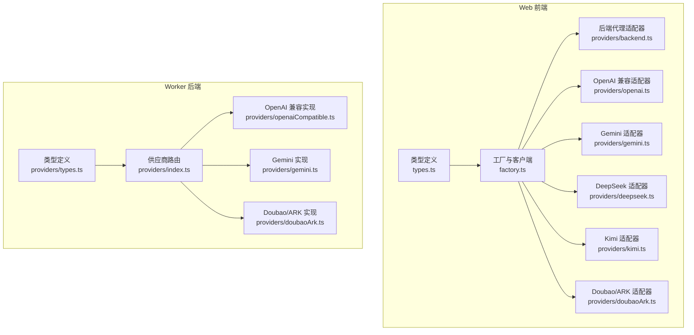
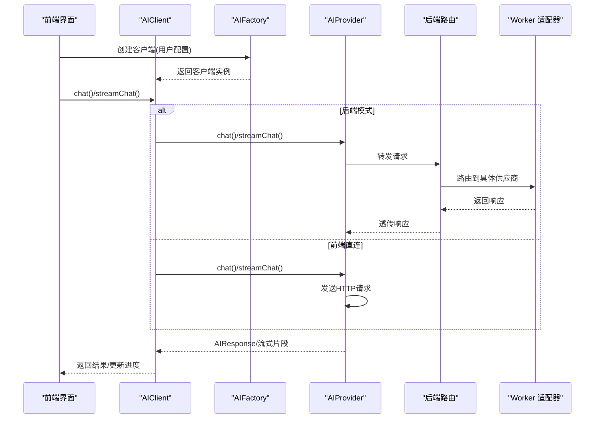
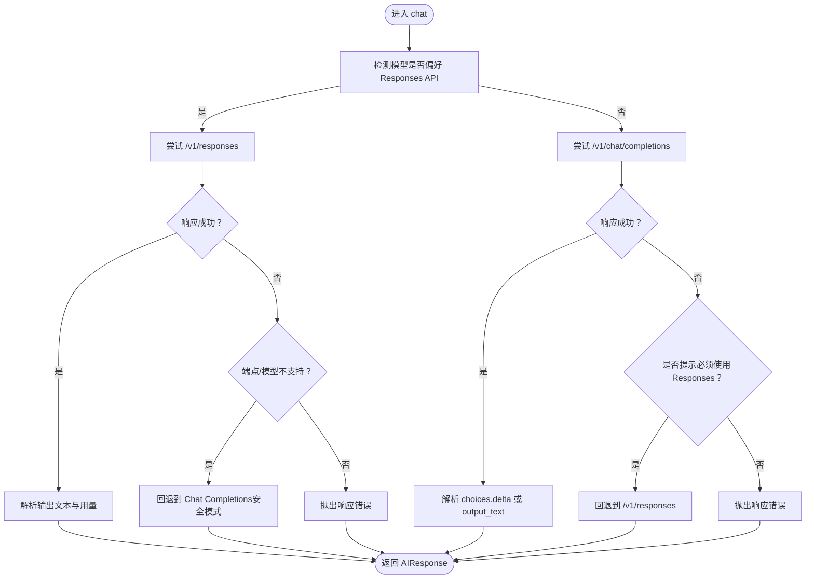
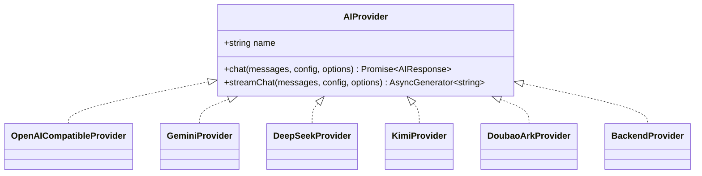

# AI提供商集成

<cite>
**本文引用的文件**
- [apps/web/src/lib/ai/providers/backend.ts](file://apps/web/src/lib/ai/providers/backend.ts)
- [apps/web/src/lib/ai/providers/openai.ts](file://apps/web/src/lib/ai/providers/openai.ts)
- [apps/web/src/lib/ai/providers/gemini.ts](file://apps/web/src/lib/ai/providers/gemini.ts)
- [apps/web/src/lib/ai/providers/deepseek.ts](file://apps/web/src/lib/ai/providers/deepseek.ts)
- [apps/web/src/lib/ai/providers/kimi.ts](file://apps/web/src/lib/ai/providers/kimi.ts)
- [apps/web/src/lib/ai/providers/doubaoArk.ts](file://apps/web/src/lib/ai/providers/doubaoArk.ts)
- [apps/web/src/lib/ai/factory.ts](file://apps/web/src/lib/ai/factory.ts)
- [apps/web/src/lib/ai/types.ts](file://apps/web/src/lib/ai/types.ts)
- [apps/worker/src/providers/index.ts](file://apps/worker/src/providers/index.ts)
- [apps/worker/src/providers/openaiCompatible.ts](file://apps/worker/src/providers/openaiCompatible.ts)
- [apps/worker/src/providers/gemini.ts](file://apps/worker/src/providers/gemini.ts)
- [apps/worker/src/providers/doubaoArk.ts](file://apps/worker/src/providers/doubaoArk.ts)
- [apps/worker/src/providers/types.ts](file://apps/worker/src/providers/types.ts)
- [apps/web/src/types/index.ts](file://apps/web/src/types/index.ts)
- [apps/web/src/lib/ai/providers/providers.test.ts](file://apps/web/src/lib/ai/providers/providers.test.ts)
</cite>

## 目录

1. [简介](#简介)
2. [项目结构](#项目结构)
3. [核心组件](#核心组件)
4. [架构总览](#架构总览)
5. [详细组件分析](#详细组件分析)
6. [依赖关系分析](#依赖关系分析)
7. [性能考量](#性能考量)
8. [故障排除指南](#故障排除指南)
9. [结论](#结论)
10. [附录](#附录)

## 简介

本文件系统性梳理 AIXSSS 的 AI 提供商集成模块，覆盖前端 Web 客户端与后端 Worker 的适配层，统一抽象不同 AI 供应商（OpenAI、Gemini、DeepSeek、Kimi、Doubao/ARK）的 API 差异，提供一致的聊天与流式输出接口。文档重点阐述：

- 各提供商的适配器设计与请求参数映射
- 响应解析与令牌用量统计
- 兼容性处理、错误处理与超时策略
- 后端代理模式与密钥管理
- 配置示例、性能对比与使用建议
- 故障排除与调试技巧

## 项目结构

AI 集成模块主要分布在两个层面：

- Web 前端：提供浏览器直连各供应商的适配器与工厂，以及后端代理适配器
- Worker 后端：提供统一的供应商路由与通用 OpenAI 兼容、Gemini、Doubao/ARK 实现，内置超时与错误处理

图表来源

- [apps/web/src/lib/ai/types.ts](file://apps/web/src/lib/ai/types.ts#L1-L30)
- [apps/web/src/lib/ai/factory.ts](file://apps/web/src/lib/ai/factory.ts#L1-L98)
- [apps/web/src/lib/ai/providers/backend.ts](file://apps/web/src/lib/ai/providers/backend.ts#L1-L25)
- [apps/web/src/lib/ai/providers/openai.ts](file://apps/web/src/lib/ai/providers/openai.ts#L1-L384)
- [apps/web/src/lib/ai/providers/gemini.ts](file://apps/web/src/lib/ai/providers/gemini.ts#L1-L172)
- [apps/web/src/lib/ai/providers/deepseek.ts](file://apps/web/src/lib/ai/providers/deepseek.ts#L1-L140)
- [apps/web/src/lib/ai/providers/kimi.ts](file://apps/web/src/lib/ai/providers/kimi.ts#L1-L164)
- [apps/web/src/lib/ai/providers/doubaoArk.ts](file://apps/web/src/lib/ai/providers/doubaoArk.ts#L1-L186)
- [apps/worker/src/providers/types.ts](file://apps/worker/src/providers/types.ts#L1-L84)
- [apps/worker/src/providers/index.ts](file://apps/worker/src/providers/index.ts#L1-L44)
- [apps/worker/src/providers/openaiCompatible.ts](file://apps/worker/src/providers/openaiCompatible.ts#L1-L438)
- [apps/worker/src/providers/gemini.ts](file://apps/worker/src/providers/gemini.ts#L1-L125)
- [apps/worker/src/providers/doubaoArk.ts](file://apps/worker/src/providers/doubaoArk.ts#L1-L301)

章节来源

- [apps/web/src/lib/ai/types.ts](file://apps/web/src/lib/ai/types.ts#L1-L30)
- [apps/web/src/lib/ai/factory.ts](file://apps/web/src/lib/ai/factory.ts#L1-L98)
- [apps/worker/src/providers/types.ts](file://apps/worker/src/providers/types.ts#L1-L84)
- [apps/worker/src/providers/index.ts](file://apps/worker/src/providers/index.ts#L1-L44)

## 核心组件

- AIProvider 接口：统一 chat 与 streamChat 能力，定义名称与配置契约
- AIProviderConfig：封装 provider 类型、API Key、基础 URL、模型与生成参数
- AIRequestOptions：可选的 AbortSignal 与任务 ID，用于前端进度桥接
- AIFactory/AIClient：根据运行模式（前端直连/后端代理）选择适配器并包装流式输出

章节来源

- [apps/web/src/lib/ai/types.ts](file://apps/web/src/lib/ai/types.ts#L1-L30)
- [apps/web/src/lib/ai/factory.ts](file://apps/web/src/lib/ai/factory.ts#L30-L98)
- [apps/web/src/types/index.ts](file://apps/web/src/types/index.ts#L644-L657)

## 架构总览

前端与后端的适配器均遵循同一接口，但调用路径不同：

- 前端直连模式：通过各提供商适配器直接调用远端 API
- 后端代理模式：通过后端路由转发请求，前端仅负责组装消息与配置

图表来源

- [apps/web/src/lib/ai/factory.ts](file://apps/web/src/lib/ai/factory.ts#L77-L98)
- [apps/web/src/lib/ai/providers/backend.ts](file://apps/web/src/lib/ai/providers/backend.ts#L1-L25)
- [apps/worker/src/providers/index.ts](file://apps/worker/src/providers/index.ts#L12-L25)

## 详细组件分析

### OpenAI 兼容适配器（Web 与 Worker）

- 设计要点
  - 自动识别模型偏好，优先使用 Responses API（如 GPT-5、o 系列），并在不支持时回退到 Chat Completions
  - 参数映射：temperature/topP/presencePenalty/frequencyPenalty/maxTokens（Responses 使用 max_output_tokens，Chat 使用 max_tokens）
  - 推理强度（reasoningEffort）按模型族进行兼容性归一化
  - 响应解析：统一提取文本内容与 tokenUsage（兼容 prompt_tokens/input_tokens 等字段）
- 错误处理
  - 统一抛出 HTTP 错误，包含状态码与详情
  - 对 response_format/structured outputs 不支持的情况进行回退尝试
- 超时与重试
  - Worker 层内置超时控制（可通过环境变量配置），前端适配器通过 AbortSignal 支持取消
- 流式输出
  - Web 端使用 SSE 解析 delta 内容；GPT-5 在 streamChat 中兜底为非流式 responses

图表来源

- [apps/web/src/lib/ai/providers/openai.ts](file://apps/web/src/lib/ai/providers/openai.ts#L197-L308)
- [apps/worker/src/providers/openaiCompatible.ts](file://apps/worker/src/providers/openaiCompatible.ts#L275-L389)

章节来源

- [apps/web/src/lib/ai/providers/openai.ts](file://apps/web/src/lib/ai/providers/openai.ts#L1-L384)
- [apps/worker/src/providers/openaiCompatible.ts](file://apps/worker/src/providers/openaiCompatible.ts#L1-L438)

### Gemini 适配器（Web 与 Worker）

- 设计要点
  - 将标准消息格式转换为 Gemini contents/part 结构，系统消息转为用户消息前缀
  - 使用 x-goog-api-key 认证头
  - 流式接口使用 SSE，行首 data: 解析 candidates.parts.text
- 错误处理
  - 统一解析 error.message 或回退文本内容
- 超时与重试
  - Worker 层内置超时控制；前端通过 AbortSignal 支持取消

章节来源

- [apps/web/src/lib/ai/providers/gemini.ts](file://apps/web/src/lib/ai/providers/gemini.ts#L1-L172)
- [apps/worker/src/providers/gemini.ts](file://apps/worker/src/providers/gemini.ts#L1-L125)

### DeepSeek 适配器（Web）

- 设计要点
  - 使用 /v1/chat/completions，支持 temperature/topP/maxTokens/presencePenalty/frequencyPenalty
  - 响应解析 choices[0].message.content 与 usage
- 错误处理
  - 统一解析 error.message 或回退文本内容

章节来源

- [apps/web/src/lib/ai/providers/deepseek.ts](file://apps/web/src/lib/ai/providers/deepseek.ts#L1-L140)

### Kimi 适配器（Web）

- 设计要点
  - 思考类模型（包含 thinking）强制温度与最大 token 策略
  - 流式接口解析 delta.content，支持 K2 Thinking 模型
- 错误处理
  - 记录状态码与响应体并抛出明确错误

章节来源

- [apps/web/src/lib/ai/providers/kimi.ts](file://apps/web/src/lib/ai/providers/kimi.ts#L1-L164)

### Doubao/ARK 适配器（Web 与 Worker）

- 设计要点
  - 仅使用 Responses API，支持结构化输出（JSON Schema/JSON Object）
  - Key 规范化：去除 Bearer 前缀与多余空白；模型规范化：优先提取 ep- 接入点
  - 用量映射：兼容 prompt_tokens/input_tokens 等字段
  - 图像生成：支持 images/generations，SeedEdit 模型支持 seed
- 错误处理
  - 401/403 提示使用“方舟控制台”生成的 API Key，且不要包含 Bearer 前缀
- 超时与重试
  - Worker 层内置超时控制；前端通过 AbortSignal 支持取消

章节来源

- [apps/web/src/lib/ai/providers/doubaoArk.ts](file://apps/web/src/lib/ai/providers/doubaoArk.ts#L1-L186)
- [apps/worker/src/providers/doubaoArk.ts](file://apps/worker/src/providers/doubaoArk.ts#L1-L301)

### 后端代理适配器（Web）

- 设计要点
  - 前端不持有 API Key，通过 aiProfileId 走后端代理
  - chat/messages 请求经后端路由到具体供应商实现
- 错误处理
  - 若未绑定 aiProfileId，抛出明确错误

章节来源

- [apps/web/src/lib/ai/providers/backend.ts](file://apps/web/src/lib/ai/providers/backend.ts#L1-L25)
- [apps/web/src/lib/ai/factory.ts](file://apps/web/src/lib/ai/factory.ts#L77-L98)

## 依赖关系分析

图表来源

- [apps/web/src/lib/ai/types.ts](file://apps/web/src/lib/ai/types.ts#L17-L29)
- [apps/web/src/lib/ai/providers/openai.ts](file://apps/web/src/lib/ai/providers/openai.ts#L171-L172)
- [apps/web/src/lib/ai/providers/gemini.ts](file://apps/web/src/lib/ai/providers/gemini.ts#L4-L5)
- [apps/web/src/lib/ai/providers/deepseek.ts](file://apps/web/src/lib/ai/providers/deepseek.ts#L4-L5)
- [apps/web/src/lib/ai/providers/kimi.ts](file://apps/web/src/lib/ai/providers/kimi.ts#L6-L7)
- [apps/web/src/lib/ai/providers/doubaoArk.ts](file://apps/web/src/lib/ai/providers/doubaoArk.ts#L103-L104)
- [apps/web/src/lib/ai/providers/backend.ts](file://apps/web/src/lib/ai/providers/backend.ts#L5-L6)

章节来源

- [apps/web/src/lib/ai/types.ts](file://apps/web/src/lib/ai/types.ts#L17-L29)
- [apps/web/src/lib/ai/factory.ts](file://apps/web/src/lib/ai/factory.ts#L12-L28)

## 性能考量

- 超时与取消
  - Worker 层通过 AbortController 控制请求超时（默认约 120 秒，可通过环境变量调整）
  - 前端通过 AbortSignal 传递给适配器，支持用户中断长请求
- 流式输出
  - Web 端对 SSE 进行增量解析，降低首字延迟
  - 对于 GPT-5 等不支持流式的模型，streamChat 会兜底为非流式 responses
- Token 用量
  - 统一映射 prompt/completion/total，便于成本估算与预算控制
- 模型偏好
  - 优先使用 Responses API（如 GPT-5、o 系列）可减少参数兼容性问题并提升稳定性

章节来源

- [apps/worker/src/providers/openaiCompatible.ts](file://apps/worker/src/providers/openaiCompatible.ts#L52-L76)
- [apps/web/src/lib/ai/providers/openai.ts](file://apps/web/src/lib/ai/providers/openai.ts#L310-L321)

## 故障排除指南

- 常见错误与定位
  - 401/403：检查 API Key 是否来自“方舟控制台”，不要包含 Bearer 前缀或多余空白
  - 400/404：可能是端点不支持 Responses 或参数不兼容，框架会自动回退
  - 网络/超时：检查网络/VPN/供应商可用性，适当提高超时阈值
- 调试技巧
  - 前端：利用 AIClient 的 taskId 将流式片段写入进度存储，便于 DevPanel 观察
  - 后端：通过 Worker 日志查看路由与错误详情
  - 单元测试：参考 providers.test.ts 的断言与边界条件，快速验证适配器行为

章节来源

- [apps/web/src/lib/ai/providers/doubaoArk.ts](file://apps/web/src/lib/ai/providers/doubaoArk.ts#L118-L130)
- [apps/worker/src/providers/openaiCompatible.ts](file://apps/worker/src/providers/openaiCompatible.ts#L52-L76)
- [apps/web/src/lib/ai/providers/providers.test.ts](file://apps/web/src/lib/ai/providers/providers.test.ts#L1-L797)

## 结论

本集成模块通过统一的 AIProvider 接口与工厂模式，屏蔽了多家供应商的差异，实现了：

- 一致的聊天与流式输出能力
- 健壮的兼容性与错误回退策略
- 可配置的超时与取消机制
- 前端直连与后端代理两种部署形态

在实际使用中，建议优先选择支持 Responses API 的模型（如 GPT-5、o 系列），并结合结构化输出需求选择合适的供应商。

## 附录

### 配置示例与最佳实践

- 基础配置项
  - provider：供应商类型（deepseek、kimi、gemini、openai-compatible、doubao-ark）
  - apiKey：供应商 API Key
  - baseURL：供应商基础 URL（若为空则使用默认）
  - model：模型名称
  - generationParams：温度、采样、惩罚、最大 token 等参数
  - aiProfileId：后端模式下的档案 ID
- 最佳实践
  - 使用 Responses API（如适用）以获得更稳定的结构化输出
  - 对于需要强一致 JSON 的链路，建议关闭推理思考或使用 JSON Schema
  - 合理设置 maxTokens 与温度，平衡质量与成本
  - 在生产环境启用后端代理，避免前端暴露敏感密钥

章节来源

- [apps/web/src/types/index.ts](file://apps/web/src/types/index.ts#L644-L657)
- [apps/web/src/lib/ai/factory.ts](file://apps/web/src/lib/ai/factory.ts#L77-L98)
