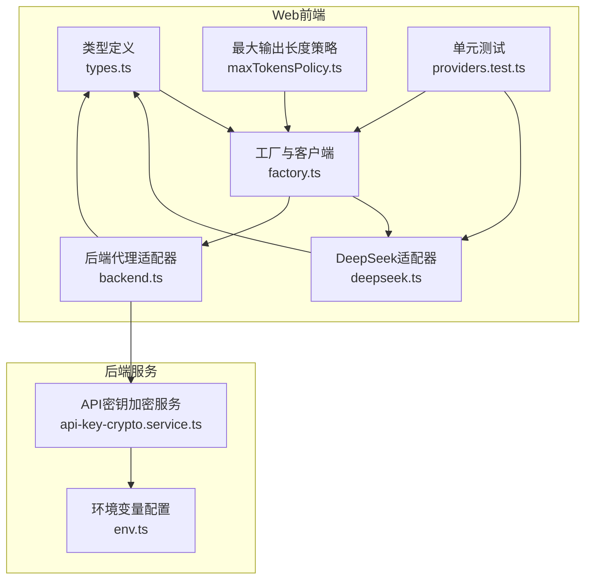
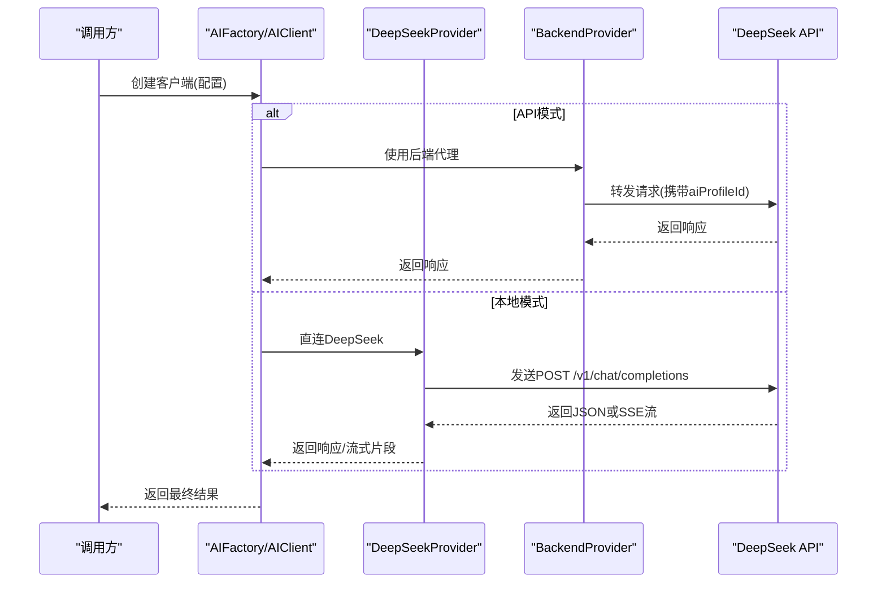
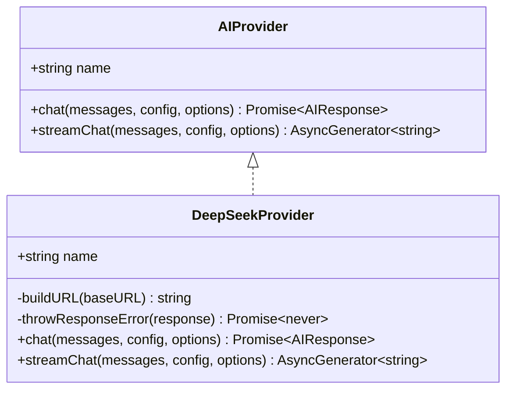
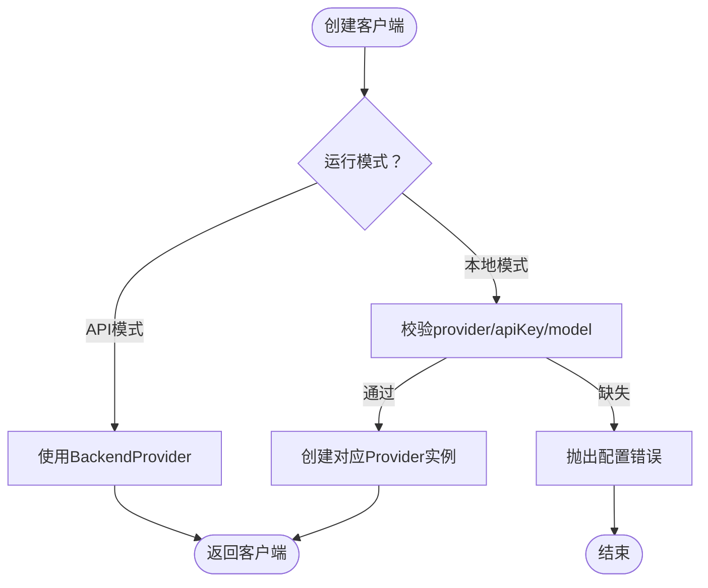
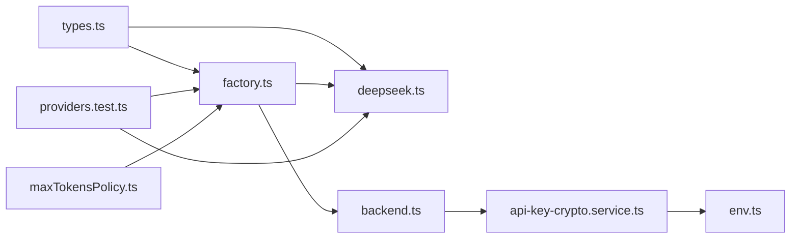

# DeepSeek集成

<cite>
**本文档引用的文件**
- [apps/web/src/lib/ai/providers/deepseek.ts](file://apps/web/src/lib/ai/providers/deepseek.ts)
- [apps/web/src/lib/ai/factory.ts](file://apps/web/src/lib/ai/factory.ts)
- [apps/web/src/lib/ai/types.ts](file://apps/web/src/lib/ai/types.ts)
- [apps/web/src/lib/ai/maxTokensPolicy.ts](file://apps/web/src/lib/ai/maxTokensPolicy.ts)
- [apps/web/src/lib/ai/providers/providers.test.ts](file://apps/web/src/lib/ai/providers/providers.test.ts)
- [apps/web/src/lib/ai/providers/backend.ts](file://apps/web/src/lib/ai/providers/backend.ts)
- [apps/web/src/types/index.ts](file://apps/web/src/types/index.ts)
- [apps/api/src/crypto/api-key-crypto.service.ts](file://apps/api/src/crypto/api-key-crypto.service.ts)
- [apps/api/src/config/env.ts](file://apps/api/src/config/env.ts)
- [apps/web/env.example](file://apps/web/env.example)
</cite>

## 目录

1. [简介](#简介)
2. [项目结构](#项目结构)
3. [核心组件](#核心组件)
4. [架构总览](#架构总览)
5. [详细组件分析](#详细组件分析)
6. [依赖关系分析](#依赖关系分析)
7. [性能考虑](#性能考虑)
8. [故障排除指南](#故障排除指南)
9. [结论](#结论)
10. [附录](#附录)

## 简介

本文件面向DeepSeek集成模块，系统性阐述适配器实现、模型与参数配置、响应处理流程、错误处理策略以及最佳实践。文档同时覆盖API密钥管理、请求格式化、流式与非流式两种调用方式、以及在前端工厂模式下的统一接入方式。目标是帮助开发者快速理解并正确使用DeepSeek适配器，确保在不同运行模式（本地直连与后端代理）下稳定工作。

## 项目结构

DeepSeek适配器位于Web前端侧的AI抽象层，采用统一接口与工厂模式进行封装，便于与后端模式切换及扩展其他供应商。

图表来源

- [apps/web/src/lib/ai/types.ts](file://apps/web/src/lib/ai/types.ts#L1-L30)
- [apps/web/src/lib/ai/factory.ts](file://apps/web/src/lib/ai/factory.ts#L1-L98)
- [apps/web/src/lib/ai/providers/deepseek.ts](file://apps/web/src/lib/ai/providers/deepseek.ts#L1-L140)
- [apps/web/src/lib/ai/providers/backend.ts](file://apps/web/src/lib/ai/providers/backend.ts#L1-L25)
- [apps/web/src/lib/ai/maxTokensPolicy.ts](file://apps/web/src/lib/ai/maxTokensPolicy.ts#L1-L63)
- [apps/web/src/lib/ai/providers/providers.test.ts](file://apps/web/src/lib/ai/providers/providers.test.ts#L1-L797)
- [apps/api/src/crypto/api-key-crypto.service.ts](file://apps/api/src/crypto/api-key-crypto.service.ts#L1-L39)
- [apps/api/src/config/env.ts](file://apps/api/src/config/env.ts#L1-L17)

章节来源

- [apps/web/src/lib/ai/types.ts](file://apps/web/src/lib/ai/types.ts#L1-L30)
- [apps/web/src/lib/ai/factory.ts](file://apps/web/src/lib/ai/factory.ts#L1-L98)
- [apps/web/src/lib/ai/providers/deepseek.ts](file://apps/web/src/lib/ai/providers/deepseek.ts#L1-L140)
- [apps/web/src/lib/ai/providers/backend.ts](file://apps/web/src/lib/ai/providers/backend.ts#L1-L25)
- [apps/web/src/lib/ai/maxTokensPolicy.ts](file://apps/web/src/lib/ai/maxTokensPolicy.ts#L1-L63)
- [apps/web/src/lib/ai/providers/providers.test.ts](file://apps/web/src/lib/ai/providers/providers.test.ts#L1-L797)
- [apps/api/src/crypto/api-key-crypto.service.ts](file://apps/api/src/crypto/api-key-crypto.service.ts#L1-L39)
- [apps/api/src/config/env.ts](file://apps/api/src/config/env.ts#L1-L17)

## 核心组件

- DeepSeekProvider：实现AIProvider接口，负责构建请求URL、格式化请求体、处理响应与流式输出、以及错误包装。
- AIFactory/AIClient：工厂与客户端封装，根据运行模式（本地直连或后端代理）选择具体Provider，并提供统一的chat与streamChat接口。
- 类型系统：AIProviderConfig、AIRequestOptions、AIProvider接口定义，确保配置项与调用选项一致。
- 最大输出长度策略：针对DeepSeek不同模型给出UI与业务约束的策略与钳制函数。
- 后端代理：在API模式下，通过后端服务转发请求，前端不直接持有API Key。

章节来源

- [apps/web/src/lib/ai/providers/deepseek.ts](file://apps/web/src/lib/ai/providers/deepseek.ts#L4-L140)
- [apps/web/src/lib/ai/factory.ts](file://apps/web/src/lib/ai/factory.ts#L12-L98)
- [apps/web/src/lib/ai/types.ts](file://apps/web/src/lib/ai/types.ts#L3-L29)
- [apps/web/src/lib/ai/maxTokensPolicy.ts](file://apps/web/src/lib/ai/maxTokensPolicy.ts#L26-L62)
- [apps/web/src/lib/ai/providers/backend.ts](file://apps/web/src/lib/ai/providers/backend.ts#L5-L24)

## 架构总览

DeepSeek适配器遵循统一的AIProvider接口，通过工厂模式在本地与后端两种模式之间无缝切换。本地模式下，前端直接调用DeepSeek API；后端模式下，请求经由后端服务代理并进行密钥加密处理。

图表来源

- [apps/web/src/lib/ai/factory.ts](file://apps/web/src/lib/ai/factory.ts#L77-L97)
- [apps/web/src/lib/ai/providers/deepseek.ts](file://apps/web/src/lib/ai/providers/deepseek.ts#L29-L138)
- [apps/web/src/lib/ai/providers/backend.ts](file://apps/web/src/lib/ai/providers/backend.ts#L8-L23)

## 详细组件分析

### DeepSeekProvider实现

- URL构建：默认基础地址为DeepSeek官方域名，自动去除末尾斜杠并拼接标准端点。
- 请求格式化：支持模型名、消息数组、温度、top_p、max_tokens、presence_penalty、frequency_penalty等参数；按需注入。
- 非流式chat：发送POST请求，解析choices[0].message.content与usage统计。
- 流式streamChat：基于SSE解析data行，提取choices[0].delta.content，遇到[DONE]结束。
- 错误处理：统一包装为带HTTP状态与详情的错误信息，便于上层捕获与提示。

图表来源

- [apps/web/src/lib/ai/types.ts](file://apps/web/src/lib/ai/types.ts#L17-L29)
- [apps/web/src/lib/ai/providers/deepseek.ts](file://apps/web/src/lib/ai/providers/deepseek.ts#L4-L140)

章节来源

- [apps/web/src/lib/ai/providers/deepseek.ts](file://apps/web/src/lib/ai/providers/deepseek.ts#L7-L138)

### 工厂与客户端

- createAIProvider：根据ProviderType返回对应Provider实例，支持deepseek、openai-compatible、gemini、kimi、doubao-ark等。
- AIFactory.createClient：在API模式下强制使用BackendProvider，否则校验配置完整性并创建对应Provider客户端。
- AIClient：统一封装chat与streamChat，支持可选的AbortSignal与任务ID驱动的进度存储更新。

图表来源

- [apps/web/src/lib/ai/factory.ts](file://apps/web/src/lib/ai/factory.ts#L77-L97)

章节来源

- [apps/web/src/lib/ai/factory.ts](file://apps/web/src/lib/ai/factory.ts#L12-L98)

### 类型与配置

- AIProviderConfig：包含provider、apiKey、baseURL、model、generationParams等字段。
- AIRequestOptions：支持AbortSignal与任务ID。
- UserConfig：前端用户配置，支持aiProfileId（API模式）。

章节来源

- [apps/web/src/lib/ai/types.ts](file://apps/web/src/lib/ai/types.ts#L3-L15)
- [apps/web/src/types/index.ts](file://apps/web/src/types/index.ts#L644-L657)

### 最大输出长度策略

- 针对DeepSeek不同模型给出UI范围、步进、推荐默认值与提示文案。
- clampMaxTokens用于将用户输入钳制在策略范围内。

章节来源

- [apps/web/src/lib/ai/maxTokensPolicy.ts](file://apps/web/src/lib/ai/maxTokensPolicy.ts#L26-L62)

### 后端代理与API密钥管理

- BackendProvider：在API模式下，通过后端服务转发请求，前端不持有apiKey。
- API密钥加密：后端使用AES-256-GCM对密钥进行加解密，密钥来源于环境变量配置。

章节来源

- [apps/web/src/lib/ai/providers/backend.ts](file://apps/web/src/lib/ai/providers/backend.ts#L8-L23)
- [apps/api/src/crypto/api-key-crypto.service.ts](file://apps/api/src/crypto/api-key-crypto.service.ts#L17-L35)
- [apps/api/src/config/env.ts](file://apps/api/src/config/env.ts#L8-L8)

## 依赖关系分析

- DeepSeekProvider依赖类型系统与AI抽象接口，确保与工厂与客户端解耦。
- 工厂依赖类型系统与各Provider实现，决定运行时选择。
- 后端模式依赖后端加密服务与环境配置，确保密钥安全。
- 测试覆盖了URL构建、请求体结构、错误处理与流式解析等关键路径。

图表来源

- [apps/web/src/lib/ai/types.ts](file://apps/web/src/lib/ai/types.ts#L1-L30)
- [apps/web/src/lib/ai/factory.ts](file://apps/web/src/lib/ai/factory.ts#L1-L98)
- [apps/web/src/lib/ai/providers/deepseek.ts](file://apps/web/src/lib/ai/providers/deepseek.ts#L1-L140)
- [apps/web/src/lib/ai/providers/backend.ts](file://apps/web/src/lib/ai/providers/backend.ts#L1-L25)
- [apps/api/src/crypto/api-key-crypto.service.ts](file://apps/api/src/crypto/api-key-crypto.service.ts#L1-L39)
- [apps/api/src/config/env.ts](file://apps/api/src/config/env.ts#L1-L17)
- [apps/web/src/lib/ai/providers/providers.test.ts](file://apps/web/src/lib/ai/providers/providers.test.ts#L1-L797)
- [apps/web/src/lib/ai/maxTokensPolicy.ts](file://apps/web/src/lib/ai/maxTokensPolicy.ts#L1-L63)

章节来源

- [apps/web/src/lib/ai/providers/providers.test.ts](file://apps/web/src/lib/ai/providers/providers.test.ts#L12-L277)

## 性能考虑

- 流式输出：优先使用streamChat以获得更好的用户体验与更低的首字延迟。
- 参数优化：合理设置temperature、top_p与max_tokens，避免过长输出导致成本上升与延迟增加。
- 运行模式：在API模式下，后端代理可减少前端网络复杂度与密钥暴露风险。
- 超时与中断：利用AbortSignal控制请求生命周期，结合统一的错误包装提升稳定性。

## 故障排除指南

- 常见错误类型
  - 认证失败：检查apiKey与baseURL是否正确，确认供应商账户状态。
  - 速率限制：观察429错误，适当降低并发或等待配额恢复。
  - 网络异常：检查网络/代理/防火墙，必要时更换baseURL或启用代理。
  - 参数不合法：核对generationParams字段命名与类型，注意DeepSeek使用的字段名与OpenAI兼容差异。
- 定位手段
  - 查看错误信息中的HTTP状态与详情字符串，结合测试用例定位问题。
  - 使用单元测试中的断言点（如URL构建、请求体结构、错误包装）逐项比对。
  - 在流式场景下，确认SSE数据行解析与缓冲区拼接逻辑，避免跨块数据丢失。
- 建议
  - 在本地模式下优先使用默认baseURL进行验证，再切换至自定义域名。
  - 对于高并发场景，建议开启后端代理并配合限流策略。

章节来源

- [apps/web/src/lib/ai/providers/deepseek.ts](file://apps/web/src/lib/ai/providers/deepseek.ts#L12-L27)
- [apps/web/src/lib/ai/providers/providers.test.ts](file://apps/web/src/lib/ai/providers/providers.test.ts#L102-L154)

## 结论

DeepSeek集成通过统一的AIProvider接口与工厂模式实现了灵活的运行时切换与稳定的调用体验。其在本地与后端两种模式下的适配器设计兼顾易用性与安全性，配合完善的错误处理与策略化参数配置，能够满足多样化的应用场景。建议在生产环境中优先采用后端代理模式，并结合流式输出与合理的参数策略以获得最佳性能与成本表现。

## 附录

### 配置示例与使用要点

- 本地直连配置
  - provider: deepseek
  - apiKey: 你的DeepSeek API密钥
  - model: 如 deepseek-chat 或 deepseek-reasoner
  - baseURL: 可选，默认使用官方域名
  - generationParams: 包含temperature、top_p、maxTokens、presence_penalty、frequency_penalty等
- API模式配置
  - provider: deepseek
  - aiProfileId: 服务端AI档案ID（前端不持有apiKey）
  - model: 与后端配置一致
- 建议
  - 使用maxTokensPolicy提供的策略约束UI输入范围。
  - 在高频调用场景下，建议开启流式输出并设置合理的AbortSignal。

章节来源

- [apps/web/src/lib/ai/maxTokensPolicy.ts](file://apps/web/src/lib/ai/maxTokensPolicy.ts#L26-L57)
- [apps/web/src/lib/ai/factory.ts](file://apps/web/src/lib/ai/factory.ts#L77-L97)
- [apps/web/src/types/index.ts](file://apps/web/src/types/index.ts#L644-L657)
