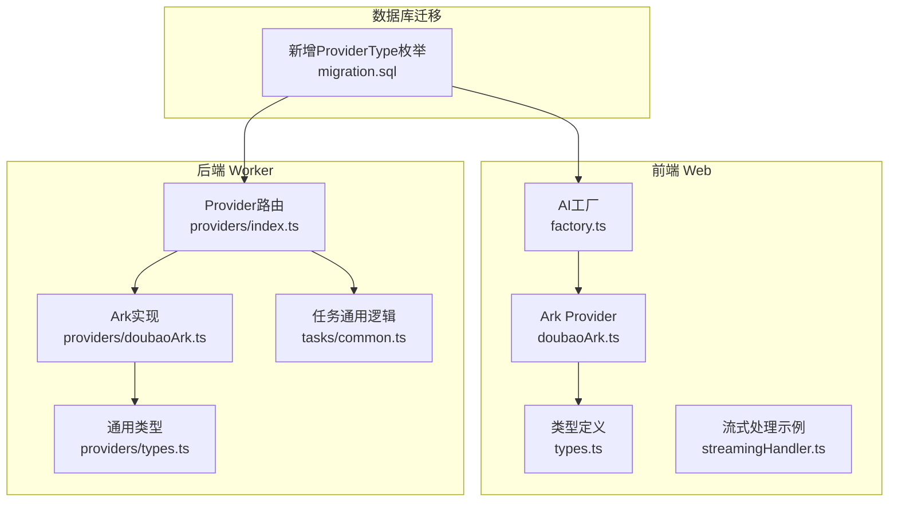
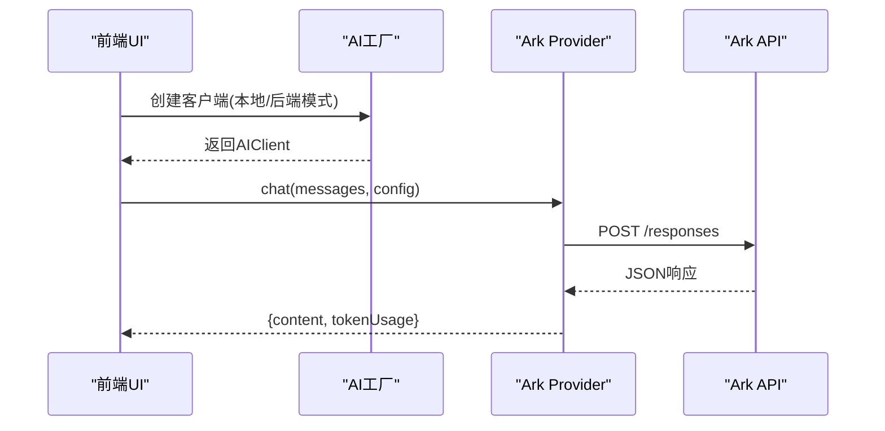
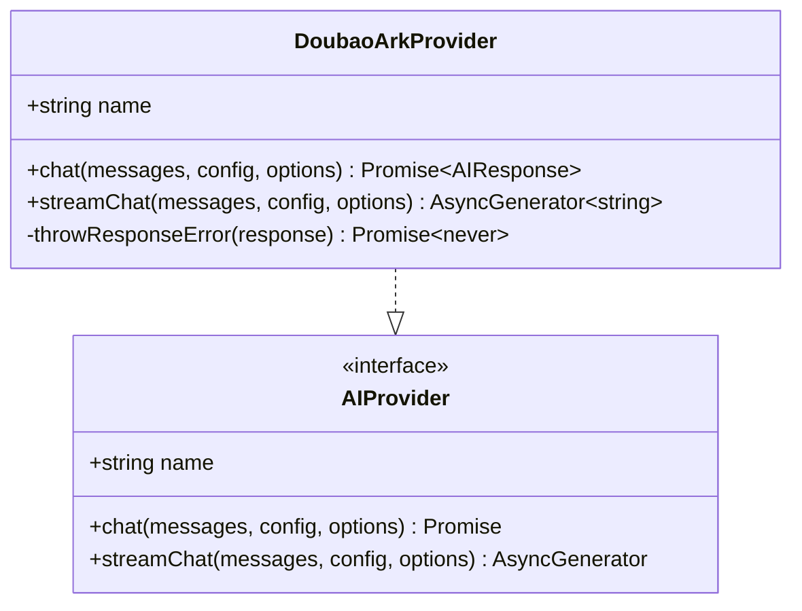
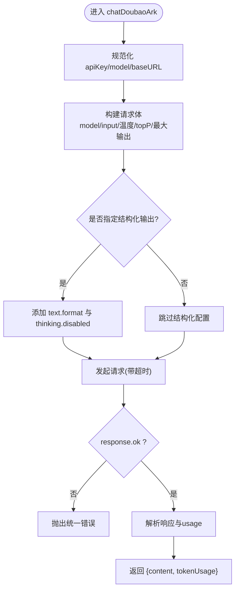
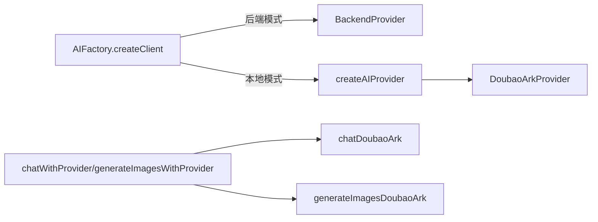
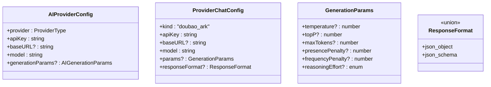
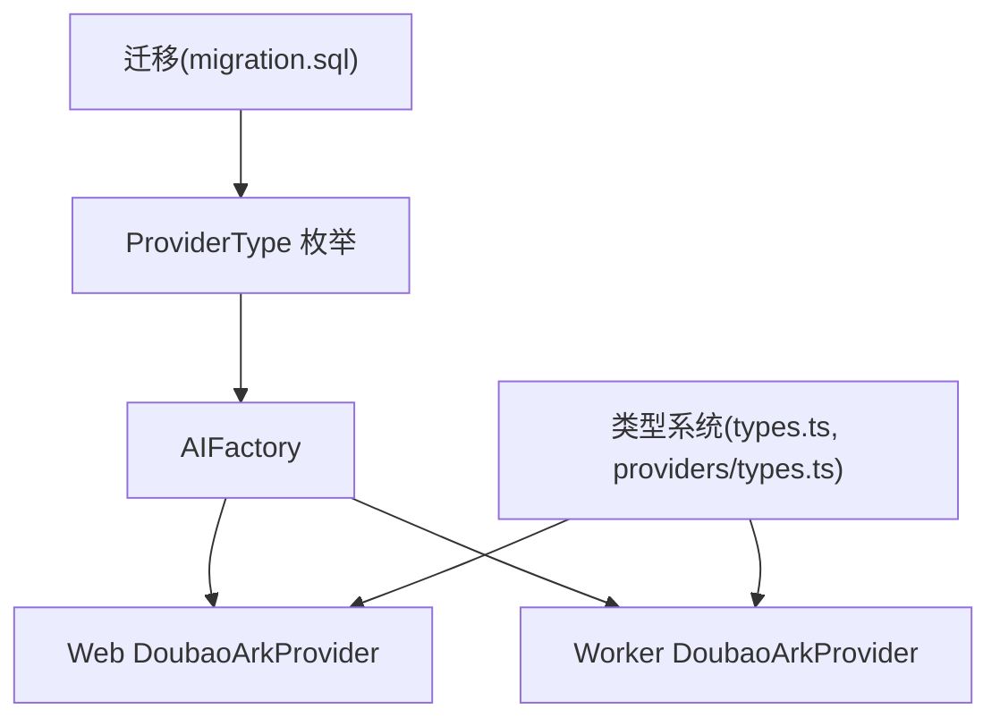

# Doubao Ark集成

<cite>
**本文档引用的文件**
- [apps/web/src/lib/ai/providers/doubaoArk.ts](file://apps/web/src/lib/ai/providers/doubaoArk.ts)
- [apps/worker/src/providers/doubaoArk.ts](file://apps/worker/src/providers/doubaoArk.ts)
- [apps/web/src/lib/ai/factory.ts](file://apps/web/src/lib/ai/factory.ts)
- [apps/worker/src/providers/index.ts](file://apps/worker/src/providers/index.ts)
- [apps/web/src/lib/ai/types.ts](file://apps/web/src/lib/ai/types.ts)
- [apps/worker/src/providers/types.ts](file://apps/worker/src/providers/types.ts)
- [apps/web/src/types/index.ts](file://apps/web/src/types/index.ts)
- [apps/worker/src/tasks/common.ts](file://apps/worker/src/tasks/common.ts)
- [apps/api/prisma/migrations/20260121230000_add_doubao_ark_provider/migration.sql](file://apps/api/prisma/migrations/20260121230000_add_doubao_ark_provider/migration.sql)
- [apps/web/src/lib/ai/streamingHandler.ts](file://apps/web/src/lib/ai/streamingHandler.ts)
- [apps/web/env.example](file://apps/web/env.example)
- [apps/worker/env.example](file://apps/worker/env.example)
</cite>

## 目录

1. [简介](#简介)
2. [项目结构](#项目结构)
3. [核心组件](#核心组件)
4. [架构总览](#架构总览)
5. [详细组件分析](#详细组件分析)
6. [依赖关系分析](#依赖关系分析)
7. [性能考量](#性能考量)
8. [故障排除指南](#故障排除指南)
9. [结论](#结论)
10. [附录](#附录)

## 简介

本文件系统性地介绍字节跳动 Doubao Ark API 的适配器实现，覆盖前端 Web 客户端与后端 Worker 的两套集成方案。文档重点涵盖：

- 多模态内容生成（文本对话与图像生成）的请求构建与响应解析
- Ark 系列模型的特性、适用场景与参数配置
- API 集成方式、请求/响应规范化与错误处理
- 后端代理模式的实现原理与安全考虑
- 完整配置示例、使用指南与最佳实践
- 故障排除方法与性能优化建议

## 项目结构

Doubao Ark 集成横跨前端与后端两个运行时：

- 前端 Web 应用：提供用户界面与本地直连能力，适配 Ark Responses API
- 后端 Worker：提供稳定超时控制、统一错误处理与多模态任务编排（含视频生成）

**图表来源**

- [apps/web/src/lib/ai/factory.ts](file://apps/web/src/lib/ai/factory.ts#L13-L28)
- [apps/web/src/lib/ai/providers/doubaoArk.ts](file://apps/web/src/lib/ai/providers/doubaoArk.ts#L103-L186)
- [apps/web/src/lib/ai/types.ts](file://apps/web/src/lib/ai/types.ts#L17-L30)
- [apps/worker/src/providers/index.ts](file://apps/worker/src/providers/index.ts#L12-L25)
- [apps/worker/src/providers/doubaoArk.ts](file://apps/worker/src/providers/doubaoArk.ts#L210-L301)
- [apps/worker/src/providers/types.ts](file://apps/worker/src/providers/types.ts#L37-L58)
- [apps/worker/src/tasks/common.ts](file://apps/worker/src/tasks/common.ts#L81-L116)
- [apps/api/prisma/migrations/20260121230000_add_doubao_ark_provider/migration.sql](file://apps/api/prisma/migrations/20260121230000_add_doubao_ark_provider/migration.sql#L1-L4)

**章节来源**

- [apps/web/src/lib/ai/factory.ts](file://apps/web/src/lib/ai/factory.ts#L13-L28)
- [apps/worker/src/providers/index.ts](file://apps/worker/src/providers/index.ts#L12-L25)
- [apps/api/prisma/migrations/20260121230000_add_doubao_ark_provider/migration.sql](file://apps/api/prisma/migrations/20260121230000_add_doubao_ark_provider/migration.sql#L1-L4)

## 核心组件

- 前端 Ark Provider：实现标准 AIProvider 接口，封装 Ark Responses API 请求与响应解析，支持非流式聊天接口（流式接口在前端为兜底实现）
- 后端 Ark Provider：提供稳定的超时控制、统一错误处理、结构化输出（JSON Schema/JSON Object）与图像生成能力
- Provider 工厂与路由：根据配置选择具体 Provider 实现，支持后端模式（通过服务端档案调用）
- 类型系统：统一前端与后端的消息、参数与响应格式，确保跨层一致性

**章节来源**

- [apps/web/src/lib/ai/providers/doubaoArk.ts](file://apps/web/src/lib/ai/providers/doubaoArk.ts#L103-L186)
- [apps/worker/src/providers/doubaoArk.ts](file://apps/worker/src/providers/doubaoArk.ts#L210-L301)
- [apps/web/src/lib/ai/factory.ts](file://apps/web/src/lib/ai/factory.ts#L13-L28)
- [apps/worker/src/providers/index.ts](file://apps/worker/src/providers/index.ts#L12-L25)
- [apps/web/src/lib/ai/types.ts](file://apps/web/src/lib/ai/types.ts#L3-L29)
- [apps/worker/src/providers/types.ts](file://apps/worker/src/providers/types.ts#L37-L58)

## 架构总览

Doubao Ark 集成采用“前端直连 + 后端代理”的双通道设计：

- 前端直连：适用于本地开发与测试，直接调用 Ark Responses API
- 后端代理：生产环境推荐，Worker 侧统一管理超时、错误与令牌统计，前端通过服务端档案进行调用

**图表来源**

- [apps/web/src/lib/ai/factory.ts](file://apps/web/src/lib/ai/factory.ts#L77-L97)
- [apps/web/src/lib/ai/providers/doubaoArk.ts](file://apps/web/src/lib/ai/providers/doubaoArk.ts#L132-L174)
- [apps/worker/src/providers/doubaoArk.ts](file://apps/worker/src/providers/doubaoArk.ts#L210-L251)

## 详细组件分析

### 前端 Ark Provider（Web）

- 职责：实现 AIProvider 接口，负责 Ark Responses API 的请求构建与响应解析
- 关键能力：
  - API Key 规范化（去除前缀与多余空白）
  - 模型/接入点 ID 规范化（优先提取 ep-...，否则去除空白）
  - Base URL 规范化（默认 https://ark.cn-beijing.volces.com/api/v3）
  - 响应解析：优先提取 output_text，回退到其他文本片段
  - 令牌用量映射：兼容多种字段命名
  - 错误处理：统一构造错误信息，包含 HTTP 状态与细节
  - 流式接口：当前为兜底实现，直接返回完整内容

**图表来源**

- [apps/web/src/lib/ai/providers/doubaoArk.ts](file://apps/web/src/lib/ai/providers/doubaoArk.ts#L103-L186)
- [apps/web/src/lib/ai/types.ts](file://apps/web/src/lib/ai/types.ts#L17-L29)

**章节来源**

- [apps/web/src/lib/ai/providers/doubaoArk.ts](file://apps/web/src/lib/ai/providers/doubaoArk.ts#L29-L186)
- [apps/web/src/lib/ai/types.ts](file://apps/web/src/lib/ai/types.ts#L3-L29)

### 后端 Ark Provider（Worker）

- 职责：在 Worker 环境中稳定执行 Ark 请求，提供更强的超时控制与错误处理
- 关键能力：
  - 请求超时控制：通过环境变量配置，默认 120 秒
  - API Key/模型/URL 规范化
  - 结构化输出（JSON Schema/JSON Object）透传至 Ark Responses API 的 text.format
  - 图像生成：支持 Seedream 系列模型，提供 URL 格式与可选水印控制
  - 令牌用量映射：扩展字段（cached_tokens、reasoning_tokens）兼容
  - 错误处理：统一构造错误信息，区分 401/403 提示

**图表来源**

- [apps/worker/src/providers/doubaoArk.ts](file://apps/worker/src/providers/doubaoArk.ts#L210-L251)
- [apps/worker/src/providers/doubaoArk.ts](file://apps/worker/src/providers/doubaoArk.ts#L73-L96)
- [apps/worker/src/providers/doubaoArk.ts](file://apps/worker/src/providers/doubaoArk.ts#L131-L156)

**章节来源**

- [apps/worker/src/providers/doubaoArk.ts](file://apps/worker/src/providers/doubaoArk.ts#L58-L301)
- [apps/worker/src/providers/types.ts](file://apps/worker/src/providers/types.ts#L37-L58)

### Provider 工厂与路由

- 工厂：根据 ProviderType 创建对应 Provider 实例，支持后端模式（通过 aiProfileId）
- 路由：根据 kind 选择具体 Provider 的 chat/generateImages 实现

**图表来源**

- [apps/web/src/lib/ai/factory.ts](file://apps/web/src/lib/ai/factory.ts#L77-L97)
- [apps/web/src/lib/ai/factory.ts](file://apps/web/src/lib/ai/factory.ts#L13-L28)
- [apps/worker/src/providers/index.ts](file://apps/worker/src/providers/index.ts#L12-L25)
- [apps/worker/src/providers/index.ts](file://apps/worker/src/providers/index.ts#L27-L43)

**章节来源**

- [apps/web/src/lib/ai/factory.ts](file://apps/web/src/lib/ai/factory.ts#L13-L28)
- [apps/worker/src/providers/index.ts](file://apps/worker/src/providers/index.ts#L12-L25)

### 类型系统与配置

- 前端类型：AIProviderConfig、AIRequestOptions、AIProvider 接口
- 后端类型：ProviderChatConfig、ProviderImageConfig、GenerationParams、ResponseFormat
- ProviderType 扩展：新增 doubao_ark

**图表来源**

- [apps/web/src/lib/ai/types.ts](file://apps/web/src/lib/ai/types.ts#L3-L15)
- [apps/worker/src/providers/types.ts](file://apps/worker/src/providers/types.ts#L37-L58)
- [apps/worker/src/providers/types.ts](file://apps/worker/src/providers/types.ts#L8-L19)
- [apps/worker/src/providers/types.ts](file://apps/worker/src/providers/types.ts#L23-L35)

**章节来源**

- [apps/web/src/lib/ai/types.ts](file://apps/web/src/lib/ai/types.ts#L3-L29)
- [apps/worker/src/providers/types.ts](file://apps/worker/src/providers/types.ts#L37-L58)
- [apps/web/src/types/index.ts](file://apps/web/src/types/index.ts#L644-L644)

### Ark 模型与参数配置

- 模型/接入点 ID 规范化：优先提取 ep-...，否则去除空白
- 参数映射：
  - temperature → temperature
  - topP → top_p
  - maxTokens → max_output_tokens
  - 结构化输出：通过 text.format 传递至 Responses API
- 图像生成默认模型：Seedream-4-5-251128
- 视频生成默认模型：Seedance-1-5-Pro-251215（通过任务通用逻辑）

**章节来源**

- [apps/web/src/lib/ai/providers/doubaoArk.ts](file://apps/web/src/lib/ai/providers/doubaoArk.ts#L37-L45)
- [apps/worker/src/providers/doubaoArk.ts](file://apps/worker/src/providers/doubaoArk.ts#L63-L71)
- [apps/worker/src/tasks/common.ts](file://apps/worker/src/tasks/common.ts#L118-L153)

## 依赖关系分析

- ProviderType 枚举扩展：新增 doubao_ark
- Provider 工厂与路由：统一调度不同 Provider 实现
- 类型系统：前后端共享消息与参数结构，减少耦合
- 错误处理：前后端均提供统一错误包装，便于上层捕获与展示

**图表来源**

- [apps/web/src/types/index.ts](file://apps/web/src/types/index.ts#L644-L644)
- [apps/web/src/lib/ai/factory.ts](file://apps/web/src/lib/ai/factory.ts#L13-L28)
- [apps/worker/src/providers/index.ts](file://apps/worker/src/providers/index.ts#L12-L25)
- [apps/api/prisma/migrations/20260121230000_add_doubao_ark_provider/migration.sql](file://apps/api/prisma/migrations/20260121230000_add_doubao_ark_provider/migration.sql#L1-L4)

**章节来源**

- [apps/web/src/types/index.ts](file://apps/web/src/types/index.ts#L644-L644)
- [apps/api/prisma/migrations/20260121230000_add_doubao_ark_provider/migration.sql](file://apps/api/prisma/migrations/20260121230000_add_doubao_ark_provider/migration.sql#L1-L4)

## 性能考量

- 超时控制：Worker 侧通过环境变量统一配置请求超时，避免长时间阻塞
- 令牌统计：优先使用 prompt_tokens/completion_tokens，回退到 input_tokens/output_tokens，确保成本估算准确
- 结构化输出：在必须解析 JSON 的链路中禁用推理/思考，提升稳定性与一致性
- 图像生成：默认关闭水印，避免后续 I2V 链路受水印影响

**章节来源**

- [apps/worker/src/providers/doubaoArk.ts](file://apps/worker/src/providers/doubaoArk.ts#L73-L96)
- [apps/worker/src/providers/doubaoArk.ts](file://apps/worker/src/providers/doubaoArk.ts#L131-L156)
- [apps/worker/src/providers/doubaoArk.ts](file://apps/worker/src/providers/doubaoArk.ts#L192-L208)
- [apps/worker/src/providers/doubaoArk.ts](file://apps/worker/src/providers/doubaoArk.ts#L253-L300)

## 故障排除指南

- 常见错误与提示：
  - 401/403：确认使用“方舟控制台”生成的 API Key（非火山引擎 AccessKey/SecretKey），不要包含 Bearer 前缀或多余空格/换行
  - API Key 为空：检查「AI 设置」中的 apiKey 是否填写
  - 模型/接入点为空：检查「AI 设置」中的 model 是否为 ep-... 或官方 Model ID
  - 超时：提高 AI_REQUEST_TIMEOUT_MS 或检查网络/供应商可用性
- 建议排查步骤：
  - 使用最小化消息与参数复现问题
  - 检查 baseURL 是否正确（默认 https://ark.cn-beijing.volces.com/api/v3）
  - 在 Worker 环境中启用更详细的日志与错误堆栈
  - 对结构化输出场景，确认 responseFormat 配置与 thinking.disabled 的使用

**章节来源**

- [apps/web/src/lib/ai/providers/doubaoArk.ts](file://apps/web/src/lib/ai/providers/doubaoArk.ts#L106-L130)
- [apps/worker/src/providers/doubaoArk.ts](file://apps/worker/src/providers/doubaoArk.ts#L104-L129)
- [apps/web/src/lib/ai/providers/doubaoArk.ts](file://apps/web/src/lib/ai/providers/doubaoArk.ts#L137-L148)
- [apps/worker/src/providers/doubaoArk.ts](file://apps/worker/src/providers/doubaoArk.ts#L215-L222)

## 结论

Doubao Ark 集成提供了前后端一体化的适配方案，既满足本地开发的灵活性，又在生产环境中通过后端代理实现更强的稳定性与安全性。通过规范化的请求构建、统一的错误处理与结构化输出支持，开发者可以高效地在多模态工作流中使用 Ark 能力。

## 附录

### 配置示例与最佳实践

- 前端配置要点
  - ProviderType：doubao-ark
  - apiKey：从方舟控制台获取，无需 Bearer 前缀
  - model：优先 ep-... 接入点 ID，或官方 Model ID
  - baseURL：默认 https://ark.cn-beijing.volces.com/api/v3
  - generationParams：temperature、topP、maxTokens、reasoningEffort
- 后端配置要点
  - 通过服务端档案（aiProfileId）调用，避免前端暴露 apiKey
  - 使用环境变量 AI_REQUEST_TIMEOUT_MS 控制超时
  - 图像生成默认模型：doubao-seedream-4-5-251128
  - 视频生成默认模型：doubao-seedance-1-5-pro-251215（可通过 generationParams.videoModel 覆盖）

**章节来源**

- [apps/web/src/types/index.ts](file://apps/web/src/types/index.ts#L644-L644)
- [apps/web/src/lib/ai/factory.ts](file://apps/web/src/lib/ai/factory.ts#L77-L97)
- [apps/worker/env.example](file://apps/worker/env.example#L1-L17)
- [apps/web/env.example](file://apps/web/env.example#L1-L14)
- [apps/worker/src/tasks/common.ts](file://apps/worker/src/tasks/common.ts#L118-L153)
