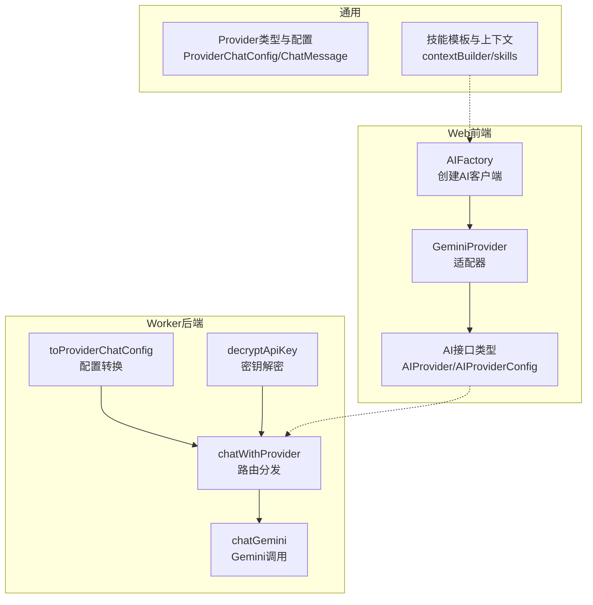
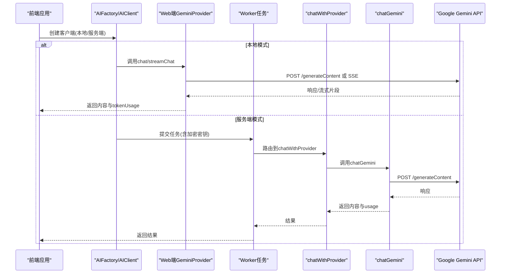
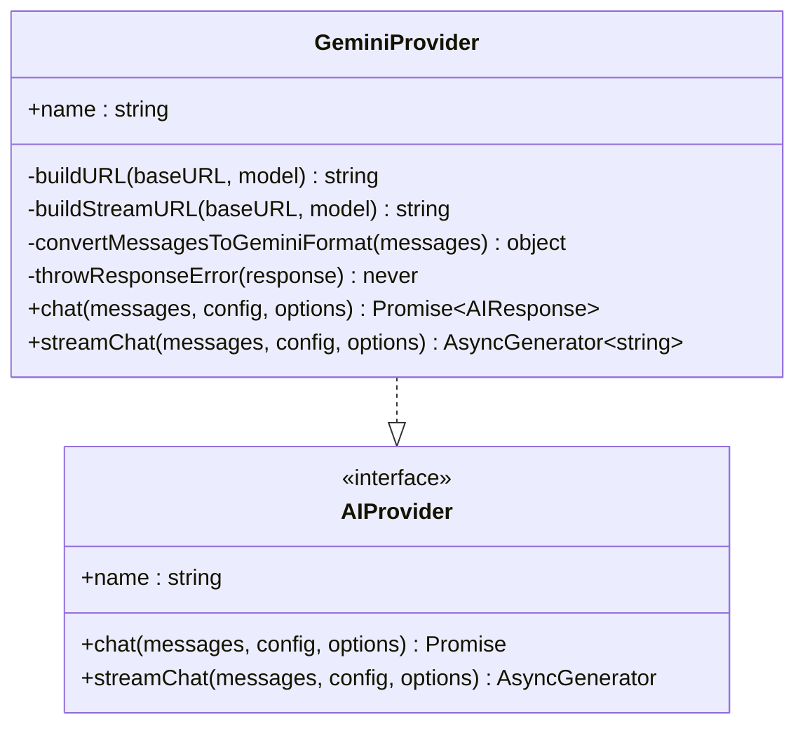
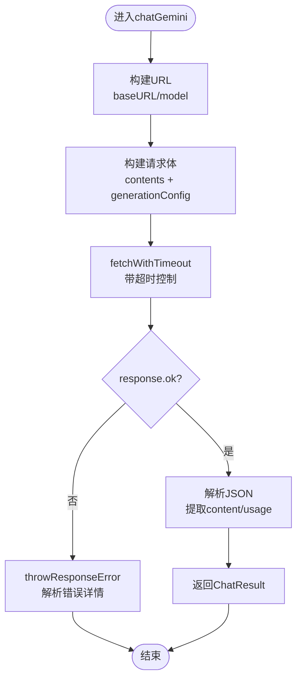
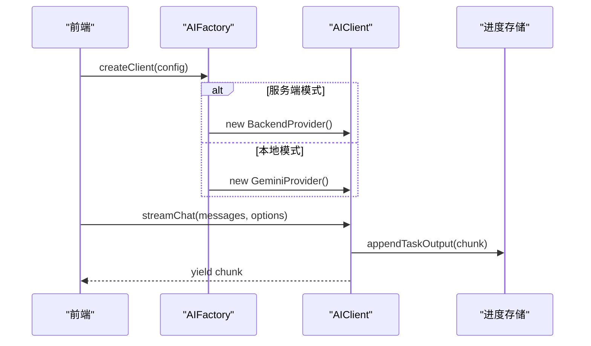
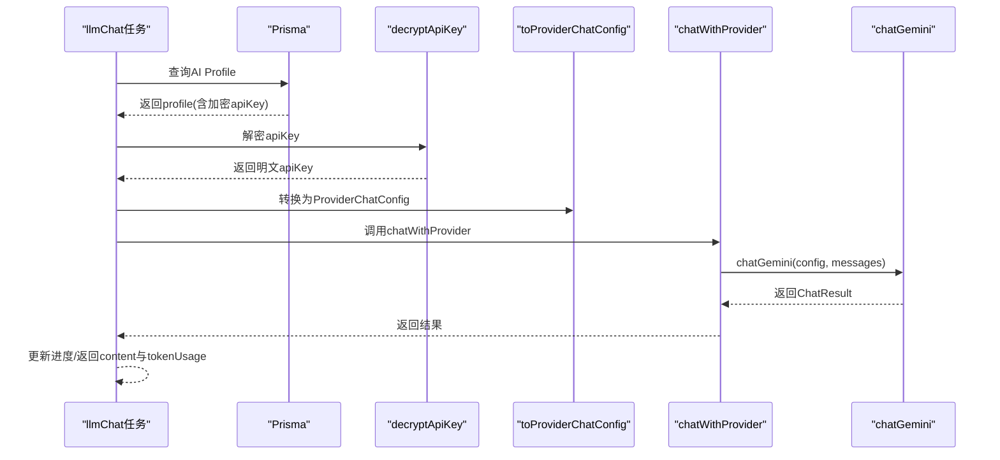
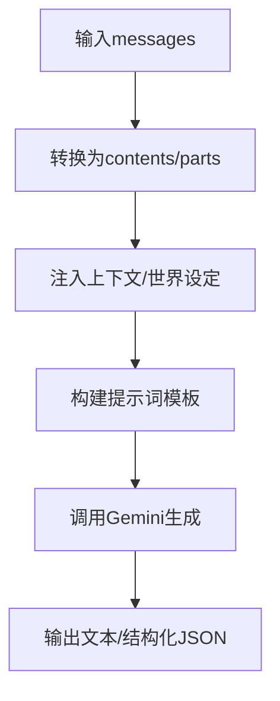
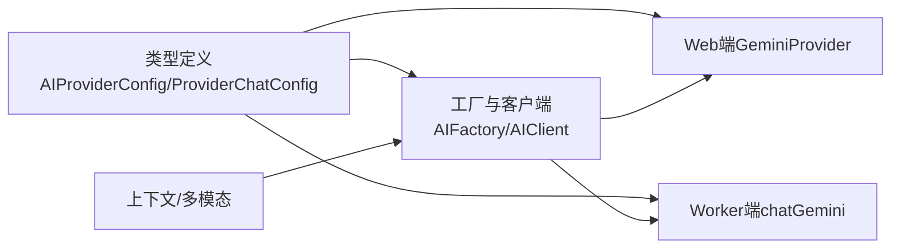

# Gemini集成

<cite>
**本文档引用的文件**
- [apps/web/src/lib/ai/providers/gemini.ts](file://apps/web/src/lib/ai/providers/gemini.ts)
- [apps/worker/src/providers/gemini.ts](file://apps/worker/src/providers/gemini.ts)
- [apps/web/src/lib/ai/types.ts](file://apps/web/src/lib/ai/types.ts)
- [apps/web/src/lib/ai/factory.ts](file://apps/web/src/lib/ai/factory.ts)
- [apps/worker/src/providers/index.ts](file://apps/worker/src/providers/index.ts)
- [apps/worker/src/tasks/llmChat.ts](file://apps/worker/src/tasks/llmChat.ts)
- [apps/worker/src/providers/types.ts](file://apps/worker/src/providers/types.ts)
- [apps/worker/src/tasks/common.ts](file://apps/worker/src/tasks/common.ts)
- [apps/worker/src/crypto/apiKeyCrypto.ts](file://apps/worker/src/crypto/apiKeyCrypto.ts)
- [apps/web/src/lib/ai/contextBuilder.ts](file://apps/web/src/lib/ai/contextBuilder.ts)
- [apps/web/src/lib/ai/worldViewInjection.ts](file://apps/web/src/lib/ai/worldViewInjection.ts)
- [apps/web/src/lib/ai/multiModalPrompts.ts](file://apps/web/src/lib/ai/multiModalPrompts.ts)
- [apps/web/src/lib/ai/skills.ts](file://apps/web/src/lib/ai/skills.ts)
- [apps/web/src/types/index.ts](file://apps/web/src/types/index.ts)
</cite>

## 目录

1. [简介](#简介)
2. [项目结构](#项目结构)
3. [核心组件](#核心组件)
4. [架构总览](#架构总览)
5. [详细组件分析](#详细组件分析)
6. [依赖分析](#依赖分析)
7. [性能考量](#性能考量)
8. [故障排查指南](#故障排查指南)
9. [结论](#结论)
10. [附录](#附录)

## 简介

本文件系统性梳理并文档化本仓库中的Google Gemini集成模块，重点覆盖：

- 适配器设计与多模态输入处理
- 模型选择与参数配置
- Gemini特性能力（多模态内容生成、上下文管理、服务端会话处理）
- API密钥配置、请求构建与响应解析机制
- 实际使用示例、性能对比与优化建议
- 常见问题解决方案与调试技巧

## 项目结构

Gemini集成横跨Web前端与Worker后端两大运行时：

- Web端适配器：负责浏览器内直接调用Gemini API，支持非流式与流式对话
- Worker端适配器：负责服务端调用，支持超时控制、错误处理与令牌用量统计
- 通用类型与工厂：统一AI Provider接口、配置与客户端封装
- 上下文与多模态：提供上下文构建、世界注入、多模态提示词生成与技能模板

图表来源

- [apps/web/src/lib/ai/factory.ts](file://apps/web/src/lib/ai/factory.ts#L12-L28)
- [apps/web/src/lib/ai/providers/gemini.ts](file://apps/web/src/lib/ai/providers/gemini.ts#L4-L172)
- [apps/worker/src/providers/index.ts](file://apps/worker/src/providers/index.ts#L12-L25)
- [apps/worker/src/providers/gemini.ts](file://apps/worker/src/providers/gemini.ts#L81-L122)
- [apps/worker/src/tasks/common.ts](file://apps/worker/src/tasks/common.ts#L81-L116)
- [apps/worker/src/crypto/apiKeyCrypto.ts](file://apps/worker/src/crypto/apiKeyCrypto.ts#L8-L20)

章节来源

- [apps/web/src/lib/ai/factory.ts](file://apps/web/src/lib/ai/factory.ts#L12-L28)
- [apps/worker/src/providers/index.ts](file://apps/worker/src/providers/index.ts#L12-L25)

## 核心组件

- Web端GeminiProvider：实现AIProvider接口，负责将消息格式转换为Gemini的contents/parts结构，构建请求URL与generationConfig，并处理非流式与流式响应
- Worker端chatGemini：在服务端执行相同逻辑，增加超时控制与更详细的错误抛出
- AIFactory与AIClient：工厂创建具体Provider，封装流式输出进度上报
- Provider类型与配置：统一的ProviderChatConfig、ChatMessage、GenerationParams等类型
- 上下文与多模态：contextBuilder、skills、multiModalPrompts等模块支撑多模态内容生成与上下文注入

章节来源

- [apps/web/src/lib/ai/providers/gemini.ts](file://apps/web/src/lib/ai/providers/gemini.ts#L4-L172)
- [apps/worker/src/providers/gemini.ts](file://apps/worker/src/providers/gemini.ts#L81-L122)
- [apps/web/src/lib/ai/factory.ts](file://apps/web/src/lib/ai/factory.ts#L30-L75)
- [apps/web/src/lib/ai/types.ts](file://apps/web/src/lib/ai/types.ts#L3-L29)
- [apps/worker/src/providers/types.ts](file://apps/worker/src/providers/types.ts#L37-L49)

## 架构总览

Gemini集成采用“前端直连 + 后端代理”的双通道设计：

- 前端直连：适用于本地开发与测试，直接通过fetch调用Google Generative Language API
- 后端代理：生产环境通过Worker任务调用，具备超时控制、密钥解密与令牌用量统计

图表来源

- [apps/web/src/lib/ai/factory.ts](file://apps/web/src/lib/ai/factory.ts#L77-L96)
- [apps/web/src/lib/ai/providers/gemini.ts](file://apps/web/src/lib/ai/providers/gemini.ts#L58-L106)
- [apps/worker/src/providers/index.ts](file://apps/worker/src/providers/index.ts#L12-L25)
- [apps/worker/src/providers/gemini.ts](file://apps/worker/src/providers/gemini.ts#L81-L122)
- [apps/worker/src/tasks/llmChat.ts](file://apps/worker/src/tasks/llmChat.ts#L27-L60)

## 详细组件分析

### Web端GeminiProvider

- URL构建：支持自定义baseURL与model，默认baseURL为Google Generative Language API，模型默认为gemini-pro
- 消息格式转换：将ChatMessage转换为Gemini的contents结构，其中assistant映射为model，user映射为user；system消息以“System instruction: ...”形式前置到contents
- generationConfig映射：temperature、topP、maxTokens分别映射为temperature、topP、maxOutputTokens
- 非流式chat：构造请求头携带API Key，解析candidates[0].content.parts[0].text作为content，usageMetadata作为tokenUsage
- 流式streamChat：使用SSE alt=sse，逐行解析data块，提取candidates[0].content.parts[0].text作为增量输出
- 错误处理：throwResponseError优先尝试解析JSON error.message，否则读取text，最终抛出包含HTTP状态与详情的错误

图表来源

- [apps/web/src/lib/ai/providers/gemini.ts](file://apps/web/src/lib/ai/providers/gemini.ts#L4-L172)
- [apps/web/src/lib/ai/types.ts](file://apps/web/src/lib/ai/types.ts#L17-L29)

章节来源

- [apps/web/src/lib/ai/providers/gemini.ts](file://apps/web/src/lib/ai/providers/gemini.ts#L7-L172)

### Worker端chatGemini

- 超时控制：通过AI_REQUEST_TIMEOUT_MS环境变量控制请求超时，超时抛出明确提示
- 请求构建：与Web端一致，但通过fetchWithTimeout进行超时包装
- 错误处理：throwResponseError解析JSON error.message或回退为text，最终抛出包含HTTP状态与详情的错误
- 响应解析：提取candidates[0].content.parts[0].text作为content，usageMetadata作为tokenUsage

图表来源

- [apps/worker/src/providers/gemini.ts](file://apps/worker/src/providers/gemini.ts#L81-L122)

章节来源

- [apps/worker/src/providers/gemini.ts](file://apps/worker/src/providers/gemini.ts#L15-L122)

### 配置与工厂

- AIFactory.createClient：根据运行模式（本地/服务端）创建AIClient；服务端模式要求aiProfileId，否则抛错
- AIClient.streamChat：包装底层生成器，拦截chunk并更新进度存储（用于DevPanel监控）
- Provider类型与配置：AIProviderConfig、AIRequestOptions、ProviderChatConfig、ChatMessage、GenerationParams等

图表来源

- [apps/web/src/lib/ai/factory.ts](file://apps/web/src/lib/ai/factory.ts#L77-L96)
- [apps/web/src/lib/ai/types.ts](file://apps/web/src/lib/ai/types.ts#L3-L29)

章节来源

- [apps/web/src/lib/ai/factory.ts](file://apps/web/src/lib/ai/factory.ts#L30-L75)
- [apps/web/src/lib/ai/types.ts](file://apps/web/src/lib/ai/types.ts#L3-L29)

### 服务端调用链路

- llmChat：从数据库加载AI Profile，解密API Key，转换为ProviderChatConfig，调用chatWithProvider，返回content与tokenUsage
- chatWithProvider：根据kind分发到对应Provider实现（gemini/openai_compatible/doubao_ark）
- decryptApiKey：AES-256-GCM解密，支持tag校验

图表来源

- [apps/worker/src/tasks/llmChat.ts](file://apps/worker/src/tasks/llmChat.ts#L37-L60)
- [apps/worker/src/providers/index.ts](file://apps/worker/src/providers/index.ts#L12-L25)
- [apps/worker/src/tasks/common.ts](file://apps/worker/src/tasks/common.ts#L81-L116)
- [apps/worker/src/crypto/apiKeyCrypto.ts](file://apps/worker/src/crypto/apiKeyCrypto.ts#L8-L20)

章节来源

- [apps/worker/src/tasks/llmChat.ts](file://apps/worker/src/tasks/llmChat.ts#L27-L60)
- [apps/worker/src/providers/index.ts](file://apps/worker/src/providers/index.ts#L12-L25)
- [apps/worker/src/tasks/common.ts](file://apps/worker/src/tasks/common.ts#L81-L116)
- [apps/worker/src/crypto/apiKeyCrypto.ts](file://apps/worker/src/crypto/apiKeyCrypto.ts#L8-L20)

### 多模态输入与上下文管理

- 消息格式转换：Web端与Worker端均将messages转换为Gemini contents/parts结构，assistant映射为model，user映射为user；system消息前置
- 上下文构建：buildFullContext/buildCharacterContext/buildWorldViewContext将画风、角色、世界观整合为结构化上下文
- 世界注入：支持在分镜列表与场景锚点生成时注入世界观，可配置开关
- 多模态提示词：提供音频/BGM/转场的规则引擎与AI智能生成方案，具备回退策略

图表来源

- [apps/web/src/lib/ai/providers/gemini.ts](file://apps/web/src/lib/ai/providers/gemini.ts#L19-L39)
- [apps/worker/src/providers/gemini.ts](file://apps/worker/src/providers/gemini.ts#L46-L63)
- [apps/web/src/lib/ai/contextBuilder.ts](file://apps/web/src/lib/ai/contextBuilder.ts#L276-L304)
- [apps/web/src/lib/ai/worldViewInjection.ts](file://apps/web/src/lib/ai/worldViewInjection.ts#L108-L126)
- [apps/web/src/lib/ai/multiModalPrompts.ts](file://apps/web/src/lib/ai/multiModalPrompts.ts#L522-L635)

章节来源

- [apps/web/src/lib/ai/contextBuilder.ts](file://apps/web/src/lib/ai/contextBuilder.ts#L276-L304)
- [apps/web/src/lib/ai/worldViewInjection.ts](file://apps/web/src/lib/ai/worldViewInjection.ts#L108-L126)
- [apps/web/src/lib/ai/multiModalPrompts.ts](file://apps/web/src/lib/ai/multiModalPrompts.ts#L522-L635)

## 依赖分析

- Web端依赖：AIProvider接口、AIProviderConfig、AIRequestOptions、ChatMessage、AIResponse
- Worker端依赖：ProviderChatConfig、ChatMessage、ChatResult、GenerationParams、ProviderKind
- 通用依赖：类型定义、工厂与客户端封装、上下文与多模态模块

图表来源

- [apps/web/src/lib/ai/types.ts](file://apps/web/src/lib/ai/types.ts#L3-L29)
- [apps/worker/src/providers/types.ts](file://apps/worker/src/providers/types.ts#L37-L58)
- [apps/web/src/lib/ai/factory.ts](file://apps/web/src/lib/ai/factory.ts#L12-L28)

章节来源

- [apps/web/src/lib/ai/types.ts](file://apps/web/src/lib/ai/types.ts#L3-L29)
- [apps/worker/src/providers/types.ts](file://apps/worker/src/providers/types.ts#L37-L58)

## 性能考量

- 流式输出：Web端与Worker端均支持SSE流式输出，降低首字延迟，提升交互体验
- 超时控制：Worker端通过AI_REQUEST_TIMEOUT_MS统一超时，避免长时间挂起
- 令牌用量：响应中包含usageMetadata，便于成本控制与预算管理
- 参数调优：temperature/topP/maxTokens影响生成稳定性与长度，建议结合任务类型调整
- 网络与供应商：超时错误提示包含“网络/VPN/供应商可用性”建议，便于定位问题

章节来源

- [apps/web/src/lib/ai/providers/gemini.ts](file://apps/web/src/lib/ai/providers/gemini.ts#L108-L170)
- [apps/worker/src/providers/gemini.ts](file://apps/worker/src/providers/gemini.ts#L15-L39)
- [apps/worker/src/providers/gemini.ts](file://apps/worker/src/providers/gemini.ts#L108-L122)

## 故障排查指南

- API错误：Web端与Worker端均通过throwResponseError解析错误详情，优先读取JSON error.message，其次回退为text
- 超时错误：Worker端在fetchWithTimeout中检测AbortError并抛出明确提示，建议提高AI_REQUEST_TIMEOUT_MS或检查网络/供应商
- 密钥问题：服务端模式需正确配置加密密钥，decryptApiKey使用AES-256-GCM，确保IV/Tag/Data三段格式正确
- 模型与参数：确认baseURL/model与generationParams映射正确，gemini-pro为默认模型
- 上下文与多模态：检查上下文构建与世界注入开关，确保提示词模板占位符被正确填充

章节来源

- [apps/web/src/lib/ai/providers/gemini.ts](file://apps/web/src/lib/ai/providers/gemini.ts#L41-L56)
- [apps/worker/src/providers/gemini.ts](file://apps/worker/src/providers/gemini.ts#L65-L79)
- [apps/worker/src/providers/gemini.ts](file://apps/worker/src/providers/gemini.ts#L22-L39)
- [apps/worker/src/crypto/apiKeyCrypto.ts](file://apps/worker/src/crypto/apiKeyCrypto.ts#L8-L20)

## 结论

本Gemini集成模块在Web与Worker两端提供了统一的适配器与配置体系，支持：

- 多模态输入处理与上下文注入
- 灵活的模型选择与参数映射
- 非流式与流式对话能力
- 服务端会话与密钥解密
- 详细的错误处理与超时控制
- 多模态提示词生成与回退策略

建议在生产环境中优先采用服务端模式，结合上下文构建与世界注入策略，以获得更稳定、可控的生成效果。

## 附录

### 使用示例（路径指引）

- Web端本地模式：创建AIClient并调用chat/streamChat
  - 参考：[apps/web/src/lib/ai/factory.ts](file://apps/web/src/lib/ai/factory.ts#L77-L96)
- 服务端模式：提交llmChat任务，内部通过chatWithProvider路由到chatGemini
  - 参考：[apps/worker/src/tasks/llmChat.ts](file://apps/worker/src/tasks/llmChat.ts#L27-L60)
  - 参考：[apps/worker/src/providers/index.ts](file://apps/worker/src/providers/index.ts#L12-L25)

### 配置项与参数

- ProviderChatConfig
  - kind: 'gemini'
  - apiKey: Google API Key
  - baseURL: API基础地址（可选）
  - model: 模型名称（默认gemini-pro）
  - params: generationParams（temperature/topP/maxTokens等）
- GenerationParams
  - temperature: 采样温度
  - topP: 采样核概率
  - maxTokens: 最大输出token数
  - presencePenalty/frequencyPenalty: 重复惩罚（通用字段）
  - reasoningEffort: 推理强度（通用字段）

章节来源

- [apps/worker/src/providers/types.ts](file://apps/worker/src/providers/types.ts#L37-L49)
- [apps/web/src/lib/ai/types.ts](file://apps/web/src/lib/ai/types.ts#L3-L9)
- [apps/worker/src/tasks/common.ts](file://apps/worker/src/tasks/common.ts#L31-L51)
