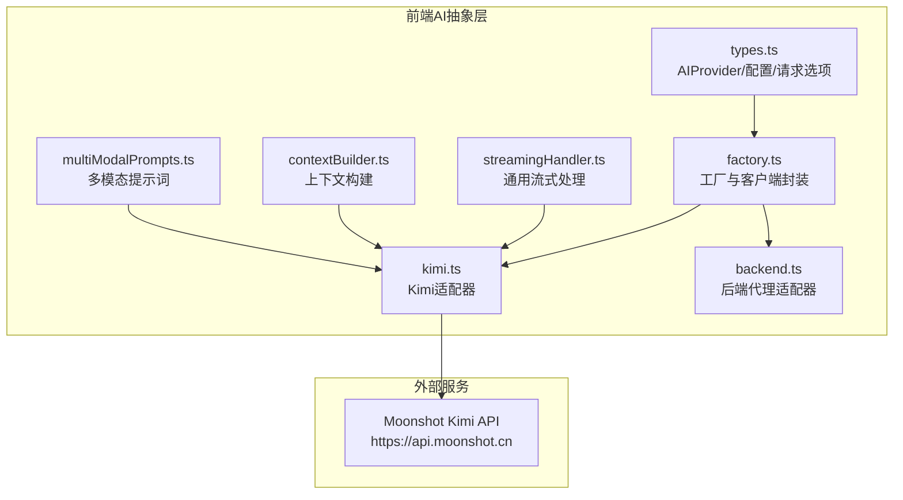
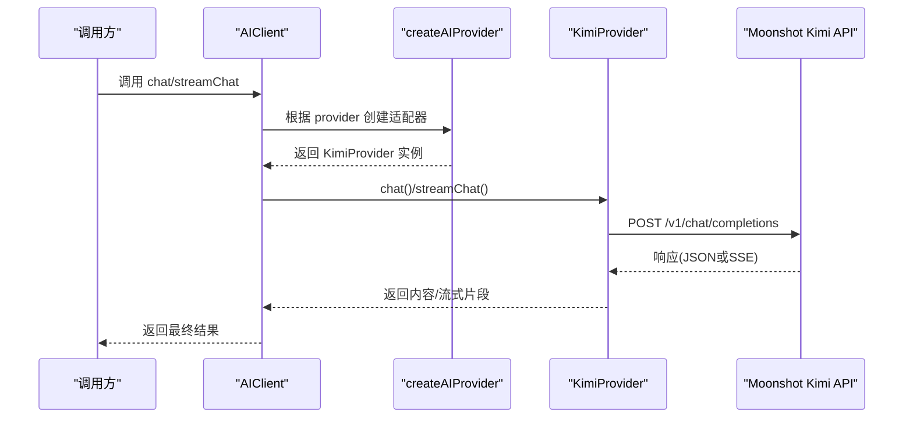
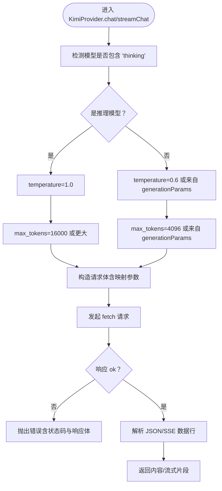
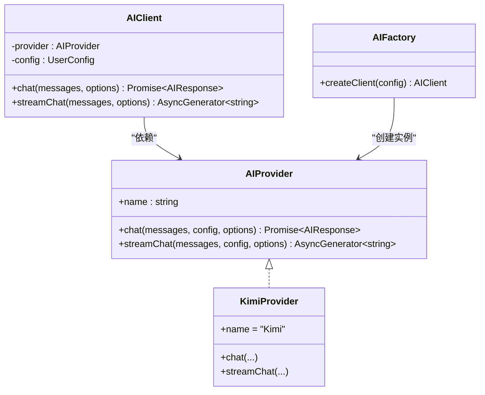
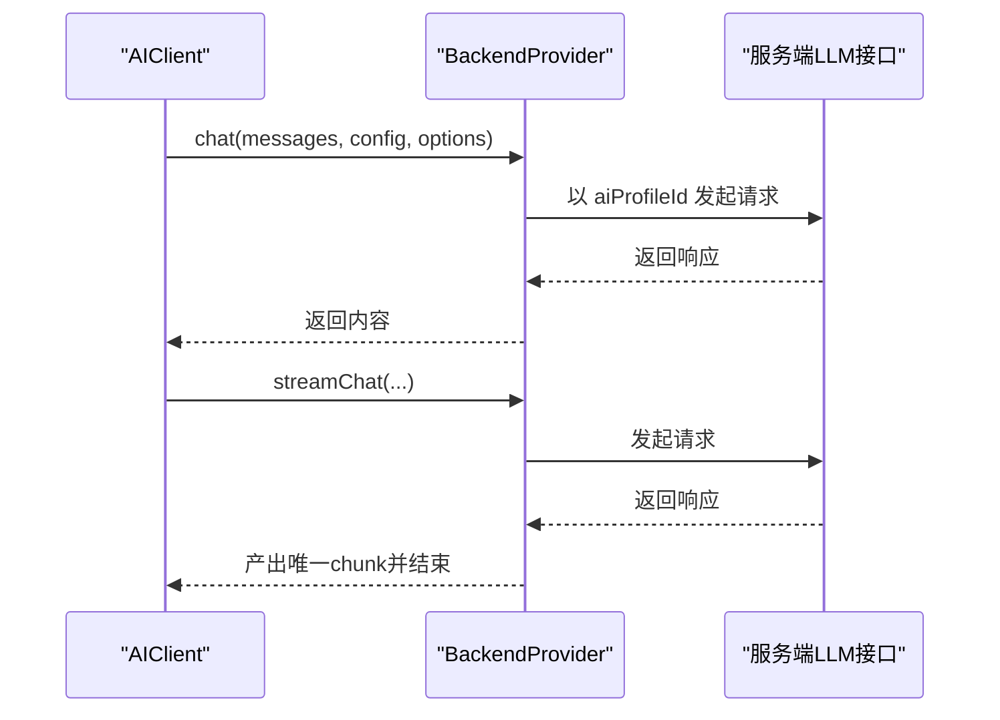
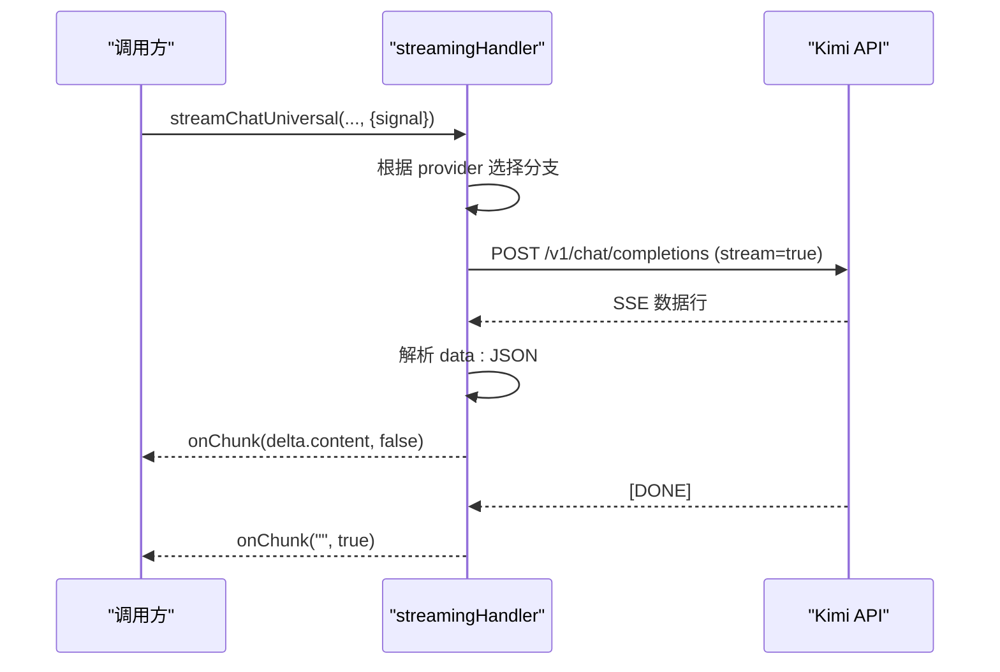
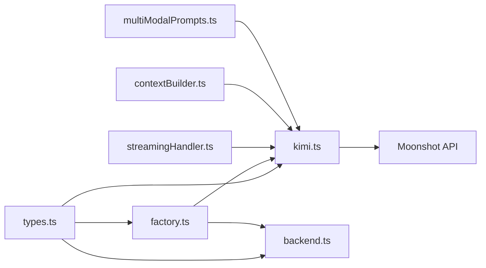

# Kimi集成

<cite>
**本文档引用的文件**
- [apps/web/src/lib/ai/providers/kimi.ts](file://apps/web/src/lib/ai/providers/kimi.ts)
- [apps/web/src/lib/ai/factory.ts](file://apps/web/src/lib/ai/factory.ts)
- [apps/web/src/lib/ai/types.ts](file://apps/web/src/lib/ai/types.ts)
- [apps/web/src/lib/ai/streamingHandler.ts](file://apps/web/src/lib/ai/streamingHandler.ts)
- [apps/web/src/lib/ai/contextBuilder.ts](file://apps/web/src/lib/ai/contextBuilder.ts)
- [apps/web/src/lib/ai/multiModalPrompts.ts](file://apps/web/src/lib/ai/multiModalPrompts.ts)
- [apps/web/src/lib/ai/providers/backend.ts](file://apps/web/src/lib/ai/providers/backend.ts)
- [apps/web/src/types/index.ts](file://apps/web/src/types/index.ts)
- [apps/web/src/components/ConfigDialog.tsx](file://apps/web/src/components/ConfigDialog.tsx)
</cite>

## 目录

1. [简介](#简介)
2. [项目结构](#项目结构)
3. [核心组件](#核心组件)
4. [架构总览](#架构总览)
5. [详细组件分析](#详细组件分析)
6. [依赖分析](#依赖分析)
7. [性能考虑](#性能考虑)
8. [故障排查指南](#故障排查指南)
9. [结论](#结论)
10. [附录](#附录)

## 简介

本文件面向Moonshot AI的Kimi API适配器实现，系统性梳理其在本项目中的集成方式、模型配置策略、参数映射与响应处理流程，并结合中文优化特性、长文本处理与多模态能力进行深入解析。同时提供实际使用示例、配置指南、性能优化建议及常见问题解决方案。

## 项目结构

Kimi集成位于Web前端侧的AI抽象层，采用统一的AIProvider接口与工厂模式，支持本地直连与后端代理两种运行模式。核心文件组织如下：

- 适配器实现：apps/web/src/lib/ai/providers/kimi.ts
- 抽象与工厂：apps/web/src/lib/ai/types.ts、apps/web/src/lib/ai/factory.ts
- 流式处理与多模态：apps/web/src/lib/ai/streamingHandler.ts、apps/web/src/lib/ai/multiModalPrompts.ts
- 上下文构建：apps/web/src/lib/ai/contextBuilder.ts
- 后端代理：apps/web/src/lib/ai/providers/backend.ts
- 类型定义：apps/web/src/types/index.ts
- 配置界面：apps/web/src/components/ConfigDialog.tsx

图表来源

- [apps/web/src/lib/ai/types.ts](file://apps/web/src/lib/ai/types.ts#L1-L30)
- [apps/web/src/lib/ai/factory.ts](file://apps/web/src/lib/ai/factory.ts#L1-L98)
- [apps/web/src/lib/ai/providers/kimi.ts](file://apps/web/src/lib/ai/providers/kimi.ts#L1-L164)
- [apps/web/src/lib/ai/providers/backend.ts](file://apps/web/src/lib/ai/providers/backend.ts#L1-L25)
- [apps/web/src/lib/ai/streamingHandler.ts](file://apps/web/src/lib/ai/streamingHandler.ts#L1-L460)
- [apps/web/src/lib/ai/contextBuilder.ts](file://apps/web/src/lib/ai/contextBuilder.ts#L1-L435)
- [apps/web/src/lib/ai/multiModalPrompts.ts](file://apps/web/src/lib/ai/multiModalPrompts.ts#L1-L636)

章节来源

- [apps/web/src/lib/ai/types.ts](file://apps/web/src/lib/ai/types.ts#L1-L30)
- [apps/web/src/lib/ai/factory.ts](file://apps/web/src/lib/ai/factory.ts#L1-L98)
- [apps/web/src/lib/ai/providers/kimi.ts](file://apps/web/src/lib/ai/providers/kimi.ts#L1-L164)
- [apps/web/src/lib/ai/providers/backend.ts](file://apps/web/src/lib/ai/providers/backend.ts#L1-L25)
- [apps/web/src/lib/ai/streamingHandler.ts](file://apps/web/src/lib/ai/streamingHandler.ts#L1-L460)
- [apps/web/src/lib/ai/contextBuilder.ts](file://apps/web/src/lib/ai/contextBuilder.ts#L1-L435)
- [apps/web/src/lib/ai/multiModalPrompts.ts](file://apps/web/src/lib/ai/multiModalPrompts.ts#L1-L636)

## 核心组件

- AIProvider接口与配置
  - AIProviderConfig：包含provider、apiKey、baseURL、model、generationParams等
  - AIRequestOptions：支持AbortSignal与任务ID
  - AIProvider：定义chat与streamChat两个核心方法
- KimiProvider适配器
  - 基础URL：https://api.moonshot.cn
  - 模型默认值与推理模型特殊处理
  - 参数映射：temperature、max_tokens、top_p、presence_penalty、frequency_penalty
  - 响应处理：非流式返回choices[0].message.content与usage统计；流式解析SSE数据行
- 工厂与客户端
  - createAIProvider：根据ProviderType返回具体适配器实例
  - AIFactory.createClient：根据运行模式（本地/后端）创建AIClient
  - AIClient.streamChat：包装底层生成器，支持进度上报
- 后端代理
  - BackendProvider：在后端模式下通过aiProfileId调用服务端LLM接口
- 流式处理
  - streamingHandler.ts：统一的流式处理与SSE解析，包含Kimi专用分支
- 上下文构建与多模态
  - contextBuilder.ts：整合画风、角色、世界观等上下文
  - multiModalPrompts.ts：音频/BGM/转场等多模态提示词生成与回退策略

章节来源

- [apps/web/src/lib/ai/types.ts](file://apps/web/src/lib/ai/types.ts#L1-L30)
- [apps/web/src/lib/ai/providers/kimi.ts](file://apps/web/src/lib/ai/providers/kimi.ts#L1-L164)
- [apps/web/src/lib/ai/factory.ts](file://apps/web/src/lib/ai/factory.ts#L1-L98)
- [apps/web/src/lib/ai/providers/backend.ts](file://apps/web/src/lib/ai/providers/backend.ts#L1-L25)
- [apps/web/src/lib/ai/streamingHandler.ts](file://apps/web/src/lib/ai/streamingHandler.ts#L1-L460)
- [apps/web/src/lib/ai/contextBuilder.ts](file://apps/web/src/lib/ai/contextBuilder.ts#L1-L435)
- [apps/web/src/lib/ai/multiModalPrompts.ts](file://apps/web/src/lib/ai/multiModalPrompts.ts#L1-L636)

## 架构总览

Kimi集成遵循统一的AI抽象层设计，支持本地直连与后端代理两种模式。本地模式下，前端直接调用Moonshot Kimi API；后端模式下，通过aiProfileId经由后端服务转发请求，前端不直接持有apiKey。

图表来源

- [apps/web/src/lib/ai/factory.ts](file://apps/web/src/lib/ai/factory.ts#L12-L28)
- [apps/web/src/lib/ai/providers/kimi.ts](file://apps/web/src/lib/ai/providers/kimi.ts#L9-L74)
- [apps/web/src/lib/ai/streamingHandler.ts](file://apps/web/src/lib/ai/streamingHandler.ts#L218-L324)

## 详细组件分析

### KimiProvider 适配器

- 基础配置
  - 基础URL：https://api.moonshot.cn
  - 默认模型：若未显式提供，使用 moonshot-v1-8k
- 模型与温度/长度策略
  - 若模型名包含“thinking”，强制temperature=1.0，max_tokens不低于16000
  - 否则temperature默认0.6，max_tokens默认4096
- 参数映射
  - generationParams中的temperature、topP、presencePenalty、frequencyPenalty会映射为top_p、presence_penalty、frequency_penalty
- 响应处理
  - 非流式：解析choices[0].message.content，可选读取usage统计
  - 流式：解析SSE数据行，逐段产出content，推理模型仅返回content（不返回reasoning_content）

图表来源

- [apps/web/src/lib/ai/providers/kimi.ts](file://apps/web/src/lib/ai/providers/kimi.ts#L9-L74)
- [apps/web/src/lib/ai/providers/kimi.ts](file://apps/web/src/lib/ai/providers/kimi.ts#L76-L162)

章节来源

- [apps/web/src/lib/ai/providers/kimi.ts](file://apps/web/src/lib/ai/providers/kimi.ts#L1-L164)

### 工厂与客户端

- createAIProvider
  - 根据ProviderType返回对应适配器实例（kimi、deepseek、gemini、openai-compatible、doubao-ark）
- AIFactory.createClient
  - 后端模式：校验aiProfileId，返回BackendProvider封装的AIClient
  - 本地模式：校验provider、apiKey、model，返回KimiProvider封装的AIClient
- AIClient.streamChat
  - 包装底层生成器，拦截每个chunk并更新进度存储（若提供taskId）

图表来源

- [apps/web/src/lib/ai/types.ts](file://apps/web/src/lib/ai/types.ts#L17-L29)
- [apps/web/src/lib/ai/providers/kimi.ts](file://apps/web/src/lib/ai/providers/kimi.ts#L6-L16)
- [apps/web/src/lib/ai/factory.ts](file://apps/web/src/lib/ai/factory.ts#L30-L75)
- [apps/web/src/lib/ai/factory.ts](file://apps/web/src/lib/ai/factory.ts#L77-L97)

章节来源

- [apps/web/src/lib/ai/factory.ts](file://apps/web/src/lib/ai/factory.ts#L1-L98)
- [apps/web/src/lib/ai/types.ts](file://apps/web/src/lib/ai/types.ts#L1-L30)

### 后端代理模式

- BackendProvider
  - 在后端模式下，通过aiProfileId调用服务端LLM接口
  - 非流式：直接返回服务端响应
  - 流式：将非流式响应作为唯一chunk产出

图表来源

- [apps/web/src/lib/ai/providers/backend.ts](file://apps/web/src/lib/ai/providers/backend.ts#L8-L23)

章节来源

- [apps/web/src/lib/ai/providers/backend.ts](file://apps/web/src/lib/ai/providers/backend.ts#L1-L25)

### 流式处理与SSE解析

- streamingHandler.ts
  - 统一的流式处理接口，内部根据provider类型路由到不同实现
  - Kimi专用分支：streamChatKimi，强制推理模型参数，解析SSE数据行，过滤空行与[DONE]标记，仅输出delta.content
  - 通用分支：streamChat，兼容OpenAI兼容格式
- 进度与中断
  - 支持AbortController中断
  - 提供进度估算与剩余时间估算工具

图表来源

- [apps/web/src/lib/ai/streamingHandler.ts](file://apps/web/src/lib/ai/streamingHandler.ts#L417-L436)
- [apps/web/src/lib/ai/streamingHandler.ts](file://apps/web/src/lib/ai/streamingHandler.ts#L218-L324)

章节来源

- [apps/web/src/lib/ai/streamingHandler.ts](file://apps/web/src/lib/ai/streamingHandler.ts#L1-L460)

### 上下文构建与多模态提示词

- 上下文构建
  - buildFullContext/buildCharacterContext/buildStyleContext/buildWorldViewContext：整合画风、角色、世界观等信息
  - fillPromptTemplate：将上下文注入模板占位符
- 多模态提示词
  - generateAudioPrompt/generateBGMPrompt/generateTransitionPrompt：规则引擎生成
  - generateAudioPromptWithAI/generateBGMPromptWithAI/generateTransitionPromptWithAI：AI智能生成并带规则回退
  - 支持中文情绪与场景关键词映射

章节来源

- [apps/web/src/lib/ai/contextBuilder.ts](file://apps/web/src/lib/ai/contextBuilder.ts#L276-L435)
- [apps/web/src/lib/ai/multiModalPrompts.ts](file://apps/web/src/lib/ai/multiModalPrompts.ts#L129-L170)
- [apps/web/src/lib/ai/multiModalPrompts.ts](file://apps/web/src/lib/ai/multiModalPrompts.ts#L525-L564)
- [apps/web/src/lib/ai/multiModalPrompts.ts](file://apps/web/src/lib/ai/multiModalPrompts.ts#L569-L597)
- [apps/web/src/lib/ai/multiModalPrompts.ts](file://apps/web/src/lib/ai/multiModalPrompts.ts#L602-L635)

## 依赖分析

- 组件耦合
  - KimiProvider依赖AIProvider接口与类型定义
  - AIFactory与createAIProvider负责适配器实例化与运行模式选择
  - BackendProvider与KimiProvider共同实现AIProvider接口
  - streamingHandler与KimiProvider解耦，通过统一接口对接
- 外部依赖
  - Moonshot Kimi API：/v1/chat/completions
  - Google Gemini API：/v1beta/models/{model}:streamGenerateContent（用于对比）
- 潜在循环依赖
  - 当前结构无循环依赖，工厂与适配器通过接口解耦

图表来源

- [apps/web/src/lib/ai/types.ts](file://apps/web/src/lib/ai/types.ts#L1-L30)
- [apps/web/src/lib/ai/factory.ts](file://apps/web/src/lib/ai/factory.ts#L1-L98)
- [apps/web/src/lib/ai/providers/kimi.ts](file://apps/web/src/lib/ai/providers/kimi.ts#L1-L164)
- [apps/web/src/lib/ai/providers/backend.ts](file://apps/web/src/lib/ai/providers/backend.ts#L1-L25)
- [apps/web/src/lib/ai/streamingHandler.ts](file://apps/web/src/lib/ai/streamingHandler.ts#L1-L460)
- [apps/web/src/lib/ai/contextBuilder.ts](file://apps/web/src/lib/ai/contextBuilder.ts#L1-L435)
- [apps/web/src/lib/ai/multiModalPrompts.ts](file://apps/web/src/lib/ai/multiModalPrompts.ts#L1-L636)

章节来源

- [apps/web/src/lib/ai/types.ts](file://apps/web/src/lib/ai/types.ts#L1-L30)
- [apps/web/src/lib/ai/factory.ts](file://apps/web/src/lib/ai/factory.ts#L1-L98)
- [apps/web/src/lib/ai/providers/kimi.ts](file://apps/web/src/lib/ai/providers/kimi.ts#L1-L164)
- [apps/web/src/lib/ai/providers/backend.ts](file://apps/web/src/lib/ai/providers/backend.ts#L1-L25)
- [apps/web/src/lib/ai/streamingHandler.ts](file://apps/web/src/lib/ai/streamingHandler.ts#L1-L460)
- [apps/web/src/lib/ai/contextBuilder.ts](file://apps/web/src/lib/ai/contextBuilder.ts#L1-L435)
- [apps/web/src/lib/ai/multiModalPrompts.ts](file://apps/web/src/lib/ai/multiModalPrompts.ts#L1-L636)

## 性能考虑

- 推理模型参数
  - 对于包含“thinking”的模型，强制temperature=1.0与较大的max_tokens，确保长文本推理稳定性
- 流式传输
  - 使用SSE增量输出，降低首字延迟，提升交互体验
  - 支持AbortController中断，避免无效消耗
- 上下文压缩
  - 上下文构建支持长度裁剪与模式选择，避免超出模型上下文窗口
- Token统计
  - 非流式响应包含usage统计，可用于成本与性能监控

章节来源

- [apps/web/src/lib/ai/providers/kimi.ts](file://apps/web/src/lib/ai/providers/kimi.ts#L19-L29)
- [apps/web/src/lib/ai/providers/kimi.ts](file://apps/web/src/lib/ai/providers/kimi.ts#L63-L73)
- [apps/web/src/lib/ai/contextBuilder.ts](file://apps/web/src/lib/ai/contextBuilder.ts#L191-L196)
- [apps/web/src/lib/ai/streamingHandler.ts](file://apps/web/src/lib/ai/streamingHandler.ts#L114-L116)

## 故障排查指南

- 常见错误与处理
  - HTTP非2xx响应：打印状态码、状态文本与响应体，抛出包含状态码与响应体的错误
  - SSE解析异常：捕获JSON解析错误并记录日志
  - 流式响应体为空：明确报错“无响应体”
- 后端模式校验
  - aiProfileId缺失：提示在设置中保存配置
  - 本地模式校验：provider、apiKey、model缺一不可
- 中文语境与多模态
  - 情绪与场景关键词映射：确保中文关键词覆盖充分
  - 多模态回退：AI生成失败时自动回退到规则引擎

章节来源

- [apps/web/src/lib/ai/providers/kimi.ts](file://apps/web/src/lib/ai/providers/kimi.ts#L53-L61)
- [apps/web/src/lib/ai/providers/kimi.ts](file://apps/web/src/lib/ai/providers/kimi.ts#L121-L129)
- [apps/web/src/lib/ai/providers/kimi.ts](file://apps/web/src/lib/ai/providers/kimi.ts#L131-L132)
- [apps/web/src/lib/ai/providers/backend.ts](file://apps/web/src/lib/ai/providers/backend.ts#L9-L13)
- [apps/web/src/lib/ai/factory.ts](file://apps/web/src/lib/ai/factory.ts#L80-L92)
- [apps/web/src/lib/ai/multiModalPrompts.ts](file://apps/web/src/lib/ai/multiModalPrompts.ts#L558-L564)

## 结论

本项目通过统一的AIProvider接口与工厂模式，实现了对Moonshot Kimi API的稳定集成。适配器针对推理模型与长文本场景进行了参数优化，配合流式SSE解析与上下文构建、多模态提示词生成，满足中文语境下的复杂创作需求。后端代理模式进一步增强了安全性与可维护性。

## 附录

### 使用示例与配置指南

- 本地直连配置
  - provider: 'kimi'
  - apiKey: 你的Moonshot Kimi API Key
  - model: 如 moonshot-v1-8k、moonshot-v1-32k、moonshot-v1-128k 或包含“thinking”的推理模型
  - generationParams: 可选，包含temperature、topP、maxTokens、presencePenalty、frequencyPenalty
- 后端代理配置
  - provider: 'kimi'
  - aiProfileId: 服务端AI配置档案ID（浏览器不保存apiKey）
- 配置界面预设
  - 提供kimi系列模型预设（8k/32k/128k），便于快速选择

章节来源

- [apps/web/src/components/ConfigDialog.tsx](file://apps/web/src/components/ConfigDialog.tsx#L91-L95)
- [apps/web/src/types/index.ts](file://apps/web/src/types/index.ts#L644-L657)
- [apps/web/src/lib/ai/factory.ts](file://apps/web/src/lib/ai/factory.ts#L77-L96)
