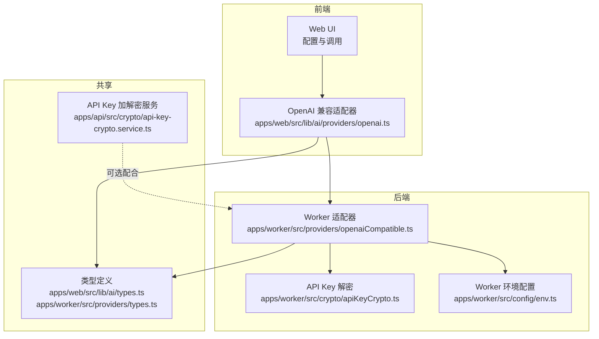
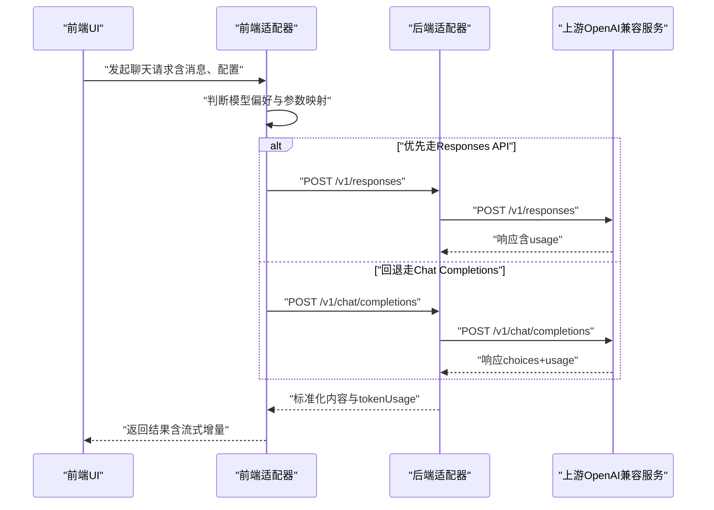
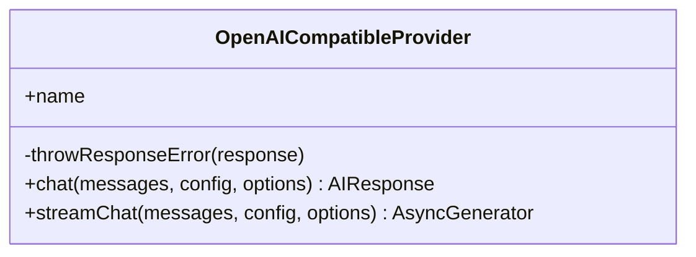
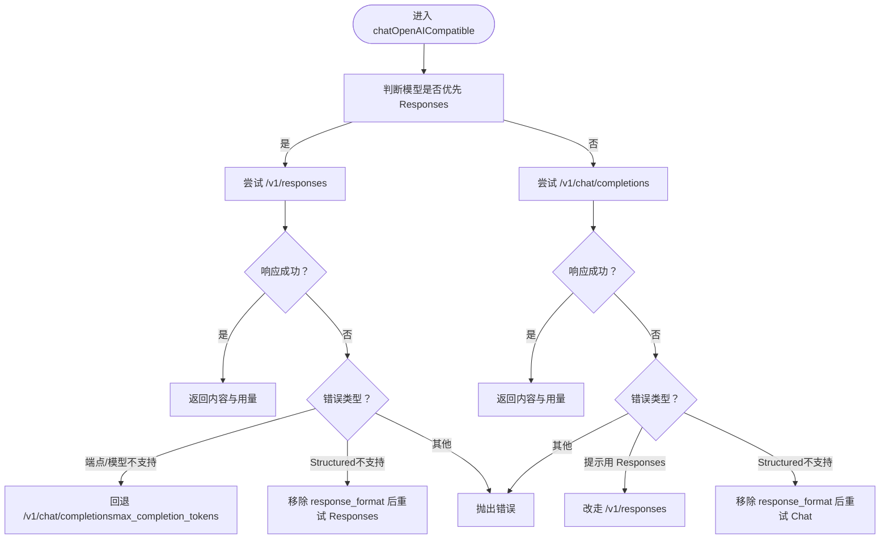
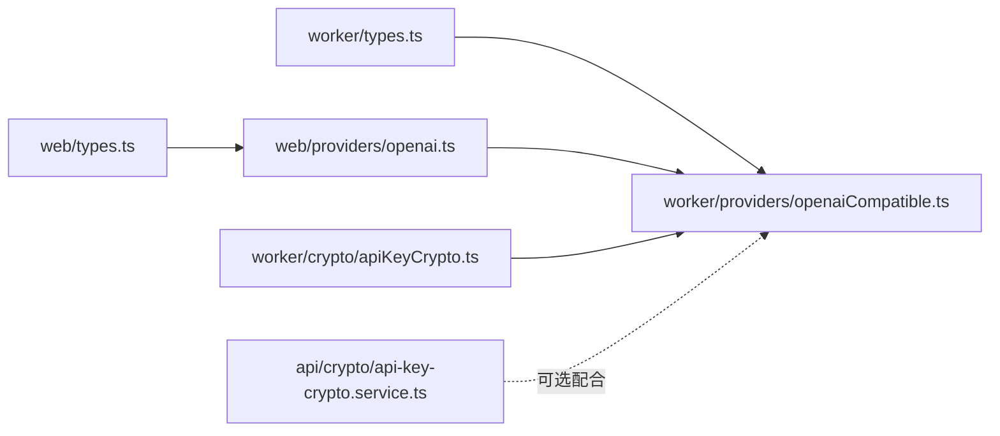

# OpenAI集成

<cite>
**本文引用的文件**
- [apps/web/src/lib/ai/providers/openai.ts](file://apps/web/src/lib/ai/providers/openai.ts)
- [apps/web/src/lib/ai/types.ts](file://apps/web/src/lib/ai/types.ts)
- [apps/worker/src/providers/openaiCompatible.ts](file://apps/worker/src/providers/openaiCompatible.ts)
- [apps/worker/src/providers/types.ts](file://apps/worker/src/providers/types.ts)
- [apps/worker/src/crypto/apiKeyCrypto.ts](file://apps/worker/src/crypto/apiKeyCrypto.ts)
- [apps/api/src/crypto/api-key-crypto.service.ts](file://apps/api/src/crypto/api-key-crypto.service.ts)
- [apps/worker/src/providers/openaiCompatible.test.ts](file://apps/worker/src/providers/openaiCompatible.test.ts)
- [apps/worker/src/config/env.ts](file://apps/worker/src/config/env.ts)
- [apps/api/src/config/env.ts](file://apps/api/src/config/env.ts)
- [apps/web/src/stores/configStore.ts](file://apps/web/src/stores/configStore.ts)
</cite>

## 目录

1. [简介](#简介)
2. [项目结构](#项目结构)
3. [核心组件](#核心组件)
4. [架构总览](#架构总览)
5. [组件详解](#组件详解)
6. [依赖关系分析](#依赖关系分析)
7. [性能与稳定性](#性能与稳定性)
8. [故障排除指南](#故障排除指南)
9. [结论](#结论)
10. [附录](#附录)

## 简介

本文件系统性梳理并文档化本仓库中的 OpenAI 兼容集成模块，覆盖前端适配器与后端适配器两套实现，重点说明：

- GPT 模型调用路径选择与参数映射（含推理强度、最大输出令牌等）
- 请求格式化与响应解析策略
- API 密钥管理与安全传输
- 后端代理模式的实现原理（请求转发、响应解析、超时控制）
- 完整配置示例、使用场景与最佳实践
- 性能优化建议、速率限制处理与故障排除

## 项目结构

OpenAI 集成涉及前后端两套适配器与配套的类型定义、加密工具与环境配置：

- 前端适配器：负责在浏览器侧发起 OpenAI 兼容 API 请求，支持流式与非流式两种调用方式，并内置回退策略
- 后端适配器：在 Worker 侧统一封装 OpenAI 兼容 API 调用，提供聊天与图片生成功能，内置超时控制与错误抛出
- 类型定义：统一消息、生成参数、响应格式与 Provider 配置
- 加密工具：前后端分别提供对 API Key 的加解密能力，保障密钥安全存储与传输
- 环境配置：定义运行时所需的环境变量与校验规则

图表来源

- [apps/web/src/lib/ai/providers/openai.ts](file://apps/web/src/lib/ai/providers/openai.ts#L171-L384)
- [apps/worker/src/providers/openaiCompatible.ts](file://apps/worker/src/providers/openaiCompatible.ts#L275-L438)
- [apps/web/src/lib/ai/types.ts](file://apps/web/src/lib/ai/types.ts#L1-L30)
- [apps/worker/src/providers/types.ts](file://apps/worker/src/providers/types.ts#L1-L84)
- [apps/worker/src/crypto/apiKeyCrypto.ts](file://apps/worker/src/crypto/apiKeyCrypto.ts#L1-L23)
- [apps/api/src/crypto/api-key-crypto.service.ts](file://apps/api/src/crypto/api-key-crypto.service.ts#L1-L36)
- [apps/worker/src/config/env.ts](file://apps/worker/src/config/env.ts#L1-L15)

章节来源

- [apps/web/src/lib/ai/providers/openai.ts](file://apps/web/src/lib/ai/providers/openai.ts#L1-L384)
- [apps/worker/src/providers/openaiCompatible.ts](file://apps/worker/src/providers/openaiCompatible.ts#L1-L438)
- [apps/web/src/lib/ai/types.ts](file://apps/web/src/lib/ai/types.ts#L1-L30)
- [apps/worker/src/providers/types.ts](file://apps/worker/src/providers/types.ts#L1-L84)
- [apps/worker/src/crypto/apiKeyCrypto.ts](file://apps/worker/src/crypto/apiKeyCrypto.ts#L1-L23)
- [apps/api/src/crypto/api-key-crypto.service.ts](file://apps/api/src/crypto/api-key-crypto.service.ts#L1-L36)
- [apps/worker/src/config/env.ts](file://apps/worker/src/config/env.ts#L1-L15)
- [apps/api/src/config/env.ts](file://apps/api/src/config/env.ts#L1-L17)

## 核心组件

- 前端 OpenAI 兼容适配器：实现聊天与流式聊天接口，自动根据模型选择优先走 Responses API 或回退到 Chat Completions，并进行参数与用量映射
- 后端 OpenAI 兼容适配器：封装聊天与图片生成，统一超时控制、错误抛出与回退逻辑
- 类型定义：统一消息、生成参数、响应格式与 Provider 配置
- API Key 加解密：前端与后端分别提供加解密能力，确保密钥安全
- 环境配置：定义运行时所需环境变量及默认值

章节来源

- [apps/web/src/lib/ai/providers/openai.ts](file://apps/web/src/lib/ai/providers/openai.ts#L171-L384)
- [apps/worker/src/providers/openaiCompatible.ts](file://apps/worker/src/providers/openaiCompatible.ts#L275-L438)
- [apps/web/src/lib/ai/types.ts](file://apps/web/src/lib/ai/types.ts#L1-L30)
- [apps/worker/src/providers/types.ts](file://apps/worker/src/providers/types.ts#L1-L84)
- [apps/worker/src/crypto/apiKeyCrypto.ts](file://apps/worker/src/crypto/apiKeyCrypto.ts#L1-L23)
- [apps/api/src/crypto/api-key-crypto.service.ts](file://apps/api/src/crypto/api-key-crypto.service.ts#L1-L36)

## 架构总览

下图展示从前端到后端的 OpenAI 兼容调用链路，包括模型偏好、端点选择、参数映射与错误回退。

图表来源

- [apps/web/src/lib/ai/providers/openai.ts](file://apps/web/src/lib/ai/providers/openai.ts#L197-L308)
- [apps/worker/src/providers/openaiCompatible.ts](file://apps/worker/src/providers/openaiCompatible.ts#L275-L389)

## 组件详解

### 前端适配器：OpenAICompatibleProvider

- 功能职责
  - 聊天：根据模型偏好优先调用 Responses API，否则回退到 Chat Completions
  - 流式聊天：优先尝试流式 Chat Completions；若上游不支持，则以非流式 Responses 兜底
  - 参数映射：温度、采样、惩罚项、最大输出令牌等；推理强度针对不同模型做兼容映射
  - 错误处理：统一解析 HTTP 错误并抛出带状态码与详情的错误对象
  - 用量统计：从响应中抽取 prompt/completion/total 令牌数
- 关键行为
  - 模型偏好：GPT-5 系列与 O 系列优先走 Responses API
  - 端点选择：自动去除重复的 /v1 或 /v1beta，避免二次拼接
  - 推理强度归一：针对不同模型进行 effort 映射，避免上游 400
  - 回退策略：Responses 404 或不支持时回退 Chat Completions；反之亦然
  - 流式解析：基于 SSE 文本行解析增量内容，遇到 [DONE] 结束

图表来源

- [apps/web/src/lib/ai/providers/openai.ts](file://apps/web/src/lib/ai/providers/openai.ts#L171-L384)

章节来源

- [apps/web/src/lib/ai/providers/openai.ts](file://apps/web/src/lib/ai/providers/openai.ts#L34-L49)
- [apps/web/src/lib/ai/providers/openai.ts](file://apps/web/src/lib/ai/providers/openai.ts#L59-L85)
- [apps/web/src/lib/ai/providers/openai.ts](file://apps/web/src/lib/ai/providers/openai.ts#L171-L384)
- [apps/web/src/lib/ai/types.ts](file://apps/web/src/lib/ai/types.ts#L1-L30)

### 后端适配器：chatOpenAICompatible 与 generateImagesOpenAICompatible

- 功能职责
  - 聊天：根据模型偏好与错误信息决定 Responses 或 Chat Completions；支持 response_format 透传
  - 图片：调用 /v1/images/generations，固定 response_format=url
  - 超时控制：统一通过 AbortController 控制请求超时，支持环境变量配置
  - 错误处理：解析 JSON 或文本错误体，抛出带状态码与详情的错误对象
- 关键行为
  - 超时策略：默认 120 秒，可通过环境变量调整
  - 端点构建：规范化 baseURL，去除尾部斜杠与重复版本号
  - 推理强度：针对不同模型进行 effort 归一化
  - 回退策略：Structured Outputs 不支持时自动移除 response_format 再试

图表来源

- [apps/worker/src/providers/openaiCompatible.ts](file://apps/worker/src/providers/openaiCompatible.ts#L275-L389)

章节来源

- [apps/worker/src/providers/openaiCompatible.ts](file://apps/worker/src/providers/openaiCompatible.ts#L52-L76)
- [apps/worker/src/providers/openaiCompatible.ts](file://apps/worker/src/providers/openaiCompatible.ts#L84-L101)
- [apps/worker/src/providers/openaiCompatible.ts](file://apps/worker/src/providers/openaiCompatible.ts#L113-L149)
- [apps/worker/src/providers/openaiCompatible.ts](file://apps/worker/src/providers/openaiCompatible.ts#L209-L243)
- [apps/worker/src/providers/openaiCompatible.ts](file://apps/worker/src/providers/openaiCompatible.ts#L275-L389)
- [apps/worker/src/providers/openaiCompatible.ts](file://apps/worker/src/providers/openaiCompatible.ts#L391-L438)

### 类型定义与配置

- 消息与响应
  - ChatMessage：角色与内容
  - ChatResult：内容与 tokenUsage
- 生成参数
  - GenerationParams：温度、采样、最大输出令牌、惩罚项、推理强度
  - ProviderChatConfig：kind、apiKey、baseURL、model、params、responseFormat
  - ProviderImageConfig：kind、apiKey、baseURL、model、params
- 响应格式
  - JsonSchemaResponseFormat：名称、严格性、schema
  - ResponseFormat：json_schema 或 json_object

章节来源

- [apps/web/src/lib/ai/types.ts](file://apps/web/src/lib/ai/types.ts#L1-L30)
- [apps/worker/src/providers/types.ts](file://apps/worker/src/providers/types.ts#L1-L84)

### API 密钥管理与安全传输

- 前端
  - 支持对配置数据进行加密存储，解密后在内存中使用
  - 配置对话框显示加密状态与提示
- 后端
  - 提供 API Key 加解密服务，采用 AES-256-GCM，支持从加密负载中恢复明文
  - Worker 侧提供独立的解密函数，便于在队列任务中安全获取密钥
- 环境变量
  - API_KEY_ENCRYPTION_KEY：32 字节或 base64 编码的 32 字节密钥
  - AI_REQUEST_TIMEOUT_MS：请求超时时间（毫秒）

章节来源

- [apps/worker/src/crypto/apiKeyCrypto.ts](file://apps/worker/src/crypto/apiKeyCrypto.ts#L1-L23)
- [apps/api/src/crypto/api-key-crypto.service.ts](file://apps/api/src/crypto/api-key-crypto.service.ts#L1-L36)
- [apps/worker/src/config/env.ts](file://apps/worker/src/config/env.ts#L6)
- [apps/api/src/config/env.ts](file://apps/api/src/config/env.ts#L8)

### 使用场景与最佳实践

- 场景一：优先使用 Responses API（GPT-5/O 系列）
  - 自动选择 /v1/responses，使用 max_output_tokens 与推理强度
  - 若上游不支持 Responses 或模型不支持，自动回退 Chat Completions
- 场景二：结构化输出（JSON Schema/JSON Object）
  - 透传 response_format；若上游不支持，自动移除后重试
- 场景三：流式输出
  - 优先走流式 Chat Completions；若不支持，以非流式 Responses 兜底
- 最佳实践
  - 明确指定模型名称与 Base URL，避免重复版本号
  - 合理设置最大输出令牌与温度，平衡质量与成本
  - 在生产环境配置合适的 AI_REQUEST_TIMEOUT_MS，避免长时间挂起
  - 使用加密存储 API Key，避免泄露

章节来源

- [apps/web/src/lib/ai/providers/openai.ts](file://apps/web/src/lib/ai/providers/openai.ts#L51-L57)
- [apps/web/src/lib/ai/providers/openai.ts](file://apps/web/src/lib/ai/providers/openai.ts#L155-L169)
- [apps/worker/src/providers/openaiCompatible.ts](file://apps/worker/src/providers/openaiCompatible.ts#L103-L111)
- [apps/worker/src/providers/openaiCompatible.ts](file://apps/worker/src/providers/openaiCompatible.ts#L227-L243)
- [apps/worker/src/providers/openaiCompatible.ts](file://apps/worker/src/providers/openaiCompatible.ts#L365-L367)
- [apps/worker/src/providers/openaiCompatible.ts](file://apps/worker/src/providers/openaiCompatible.ts#L379-L382)

## 依赖关系分析

- 前端适配器依赖类型定义与自身工具函数（URL 规范化、端点选择、参数映射、错误抛出）
- 后端适配器依赖类型定义、超时控制与错误抛出工具
- 两者均通过统一的 ProviderConfig 传递 apiKey/baseURL/model/params/responseFormat
- 加密工具在 Worker 侧用于安全解密 API Key，API 侧提供对称加解密服务

图表来源

- [apps/web/src/lib/ai/types.ts](file://apps/web/src/lib/ai/types.ts#L1-L30)
- [apps/worker/src/providers/types.ts](file://apps/worker/src/providers/types.ts#L1-L84)
- [apps/web/src/lib/ai/providers/openai.ts](file://apps/web/src/lib/ai/providers/openai.ts#L171-L384)
- [apps/worker/src/providers/openaiCompatible.ts](file://apps/worker/src/providers/openaiCompatible.ts#L275-L438)
- [apps/worker/src/crypto/apiKeyCrypto.ts](file://apps/worker/src/crypto/apiKeyCrypto.ts#L1-L23)
- [apps/api/src/crypto/api-key-crypto.service.ts](file://apps/api/src/crypto/api-key-crypto.service.ts#L1-L36)

章节来源

- [apps/web/src/lib/ai/providers/openai.ts](file://apps/web/src/lib/ai/providers/openai.ts#L1-L384)
- [apps/worker/src/providers/openaiCompatible.ts](file://apps/worker/src/providers/openaiCompatible.ts#L1-L438)
- [apps/web/src/lib/ai/types.ts](file://apps/web/src/lib/ai/types.ts#L1-L30)
- [apps/worker/src/providers/types.ts](file://apps/worker/src/providers/types.ts#L1-L84)
- [apps/worker/src/crypto/apiKeyCrypto.ts](file://apps/worker/src/crypto/apiKeyCrypto.ts#L1-L23)
- [apps/api/src/crypto/api-key-crypto.service.ts](file://apps/api/src/crypto/api-key-crypto.service.ts#L1-L36)

## 性能与稳定性

- 超时控制
  - 后端统一通过 AbortController 控制请求超时，默认 120 秒，可通过环境变量调整
- 端点选择与参数映射
  - 优先 Responses API 以获得更稳定的结构化输出；必要时回退 Chat Completions
  - 推理强度针对不同模型做兼容映射，减少上游 400
- 流式输出
  - 优先走流式 Chat Completions；若不支持，以非流式 Responses 兜底，保证可用性
- 用量统计
  - 统一从响应中抽取 prompt/completion/total，兼容不同上游字段命名

章节来源

- [apps/worker/src/providers/openaiCompatible.ts](file://apps/worker/src/providers/openaiCompatible.ts#L52-L76)
- [apps/worker/src/providers/openaiCompatible.ts](file://apps/worker/src/providers/openaiCompatible.ts#L113-L149)
- [apps/web/src/lib/ai/providers/openai.ts](file://apps/web/src/lib/ai/providers/openai.ts#L310-L382)
- [apps/worker/src/providers/openaiCompatible.ts](file://apps/worker/src/providers/openaiCompatible.ts#L151-L183)

## 故障排除指南

- 常见错误与定位
  - 401/403：鉴权失败，检查 API Key 是否正确、未过期、与供应商匹配
  - 404：资源不存在，检查 Base URL 与模型名称
  - 429：触发限流/配额，稍后重试或提升配额
  - 5xx：服务端异常，稍后重试或切换节点/Base URL
  - 网络/CORS：检查网络、代理/VPN 与浏览器控制台的 CORS 报错
- 自动回退与兼容
  - Responses 404 或不支持时自动回退 Chat Completions
  - Chat Completions 提示必须用 Responses 时自动切换
  - Structured Outputs 不支持时自动移除 response_format 后重试
- 连接测试
  - 前端提供连接测试流程，返回成功/失败与建议

章节来源

- [apps/web/src/stores/configStore.ts](file://apps/web/src/stores/configStore.ts#L155-L170)
- [apps/worker/src/providers/openaiCompatible.ts](file://apps/worker/src/providers/openaiCompatible.ts#L209-L243)
- [apps/worker/src/providers/openaiCompatible.ts](file://apps/worker/src/providers/openaiCompatible.ts#L227-L243)
- [apps/worker/src/providers/openaiCompatible.ts](file://apps/worker/src/providers/openaiCompatible.ts#L365-L367)
- [apps/worker/src/providers/openaiCompatible.ts](file://apps/worker/src/providers/openaiCompatible.ts#L379-L382)

## 结论

本集成模块通过前后端适配器实现了对 OpenAI 兼容 API 的统一抽象，具备以下优势：

- 智能端点选择与参数映射，兼顾稳定性与结构化输出能力
- 完善的错误回退与兼容策略，提升可用性
- 安全的 API Key 管理与超时控制，增强生产可用性
  建议在实际部署中结合业务场景合理配置模型、参数与超时时间，并持续关注上游变更与配额情况。

## 附录

### 配置示例与要点

- ProviderChatConfig
  - kind：'openai_compatible'
  - apiKey：来自加密存储或环境变量
  - baseURL：上游 Base URL（自动去除重复版本号）
  - model：模型名称（如 gpt-5、o1、gpt-4o-mini 等）
  - params：generationParams（温度、采样、最大输出令牌、惩罚项、推理强度）
  - responseFormat：可选，json_schema 或 json_object
- ProviderImageConfig
  - kind：'openai_compatible'
  - apiKey/baseURL/model/params：同上，params 包括 size、quality、style、n、seed
- 环境变量
  - API_KEY_ENCRYPTION_KEY：32 字节或 base64 编码的 32 字节密钥
  - AI_REQUEST_TIMEOUT_MS：请求超时时间（毫秒）

章节来源

- [apps/worker/src/providers/types.ts](file://apps/worker/src/providers/types.ts#L37-L49)
- [apps/worker/src/providers/types.ts](file://apps/worker/src/providers/types.ts#L68-L74)
- [apps/worker/src/config/env.ts](file://apps/worker/src/config/env.ts#L6)
- [apps/api/src/config/env.ts](file://apps/api/src/config/env.ts#L8)

### 单元测试要点（参考）

- GPT-5 优先走 /v1/responses，使用 max_output_tokens 与推理强度
- GPT-5.2 下 minimal 自动降级为 none
- responseFormat 透传至上游
- 非 GPT-5 默认走 /v1/chat/completions，使用 max_tokens
- Responses 404 时回退 Chat Completions（并使用 max_completion_tokens）
- Chat Completions 提示需用 Responses 时自动切换
- Structured 不支持时自动移除 response_format 后重试

章节来源

- [apps/worker/src/providers/openaiCompatible.test.ts](file://apps/worker/src/providers/openaiCompatible.test.ts#L10-L45)
- [apps/worker/src/providers/openaiCompatible.test.ts](file://apps/worker/src/providers/openaiCompatible.test.ts#L47-L72)
- [apps/worker/src/providers/openaiCompatible.test.ts](file://apps/worker/src/providers/openaiCompatible.test.ts#L74-L113)
- [apps/worker/src/providers/openaiCompatible.test.ts](file://apps/worker/src/providers/openaiCompatible.test.ts#L115-L148)
- [apps/worker/src/providers/openaiCompatible.test.ts](file://apps/worker/src/providers/openaiCompatible.test.ts#L175-L222)
- [apps/worker/src/providers/openaiCompatible.test.ts](file://apps/worker/src/providers/openaiCompatible.test.ts#L224-L266)
