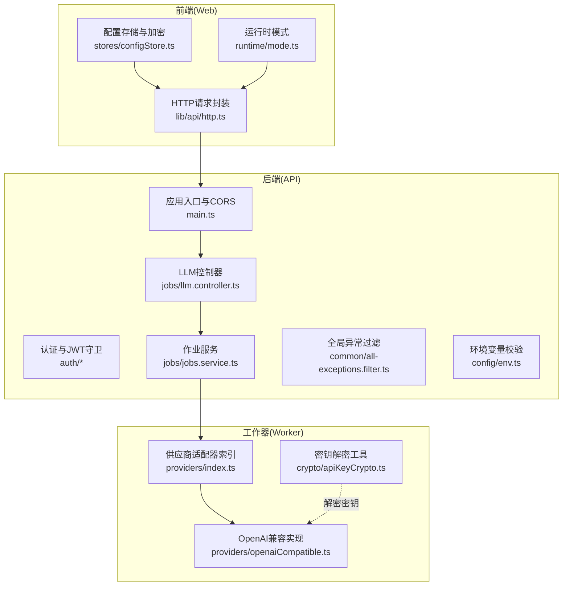
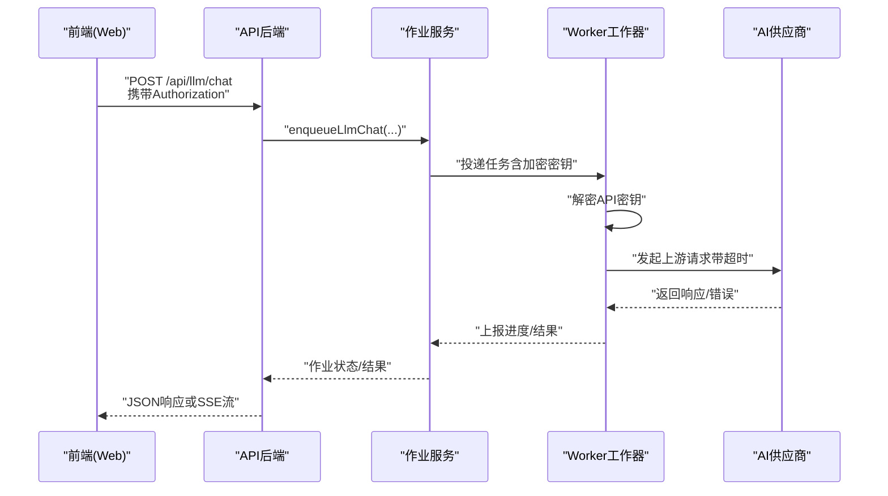
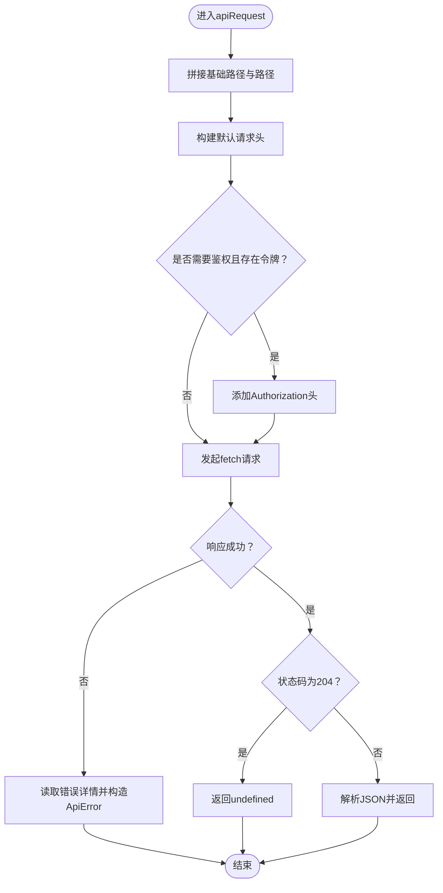
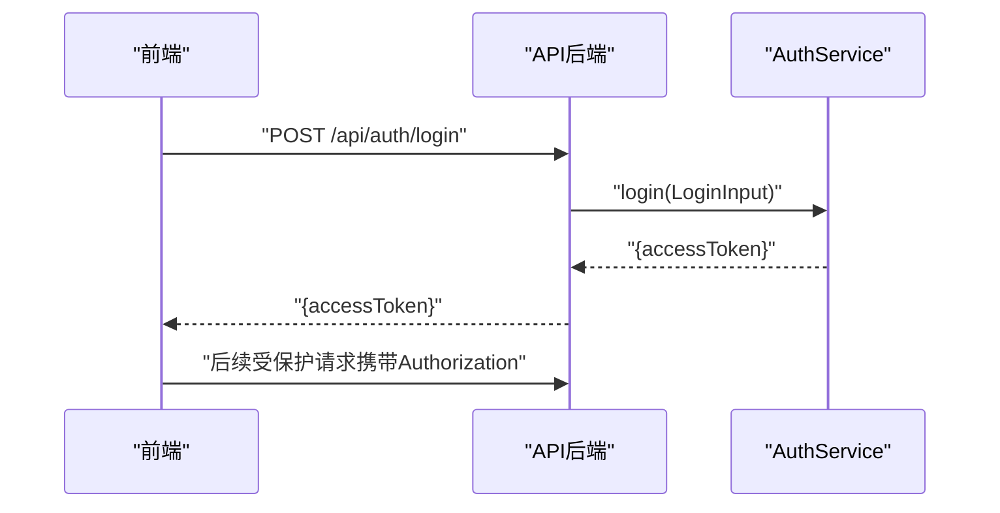
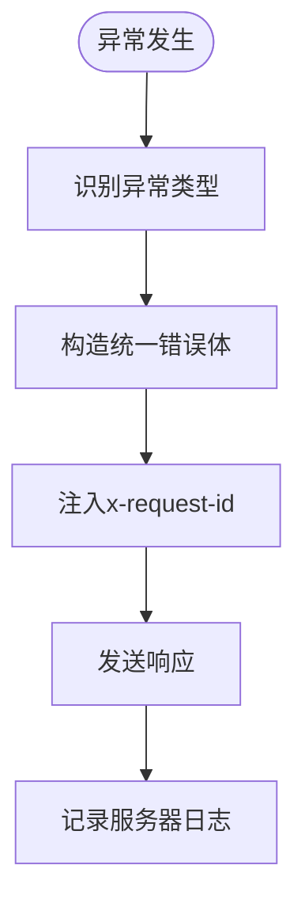
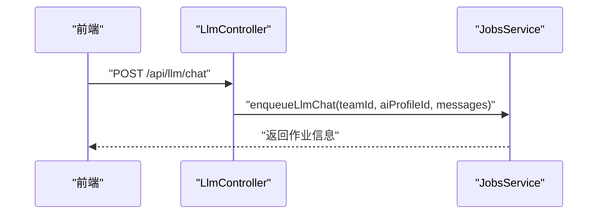
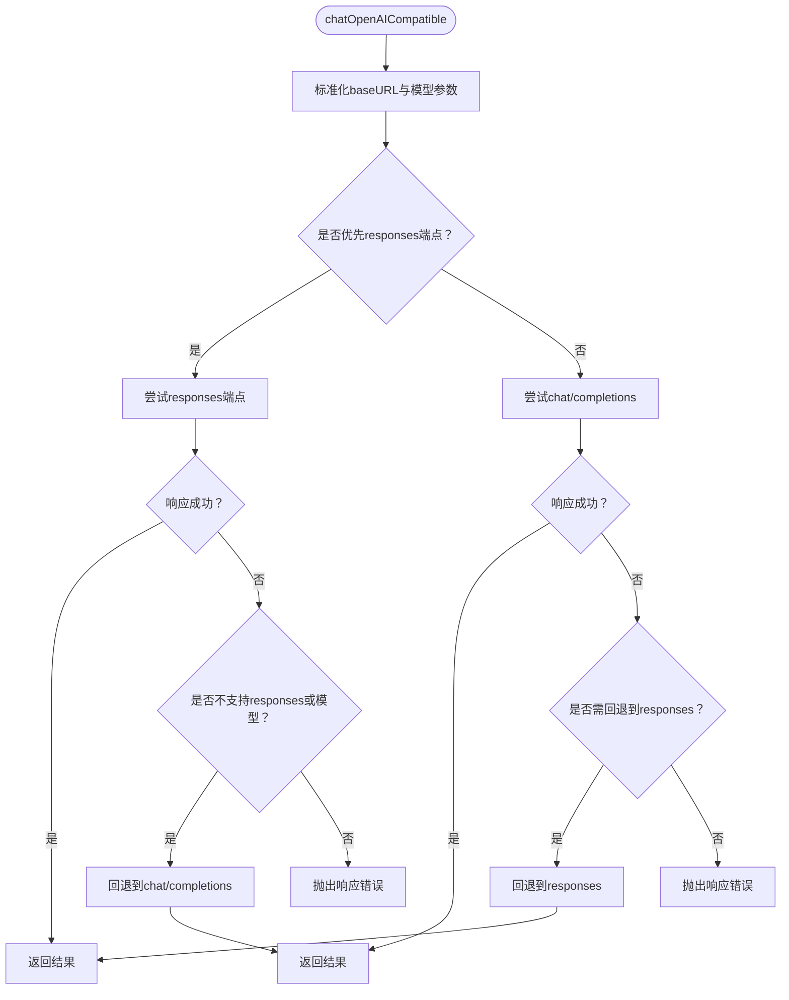
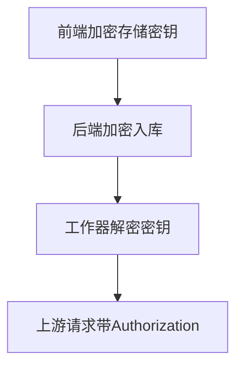

# 后端代理模式

<cite>
**本文引用的文件**
- [apps/api/src/crypto/api-key-crypto.service.ts](file://apps/api/src/crypto/api-key-crypto.service.ts)
- [apps/worker/src/crypto/apiKeyCrypto.ts](file://apps/worker/src/crypto/apiKeyCrypto.ts)
- [apps/api/src/config/env.ts](file://apps/api/src/config/env.ts)
- [apps/api/src/main.ts](file://apps/api/src/main.ts)
- [apps/api/src/common/all-exceptions.filter.ts](file://apps/api/src/common/all-exceptions.filter.ts)
- [apps/api/src/auth/auth.service.ts](file://apps/api/src/auth/auth.service.ts)
- [apps/api/src/auth/jwt-auth.guard.ts](file://apps/api/src/auth/jwt-auth.guard.ts)
- [apps/api/src/jobs/llm.controller.ts](file://apps/api/src/jobs/llm.controller.ts)
- [apps/api/src/jobs/jobs.service.ts](file://apps/api/src/jobs/jobs.service.ts)
- [apps/worker/src/providers/index.ts](file://apps/worker/src/providers/index.ts)
- [apps/worker/src/providers/openaiCompatible.ts](file://apps/worker/src/providers/openaiCompatible.ts)
- [apps/web/src/lib/api/http.ts](file://apps/web/src/lib/api/http.ts)
- [apps/web/src/lib/runtime/mode.ts](file://apps/web/src/lib/runtime/mode.ts)
- [apps/web/src/stores/configStore.ts](file://apps/web/src/stores/configStore.ts)
- [apps/api/src/app.module.ts](file://apps/api/src/app.module.ts)
- [prd_backup.md](file://prd_backup.md)
</cite>

## 目录

1. [引言](#引言)
2. [项目结构](#项目结构)
3. [核心组件](#核心组件)
4. [架构总览](#架构总览)
5. [组件详解](#组件详解)
6. [依赖关系分析](#依赖关系分析)
7. [性能考量](#性能考量)
8. [故障排除指南](#故障排除指南)
9. [结论](#结论)
10. [附录](#附录)

## 引言

本文件系统性阐述本项目的“后端代理模式”，聚焦以下方面：

- 设计原理与实现机制：请求转发、响应处理、安全传输
- API密钥加密存储与前端解密流程
- 请求路由与队列调度（代理+工作器）
- 超时控制与错误处理
- 前后端分离架构下的数据流与安全策略
- 代理配置示例、性能优化建议与故障排除
- 安全最佳实践与监控方案

## 项目结构

本项目采用多包工作区（NestJS + React + Worker），后端代理模式主要由三部分协同完成：

- Web前端：负责运行时模式选择、API访问令牌设置、统一HTTP请求封装
- API后端：负责鉴权、路由、异常过滤、全局CORS配置、队列作业编排
- Worker工作器：负责对接多家AI供应商，执行实际请求与超时控制

**图表来源**

- [apps/web/src/lib/runtime/mode.ts](file://apps/web/src/lib/runtime/mode.ts#L1-L30)
- [apps/web/src/lib/api/http.ts](file://apps/web/src/lib/api/http.ts#L1-L93)
- [apps/web/src/stores/configStore.ts](file://apps/web/src/stores/configStore.ts#L537-L620)
- [apps/api/src/main.ts](file://apps/api/src/main.ts#L1-L34)
- [apps/api/src/auth/auth.service.ts](file://apps/api/src/auth/auth.service.ts#L1-L77)
- [apps/api/src/auth/jwt-auth.guard.ts](file://apps/api/src/auth/jwt-auth.guard.ts#L1-L8)
- [apps/api/src/jobs/llm.controller.ts](file://apps/api/src/jobs/llm.controller.ts#L1-L75)
- [apps/api/src/jobs/jobs.service.ts](file://apps/api/src/jobs/jobs.service.ts#L1-L800)
- [apps/api/src/common/all-exceptions.filter.ts](file://apps/api/src/common/all-exceptions.filter.ts#L1-L91)
- [apps/api/src/config/env.ts](file://apps/api/src/config/env.ts#L1-L17)
- [apps/worker/src/providers/index.ts](file://apps/worker/src/providers/index.ts#L1-L44)
- [apps/worker/src/providers/openaiCompatible.ts](file://apps/worker/src/providers/openaiCompatible.ts#L1-L438)
- [apps/worker/src/crypto/apiKeyCrypto.ts](file://apps/worker/src/crypto/apiKeyCrypto.ts#L1-L23)

**章节来源**

- [apps/api/src/app.module.ts](file://apps/api/src/app.module.ts#L1-L37)
- [apps/api/src/main.ts](file://apps/api/src/main.ts#L1-L34)
- [apps/api/src/config/env.ts](file://apps/api/src/config/env.ts#L1-L17)

## 核心组件

- 运行时模式与API基址
  - 前端通过运行时模式决定数据来源（本地/远程），并根据环境变量确定API基础路径
- 统一HTTP请求封装
  - 封装fetch调用、自动注入Authorization头、解析错误详情、提取请求ID
- 认证与鉴权
  - JWT签发与守卫，登录/注册流程，访问令牌在前端存储并在请求中携带
- 全局异常过滤
  - 统一错误响应格式，注入x-request-id，区分生产/开发日志策略
- 代理路由与作业编排
  - LLM聊天接口作为代理入口，接收消息与AI配置，入队至作业服务
- 工作器供应商适配
  - 适配多家OpenAI兼容/特定供应商，内置超时控制、响应归一化、错误映射
- API密钥加密存储与解密
  - 后端服务端加密存储密钥；前端本地加密存储；工作器侧解密执行请求

**章节来源**

- [apps/web/src/lib/runtime/mode.ts](file://apps/web/src/lib/runtime/mode.ts#L1-L30)
- [apps/web/src/lib/api/http.ts](file://apps/web/src/lib/api/http.ts#L1-L93)
- [apps/api/src/auth/auth.service.ts](file://apps/api/src/auth/auth.service.ts#L1-L77)
- [apps/api/src/auth/jwt-auth.guard.ts](file://apps/api/src/auth/jwt-auth.guard.ts#L1-L8)
- [apps/api/src/common/all-exceptions.filter.ts](file://apps/api/src/common/all-exceptions.filter.ts#L1-L91)
- [apps/api/src/jobs/llm.controller.ts](file://apps/api/src/jobs/llm.controller.ts#L1-L75)
- [apps/api/src/jobs/jobs.service.ts](file://apps/api/src/jobs/jobs.service.ts#L1-L800)
- [apps/worker/src/providers/index.ts](file://apps/worker/src/providers/index.ts#L1-L44)
- [apps/worker/src/providers/openaiCompatible.ts](file://apps/worker/src/providers/openaiCompatible.ts#L1-L438)
- [apps/api/src/crypto/api-key-crypto.service.ts](file://apps/api/src/crypto/api-key-crypto.service.ts#L1-L39)
- [apps/worker/src/crypto/apiKeyCrypto.ts](file://apps/worker/src/crypto/apiKeyCrypto.ts#L1-L23)

## 架构总览

下图展示从Web前端到API后端再到Worker工作器的完整链路，以及密钥在各层的流转与处理。

**图表来源**

- [apps/web/src/lib/api/http.ts](file://apps/web/src/lib/api/http.ts#L58-L92)
- [apps/api/src/jobs/llm.controller.ts](file://apps/api/src/jobs/llm.controller.ts#L55-L59)
- [apps/api/src/jobs/jobs.service.ts](file://apps/api/src/jobs/jobs.service.ts#L1-L800)
- [apps/worker/src/providers/index.ts](file://apps/worker/src/providers/index.ts#L12-L25)
- [apps/worker/src/providers/openaiCompatible.ts](file://apps/worker/src/providers/openaiCompatible.ts#L275-L389)
- [apps/worker/src/crypto/apiKeyCrypto.ts](file://apps/worker/src/crypto/apiKeyCrypto.ts#L8-L20)

## 组件详解

### 1) 前端运行时与HTTP请求

- 运行时模式
  - 支持local与api两种模式，默认按环境决定；可通过环境变量覆盖
  - API基础路径可由环境变量指定，自动去除尾部斜杠
- HTTP请求封装
  - 自动拼接基础路径与路径段
  - 默认Accept: application/json，必要时序列化请求体
  - 若存在访问令牌且需要鉴权，则附加Authorization头
  - 非200系列响应统一抛出ApiError，包含状态码、详情与x-request-id
  - 204响应返回undefined，其余按JSON解析

**图表来源**

- [apps/web/src/lib/api/http.ts](file://apps/web/src/lib/api/http.ts#L58-L92)

**章节来源**

- [apps/web/src/lib/runtime/mode.ts](file://apps/web/src/lib/runtime/mode.ts#L1-L30)
- [apps/web/src/lib/api/http.ts](file://apps/web/src/lib/api/http.ts#L1-L93)

### 2) 后端认证与鉴权

- 登录/注册
  - 使用bcrypt进行密码哈希；JWT签发包含用户标识与团队信息
- JWT守卫
  - 通过Passport JWT策略保护路由
- 访问令牌传递
  - 前端通过setApiAccessToken设置令牌，HTTP封装自动附加

**图表来源**

- [apps/api/src/auth/auth.service.ts](file://apps/api/src/auth/auth.service.ts#L58-L73)
- [apps/api/src/auth/jwt-auth.guard.ts](file://apps/api/src/auth/jwt-auth.guard.ts#L1-L8)
- [apps/web/src/lib/api/http.ts](file://apps/web/src/lib/api/http.ts#L17-L23)

**章节来源**

- [apps/api/src/auth/auth.service.ts](file://apps/api/src/auth/auth.service.ts#L1-L77)
- [apps/api/src/auth/jwt-auth.guard.ts](file://apps/api/src/auth/jwt-auth.guard.ts#L1-L8)
- [apps/web/src/lib/api/http.ts](file://apps/web/src/lib/api/http.ts#L17-L23)

### 3) 全局异常过滤与错误响应

- 统一错误响应体包含状态码、消息与可选的请求ID
- 在响应头注入x-request-id，便于追踪
- 生产环境隐藏底层异常细节，开发环境保留详细信息
- 服务器端日志记录请求元信息与异常摘要

**图表来源**

- [apps/api/src/common/all-exceptions.filter.ts](file://apps/api/src/common/all-exceptions.filter.ts#L34-L84)

**章节来源**

- [apps/api/src/common/all-exceptions.filter.ts](file://apps/api/src/common/all-exceptions.filter.ts#L1-L91)

### 4) 代理路由与作业编排

- LLM聊天代理
  - 受JWT保护的控制器，接收消息与AI配置，入队至作业服务
- 作业服务
  - 负责参数校验、作业持久化、队列投递与进度查询
  - 提供多种作业类型（如计划剧集、生成场景列表等）

**图表来源**

- [apps/api/src/jobs/llm.controller.ts](file://apps/api/src/jobs/llm.controller.ts#L55-L59)
- [apps/api/src/jobs/jobs.service.ts](file://apps/api/src/jobs/jobs.service.ts#L1-L800)

**章节来源**

- [apps/api/src/jobs/llm.controller.ts](file://apps/api/src/jobs/llm.controller.ts#L1-L75)
- [apps/api/src/jobs/jobs.service.ts](file://apps/api/src/jobs/jobs.service.ts#L1-L800)

### 5) 工作器供应商适配与超时控制

- 供应商适配器
  - 统一入口函数根据配置分发到不同供应商实现
- OpenAI兼容实现
  - 自动选择chat/completions或responses端点，依据模型特性与错误语义进行回退
  - 内置请求超时控制与AbortController，超时错误明确提示
  - 归一化token用量字段，提取文本内容
- 错误映射
  - 将上游错误转换为可读的错误对象，包含状态码、状态文本与详情

**图表来源**

- [apps/worker/src/providers/openaiCompatible.ts](file://apps/worker/src/providers/openaiCompatible.ts#L275-L389)

**章节来源**

- [apps/worker/src/providers/index.ts](file://apps/worker/src/providers/index.ts#L1-L44)
- [apps/worker/src/providers/openaiCompatible.ts](file://apps/worker/src/providers/openaiCompatible.ts#L1-L438)

### 6) API密钥加密存储与解密

- 后端服务端加密
  - 使用AES-256-GCM对称加密，初始化向量与认证标签随密文一起存储
  - 密钥长度要求：推荐32字节（base64），否则回退为SHA-256派生
- 前端本地加密存储
  - 配置档案中的密钥以加密形式保存，不可直接读取
- 工作器解密
  - 使用相同密钥派生逻辑解密，再用于上游请求

**图表来源**

- [apps/api/src/crypto/api-key-crypto.service.ts](file://apps/api/src/crypto/api-key-crypto.service.ts#L17-L35)
- [apps/worker/src/crypto/apiKeyCrypto.ts](file://apps/worker/src/crypto/apiKeyCrypto.ts#L8-L20)
- [apps/web/src/stores/configStore.ts](file://apps/web/src/stores/configStore.ts#L586-L620)

**章节来源**

- [apps/api/src/crypto/api-key-crypto.service.ts](file://apps/api/src/crypto/api-key-crypto.service.ts#L1-L39)
- [apps/worker/src/crypto/apiKeyCrypto.ts](file://apps/worker/src/crypto/apiKeyCrypto.ts#L1-L23)
- [apps/web/src/stores/configStore.ts](file://apps/web/src/stores/configStore.ts#L586-L620)

### 7) CORS与全局前缀

- CORS
  - 启用CORS并允许凭据，源地址来自环境变量
- 全局前缀
  - 设置/api为全局前缀，统一路由前缀

**章节来源**

- [apps/api/src/main.ts](file://apps/api/src/main.ts#L16-L22)

### 8) 环境变量与配置

- 关键环境变量
  - NODE_ENV、PORT、DATABASE_URL、JWT_SECRET、API_KEY_ENCRYPTION_KEY、REDIS_URL、AI_QUEUE_NAME、CORS_ORIGIN
- 配置校验
  - 使用Zod Schema进行运行时校验，确保最小值与默认值

**章节来源**

- [apps/api/src/config/env.ts](file://apps/api/src/config/env.ts#L1-L17)

## 依赖关系分析

- 前端依赖
  - 运行时模式与API基础路径决定请求目标
  - HTTP封装统一处理鉴权头与错误
- 后端依赖
  - 应用模块集中导入认证、作业、项目、角色等模块
  - 控制器依赖服务，服务依赖队列与数据库
- 工作器依赖
  - 供应商适配器统一对外，内部实现超时与错误处理

**图表来源**

- [apps/api/src/app.module.ts](file://apps/api/src/app.module.ts#L16-L32)
- [apps/api/src/jobs/jobs.service.ts](file://apps/api/src/jobs/jobs.service.ts#L1-L800)
- [apps/worker/src/providers/index.ts](file://apps/worker/src/providers/index.ts#L1-L44)

**章节来源**

- [apps/api/src/app.module.ts](file://apps/api/src/app.module.ts#L1-L37)

## 性能考量

- 超时控制
  - 工作器默认请求超时可由环境变量配置，建议结合供应商SLA与网络状况调整
- 队列与重试
  - 作业服务为多次操作配置了指数退避与最大重试次数，减少瞬时失败影响
- 响应归一化
  - 统一token用量字段与文本提取，降低上层解析成本
- 前端缓存与鉴权
  - 建议在前端对常用配置与令牌进行本地缓存，减少重复请求

[本节为通用指导，无需具体文件分析]

## 故障排除指南

- 常见问题定位
  - 查看x-request-id，结合服务器日志定位请求路径与异常堆栈
  - 区分生产与开发环境的日志策略，避免敏感信息泄露
- 超时与网络
  - 工作器会将上游超时错误明确提示，检查网络/VPN/供应商可用性，必要时提升超时阈值
- 供应商端点不支持
  - 当出现端点或模型不支持responses或response_format时，系统会自动回退到chat/completions或移除结构化输出重试
- 密钥相关
  - 确认加密密钥长度与格式；前端加密存储不可逆，解密仅在工作器侧进行

**章节来源**

- [apps/api/src/common/all-exceptions.filter.ts](file://apps/api/src/common/all-exceptions.filter.ts#L57-L84)
- [apps/worker/src/providers/openaiCompatible.ts](file://apps/worker/src/providers/openaiCompatible.ts#L52-L76)
- [apps/worker/src/providers/openaiCompatible.ts](file://apps/worker/src/providers/openaiCompatible.ts#L209-L243)
- [apps/worker/src/providers/openaiCompatible.ts](file://apps/worker/src/providers/openaiCompatible.ts#L245-L251)

## 结论

本项目的后端代理模式通过“前端统一请求封装 + 后端JWT鉴权与作业编排 + 工作器供应商适配”的三层协作，实现了安全、可控、可扩展的AI代理能力。配合API密钥加密存储与解密、完善的超时与错误处理、统一的异常过滤与CORS配置，能够在前后端分离架构下保障数据流的安全与稳定。

[本节为总结，无需具体文件分析]

## 附录

### A. 代理配置示例

- 前端运行时模式
  - 通过环境变量VITE_DATA_MODE选择local或api
  - 通过VITE_API_BASE_PATH自定义API基础路径
- API后端
  - 设置CORS_ORIGIN允许的源，启用凭据
  - 配置PORT、JWT_SECRET、API_KEY_ENCRYPTION_KEY、REDIS_URL、AI_QUEUE_NAME等
- 工作器
  - 设置AI_REQUEST_TIMEOUT_MS以控制上游请求超时

**章节来源**

- [apps/web/src/lib/runtime/mode.ts](file://apps/web/src/lib/runtime/mode.ts#L19-L30)
- [apps/api/src/main.ts](file://apps/api/src/main.ts#L14-L19)
- [apps/api/src/config/env.ts](file://apps/api/src/config/env.ts#L1-L17)
- [apps/worker/src/providers/openaiCompatible.ts](file://apps/worker/src/providers/openaiCompatible.ts#L52-L57)

### B. 安全最佳实践

- 严格最小权限
  - 仅授予必要的API密钥与访问范围
- 传输安全
  - 使用HTTPS与安全CORS策略，避免跨站脚本与中间人攻击
- 日志与审计
  - 生产环境避免记录敏感信息；保留x-request-id以便审计
- 密钥管理
  - 后端加密存储密钥；前端仅保存加密副本；工作器解密仅在内存中进行

**章节来源**

- [apps/api/src/common/all-exceptions.filter.ts](file://apps/api/src/common/all-exceptions.filter.ts#L46-L55)
- [apps/api/src/crypto/api-key-crypto.service.ts](file://apps/api/src/crypto/api-key-crypto.service.ts#L10-L15)
- [apps/worker/src/crypto/apiKeyCrypto.ts](file://apps/worker/src/crypto/apiKeyCrypto.ts#L3-L6)

### C. 监控方案

- 请求追踪
  - 通过x-request-id贯穿前端、后端与工作器，统一日志聚合
- 指标采集
  - 作业队列长度、上游请求耗时与成功率、错误分布
- 告警策略
  - 超时率、错误率、队列积压达到阈值触发告警

[本节为通用指导，无需具体文件分析]
