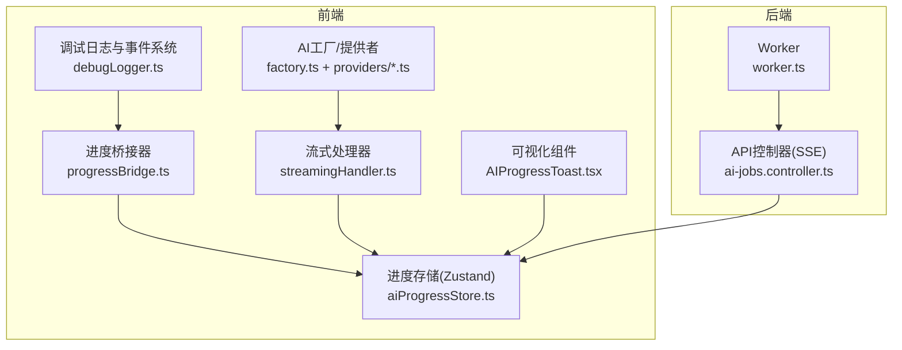
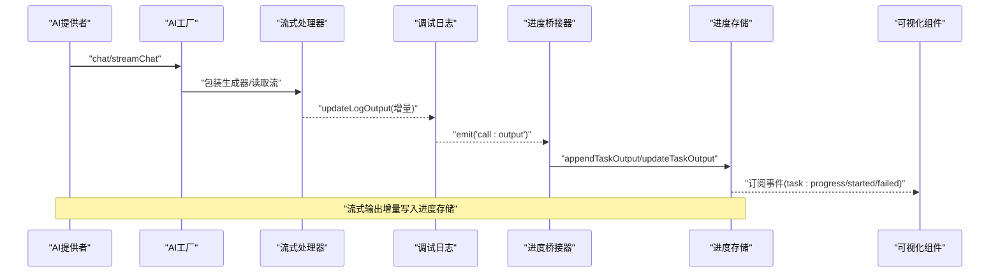
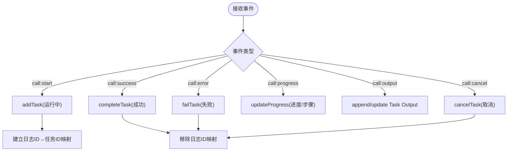
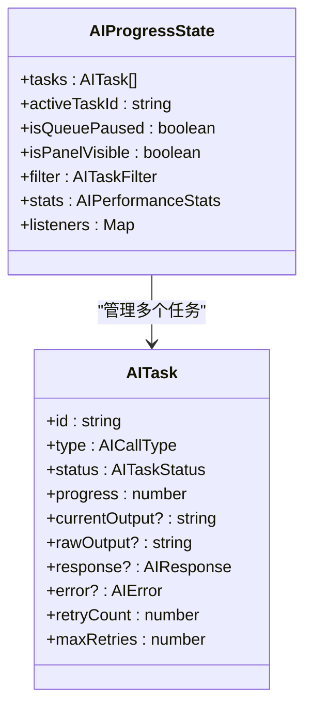
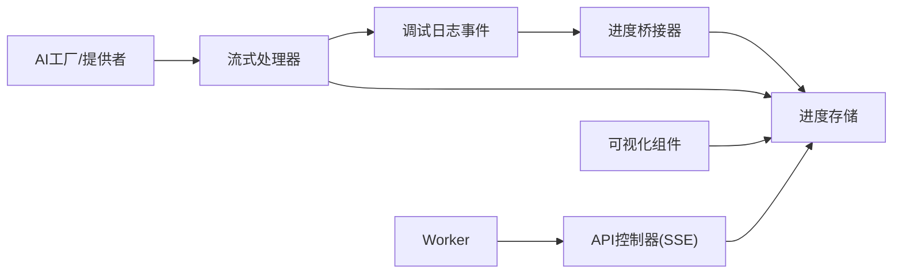

# AI进度追踪

<cite>
**本文引用的文件**
- [apps/web/src/lib/ai/progressBridge.ts](file://apps/web/src/lib/ai/progressBridge.ts)
- [apps/web/src/stores/aiProgressStore.ts](file://apps/web/src/stores/aiProgressStore.ts)
- [apps/web/src/lib/ai/debugLogger.ts](file://apps/web/src/lib/ai/debugLogger.ts)
- [apps/web/src/lib/ai/streamingHandler.ts](file://apps/web/src/lib/ai/streamingHandler.ts)
- [apps/web/src/lib/ai/factory.ts](file://apps/web/src/lib/ai/factory.ts)
- [apps/web/src/lib/ai/providers/openai.ts](file://apps/web/src/lib/ai/providers/openai.ts)
- [apps/web/src/lib/ai/providers/gemini.ts](file://apps/web/src/lib/ai/providers/gemini.ts)
- [apps/web/src/components/AIProgressToast.tsx](file://apps/web/src/components/AIProgressToast.tsx)
- [apps/worker/src/worker.ts](file://apps/worker/src/worker.ts)
- [apps/api/src/jobs/ai-jobs.controller.ts](file://apps/api/src/jobs/ai-jobs.controller.ts)
- [apps/web/src/lib/ai/types.ts](file://apps/web/src/lib/ai/types.ts)
</cite>

## 目录

1. [简介](#简介)
2. [项目结构](#项目结构)
3. [核心组件](#核心组件)
4. [架构总览](#架构总览)
5. [详细组件分析](#详细组件分析)
6. [依赖关系分析](#依赖关系分析)
7. [性能考量](#性能考量)
8. [故障排查指南](#故障排查指南)
9. [结论](#结论)
10. [附录](#附录)

## 简介

本文件面向AIXSSS的AI进度追踪系统，系统性阐述进度桥接器的工作原理、实时进度更新机制与状态管理策略；详解AI进度存储的设计模式、数据结构与持久化方案；说明流式响应处理、增量输出收集与错误恢复机制；解释进度可视化、用户反馈优化与性能监控实现；并给出配置选项、回调处理与事件通知机制的最佳实践与性能优化建议。

## 项目结构

围绕AI进度追踪，前端主要由以下模块构成：

- 调试日志与事件系统：负责记录AI调用、发射事件并提供进度追踪集成开关
- 进度桥接器：将事件系统与进度存储对接，实现跨模块的实时同步
- 进度存储（Zustand）：集中管理任务、统计、过滤与事件订阅
- 流式处理与提供者：统一处理SSE/流式响应，支持增量输出与中断
- 可视化组件：Toast通知、浮动进度指示器与开发者面板联动
- 后端工作流与队列：Worker与队列事件驱动的进度上报与状态持久化

图表来源

- [apps/web/src/lib/ai/debugLogger.ts](file://apps/web/src/lib/ai/debugLogger.ts#L37-L77)
- [apps/web/src/lib/ai/progressBridge.ts](file://apps/web/src/lib/ai/progressBridge.ts#L66-L182)
- [apps/web/src/stores/aiProgressStore.ts](file://apps/web/src/stores/aiProgressStore.ts#L249-L677)
- [apps/web/src/lib/ai/streamingHandler.ts](file://apps/web/src/lib/ai/streamingHandler.ts#L121-L201)
- [apps/web/src/lib/ai/factory.ts](file://apps/web/src/lib/ai/factory.ts#L47-L74)
- [apps/web/src/components/AIProgressToast.tsx](file://apps/web/src/components/AIProgressToast.tsx#L18-L159)
- [apps/worker/src/worker.ts](file://apps/worker/src/worker.ts#L62-L89)
- [apps/api/src/jobs/ai-jobs.controller.ts](file://apps/api/src/jobs/ai-jobs.controller.ts#L37-L65)

章节来源

- [apps/web/src/lib/ai/debugLogger.ts](file://apps/web/src/lib/ai/debugLogger.ts#L1-L624)
- [apps/web/src/lib/ai/progressBridge.ts](file://apps/web/src/lib/ai/progressBridge.ts#L1-L388)
- [apps/web/src/stores/aiProgressStore.ts](file://apps/web/src/stores/aiProgressStore.ts#L1-L758)
- [apps/web/src/lib/ai/streamingHandler.ts](file://apps/web/src/lib/ai/streamingHandler.ts#L1-L460)
- [apps/web/src/lib/ai/factory.ts](file://apps/web/src/lib/ai/factory.ts#L1-L98)
- [apps/web/src/components/AIProgressToast.tsx](file://apps/web/src/components/AIProgressToast.tsx#L1-L296)
- [apps/worker/src/worker.ts](file://apps/worker/src/worker.ts#L62-L89)
- [apps/api/src/jobs/ai-jobs.controller.ts](file://apps/api/src/jobs/ai-jobs.controller.ts#L37-L65)

## 核心组件

- 调试日志与事件系统：提供统一的AI调用生命周期事件（开始/成功/失败/进度/输出/取消），并维护日志历史与统计能力
- 进度桥接器：订阅调试日志事件，将AI调用映射为进度任务，更新任务状态、进度与输出
- 进度存储：Zustand状态管理，提供任务增删改查、批量操作、过滤、统计与事件发布/订阅
- 流式处理器与提供者：统一处理SSE/流式响应，支持增量输出、中断与错误恢复
- 可视化组件：Toast通知与浮动进度指示器，结合开发者面板展示实时状态
- Worker与API控制器：后端队列事件驱动的进度上报与状态持久化

章节来源

- [apps/web/src/lib/ai/debugLogger.ts](file://apps/web/src/lib/ai/debugLogger.ts#L37-L77)
- [apps/web/src/lib/ai/progressBridge.ts](file://apps/web/src/lib/ai/progressBridge.ts#L66-L182)
- [apps/web/src/stores/aiProgressStore.ts](file://apps/web/src/stores/aiProgressStore.ts#L249-L677)
- [apps/web/src/lib/ai/streamingHandler.ts](file://apps/web/src/lib/ai/streamingHandler.ts#L121-L201)
- [apps/web/src/components/AIProgressToast.tsx](file://apps/web/src/components/AIProgressToast.tsx#L18-L159)
- [apps/worker/src/worker.ts](file://apps/worker/src/worker.ts#L62-L89)
- [apps/api/src/jobs/ai-jobs.controller.ts](file://apps/api/src/jobs/ai-jobs.controller.ts#L37-L65)

## 架构总览

AI进度追踪采用“事件驱动 + 存储中心”的架构：

- 前端各模块通过调试日志事件系统产生统一事件
- 进度桥接器作为“桥”，将事件映射为进度任务并写入进度存储
- 可视化组件订阅进度存储，实现UI实时更新
- 后端Worker通过队列事件向API控制器推送进度，API控制器再通过SSE推送到前端

图表来源

- [apps/web/src/lib/ai/factory.ts](file://apps/web/src/lib/ai/factory.ts#L47-L74)
- [apps/web/src/lib/ai/streamingHandler.ts](file://apps/web/src/lib/ai/streamingHandler.ts#L121-L201)
- [apps/web/src/lib/ai/debugLogger.ts](file://apps/web/src/lib/ai/debugLogger.ts#L446-L459)
- [apps/web/src/lib/ai/progressBridge.ts](file://apps/web/src/lib/ai/progressBridge.ts#L142-L161)
- [apps/web/src/stores/aiProgressStore.ts](file://apps/web/src/stores/aiProgressStore.ts#L471-L493)

## 详细组件分析

### 进度桥接器（progressBridge）

职责与机制：

- 订阅调试日志事件：call:start、call:success、call:error、call:progress、call:output、call:cancel
- 将日志条目映射为进度任务，建立日志ID到任务ID的映射表
- 根据事件更新任务状态、进度、输出与错误信息
- 支持跳过进度桥接（skipProgressBridge）以避免重复处理
- 提供手动创建任务的能力（createProgressTask）

图表来源

- [apps/web/src/lib/ai/progressBridge.ts](file://apps/web/src/lib/ai/progressBridge.ts#L70-L182)

章节来源

- [apps/web/src/lib/ai/progressBridge.ts](file://apps/web/src/lib/ai/progressBridge.ts#L66-L182)

### 进度存储（aiProgressStore）

设计要点：

- 数据结构：任务数组、活跃任务ID、队列暂停、面板可见性、过滤器、统计、事件监听器
- 任务状态机：排队/运行/成功/失败/已取消
- 增量输出：currentOutput（实时）、rawOutput（调试保留）
- 事件系统：task:added/started/completed/failed/progress/cancelled
- 统计计算：基于已完成任务计算成功率、平均响应时间、总Token与成本估算
- 批量操作状态：批量生成/编辑/导出的进度与状态

图表来源

- [apps/web/src/stores/aiProgressStore.ts](file://apps/web/src/stores/aiProgressStore.ts#L120-L149)
- [apps/web/src/stores/aiProgressStore.ts](file://apps/web/src/stores/aiProgressStore.ts#L44-L93)

章节来源

- [apps/web/src/stores/aiProgressStore.ts](file://apps/web/src/stores/aiProgressStore.ts#L249-L677)

### 调试日志与事件系统（debugLogger）

功能与特性：

- 统一事件类型：call:start、call:success、call:error、call:progress、call:output、call:cancel
- 事件发布/订阅：支持多监听器，异常隔离
- 日志历史：最多保留固定数量条目，支持导出与统计
- 进度追踪集成开关：可启用/禁用与进度追踪的联动
- 输出中间态：updateLogOutput用于DevPanel的流式输出监控（非最终响应）

章节来源

- [apps/web/src/lib/ai/debugLogger.ts](file://apps/web/src/lib/ai/debugLogger.ts#L37-L77)
- [apps/web/src/lib/ai/debugLogger.ts](file://apps/web/src/lib/ai/debugLogger.ts#L307-L460)

### 流式响应处理（streamingHandler）

能力与流程：

- 统一SSE解析：OpenAI兼容、DeepSeek、Kimi、Gemini、Doubao/ARK
- 增量输出：按行解析SSE，提取delta或候选文本，逐块触发回调
- 中断支持：通过AbortController中断流式请求
- 进度估算：基于内容长度估算（上限95%，完成后置100%）
- 错误处理：捕获解析异常与HTTP错误，区分用户中断与服务端错误

章节来源

- [apps/web/src/lib/ai/streamingHandler.ts](file://apps/web/src/lib/ai/streamingHandler.ts#L121-L201)
- [apps/web/src/lib/ai/streamingHandler.ts](file://apps/web/src/lib/ai/streamingHandler.ts#L329-L412)

### AI工厂与提供者（factory + providers）

- 工厂：根据供应商类型创建对应提供者实例
- AIClient：包装提供者的streamChat，拦截每个chunk并写入进度存储
- 提供者：OpenAI兼容、Gemini、Kimi、Doubao/ARK等，统一返回文本与Token用量

章节来源

- [apps/web/src/lib/ai/factory.ts](file://apps/web/src/lib/ai/factory.ts#L13-L28)
- [apps/web/src/lib/ai/factory.ts](file://apps/web/src/lib/ai/factory.ts#L47-L74)
- [apps/web/src/lib/ai/providers/openai.ts](file://apps/web/src/lib/ai/providers/openai.ts#L171-L200)
- [apps/web/src/lib/ai/providers/gemini.ts](file://apps/web/src/lib/ai/providers/gemini.ts#L108-L171)

### 可视化组件（AIProgressToast）

- Toast通知：按任务状态显示不同样式与图标，支持折叠/展开
- 进度条：实时显示百分比与当前步骤
- 详情入口：点击“在开发者面板中查看详情”
- 浮动进度指示器：顶部居中显示当前任务标题与进度

章节来源

- [apps/web/src/components/AIProgressToast.tsx](file://apps/web/src/components/AIProgressToast.tsx#L18-L159)
- [apps/web/src/components/AIProgressToast.tsx](file://apps/web/src/components/AIProgressToast.tsx#L275-L296)

### 后端队列与SSE（worker + ai-jobs.controller）

- Worker：协作式取消，检测作业状态，更新进度并写入数据库
- API控制器：将队列事件（progress/completed/failed）转为SSE消息流推送至前端
- 前端SSE订阅：接收进度、完成与失败事件，更新UI与存储

章节来源

- [apps/worker/src/worker.ts](file://apps/worker/src/worker.ts#L62-L89)
- [apps/api/src/jobs/ai-jobs.controller.ts](file://apps/api/src/jobs/ai-jobs.controller.ts#L37-L65)

## 依赖关系分析

- 进度桥接器依赖调试日志事件系统与进度存储
- 流式处理器与提供者通过工厂注入，统一增量输出写入进度存储
- 可视化组件订阅进度存储，形成单向数据流
- 后端Worker与API控制器通过SSE与前端进度存储对接

图表来源

- [apps/web/src/lib/ai/debugLogger.ts](file://apps/web/src/lib/ai/debugLogger.ts#L37-L77)
- [apps/web/src/lib/ai/progressBridge.ts](file://apps/web/src/lib/ai/progressBridge.ts#L66-L182)
- [apps/web/src/stores/aiProgressStore.ts](file://apps/web/src/stores/aiProgressStore.ts#L249-L677)
- [apps/web/src/lib/ai/streamingHandler.ts](file://apps/web/src/lib/ai/streamingHandler.ts#L121-L201)
- [apps/web/src/lib/ai/factory.ts](file://apps/web/src/lib/ai/factory.ts#L47-L74)
- [apps/web/src/components/AIProgressToast.tsx](file://apps/web/src/components/AIProgressToast.tsx#L18-L159)
- [apps/worker/src/worker.ts](file://apps/worker/src/worker.ts#L62-L89)
- [apps/api/src/jobs/ai-jobs.controller.ts](file://apps/api/src/jobs/ai-jobs.controller.ts#L37-L65)

## 性能考量

- 增量输出与内存控制：进度存储在任务完成时保留rawOutput用于调试，同时清理currentOutput以节省内存
- 进度估算上限：流式进度最多显示95%，完成后置100%，避免UI闪烁
- 统计计算：基于已完成任务计算成功率、平均响应时间与总Token，成本估算按千Token单价估算
- 可视化节流：Toast最多保留最近5条通知，折叠模式减少DOM压力
- 中断与协作式取消：前端AbortController中断流式请求，后端协作式取消避免覆盖状态

章节来源

- [apps/web/src/stores/aiProgressStore.ts](file://apps/web/src/stores/aiProgressStore.ts#L360-L385)
- [apps/web/src/lib/ai/streamingHandler.ts](file://apps/web/src/lib/ai/streamingHandler.ts#L441-L445)
- [apps/web/src/components/AIProgressToast.tsx](file://apps/web/src/components/AIProgressToast.tsx#L123-L159)
- [apps/worker/src/worker.ts](file://apps/worker/src/worker.ts#L74-L89)

## 故障排查指南

常见问题与定位方法：

- 事件未触发：确认调试日志事件开关已启用，检查事件订阅与回调是否被正确注册
- 任务未显示：检查进度桥接器是否建立日志ID→任务ID映射，确认任务状态是否为running
- 流式输出缺失：检查提供者SSE解析逻辑，确认updateLogOutput是否被调用
- 错误未分类：查看错误原因归类逻辑（超时/网络/解析/API），必要时开启调试日志
- 取消无效：确认前端AbortController与后端协作式取消逻辑均生效

章节来源

- [apps/web/src/lib/ai/debugLogger.ts](file://apps/web/src/lib/ai/debugLogger.ts#L150-L166)
- [apps/web/src/lib/ai/progressBridge.ts](file://apps/web/src/lib/ai/progressBridge.ts#L142-L172)
- [apps/web/src/lib/ai/streamingHandler.ts](file://apps/web/src/lib/ai/streamingHandler.ts#L121-L201)
- [apps/web/src/lib/ai/progressBridge.ts](file://apps/web/src/lib/ai/progressBridge.ts#L236-L352)

## 结论

AIXSSS的AI进度追踪系统通过事件驱动与集中存储实现了跨模块的实时进度同步。前端以调试日志事件为核心，桥接器将事件映射为任务并写入Zustand存储，配合可视化组件与开发者面板，提供完整的用户反馈与可观测性。后端通过Worker与SSE事件实现协作式取消与进度上报，确保前后端状态一致。整体设计具备良好的扩展性与可维护性，适合在复杂AI工作流中持续演进。

## 附录

### 配置选项与回调

- 调试日志与进度追踪开关：可通过API启用/禁用
- 事件订阅：subscribeToAIEvents用于订阅各类AI事件
- 任务控制：pauseQueue/resumeQueue、togglePanel/showPanel/hidePanel/minimizePanel/expandPanel
- 事件通知：subscribe/emit用于跨组件通信

章节来源

- [apps/web/src/lib/ai/debugLogger.ts](file://apps/web/src/lib/ai/debugLogger.ts#L150-L166)
- [apps/web/src/lib/ai/debugLogger.ts](file://apps/web/src/lib/ai/debugLogger.ts#L51-L77)
- [apps/web/src/stores/aiProgressStore.ts](file://apps/web/src/stores/aiProgressStore.ts#L593-L606)
- [apps/web/src/stores/aiProgressStore.ts](file://apps/web/src/stores/aiProgressStore.ts#L648-L677)

### 最佳实践

- 使用createProgressTask在不依赖调试日志的场景中手动创建任务
- 在流式生成中通过AIRequestOptions携带taskId，以便增量输出写入进度存储
- 合理设置maxRetries与错误分类，提升用户体验与系统稳定性
- 对于长文本生成，采用95%进度上限与完成后再置100%的策略，避免UI抖动
- 在批量操作中使用批量生成状态控制，防止交叉生成与竞态

章节来源

- [apps/web/src/lib/ai/progressBridge.ts](file://apps/web/src/lib/ai/progressBridge.ts#L187-L230)
- [apps/web/src/lib/ai/types.ts](file://apps/web/src/lib/ai/types.ts#L11-L15)
- [apps/web/src/lib/ai/factory.ts](file://apps/web/src/lib/ai/factory.ts#L47-L74)
- [apps/web/src/lib/ai/streamingHandler.ts](file://apps/web/src/lib/ai/streamingHandler.ts#L441-L445)
