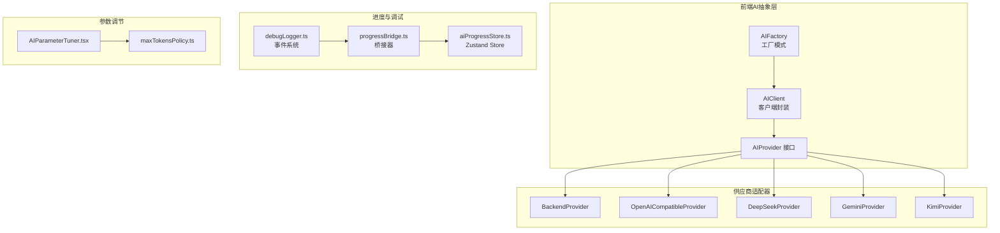
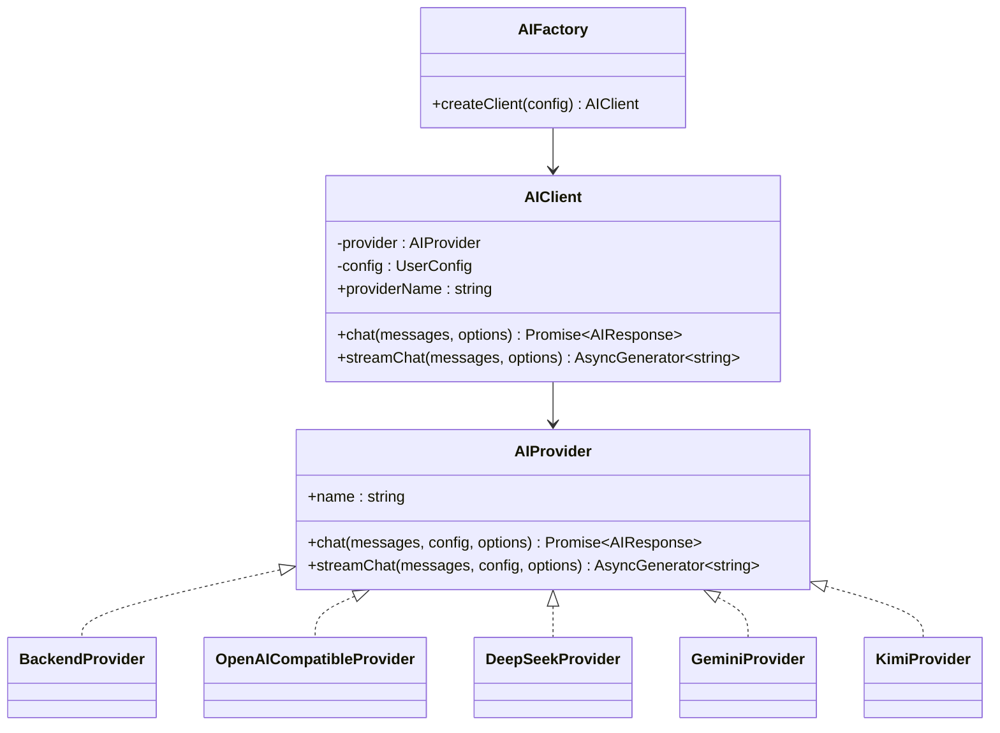
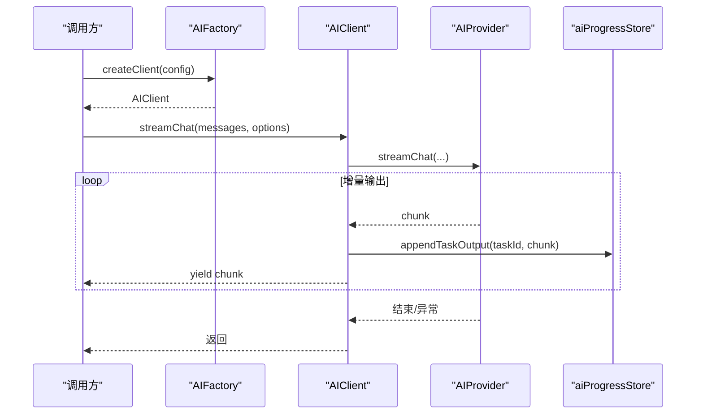
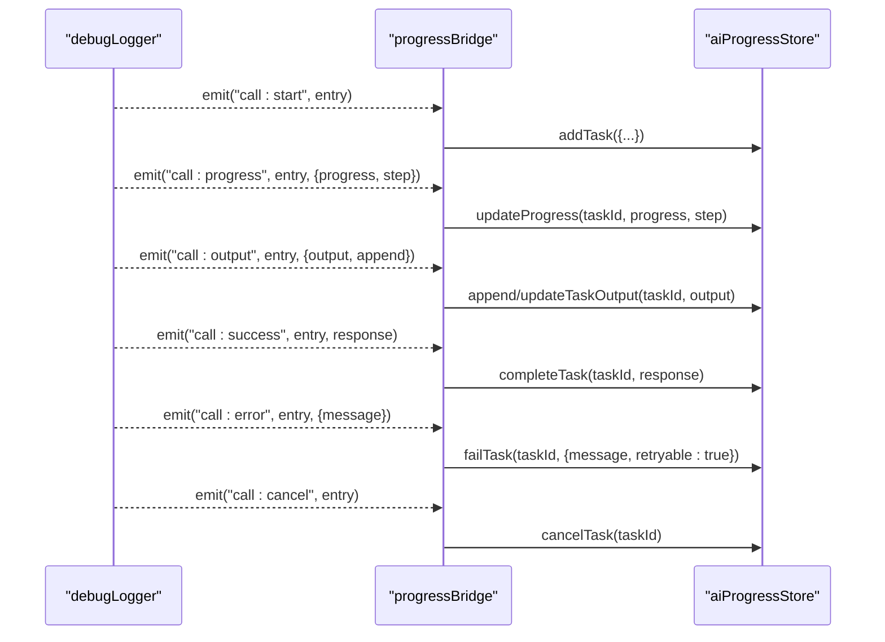
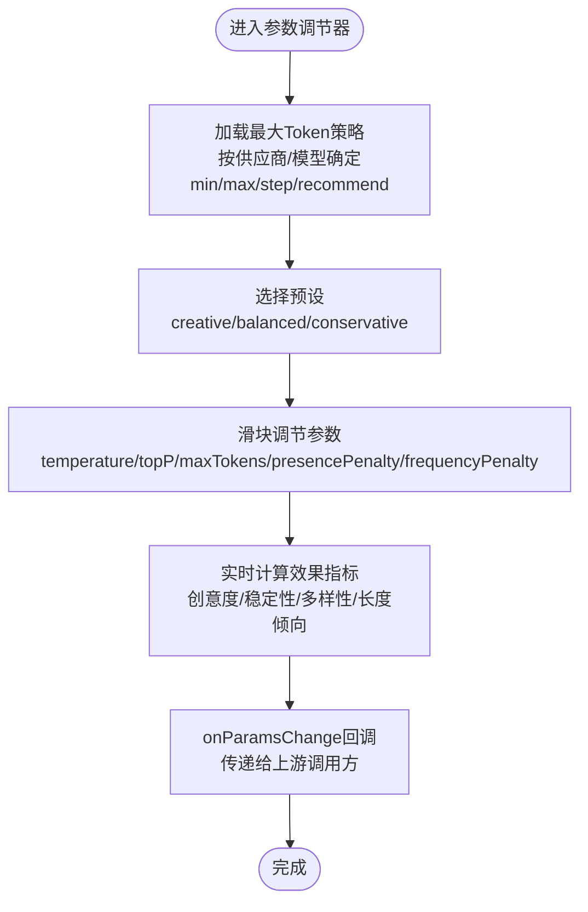
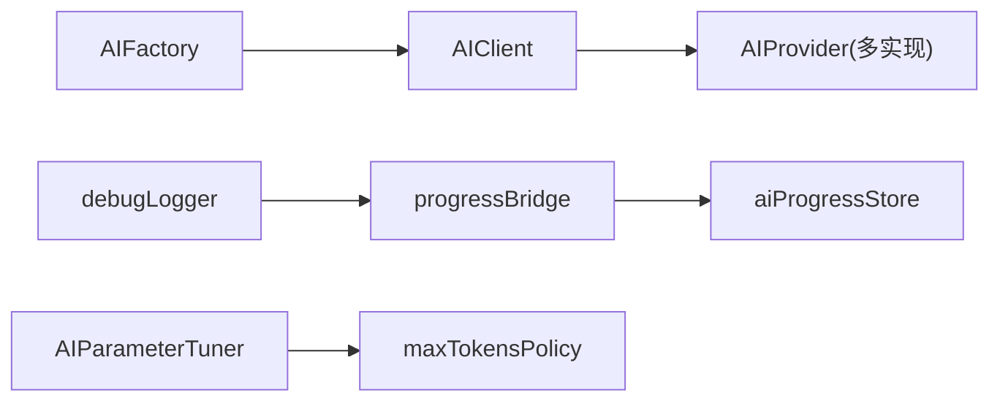

# AI集成

<cite>
**本文引用的文件**
- [apps/web/src/lib/ai/factory.ts](file://apps/web/src/lib/ai/factory.ts)
- [apps/web/src/lib/ai/types.ts](file://apps/web/src/lib/ai/types.ts)
- [apps/web/src/lib/ai/providers/backend.ts](file://apps/web/src/lib/ai/providers/backend.ts)
- [apps/web/src/lib/ai/providers/openai.ts](file://apps/web/src/lib/ai/providers/openai.ts)
- [apps/web/src/lib/ai/providers/deepseek.ts](file://apps/web/src/lib/ai/providers/deepseek.ts)
- [apps/web/src/lib/ai/providers/gemini.ts](file://apps/web/src/lib/ai/providers/gemini.ts)
- [apps/web/src/lib/ai/providers/kimi.ts](file://apps/web/src/lib/ai/providers/kimi.ts)
- [apps/web/src/lib/ai/progressBridge.ts](file://apps/web/src/lib/ai/progressBridge.ts)
- [apps/web/src/lib/ai/debugLogger.ts](file://apps/web/src/lib/ai/debugLogger.ts)
- [apps/web/src/stores/aiProgressStore.ts](file://apps/web/src/stores/aiProgressStore.ts)
- [apps/web/src/components/editor/AIParameterTuner.tsx](file://apps/web/src/components/editor/AIParameterTuner.tsx)
- [apps/web/src/lib/ai/maxTokensPolicy.ts](file://apps/web/src/lib/ai/maxTokensPolicy.ts)
- [apps/web/src/types/index.ts](file://apps/web/src/types/index.ts)
</cite>

## 目录

1. [简介](#简介)
2. [项目结构](#项目结构)
3. [核心组件](#核心组件)
4. [架构总览](#架构总览)
5. [详细组件分析](#详细组件分析)
6. [依赖关系分析](#依赖关系分析)
7. [性能考量](#性能考量)
8. [故障排查指南](#故障排查指南)
9. [结论](#结论)
10. [附录](#附录)

## 简介

本文件面向AIXSSS前端应用的AI集成功能，系统性阐述AI服务抽象层设计、多供应商支持实现模式、配置管理策略、请求参数标准化与响应处理机制、进度桥接器与实时追踪、AI参数调节器与动态配置、调用示例、错误处理与性能监控，并提供扩展指导。

## 项目结构

围绕AI集成的核心目录与文件如下：

- 抽象层与工厂：factory.ts、types.ts
- 供应商适配器：providers/backend.ts、openai.ts、deepseek.ts、gemini.ts、kimi.ts
- 调度与进度：progressBridge.ts、debugLogger.ts、aiProgressStore.ts
- 参数调节：AIParameterTuner.tsx、maxTokensPolicy.ts
- 类型定义：types/index.ts

图表来源

- [apps/web/src/lib/ai/factory.ts](file://apps/web/src/lib/ai/factory.ts#L1-L98)
- [apps/web/src/lib/ai/types.ts](file://apps/web/src/lib/ai/types.ts#L1-L30)
- [apps/web/src/lib/ai/providers/backend.ts](file://apps/web/src/lib/ai/providers/backend.ts#L1-L25)
- [apps/web/src/lib/ai/providers/openai.ts](file://apps/web/src/lib/ai/providers/openai.ts#L1-L384)
- [apps/web/src/lib/ai/providers/deepseek.ts](file://apps/web/src/lib/ai/providers/deepseek.ts#L1-L140)
- [apps/web/src/lib/ai/providers/gemini.ts](file://apps/web/src/lib/ai/providers/gemini.ts#L1-L172)
- [apps/web/src/lib/ai/providers/kimi.ts](file://apps/web/src/lib/ai/providers/kimi.ts#L1-L164)
- [apps/web/src/lib/ai/debugLogger.ts](file://apps/web/src/lib/ai/debugLogger.ts#L1-L624)
- [apps/web/src/lib/ai/progressBridge.ts](file://apps/web/src/lib/ai/progressBridge.ts#L1-L388)
- [apps/web/src/stores/aiProgressStore.ts](file://apps/web/src/stores/aiProgressStore.ts#L1-L758)
- [apps/web/src/components/editor/AIParameterTuner.tsx](file://apps/web/src/components/editor/AIParameterTuner.tsx#L1-L457)
- [apps/web/src/lib/ai/maxTokensPolicy.ts](file://apps/web/src/lib/ai/maxTokensPolicy.ts#L1-L63)

章节来源

- [apps/web/src/lib/ai/factory.ts](file://apps/web/src/lib/ai/factory.ts#L1-L98)
- [apps/web/src/lib/ai/types.ts](file://apps/web/src/lib/ai/types.ts#L1-L30)

## 核心组件

- AI服务抽象层与工厂
  - AIProvider接口定义统一的聊天与流式聊天方法，屏蔽供应商差异。
  - AIFactory根据运行模式（前端直连或后端代理）创建AIClient实例，内部委托具体AIProvider。
- 供应商适配器
  - BackendProvider：后端模式直连服务端LLM接口。
  - OpenAICompatibleProvider：统一封装Chat Completions与Responses API，自动降级与参数归一。
  - DeepSeekProvider、GeminiProvider、KimiProvider：分别适配各自API格式与认证方式。
- 调度与进度追踪
  - debugLogger：事件驱动的AI调用日志系统，支持start/success/error/progress/output/cancel事件。
  - progressBridge：将debugLogger事件映射到aiProgressStore，实现UI进度面板与实时输出。
  - aiProgressStore：Zustand状态管理，维护任务队列、进度、统计与事件订阅。
- 参数调节器
  - AIParameterTuner：提供温度、核采样、最大Token、惩罚项等参数的可视化调节与预设。
  - maxTokensPolicy：按供应商与模型给出最大Token策略，保障UI与实际限额一致。

章节来源

- [apps/web/src/lib/ai/types.ts](file://apps/web/src/lib/ai/types.ts#L17-L29)
- [apps/web/src/lib/ai/factory.ts](file://apps/web/src/lib/ai/factory.ts#L30-L97)
- [apps/web/src/lib/ai/providers/backend.ts](file://apps/web/src/lib/ai/providers/backend.ts#L5-L24)
- [apps/web/src/lib/ai/providers/openai.ts](file://apps/web/src/lib/ai/providers/openai.ts#L171-L384)
- [apps/web/src/lib/ai/providers/deepseek.ts](file://apps/web/src/lib/ai/providers/deepseek.ts#L4-L139)
- [apps/web/src/lib/ai/providers/gemini.ts](file://apps/web/src/lib/ai/providers/gemini.ts#L4-L171)
- [apps/web/src/lib/ai/providers/kimi.ts](file://apps/web/src/lib/ai/providers/kimi.ts#L6-L163)
- [apps/web/src/lib/ai/debugLogger.ts](file://apps/web/src/lib/ai/debugLogger.ts#L9-L77)
- [apps/web/src/lib/ai/progressBridge.ts](file://apps/web/src/lib/ai/progressBridge.ts#L66-L182)
- [apps/web/src/stores/aiProgressStore.ts](file://apps/web/src/stores/aiProgressStore.ts#L120-L211)
- [apps/web/src/components/editor/AIParameterTuner.tsx](file://apps/web/src/components/editor/AIParameterTuner.tsx#L30-L120)
- [apps/web/src/lib/ai/maxTokensPolicy.ts](file://apps/web/src/lib/ai/maxTokensPolicy.ts#L26-L57)

## 架构总览

AI集成采用“抽象层+工厂+适配器”的解耦架构，统一对外接口，屏蔽不同供应商的API差异；通过事件系统与进度桥接器实现统一的进度追踪与UI联动；参数调节器提供动态配置与效果预览。

图表来源

- [apps/web/src/lib/ai/types.ts](file://apps/web/src/lib/ai/types.ts#L17-L29)
- [apps/web/src/lib/ai/factory.ts](file://apps/web/src/lib/ai/factory.ts#L30-L97)
- [apps/web/src/lib/ai/providers/backend.ts](file://apps/web/src/lib/ai/providers/backend.ts#L5-L24)
- [apps/web/src/lib/ai/providers/openai.ts](file://apps/web/src/lib/ai/providers/openai.ts#L171-L384)
- [apps/web/src/lib/ai/providers/deepseek.ts](file://apps/web/src/lib/ai/providers/deepseek.ts#L4-L139)
- [apps/web/src/lib/ai/providers/gemini.ts](file://apps/web/src/lib/ai/providers/gemini.ts#L4-L171)
- [apps/web/src/lib/ai/providers/kimi.ts](file://apps/web/src/lib/ai/providers/kimi.ts#L6-L163)

## 详细组件分析

### AI服务抽象层与工厂模式

- 设计要点
  - AIProvider接口统一聊天与流式聊天方法，屏蔽供应商差异。
  - AIFactory.createClient根据运行模式选择BackendProvider或本地适配器，并进行配置校验。
  - AIClient封装具体调用，streamChat包装底层生成器，自动将增量输出写入进度Store，便于DevPanel实时监控。
- 关键流程
  - 前端直连：校验provider、apiKey、model，创建对应AIProvider。
  - 后端模式：校验aiProfileId，使用BackendProvider转发至服务端LLM接口。
- 错误处理
  - 流式异常时保留已接收的输出，便于调试与重试。

图表来源

- [apps/web/src/lib/ai/factory.ts](file://apps/web/src/lib/ai/factory.ts#L47-L74)
- [apps/web/src/stores/aiProgressStore.ts](file://apps/web/src/stores/aiProgressStore.ts#L480-L493)

章节来源

- [apps/web/src/lib/ai/factory.ts](file://apps/web/src/lib/ai/factory.ts#L30-L97)
- [apps/web/src/lib/ai/types.ts](file://apps/web/src/lib/ai/types.ts#L17-L29)

### 多供应商支持与适配器实现

- OpenAI兼容适配器
  - 自动选择Chat Completions或Responses API，依据模型特性与错误码进行智能降级。
  - 归一化usage字段，提取文本内容，支持推理强度（reasoning.effort）参数。
- DeepSeek/Gemini/Kimi
  - 统一消息格式转换与认证方式，分别适配其API路径与参数命名。
- 后端适配器
  - 在前端直连不可用时，通过aiProfileId走服务端代理，简化前端安全与配置管理。

章节来源

- [apps/web/src/lib/ai/providers/openai.ts](file://apps/web/src/lib/ai/providers/openai.ts#L171-L384)
- [apps/web/src/lib/ai/providers/deepseek.ts](file://apps/web/src/lib/ai/providers/deepseek.ts#L4-L139)
- [apps/web/src/lib/ai/providers/gemini.ts](file://apps/web/src/lib/ai/providers/gemini.ts#L4-L171)
- [apps/web/src/lib/ai/providers/kimi.ts](file://apps/web/src/lib/ai/providers/kimi.ts#L6-L163)
- [apps/web/src/lib/ai/providers/backend.ts](file://apps/web/src/lib/ai/providers/backend.ts#L5-L24)

### 请求参数标准化与响应处理

- 参数标准化
  - temperature/topP/maxTokens/presencePenalty/frequencyPenalty等参数在适配器层统一映射。
  - 不同供应商的参数命名差异（如max_tokens/max_output_tokens）在适配器内处理。
- 响应处理
  - 统一AIResponse结构，包含content与tokenUsage（prompt、completion、total）。
  - OpenAI Responses API的多片段输出合并为单一文本，usage字段兼容旧字段。

章节来源

- [apps/web/src/lib/ai/providers/openai.ts](file://apps/web/src/lib/ai/providers/openai.ts#L171-L384)
- [apps/web/src/lib/ai/types.ts](file://apps/web/src/lib/ai/types.ts#L1-L9)

### 进度桥接器与实时追踪

- 事件系统
  - debugLogger提供call:start/success/error/progress/output/cancel事件，支持订阅与发射。
- 桥接机制
  - progressBridge订阅debugLogger事件，将调用生命周期映射到aiProgressStore的任务状态、进度与输出。
  - 支持手动创建任务（createProgressTask），用于非事件触发的调用。
- UI联动
  - aiProgressStore维护任务列表、统计、过滤与事件监听，配合DevPanel实时显示流式输出。

图表来源

- [apps/web/src/lib/ai/debugLogger.ts](file://apps/web/src/lib/ai/debugLogger.ts#L37-L77)
- [apps/web/src/lib/ai/progressBridge.ts](file://apps/web/src/lib/ai/progressBridge.ts#L66-L182)
- [apps/web/src/stores/aiProgressStore.ts](file://apps/web/src/stores/aiProgressStore.ts#L284-L433)

章节来源

- [apps/web/src/lib/ai/debugLogger.ts](file://apps/web/src/lib/ai/debugLogger.ts#L9-L77)
- [apps/web/src/lib/ai/progressBridge.ts](file://apps/web/src/lib/ai/progressBridge.ts#L66-L182)
- [apps/web/src/stores/aiProgressStore.ts](file://apps/web/src/stores/aiProgressStore.ts#L120-L211)

### AI参数调节器与动态配置

- 预设模板
  - 提供“创意/平衡/保守”三档预设，自动计算maxTokens并约束范围。
- 动态调节
  - 支持温度、核采样、最大Token、惩罚项等参数滑块调节，实时预览效果指标（创意度/稳定性/多样性/长度倾向）。
- 供应商差异
  - 针对doubao-ark等不支持的参数（如presence_penalty/frequency_penalty）自动隐藏或忽略。
  - 对OpenAI-Compatible模型支持reasoning.effort参数（如GPT-5/O系列）。

图表来源

- [apps/web/src/components/editor/AIParameterTuner.tsx](file://apps/web/src/components/editor/AIParameterTuner.tsx#L42-L120)
- [apps/web/src/lib/ai/maxTokensPolicy.ts](file://apps/web/src/lib/ai/maxTokensPolicy.ts#L26-L57)

章节来源

- [apps/web/src/components/editor/AIParameterTuner.tsx](file://apps/web/src/components/editor/AIParameterTuner.tsx#L30-L120)
- [apps/web/src/lib/ai/maxTokensPolicy.ts](file://apps/web/src/lib/ai/maxTokensPolicy.ts#L26-L57)

### 配置管理策略

- 前端直连模式
  - 校验provider、apiKey、model完整性，创建对应AIProvider。
- 后端代理模式
  - 校验aiProfileId，使用BackendProvider，前端不持有apiKey，降低泄露风险。
- 多配置档案
  - 支持多Profile管理与连接测试，记录HTTP状态、耗时与建议。

章节来源

- [apps/web/src/lib/ai/factory.ts](file://apps/web/src/lib/ai/factory.ts#L77-L97)
- [apps/web/src/lib/ai/providers/backend.ts](file://apps/web/src/lib/ai/providers/backend.ts#L8-L14)
- [apps/web/src/types/index.ts](file://apps/web/src/types/index.ts#L644-L710)

## 依赖关系分析

- 组件耦合
  - AIFactory与AIClient依赖AIProvider接口，通过工厂注入具体适配器，保持高层与底层解耦。
  - progressBridge依赖debugLogger事件与aiProgressStore，形成“事件→状态”的单向依赖。
- 外部依赖
  - 供应商API（OpenAI、DeepSeek、Gemini、Kimi、Moonshot）与服务端LLM接口。
  - Zustand用于状态持久化与事件分发。

图表来源

- [apps/web/src/lib/ai/factory.ts](file://apps/web/src/lib/ai/factory.ts#L77-L97)
- [apps/web/src/lib/ai/progressBridge.ts](file://apps/web/src/lib/ai/progressBridge.ts#L66-L182)
- [apps/web/src/stores/aiProgressStore.ts](file://apps/web/src/stores/aiProgressStore.ts#L120-L211)
- [apps/web/src/components/editor/AIParameterTuner.tsx](file://apps/web/src/components/editor/AIParameterTuner.tsx#L42-L49)
- [apps/web/src/lib/ai/maxTokensPolicy.ts](file://apps/web/src/lib/ai/maxTokensPolicy.ts#L26-L57)

章节来源

- [apps/web/src/lib/ai/factory.ts](file://apps/web/src/lib/ai/factory.ts#L1-L98)
- [apps/web/src/lib/ai/progressBridge.ts](file://apps/web/src/lib/ai/progressBridge.ts#L66-L182)
- [apps/web/src/stores/aiProgressStore.ts](file://apps/web/src/stores/aiProgressStore.ts#L120-L211)
- [apps/web/src/components/editor/AIParameterTuner.tsx](file://apps/web/src/components/editor/AIParameterTuner.tsx#L42-L49)
- [apps/web/src/lib/ai/maxTokensPolicy.ts](file://apps/web/src/lib/ai/maxTokensPolicy.ts#L26-L57)

## 性能考量

- Token使用与成本估算
  - aiProgressStore统计totalTokensUsed并估算成本（按每1K tokens单价），辅助预算控制。
- 响应时间与吞吐
  - 通过任务startedAt/completedAt计算平均响应时间，结合队列暂停/恢复策略提升吞吐。
- 参数优化
  - AIParameterTuner提供预设与效果指标，帮助在质量与成本之间权衡。
- 流式输出
  - streamChat增量写入Store，降低一次性渲染压力，改善用户体验。

章节来源

- [apps/web/src/stores/aiProgressStore.ts](file://apps/web/src/stores/aiProgressStore.ts#L219-L247)
- [apps/web/src/components/editor/AIParameterTuner.tsx](file://apps/web/src/components/editor/AIParameterTuner.tsx#L438-L457)

## 故障排查指南

- 常见错误与定位
  - API错误：debugLogger记录error与响应体，progressBridge将其映射为任务错误并保留rawOutput，便于回溯。
  - 超时/网络：fallback检测机制识别超时/网络/解析/API错误，触发降级通知并生成告警任务。
  - 参数不兼容：OpenAI Responses API降级回Chat Completions，或忽略不支持参数（如豆包的惩罚项）。
- 调试工具
  - debugLogger提供导出日志、统计摘要、最近错误与优化建议。
  - aiProgressStore提供面板显示/隐藏、任务过滤与事件订阅，便于开发调试。

章节来源

- [apps/web/src/lib/ai/debugLogger.ts](file://apps/web/src/lib/ai/debugLogger.ts#L401-L433)
- [apps/web/src/lib/ai/progressBridge.ts](file://apps/web/src/lib/ai/progressBridge.ts#L266-L322)
- [apps/web/src/stores/aiProgressStore.ts](file://apps/web/src/stores/aiProgressStore.ts#L642-L677)

## 结论

AIXSSS前端AI集成功能通过抽象层+工厂+适配器实现多供应商解耦，借助事件系统与进度桥接器统一追踪与UI联动，配合参数调节器与策略化的最大Token管理，既保证易用性又兼顾性能与安全性。后端代理模式进一步降低前端配置复杂度与安全风险。整体架构具备良好的扩展性，便于后续新增供应商与功能迭代。

## 附录

### AI服务调用示例（步骤说明）

- 前端直连
  - 使用AIFactory.createClient创建客户端，传入provider、apiKey、model与generationParams。
  - 调用chat或streamChat，流式输出将自动写入进度Store。
- 后端代理
  - 使用aiProfileId创建客户端，调用与直连一致，实际请求由服务端LLM接口处理。
- 参数调节
  - 在AIParameterTuner中选择预设或滑块调节，onParamsChange回调将参数传递给上游调用方。

章节来源

- [apps/web/src/lib/ai/factory.ts](file://apps/web/src/lib/ai/factory.ts#L77-L97)
- [apps/web/src/components/editor/AIParameterTuner.tsx](file://apps/web/src/components/editor/AIParameterTuner.tsx#L90-L120)

### 错误处理策略

- 事件驱动错误上报：debugLogger在updateLogWithError中发射call:error事件。
- 进度桥接错误映射：progressBridge将错误信息写入任务并标记retryable。
- 降级通知：notifyAIFallback记录降级原因与目标，生成告警任务并在控制台输出。

章节来源

- [apps/web/src/lib/ai/debugLogger.ts](file://apps/web/src/lib/ai/debugLogger.ts#L401-L415)
- [apps/web/src/lib/ai/progressBridge.ts](file://apps/web/src/lib/ai/progressBridge.ts#L114-L127)
- [apps/web/src/lib/ai/progressBridge.ts](file://apps/web/src/lib/ai/progressBridge.ts#L266-L322)

### 性能监控方案

- 统计指标：总调用次数、成功/失败次数、平均响应时间、总Token用量、成本估算。
- 事件订阅：通过aiProgressStore.subscribe监听任务状态变更，实现自定义监控。
- 日志导出：debugLogger.export导出历史日志，便于离线分析与回归对比。

章节来源

- [apps/web/src/stores/aiProgressStore.ts](file://apps/web/src/stores/aiProgressStore.ts#L219-L247)
- [apps/web/src/stores/aiProgressStore.ts](file://apps/web/src/stores/aiProgressStore.ts#L648-L677)
- [apps/web/src/lib/ai/debugLogger.ts](file://apps/web/src/lib/ai/debugLogger.ts#L479-L481)
