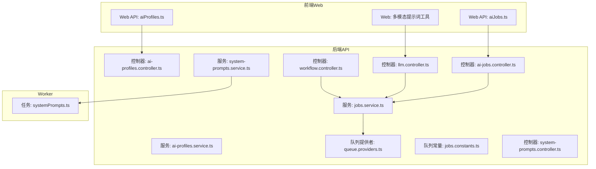
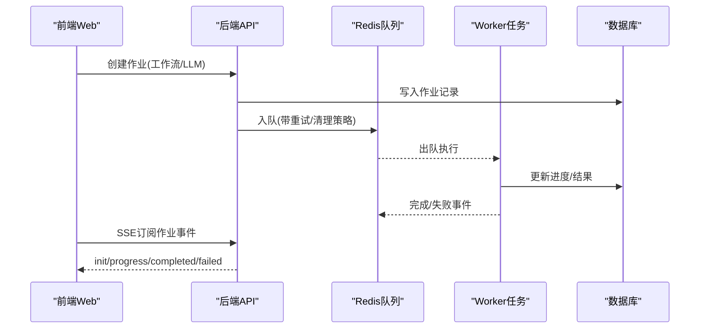
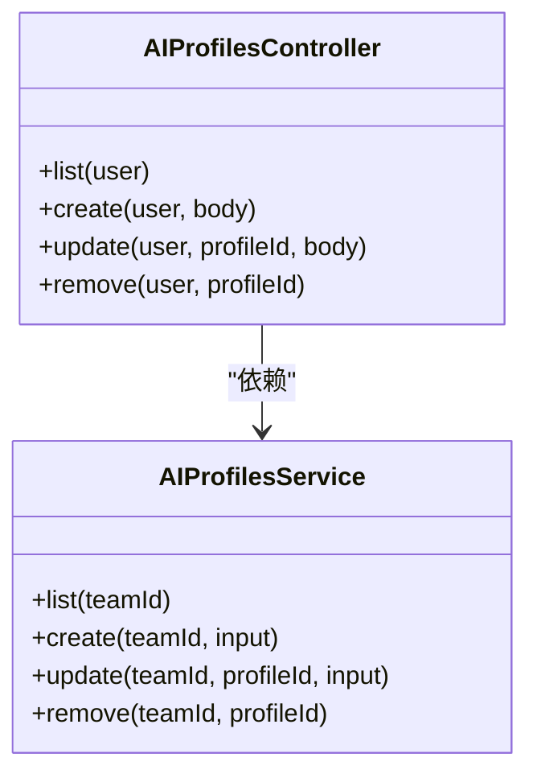
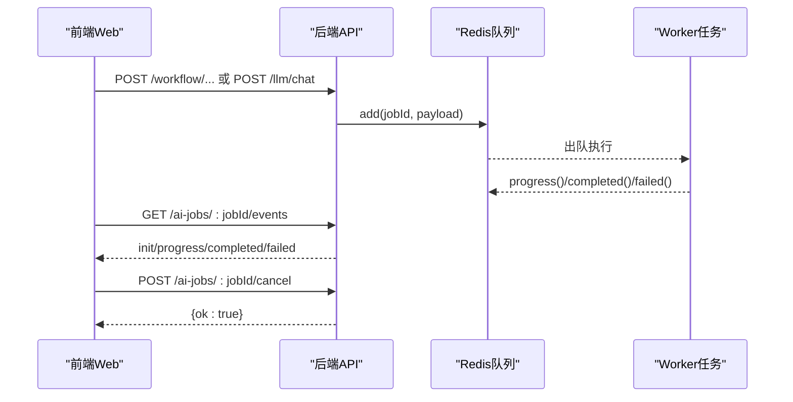
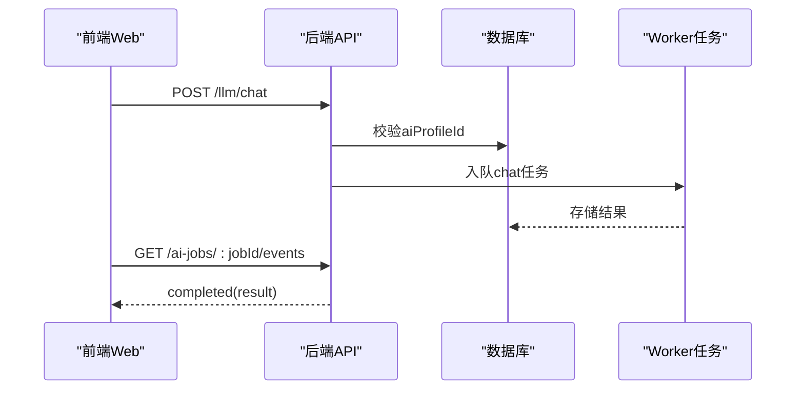
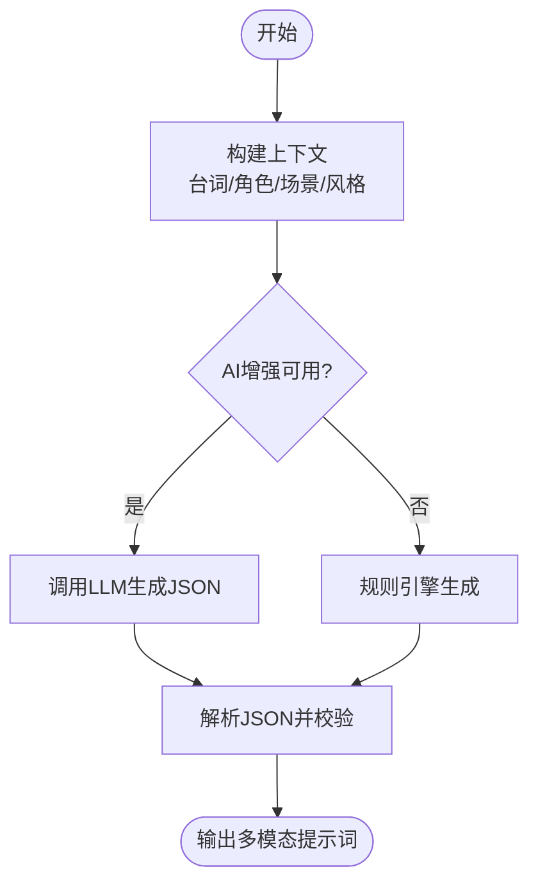
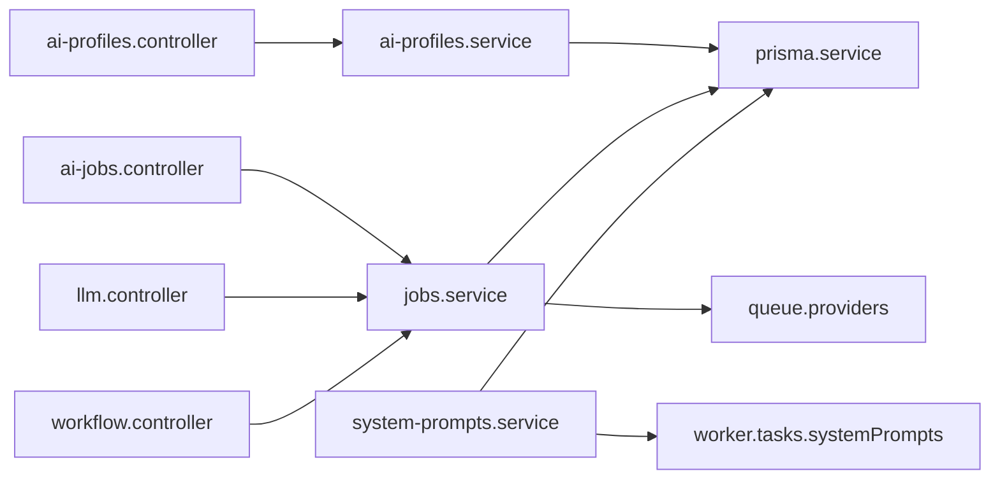

# AI集成API

<cite>
**本文引用的文件**   
- [apps/api/src/ai-profiles/ai-profiles.controller.ts](file://apps/api/src/ai-profiles/ai-profiles.controller.ts)
- [apps/api/src/ai-profiles/ai-profiles.service.ts](file://apps/api/src/ai-profiles/ai-profiles.service.ts)
- [packages/shared/src/schemas/aiProfile.ts](file://packages/shared/src/schemas/aiProfile.ts)
- [apps/api/src/jobs/ai-jobs.controller.ts](file://apps/api/src/jobs/ai-jobs.controller.ts)
- [apps/api/src/jobs/jobs.service.ts](file://apps/api/src/jobs/jobs.service.ts)
- [apps/api/src/jobs/llm.controller.ts](file://apps/api/src/jobs/llm.controller.ts)
- [apps/api/src/jobs/workflow.controller.ts](file://apps/api/src/jobs/workflow.controller.ts)
- [apps/api/src/jobs/queue.providers.ts](file://apps/api/src/jobs/queue.providers.ts)
- [apps/api/src/jobs/jobs.constants.ts](file://apps/api/src/jobs/jobs.constants.ts)
- [apps/api/src/system-prompts/system-prompts.controller.ts](file://apps/api/src/system-prompts/system-prompts.controller.ts)
- [apps/api/src/system-prompts/system-prompts.service.ts](file://apps/api/src/system-prompts/system-prompts.service.ts)
- [apps/worker/src/tasks/systemPrompts.ts](file://apps/worker/src/tasks/systemPrompts.ts)
- [apps/web/src/lib/api/aiProfiles.ts](file://apps/web/src/lib/api/aiProfiles.ts)
- [apps/web/src/lib/api/aiJobs.ts](file://apps/web/src/lib/api/aiJobs.ts)
- [apps/web/src/lib/ai/multiModalPrompts.ts](file://apps/web/src/lib/ai/multiModalPrompts.ts)
</cite>

## 目录

1. [简介](#简介)
2. [项目结构](#项目结构)
3. [核心组件](#核心组件)
4. [架构总览](#架构总览)
5. [组件详解](#组件详解)
6. [依赖关系分析](#依赖关系分析)
7. [性能考量](#性能考量)
8. [故障排查指南](#故障排查指南)
9. [结论](#结论)
10. [附录](#附录)

## 简介

本文件面向AIXSSS前端应用的AI集成API，系统性阐述以下能力与流程：

- AI作业创建、状态查询与结果获取的完整生命周期
- AI配置档案（供应商、模型、参数、计价）的管理
- LLM对话接口与系统提示词管理
- 多模态内容生成（音频/配音、BGM与音效、分镜转场）的规则与AI增强
- AI作业队列、进度追踪与错误处理机制
- 完整API示例、参数说明与使用场景
- 配置指南与性能优化建议

## 项目结构

围绕AI集成的关键目录与文件如下：

- 后端API层：AI配置档案、作业队列、工作流编排、LLM对话、系统提示词
- Worker层：系统提示词加载、具体AI任务执行
- 前端Web层：API封装、进度轮询、多模态提示词工具

**图表来源**

- [apps/web/src/lib/api/aiProfiles.ts](file://apps/web/src/lib/api/aiProfiles.ts#L1-L63)
- [apps/web/src/lib/api/aiJobs.ts](file://apps/web/src/lib/api/aiJobs.ts#L1-L138)
- [apps/web/src/lib/ai/multiModalPrompts.ts](file://apps/web/src/lib/ai/multiModalPrompts.ts#L1-L636)
- [apps/api/src/ai-profiles/ai-profiles.controller.ts](file://apps/api/src/ai-profiles/ai-profiles.controller.ts#L1-L38)
- [apps/api/src/ai-profiles/ai-profiles.service.ts](file://apps/api/src/ai-profiles/ai-profiles.service.ts#L1-L202)
- [apps/api/src/jobs/ai-jobs.controller.ts](file://apps/api/src/jobs/ai-jobs.controller.ts#L1-L69)
- [apps/api/src/jobs/jobs.service.ts](file://apps/api/src/jobs/jobs.service.ts#L1-L1055)
- [apps/api/src/jobs/llm.controller.ts](file://apps/api/src/jobs/llm.controller.ts#L1-L75)
- [apps/api/src/jobs/workflow.controller.ts](file://apps/api/src/jobs/workflow.controller.ts#L1-L266)
- [apps/api/src/jobs/queue.providers.ts](file://apps/api/src/jobs/queue.providers.ts#L1-L39)
- [apps/api/src/jobs/jobs.constants.ts](file://apps/api/src/jobs/jobs.constants.ts#L1-L5)
- [apps/api/src/system-prompts/system-prompts.controller.ts](file://apps/api/src/system-prompts/system-prompts.controller.ts#L1-L26)
- [apps/api/src/system-prompts/system-prompts.service.ts](file://apps/api/src/system-prompts/system-prompts.service.ts#L1-L85)
- [apps/worker/src/tasks/systemPrompts.ts](file://apps/worker/src/tasks/systemPrompts.ts#L1-L27)

**章节来源**

- [apps/api/src/ai-profiles/ai-profiles.controller.ts](file://apps/api/src/ai-profiles/ai-profiles.controller.ts#L1-L38)
- [apps/api/src/jobs/ai-jobs.controller.ts](file://apps/api/src/jobs/ai-jobs.controller.ts#L1-L69)
- [apps/api/src/jobs/workflow.controller.ts](file://apps/api/src/jobs/workflow.controller.ts#L1-L266)
- [apps/api/src/jobs/llm.controller.ts](file://apps/api/src/jobs/llm.controller.ts#L1-L75)
- [apps/api/src/system-prompts/system-prompts.controller.ts](file://apps/api/src/system-prompts/system-prompts.controller.ts#L1-L26)
- [apps/api/src/system-prompts/system-prompts.service.ts](file://apps/api/src/system-prompts/system-prompts.service.ts#L1-L85)
- [apps/api/src/jobs/queue.providers.ts](file://apps/api/src/jobs/queue.providers.ts#L1-L39)
- [apps/api/src/jobs/jobs.constants.ts](file://apps/api/src/jobs/jobs.constants.ts#L1-L5)
- [apps/web/src/lib/api/aiProfiles.ts](file://apps/web/src/lib/api/aiProfiles.ts#L1-L63)
- [apps/web/src/lib/api/aiJobs.ts](file://apps/web/src/lib/api/aiJobs.ts#L1-L138)
- [apps/web/src/lib/ai/multiModalPrompts.ts](file://apps/web/src/lib/ai/multiModalPrompts.ts#L1-L636)

## 核心组件

- AI配置档案管理
  - 控制器负责鉴权与输入校验，服务层完成加密存储、规范化与数据库操作
  - 支持多种供应商（含自定义兼容），模型与基础URL可配置，支持generationParams与pricing
- AI作业队列与工作流
  - 通过Redis队列实现异步执行，支持多阶段工作流（剧集规划、因果链、场景生成、分镜、视频等）
  - SSE事件流推送进度、完成与失败状态
- LLM对话接口
  - 支持普通聊天与结构化响应测试，支持参数覆盖
- 系统提示词管理
  - 团队级默认提示词与自定义覆盖，按key读取
- 多模态提示词生成
  - 规则引擎与AI增强双路径，支持音频/配音、BGM与音效、转场指令

**章节来源**

- [apps/api/src/ai-profiles/ai-profiles.controller.ts](file://apps/api/src/ai-profiles/ai-profiles.controller.ts#L1-L38)
- [apps/api/src/ai-profiles/ai-profiles.service.ts](file://apps/api/src/ai-profiles/ai-profiles.service.ts#L1-L202)
- [apps/api/src/jobs/ai-jobs.controller.ts](file://apps/api/src/jobs/ai-jobs.controller.ts#L1-L69)
- [apps/api/src/jobs/jobs.service.ts](file://apps/api/src/jobs/jobs.service.ts#L1-L1055)
- [apps/api/src/jobs/llm.controller.ts](file://apps/api/src/jobs/llm.controller.ts#L1-L75)
- [apps/api/src/system-prompts/system-prompts.controller.ts](file://apps/api/src/system-prompts/system-prompts.controller.ts#L1-L26)
- [apps/api/src/system-prompts/system-prompts.service.ts](file://apps/api/src/system-prompts/system-prompts.service.ts#L1-L85)
- [apps/web/src/lib/ai/multiModalPrompts.ts](file://apps/web/src/lib/ai/multiModalPrompts.ts#L1-L636)

## 架构总览

整体采用“前端Web → 后端API → Redis队列 → Worker任务”的解耦架构。前端通过REST与SSE消费作业状态，后端通过Zod进行输入校验，服务层统一调度队列与数据库。

**图表来源**

- [apps/api/src/jobs/ai-jobs.controller.ts](file://apps/api/src/jobs/ai-jobs.controller.ts#L33-L65)
- [apps/api/src/jobs/jobs.service.ts](file://apps/api/src/jobs/jobs.service.ts#L88-L99)
- [apps/api/src/jobs/queue.providers.ts](file://apps/api/src/jobs/queue.providers.ts#L17-L36)
- [apps/api/src/jobs/jobs.constants.ts](file://apps/api/src/jobs/jobs.constants.ts#L1-L5)

## 组件详解

### AI配置档案管理

- 功能要点
  - 列表、创建、更新、删除团队级AI配置档案
  - API Key加密存储，模型/接入点规范化，特定供应商参数兼容
  - generationParams按供应商做字段裁剪与模型名称标准化
- 关键接口
  - GET /ai-profiles
  - POST /ai-profiles
  - PATCH /ai-profiles/:profileId
  - DELETE /ai-profiles/:profileId
- 输入/输出约束
  - 使用共享Schema进行输入校验与类型约束
  - 输出包含供应商、模型、基础URL、生成参数、计价信息及时间戳

**图表来源**

- [apps/api/src/ai-profiles/ai-profiles.controller.ts](file://apps/api/src/ai-profiles/ai-profiles.controller.ts#L1-L38)
- [apps/api/src/ai-profiles/ai-profiles.service.ts](file://apps/api/src/ai-profiles/ai-profiles.service.ts#L74-L202)

**章节来源**

- [apps/api/src/ai-profiles/ai-profiles.controller.ts](file://apps/api/src/ai-profiles/ai-profiles.controller.ts#L1-L38)
- [apps/api/src/ai-profiles/ai-profiles.service.ts](file://apps/api/src/ai-profiles/ai-profiles.service.ts#L1-L202)
- [packages/shared/src/schemas/aiProfile.ts](file://packages/shared/src/schemas/aiProfile.ts#L1-L51)
- [apps/web/src/lib/api/aiProfiles.ts](file://apps/web/src/lib/api/aiProfiles.ts#L1-L63)

### AI作业队列与工作流

- 作业生命周期
  - 创建：写入作业记录，入队，设置重试与清理策略
  - 执行：Worker从队列取出任务，逐步更新进度与结果
  - 查询：支持按ID查询与SSE事件流订阅
  - 取消：支持取消未完成作业
- 工作流编排
  - 支持剧集规划、因果链构建、核心表达生成、场景列表生成、锚点生成、关键帧提示、分镜计划/组、翻译与回译、关键帧图像、视频生成、运动提示、对白生成、全场景精炼等
- 错误处理
  - 作业失败/取消状态通过SSE返回，前端可选择在中断时自动取消

**图表来源**

- [apps/api/src/jobs/workflow.controller.ts](file://apps/api/src/jobs/workflow.controller.ts#L49-L266)
- [apps/api/src/jobs/llm.controller.ts](file://apps/api/src/jobs/llm.controller.ts#L55-L71)
- [apps/api/src/jobs/ai-jobs.controller.ts](file://apps/api/src/jobs/ai-jobs.controller.ts#L23-L65)
- [apps/api/src/jobs/jobs.service.ts](file://apps/api/src/jobs/jobs.service.ts#L101-L149)

**章节来源**

- [apps/api/src/jobs/ai-jobs.controller.ts](file://apps/api/src/jobs/ai-jobs.controller.ts#L1-L69)
- [apps/api/src/jobs/jobs.service.ts](file://apps/api/src/jobs/jobs.service.ts#L1-L1055)
- [apps/api/src/jobs/workflow.controller.ts](file://apps/api/src/jobs/workflow.controller.ts#L1-L266)
- [apps/api/src/jobs/llm.controller.ts](file://apps/api/src/jobs/llm.controller.ts#L1-L75)
- [apps/api/src/jobs/queue.providers.ts](file://apps/api/src/jobs/queue.providers.ts#L1-L39)
- [apps/api/src/jobs/jobs.constants.ts](file://apps/api/src/jobs/jobs.constants.ts#L1-L5)
- [apps/web/src/lib/api/aiJobs.ts](file://apps/web/src/lib/api/aiJobs.ts#L1-L138)

### LLM对话接口与系统提示词

- LLM对话
  - chat：标准消息数组（system/user/assistant），限制长度与单条长度
  - structured-test：支持JSON对象或JSON Schema响应格式，允许覆盖温度、采样、最大tokens、惩罚项与推理强度
- 系统提示词
  - 列表：按key返回默认或自定义内容
  - 更新：按key写入自定义内容，区分是否自定义

**图表来源**

- [apps/api/src/jobs/llm.controller.ts](file://apps/api/src/jobs/llm.controller.ts#L9-L71)
- [apps/api/src/system-prompts/system-prompts.controller.ts](file://apps/api/src/system-prompts/system-prompts.controller.ts#L14-L23)
- [apps/api/src/system-prompts/system-prompts.service.ts](file://apps/api/src/system-prompts/system-prompts.service.ts#L30-L83)
- [apps/worker/src/tasks/systemPrompts.ts](file://apps/worker/src/tasks/systemPrompts.ts#L4-L26)

**章节来源**

- [apps/api/src/jobs/llm.controller.ts](file://apps/api/src/jobs/llm.controller.ts#L1-L75)
- [apps/api/src/system-prompts/system-prompts.controller.ts](file://apps/api/src/system-prompts/system-prompts.controller.ts#L1-L26)
- [apps/api/src/system-prompts/system-prompts.service.ts](file://apps/api/src/system-prompts/system-prompts.service.ts#L1-L85)
- [apps/worker/src/tasks/systemPrompts.ts](file://apps/worker/src/tasks/systemPrompts.ts#L1-L27)

### 多模态内容生成

- 能力范围
  - 音频/配音提示词：语调、情绪、声线风格
  - BGM与音效提示词：氛围、风格、乐器、节奏、音效
  - 分镜转场指令：类型、时长、方向、缓动
- 实现方式
  - 规则引擎：基于关键词与映射的快速生成
  - AI增强：以系统提示词模板驱动，失败时回退规则引擎
  - 技能定义：每类生成对应Skill，限定上下文与输出格式

**图表来源**

- [apps/web/src/lib/ai/multiModalPrompts.ts](file://apps/web/src/lib/ai/multiModalPrompts.ts#L522-L635)

**章节来源**

- [apps/web/src/lib/ai/multiModalPrompts.ts](file://apps/web/src/lib/ai/multiModalPrompts.ts#L1-L636)

## 依赖关系分析

- 组件耦合
  - 控制器仅负责鉴权、参数解析与路由转发，业务逻辑集中在服务层
  - 服务层依赖Prisma访问数据库，并通过队列提供者连接Redis
- 外部依赖
  - Redis队列（BullMQ）承载作业调度与事件通知
  - 数据库（Prisma）持久化作业、配置与系统提示词
- 循环依赖
  - 未见循环依赖迹象，职责清晰分离

**图表来源**

- [apps/api/src/ai-profiles/ai-profiles.controller.ts](file://apps/api/src/ai-profiles/ai-profiles.controller.ts#L1-L38)
- [apps/api/src/ai-profiles/ai-profiles.service.ts](file://apps/api/src/ai-profiles/ai-profiles.service.ts#L1-L202)
- [apps/api/src/jobs/ai-jobs.controller.ts](file://apps/api/src/jobs/ai-jobs.controller.ts#L1-L69)
- [apps/api/src/jobs/jobs.service.ts](file://apps/api/src/jobs/jobs.service.ts#L1-L1055)
- [apps/api/src/jobs/llm.controller.ts](file://apps/api/src/jobs/llm.controller.ts#L1-L75)
- [apps/api/src/jobs/workflow.controller.ts](file://apps/api/src/jobs/workflow.controller.ts#L1-L266)
- [apps/api/src/system-prompts/system-prompts.service.ts](file://apps/api/src/system-prompts/system-prompts.service.ts#L1-L85)
- [apps/api/src/jobs/queue.providers.ts](file://apps/api/src/jobs/queue.providers.ts#L1-L39)
- [apps/worker/src/tasks/systemPrompts.ts](file://apps/worker/src/tasks/systemPrompts.ts#L1-L27)

**章节来源**

- [apps/api/src/jobs/queue.providers.ts](file://apps/api/src/jobs/queue.providers.ts#L1-L39)
- [apps/api/src/jobs/jobs.constants.ts](file://apps/api/src/jobs/jobs.constants.ts#L1-L5)

## 性能考量

- 队列与重试
  - 为关键作业配置指数退避与最大重试次数，避免瞬时失败放大
  - 设置完成/失败作业清理数量，控制历史堆积
- 轮询与中断
  - 前端等待作业完成时支持AbortSignal，中断时可自动取消作业
  - 合理设置轮询间隔与超时，平衡实时性与资源消耗
- 参数与成本
  - generationParams中合理设置temperature/topP/maxTokens，避免过度消耗
  - 计价信息可用于成本估算与预算控制

[本节为通用建议，无需特定文件引用]

## 故障排查指南

- 常见问题
  - 作业状态长期为queued：检查Redis连接、队列名称与Worker进程
  - 作业失败：查看SSE事件中的failedReason，结合后端日志定位
  - 作业被取消：确认前端是否在中断时触发了取消请求
- 建议步骤
  - 使用GET /ai-jobs/:jobId获取当前状态与错误信息
  - 通过SSE /ai-jobs/:jobId/events观察progress/completed/failed
  - 在前端调用取消接口清理未完成作业

**章节来源**

- [apps/api/src/jobs/ai-jobs.controller.ts](file://apps/api/src/jobs/ai-jobs.controller.ts#L33-L65)
- [apps/web/src/lib/api/aiJobs.ts](file://apps/web/src/lib/api/aiJobs.ts#L64-L137)

## 结论

本API体系以“配置即服务 + 队列即执行 + 提示词即规范”为核心，既保证了灵活性（多供应商、多参数、多模态），又确保了稳定性（SSE事件、重试与清理、错误回退）。通过前端统一的等待与取消机制，用户可在复杂工作流中获得一致的体验。

[本节为总结性内容，无需特定文件引用]

## 附录

### API一览与使用场景

- AI配置档案
  - 列表：获取团队可用的供应商与模型配置
  - 创建：新增配置，填写供应商、模型、API Key、可选基础URL与生成参数
  - 更新：修改配置或清空计价信息
  - 删除：移除不再使用的配置
- 作业与工作流
  - 通过工作流控制器提交各类生成任务（剧集规划、场景生成、分镜、视频等）
  - 使用SSE订阅进度，完成后获取结果
  - 支持取消未完成作业
- LLM对话
  - chat：发送消息数组，适用于通用对话
  - structured-test：要求结构化输出，便于自动化处理
- 系统提示词
  - 列表：获取默认或自定义提示词
  - 更新：按key覆盖团队级提示词

**章节来源**

- [apps/api/src/ai-profiles/ai-profiles.controller.ts](file://apps/api/src/ai-profiles/ai-profiles.controller.ts#L1-L38)
- [apps/api/src/jobs/workflow.controller.ts](file://apps/api/src/jobs/workflow.controller.ts#L49-L266)
- [apps/api/src/jobs/llm.controller.ts](file://apps/api/src/jobs/llm.controller.ts#L55-L71)
- [apps/api/src/system-prompts/system-prompts.controller.ts](file://apps/api/src/system-prompts/system-prompts.controller.ts#L14-L23)

### 参数说明与最佳实践

- AI配置档案
  - provider：供应商枚举，支持自定义兼容
  - model/baseURL：模型名称与可选基础URL
  - generationParams：温度、采样、最大tokens、惩罚项、推理强度、图像/视频模型
  - pricing：计价信息（美元、千字价格）
- 作业与工作流
  - targetEpisodeCount/sceneCountHint：可选提示，帮助LLM把握规模
  - force：强制覆盖既有内容
  - cameraMode：分镜计划/组的摄像机模式
- LLM
  - responseFormat：json_object或json_schema，便于下游解析
  - overrideParams：临时覆盖生成参数

**章节来源**

- [packages/shared/src/schemas/aiProfile.ts](file://packages/shared/src/schemas/aiProfile.ts#L13-L48)
- [apps/api/src/jobs/workflow.controller.ts](file://apps/api/src/jobs/workflow.controller.ts#L9-L42)
- [apps/api/src/jobs/llm.controller.ts](file://apps/api/src/jobs/llm.controller.ts#L9-L48)

### 配置指南

- 环境变量
  - REDIS_URL：Redis连接串（支持redis/rediss协议）
  - AI_QUEUE_NAME：队列名称（默认ai-jobs）
- 数据库
  - Prisma迁移已覆盖AI配置与系统提示词等表结构
- 前端
  - 使用提供的API封装进行调用与进度监听

**章节来源**

- [apps/api/src/jobs/queue.providers.ts](file://apps/api/src/jobs/queue.providers.ts#L7-L36)
- [apps/api/src/jobs/jobs.constants.ts](file://apps/api/src/jobs/jobs.constants.ts#L1-L5)
