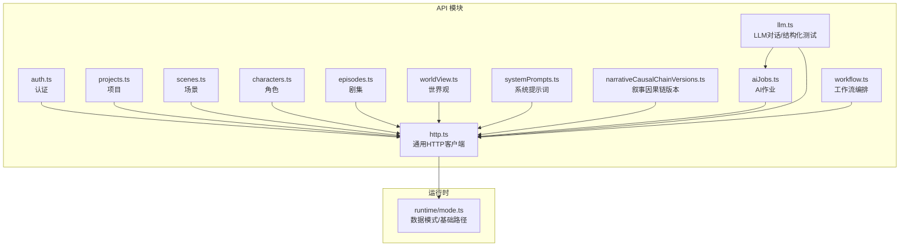
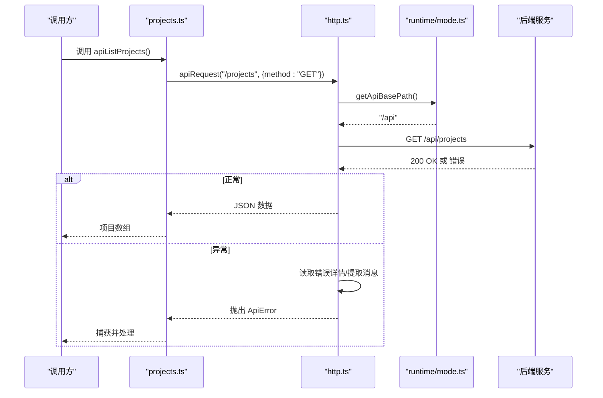
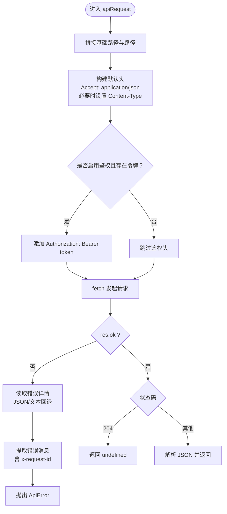
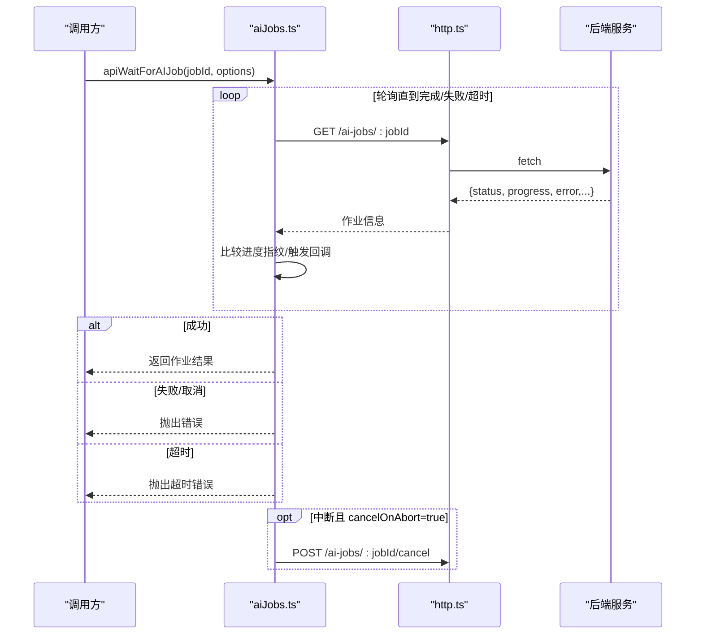
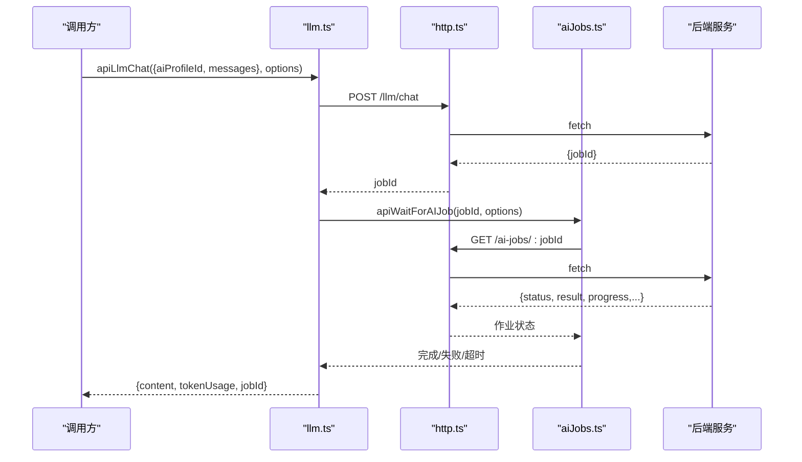
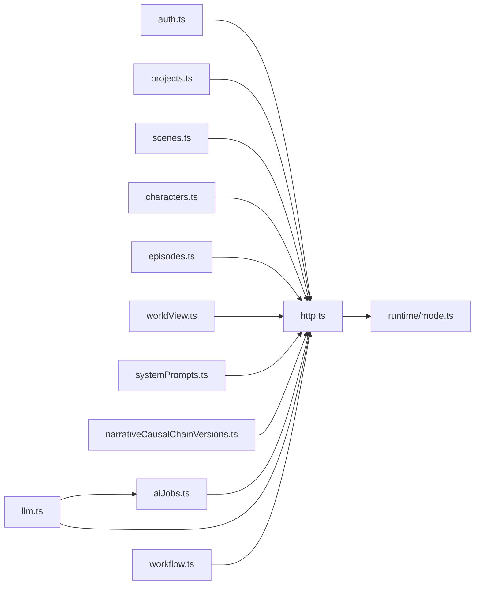

# API库

<cite>
**本文档引用的文件**
- [apps/web/src/lib/api/http.ts](file://apps/web/src/lib/api/http.ts)
- [apps/web/src/lib/api/auth.ts](file://apps/web/src/lib/api/auth.ts)
- [apps/web/src/lib/api/projects.ts](file://apps/web/src/lib/api/projects.ts)
- [apps/web/src/lib/api/scenes.ts](file://apps/web/src/lib/api/scenes.ts)
- [apps/web/src/lib/api/characters.ts](file://apps/web/src/lib/api/characters.ts)
- [apps/web/src/lib/api/episodes.ts](file://apps/web/src/lib/api/episodes.ts)
- [apps/web/src/lib/api/worldView.ts](file://apps/web/src/lib/api/worldView.ts)
- [apps/web/src/lib/api/systemPrompts.ts](file://apps/web/src/lib/api/systemPrompts.ts)
- [apps/web/src/lib/api/narrativeCausalChainVersions.ts](file://apps/web/src/lib/api/narrativeCausalChainVersions.ts)
- [apps/web/src/lib/api/aiJobs.ts](file://apps/web/src/lib/api/aiJobs.ts)
- [apps/web/src/lib/api/llm.ts](file://apps/web/src/lib/api/llm.ts)
- [apps/web/src/lib/api/workflow.ts](file://apps/web/src/lib/api/workflow.ts)
- [apps/web/src/lib/runtime/mode.ts](file://apps/web/src/lib/runtime/mode.ts)
- [apps/web/src/types/index.ts](file://apps/web/src/types/index.ts)
</cite>

## 目录

1. [简介](#简介)
2. [项目结构](#项目结构)
3. [核心组件](#核心组件)
4. [架构总览](#架构总览)
5. [详细组件分析](#详细组件分析)
6. [依赖关系分析](#依赖关系分析)
7. [性能考量](#性能考量)
8. [故障排查指南](#故障排查指南)
9. [结论](#结论)
10. [附录](#附录)

## 简介

本文件为 AIXSSS 前端应用的 API 库文档，聚焦以下目标：

- 解释 HTTP 客户端封装设计、请求拦截与响应处理机制
- 深入描述各 API 模块功能：项目管理、场景管理、角色管理、AI 作业、LLM 对话与结构化测试、工作流编排、系统提示词、叙事因果链版本管理、世界观元素等
- 阐述错误处理策略、轮询与中断控制（超时/取消）、最佳实践与性能优化
- 提供 API 使用示例、参数说明与返回值格式指引
- 给出扩展与自定义配置建议

## 项目结构

API 库位于前端工程 apps/web/src/lib/api 下，采用按功能域划分的模块化组织方式，每个领域一个文件，统一通过 http.ts 封装的 apiRequest 发起请求，并通过 runtime/mode.ts 控制数据模式与基础路径。

图表来源

- [apps/web/src/lib/api/http.ts](file://apps/web/src/lib/api/http.ts#L58-L92)
- [apps/web/src/lib/runtime/mode.ts](file://apps/web/src/lib/runtime/mode.ts#L23-L29)

章节来源

- [apps/web/src/lib/api/http.ts](file://apps/web/src/lib/api/http.ts#L1-L93)
- [apps/web/src/lib/runtime/mode.ts](file://apps/web/src/lib/runtime/mode.ts#L1-L30)

## 核心组件

- 通用 HTTP 客户端：封装 fetch，统一处理鉴权头、JSON 序列化、错误提取与 ApiError 抛出、204 特殊处理
- 运行时模式与基础路径：根据环境变量决定数据模式与 API 基础路径
- 各领域 API 模块：围绕项目、场景、角色、剧集、世界观、系统提示词、叙事因果链版本、AI 作业、LLM、工作流编排等提供方法

章节来源

- [apps/web/src/lib/api/http.ts](file://apps/web/src/lib/api/http.ts#L58-L92)
- [apps/web/src/lib/runtime/mode.ts](file://apps/web/src/lib/runtime/mode.ts#L23-L29)

## 架构总览

API 调用流程（以 GET /projects 为例）：

图表来源

- [apps/web/src/lib/api/projects.ts](file://apps/web/src/lib/api/projects.ts#L6-L8)
- [apps/web/src/lib/api/http.ts](file://apps/web/src/lib/api/http.ts#L58-L92)
- [apps/web/src/lib/runtime/mode.ts](file://apps/web/src/lib/runtime/mode.ts#L23-L29)

## 详细组件分析

### HTTP 客户端封装与错误处理

- 统一鉴权：若存在访问令牌且未显式禁用 auth，则在请求头添加 Bearer Token
- 请求体：当提供 body 时自动设置 Content-Type 为 application/json 并进行 JSON.stringify
- 响应处理：非 204 且非 ok 时，尝试解析错误详情（优先 JSON，否则文本），提取消息，拼接 x-request-id 后抛出 ApiError
- 204 特殊：直接返回 undefined
- 基础路径：通过 runtime/mode.ts 的 getApiBasePath 决定，支持环境变量覆盖

图表来源

- [apps/web/src/lib/api/http.ts](file://apps/web/src/lib/api/http.ts#L58-L92)

章节来源

- [apps/web/src/lib/api/http.ts](file://apps/web/src/lib/api/http.ts#L1-L93)

### 认证 API（auth.ts）

- 登录：POST /auth/login，返回 { accessToken }
- 注册：POST /auth/register，返回 { accessToken }
- 获取当前用户：GET /auth/me，返回 { userId, teamId, email }

参数与返回值要点

- 所有接口 auth: false，避免在注册/登录时附加 Authorization 头
- 返回值类型在模块内声明

章节来源

- [apps/web/src/lib/api/auth.ts](file://apps/web/src/lib/api/auth.ts#L1-L21)

### 项目管理 API（projects.ts）

- 列表：GET /projects
- 获取：GET /projects/:id
- 创建：POST /projects（字段：title, summary, protagonist, style, artStyleConfig 等）
- 更新：PATCH /projects/:id（按需传入 title/summary/...）
- 删除：DELETE /projects/:id

章节来源

- [apps/web/src/lib/api/projects.ts](file://apps/web/src/lib/api/projects.ts#L1-L53)
- [apps/web/src/types/index.ts](file://apps/web/src/types/index.ts#L452-L468)

### 场景管理 API（scenes.ts）

- 列表：GET /projects/:projectId/scenes
- 创建：POST /projects/:projectId/scenes（字段：order, summary, sceneDescription, actionDescription, shotPrompt, motionPrompt, dialogues, contextSummary, status, notes 等）
- 更新：PATCH /projects/:projectId/scenes/:sceneId（按需传入）
- 删除：DELETE /projects/:projectId/scenes/:sceneId
- 重排：POST /projects/:projectId/scenes/reorder（body: { sceneIds }）

章节来源

- [apps/web/src/lib/api/scenes.ts](file://apps/web/src/lib/api/scenes.ts#L1-L75)
- [apps/web/src/types/index.ts](file://apps/web/src/types/index.ts#L585-L618)

### 角色管理 API（characters.ts）

- 列表：GET /projects/:projectId/characters
- 创建：POST /projects/:projectId/characters（字段：name, briefDescription, avatar, appearance, personality, background, portraitPrompts, customStyle, relationships, appearances, themeColor, primaryColor, secondaryColor 等）
- 更新：PATCH /projects/:projectId/characters/:characterId（按需传入）
- 删除：DELETE /projects/:projectId/characters/:characterId

章节来源

- [apps/web/src/lib/api/characters.ts](file://apps/web/src/lib/api/characters.ts#L1-L76)

### 剧集 API（episodes.ts）

- 列表：GET /projects/:projectId/episodes
- 获取：GET /projects/:projectId/episodes/:episodeId
- 创建：POST /projects/:projectId/episodes（字段：order, title, summary, outline, coreExpression, contextCache, workflowState）
- 更新：PATCH /projects/:projectId/episodes/:episodeId（按需传入）
- 删除：DELETE /projects/:projectId/episodes/:episodeId

章节来源

- [apps/web/src/lib/api/episodes.ts](file://apps/web/src/lib/api/episodes.ts#L1-L63)
- [apps/web/src/types/index.ts](file://apps/web/src/types/index.ts#L620-L633)

### 世界观元素 API（worldView.ts）

- 列表：GET /projects/:projectId/world-view
- 创建：POST /projects/:projectId/world-view（字段：type, title, content, order）
- 更新：PATCH /projects/:projectId/world-view/:elementId（按需传入）
- 删除：DELETE /projects/:projectId/world-view/:elementId
- 重排：POST /projects/:projectId/world-view/reorder（body: { elementIds }）

章节来源

- [apps/web/src/lib/api/worldView.ts](file://apps/web/src/lib/api/worldView.ts#L1-L60)

### 系统提示词 API（systemPrompts.ts）

- 列表：GET /system-prompts
- 更新：PUT /system-prompts/:key（body: { content }）

章节来源

- [apps/web/src/lib/api/systemPrompts.ts](file://apps/web/src/lib/api/systemPrompts.ts#L1-L30)

### 叙事因果链版本 API（narrativeCausalChainVersions.ts）

- 列表：GET /projects/:projectId/narrative-causal-chain/versions?limit=N
- 获取：GET /projects/:projectId/narrative-causal-chain/versions/:versionId
- 快照：POST /projects/:projectId/narrative-causal-chain/versions（body: { label?, note? }）
- 恢复：POST /projects/:projectId/narrative-causal-chain/versions/:versionId/restore（body: { label?, note? }）

章节来源

- [apps/web/src/lib/api/narrativeCausalChainVersions.ts](file://apps/web/src/lib/api/narrativeCausalChainVersions.ts#L1-L57)

### AI 作业 API（aiJobs.ts）

- 查询作业：GET /ai-jobs/:jobId
- 等待作业完成：apiWaitForAIJob（轮询，支持 AbortSignal、轮询间隔、超时、进度回调、取消）
- 取消作业：POST /ai-jobs/:jobId/cancel（在中断时可选自动取消）

图表来源

- [apps/web/src/lib/api/aiJobs.ts](file://apps/web/src/lib/api/aiJobs.ts#L64-L137)
- [apps/web/src/lib/api/http.ts](file://apps/web/src/lib/api/http.ts#L58-L92)

章节来源

- [apps/web/src/lib/api/aiJobs.ts](file://apps/web/src/lib/api/aiJobs.ts#L1-L138)

### LLM 对话与结构化测试 API（llm.ts）

- 对话聊天：POST /llm/chat（先入队获得 jobId，再通过 apiWaitForAIJob 等待）
- 结构化测试：POST /llm/structured-test（同上）
- 返回标准化：将作业结果标准化为 AIResponse 或结构化测试结果（包含 content、tokenUsage、durationMs、json/schema 校验结果）

图表来源

- [apps/web/src/lib/api/llm.ts](file://apps/web/src/lib/api/llm.ts#L117-L150)
- [apps/web/src/lib/api/aiJobs.ts](file://apps/web/src/lib/api/aiJobs.ts#L64-L137)
- [apps/web/src/lib/api/http.ts](file://apps/web/src/lib/api/http.ts#L58-L92)

章节来源

- [apps/web/src/lib/api/llm.ts](file://apps/web/src/lib/api/llm.ts#L1-L193)

### 工作流编排 API（workflow.ts）

- 剧集规划：POST /workflow/projects/:projectId/episode-plan
- 构建叙事因果链：POST /workflow/projects/:projectId/narrative-causal-chain（可指定 phase/force）
- 生成核心表达：POST /workflow/projects/:projectId/episodes/:episodeId/core-expression
- 批量生成核心表达：POST /workflow/projects/:projectId/episodes/core-expression/batch（可选 episodeIds/force）
- 生成场景清单：POST /workflow/projects/:projectId/episodes/:episodeId/scene-list（可选 sceneCountHint）
- 生成场景清单（项目级）：POST /workflow/projects/:projectId/scene-list
- 生成场景锚点：POST /workflow/projects/:projectId/scenes/:sceneId/scene-anchor
- 生成关键帧提示词：POST /workflow/projects/:projectId/scenes/:sceneId/keyframe-prompt
- 生成分镜场景圣经：POST /workflow/projects/:projectId/scenes/:sceneId/storyboard/scene-bible
- 生成分镜计划：POST /workflow/projects/:projectId/scenes/:sceneId/storyboard/plan（可选 cameraMode）
- 生成分镜组：POST /workflow/projects/:projectId/scenes/:sceneId/storyboard/groups/:groupId（可选 cameraMode）
- 翻译/回译分镜面板：POST /workflow/projects/:projectId/scenes/:sceneId/storyboard/translate
- 生成关键帧图片：POST /workflow/projects/:projectId/scenes/:sceneId/generate-images
- 生成场景视频：POST /workflow/projects/:projectId/scenes/:sceneId/generate-video
- 生成运动提示词：POST /workflow/projects/:projectId/scenes/:sceneId/motion-prompt
- 生成台词：POST /workflow/projects/:projectId/scenes/:sceneId/dialogue
- 一键精炼场景：POST /workflow/projects/:projectId/scenes/:sceneId/refine-all
- 批量精炼场景：POST /workflow/projects/:projectId/scenes/refine-all（可选 sceneIds）

章节来源

- [apps/web/src/lib/api/workflow.ts](file://apps/web/src/lib/api/workflow.ts#L1-L302)

## 依赖关系分析

- 所有业务模块均依赖 http.ts 的 apiRequest
- aiJobs.ts 与 llm.ts 之间存在调用关系：llm.ts 在内部使用 aiJobs.ts 的等待与轮询能力
- runtime/mode.ts 为 http.ts 提供基础路径与数据模式

图表来源

- [apps/web/src/lib/api/http.ts](file://apps/web/src/lib/api/http.ts#L58-L92)
- [apps/web/src/lib/api/llm.ts](file://apps/web/src/lib/api/llm.ts#L1-L193)
- [apps/web/src/lib/api/aiJobs.ts](file://apps/web/src/lib/api/aiJobs.ts#L1-L138)
- [apps/web/src/lib/runtime/mode.ts](file://apps/web/src/lib/runtime/mode.ts#L23-L29)

章节来源

- [apps/web/src/lib/api/http.ts](file://apps/web/src/lib/api/http.ts#L1-L93)
- [apps/web/src/lib/api/llm.ts](file://apps/web/src/lib/api/llm.ts#L1-L193)
- [apps/web/src/lib/api/aiJobs.ts](file://apps/web/src/lib/api/aiJobs.ts#L1-L138)
- [apps/web/src/lib/runtime/mode.ts](file://apps/web/src/lib/runtime/mode.ts#L1-L30)

## 性能考量

- 轮询与中断
  - aiJobs.ts 的 apiWaitForAIJob 支持 AbortSignal，可在中断时选择是否向服务端发送取消请求
  - 支持自定义轮询间隔与超时，避免长耗时阻塞 UI
- 超时控制
  - 默认超时 10 分钟，可通过 options.timeoutMs 覆盖
- 进度感知
  - apiWaitForAIJob 会基于进度指纹去重触发回调，减少无效渲染
- 204 特例
  - http.ts 对 204 No Content 直接返回 undefined，避免不必要的 JSON 解析
- 类型与数据结构
  - 通过 types/index.ts 定义了项目、场景、角色、剧集、AI 响应等核心类型，确保前后端契约一致

章节来源

- [apps/web/src/lib/api/aiJobs.ts](file://apps/web/src/lib/api/aiJobs.ts#L64-L137)
- [apps/web/src/lib/api/http.ts](file://apps/web/src/lib/api/http.ts#L88-L92)
- [apps/web/src/types/index.ts](file://apps/web/src/types/index.ts#L452-L633)

## 故障排查指南

- 常见错误与建议
  - 401/403：检查 API Key 是否正确、未过期，以及供应商类型匹配；特别提示 Doubao Ark 的 Key 生成方式
  - 404：检查 Base URL 与模型名称
  - 429：触发限流/配额，稍后重试或提升配额
  - 5xx：服务端异常，稍后再试或切换节点/Base URL
  - 其他：网络/CORS 问题，检查代理/VPN 与浏览器控制台
- 错误消息来源
  - http.ts 会从响应头 x-request-id 与响应体中提取错误消息，统一包装为 ApiError
- 建议
  - 在 UI 层捕获 ApiError，结合 x-request-id 定位问题
  - 对长耗时操作使用 AbortController，配合 apiWaitForAIJob 的 cancelOnAbort 自动取消

章节来源

- [apps/web/src/lib/api/http.ts](file://apps/web/src/lib/api/http.ts#L80-L86)
- [apps/web/src/lib/runtime/mode.ts](file://apps/web/src/lib/runtime/mode.ts#L23-L29)

## 结论

本 API 库以 http.ts 为核心，统一了鉴权、序列化、错误处理与响应规范；各领域模块围绕明确的 REST 接口提供清晰的调用入口；aiJobs.ts 与 llm.ts 提供了可靠的异步作业等待与轮询机制，满足复杂工作流的交互需求。通过合理的超时与中断控制、类型定义与错误建议，提升了开发效率与用户体验。

## 附录

### API 使用示例与参数说明（示例性描述）

- 登录
  - 方法：POST /auth/login
  - 参数：{ email, password }
  - 返回：{ accessToken }
- 获取项目列表
  - 方法：GET /projects
  - 返回：项目数组
- 创建场景
  - 方法：POST /projects/:projectId/scenes
  - 参数：{ order, summary, sceneDescription, actionDescription, shotPrompt, motionPrompt, dialogues?, contextSummary?, status?, notes? }
  - 返回：场景对象
- 等待 AI 作业
  - 方法：apiWaitForAIJob(jobId, { signal, pollIntervalMs, timeoutMs, onProgress })
  - 行为：轮询直到 succeeded/failed/cancelled/超时，支持中断与进度回调

章节来源

- [apps/web/src/lib/api/auth.ts](file://apps/web/src/lib/api/auth.ts#L6-L20)
- [apps/web/src/lib/api/projects.ts](file://apps/web/src/lib/api/projects.ts#L6-L8)
- [apps/web/src/lib/api/scenes.ts](file://apps/web/src/lib/api/scenes.ts#L12-L33)
- [apps/web/src/lib/api/aiJobs.ts](file://apps/web/src/lib/api/aiJobs.ts#L64-L137)

### 返回值格式约定

- 成功：JSON 对象或数组；204 时返回 undefined
- 失败：抛出 ApiError，包含 status、detail 与可读消息（含 x-request-id）

章节来源

- [apps/web/src/lib/api/http.ts](file://apps/web/src/lib/api/http.ts#L80-L92)

### 扩展与自定义配置

- 自定义基础路径
  - 通过环境变量 VITE_API_BASE_PATH 设置（runtime/mode.ts 读取）
- 数据模式
  - 通过 VITE_DATA_MODE 切换 local/api；测试环境默认 local，其余默认 api
- 鉴权令牌
  - 通过 http.ts 的 setApiAccessToken/getApiAccessToken 管理全局 Bearer Token
- 轮询与中断
  - 在调用 apiWaitForAIJob 时传入 AbortSignal，可实现中断与自动取消

章节来源

- [apps/web/src/lib/runtime/mode.ts](file://apps/web/src/lib/runtime/mode.ts#L8-L29)
- [apps/web/src/lib/api/http.ts](file://apps/web/src/lib/api/http.ts#L15-L23)
- [apps/web/src/lib/api/aiJobs.ts](file://apps/web/src/lib/api/aiJobs.ts#L25-L55)
