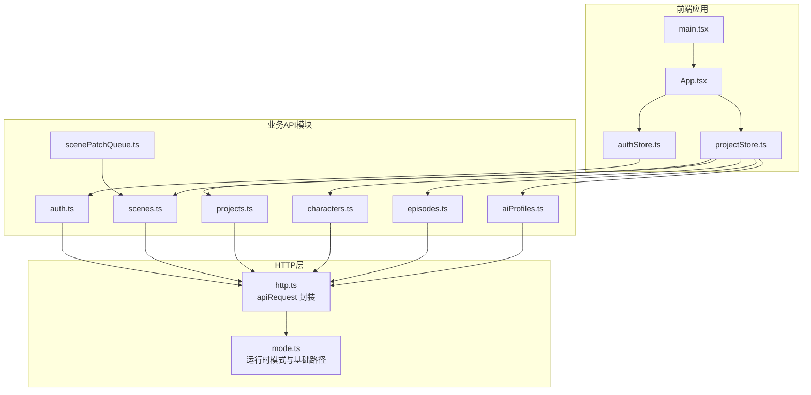
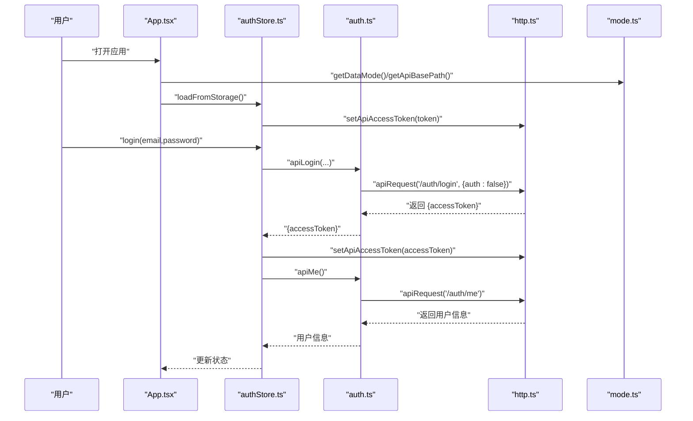
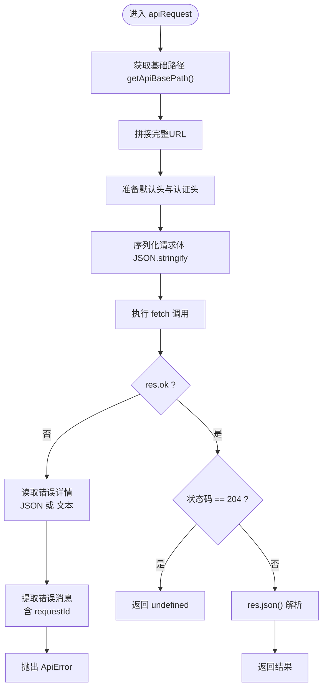
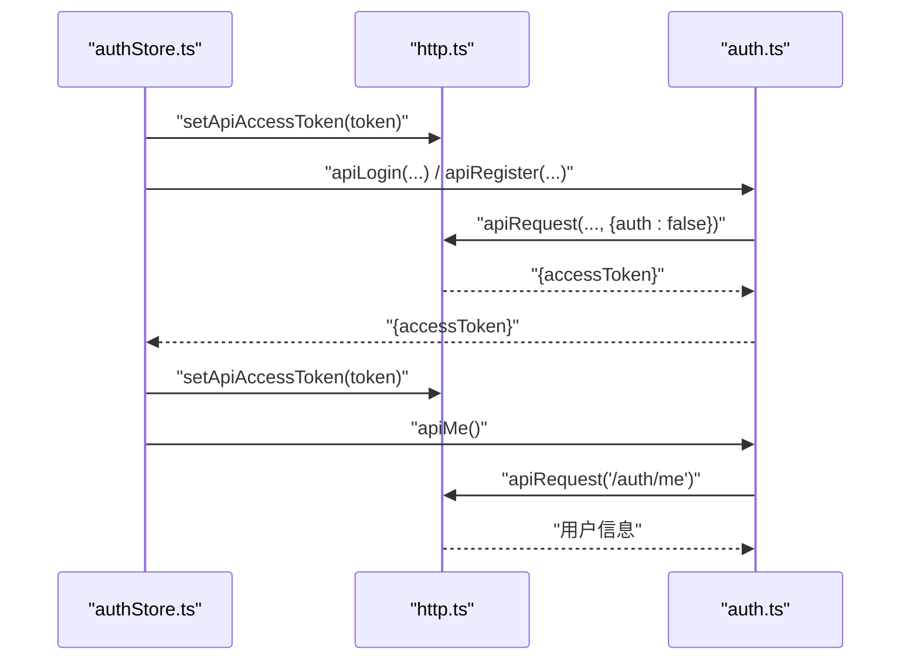
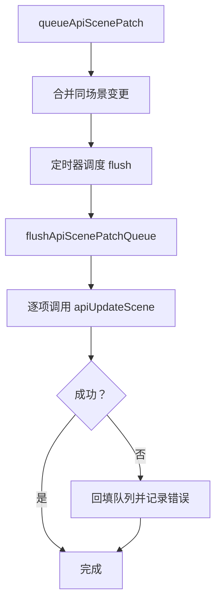
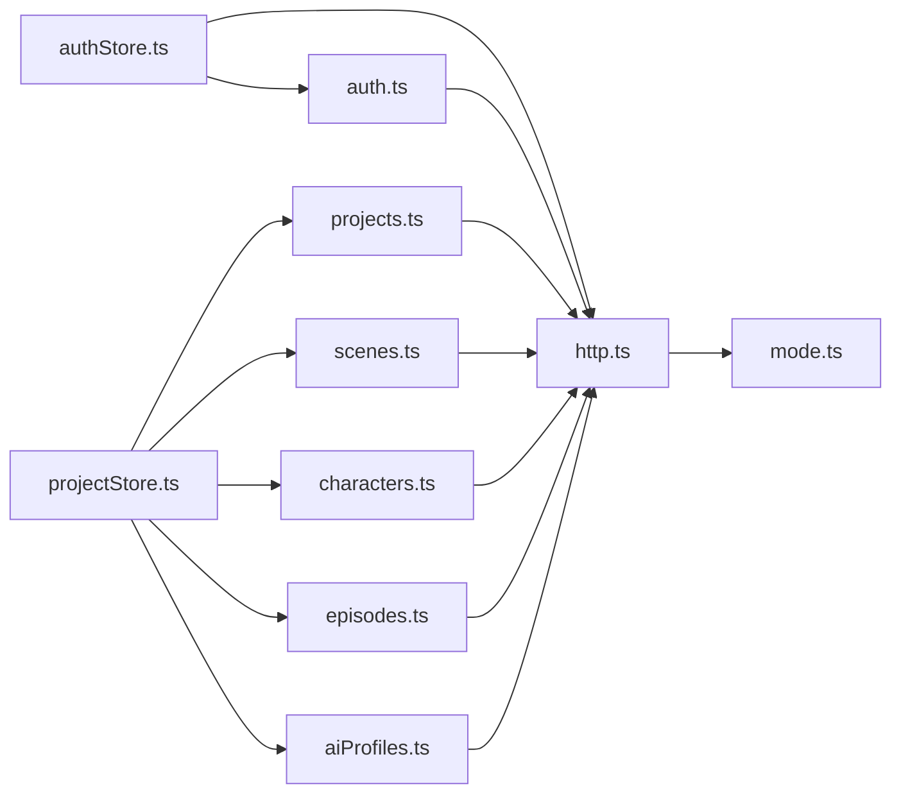

# HTTP客户端

<cite>
**本文引用的文件**
- [apps/web/src/lib/api/http.ts](file://apps/web/src/lib/api/http.ts)
- [apps/web/src/lib/runtime/mode.ts](file://apps/web/src/lib/runtime/mode.ts)
- [apps/web/src/lib/api/auth.ts](file://apps/web/src/lib/api/auth.ts)
- [apps/web/src/lib/api/projects.ts](file://apps/web/src/lib/api/projects.ts)
- [apps/web/src/lib/api/scenes.ts](file://apps/web/src/lib/api/scenes.ts)
- [apps/web/src/lib/api/characters.ts](file://apps/web/src/lib/api/characters.ts)
- [apps/web/src/lib/api/episodes.ts](file://apps/web/src/lib/api/episodes.ts)
- [apps/web/src/lib/api/aiProfiles.ts](file://apps/web/src/lib/api/aiProfiles.ts)
- [apps/web/src/lib/api/scenePatchQueue.ts](file://apps/web/src/lib/api/scenePatchQueue.ts)
- [apps/web/src/stores/authStore.ts](file://apps/web/src/stores/authStore.ts)
- [apps/web/src/stores/projectStore.ts](file://apps/web/src/stores/projectStore.ts)
- [apps/web/src/main.tsx](file://apps/web/src/main.tsx)
- [apps/web/src/App.tsx](file://apps/web/src/App.tsx)
- [apps/web/.env.test](file://apps/web/.env.test)
</cite>

## 目录

1. [简介](#简介)
2. [项目结构](#项目结构)
3. [核心组件](#核心组件)
4. [架构总览](#架构总览)
5. [组件详解](#组件详解)
6. [依赖关系分析](#依赖关系分析)
7. [性能与可靠性](#性能与可靠性)
8. [故障排查指南](#故障排查指南)
9. [结论](#结论)
10. [附录](#附录)

## 简介

本文件面向AIXSSS前端应用的HTTP客户端，系统性说明其封装设计、请求与响应处理、错误模型、认证令牌管理、重试与超时策略现状、以及在实际业务中的使用方式与最佳实践。该HTTP客户端以轻量封装为核心，围绕统一的请求入口与错误模型，配合运行时模式切换与令牌管理，支撑前端与后端API之间的数据交互。

## 项目结构

前端HTTP相关代码主要集中在以下位置：

- 核心HTTP封装：apps/web/src/lib/api/http.ts
- 运行时模式与基础路径：apps/web/src/lib/runtime/mode.ts
- 具体业务API模块：apps/web/src/lib/api/\*.ts（如 auth.ts、projects.ts、scenes.ts、characters.ts、episodes.ts、aiProfiles.ts 等）
- 令牌与认证状态管理：apps/web/src/stores/authStore.ts
- 项目数据流与查询框架集成：apps/web/src/stores/projectStore.ts
- 应用入口与查询客户端配置：apps/web/src/main.tsx
- 应用路由与运行时模式分支：apps/web/src/App.tsx
- 环境变量示例：apps/web/.env.test

图表来源

- [apps/web/src/App.tsx](file://apps/web/src/App.tsx#L387-L392)
- [apps/web/src/main.tsx](file://apps/web/src/main.tsx#L1-L37)
- [apps/web/src/stores/authStore.ts](file://apps/web/src/stores/authStore.ts#L1-L82)
- [apps/web/src/stores/projectStore.ts](file://apps/web/src/stores/projectStore.ts#L1-L181)
- [apps/web/src/lib/api/http.ts](file://apps/web/src/lib/api/http.ts#L1-L93)
- [apps/web/src/lib/runtime/mode.ts](file://apps/web/src/lib/runtime/mode.ts#L1-L30)
- [apps/web/src/lib/api/auth.ts](file://apps/web/src/lib/api/auth.ts#L1-L21)
- [apps/web/src/lib/api/projects.ts](file://apps/web/src/lib/api/projects.ts#L1-L53)
- [apps/web/src/lib/api/scenes.ts](file://apps/web/src/lib/api/scenes.ts#L1-L75)
- [apps/web/src/lib/api/characters.ts](file://apps/web/src/lib/api/characters.ts#L1-L76)
- [apps/web/src/lib/api/episodes.ts](file://apps/web/src/lib/api/episodes.ts#L1-L63)
- [apps/web/src/lib/api/aiProfiles.ts](file://apps/web/src/lib/api/aiProfiles.ts#L1-L63)
- [apps/web/src/lib/api/scenePatchQueue.ts](file://apps/web/src/lib/api/scenePatchQueue.ts#L1-L89)

章节来源

- [apps/web/src/lib/api/http.ts](file://apps/web/src/lib/api/http.ts#L1-L93)
- [apps/web/src/lib/runtime/mode.ts](file://apps/web/src/lib/runtime/mode.ts#L1-L30)
- [apps/web/src/lib/api/auth.ts](file://apps/web/src/lib/api/auth.ts#L1-L21)
- [apps/web/src/lib/api/projects.ts](file://apps/web/src/lib/api/projects.ts#L1-L53)
- [apps/web/src/lib/api/scenes.ts](file://apps/web/src/lib/api/scenes.ts#L1-L75)
- [apps/web/src/lib/api/characters.ts](file://apps/web/src/lib/api/characters.ts#L1-L76)
- [apps/web/src/lib/api/episodes.ts](file://apps/web/src/lib/api/episodes.ts#L1-L63)
- [apps/web/src/lib/api/aiProfiles.ts](file://apps/web/src/lib/api/aiProfiles.ts#L1-L63)
- [apps/web/src/lib/api/scenePatchQueue.ts](file://apps/web/src/lib/api/scenePatchQueue.ts#L1-L89)
- [apps/web/src/stores/authStore.ts](file://apps/web/src/stores/authStore.ts#L1-L82)
- [apps/web/src/stores/projectStore.ts](file://apps/web/src/stores/projectStore.ts#L1-L181)
- [apps/web/src/main.tsx](file://apps/web/src/main.tsx#L1-L37)
- [apps/web/src/App.tsx](file://apps/web/src/App.tsx#L387-L392)
- [apps/web/.env.test](file://apps/web/.env.test#L1-L5)

## 核心组件

- 统一请求入口：apiRequest 函数负责拼接URL、注入默认头、序列化请求体、处理非OK响应并抛出统一错误对象。
- 错误模型：ApiError 类型承载状态码与后端返回的错误详情，便于上层捕获与展示。
- 认证令牌：全局访问令牌状态与读写接口，配合store在登录/注册后写入localStorage并同步到HTTP层。
- 运行时模式：根据环境变量决定数据模式（本地/后端），并据此切换UI与数据源；基础API路径可由环境变量或默认值确定。
- 批量写入与重试：场景草稿队列采用定时合并与失败回填策略，避免频繁重试导致雪崩。

章节来源

- [apps/web/src/lib/api/http.ts](file://apps/web/src/lib/api/http.ts#L3-L13)
- [apps/web/src/lib/api/http.ts](file://apps/web/src/lib/api/http.ts#L58-L92)
- [apps/web/src/lib/runtime/mode.ts](file://apps/web/src/lib/runtime/mode.ts#L1-L30)
- [apps/web/src/stores/authStore.ts](file://apps/web/src/stores/authStore.ts#L1-L82)
- [apps/web/src/lib/api/scenePatchQueue.ts](file://apps/web/src/lib/api/scenePatchQueue.ts#L1-L89)

## 架构总览

HTTP客户端在应用中的调用链路如下：

- 应用启动与路由：根据运行时模式决定渲染本地或后端流程。
- 认证流程：登录/注册成功后，将令牌写入store并同步至HTTP层；随后拉取用户信息完成鉴权闭环。
- 数据操作：各业务模块通过apiRequest发起请求；store在API模式下直接调用后端，否则回退到本地存储。
- 批量写入：对高频变更的数据（如场景草稿）采用队列合并与定时刷新，失败时回填重试。

图表来源

- [apps/web/src/App.tsx](file://apps/web/src/App.tsx#L238-L385)
- [apps/web/src/stores/authStore.ts](file://apps/web/src/stores/authStore.ts#L19-L81)
- [apps/web/src/lib/api/auth.ts](file://apps/web/src/lib/api/auth.ts#L6-L20)
- [apps/web/src/lib/api/http.ts](file://apps/web/src/lib/api/http.ts#L58-L92)
- [apps/web/src/lib/runtime/mode.ts](file://apps/web/src/lib/runtime/mode.ts#L8-L29)

## 组件详解

### 统一请求封装：apiRequest

- 请求构建
  - 基础路径：通过运行时模式与环境变量计算API基础路径。
  - URL拼接：自动处理相对路径前缀。
  - 默认头：固定Accept为JSON；当存在请求体时，默认Content-Type为JSON。
  - 认证头：当未显式禁用且存在令牌时，自动附加Bearer Token。
- 请求体序列化：对传入body进行JSON字符串化。
- 响应处理
  - 非OK响应：解析错误详情（优先JSON，其次文本），提取消息，构造ApiError并抛出。
  - 204无内容：返回undefined。
  - 正常响应：按JSON解析并返回泛型类型。
- 错误细节
  - 支持从后端返回的detail结构中提取message字段或数组，并拼接请求ID（若存在）增强可观测性。

图表来源

- [apps/web/src/lib/api/http.ts](file://apps/web/src/lib/api/http.ts#L58-L92)
- [apps/web/src/lib/runtime/mode.ts](file://apps/web/src/lib/runtime/mode.ts#L23-L29)

章节来源

- [apps/web/src/lib/api/http.ts](file://apps/web/src/lib/api/http.ts#L58-L92)

### 错误模型：ApiError

- 结构：包含status、detail与标准Error属性，便于上层统一捕获与展示。
- 用途：在非OK响应时由apiRequest构造并抛出，携带后端返回的原始错误详情。

章节来源

- [apps/web/src/lib/api/http.ts](file://apps/web/src/lib/api/http.ts#L3-L13)

### 认证令牌管理

- 全局状态
  - setApiAccessToken/getApiAccessToken：全局读写访问令牌。
- 存储与同步
  - 登录/注册成功后，将token写入localStorage并调用setApiAccessToken同步到HTTP层。
  - 应用启动时从localStorage恢复token并尝试验证，无效则清理并重置。
- 业务使用
  - 认证相关接口（登录/注册）显式禁用自动加Bearer头（auth:false）。
  - 其他受保护接口默认启用自动加Bearer头。

图表来源

- [apps/web/src/stores/authStore.ts](file://apps/web/src/stores/authStore.ts#L25-L80)
- [apps/web/src/lib/api/auth.ts](file://apps/web/src/lib/api/auth.ts#L6-L20)
- [apps/web/src/lib/api/http.ts](file://apps/web/src/lib/api/http.ts#L17-L23)

章节来源

- [apps/web/src/stores/authStore.ts](file://apps/web/src/stores/authStore.ts#L1-L82)
- [apps/web/src/lib/api/auth.ts](file://apps/web/src/lib/api/auth.ts#L1-L21)
- [apps/web/src/lib/api/http.ts](file://apps/web/src/lib/api/http.ts#L15-L23)

### 运行时模式与基础路径

- 模式判定：优先使用环境变量，测试环境默认本地模式，其他环境默认API模式。
- 基础路径：优先使用环境变量，否则回退为"/api"，并去除末尾斜杠。
- 应用行为：App根据模式分支渲染本地或后端流程；store在API模式下调用后端API，否则回退到本地存储。

章节来源

- [apps/web/src/lib/runtime/mode.ts](file://apps/web/src/lib/runtime/mode.ts#L1-L30)
- [apps/web/src/App.tsx](file://apps/web/src/App.tsx#L387-L392)
- [apps/web/src/stores/projectStore.ts](file://apps/web/src/stores/projectStore.ts#L51-L81)

### 业务API模块使用示例

- 认证模块：apiRegister/apiLogin显式禁用自动认证头；apiMe启用自动认证头。
- 项目模块：列表/详情/创建/更新/删除均通过apiRequest封装调用。
- 场景/角色/剧集/AI配置模块：遵循相同封装风格，统一处理请求与响应。

章节来源

- [apps/web/src/lib/api/auth.ts](file://apps/web/src/lib/api/auth.ts#L1-L21)
- [apps/web/src/lib/api/projects.ts](file://apps/web/src/lib/api/projects.ts#L1-L53)
- [apps/web/src/lib/api/scenes.ts](file://apps/web/src/lib/api/scenes.ts#L1-L75)
- [apps/web/src/lib/api/characters.ts](file://apps/web/src/lib/api/characters.ts#L1-L76)
- [apps/web/src/lib/api/episodes.ts](file://apps/web/src/lib/api/episodes.ts#L1-L63)
- [apps/web/src/lib/api/aiProfiles.ts](file://apps/web/src/lib/api/aiProfiles.ts#L1-L63)

### 批量写入与重试策略

- 场景草稿队列：对同一场景的多次变更进行合并，定时批量提交；失败时回填队列，避免频繁重试引发雪崩。
- 查询框架重试：应用侧使用查询客户端（React Query）在查询层设置有限重试次数，减少网络抖动影响。

图表来源

- [apps/web/src/lib/api/scenePatchQueue.ts](file://apps/web/src/lib/api/scenePatchQueue.ts#L53-L88)

章节来源

- [apps/web/src/lib/api/scenePatchQueue.ts](file://apps/web/src/lib/api/scenePatchQueue.ts#L1-L89)
- [apps/web/src/main.tsx](file://apps/web/src/main.tsx#L13-L25)

## 依赖关系分析

- 模块耦合
  - 所有业务API模块仅依赖http.ts提供的apiRequest与运行时模式工具。
  - 认证store负责令牌生命周期与HTTP层同步，不直接依赖具体业务模块。
  - 项目store在API模式下依赖各业务API模块，在本地模式下依赖本地存储。
- 外部依赖
  - fetch浏览器原生能力。
  - React Query用于查询与缓存控制。
- 可能的循环依赖
  - 当前结构清晰，未见直接循环依赖迹象。

图表来源

- [apps/web/src/stores/authStore.ts](file://apps/web/src/stores/authStore.ts#L1-L82)
- [apps/web/src/stores/projectStore.ts](file://apps/web/src/stores/projectStore.ts#L1-L181)
- [apps/web/src/lib/api/http.ts](file://apps/web/src/lib/api/http.ts#L1-L93)
- [apps/web/src/lib/runtime/mode.ts](file://apps/web/src/lib/runtime/mode.ts#L1-L30)
- [apps/web/src/lib/api/auth.ts](file://apps/web/src/lib/api/auth.ts#L1-L21)
- [apps/web/src/lib/api/projects.ts](file://apps/web/src/lib/api/projects.ts#L1-L53)
- [apps/web/src/lib/api/scenes.ts](file://apps/web/src/lib/api/scenes.ts#L1-L75)
- [apps/web/src/lib/api/characters.ts](file://apps/web/src/lib/api/characters.ts#L1-L76)
- [apps/web/src/lib/api/episodes.ts](file://apps/web/src/lib/api/episodes.ts#L1-L63)
- [apps/web/src/lib/api/aiProfiles.ts](file://apps/web/src/lib/api/aiProfiles.ts#L1-L63)

## 性能与可靠性

- 请求合并与批处理
  - 场景草稿队列通过定时与合并减少请求次数，提升吞吐并降低后端压力。
- 查询重试与缓存
  - 查询客户端默认开启有限重试与缓存时间，减少重复请求与网络抖动影响。
- 超时控制
  - 当前实现未显式设置fetch超时；如需超时控制，可在apiRequest中引入AbortController并在调用方统一处理。
- 错误幂等性
  - 对于幂等请求，可在上层增加指数退避与最大重试次数限制；对于非幂等请求，建议采用队列回填策略（当前已针对场景草稿实现）。

[本节为通用建议，不直接分析具体文件]

## 故障排查指南

- 常见问题定位
  - 401/403：检查令牌是否正确设置与持久化；确认apiRequest是否启用了认证头。
  - 404/路径错误：核对业务API模块传入的路径编码与拼接逻辑。
  - 5xx：结合响应头中的请求ID定位后端日志；关注错误详情的message字段。
  - CORS/跨域：确认基础路径与代理配置一致。
- 日志与可观测性
  - 在apiRequest中记录请求方法、URL与状态码；必要时输出请求体摘要。
  - 对于批量写入失败，保留场景ID与错误上下文以便复现。
- 令牌失效
  - 认证store在加载时会尝试验证令牌，失败则清理并重置，避免长期处于无效状态。

章节来源

- [apps/web/src/lib/api/http.ts](file://apps/web/src/lib/api/http.ts#L80-L86)
- [apps/web/src/stores/authStore.ts](file://apps/web/src/stores/authStore.ts#L25-L44)
- [apps/web/src/lib/api/scenePatchQueue.ts](file://apps/web/src/lib/api/scenePatchQueue.ts#L74-L85)

## 结论

该HTTP客户端以极简设计实现了统一请求封装、错误模型与认证头注入，配合运行时模式与查询框架，满足了AIXSSS前端在本地与后端两种数据模式下的需求。通过场景草稿队列与查询重试策略，进一步提升了用户体验与系统稳定性。未来可在超时控制、幂等重试与可观测性方面继续完善。

[本节为总结性内容，不直接分析具体文件]

## 附录

### 请求配置选项与默认设置

- 默认头
  - Accept: application/json
  - Content-Type: application/json（当存在请求体时）
- 认证头
  - 自动添加 Authorization: Bearer <token>（除非显式禁用）
- 路径与基础路径
  - 自动拼接基础路径与相对路径
- 返回值
  - 204：返回undefined
  - 其他：按JSON解析并返回

章节来源

- [apps/web/src/lib/api/http.ts](file://apps/web/src/lib/api/http.ts#L65-L92)

### 自定义配置方法

- 禁用自动认证头
  - 在调用apiRequest时传入auth:false（适用于登录/注册等无需认证的接口）
- 自定义头部
  - 通过init.headers传入额外头部，将与默认头合并
- 自定义基础路径
  - 通过环境变量VITE_API_BASE_PATH覆盖默认"/api"
- 自定义数据模式
  - 通过VITE_DATA_MODE切换本地/后端模式；测试环境默认本地

章节来源

- [apps/web/src/lib/api/auth.ts](file://apps/web/src/lib/api/auth.ts#L7-L11)
- [apps/web/src/lib/runtime/mode.ts](file://apps/web/src/lib/runtime/mode.ts#L23-L29)
- [apps/web/.env.test](file://apps/web/.env.test#L1-L5)

### 使用示例与最佳实践

- 登录/注册
  - 显式禁用认证头，接收accessToken后写入localStorage并同步到HTTP层
- 获取用户信息
  - 成功后更新store状态，后续请求自动带认证头
- 项目/场景/角色/剧集/AI配置
  - 统一通过对应API模块调用，遵循相同错误处理与类型约束
- 批量写入
  - 使用场景草稿队列合并高频变更，失败回填避免丢失

章节来源

- [apps/web/src/lib/api/auth.ts](file://apps/web/src/lib/api/auth.ts#L6-L20)
- [apps/web/src/stores/authStore.ts](file://apps/web/src/stores/authStore.ts#L46-L74)
- [apps/web/src/lib/api/scenePatchQueue.ts](file://apps/web/src/lib/api/scenePatchQueue.ts#L53-L88)

### 扩展与自定义建议

- 超时控制
  - 在apiRequest中引入AbortController，允许调用方传入timeout参数
- 幂等重试
  - 对幂等请求增加指数退避与最大重试次数；对非幂等请求采用队列回填
- 错误分类
  - 区分网络错误、服务端错误与业务错误，分别采取不同策略
- 中间件式拦截器
  - 通过包装apiRequest实现请求/响应拦截器（如日志、埋点、鉴权扩展）

[本节为扩展建议，不直接分析具体文件]
