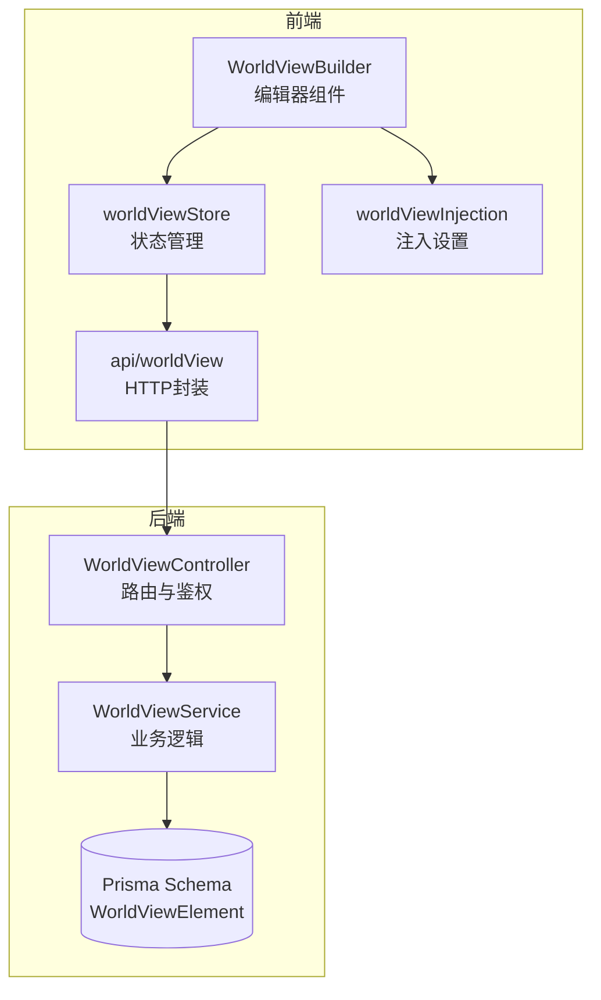
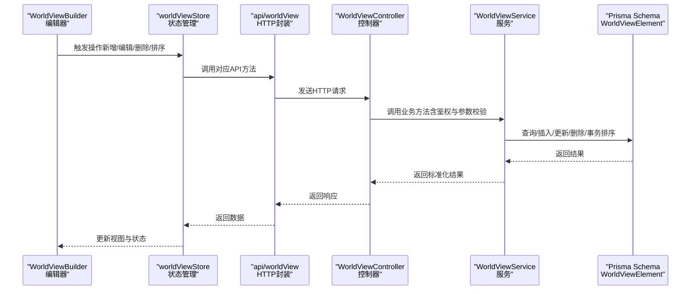
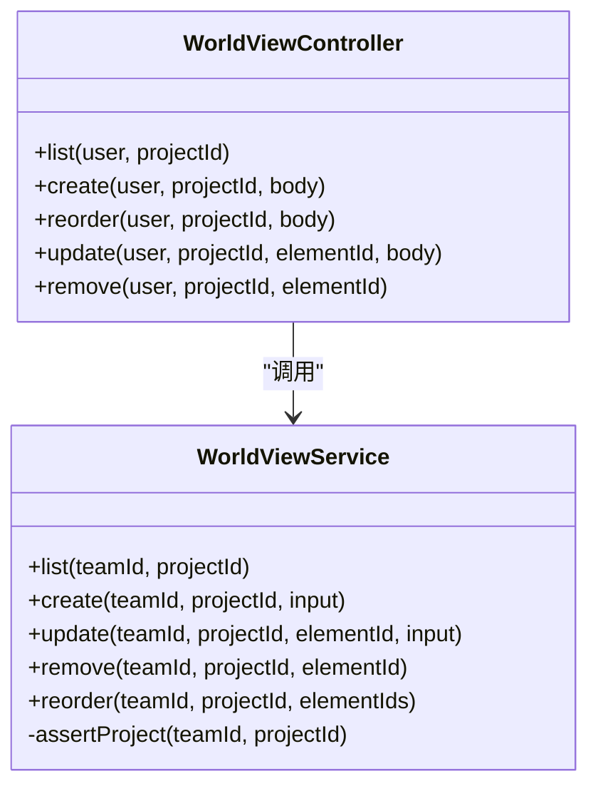
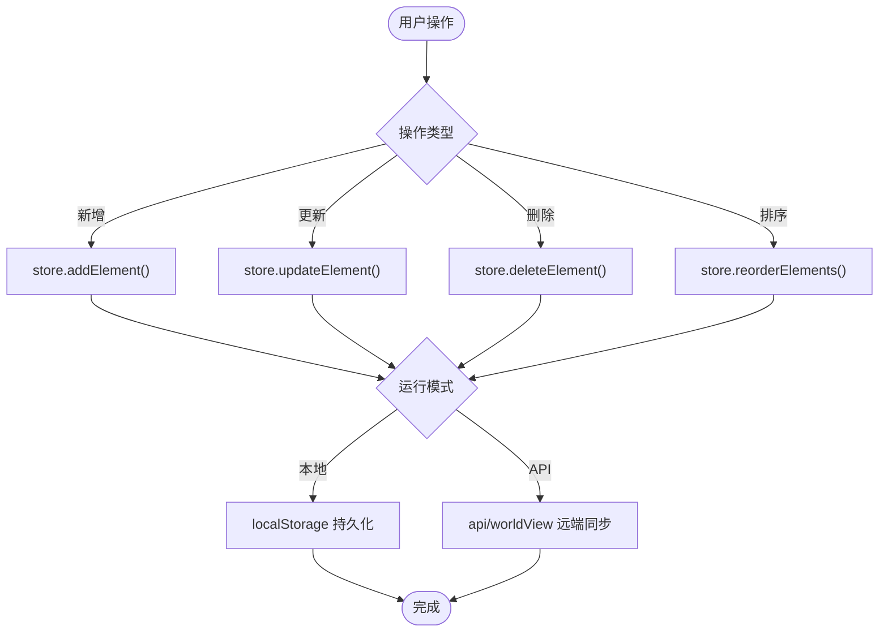
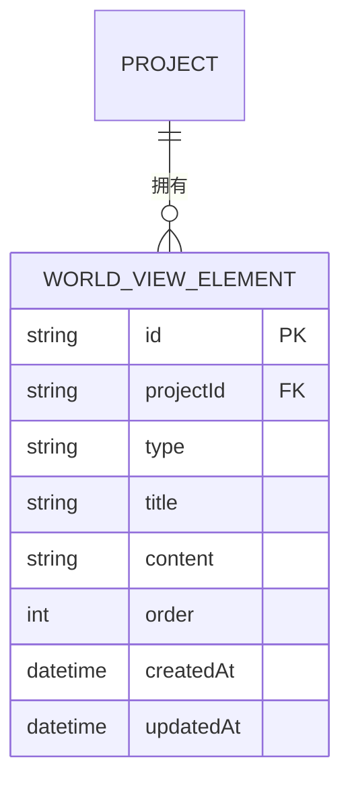
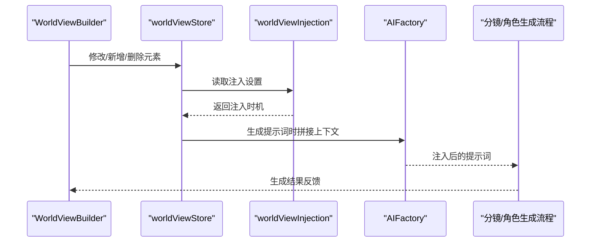
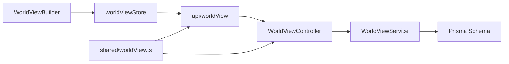

# 世界观API

<cite>
**本文档引用的文件**
- [apps/api/src/world-view/world-view.controller.ts](file://apps/api/src/world-view/world-view.controller.ts)
- [apps/api/src/world-view/world-view.service.ts](file://apps/api/src/world-view/world-view.service.ts)
- [apps/api/src/world-view/world-view.module.ts](file://apps/api/src/world-view/world-view.module.ts)
- [apps/web/src/lib/api/worldView.ts](file://apps/web/src/lib/api/worldView.ts)
- [apps/web/src/stores/worldViewStore.ts](file://apps/web/src/stores/worldViewStore.ts)
- [apps/web/src/components/editor/WorldViewBuilder.tsx](file://apps/web/src/components/editor/WorldViewBuilder.tsx)
- [apps/web/src/lib/ai/worldViewInjection.ts](file://apps/web/src/lib/ai/worldViewInjection.ts)
- [packages/shared/src/schemas/worldView.ts](file://packages/shared/src/schemas/worldView.ts)
- [apps/api/prisma/schema.prisma](file://apps/api/prisma/schema.prisma)
- [apps/web/src/types/index.ts](file://apps/web/src/types/index.ts)
</cite>

## 目录

1. [简介](#简介)
2. [项目结构](#项目结构)
3. [核心组件](#核心组件)
4. [架构总览](#架构总览)
5. [详细组件分析](#详细组件分析)
6. [依赖分析](#依赖分析)
7. [性能考量](#性能考量)
8. [故障排查指南](#故障排查指南)
9. [结论](#结论)
10. [附录](#附录)

## 简介

本文件为 AIXSSS 前端应用的世界观 API 提供全面技术文档。重点涵盖：

- 世界观元素的创建、编辑、删除与排序接口
- 与项目、场景的上下文注入机制
- 世界观元素的分类、层级关系与关联管理
- 搜索、过滤与批量操作能力
- API 使用示例、数据结构与配置选项
- 最佳实践与扩展指导

## 项目结构

围绕“世界观”主题，前后端涉及的关键文件分布如下：

- 后端控制器与服务：apps/api/src/world-view/\*
- 前端 API 封装与状态管理：apps/web/src/lib/api/worldView.ts、apps/web/src/stores/worldViewStore.ts
- 前端编辑器与注入设置：apps/web/src/components/editor/WorldViewBuilder.tsx、apps/web/src/lib/ai/worldViewInjection.ts
- 数据模型与共享校验：apps/api/prisma/schema.prisma、packages/shared/src/schemas/worldView.ts
- 类型定义：apps/web/src/types/index.ts

图表来源

- [apps/web/src/components/editor/WorldViewBuilder.tsx](file://apps/web/src/components/editor/WorldViewBuilder.tsx#L40-L584)
- [apps/web/src/stores/worldViewStore.ts](file://apps/web/src/stores/worldViewStore.ts#L50-L211)
- [apps/web/src/lib/api/worldView.ts](file://apps/web/src/lib/api/worldView.ts#L1-L60)
- [apps/web/src/lib/ai/worldViewInjection.ts](file://apps/web/src/lib/ai/worldViewInjection.ts#L1-L192)
- [apps/api/src/world-view/world-view.controller.ts](file://apps/api/src/world-view/world-view.controller.ts#L14-L58)
- [apps/api/src/world-view/world-view.service.ts](file://apps/api/src/world-view/world-view.service.ts#L24-L129)
- [apps/api/prisma/schema.prisma](file://apps/api/prisma/schema.prisma#L259-L273)

章节来源

- [apps/api/src/world-view/world-view.controller.ts](file://apps/api/src/world-view/world-view.controller.ts#L1-L58)
- [apps/api/src/world-view/world-view.service.ts](file://apps/api/src/world-view/world-view.service.ts#L1-L129)
- [apps/web/src/lib/api/worldView.ts](file://apps/web/src/lib/api/worldView.ts#L1-L60)
- [apps/web/src/stores/worldViewStore.ts](file://apps/web/src/stores/worldViewStore.ts#L1-L211)
- [apps/web/src/components/editor/WorldViewBuilder.tsx](file://apps/web/src/components/editor/WorldViewBuilder.tsx#L1-L584)
- [apps/web/src/lib/ai/worldViewInjection.ts](file://apps/web/src/lib/ai/worldViewInjection.ts#L1-L192)
- [packages/shared/src/schemas/worldView.ts](file://packages/shared/src/schemas/worldView.ts#L1-L26)
- [apps/api/prisma/schema.prisma](file://apps/api/prisma/schema.prisma#L259-L273)

## 核心组件

- 后端控制器：负责 JWT 鉴权、路由参数解析、请求体 Zod 校验，并委派至服务层执行业务逻辑。
- 服务层：实现列表、创建、更新、删除、排序等核心操作，包含项目归属校验与唯一索引保护。
- 前端 API 封装：统一 HTTP 请求封装，提供列表、创建、更新、删除、排序等方法。
- 前端状态管理：维护元素列表、当前选中项、加载状态，支持本地/远端双模式切换。
- 编辑器组件：提供可视化编辑界面、AI 生成辅助、注入设置面板。
- 注入设置模块：控制世界观在不同生成阶段的注入时机。

章节来源

- [apps/api/src/world-view/world-view.controller.ts](file://apps/api/src/world-view/world-view.controller.ts#L14-L58)
- [apps/api/src/world-view/world-view.service.ts](file://apps/api/src/world-view/world-view.service.ts#L24-L129)
- [apps/web/src/lib/api/worldView.ts](file://apps/web/src/lib/api/worldView.ts#L1-L60)
- [apps/web/src/stores/worldViewStore.ts](file://apps/web/src/stores/worldViewStore.ts#L25-L211)
- [apps/web/src/components/editor/WorldViewBuilder.tsx](file://apps/web/src/components/editor/WorldViewBuilder.tsx#L40-L584)
- [apps/web/src/lib/ai/worldViewInjection.ts](file://apps/web/src/lib/ai/worldViewInjection.ts#L14-L192)

## 架构总览

以下序列图展示从前端到后端的世界观 CRUD 流程，以及排序与注入设置的交互。

图表来源

- [apps/web/src/components/editor/WorldViewBuilder.tsx](file://apps/web/src/components/editor/WorldViewBuilder.tsx#L127-L232)
- [apps/web/src/stores/worldViewStore.ts](file://apps/web/src/stores/worldViewStore.ts#L79-L151)
- [apps/web/src/lib/api/worldView.ts](file://apps/web/src/lib/api/worldView.ts#L6-L59)
- [apps/api/src/world-view/world-view.controller.ts](file://apps/api/src/world-view/world-view.controller.ts#L19-L54)
- [apps/api/src/world-view/world-view.service.ts](file://apps/api/src/world-view/world-view.service.ts#L35-L126)
- [apps/api/prisma/schema.prisma](file://apps/api/prisma/schema.prisma#L259-L273)

## 详细组件分析

### 后端控制器与服务

- 路由与鉴权
  - 使用 JWT 守卫保护路由，路径形如 /projects/:projectId/world-view。
  - 提供 GET（列表）、POST（创建）、POST/reorder（排序）、PATCH（更新）、DELETE（删除）。
- 参数校验
  - 使用 Zod 对请求体进行严格校验，确保类型安全与边界约束。
- 服务层职责
  - 项目归属校验：确保元素属于当前团队的项目。
  - 排序策略：采用两阶段事务更新，避免唯一索引冲突，保证顺序一致性。
  - 时间戳转换：统一返回 ISO 字符串格式。

图表来源

- [apps/api/src/world-view/world-view.controller.ts](file://apps/api/src/world-view/world-view.controller.ts#L14-L58)
- [apps/api/src/world-view/world-view.service.ts](file://apps/api/src/world-view/world-view.service.ts#L24-L129)

章节来源

- [apps/api/src/world-view/world-view.controller.ts](file://apps/api/src/world-view/world-view.controller.ts#L1-L58)
- [apps/api/src/world-view/world-view.service.ts](file://apps/api/src/world-view/world-view.service.ts#L1-L129)

### 前端 API 封装与状态管理

- API 方法
  - 列表、创建、更新、删除、排序均通过统一的 HTTP 封装调用后端接口。
- 状态管理
  - 支持本地模式与 API 模式的无缝切换，本地模式下直接写入 localStorage。
  - 提供按类型分组、合并上下文字符串等便捷方法，便于注入与展示。
- 编辑器集成
  - 编辑器组件通过状态管理触发 API 调用，并在修改后提示场景一致性检查。

图表来源

- [apps/web/src/stores/worldViewStore.ts](file://apps/web/src/stores/worldViewStore.ts#L79-L151)
- [apps/web/src/lib/api/worldView.ts](file://apps/web/src/lib/api/worldView.ts#L6-L59)

章节来源

- [apps/web/src/lib/api/worldView.ts](file://apps/web/src/lib/api/worldView.ts#L1-L60)
- [apps/web/src/stores/worldViewStore.ts](file://apps/web/src/stores/worldViewStore.ts#L1-L211)

### 世界观元素的分类、层级与关联

- 分类
  - 支持 era、geography、society、technology、magic、custom 六种类型。
- 层级与排序
  - 通过 order 字段维护顺序，数据库层面具备 (projectId, order) 唯一索引。
- 关联管理
  - 与项目强关联（projectId），删除项目时会级联删除元素。
  - 分镜脚本中可引用特定元素 ID，实现空间一致性与跨集连续性。

图表来源

- [apps/api/prisma/schema.prisma](file://apps/api/prisma/schema.prisma#L116-L141)
- [apps/api/prisma/schema.prisma](file://apps/api/prisma/schema.prisma#L259-L273)

章节来源

- [packages/shared/src/schemas/worldView.ts](file://packages/shared/src/schemas/worldView.ts#L3-L4)
- [apps/api/prisma/schema.prisma](file://apps/api/prisma/schema.prisma#L259-L273)
- [apps/web/src/types/index.ts](file://apps/web/src/types/index.ts#L520-L562)

### 上下文注入机制（项目、场景）

- 注入设置
  - 支持在“分镜列表生成”、“场景锚点生成”、“角色设定生成”三个阶段注入。
  - 默认启用全部阶段，可通过 UI 面板调整。
- 上下文拼接
  - 将同类型元素按标题与内容拼接为结构化文本，供 AI 生成时作为上下文注入。
- 与场景的联动
  - 当世界观要素被修改时，可提示将已有分镜标记为“需更新”，确保一致性。

图表来源

- [apps/web/src/components/editor/WorldViewBuilder.tsx](file://apps/web/src/components/editor/WorldViewBuilder.tsx#L84-L106)
- [apps/web/src/stores/worldViewStore.ts](file://apps/web/src/stores/worldViewStore.ts#L174-L201)
- [apps/web/src/lib/ai/worldViewInjection.ts](file://apps/web/src/lib/ai/worldViewInjection.ts#L108-L126)

章节来源

- [apps/web/src/lib/ai/worldViewInjection.ts](file://apps/web/src/lib/ai/worldViewInjection.ts#L14-L192)
- [apps/web/src/stores/worldViewStore.ts](file://apps/web/src/stores/worldViewStore.ts#L174-L201)
- [apps/web/src/components/editor/WorldViewBuilder.tsx](file://apps/web/src/components/editor/WorldViewBuilder.tsx#L84-L106)

### API 使用示例与数据结构

- 数据结构
  - 元素类型：包含 id、projectId、type、title、content、order、createdAt、updatedAt。
  - 类型枚举：era、geography、society、technology、magic、custom。
- 基本操作
  - 列表：GET /projects/{projectId}/world-view
  - 创建：POST /projects/{projectId}/world-view（body：type, title, content, order，可选 id）
  - 更新：PATCH /projects/{projectId}/world-view/{elementId}（支持部分字段更新）
  - 删除：DELETE /projects/{projectId}/world-view/{elementId}
  - 排序：POST /projects/{projectId}/world-view/reorder（body：elementIds 数组）

章节来源

- [apps/web/src/lib/api/worldView.ts](file://apps/web/src/lib/api/worldView.ts#L6-L59)
- [apps/api/src/world-view/world-view.controller.ts](file://apps/api/src/world-view/world-view.controller.ts#L19-L54)
- [packages/shared/src/schemas/worldView.ts](file://packages/shared/src/schemas/worldView.ts#L6-L23)

### 搜索、过滤与批量操作

- 搜索与过滤
  - 前端提供按类型分组与按类型筛选的方法，便于快速定位与浏览。
- 批量操作
  - 排序接口支持一次提交多个元素 ID，后端通过两阶段事务保证顺序一致性。
  - 前端支持拖拽重排并批量更新 order，随后统一提交后端。

章节来源

- [apps/web/src/stores/worldViewStore.ts](file://apps/web/src/stores/worldViewStore.ts#L158-L172)
- [apps/api/src/world-view/world-view.service.ts](file://apps/api/src/world-view/world-view.service.ts#L92-L126)

## 依赖分析

- 前端依赖
  - 编辑器组件依赖状态管理与注入设置模块。
  - 状态管理依赖 API 封装与运行模式判断。
- 后端依赖
  - 控制器依赖服务层与 Zod 校验。
  - 服务层依赖 Prisma 与数据库模型。
- 共享依赖
  - 类型与校验规则在共享包中定义，前后端保持一致。

图表来源

- [apps/web/src/components/editor/WorldViewBuilder.tsx](file://apps/web/src/components/editor/WorldViewBuilder.tsx#L40-L584)
- [apps/web/src/stores/worldViewStore.ts](file://apps/web/src/stores/worldViewStore.ts#L50-L211)
- [apps/web/src/lib/api/worldView.ts](file://apps/web/src/lib/api/worldView.ts#L1-L60)
- [apps/api/src/world-view/world-view.controller.ts](file://apps/api/src/world-view/world-view.controller.ts#L1-L58)
- [apps/api/src/world-view/world-view.service.ts](file://apps/api/src/world-view/world-view.service.ts#L1-L129)
- [packages/shared/src/schemas/worldView.ts](file://packages/shared/src/schemas/worldView.ts#L1-L26)

章节来源

- [apps/api/src/world-view/world-view.module.ts](file://apps/api/src/world-view/world-view.module.ts#L1-L9)
- [packages/shared/src/schemas/worldView.ts](file://packages/shared/src/schemas/worldView.ts#L1-L26)

## 性能考量

- 排序优化
  - 采用两阶段事务更新，避免唯一索引冲突导致的回滚与重试。
- 前端渲染
  - 按类型分组与上下文拼接在内存中完成，适合中小规模数据集。
- 并发与一致性
  - 排序接口一次性提交多个 ID，减少往返次数；后端在事务内批量更新，保证原子性。

[本节为通用性能讨论，不直接分析具体文件]

## 故障排查指南

- 常见错误与处理
  - 项目不存在或无权限：控制器会抛出未找到异常，前端应提示重新选择项目或检查权限。
  - 元素不存在：更新/删除时若找不到元素，返回未找到异常。
  - 排序参数非法：elementIds 中包含不属于该项目的 ID 时，返回参数错误。
  - 本地模式异常：localStorage 写入失败时，前端会记录错误但不影响功能。
- 建议排查步骤
  - 确认 JWT 令牌有效与路由参数正确。
  - 检查请求体是否满足 Zod 校验规则。
  - 查看后端日志定位事务冲突或唯一索引问题。
  - 在本地模式下核对 localStorage 数据完整性。

章节来源

- [apps/api/src/world-view/world-view.service.ts](file://apps/api/src/world-view/world-view.service.ts#L27-L33)
- [apps/api/src/world-view/world-view.service.ts](file://apps/api/src/world-view/world-view.service.ts#L60-L66)
- [apps/api/src/world-view/world-view.service.ts](file://apps/api/src/world-view/world-view.service.ts#L80-L86)
- [apps/api/src/world-view/world-view.service.ts](file://apps/api/src/world-view/world-view.service.ts#L100-L102)
- [apps/web/src/stores/worldViewStore.ts](file://apps/web/src/stores/worldViewStore.ts#L73-L76)

## 结论

本方案提供了完整的世界观管理能力：从元素的创建、编辑、删除到排序，再到与项目、场景的上下文注入，形成闭环。通过严格的类型校验、事务保障与灵活的注入设置，既保证了数据一致性，又提升了生成质量与用户体验。

[本节为总结性内容，不直接分析具体文件]

## 附录

### API 定义概览

- 列表
  - 方法：GET
  - 路径：/projects/{projectId}/world-view
  - 认证：JWT
  - 响应：元素数组（按 order 升序、updatedAt 降序）
- 创建
  - 方法：POST
  - 路径：/projects/{projectId}/world-view
  - 请求体：type, title, content, order（可选 id）
  - 响应：新创建元素
- 更新
  - 方法：PATCH
  - 路径：/projects/{projectId}/world-view/{elementId}
  - 请求体：type, title, content, order（任选其一）
  - 响应：更新后元素
- 删除
  - 方法：DELETE
  - 路径：/projects/{projectId}/world-view/{elementId}
  - 响应：{ ok: true }
- 排序
  - 方法：POST
  - 路径：/projects/{projectId}/world-view/reorder
  - 请求体：elementIds（数组）
  - 响应：重排后的元素列表

章节来源

- [apps/api/src/world-view/world-view.controller.ts](file://apps/api/src/world-view/world-view.controller.ts#L19-L54)
- [apps/web/src/lib/api/worldView.ts](file://apps/web/src/lib/api/worldView.ts#L6-L59)
- [packages/shared/src/schemas/worldView.ts](file://packages/shared/src/schemas/worldView.ts#L6-L23)

### 数据模型与类型

- 元素模型
  - 字段：id、projectId、type、title、content、order、createdAt、updatedAt
  - 约束：(projectId, order) 唯一索引
- 类型枚举
  - era、geography、society、technology、magic、custom
- 上下文结构
  - 按类型分组，每组以标题与内容拼接为段落，最终合并为单一字符串

章节来源

- [apps/api/prisma/schema.prisma](file://apps/api/prisma/schema.prisma#L259-L273)
- [packages/shared/src/schemas/worldView.ts](file://packages/shared/src/schemas/worldView.ts#L3-L4)
- [apps/web/src/stores/worldViewStore.ts](file://apps/web/src/stores/worldViewStore.ts#L174-L201)

### 最佳实践与扩展建议

- 最佳实践
  - 保持类型与内容的自洽，避免相互矛盾的设定。
  - 在生成流程的关键节点开启注入，确保一致性。
  - 使用排序接口进行批量重排，减少多次往返。
- 扩展建议
  - 支持元素间的层级关系（父子/关联）以便更复杂的组织。
  - 增加搜索与过滤 API，支持关键词与类型组合查询。
  - 提供导入/导出功能，便于团队协作与版本管理。

[本节为通用建议，不直接分析具体文件]
