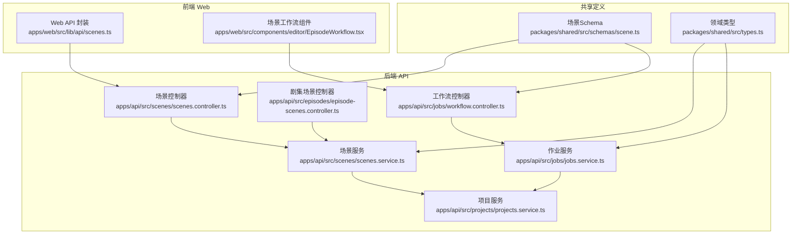
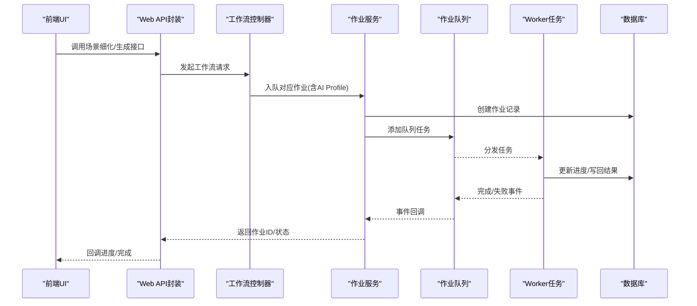
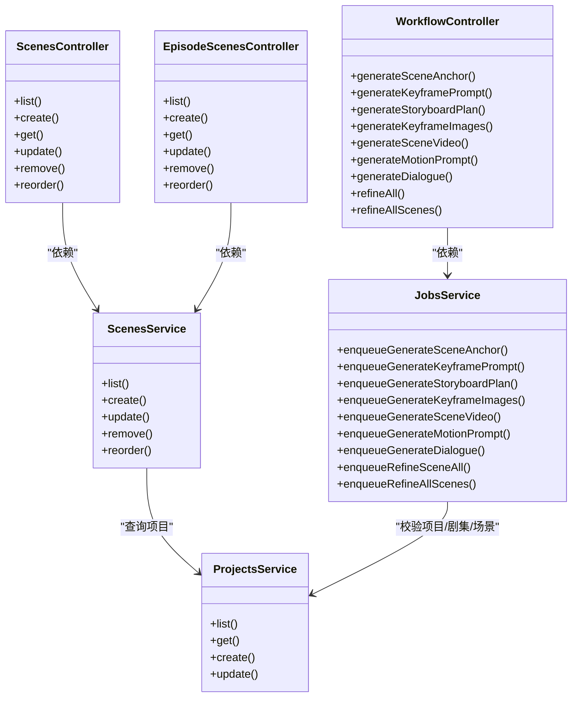

# 场景管理API

<cite>
**本文档引用的文件**
- [apps/api/src/scenes/scenes.controller.ts](file://apps/api/src/scenes/scenes.controller.ts)
- [apps/api/src/scenes/scenes.service.ts](file://apps/api/src/scenes/scenes.service.ts)
- [apps/api/src/episodes/episode-scenes.controller.ts](file://apps/api/src/episodes/episode-scenes.controller.ts)
- [apps/api/src/jobs/workflow.controller.ts](file://apps/api/src/jobs/workflow.controller.ts)
- [apps/api/src/jobs/jobs.service.ts](file://apps/api/src/jobs/jobs.service.ts)
- [apps/web/src/lib/api/scenes.ts](file://apps/web/src/lib/api/scenes.ts)
- [packages/shared/src/schemas/scene.ts](file://packages/shared/src/schemas/scene.ts)
- [packages/shared/src/types.ts](file://packages/shared/src/types.ts)
- [apps/api/src/projects/projects.service.ts](file://apps/api/src/projects/projects.service.ts)
- [apps/web/src/components/editor/EpisodeWorkflow.tsx](file://apps/web/src/components/editor/EpisodeWorkflow.tsx)
- [apps/web/src/components/canvas/nodes/RefineAllScenesNode.tsx](file://apps/web/src/components/canvas/nodes/RefineAllScenesNode.tsx)
- [apps/worker/src/tasks/refineSceneBatch.ts](file://apps/worker/src/tasks/refineSceneBatch.ts)
</cite>

## 目录

1. [简介](#简介)
2. [项目结构](#项目结构)
3. [核心组件](#核心组件)
4. [架构总览](#架构总览)
5. [详细组件分析](#详细组件分析)
6. [依赖关系分析](#依赖关系分析)
7. [性能考虑](#性能考虑)
8. [故障排除指南](#故障排除指南)
9. [结论](#结论)
10. [附录](#附录)

## 简介

本文件面向AIXSSS前端应用的场景管理API，系统性梳理场景的创建、编辑、删除与状态管理接口；深入解析场景细化、优化与批量处理能力；阐述场景与项目、角色、世界观的关系管理；说明场景生成队列、进度追踪与错误处理机制，并提供完整的API示例、参数配置与响应格式，以及场景工作流的使用指南与性能优化策略。

## 项目结构

围绕场景管理的关键模块分布如下：

- 后端API层：场景控制器与服务、工作流控制器与作业服务、项目服务
- 前端Web层：场景API封装、工作流UI组件与批量处理逻辑
- 共享定义：场景输入输出Schema与领域类型（状态、步骤等）

图表来源

- [apps/api/src/scenes/scenes.controller.ts](file://apps/api/src/scenes/scenes.controller.ts#L1-L67)
- [apps/api/src/scenes/scenes.service.ts](file://apps/api/src/scenes/scenes.service.ts#L1-L365)
- [apps/api/src/episodes/episode-scenes.controller.ts](file://apps/api/src/episodes/episode-scenes.controller.ts#L1-L83)
- [apps/api/src/jobs/workflow.controller.ts](file://apps/api/src/jobs/workflow.controller.ts#L1-L266)
- [apps/api/src/jobs/jobs.service.ts](file://apps/api/src/jobs/jobs.service.ts#L1-L800)
- [apps/web/src/lib/api/scenes.ts](file://apps/web/src/lib/api/scenes.ts#L1-L75)
- [packages/shared/src/schemas/scene.ts](file://packages/shared/src/schemas/scene.ts#L1-L56)
- [packages/shared/src/types.ts](file://packages/shared/src/types.ts#L1-L77)

章节来源

- [apps/api/src/scenes/scenes.controller.ts](file://apps/api/src/scenes/scenes.controller.ts#L1-L67)
- [apps/api/src/scenes/scenes.service.ts](file://apps/api/src/scenes/scenes.service.ts#L1-L365)
- [apps/api/src/episodes/episode-scenes.controller.ts](file://apps/api/src/episodes/episode-scenes.controller.ts#L1-L83)
- [apps/api/src/jobs/workflow.controller.ts](file://apps/api/src/jobs/workflow.controller.ts#L1-L266)
- [apps/api/src/jobs/jobs.service.ts](file://apps/api/src/jobs/jobs.service.ts#L1-L800)
- [apps/web/src/lib/api/scenes.ts](file://apps/web/src/lib/api/scenes.ts#L1-L75)
- [packages/shared/src/schemas/scene.ts](file://packages/shared/src/schemas/scene.ts#L1-L56)
- [packages/shared/src/types.ts](file://packages/shared/src/types.ts#L1-L77)

## 核心组件

- 场景控制器与服务：提供场景的增删改查、排序与跨剧集查询
- 工作流控制器与作业服务：提供场景细化、生成系列任务的入队与进度追踪
- 项目服务：维护项目工作流状态与统计信息
- 前端API封装与UI组件：对接后端API，驱动工作流与批量处理

章节来源

- [apps/api/src/scenes/scenes.controller.ts](file://apps/api/src/scenes/scenes.controller.ts#L1-L67)
- [apps/api/src/scenes/scenes.service.ts](file://apps/api/src/scenes/scenes.service.ts#L1-L365)
- [apps/api/src/jobs/workflow.controller.ts](file://apps/api/src/jobs/workflow.controller.ts#L1-L266)
- [apps/api/src/jobs/jobs.service.ts](file://apps/api/src/jobs/jobs.service.ts#L1-L800)
- [apps/api/src/projects/projects.service.ts](file://apps/api/src/projects/projects.service.ts#L1-L215)
- [apps/web/src/lib/api/scenes.ts](file://apps/web/src/lib/api/scenes.ts#L1-L75)

## 架构总览

场景管理贯穿“前端调用—后端控制器—作业队列—Worker执行—状态回写”的闭环。前端通过Web API封装发起请求，后端控制器校验参数并调用作业服务入队，作业服务持久化作业记录并写入队列，Worker按任务类型执行具体生成逻辑，完成后回写进度与结果，前端通过进度回调实时展示。

图表来源

- [apps/api/src/jobs/workflow.controller.ts](file://apps/api/src/jobs/workflow.controller.ts#L44-L266)
- [apps/api/src/jobs/jobs.service.ts](file://apps/api/src/jobs/jobs.service.ts#L37-L800)
- [apps/web/src/lib/api/scenes.ts](file://apps/web/src/lib/api/scenes.ts#L1-L75)

## 详细组件分析

### 场景管理API（项目级）

- 路径：/projects/{projectId}/scenes
- 支持方法：
  - GET：列出项目默认剧集下的所有场景（按顺序）
  - POST：创建场景（可指定ID、顺序、描述、提示词、故事板JSON、对话、上下文摘要、状态、备注等）
  - GET：获取单场景详情
  - PATCH：更新场景（支持部分字段更新）
  - DELETE：删除场景（若存在未完成作业则拒绝删除）
  - POST：reorder 批量重排场景顺序

参数与响应

- 请求体Schema来自共享包的CreateSceneInputSchema/UpdateSceneInputSchema
- 响应包含标准化时间戳（ISO字符串）与场景字段映射

章节来源

- [apps/api/src/scenes/scenes.controller.ts](file://apps/api/src/scenes/scenes.controller.ts#L14-L67)
- [apps/api/src/scenes/scenes.service.ts](file://apps/api/src/scenes/scenes.service.ts#L69-L159)
- [apps/web/src/lib/api/scenes.ts](file://apps/web/src/lib/api/scenes.ts#L6-L75)
- [packages/shared/src/schemas/scene.ts](file://packages/shared/src/schemas/scene.ts#L26-L56)

### 场景管理API（剧集级）

- 路径：/projects/{projectId}/episodes/{episodeId}/scenes
- 支持方法：
  - GET：列出指定剧集下场景
  - POST：在指定剧集创建场景
  - GET：获取指定剧集中的单场景
  - PATCH：更新指定剧集中的场景
  - DELETE：删除指定剧集中的场景
  - POST：reorder 在指定剧集内重排场景顺序

章节来源

- [apps/api/src/episodes/episode-scenes.controller.ts](file://apps/api/src/episodes/episode-scenes.controller.ts#L14-L83)
- [apps/api/src/scenes/scenes.service.ts](file://apps/api/src/scenes/scenes.service.ts#L78-L159)

### 场景状态与工作流状态

- 场景状态（SceneStatus）：pending、scene_generating、scene_confirmed、keyframe_generating、keyframe_confirmed、motion_generating、completed、needs_update
- 场景步骤（SceneStep）：scene_description、keyframe_prompt、motion_prompt、dialogue
- 项目工作流状态（WorkflowState）：包含IDLE、DATA_COLLECTING、WORLD_VIEW_BUILDING、CHARACTER_MANAGING、EPISODE_PLANNING、EPISODE_CREATING、SCENE_LIST_GENERATING、SCENE_LIST_EDITING、SCENE_PROCESSING、EXPORTING等

章节来源

- [packages/shared/src/types.ts](file://packages/shared/src/types.ts#L34-L47)
- [packages/shared/src/types.ts](file://packages/shared/src/types.ts#L6-L23)

### 场景细化与批量处理

- 单场景细化：enqueueRefineSceneAll（通过工作流控制器触发）
- 批量细化：enqueueRefineAllScenes（支持选择多个场景或全量），前端以串行方式逐个执行，确保资源与竞态控制
- Worker侧批量细化任务：按剧集与场景顺序迭代，支持断点续跑与失败场景重试

章节来源

- [apps/api/src/jobs/workflow.controller.ts](file://apps/api/src/jobs/workflow.controller.ts#L243-L264)
- [apps/api/src/jobs/jobs.service.ts](file://apps/api/src/jobs/jobs.service.ts#L797-L800)
- [apps/web/src/components/editor/EpisodeWorkflow.tsx](file://apps/web/src/components/editor/EpisodeWorkflow.tsx#L1449-L1563)
- [apps/worker/src/tasks/refineSceneBatch.ts](file://apps/worker/src/tasks/refineSceneBatch.ts#L41-L84)

### 场景生成队列与工作流

- 可用的生成任务（通过工作流控制器触发）：
  - 生成场景锚点：generateSceneAnchor
  - 生成关键帧提示词：generateKeyframePrompt
  - 生成故事板场景圣经：generateStoryboardSceneBible
  - 生成故事板计划：generateStoryboardPlan
  - 生成故事板分组：generateStoryboardGroup
  - 生成关键帧图像：generateKeyframeImages
  - 生成场景视频：generateSceneVideo
  - 生成动作提示词：generateMotionPrompt
  - 生成对白：generateDialogue
- 作业服务负责：
  - 参数校验与项目/剧集/场景/AI Profile存在性检查
  - 项目可规划性校验（如缺少必要字段则拒绝）
  - 创建作业记录并写入队列，设置重试与清理策略
  - 读取队列进度并映射为API响应

章节来源

- [apps/api/src/jobs/workflow.controller.ts](file://apps/api/src/jobs/workflow.controller.ts#L117-L241)
- [apps/api/src/jobs/jobs.service.ts](file://apps/api/src/jobs/jobs.service.ts#L37-L800)

### 场景与项目、角色、世界观的关系管理

- 场景与项目：场景属于项目，通过projectId关联；项目服务提供统计与工作流状态
- 场景与角色：castCharacterIds数组关联角色；前端角色管理组件与场景编辑联动
- 场景与世界观：通过contextSummary、storyboardPlanJson等字段承载上下文；项目服务在更新时可自动记录叙事因果链版本

章节来源

- [apps/api/src/scenes/scenes.service.ts](file://apps/api/src/scenes/scenes.service.ts#L105-L159)
- [apps/api/src/projects/projects.service.ts](file://apps/api/src/projects/projects.service.ts#L141-L198)
- [apps/web/src/components/editor/SceneGeneration.tsx](file://apps/web/src/components/editor/SceneGeneration.tsx#L151-L173)

### 场景工作流使用指南

- 生成场景列表：前端调用生成场景列表接口，等待作业完成并刷新场景列表
- 批量细化：在工作流面板中选择场景，串行执行细化作业，监控整体进度与失败项
- 单场景细化：针对特定场景触发细化作业，支持进度回调与错误处理

章节来源

- [apps/web/src/components/editor/EpisodeWorkflow.tsx](file://apps/web/src/components/editor/EpisodeWorkflow.tsx#L1449-L1563)
- [apps/web/src/components/canvas/nodes/RefineAllScenesNode.tsx](file://apps/web/src/components/canvas/nodes/RefineAllScenesNode.tsx#L35-L55)

## 依赖关系分析

图表来源

- [apps/api/src/scenes/scenes.controller.ts](file://apps/api/src/scenes/scenes.controller.ts#L14-L67)
- [apps/api/src/scenes/scenes.service.ts](file://apps/api/src/scenes/scenes.service.ts#L23-L365)
- [apps/api/src/episodes/episode-scenes.controller.ts](file://apps/api/src/episodes/episode-scenes.controller.ts#L14-L83)
- [apps/api/src/jobs/workflow.controller.ts](file://apps/api/src/jobs/workflow.controller.ts#L44-L266)
- [apps/api/src/jobs/jobs.service.ts](file://apps/api/src/jobs/jobs.service.ts#L37-L800)
- [apps/api/src/projects/projects.service.ts](file://apps/api/src/projects/projects.service.ts#L34-L215)

## 性能考虑

- 串行批量细化：前端按顺序串行执行，避免并发资源争用与编辑冲突
- 断点续跑：Worker批量细化支持从上次进度恢复，减少重复计算
- 队列重试与清理：作业服务为队列任务配置指数退避与完成/失败清理上限，平衡可靠性与存储占用
- 事务一致性：场景重排与删除在事务中执行，保证数据一致性

章节来源

- [apps/web/src/components/editor/EpisodeWorkflow.tsx](file://apps/web/src/components/editor/EpisodeWorkflow.tsx#L1449-L1563)
- [apps/worker/src/tasks/refineSceneBatch.ts](file://apps/worker/src/tasks/refineSceneBatch.ts#L41-L84)
- [apps/api/src/jobs/jobs.service.ts](file://apps/api/src/jobs/jobs.service.ts#L136-L146)
- [apps/api/src/scenes/scenes.service.ts](file://apps/api/src/scenes/scenes.service.ts#L327-L338)

## 故障排除指南

- 删除场景被拒：若场景正被AI作业处理（排队/运行中），需先取消对应作业再删除
- 项目不可规划：生成前会校验项目是否具备可规划条件（如缺少必要字段），请先完善项目设置
- 作业无进度：确认队列服务可用且作业已入队；可通过作业查询接口获取当前进度
- 批量细化失败：检查失败场景ID与错误信息，必要时单独重试或修复问题后重试

章节来源

- [apps/api/src/scenes/scenes.service.ts](file://apps/api/src/scenes/scenes.service.ts#L255-L280)
- [apps/api/src/jobs/jobs.service.ts](file://apps/api/src/jobs/jobs.service.ts#L77-L86)
- [apps/web/src/components/editor/EpisodeWorkflow.tsx](file://apps/web/src/components/editor/EpisodeWorkflow.tsx#L1548-L1558)

## 结论

场景管理API围绕“项目-剧集-场景”三层结构设计，结合工作流控制器与作业服务，实现了从场景创建到细化、生成与批量处理的完整闭环。通过严格的参数校验、事务保障与队列重试机制，确保了系统的稳定性与可扩展性。前端提供了直观的工作流界面与批量处理能力，配合断点续跑与串行执行策略，有效降低了资源竞争与数据冲突风险。

## 附录

### API参考清单

- 项目级场景
  - GET /projects/{projectId}/scenes
  - POST /projects/{projectId}/scenes
  - GET /projects/{projectId}/scenes/{sceneId}
  - PATCH /projects/{projectId}/scenes/{sceneId}
  - DELETE /projects/{projectId}/scenes/{sceneId}
  - POST /projects/{projectId}/scenes/reorder
- 剧集级场景
  - GET /projects/{projectId}/episodes/{episodeId}/scenes
  - POST /projects/{projectId}/episodes/{episodeId}/scenes
  - GET /projects/{projectId}/episodes/{episodeId}/scenes/{sceneId}
  - PATCH /projects/{projectId}/episodes/{episodeId}/scenes/{sceneId}
  - DELETE /projects/{projectId}/episodes/{episodeId}/scenes/{sceneId}
  - POST /projects/{projectId}/episodes/{episodeId}/scenes/reorder
- 工作流（场景细化与生成）
  - POST /workflow/projects/{projectId}/scenes/{sceneId}/scene-anchor
  - POST /workflow/projects/{projectId}/scenes/{sceneId}/keyframe-prompt
  - POST /workflow/projects/{projectId}/scenes/{sceneId}/storyboard/scene-bible
  - POST /workflow/projects/{projectId}/scenes/{sceneId}/storyboard/plan
  - POST /workflow/projects/{projectId}/scenes/{sceneId}/storyboard/groups/{groupId}
  - POST /workflow/projects/{projectId}/scenes/{sceneId}/generate-images
  - POST /workflow/projects/{projectId}/scenes/{sceneId}/generate-video
  - POST /workflow/projects/{projectId}/scenes/{sceneId}/motion-prompt
  - POST /workflow/projects/{projectId}/scenes/{sceneId}/dialogue
  - POST /workflow/projects/{projectId}/scenes/{sceneId}/refine-all
  - POST /workflow/projects/{projectId}/scenes/refine-all

章节来源

- [apps/api/src/scenes/scenes.controller.ts](file://apps/api/src/scenes/scenes.controller.ts#L19-L63)
- [apps/api/src/episodes/episode-scenes.controller.ts](file://apps/api/src/episodes/episode-scenes.controller.ts#L19-L80)
- [apps/api/src/jobs/workflow.controller.ts](file://apps/api/src/jobs/workflow.controller.ts#L49-L264)
