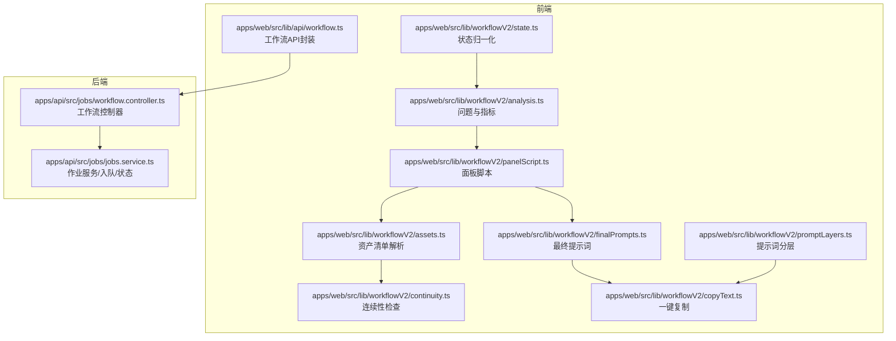
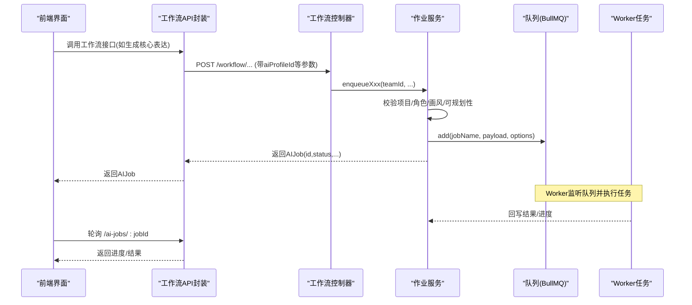
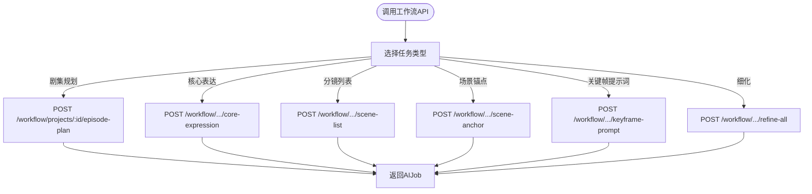
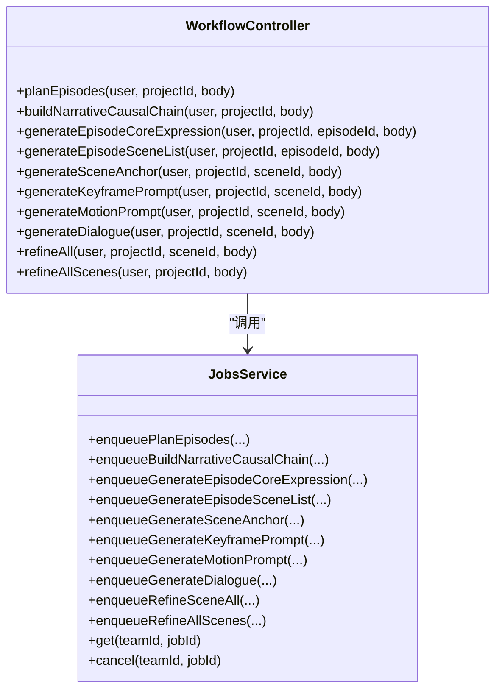
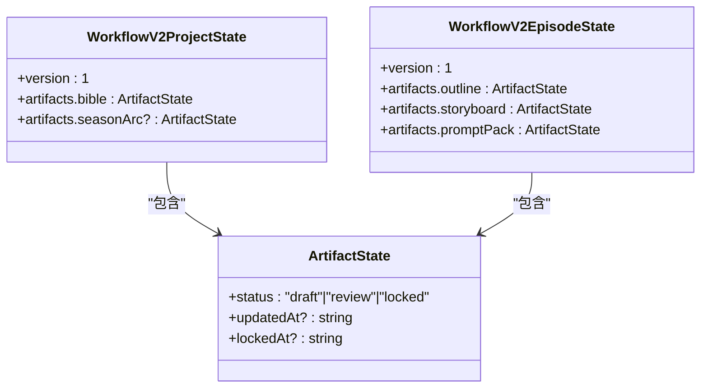
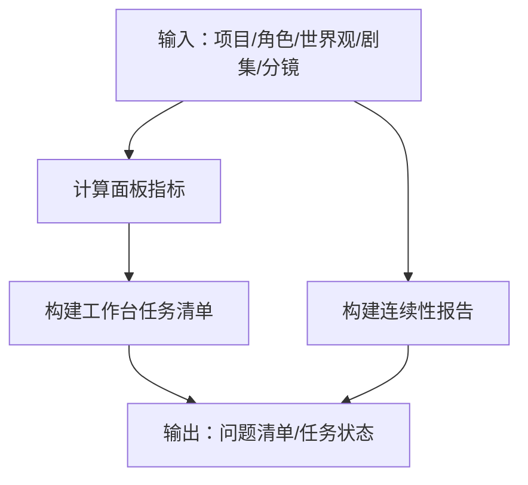
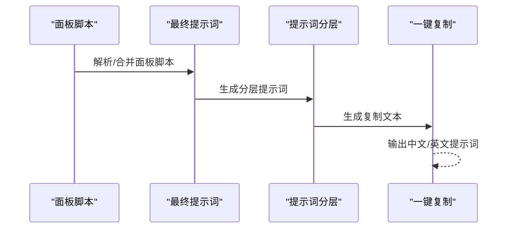
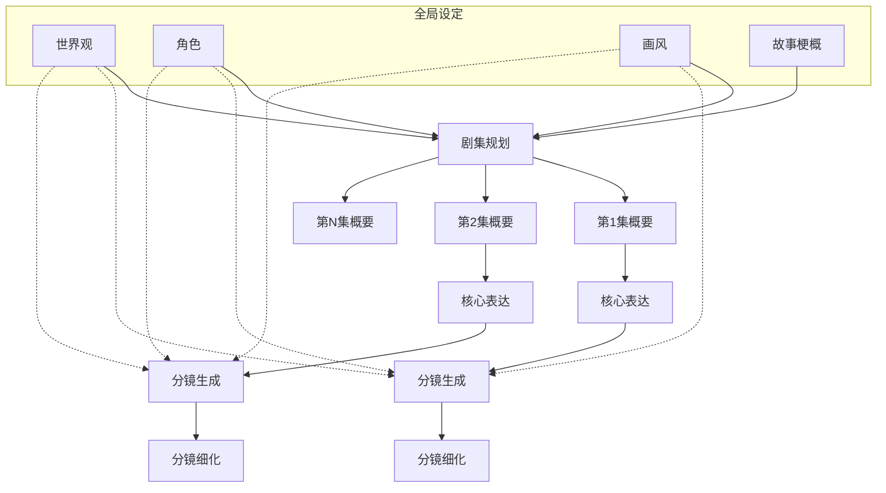
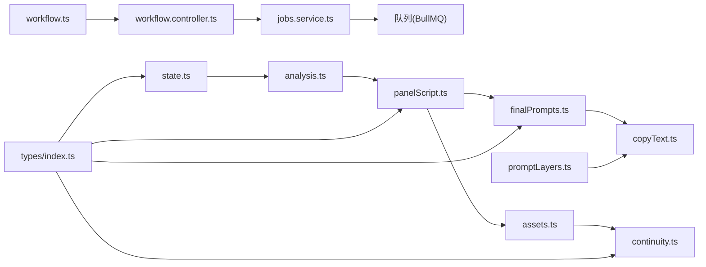

# 工作流API

<cite>
**本文引用的文件**
- [apps/web/src/lib/api/workflow.ts](file://apps/web/src/lib/api/workflow.ts)
- [apps/api/src/jobs/workflow.controller.ts](file://apps/api/src/jobs/workflow.controller.ts)
- [apps/api/src/jobs/jobs.service.ts](file://apps/api/src/jobs/jobs.service.ts)
- [apps/web/src/lib/workflowV2/state.ts](file://apps/web/src/lib/workflowV2/state.ts)
- [apps/web/src/lib/workflowV2/analysis.ts](file://apps/web/src/lib/workflowV2/analysis.ts)
- [apps/web/src/lib/workflowV2/panelScript.ts](file://apps/web/src/lib/workflowV2/panelScript.ts)
- [apps/web/src/lib/workflowV2/continuity.ts](file://apps/web/src/lib/workflowV2/continuity.ts)
- [apps/web/src/lib/workflowV2/finalPrompts.ts](file://apps/web/src/lib/workflowV2/finalPrompts.ts)
- [apps/web/src/lib/workflowV2/assets.ts](file://apps/web/src/lib/workflowV2/assets.ts)
- [apps/web/src/lib/workflowV2/promptLayers.ts](file://apps/web/src/lib/workflowV2/promptLayers.ts)
- [apps/web/src/lib/workflowV2/copyText.ts](file://apps/web/src/lib/workflowV2/copyText.ts)
- [apps/web/src/types/index.ts](file://apps/web/src/types/index.ts)
- [docs/prd/episode-planning-workflow.md](file://docs/prd/episode-planning-workflow.md)
</cite>

## 目录

1. [简介](#简介)
2. [项目结构](#项目结构)
3. [核心组件](#核心组件)
4. [架构总览](#架构总览)
5. [详细组件分析](#详细组件分析)
6. [依赖分析](#依赖分析)
7. [性能考量](#性能考量)
8. [故障排查指南](#故障排查指南)
9. [结论](#结论)
10. [附录](#附录)

## 简介

本文件系统化梳理 AIXSSS 前端应用的工作流 API，围绕创作工作流的状态管理、步骤控制与流程编排展开，重点覆盖以下方面：

- 工作流状态与产物（Artifacts）管理：项目与剧集维度的“状态-产物”视角，支持草稿/审核/锁定三态与版本化。
- 剧集规划与单集创作：从“全局设定”到“N 集规划”，再到“单集核心表达→分镜生成→细化”的闭环。
- 场景补丁队列与进度追踪：基于队列的任务编排、进度桥接与错误恢复。
- 版本化提示词与资产清单：分镜脚本标准化、提示词分层与一键复制导出。
- 可视化工作台与连续性检查：工作台任务清单、问题诊断与跨集一致性报告。

## 项目结构

前端工作流 API 主要分布在以下模块：

- API 封装层：封装后端工作流接口，统一请求与参数。
- 控制器与服务层：后端控制器接收请求并入队，服务层负责权限校验、入队与进度读取。
- 工作流 V2 前端工具：状态归一化、分析与诊断、面板脚本与提示词构建、资产清单解析、提示词分层与一键复制。

**图表来源**

- [apps/web/src/lib/api/workflow.ts](file://apps/web/src/lib/api/workflow.ts#L1-L302)
- [apps/api/src/jobs/workflow.controller.ts](file://apps/api/src/jobs/workflow.controller.ts#L44-L266)
- [apps/api/src/jobs/jobs.service.ts](file://apps/api/src/jobs/jobs.service.ts#L37-L1055)
- [apps/web/src/lib/workflowV2/state.ts](file://apps/web/src/lib/workflowV2/state.ts#L1-L139)
- [apps/web/src/lib/workflowV2/analysis.ts](file://apps/web/src/lib/workflowV2/analysis.ts#L1-L444)
- [apps/web/src/lib/workflowV2/panelScript.ts](file://apps/web/src/lib/workflowV2/panelScript.ts#L1-L345)
- [apps/web/src/lib/workflowV2/continuity.ts](file://apps/web/src/lib/workflowV2/continuity.ts#L1-L390)
- [apps/web/src/lib/workflowV2/finalPrompts.ts](file://apps/web/src/lib/workflowV2/finalPrompts.ts#L1-L231)
- [apps/web/src/lib/workflowV2/assets.ts](file://apps/web/src/lib/workflowV2/assets.ts#L1-L137)
- [apps/web/src/lib/workflowV2/promptLayers.ts](file://apps/web/src/lib/workflowV2/promptLayers.ts#L1-L82)
- [apps/web/src/lib/workflowV2/copyText.ts](file://apps/web/src/lib/workflowV2/copyText.ts#L1-L138)

**章节来源**

- [apps/web/src/lib/api/workflow.ts](file://apps/web/src/lib/api/workflow.ts#L1-L302)
- [apps/api/src/jobs/workflow.controller.ts](file://apps/api/src/jobs/workflow.controller.ts#L44-L266)
- [apps/api/src/jobs/jobs.service.ts](file://apps/api/src/jobs/jobs.service.ts#L37-L1055)

## 核心组件

- 工作流 API 封装：提供剧集规划、叙事因果链构建、单集/分镜各阶段生成与细化等接口，统一返回 AIJob。
- 作业服务：负责权限校验、项目可规划性校验、入队与进度读取，支持取消。
- 工作流 V2 状态：将项目/剧集产物抽象为“状态-产物”，支持 draft/review/locked 三态与时间戳。
- 分析与诊断：计算面板指标、构建工作台任务、识别连续性问题。
- 面板脚本与提示词：标准化面板脚本结构，构建最终提示词包与分层提示词，支持一键复制。
- 资产清单与连续性：解析场景资产清单，生成连续性报告，辅助跨集一致性。

**章节来源**

- [apps/web/src/lib/api/workflow.ts](file://apps/web/src/lib/api/workflow.ts#L1-L302)
- [apps/api/src/jobs/jobs.service.ts](file://apps/api/src/jobs/jobs.service.ts#L37-L1055)
- [apps/web/src/lib/workflowV2/state.ts](file://apps/web/src/lib/workflowV2/state.ts#L1-L139)
- [apps/web/src/lib/workflowV2/analysis.ts](file://apps/web/src/lib/workflowV2/analysis.ts#L1-L444)
- [apps/web/src/lib/workflowV2/panelScript.ts](file://apps/web/src/lib/workflowV2/panelScript.ts#L1-L345)
- [apps/web/src/lib/workflowV2/finalPrompts.ts](file://apps/web/src/lib/workflowV2/finalPrompts.ts#L1-L231)
- [apps/web/src/lib/workflowV2/assets.ts](file://apps/web/src/lib/workflowV2/assets.ts#L1-L137)
- [apps/web/src/lib/workflowV2/continuity.ts](file://apps/web/src/lib/workflowV2/continuity.ts#L1-L390)

## 架构总览

工作流 API 采用“前端封装 → 后端控制器 → 作业服务 → 队列任务”的分层设计。前端通过封装好的 API 发起工作流任务，后端进行权限与业务校验后入队，Worker 执行具体任务并回写结果，前端通过轮询 AIJob 获取进度与结果。

**图表来源**

- [apps/web/src/lib/api/workflow.ts](file://apps/web/src/lib/api/workflow.ts#L1-L302)
- [apps/api/src/jobs/workflow.controller.ts](file://apps/api/src/jobs/workflow.controller.ts#L44-L266)
- [apps/api/src/jobs/jobs.service.ts](file://apps/api/src/jobs/jobs.service.ts#L37-L1055)

## 详细组件分析

### 工作流 API 封装（前端）

- 提供剧集规划、叙事因果链构建、单集核心表达、分镜列表、场景锚点、关键帧提示词、分镜细化、视频生成等接口。
- 统一参数校验与错误提示，返回 AIJob 以便前端轮询进度与结果。
- 支持批量任务（如批量生成核心表达、批量细化分镜）。

**图表来源**

- [apps/web/src/lib/api/workflow.ts](file://apps/web/src/lib/api/workflow.ts#L4-L302)

**章节来源**

- [apps/web/src/lib/api/workflow.ts](file://apps/web/src/lib/api/workflow.ts#L1-L302)

### 后端控制器与作业服务

- 控制器：接收请求、参数校验（Zod）、鉴权（JWT），调用作业服务入队。
- 作业服务：权限校验、项目可规划性校验、入队（带重试与清理策略）、进度读取、取消作业。
- 作业类型覆盖：剧集规划、核心表达、分镜列表、场景锚点、关键帧提示词、运动提示词、对话、细化、视频生成等。

**图表来源**

- [apps/api/src/jobs/workflow.controller.ts](file://apps/api/src/jobs/workflow.controller.ts#L44-L266)
- [apps/api/src/jobs/jobs.service.ts](file://apps/api/src/jobs/jobs.service.ts#L37-L1055)

**章节来源**

- [apps/api/src/jobs/workflow.controller.ts](file://apps/api/src/jobs/workflow.controller.ts#L44-L266)
- [apps/api/src/jobs/jobs.service.ts](file://apps/api/src/jobs/jobs.service.ts#L37-L1055)

### 工作流 V2 状态与产物

- 项目级与剧集级产物抽象：bible、seasonArc（可选）、outline、storyboard、promptPack 等。
- 状态三态：draft/review/locked，支持 updatedAt/lockedAt 时间戳。
- 提供构建补丁方法，用于在 contextCache 中增量更新产物状态。

**图表来源**

- [apps/web/src/lib/workflowV2/state.ts](file://apps/web/src/lib/workflowV2/state.ts#L27-L139)
- [apps/web/src/types/index.ts](file://apps/web/src/types/index.ts#L264-L294)

**章节来源**

- [apps/web/src/lib/workflowV2/state.ts](file://apps/web/src/lib/workflowV2/state.ts#L1-L139)
- [apps/web/src/types/index.ts](file://apps/web/src/types/index.ts#L240-L294)

### 分析与诊断（工作台与连续性）

- 问题诊断：项目/剧集/分镜层面的问题清单，含级别（error/warn/info）与作用域。
- 指标计算：面板指标（对白行数/字符数/估计时长）、剧集指标（面板数/总字符/总时长/平均每格时长）。
- 连续性检查：跨集地点/角色/道具/时间天气一致性，生成连续性报告与统计。

**图表来源**

- [apps/web/src/lib/workflowV2/analysis.ts](file://apps/web/src/lib/workflowV2/analysis.ts#L59-L91)
- [apps/web/src/lib/workflowV2/continuity.ts](file://apps/web/src/lib/workflowV2/continuity.ts#L80-L390)

**章节来源**

- [apps/web/src/lib/workflowV2/analysis.ts](file://apps/web/src/lib/workflowV2/analysis.ts#L1-L444)
- [apps/web/src/lib/workflowV2/continuity.ts](file://apps/web/src/lib/workflowV2/continuity.ts#L1-L390)

### 面板脚本与提示词

- 面板脚本标准化：location/timeOfDay/camera/blocking/props/assets/prompts/metrics/source 等字段的归一化与合并。
- 最终提示词包：基于画风与面板脚本生成图像提示词、负向提示词与 I2V 提示词。
- 提示词分层：base/episode/delta 三层提示词，便于复制与复用。
- 一键复制：生成 img2img/i2v 的完整复制文本，包含输入图片、参数建议与最终提示词。

**图表来源**

- [apps/web/src/lib/workflowV2/panelScript.ts](file://apps/web/src/lib/workflowV2/panelScript.ts#L207-L345)
- [apps/web/src/lib/workflowV2/finalPrompts.ts](file://apps/web/src/lib/workflowV2/finalPrompts.ts#L193-L231)
- [apps/web/src/lib/workflowV2/promptLayers.ts](file://apps/web/src/lib/workflowV2/promptLayers.ts#L21-L82)
- [apps/web/src/lib/workflowV2/copyText.ts](file://apps/web/src/lib/workflowV2/copyText.ts#L23-L138)

**章节来源**

- [apps/web/src/lib/workflowV2/panelScript.ts](file://apps/web/src/lib/workflowV2/panelScript.ts#L1-L345)
- [apps/web/src/lib/workflowV2/finalPrompts.ts](file://apps/web/src/lib/workflowV2/finalPrompts.ts#L1-L231)
- [apps/web/src/lib/workflowV2/promptLayers.ts](file://apps/web/src/lib/workflowV2/promptLayers.ts#L1-L82)
- [apps/web/src/lib/workflowV2/copyText.ts](file://apps/web/src/lib/workflowV2/copyText.ts#L1-L138)

### 资产清单与解析

- 资产清单解析：合并场景脚本与角色库默认参考图，生成去重后的资产清单与角色差量指令。
- 用于连续性检查与一键复制，确保输入图片与参数建议的可复用性。

**章节来源**

- [apps/web/src/lib/workflowV2/assets.ts](file://apps/web/src/lib/workflowV2/assets.ts#L1-L137)

### 剧集规划与单集创作（概念流程）

- 剧集规划：基于全局设定生成 N 集规划，支持目标集数覆盖与版本化。
- 单集创作：核心表达→分镜生成→细化，贯穿全局设定与上下文缓存。
- 导出：覆盖全局设定、剧集规划与每集产物。

**图表来源**

- [docs/prd/episode-planning-workflow.md](file://docs/prd/episode-planning-workflow.md#L50-L118)

**章节来源**

- [docs/prd/episode-planning-workflow.md](file://docs/prd/episode-planning-workflow.md#L1-L627)

## 依赖分析

- 前端 API 封装依赖后端控制器与作业服务，返回 AIJob 以便前端轮询。
- 工作流 V2 工具链之间存在清晰依赖：状态 → 分析 → 面板脚本 → 提示词 → 一键复制。
- 类型定义集中于前端 types，涵盖工作流状态、产物状态、面板脚本、资产清单等。

**图表来源**

- [apps/web/src/lib/api/workflow.ts](file://apps/web/src/lib/api/workflow.ts#L1-L302)
- [apps/api/src/jobs/workflow.controller.ts](file://apps/api/src/jobs/workflow.controller.ts#L44-L266)
- [apps/api/src/jobs/jobs.service.ts](file://apps/api/src/jobs/jobs.service.ts#L37-L1055)
- [apps/web/src/lib/workflowV2/state.ts](file://apps/web/src/lib/workflowV2/state.ts#L1-L139)
- [apps/web/src/lib/workflowV2/analysis.ts](file://apps/web/src/lib/workflowV2/analysis.ts#L1-L444)
- [apps/web/src/lib/workflowV2/panelScript.ts](file://apps/web/src/lib/workflowV2/panelScript.ts#L1-L345)
- [apps/web/src/lib/workflowV2/finalPrompts.ts](file://apps/web/src/lib/workflowV2/finalPrompts.ts#L1-L231)
- [apps/web/src/lib/workflowV2/assets.ts](file://apps/web/src/lib/workflowV2/assets.ts#L1-L137)
- [apps/web/src/lib/workflowV2/continuity.ts](file://apps/web/src/lib/workflowV2/continuity.ts#L1-L390)
- [apps/web/src/lib/workflowV2/promptLayers.ts](file://apps/web/src/lib/workflowV2/promptLayers.ts#L1-L82)
- [apps/web/src/lib/workflowV2/copyText.ts](file://apps/web/src/lib/workflowV2/copyText.ts#L1-L138)
- [apps/web/src/types/index.ts](file://apps/web/src/types/index.ts#L240-L620)

**章节来源**

- [apps/web/src/types/index.ts](file://apps/web/src/types/index.ts#L240-L620)

## 性能考量

- 队列重试与退避：多数任务采用指数退避与最多两次尝试，降低瞬时失败率。
- 结果清理策略：完成/失败任务保留一定数量，避免无限增长。
- 令牌用量可观测：作业结果包含 tokenUsage，便于成本与性能分析。
- 前端轮询：通过 AIJob.progress 与轮询减少阻塞，提升交互流畅度。

**章节来源**

- [apps/api/src/jobs/jobs.service.ts](file://apps/api/src/jobs/jobs.service.ts#L136-L146)
- [apps/api/src/jobs/jobs.service.ts](file://apps/api/src/jobs/jobs.service.ts#L706-L711)
- [apps/api/src/jobs/jobs.service.ts](file://apps/api/src/jobs/jobs.service.ts#L930-L947)

## 故障排查指南

- 400 错误：全局设定不满足可规划门槛（缺失字段）、目标集数越界、核心表达缺失等。
- 404 错误：项目/剧集/分镜不存在或不属于当前团队。
- 409 冲突：作业已完成（成功/失败/取消），无法再次取消。
- 取消作业：仅对未完成作业生效，移除队列并标记为取消。
- 重试策略：指数退避，失败后保留作业以便审计与重试。

**章节来源**

- [apps/api/src/jobs/workflow.controller.ts](file://apps/api/src/jobs/workflow.controller.ts#L9-L30)
- [apps/api/src/jobs/jobs.service.ts](file://apps/api/src/jobs/jobs.service.ts#L1030-L1053)

## 结论

AIXSSS 工作流 API 以“项目/剧集产物状态 + 任务队列”的方式实现了从“全局设定”到“单集创作”的完整编排。前端通过统一 API 封装与工作流 V2 工具链，提供了状态归一化、问题诊断、提示词构建与一键复制等能力，既保证了创作一致性，又提升了可扩展性与可维护性。

## 附录

- 使用示例（路径指引）
  - 剧集规划：[apiWorkflowPlanEpisodes](file://apps/web/src/lib/api/workflow.ts#L4-L21)
  - 构建叙事因果链：[apiWorkflowBuildNarrativeCausalChain](file://apps/web/src/lib/api/workflow.ts#L23-L44)
  - 生成核心表达：[apiWorkflowGenerateEpisodeCoreExpression](file://apps/web/src/lib/api/workflow.ts#L46-L57)
  - 生成分镜列表：[apiWorkflowGenerateEpisodeSceneList](file://apps/web/src/lib/api/workflow.ts#L80-L100)
  - 生成场景锚点：[apiWorkflowGenerateSceneAnchor](file://apps/web/src/lib/api/workflow.ts#L115-L126)
  - 生成关键帧提示词：[apiWorkflowGenerateKeyframePrompt](file://apps/web/src/lib/api/workflow.ts#L128-L139)
  - 生成运动提示词：[apiWorkflowGenerateMotionPrompt](file://apps/web/src/lib/api/workflow.ts#L247-L258)
  - 生成对话：[apiWorkflowGenerateDialogue](file://apps/web/src/lib/api/workflow.ts#L260-L271)
  - 细化单分镜：[apiWorkflowRefineSceneAll](file://apps/web/src/lib/api/workflow.ts#L273-L284)
  - 批量细化分镜：[apiWorkflowRefineAllScenes](file://apps/web/src/lib/api/workflow.ts#L286-L301)
- 状态转换与产物
  - 项目/剧集产物状态：[WorkflowV2ProjectState/WorkflowV2EpisodeState](file://apps/web/src/types/index.ts#L274-L294)
  - 状态归一化与补丁构建：[getProjectWorkflowV2/getEpisodeWorkflowV2/build\*Patch](file://apps/web/src/lib/workflowV2/state.ts#L27-L139)
- 工作台与连续性
  - 问题与指标：[buildProjectIssues/buildEpisodeIssues/compute\*](file://apps/web/src/lib/workflowV2/analysis.ts#L93-L444)
  - 连续性报告：[buildContinuityReport](file://apps/web/src/lib/workflowV2/continuity.ts#L80-L390)
- 提示词与复制
  - 面板脚本与最终提示词：[getPanelScript/buildFinalPromptPack](file://apps/web/src/lib/workflowV2/panelScript.ts#L255-L281)
  - 提示词分层与一键复制：[buildPromptLayers/buildImg2ImgPackCopyText](file://apps/web/src/lib/workflowV2/promptLayers.ts#L21-L82), [apps/web/src/lib/workflowV2/copyText.ts](file://apps/web/src/lib/workflowV2/copyText.ts#L23-L138)
