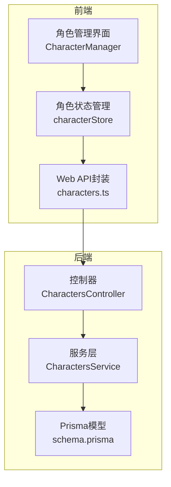
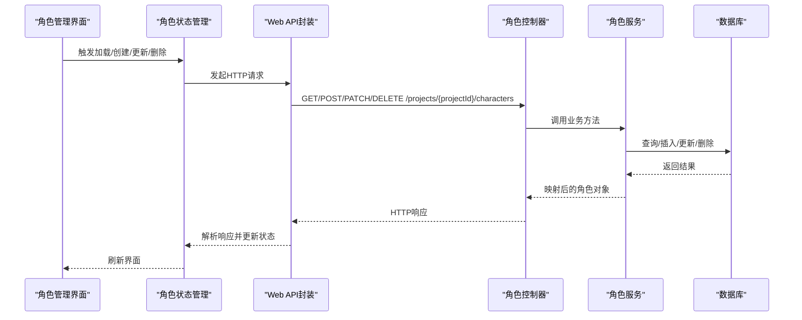
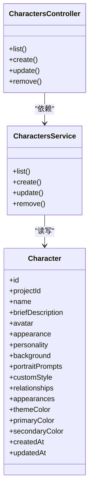

# 角色管理API

<cite>
**本文档引用的文件**
- [apps/api/src/characters/characters.controller.ts](file://apps/api/src/characters/characters.controller.ts)
- [apps/api/src/characters/characters.service.ts](file://apps/api/src/characters/characters.service.ts)
- [apps/api/src/characters/characters.module.ts](file://apps/api/src/characters/characters.module.ts)
- [apps/api/prisma/schema.prisma](file://apps/api/prisma/schema.prisma)
- [packages/shared/src/schemas/character.ts](file://packages/shared/src/schemas/character.ts)
- [apps/web/src/lib/api/characters.ts](file://apps/web/src/lib/api/characters.ts)
- [apps/web/src/stores/characterStore.ts](file://apps/web/src/stores/characterStore.ts)
- [apps/web/src/types/index.ts](file://apps/web/src/types/index.ts)
- [apps/web/src/lib/ai/contextBuilder.ts](file://apps/web/src/lib/ai/contextBuilder.ts)
- [apps/web/src/lib/ai/skills.ts](file://apps/web/src/lib/ai/skills.ts)
- [apps/web/src/components/editor/CharacterManager.tsx](file://apps/web/src/components/editor/CharacterManager.tsx)
</cite>

## 目录

1. [简介](#简介)
2. [项目结构](#项目结构)
3. [核心组件](#核心组件)
4. [架构总览](#架构总览)
5. [详细组件分析](#详细组件分析)
6. [依赖关系分析](#依赖关系分析)
7. [性能考虑](#性能考虑)
8. [故障排除指南](#故障排除指南)
9. [结论](#结论)
10. [附录](#附录)

## 简介

本文件面向AIXSSS前端应用的角色管理API，系统性说明角色的创建、编辑、删除与关系管理能力；详解角色设定、出场记录与关系图谱的维护机制；阐述角色与项目、场景的关联关系及数据同步策略；并提供搜索、筛选与批量操作的实现思路与最佳实践。文档同时给出API使用示例、数据结构说明与扩展配置建议，帮助开发者快速集成与定制。

## 项目结构

角色管理涉及三层协作：

- 后端API层：提供REST接口，负责鉴权、参数校验与数据库访问
- 数据模型层：基于Prisma定义角色实体及其字段
- 前端API与状态层：封装HTTP请求、本地/云端存储切换与UI状态管理

图表来源

- [apps/web/src/components/editor/CharacterManager.tsx](file://apps/web/src/components/editor/CharacterManager.tsx#L2680-L2963)
- [apps/web/src/stores/characterStore.ts](file://apps/web/src/stores/characterStore.ts#L147-L337)
- [apps/web/src/lib/api/characters.ts](file://apps/web/src/lib/api/characters.ts#L1-L76)
- [apps/api/src/characters/characters.controller.ts](file://apps/api/src/characters/characters.controller.ts#L1-L47)
- [apps/api/src/characters/characters.service.ts](file://apps/api/src/characters/characters.service.ts#L23-L118)
- [apps/api/prisma/schema.prisma](file://apps/api/prisma/schema.prisma#L235-L257)

章节来源

- [apps/api/src/characters/characters.controller.ts](file://apps/api/src/characters/characters.controller.ts#L1-L47)
- [apps/api/src/characters/characters.service.ts](file://apps/api/src/characters/characters.service.ts#L23-L118)
- [apps/api/prisma/schema.prisma](file://apps/api/prisma/schema.prisma#L235-L257)
- [apps/web/src/lib/api/characters.ts](file://apps/web/src/lib/api/characters.ts#L1-L76)
- [apps/web/src/stores/characterStore.ts](file://apps/web/src/stores/characterStore.ts#L147-L337)

## 核心组件

- 角色控制器：暴露REST端点，统一鉴权与参数解析
- 角色服务：封装业务逻辑，执行项目归属校验、CRUD与映射
- 角色实体：数据库模型，支持外观、个性、背景、定妆照提示词、自定义画风、关系图谱与出场记录等字段
- 前端API封装：提供列表、创建、更新、删除等方法
- 前端状态管理：统一管理角色列表、当前选中角色、加载状态，并支持本地/云端两种持久化模式

章节来源

- [apps/api/src/characters/characters.controller.ts](file://apps/api/src/characters/characters.controller.ts#L9-L44)
- [apps/api/src/characters/characters.service.ts](file://apps/api/src/characters/characters.service.ts#L23-L118)
- [apps/api/prisma/schema.prisma](file://apps/api/prisma/schema.prisma#L235-L257)
- [apps/web/src/lib/api/characters.ts](file://apps/web/src/lib/api/characters.ts#L1-L76)
- [apps/web/src/stores/characterStore.ts](file://apps/web/src/stores/characterStore.ts#L122-L337)

## 架构总览

角色管理采用“鉴权+参数校验+服务层+数据库”的标准分层架构。前端通过Web API封装调用后端控制器，控制器委托服务层执行业务规则，服务层通过Prisma访问数据库。角色数据在前端既有本地存储（开发/离线场景），也支持云端持久化（生产环境）。

图表来源

- [apps/web/src/lib/api/characters.ts](file://apps/web/src/lib/api/characters.ts#L6-L75)
- [apps/api/src/characters/characters.controller.ts](file://apps/api/src/characters/characters.controller.ts#L14-L43)
- [apps/api/src/characters/characters.service.ts](file://apps/api/src/characters/characters.service.ts#L35-L114)

## 详细组件分析

### 角色API接口定义

- 鉴权：所有端点均受JWT保护
- 列表查询：GET /projects/{projectId}/characters
- 创建角色：POST /projects/{projectId}/characters
- 更新角色：PATCH /projects/{projectId}/characters/{characterId}
- 删除角色：DELETE /projects/{projectId}/characters/{characterId}

请求与响应要点

- 请求体参数由共享Zod Schema进行强类型校验
- 响应时间戳统一为ISO字符串
- 服务层对项目归属进行校验，确保操作权限

章节来源

- [apps/api/src/characters/characters.controller.ts](file://apps/api/src/characters/characters.controller.ts#L9-L44)
- [packages/shared/src/schemas/character.ts](file://packages/shared/src/schemas/character.ts#L3-L29)
- [apps/api/src/characters/characters.service.ts](file://apps/api/src/characters/characters.service.ts#L10-L21)

### 角色数据模型与字段

角色实体包含以下关键字段：

- 基础信息：id、projectId、name、briefDescription、avatar
- 描述信息：appearance、personality、background
- 视觉与风格：portraitPrompts（多格式定妆照提示词）、customStyle（自定义画风）
- 关系图谱：relationships（数组，包含目标角色ID、关系类型、描述）
- 出场记录：appearances（数组，包含场景ID、角色类型、备注）
- 主题色：themeColor（兼容字段）、primaryColor、secondaryColor
- 时间戳：createdAt、updatedAt

章节来源

- [apps/api/prisma/schema.prisma](file://apps/api/prisma/schema.prisma#L235-L257)
- [apps/web/src/types/index.ts](file://apps/web/src/types/index.ts#L852-L891)

### 前端API封装与状态管理

- Web API封装：提供列表、创建、更新、删除方法，自动序列化/反序列化请求体
- 状态管理：支持本地存储与云端模式切换；提供加载、新增、更新、删除、记录出场、更新定妆照提示词等操作
- 数据归一化：统一处理portraitPrompts、relationships、appearances等复杂字段，保证类型安全

章节来源

- [apps/web/src/lib/api/characters.ts](file://apps/web/src/lib/api/characters.ts#L1-L76)
- [apps/web/src/stores/characterStore.ts](file://apps/web/src/stores/characterStore.ts#L147-L337)

### 角色关系与出场记录管理

- 关系管理：支持添加/编辑角色间的关系，包括目标角色ID、关系类型与描述
- 出场记录：支持为角色登记在特定场景中的出场情况，包括角色类型（主要/配角/背景）与备注
- AI上下文注入：在构建场景/分镜上下文时，可选择性地注入角色的主题色与定妆照参考片段

章节来源

- [apps/web/src/stores/characterStore.ts](file://apps/web/src/stores/characterStore.ts#L61-L92)
- [apps/web/src/lib/ai/contextBuilder.ts](file://apps/web/src/lib/ai/contextBuilder.ts#L104-L163)

### 角色与项目、场景的关联关系

- 项目关联：角色属于项目（projectId），服务层在CRUD前校验项目归属
- 场景关联：通过appearances字段记录角色在各场景中的出场情况
- 工作流集成：角色信息参与AI上下文构建，影响分镜生成与画面一致性

章节来源

- [apps/api/src/characters/characters.service.ts](file://apps/api/src/characters/characters.service.ts#L27-L33)
- [apps/api/prisma/schema.prisma](file://apps/api/prisma/schema.prisma#L235-L257)

### 数据同步机制

- 云端优先：生产环境启用isApiMode时，前端直接与后端同步；失败回退到本地存储
- 乐观更新：前端先更新本地状态，再异步提交后端；成功后以服务端返回为准进行归一化
- 一致性保障：服务层统一映射时间戳，避免前后端时间格式差异导致的显示问题

章节来源

- [apps/web/src/stores/characterStore.ts](file://apps/web/src/stores/characterStore.ts#L152-L179)
- [apps/web/src/stores/characterStore.ts](file://apps/web/src/stores/characterStore.ts#L181-L213)
- [apps/web/src/stores/characterStore.ts](file://apps/web/src/stores/characterStore.ts#L215-L238)
- [apps/web/src/stores/characterStore.ts](file://apps/web/src/stores/characterStore.ts#L240-L255)
- [apps/web/src/stores/characterStore.ts](file://apps/web/src/stores/characterStore.ts#L261-L303)
- [apps/web/src/stores/characterStore.ts](file://apps/web/src/stores/characterStore.ts#L305-L332)

### 角色搜索、筛选与批量操作

- 搜索与筛选：前端可通过store提供的过滤方法按项目ID检索角色；复杂筛选建议在后端实现（当前端已具备基础过滤能力）
- 批量操作：前端提供批量操作结构（类型、目标ID集合、参数），可用于批量生成、编辑、删除、导出等场景

章节来源

- [apps/web/src/stores/characterStore.ts](file://apps/web/src/stores/characterStore.ts#L334-L337)
- [apps/web/src/types/index.ts](file://apps/web/src/types/index.ts#L922-L927)

### API使用示例与最佳实践

- 使用示例（路径引用）
  - 列表查询：[apiListCharacters](file://apps/web/src/lib/api/characters.ts#L6-L10)
  - 创建角色：[apiCreateCharacter](file://apps/web/src/lib/api/characters.ts#L12-L38)
  - 更新角色：[apiUpdateCharacter](file://apps/web/src/lib/api/characters.ts#L40-L68)
  - 删除角色：[apiDeleteCharacter](file://apps/web/src/lib/api/characters.ts#L70-L75)
- 最佳实践
  - 始终在创建/更新时传入最小必要字段，避免冗余更新
  - 使用relationships与appearances时保持结构一致性，确保前端渲染稳定
  - 在云端模式下，注意网络异常的回退策略与错误提示

章节来源

- [apps/web/src/lib/api/characters.ts](file://apps/web/src/lib/api/characters.ts#L1-L76)

### 角色系统的扩展与自定义配置

- 字段扩展：可在Prisma模型中新增字段，并在前端类型与API封装中同步扩展
- 画风与定妆照：通过customStyle与portraitPrompts实现角色级个性化；AI技能可读取primaryColor/secondaryColor增强一致性
- 关系图谱：支持多维关系建模，便于构建角色网络分析与剧情走向推演

章节来源

- [apps/api/prisma/schema.prisma](file://apps/api/prisma/schema.prisma#L235-L257)
- [apps/web/src/types/index.ts](file://apps/web/src/types/index.ts#L837-L877)
- [apps/web/src/lib/ai/skills.ts](file://apps/web/src/lib/ai/skills.ts#L341-L365)

## 依赖关系分析

图表来源

- [apps/api/src/characters/characters.controller.ts](file://apps/api/src/characters/characters.controller.ts#L11-L43)
- [apps/api/src/characters/characters.service.ts](file://apps/api/src/characters/characters.service.ts#L24-L114)
- [apps/api/prisma/schema.prisma](file://apps/api/prisma/schema.prisma#L235-L257)

章节来源

- [apps/api/src/characters/characters.controller.ts](file://apps/api/src/characters/characters.controller.ts#L1-L47)
- [apps/api/src/characters/characters.service.ts](file://apps/api/src/characters/characters.service.ts#L1-L118)
- [apps/api/prisma/schema.prisma](file://apps/api/prisma/schema.prisma#L235-L257)

## 性能考虑

- 列表排序：按updatedAt倒序返回，便于前端展示最新变更
- 云端模式：优先使用后端持久化，减少本地存储压力
- 乐观更新：降低用户等待时间，配合失败回滚提升体验
- 字段选择：仅传输必要字段，避免大字段频繁更新造成网络与存储开销

## 故障排除指南

- 404错误：检查projectId与characterId是否正确，确认项目归属与角色存在性
- 参数校验失败：核对请求体字段长度与格式，参考共享Schema约束
- 云端同步失败：检查网络状态与后端可用性，必要时回退到本地模式

章节来源

- [apps/api/src/characters/characters.service.ts](file://apps/api/src/characters/characters.service.ts#L27-L33)
- [apps/api/src/characters/characters.service.ts](file://apps/api/src/characters/characters.service.ts#L70-L77)
- [apps/api/src/characters/characters.service.ts](file://apps/api/src/characters/characters.service.ts#L104-L111)

## 结论

角色管理API通过清晰的分层设计与严格的参数校验，提供了稳定的角色生命周期管理能力。结合前端状态管理与云端/本地双模式，既满足开发效率又兼顾生产可靠性。建议在实际项目中遵循字段最小化、关系规范化与一致性优先的原则，持续扩展角色图谱与AI上下文注入能力。

## 附录

- 角色界面入口：角色管理面板
- 相关类型定义：Character、PortraitPrompts、CharacterRelationship、SceneAppearance

章节来源

- [apps/web/src/components/editor/CharacterManager.tsx](file://apps/web/src/components/editor/CharacterManager.tsx#L2680-L2963)
- [apps/web/src/types/index.ts](file://apps/web/src/types/index.ts#L852-L891)
