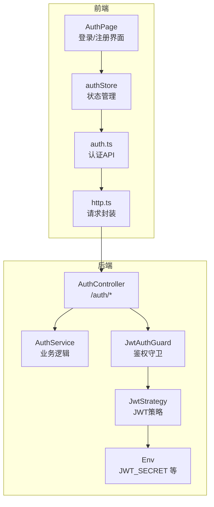
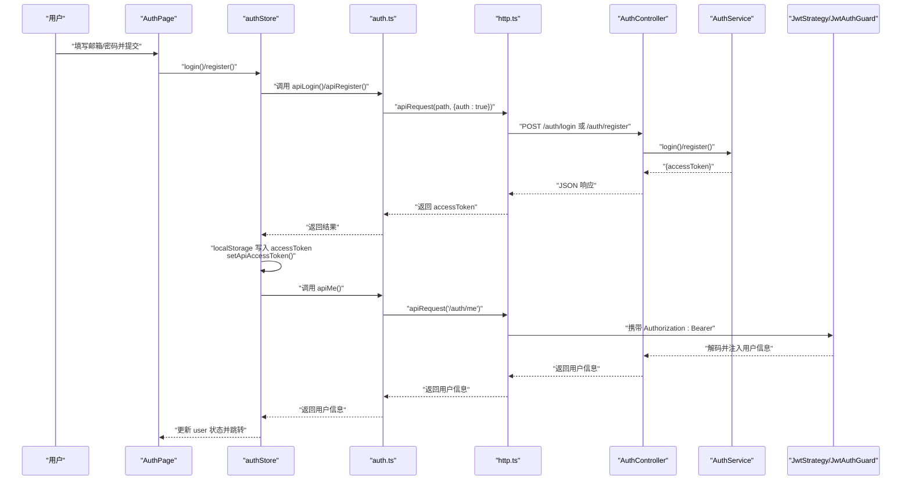
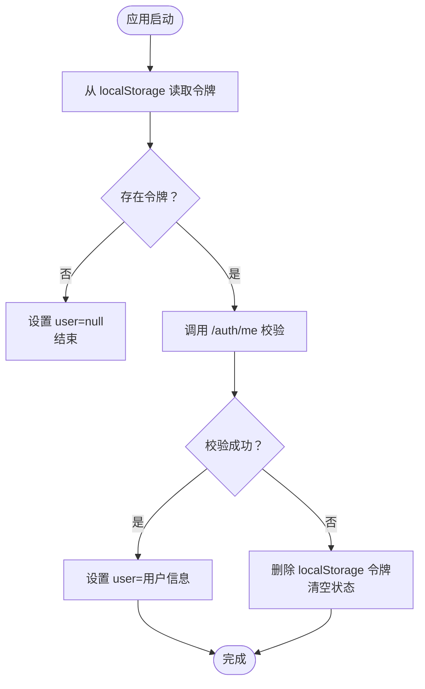
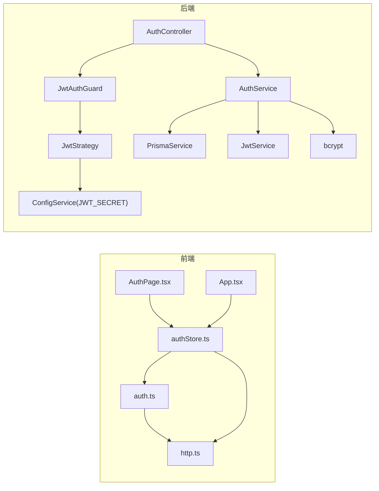

# 认证API

<cite>
**本文引用的文件**
- [apps/web/src/lib/api/auth.ts](file://apps/web/src/lib/api/auth.ts)
- [apps/web/src/lib/api/http.ts](file://apps/web/src/lib/api/http.ts)
- [apps/web/src/stores/authStore.ts](file://apps/web/src/stores/authStore.ts)
- [apps/web/src/components/AuthPage.tsx](file://apps/web/src/components/AuthPage.tsx)
- [apps/web/src/App.tsx](file://apps/web/src/App.tsx)
- [apps/api/src/auth/auth.controller.ts](file://apps/api/src/auth/auth.controller.ts)
- [apps/api/src/auth/auth.service.ts](file://apps/api/src/auth/auth.service.ts)
- [apps/api/src/auth/jwt-auth.guard.ts](file://apps/api/src/auth/jwt-auth.guard.ts)
- [apps/api/src/auth/current-user.decorator.ts](file://apps/api/src/auth/current-user.decorator.ts)
- [apps/api/src/auth/jwt.strategy.ts](file://apps/api/src/auth/jwt.strategy.ts)
- [apps/api/src/auth/auth.module.ts](file://apps/api/src/auth/auth.module.ts)
- [apps/api/src/config/env.ts](file://apps/api/src/config/env.ts)
- [packages/shared/src/schemas/auth.ts](file://packages/shared/src/schemas/auth.ts)
</cite>

## 目录

1. [简介](#简介)
2. [项目结构](#项目结构)
3. [核心组件](#核心组件)
4. [架构总览](#架构总览)
5. [详细组件分析](#详细组件分析)
6. [依赖关系分析](#依赖关系分析)
7. [性能考量](#性能考量)
8. [故障排查指南](#故障排查指南)
9. [结论](#结论)
10. [附录](#附录)

## 简介

本文件系统化梳理 AIXSSS 前端应用的认证 API，覆盖用户登录、注册、登出与“当前用户”查询接口；详解 JWT 令牌的获取、存储与携带机制；说明认证状态管理、自动登录与会话保持策略；并给出权限校验与角色验证的实现思路、完整流程示例、错误处理与安全建议，以及使用指南与最佳实践。

## 项目结构

认证相关代码主要分布在前端 Web 应用与后端 API 两部分：

- 前端负责用户界面、认证状态管理、HTTP 请求封装与令牌持久化
- 后端负责认证控制器、服务、JWT 策略与守卫、Zod 输入校验

图表来源

- [apps/web/src/components/AuthPage.tsx](file://apps/web/src/components/AuthPage.tsx#L1-L231)
- [apps/web/src/stores/authStore.ts](file://apps/web/src/stores/authStore.ts#L1-L82)
- [apps/web/src/lib/api/auth.ts](file://apps/web/src/lib/api/auth.ts#L1-L21)
- [apps/web/src/lib/api/http.ts](file://apps/web/src/lib/api/http.ts#L1-L93)
- [apps/api/src/auth/auth.controller.ts](file://apps/api/src/auth/auth.controller.ts#L1-L33)
- [apps/api/src/auth/auth.service.ts](file://apps/api/src/auth/auth.service.ts#L1-L77)
- [apps/api/src/auth/jwt-auth.guard.ts](file://apps/api/src/auth/jwt-auth.guard.ts#L1-L8)
- [apps/api/src/auth/jwt.strategy.ts](file://apps/api/src/auth/jwt.strategy.ts#L1-L34)
- [apps/api/src/config/env.ts](file://apps/api/src/config/env.ts#L1-L17)

章节来源

- [apps/web/src/components/AuthPage.tsx](file://apps/web/src/components/AuthPage.tsx#L1-L231)
- [apps/web/src/stores/authStore.ts](file://apps/web/src/stores/authStore.ts#L1-L82)
- [apps/web/src/lib/api/auth.ts](file://apps/web/src/lib/api/auth.ts#L1-L21)
- [apps/web/src/lib/api/http.ts](file://apps/web/src/lib/api/http.ts#L1-L93)
- [apps/api/src/auth/auth.controller.ts](file://apps/api/src/auth/auth.controller.ts#L1-L33)
- [apps/api/src/auth/auth.service.ts](file://apps/api/src/auth/auth.service.ts#L1-L77)
- [apps/api/src/auth/jwt-auth.guard.ts](file://apps/api/src/auth/jwt-auth.guard.ts#L1-L8)
- [apps/api/src/auth/jwt.strategy.ts](file://apps/api/src/auth/jwt.strategy.ts#L1-L34)
- [apps/api/src/config/env.ts](file://apps/api/src/config/env.ts#L1-L17)

## 核心组件

- 前端认证 API：提供注册、登录、查询当前用户三个接口
- 前端状态管理：负责令牌读取/写入、自动登录、错误状态与用户信息缓存
- 前端 HTTP 封装：统一设置 Authorization 头、错误解析与响应处理
- 后端认证控制器：暴露 /auth/register、/auth/login、/auth/me 接口
- 后端认证服务：实现注册、登录、签发访问令牌、密码哈希比对
- 后端 JWT 策略与守卫：从请求头提取 JWT 并进行解码与校验
- 共享输入校验：使用 Zod 对注册/登录参数进行严格校验

章节来源

- [apps/web/src/lib/api/auth.ts](file://apps/web/src/lib/api/auth.ts#L1-L21)
- [apps/web/src/stores/authStore.ts](file://apps/web/src/stores/authStore.ts#L1-L82)
- [apps/web/src/lib/api/http.ts](file://apps/web/src/lib/api/http.ts#L1-L93)
- [apps/api/src/auth/auth.controller.ts](file://apps/api/src/auth/auth.controller.ts#L1-L33)
- [apps/api/src/auth/auth.service.ts](file://apps/api/src/auth/auth.service.ts#L1-L77)
- [apps/api/src/auth/jwt-auth.guard.ts](file://apps/api/src/auth/jwt-auth.guard.ts#L1-L8)
- [apps/api/src/auth/jwt.strategy.ts](file://apps/api/src/auth/jwt.strategy.ts#L1-L34)
- [packages/shared/src/schemas/auth.ts](file://packages/shared/src/schemas/auth.ts#L1-L19)

## 架构总览

认证流程由前端触发，经 HTTP 层统一注入令牌，后端通过守卫与策略完成鉴权，控制器调用服务层执行业务逻辑并返回结果。

图表来源

- [apps/web/src/components/AuthPage.tsx](file://apps/web/src/components/AuthPage.tsx#L1-L231)
- [apps/web/src/stores/authStore.ts](file://apps/web/src/stores/authStore.ts#L1-L82)
- [apps/web/src/lib/api/auth.ts](file://apps/web/src/lib/api/auth.ts#L1-L21)
- [apps/web/src/lib/api/http.ts](file://apps/web/src/lib/api/http.ts#L1-L93)
- [apps/api/src/auth/auth.controller.ts](file://apps/api/src/auth/auth.controller.ts#L1-L33)
- [apps/api/src/auth/auth.service.ts](file://apps/api/src/auth/auth.service.ts#L1-L77)
- [apps/api/src/auth/jwt-auth.guard.ts](file://apps/api/src/auth/jwt-auth.guard.ts#L1-L8)
- [apps/api/src/auth/jwt.strategy.ts](file://apps/api/src/auth/jwt.strategy.ts#L1-L34)

## 详细组件分析

### 前端认证 API

- 注册接口：向 /auth/register 发送邮箱、密码与可选团队名，返回 accessToken
- 登录接口：向 /auth/login 发送邮箱、密码，返回 accessToken
- 当前用户接口：向 /auth/me 发送携带 Bearer 令牌的请求，返回用户信息

章节来源

- [apps/web/src/lib/api/auth.ts](file://apps/web/src/lib/api/auth.ts#L1-L21)

### 前端状态管理（authStore）

- 自动登录：启动时从 localStorage 读取 accessToken，设置到 HTTP 层，并尝试调用 /auth/me 校验有效性；失败则清理本地令牌与状态
- 登录/注册：成功后写入 localStorage、设置 HTTP 令牌、拉取用户信息并更新状态
- 登出：移除 localStorage 中的令牌、清空 HTTP 令牌与状态

图表来源

- [apps/web/src/stores/authStore.ts](file://apps/web/src/stores/authStore.ts#L25-L44)

章节来源

- [apps/web/src/stores/authStore.ts](file://apps/web/src/stores/authStore.ts#L1-L82)

### 前端 HTTP 封装（http.ts）

- 统一设置 Authorization: Bearer 头（当 auth 未显式设为 false 且存在令牌时）
- 错误处理：解析 JSON 或文本错误详情，抛出带状态码与请求 ID 的 ApiError
- 成功响应：204 返回 undefined，其他返回 JSON 解析结果

章节来源

- [apps/web/src/lib/api/http.ts](file://apps/web/src/lib/api/http.ts#L1-L93)

### 后端认证控制器（AuthController）

- /auth/register：接收注册参数，Zod 校验后交由 AuthService 处理
- /auth/login：接收登录参数，Zod 校验后交由 AuthService 处理
- /auth/me：使用 JwtAuthGuard 保护，通过 CurrentUser 注入已解码用户信息

章节来源

- [apps/api/src/auth/auth.controller.ts](file://apps/api/src/auth/auth.controller.ts#L1-L33)

### 后端认证服务（AuthService）

- 注册：检查邮箱唯一性，哈希密码，创建用户与默认团队，签发 accessToken
- 登录：查找用户，比对密码，确保用户有团队，签发 accessToken
- 令牌签发：使用 JwtService 以 userId、email、teamId 作为载荷签发

章节来源

- [apps/api/src/auth/auth.service.ts](file://apps/api/src/auth/auth.service.ts#L1-L77)

### JWT 策略与守卫

- JwtStrategy：从 Authorization 头解析 Bearer 令牌，校验签名与过期时间，返回 AuthUser
- JwtAuthGuard：基于 passport-jwt 的通用守卫，用于控制器方法保护
- CurrentUser：将请求上下文中的用户对象导出为控制器参数

章节来源

- [apps/api/src/auth/jwt.strategy.ts](file://apps/api/src/auth/jwt.strategy.ts#L1-L34)
- [apps/api/src/auth/jwt-auth.guard.ts](file://apps/api/src/auth/jwt-auth.guard.ts#L1-L8)
- [apps/api/src/auth/current-user.decorator.ts](file://apps/api/src/auth/current-user.decorator.ts#L1-L10)

### 环境与共享校验

- 环境变量：JWT_SECRET 最小长度要求，保证密钥强度
- 共享输入校验：注册邮箱/密码长度范围、登录邮箱/密码长度范围

章节来源

- [apps/api/src/config/env.ts](file://apps/api/src/config/env.ts#L1-L17)
- [packages/shared/src/schemas/auth.ts](file://packages/shared/src/schemas/auth.ts#L1-L19)

## 依赖关系分析

- 前端依赖
  - auth.ts 依赖 http.ts 进行网络请求
  - authStore 依赖 auth.ts 与 http.ts，同时依赖浏览器 localStorage
  - AuthPage 依赖 authStore 完成 UI 行为
  - App 在 API 模式下初始化 authStore 并根据 user 渲染受保护路由
- 后端依赖
  - AuthController 依赖 AuthService、JwtAuthGuard、CurrentUser
  - AuthService 依赖 PrismaService、JwtService、bcrypt
  - JwtStrategy 依赖 ConfigService 获取 JWT_SECRET

图表来源

- [apps/web/src/lib/api/auth.ts](file://apps/web/src/lib/api/auth.ts#L1-L21)
- [apps/web/src/lib/api/http.ts](file://apps/web/src/lib/api/http.ts#L1-L93)
- [apps/web/src/stores/authStore.ts](file://apps/web/src/stores/authStore.ts#L1-L82)
- [apps/web/src/components/AuthPage.tsx](file://apps/web/src/components/AuthPage.tsx#L1-L231)
- [apps/web/src/App.tsx](file://apps/web/src/App.tsx#L1-L392)
- [apps/api/src/auth/auth.controller.ts](file://apps/api/src/auth/auth.controller.ts#L1-L33)
- [apps/api/src/auth/auth.service.ts](file://apps/api/src/auth/auth.service.ts#L1-L77)
- [apps/api/src/auth/jwt-auth.guard.ts](file://apps/api/src/auth/jwt-auth.guard.ts#L1-L8)
- [apps/api/src/auth/jwt.strategy.ts](file://apps/api/src/auth/jwt.strategy.ts#L1-L34)
- [apps/api/src/config/env.ts](file://apps/api/src/config/env.ts#L1-L17)

章节来源

- [apps/web/src/lib/api/auth.ts](file://apps/web/src/lib/api/auth.ts#L1-L21)
- [apps/web/src/lib/api/http.ts](file://apps/web/src/lib/api/http.ts#L1-L93)
- [apps/web/src/stores/authStore.ts](file://apps/web/src/stores/authStore.ts#L1-L82)
- [apps/web/src/components/AuthPage.tsx](file://apps/web/src/components/AuthPage.tsx#L1-L231)
- [apps/web/src/App.tsx](file://apps/web/src/App.tsx#L1-L392)
- [apps/api/src/auth/auth.controller.ts](file://apps/api/src/auth/auth.controller.ts#L1-L33)
- [apps/api/src/auth/auth.service.ts](file://apps/api/src/auth/auth.service.ts#L1-L77)
- [apps/api/src/auth/jwt-auth.guard.ts](file://apps/api/src/auth/jwt-auth.guard.ts#L1-L8)
- [apps/api/src/auth/jwt.strategy.ts](file://apps/api/src/auth/jwt.strategy.ts#L1-L34)
- [apps/api/src/config/env.ts](file://apps/api/src/config/env.ts#L1-L17)

## 性能考量

- 令牌大小：JWT 载荷仅包含必要字段（userId、email、teamId），体积较小，减少网络开销
- 登录/注册后立即调用 /auth/me 校验，避免后续请求因无效令牌导致多次重试
- HTTP 层统一错误处理，减少重复解析与异常分支
- 建议：在高频请求场景下，可考虑在前端引入轻量缓存与去抖策略，但需谨慎处理令牌过期与并发更新

## 故障排查指南

- 常见错误类型
  - 登录/注册失败：检查邮箱/密码格式与长度是否满足 Zod 校验
  - 令牌无效：前端会在 /auth/me 校验失败时清除本地令牌并重置状态
  - 401 未授权：确认 Authorization 头是否正确设置，JWT_SECRET 是否一致
  - 409 冲突：注册时邮箱已被占用
- 前端定位
  - 查看 authStore 中的 error 字段与控制台日志
  - 确认 localStorage 中是否存在令牌
- 后端定位
  - 检查 JWT_SECRET 是否配置且长度足够
  - 核对 Prisma 用户表与团队关联是否正常
  - 关注 bcrypt 密码比对与哈希过程

章节来源

- [apps/web/src/lib/api/http.ts](file://apps/web/src/lib/api/http.ts#L1-L93)
- [apps/web/src/stores/authStore.ts](file://apps/web/src/stores/authStore.ts#L1-L82)
- [apps/api/src/auth/auth.service.ts](file://apps/api/src/auth/auth.service.ts#L1-L77)
- [apps/api/src/config/env.ts](file://apps/api/src/config/env.ts#L1-L17)

## 结论

该认证体系以 JWT 为核心，前后端职责清晰：前端负责 UI、状态与令牌持久化，后端负责鉴权与业务逻辑。通过统一的 HTTP 封装与严格的输入校验，保障了安全性与可维护性。建议在生产环境中强化令牌轮换、刷新与安全传输策略，并持续监控与审计认证相关指标。

## 附录

### API 规范与使用示例

- 注册
  - 方法与路径：POST /auth/register
  - 请求体字段：email、password、teamName（可选）
  - 成功响应：{ accessToken }
  - 示例流程：前端调用 apiRegister -> 写入 localStorage -> setApiAccessToken -> 调用 apiMe -> 更新用户状态
- 登录
  - 方法与路径：POST /auth/login
  - 请求体字段：email、password
  - 成功响应：{ accessToken }
  - 示例流程：前端调用 apiLogin -> 写入 localStorage -> setApiAccessToken -> 调用 apiMe -> 更新用户状态
- 查询当前用户
  - 方法与路径：GET /auth/me
  - 请求头：Authorization: Bearer <accessToken>
  - 成功响应：{ userId, teamId, email }
  - 示例流程：前端调用 apiMe -> 更新用户状态
- 登出
  - 方法与路径：无（前端删除本地令牌并清空状态）
  - 流程：authStore.logout -> 清除 localStorage -> 清空 HTTP 令牌 -> 清空用户状态

章节来源

- [apps/web/src/lib/api/auth.ts](file://apps/web/src/lib/api/auth.ts#L1-L21)
- [apps/web/src/stores/authStore.ts](file://apps/web/src/stores/authStore.ts#L1-L82)
- [apps/web/src/lib/api/http.ts](file://apps/web/src/lib/api/http.ts#L1-L93)
- [apps/api/src/auth/auth.controller.ts](file://apps/api/src/auth/auth.controller.ts#L1-L33)

### 权限检查与角色验证

- 当前实现：JwtAuthGuard 保护 /auth/me，返回 AuthUser（包含 userId、teamId、email）
- 角色验证：当前 AuthUser 不包含角色字段；如需按角色控制访问，可在 JwtStrategy 中扩展载荷或在控制器中补充角色查询

章节来源

- [apps/api/src/auth/jwt-auth.guard.ts](file://apps/api/src/auth/jwt-auth.guard.ts#L1-L8)
- [apps/api/src/auth/current-user.decorator.ts](file://apps/api/src/auth/current-user.decorator.ts#L1-L10)
- [apps/api/src/auth/jwt.strategy.ts](file://apps/api/src/auth/jwt.strategy.ts#L1-L34)
- [apps/api/src/auth/auth.types.ts](file://apps/api/src/auth/auth.types.ts#L1-L8)

### 安全考虑与最佳实践

- 令牌存储：前端使用 localStorage 存储 accessToken，建议配合 HttpOnly Cookie 与 SameSite 策略在后端实现更安全的会话管理
- 令牌轮换：建议引入 refresh token 机制，缩短 accessToken 有效期，定期轮换
- 传输安全：启用 HTTPS，确保 Authorization 头不被中间人截获
- 输入校验：前后端均使用 Zod 校验，防止异常输入
- 错误信息：避免泄露敏感细节，统一使用 ApiError 并记录请求 ID 便于追踪

章节来源

- [apps/web/src/lib/api/http.ts](file://apps/web/src/lib/api/http.ts#L1-L93)
- [apps/api/src/config/env.ts](file://apps/api/src/config/env.ts#L1-L17)
- [packages/shared/src/schemas/auth.ts](file://packages/shared/src/schemas/auth.ts#L1-L19)
