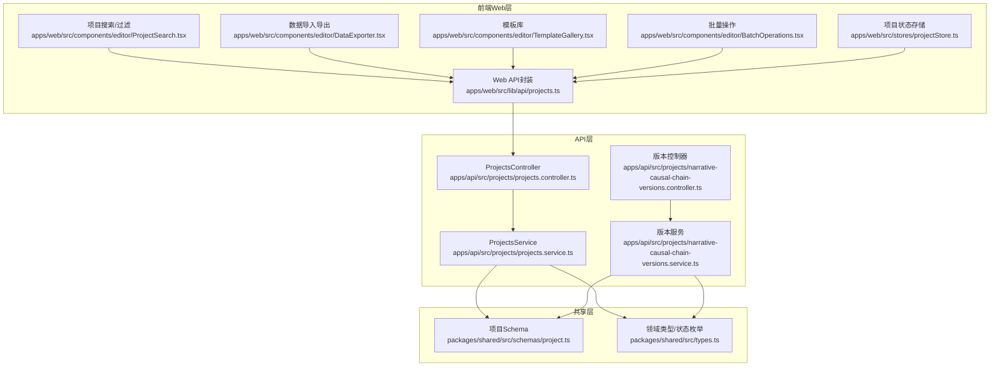
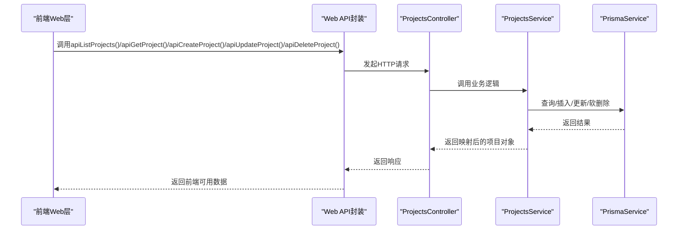
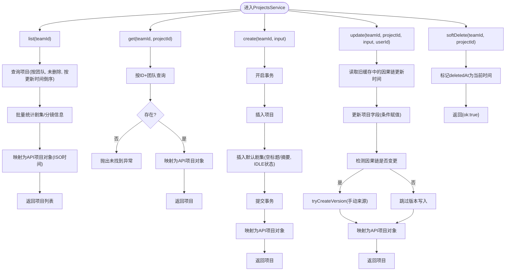
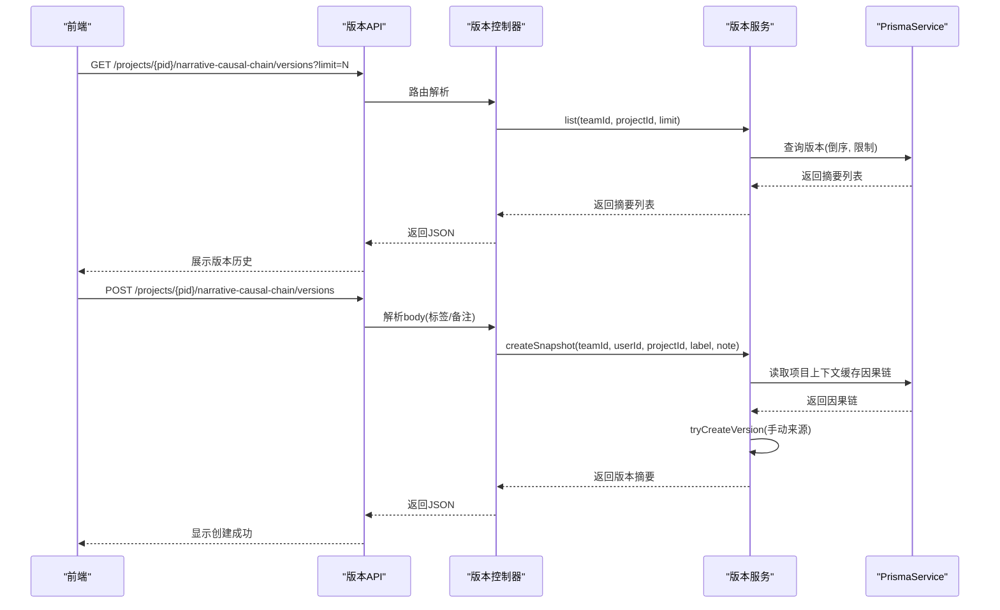
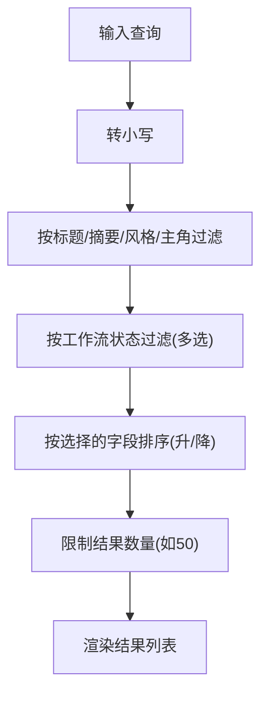
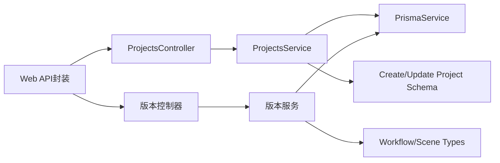

# 项目管理API

<cite>
**本文档引用的文件**
- [apps/api/src/projects/projects.controller.ts](file://apps/api/src/projects/projects.controller.ts)
- [apps/api/src/projects/projects.service.ts](file://apps/api/src/projects/projects.service.ts)
- [apps/api/src/projects/narrative-causal-chain-versions.controller.ts](file://apps/api/src/projects/narrative-causal-chain-versions.controller.ts)
- [apps/api/src/projects/narrative-causal-chain-versions.service.ts](file://apps/api/src/projects/narrative-causal-chain-versions.service.ts)
- [apps/web/src/lib/api/projects.ts](file://apps/web/src/lib/api/projects.ts)
- [packages/shared/src/schemas/project.ts](file://packages/shared/src/schemas/project.ts)
- [packages/shared/src/types.ts](file://packages/shared/src/types.ts)
- [apps/web/src/lib/workflowLabels.ts](file://apps/web/src/lib/workflowLabels.ts)
- [apps/web/src/stores/projectStore.ts](file://apps/web/src/stores/projectStore.ts)
- [apps/web/src/components/editor/ProjectSearch.tsx](file://apps/web/src/components/editor/ProjectSearch.tsx)
- [apps/web/src/stores/searchStore.ts](file://apps/web/src/stores/searchStore.ts)
- [apps/web/src/components/editor/DataExporter.tsx](file://apps/web/src/components/editor/DataExporter.tsx)
- [apps/web/src/components/editor/TemplateGallery.tsx](file://apps/web/src/components/editor/TemplateGallery.tsx)
- [apps/web/src/components/editor/BatchOperations.tsx](file://apps/web/src/components/editor/BatchOperations.tsx)
- [apps/web/src/lib/workflowV2/state.ts](file://apps/web/src/lib/workflowV2/state.ts)
</cite>

## 目录

1. [简介](#简介)
2. [项目结构](#项目结构)
3. [核心组件](#核心组件)
4. [架构总览](#架构总览)
5. [详细组件分析](#详细组件分析)
6. [依赖关系分析](#依赖关系分析)
7. [性能考虑](#性能考虑)
8. [故障排查指南](#故障排查指南)
9. [结论](#结论)
10. [附录](#附录)

## 简介

本文件面向AIXSSS前端应用的项目管理API，系统性梳理项目CRUD接口、状态管理、版本控制、协作能力、搜索过滤排序、模板与导入导出、批量操作等能力，并提供生命周期管理的API使用示例、参数说明、返回值格式及最佳实践与性能优化建议。

## 项目结构

项目管理API由三层构成：

- 前端Web层：负责用户交互、状态管理、搜索过滤、模板与导入导出、批量操作等。
- API层（NestJS）：提供REST接口，执行鉴权、参数校验、业务逻辑与数据库交互。
- 共享层（Shared）：统一数据模型、枚举与校验规则，保证前后端一致性。



图表来源

- [apps/api/src/projects/projects.controller.ts](file://apps/api/src/projects/projects.controller.ts#L1-L43)
- [apps/api/src/projects/projects.service.ts](file://apps/api/src/projects/projects.service.ts#L1-L215)
- [apps/api/src/projects/narrative-causal-chain-versions.controller.ts](file://apps/api/src/projects/narrative-causal-chain-versions.controller.ts#L1-L84)
- [apps/api/src/projects/narrative-causal-chain-versions.service.ts](file://apps/api/src/projects/narrative-causal-chain-versions.service.ts#L1-L339)
- [apps/web/src/lib/api/projects.ts](file://apps/web/src/lib/api/projects.ts#L1-L53)
- [packages/shared/src/schemas/project.ts](file://packages/shared/src/schemas/project.ts#L1-L33)
- [packages/shared/src/types.ts](file://packages/shared/src/types.ts#L1-L77)

章节来源

- [apps/api/src/projects/projects.controller.ts](file://apps/api/src/projects/projects.controller.ts#L1-L43)
- [apps/api/src/projects/projects.service.ts](file://apps/api/src/projects/projects.service.ts#L1-L215)
- [apps/api/src/projects/narrative-causal-chain-versions.controller.ts](file://apps/api/src/projects/narrative-causal-chain-versions.controller.ts#L1-L84)
- [apps/api/src/projects/narrative-causal-chain-versions.service.ts](file://apps/api/src/projects/narrative-causal-chain-versions.service.ts#L1-L339)
- [apps/web/src/lib/api/projects.ts](file://apps/web/src/lib/api/projects.ts#L1-L53)
- [packages/shared/src/schemas/project.ts](file://packages/shared/src/schemas/project.ts#L1-L33)
- [packages/shared/src/types.ts](file://packages/shared/src/types.ts#L1-L77)

## 核心组件

- 项目CRUD控制器与服务：提供列表、创建、读取、更新、软删除接口，支持按团队隔离与按ID查询。
- 版本控制控制器与服务：提供叙事因果链快照、版本列表、版本详情、恢复等功能，支持自动/手动/恢复三种来源。
- Web API封装：统一HTTP请求封装，便于前端调用。
- 共享Schema与类型：约束创建/更新输入、工作流状态、场景步骤等。
- 前端状态与搜索：项目状态存储、搜索过滤排序、模板库、导入导出、批量操作。

章节来源

- [apps/api/src/projects/projects.controller.ts](file://apps/api/src/projects/projects.controller.ts#L1-L43)
- [apps/api/src/projects/projects.service.ts](file://apps/api/src/projects/projects.service.ts#L1-L215)
- [apps/api/src/projects/narrative-causal-chain-versions.controller.ts](file://apps/api/src/projects/narrative-causal-chain-versions.controller.ts#L1-L84)
- [apps/api/src/projects/narrative-causal-chain-versions.service.ts](file://apps/api/src/projects/narrative-causal-chain-versions.service.ts#L1-L339)
- [apps/web/src/lib/api/projects.ts](file://apps/web/src/lib/api/projects.ts#L1-L53)
- [packages/shared/src/schemas/project.ts](file://packages/shared/src/schemas/project.ts#L1-L33)
- [packages/shared/src/types.ts](file://packages/shared/src/types.ts#L1-L77)

## 架构总览

项目管理API采用前后端分离架构，前端通过Web API封装调用后端REST接口；后端使用NestJS控制器与服务，结合Prisma访问数据库；共享层确保前后端数据契约一致。



图表来源

- [apps/web/src/lib/api/projects.ts](file://apps/web/src/lib/api/projects.ts#L1-L53)
- [apps/api/src/projects/projects.controller.ts](file://apps/api/src/projects/projects.controller.ts#L1-L43)
- [apps/api/src/projects/projects.service.ts](file://apps/api/src/projects/projects.service.ts#L1-L215)

## 详细组件分析

### 项目CRUD接口

- 列表：按团队维度查询，按更新时间倒序返回，同时计算项目统计信息（剧集数、有核心表达的剧集数、分镜总数、已完成分镜数）。
- 创建：事务内创建项目并初始化第一条空的剧集，支持自定义ID。
- 读取：按项目ID与团队ID查询，不存在则抛出异常。
- 更新：支持标题、摘要、风格、主角、画风配置、上下文缓存、工作流状态、当前分镜顺序与步骤等字段；若检测到因果链更新，自动写入版本。
- 删除：软删除，标记删除时间。



图表来源

- [apps/api/src/projects/projects.service.ts](file://apps/api/src/projects/projects.service.ts#L55-L212)

章节来源

- [apps/api/src/projects/projects.controller.ts](file://apps/api/src/projects/projects.controller.ts#L14-L39)
- [apps/api/src/projects/projects.service.ts](file://apps/api/src/projects/projects.service.ts#L55-L212)
- [packages/shared/src/schemas/project.ts](file://packages/shared/src/schemas/project.ts#L7-L30)

### 项目状态管理

- 工作流状态枚举：涵盖从“未开始”到“导出中”的完整流程阶段。
- 前端状态标签：提供中文标签映射，便于UI展示。
- 新建项目默认状态：创建时自动设置为“DATA_COLLECTING”。

```mermaid
classDiagram
class WorkflowState {
<<enum>>
"IDLE"
"DATA_COLLECTING"
"DATA_COLLECTED"
"WORLD_VIEW_BUILDING"
"CHARACTER_MANAGING"
"EPISODE_PLANNING"
"EPISODE_PLAN_EDITING"
"EPISODE_CREATING"
"SCENE_LIST_GENERATING"
"SCENE_LIST_EDITING"
"SCENE_LIST_CONFIRMED"
"SCENE_PROCESSING"
"ALL_SCENES_COMPLETE"
"ALL_EPISODES_COMPLETE"
"EXPORTING"
}
class Project {
+string id
+string title
+string summary
+string style
+string protagonist
+string workflowState
+number currentSceneOrder
+string currentSceneStep
+any contextCache
}
Project --> WorkflowState : "使用"
```

图表来源

- [packages/shared/src/types.ts](file://packages/shared/src/types.ts#L6-L22)
- [apps/web/src/lib/workflowLabels.ts](file://apps/web/src/lib/workflowLabels.ts#L1-L22)
- [apps/web/src/stores/projectStore.ts](file://apps/web/src/stores/projectStore.ts#L108-L134)

章节来源

- [packages/shared/src/types.ts](file://packages/shared/src/types.ts#L6-L22)
- [apps/web/src/lib/workflowLabels.ts](file://apps/web/src/lib/workflowLabels.ts#L1-L22)
- [apps/web/src/stores/projectStore.ts](file://apps/web/src/stores/projectStore.ts#L108-L134)

### 版本控制与协作

- 快照创建：基于当前项目上下文缓存中的因果链创建版本，记录来源、阶段、验证状态、模式版本、标签与备注。
- 版本列表：支持限制数量，按创建时间倒序返回摘要信息。
- 版本详情：返回完整因果链与摘要信息。
- 版本恢复：将指定版本写回项目上下文缓存，并记录恢复来源的版本信息。



图表来源

- [apps/api/src/projects/narrative-causal-chain-versions.controller.ts](file://apps/api/src/projects/narrative-causal-chain-versions.controller.ts#L33-L80)
- [apps/api/src/projects/narrative-causal-chain-versions.service.ts](file://apps/api/src/projects/narrative-causal-chain-versions.service.ts#L65-L116)

章节来源

- [apps/api/src/projects/narrative-causal-chain-versions.controller.ts](file://apps/api/src/projects/narrative-causal-chain-versions.controller.ts#L1-L84)
- [apps/api/src/projects/narrative-causal-chain-versions.service.ts](file://apps/api/src/projects/narrative-causal-chain-versions.service.ts#L1-L339)

### 搜索、过滤与排序

- 前端搜索组件：支持全文搜索（标题/摘要/风格/主角），状态过滤（多选），排序（更新时间/名称/状态），并提供搜索历史。
- 搜索状态存储：集中管理查询语句、过滤器、结果集与搜索历史，支持项目与分镜的联合搜索。



图表来源

- [apps/web/src/components/editor/ProjectSearch.tsx](file://apps/web/src/components/editor/ProjectSearch.tsx#L50-L91)
- [apps/web/src/stores/searchStore.ts](file://apps/web/src/stores/searchStore.ts#L52-L98)

章节来源

- [apps/web/src/components/editor/ProjectSearch.tsx](file://apps/web/src/components/editor/ProjectSearch.tsx#L1-L354)
- [apps/web/src/stores/searchStore.ts](file://apps/web/src/stores/searchStore.ts#L1-L131)

### 模板、导入导出与批量操作

- 模板库：支持浏览、搜索、分类筛选、创建自定义模板、变量填充与应用。
- 导入导出：支持JSON/Markdown格式导出，包含项目、分镜、角色与元数据；支持导入校验与覆盖。
- 批量操作：支持批量生成、批量导出、批量删除，具备暂停/继续/取消机制与进度反馈。

章节来源

- [apps/web/src/components/editor/TemplateGallery.tsx](file://apps/web/src/components/editor/TemplateGallery.tsx#L1-L449)
- [apps/web/src/components/editor/DataExporter.tsx](file://apps/web/src/components/editor/DataExporter.tsx#L1-L826)
- [apps/web/src/components/editor/BatchOperations.tsx](file://apps/web/src/components/editor/BatchOperations.tsx#L1-L346)

### API使用示例与参数说明

- 列表项目
  - 方法：GET /projects
  - 参数：无
  - 返回：项目数组，包含标准字段与可选统计字段
  - 示例路径：[apps/api/src/projects/projects.controller.ts](file://apps/api/src/projects/projects.controller.ts#L14-L17)

- 创建项目
  - 方法：POST /projects
  - 请求体：CreateProjectInputSchema（id可选、title必填、summary/protagonist/style可选、artStyleConfig可选）
  - 返回：创建后的项目对象
  - 示例路径：[apps/api/src/projects/projects.controller.ts](file://apps/api/src/projects/projects.controller.ts#L19-L23)、[packages/shared/src/schemas/project.ts](file://packages/shared/src/schemas/project.ts#L7-L19)

- 读取项目
  - 方法：GET /projects/{projectId}
  - 路径参数：projectId
  - 返回：项目对象
  - 示例路径：[apps/api/src/projects/projects.controller.ts](file://apps/api/src/projects/projects.controller.ts#L25-L28)

- 更新项目
  - 方法：PATCH /projects/{projectId}
  - 路径参数：projectId
  - 请求体：UpdateProjectInputSchema（可部分字段，含workflowState/currentSceneOrder/currentSceneStep/contextCache）
  - 返回：更新后的项目对象
  - 示例路径：[apps/api/src/projects/projects.controller.ts](file://apps/api/src/projects/projects.controller.ts#L30-L34)、[packages/shared/src/schemas/project.ts](file://packages/shared/src/schemas/project.ts#L23-L28)

- 删除项目
  - 方法：DELETE /projects/{projectId}
  - 路径参数：projectId
  - 返回：{ ok: true }
  - 示例路径：[apps/api/src/projects/projects.controller.ts](file://apps/api/src/projects/projects.controller.ts#L36-L39)

- 版本控制
  - 列表：GET /projects/{projectId}/narrative-causal-chain/versions?limit=N
  - 创建快照：POST /projects/{projectId}/narrative-causal-chain/versions
  - 详情：GET /projects/{projectId}/narrative-causal-chain/versions/{versionId}
  - 恢复：POST /projects/{projectId}/narrative-causal-chain/versions/{versionId}/restore
  - 示例路径：[apps/api/src/projects/narrative-causal-chain-versions.controller.ts](file://apps/api/src/projects/narrative-causal-chain-versions.controller.ts#L33-L80)

章节来源

- [apps/api/src/projects/projects.controller.ts](file://apps/api/src/projects/projects.controller.ts#L14-L39)
- [apps/api/src/projects/narrative-causal-chain-versions.controller.ts](file://apps/api/src/projects/narrative-causal-chain-versions.controller.ts#L25-L80)
- [packages/shared/src/schemas/project.ts](file://packages/shared/src/schemas/project.ts#L7-L30)

## 依赖关系分析

- 控制器依赖服务：ProjectsController依赖ProjectsService，版本控制器依赖版本服务。
- 服务依赖Prisma：ProjectsService与版本服务均通过PrismaService访问数据库。
- 共享依赖：前后端共享Schema与类型，确保输入输出一致。
- 前端依赖：Web API封装统一调用后端REST；状态存储与搜索存储贯穿前端交互。



图表来源

- [apps/api/src/projects/projects.controller.ts](file://apps/api/src/projects/projects.controller.ts#L1-L11)
- [apps/api/src/projects/projects.service.ts](file://apps/api/src/projects/projects.service.ts#L1-L40)
- [apps/api/src/projects/narrative-causal-chain-versions.controller.ts](file://apps/api/src/projects/narrative-causal-chain-versions.controller.ts#L1-L7)
- [apps/api/src/projects/narrative-causal-chain-versions.service.ts](file://apps/api/src/projects/narrative-causal-chain-versions.service.ts#L1-L5)
- [apps/web/src/lib/api/projects.ts](file://apps/web/src/lib/api/projects.ts#L1-L53)
- [packages/shared/src/schemas/project.ts](file://packages/shared/src/schemas/project.ts#L1-L33)
- [packages/shared/src/types.ts](file://packages/shared/src/types.ts#L1-L77)

章节来源

- [apps/api/src/projects/projects.controller.ts](file://apps/api/src/projects/projects.controller.ts#L1-L11)
- [apps/api/src/projects/projects.service.ts](file://apps/api/src/projects/projects.service.ts#L1-L40)
- [apps/api/src/projects/narrative-causal-chain-versions.controller.ts](file://apps/api/src/projects/narrative-causal-chain-versions.controller.ts#L1-L7)
- [apps/api/src/projects/narrative-causal-chain-versions.service.ts](file://apps/api/src/projects/narrative-causal-chain-versions.service.ts#L1-L5)
- [apps/web/src/lib/api/projects.ts](file://apps/web/src/lib/api/projects.ts#L1-L53)
- [packages/shared/src/schemas/project.ts](file://packages/shared/src/schemas/project.ts#L1-L33)
- [packages/shared/src/types.ts](file://packages/shared/src/types.ts#L1-L77)

## 性能考虑

- 列表统计批量化：在查询项目列表时，对每个项目分别统计剧集与分镜，可能产生多次数据库查询；建议在高并发场景下引入缓存或延迟统计。
- 版本写入best-effort：因果链版本写入失败不应阻断主流程，但需关注失败率与告警。
- 搜索过滤：前端本地过滤与排序，避免后端压力；对于超大数据集，建议后端分页与索引优化。
- 导入导出：大文件导出应分步生成与下载，避免内存峰值；导入时进行严格校验与事务回滚。
- 批量操作：批量生成/删除应支持暂停/取消，避免长时间占用资源。

## 故障排查指南

- 404未找到：当项目不存在或已被软删除时，读取/更新/删除会抛出未找到异常。
- 版本迁移兼容：版本列表/详情在未迁移数据库时会返回空列表或抛出未找到，属预期行为。
- 输入校验：前端使用Zod Schema进行参数校验，若字段不符合约束会触发400错误。
- 状态标签：若出现未知状态，前端标签映射会回退为原始状态字符串。

章节来源

- [apps/api/src/projects/projects.service.ts](file://apps/api/src/projects/projects.service.ts#L104-L109)
- [apps/api/src/projects/narrative-causal-chain-versions.service.ts](file://apps/api/src/projects/narrative-causal-chain-versions.service.ts#L111-L115)
- [apps/web/src/lib/workflowLabels.ts](file://apps/web/src/lib/workflowLabels.ts#L19-L21)

## 结论

项目管理API围绕CRUD、状态管理、版本控制与协作展开，配合前端搜索、模板、导入导出与批量操作，形成完整的项目生命周期管理能力。通过共享Schema与类型、JWT鉴权与参数校验，确保前后端一致性与安全性。建议在高并发场景下优化统计查询与版本写入策略，并完善后端分页与索引以提升搜索性能。

## 附录

- 项目生命周期最佳实践
  - 新建项目：使用默认状态“DATA_COLLECTING”，逐步推进至“EXPORTING”。
  - 状态推进：遵循工作流状态枚举顺序，避免跨状态跳跃。
  - 版本管理：在因果链发生实质性变化时及时创建版本，便于回溯与恢复。
  - 协作规范：通过版本来源区分AI/手动/恢复，明确责任边界。
  - 数据治理：定期导出备份，导入时进行格式校验与覆盖风险提示。
  - 批量操作：谨慎使用批量删除，建议先导出再删除；批量生成时合理设置暂停/取消策略。
