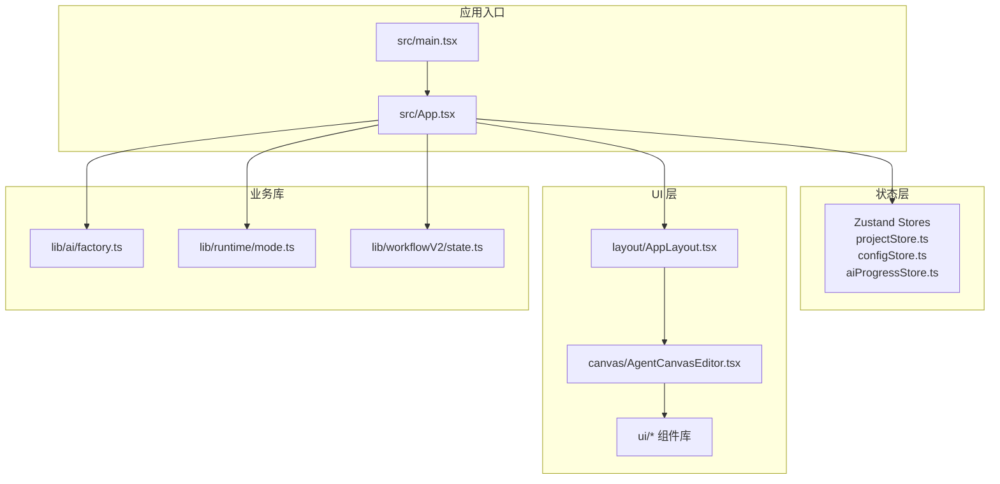
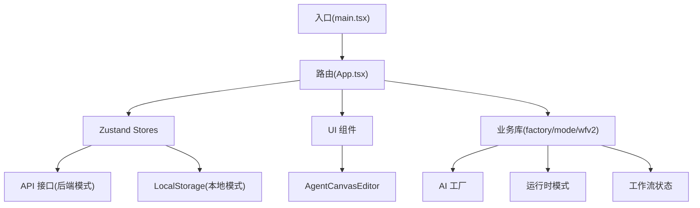
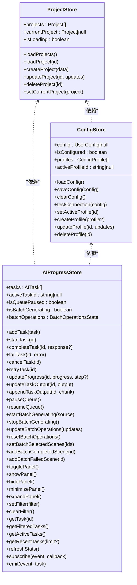
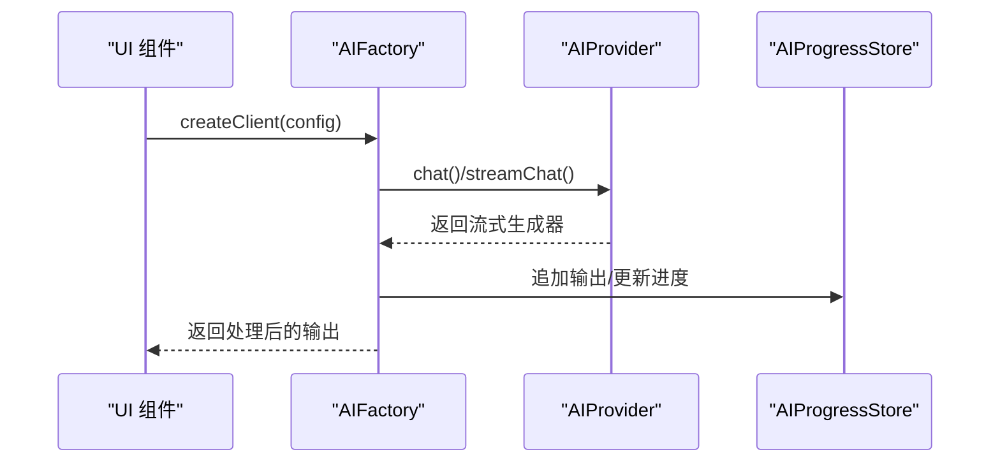
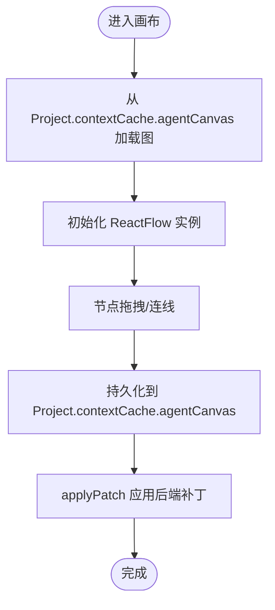
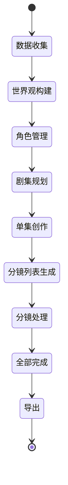
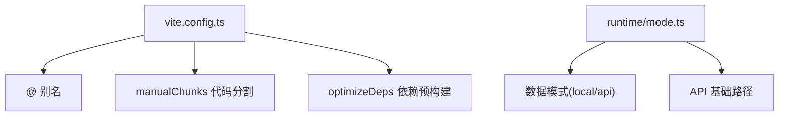

# 前端应用 (apps/web)

<cite>
**本文引用的文件**
- [apps/web/package.json](file://apps/web/package.json)
- [apps/web/vite.config.ts](file://apps/web/vite.config.ts)
- [apps/web/src/main.tsx](file://apps/web/src/main.tsx)
- [apps/web/src/App.tsx](file://apps/web/src/App.tsx)
- [apps/web/src/stores/projectStore.ts](file://apps/web/src/stores/projectStore.ts)
- [apps/web/src/stores/configStore.ts](file://apps/web/src/stores/configStore.ts)
- [apps/web/src/stores/aiProgressStore.ts](file://apps/web/src/stores/aiProgressStore.ts)
- [apps/web/src/lib/ai/factory.ts](file://apps/web/src/lib/ai/factory.ts)
- [apps/web/src/lib/runtime/mode.ts](file://apps/web/src/lib/runtime/mode.ts)
- [apps/web/src/components/canvas/AgentCanvasEditor.tsx](file://apps/web/src/components/canvas/AgentCanvasEditor.tsx)
- [apps/web/src/lib/workflowV2/state.ts](file://apps/web/src/lib/workflowV2/state.ts)
- [apps/web/src/types/index.ts](file://apps/web/src/types/index.ts)
</cite>

## 目录

1. [简介](#简介)
2. [项目结构](#项目结构)
3. [核心组件](#核心组件)
4. [架构总览](#架构总览)
5. [详细组件分析](#详细组件分析)
6. [依赖关系分析](#依赖关系分析)
7. [性能考量](#性能考量)
8. [故障排查指南](#故障排查指南)
9. [结论](#结论)
10. [附录](#附录)

## 简介

本项目是基于 React + TypeScript + Vite 的现代 Web 应用，面向 AIXSSS 的前端界面。应用采用 Zustand 状态管理，结合 Radix UI 与 XYFlow 实现丰富的交互与可视化工作流，并通过统一的 AI 服务抽象支持多家大模型供应商。应用同时支持“本地模式”与“API 模式”，在不同运行环境下实现数据持久化与调用策略的差异化。

## 项目结构

应用采用按功能域划分的组织方式，核心目录包括：

- src/components：UI 组件与业务组件（布局、编辑器、画布、对话等）
- src/stores：Zustand 状态模块（项目、配置、AI 进度、主题、搜索等）
- src/lib：业务库（AI 服务抽象、工作流状态、运行时模式、API 客户端等）
- src/hooks：自定义 Hook（快捷键、移动端适配、Toast 等）
- src/types：共享类型定义（项目、场景、分镜、工作流状态、AI 配置等）

图表来源

- [apps/web/src/main.tsx](file://apps/web/src/main.tsx#L1-L37)
- [apps/web/src/App.tsx](file://apps/web/src/App.tsx#L1-L392)
- [apps/web/src/stores/projectStore.ts](file://apps/web/src/stores/projectStore.ts#L1-L181)
- [apps/web/src/stores/configStore.ts](file://apps/web/src/stores/configStore.ts#L1-L822)
- [apps/web/src/stores/aiProgressStore.ts](file://apps/web/src/stores/aiProgressStore.ts#L1-L758)
- [apps/web/src/lib/ai/factory.ts](file://apps/web/src/lib/ai/factory.ts#L1-L98)
- [apps/web/src/lib/runtime/mode.ts](file://apps/web/src/lib/runtime/mode.ts#L1-L30)
- [apps/web/src/components/canvas/AgentCanvasEditor.tsx](file://apps/web/src/components/canvas/AgentCanvasEditor.tsx#L1-L200)
- [apps/web/src/lib/workflowV2/state.ts](file://apps/web/src/lib/workflowV2/state.ts#L1-L139)

章节来源

- [apps/web/src/main.tsx](file://apps/web/src/main.tsx#L1-L37)
- [apps/web/src/App.tsx](file://apps/web/src/App.tsx#L1-L392)

## 核心组件

- 应用入口与路由：在入口文件中初始化 React Query、BrowserRouter，并根据运行模式渲染本地或后端应用分支。
- 状态管理：使用 Zustand 管理项目、配置、AI 进度、主题、搜索等状态，支持本地与 API 模式的差异化持久化。
- UI 组件库：基于 Radix UI 构建基础控件，配合 TailwindCSS 实现一致的视觉与交互体验。
- 可视化画布：基于 XYFlow 的 AgentCanvasEditor 支持节点拖拽、连线与工作流编排。
- AI 服务抽象：通过工厂模式与 Provider 抽象，统一多供应商调用与流式输出处理。

章节来源

- [apps/web/src/main.tsx](file://apps/web/src/main.tsx#L1-L37)
- [apps/web/src/App.tsx](file://apps/web/src/App.tsx#L1-L392)
- [apps/web/src/stores/projectStore.ts](file://apps/web/src/stores/projectStore.ts#L1-L181)
- [apps/web/src/stores/configStore.ts](file://apps/web/src/stores/configStore.ts#L1-L822)
- [apps/web/src/stores/aiProgressStore.ts](file://apps/web/src/stores/aiProgressStore.ts#L1-L758)
- [apps/web/src/lib/ai/factory.ts](file://apps/web/src/lib/ai/factory.ts#L1-L98)
- [apps/web/src/components/canvas/AgentCanvasEditor.tsx](file://apps/web/src/components/canvas/AgentCanvasEditor.tsx#L1-L200)

## 架构总览

应用采用“入口 → 状态 → UI → 业务库”的分层架构：

- 入口层：初始化 React Query、路由与全局快捷键；根据运行模式决定数据来源（本地/后端）。
- 状态层：Zustand Store 负责项目、配置、AI 进度等状态；在 API 模式下通过后端接口持久化。
- UI 层：布局组件承载导航与侧边栏；编辑器组件承载画布与工作流节点；对话组件承载 AI 设置与系统提示。
- 业务库：AI 工厂负责供应商适配与流式输出桥接；运行时模式决定数据模式；工作流状态提供产物视角的规范化。

图表来源

- [apps/web/src/main.tsx](file://apps/web/src/main.tsx#L1-L37)
- [apps/web/src/App.tsx](file://apps/web/src/App.tsx#L1-L392)
- [apps/web/src/lib/ai/factory.ts](file://apps/web/src/lib/ai/factory.ts#L1-L98)
- [apps/web/src/lib/runtime/mode.ts](file://apps/web/src/lib/runtime/mode.ts#L1-L30)
- [apps/web/src/lib/workflowV2/state.ts](file://apps/web/src/lib/workflowV2/state.ts#L1-L139)

## 详细组件分析

### 状态管理与持久化策略

- 项目状态（projectStore）：统一管理项目列表与当前项目，支持本地与 API 模式下的加载、创建、更新与删除；在本地模式使用本地存储，在 API 模式通过后端接口持久化。
- 配置状态（configStore）：管理用户 AI 配置与多档案；在 API 模式下仅保存服务端档案 ID，不保存密钥；支持连接测试与档案切换。
- AI 进度状态（aiProgressStore）：集中管理 AI 任务的生命周期、进度、错误与性能统计；提供事件订阅与批量操作状态。

图表来源

- [apps/web/src/stores/projectStore.ts](file://apps/web/src/stores/projectStore.ts#L1-L181)
- [apps/web/src/stores/configStore.ts](file://apps/web/src/stores/configStore.ts#L1-L822)
- [apps/web/src/stores/aiProgressStore.ts](file://apps/web/src/stores/aiProgressStore.ts#L1-L758)

章节来源

- [apps/web/src/stores/projectStore.ts](file://apps/web/src/stores/projectStore.ts#L1-L181)
- [apps/web/src/stores/configStore.ts](file://apps/web/src/stores/configStore.ts#L1-L822)
- [apps/web/src/stores/aiProgressStore.ts](file://apps/web/src/stores/aiProgressStore.ts#L1-L758)

### AI 服务抽象与多供应商支持

- 工厂模式：根据供应商类型创建对应的 Provider，统一 chat 与 streamChat 接口。
- 流式输出桥接：在 AIClient 中包装底层生成器，拦截每个 chunk 并更新 AI 进度 Store。
- 运行时模式：在 API 模式下，通过服务端档案 ID 调用后端，不保存密钥；在本地模式下使用本地配置。

图表来源

- [apps/web/src/lib/ai/factory.ts](file://apps/web/src/lib/ai/factory.ts#L1-L98)
- [apps/web/src/stores/aiProgressStore.ts](file://apps/web/src/stores/aiProgressStore.ts#L1-L758)

章节来源

- [apps/web/src/lib/ai/factory.ts](file://apps/web/src/lib/ai/factory.ts#L1-L98)
- [apps/web/src/lib/runtime/mode.ts](file://apps/web/src/lib/runtime/mode.ts#L1-L30)

### 可视化工作流与节点编排

- AgentCanvasEditor：基于 XYFlow 的画布编辑器，支持节点拖拽、连线与视口恢复；节点类型涵盖项目、角色、剧集规划、分镜生成、细化、导出与 LLM 节点。
- 节点库：通过 nodeTypes 注册各节点组件，支持动态添加与删除节点。
- Patch 应用：通过 applyPatch 将后端返回的 AgentCanvasPatch 应用到画布，实现节点与连线的增删改。

图表来源

- [apps/web/src/components/canvas/AgentCanvasEditor.tsx](file://apps/web/src/components/canvas/AgentCanvasEditor.tsx#L1-L200)
- [apps/web/src/types/index.ts](file://apps/web/src/types/index.ts#L380-L450)

章节来源

- [apps/web/src/components/canvas/AgentCanvasEditor.tsx](file://apps/web/src/components/canvas/AgentCanvasEditor.tsx#L1-L200)
- [apps/web/src/types/index.ts](file://apps/web/src/types/index.ts#L380-L450)

### 工作流编排与状态机

- 工作流 V2：以产物(Artifacts)与任务(Tasks)视角管理项目与剧集成熟度状态，支持 draft/review/locked 三种状态。
- 产物补丁：通过 buildProjectArtifactPatch/buildEpisodeArtifactPatch 构建 contextCache.patch，确保状态变更可追溯。
- 类型定义：WorkflowState、EpisodeWorkflowState、ArtifactStatus 等类型支撑前端工作台体验与后端透传。

图表来源

- [apps/web/src/types/index.ts](file://apps/web/src/types/index.ts#L240-L257)
- [apps/web/src/lib/workflowV2/state.ts](file://apps/web/src/lib/workflowV2/state.ts#L1-L139)

章节来源

- [apps/web/src/lib/workflowV2/state.ts](file://apps/web/src/lib/workflowV2/state.ts#L1-L139)
- [apps/web/src/types/index.ts](file://apps/web/src/types/index.ts#L240-L294)

### 组件通信机制

- 选择器订阅：在 App.tsx 中使用选择器订阅 Store，避免不必要的重渲染。
- 全局快捷键：通过 useKeyboardShortcut 提供全局搜索与主题切换快捷键。
- 对话框与悬浮面板：通过 React Suspense 与条件渲染实现延迟加载与用户体验优化。

章节来源

- [apps/web/src/App.tsx](file://apps/web/src/App.tsx#L1-L392)
- [apps/web/src/stores/projectStore.ts](file://apps/web/src/stores/projectStore.ts#L1-L181)
- [apps/web/src/stores/configStore.ts](file://apps/web/src/stores/configStore.ts#L1-L822)

## 依赖关系分析

- 构建与打包：Vite 配置启用 React 插件、依赖预构建与代码分割，按 vendor、UI、图表、拖拽、工具库、加密压缩等进行手动分包。
- 运行时模式：通过环境变量控制数据模式与 API 基础路径，支持本地/后端两种运行模式。
- 状态持久化：Store 在本地模式使用本地存储，在 API 模式通过后端接口持久化；AI 配置在 API 模式下不保存密钥。

图表来源

- [apps/web/vite.config.ts](file://apps/web/vite.config.ts#L1-L94)
- [apps/web/src/lib/runtime/mode.ts](file://apps/web/src/lib/runtime/mode.ts#L1-L30)

章节来源

- [apps/web/vite.config.ts](file://apps/web/vite.config.ts#L1-L94)
- [apps/web/src/lib/runtime/mode.ts](file://apps/web/src/lib/runtime/mode.ts#L1-L30)

## 性能考量

- 代码分割：通过 manualChunks 将第三方库拆分为独立 chunk，减少首屏体积与重复依赖。
- 依赖预构建：对 React、Zustand、Immer、日期处理等高频依赖进行预构建，缩短冷启动时间。
- 生产优化：移除 console 与 esbuild 压缩，开启 CSS 代码分割与 chunk 大小告警阈值控制。
- 状态订阅优化：使用选择器订阅 Store，避免全量状态订阅导致的无谓重渲染。

章节来源

- [apps/web/vite.config.ts](file://apps/web/vite.config.ts#L35-L94)
- [apps/web/src/App.tsx](file://apps/web/src/App.tsx#L104-L126)

## 故障排查指南

- 连接测试失败：在 API 模式下，若未绑定服务端档案 ID，将抛出错误；本地模式下需检查供应商、API Key 与模型配置。
- 任务失败与重试：AIProgressStore 提供 failTask 与 retryTask，支持记录错误详情与重试次数；可通过事件订阅监听任务状态变化。
- 画布持久化：在页面隐藏/卸载时自动落盘分镜补丁队列，避免输入丢失；如遇异常，检查 flushScenePatchQueue 与 flushApiScenePatchQueue 的调用时机。

章节来源

- [apps/web/src/stores/configStore.ts](file://apps/web/src/stores/configStore.ts#L343-L488)
- [apps/web/src/stores/aiProgressStore.ts](file://apps/web/src/stores/aiProgressStore.ts#L387-L455)
- [apps/web/src/App.tsx](file://apps/web/src/App.tsx#L128-L153)

## 结论

本应用通过 React + TypeScript + Vite 构建现代化前端，结合 Zustand 实现轻量高效的状态管理，借助 Radix UI 与 XYFlow 提供一致的交互与可视化工作流体验。AI 服务抽象支持多家供应商，运行时模式灵活切换本地与后端数据源。工作流 V2 以产物视角管理项目成熟度，配合补丁构建与类型约束，确保前后端协同的一致性与可追溯性。

## 附录

- 项目依赖与脚本：详见 package.json，包含 React、Zustand、Radix UI、XYFlow、React Query、TailwindCSS 等生态依赖。
- TypeScript 配置：严格类型检查与 JSX 转换配置，支持路径别名与测试环境。

章节来源

- [apps/web/package.json](file://apps/web/package.json#L1-L95)
- [apps/web/tsconfig.app.json](file://apps/web/tsconfig.app.json#L1-L36)
