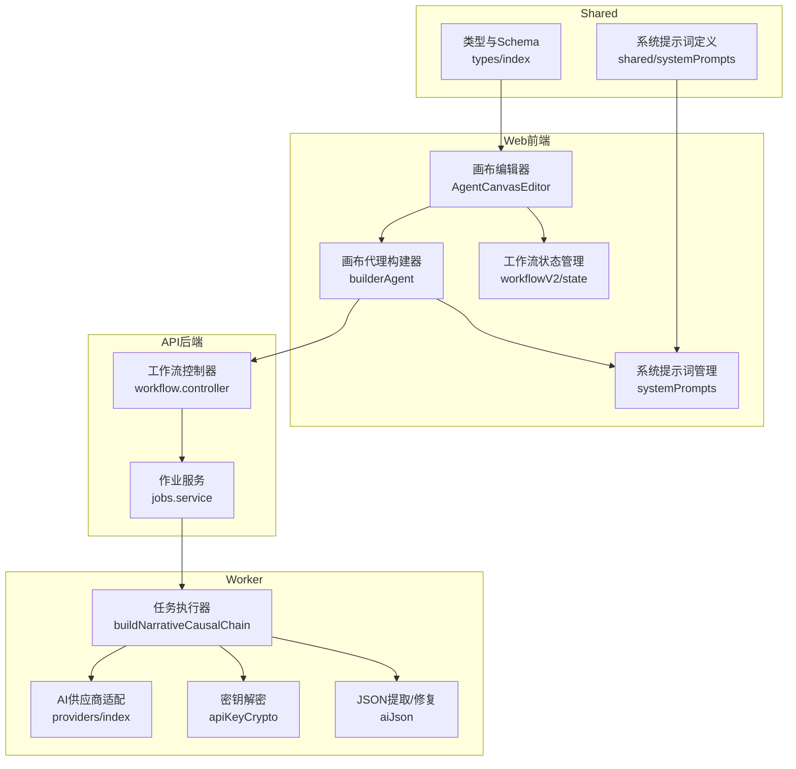
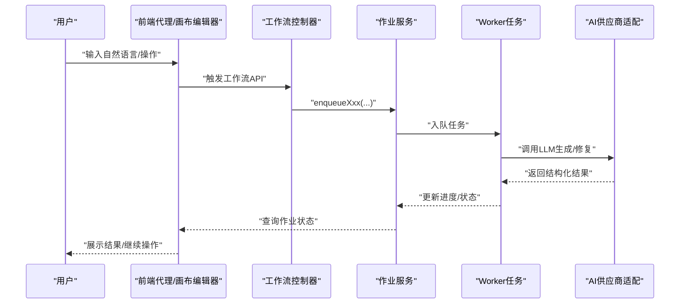
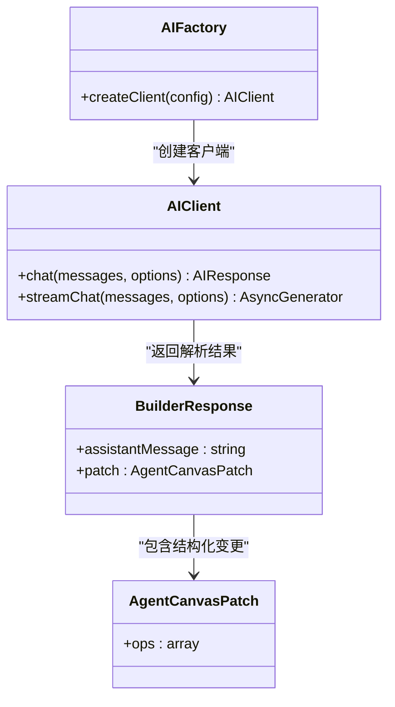
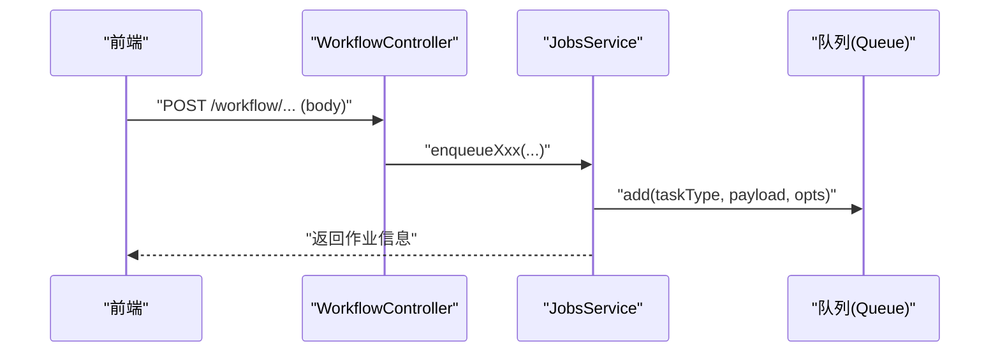
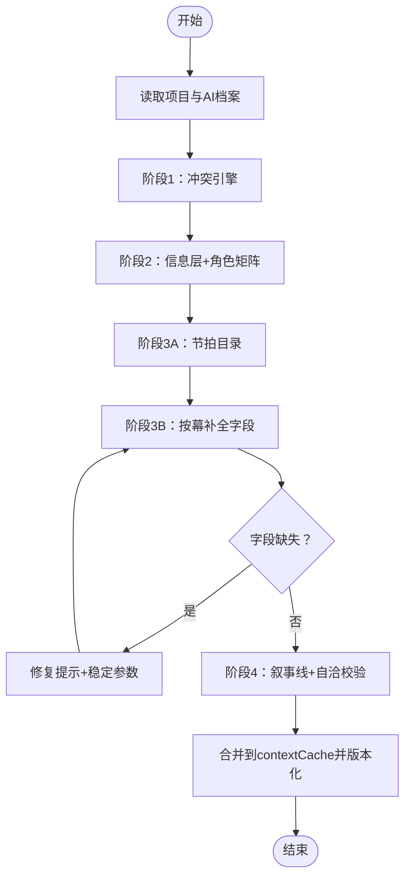
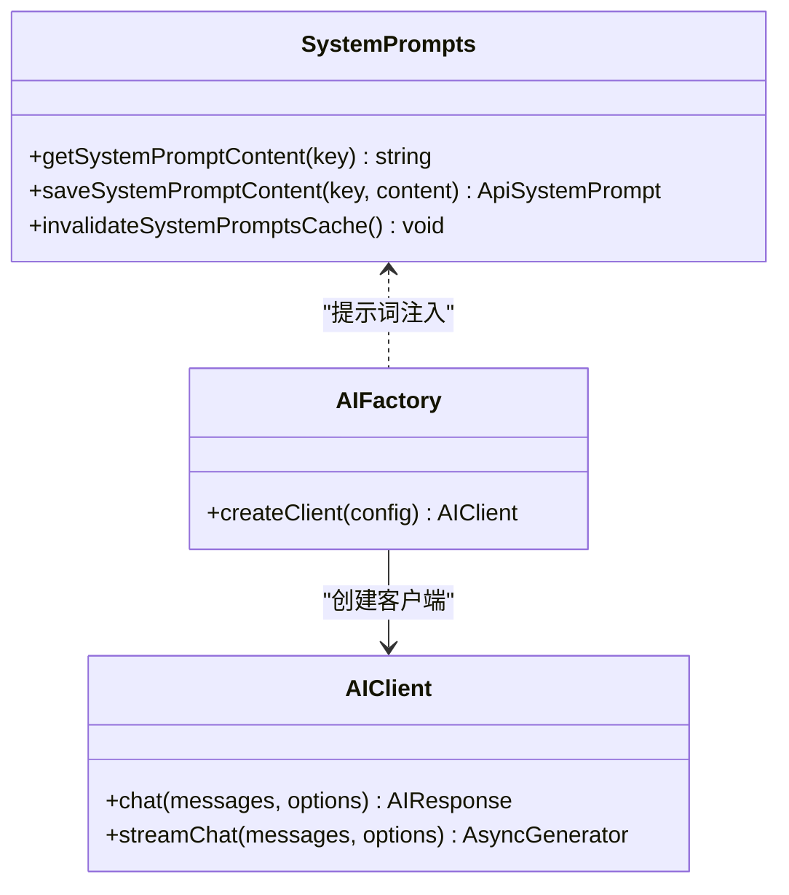
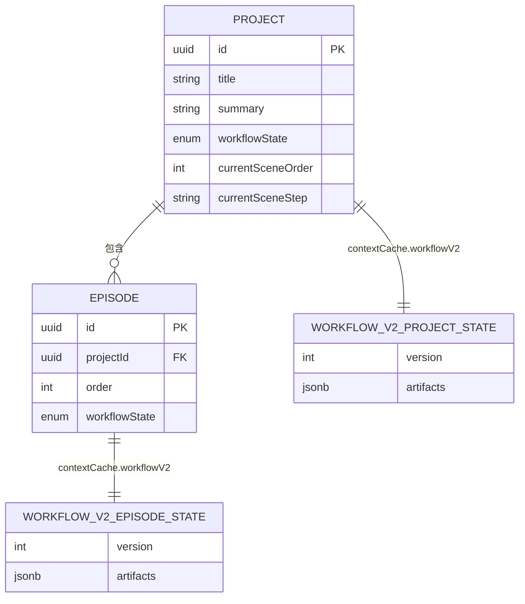
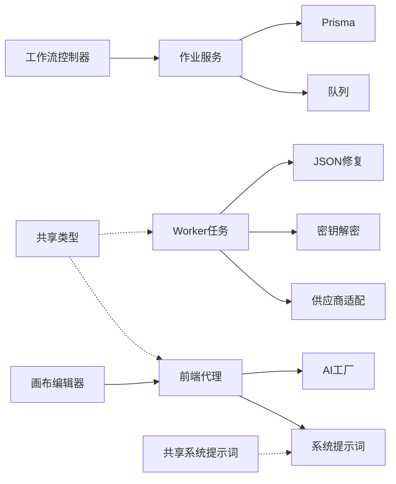
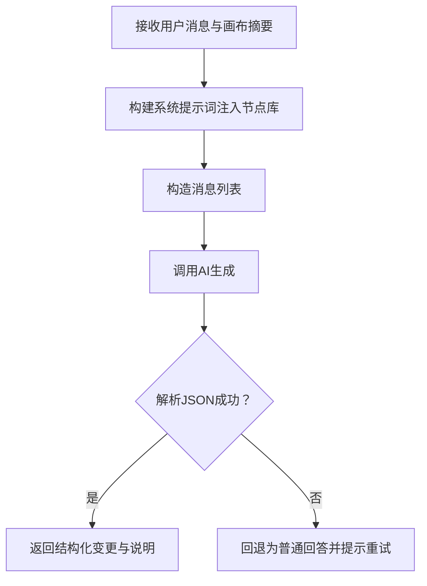

# 代理系统

<cite>
**本文引用的文件**
- [apps/web/src/lib/agent/builderAgent.ts](file://apps/web/src/lib/agent/builderAgent.ts)
- [apps/web/src/lib/agent/graph.ts](file://apps/web/src/lib/agent/graph.ts)
- [apps/web/src/components/canvas/AgentCanvasEditor.tsx](file://apps/web/src/components/canvas/AgentCanvasEditor.tsx)
- [apps/api/src/jobs/workflow.controller.ts](file://apps/api/src/jobs/workflow.controller.ts)
- [apps/api/src/jobs/jobs.service.ts](file://apps/api/src/jobs/jobs.service.ts)
- [apps/worker/src/tasks/buildNarrativeCausalChain.ts](file://apps/worker/src/tasks/buildNarrativeCausalChain.ts)
- [apps/web/src/lib/ai/factory.ts](file://apps/web/src/lib/ai/factory.ts)
- [apps/web/src/lib/systemPrompts/index.ts](file://apps/web/src/lib/systemPrompts/index.ts)
- [apps/web/src/lib/workflowV2/state.ts](file://apps/web/src/lib/workflowV2/state.ts)
- [apps/web/src/lib/workflowV2/panelScript.ts](file://apps/web/src/lib/workflowV2/panelScript.ts)
- [apps/web/src/stores/aiProgressStore.ts](file://apps/web/src/stores/aiProgressStore.ts)
- [apps/web/src/types/index.ts](file://apps/web/src/types/index.ts)
- [apps/worker/src/tasks/taskUtils.ts](file://apps/worker/src/tasks/taskUtils.ts)
- [apps/worker/src/providers/index.ts](file://apps/worker/src/providers/index.ts)
- [apps/worker/src/crypto/apiKeyCrypto.ts](file://apps/worker/src/crypto/apiKeyCrypto.ts)
- [apps/worker/src/tasks/aiJson.ts](file://apps/worker/src/tasks/aiJson.ts)
- [apps/worker/src/tasks/systemPrompts.ts](file://apps/worker/src/tasks/systemPrompts.ts)
- [apps/worker/src/tasks/common.ts](file://apps/worker/src/tasks/common.ts)
- [apps/worker/src/tasks/buildNarrativeCausalChain.phase3.test.ts](file://apps/worker/src/tasks/buildNarrativeCausalChain.phase3.test.ts)
- [packages/shared/src/schemas/narrativeCausalChain.ts](file://packages/shared/src/schemas/narrativeCausalChain.ts)
- [packages/shared/src/systemPrompts.ts](file://packages/shared/src/systemPrompts.ts)
- [docs/prd/episode-planning-workflow.md](file://docs/prd/episode-planning-workflow.md)
- [prd_backup.md](file://prd_backup.md)
</cite>

## 目录

1. [简介](#简介)
2. [项目结构](#项目结构)
3. [核心组件](#核心组件)
4. [架构总览](#架构总览)
5. [详细组件分析](#详细组件分析)
6. [依赖关系分析](#依赖关系分析)
7. [性能考虑](#性能考虑)
8. [故障排查指南](#故障排查指南)
9. [结论](#结论)
10. [附录](#附录)

## 简介

本文件面向AIXSSS代理系统，系统性阐述“智能代理”的设计理念、决策逻辑与自动化处理机制，重点覆盖：

- 代理如何将自然语言转化为画布工作流结构化变更（画布代理）
- 基于图结构的智能推理与迭代修复（叙事因果链生成）
- 代理与工作流的交互方式、任务分配策略与执行监控
- 代理配置示例、决策流程图与性能优化方案
- 代理扩展接口与自定义代理开发指南

## 项目结构

AIXSSS采用前后端分离与多包协作的组织方式：

- Web前端：提供画布编辑器、代理构建器、工作流状态管理与系统提示词管理
- API后端：暴露工作流API，负责作业入队与状态查询
- Worker：承接具体AI任务，执行分阶段的叙事因果链生成与修复
- Shared：共享类型与系统提示词定义

**图表来源**

- [apps/web/src/components/canvas/AgentCanvasEditor.tsx](file://apps/web/src/components/canvas/AgentCanvasEditor.tsx#L124-L441)
- [apps/web/src/lib/agent/builderAgent.ts](file://apps/web/src/lib/agent/builderAgent.ts#L183-L213)
- [apps/web/src/lib/systemPrompts/index.ts](file://apps/web/src/lib/systemPrompts/index.ts#L109-L124)
- [apps/api/src/jobs/workflow.controller.ts](file://apps/api/src/jobs/workflow.controller.ts#L44-L68)
- [apps/api/src/jobs/jobs.service.ts](file://apps/api/src/jobs/jobs.service.ts#L151-L191)
- [apps/worker/src/tasks/buildNarrativeCausalChain.ts](file://apps/worker/src/tasks/buildNarrativeCausalChain.ts#L782-L800)
- [apps/worker/src/providers/index.ts](file://apps/worker/src/providers/index.ts#L1-L20)
- [apps/worker/src/crypto/apiKeyCrypto.ts](file://apps/worker/src/crypto/apiKeyCrypto.ts#L1-L20)
- [apps/worker/src/tasks/aiJson.ts](file://apps/worker/src/tasks/aiJson.ts#L1-L40)
- [apps/web/src/lib/workflowV2/state.ts](file://apps/web/src/lib/workflowV2/state.ts#L27-L74)
- [apps/web/src/types/index.ts](file://apps/web/src/types/index.ts#L425-L450)
- [packages/shared/src/systemPrompts.ts](file://packages/shared/src/systemPrompts.ts#L1-L40)

**章节来源**

- [apps/web/src/components/canvas/AgentCanvasEditor.tsx](file://apps/web/src/components/canvas/AgentCanvasEditor.tsx#L124-L441)
- [apps/web/src/lib/agent/builderAgent.ts](file://apps/web/src/lib/agent/builderAgent.ts#L1-L214)
- [apps/api/src/jobs/workflow.controller.ts](file://apps/api/src/jobs/workflow.controller.ts#L44-L68)
- [apps/api/src/jobs/jobs.service.ts](file://apps/api/src/jobs/jobs.service.ts#L151-L191)
- [apps/worker/src/tasks/buildNarrativeCausalChain.ts](file://apps/worker/src/tasks/buildNarrativeCausalChain.ts#L1-L200)

## 核心组件

- 画布代理构建器：接收用户自然语言与画布摘要，输出结构化的画布变更指令（节点增删改、连线等），并具备JSON解析与回退机制
- 画布图结构：定义节点、边、视口等结构，并提供默认图与解析/序列化能力
- 工作流控制器与作业服务：将工作流请求映射为后台作业，支持重试、去重与进度上报
- Worker任务：执行叙事因果链的四阶段生成与修复，保证结构化输出与版本化存储
- 系统提示词管理：集中管理可定制的系统提示词，支持本地覆盖与API模式下的远端同步
- 工作流状态管理：以产物(Artifacts)视角管理项目/单集成熟度状态，辅助UI与工作流推进

**章节来源**

- [apps/web/src/lib/agent/builderAgent.ts](file://apps/web/src/lib/agent/builderAgent.ts#L58-L77)
- [apps/web/src/lib/agent/graph.ts](file://apps/web/src/lib/agent/graph.ts#L42-L47)
- [apps/api/src/jobs/workflow.controller.ts](file://apps/api/src/jobs/workflow.controller.ts#L44-L68)
- [apps/api/src/jobs/jobs.service.ts](file://apps/api/src/jobs/jobs.service.ts#L151-L191)
- [apps/worker/src/tasks/buildNarrativeCausalChain.ts](file://apps/worker/src/tasks/buildNarrativeCausalChain.ts#L411-L708)
- [apps/web/src/lib/systemPrompts/index.ts](file://apps/web/src/lib/systemPrompts/index.ts#L109-L124)
- [apps/web/src/lib/workflowV2/state.ts](file://apps/web/src/lib/workflowV2/state.ts#L27-L74)

## 架构总览

系统采用“前端代理+后端作业+Worker任务”的三层协作：

- 前端代理：将用户意图转化为画布结构变更，或触发工作流API
- 后端作业：统一入队与状态管理，保障幂等与重试
- Worker任务：执行复杂推理与结构化生成，支持阶段化与修复

**图表来源**

- [apps/web/src/components/canvas/AgentCanvasEditor.tsx](file://apps/web/src/components/canvas/AgentCanvasEditor.tsx#L184-L213)
- [apps/api/src/jobs/workflow.controller.ts](file://apps/api/src/jobs/workflow.controller.ts#L44-L68)
- [apps/api/src/jobs/jobs.service.ts](file://apps/api/src/jobs/jobs.service.ts#L151-L191)
- [apps/worker/src/tasks/buildNarrativeCausalChain.ts](file://apps/worker/src/tasks/buildNarrativeCausalChain.ts#L782-L800)
- [apps/worker/src/providers/index.ts](file://apps/worker/src/providers/index.ts#L1-L20)

## 详细组件分析

### 画布代理构建器与图结构

- 画布代理构建器
  - 输入：用户消息、画布摘要、节点库
  - 输出：结构化变更指令（patch）与简要说明
  - 核心能力：系统提示词注入、消息构造、JSON提取与校验、回退策略
- 图结构
  - 定义节点类型、边、视口
  - 提供默认图与解析/序列化
  - 支持应用补丁（增删改节点、连线）

**图表来源**

- [apps/web/src/lib/agent/builderAgent.ts](file://apps/web/src/lib/agent/builderAgent.ts#L58-L77)
- [apps/web/src/lib/agent/builderAgent.ts](file://apps/web/src/lib/agent/builderAgent.ts#L183-L213)
- [apps/web/src/lib/ai/factory.ts](file://apps/web/src/lib/ai/factory.ts#L30-L75)
- [apps/web/src/lib/agent/graph.ts](file://apps/web/src/lib/agent/graph.ts#L42-L47)

**章节来源**

- [apps/web/src/lib/agent/builderAgent.ts](file://apps/web/src/lib/agent/builderAgent.ts#L1-L214)
- [apps/web/src/lib/agent/graph.ts](file://apps/web/src/lib/agent/graph.ts#L1-L136)
- [apps/web/src/components/canvas/AgentCanvasEditor.tsx](file://apps/web/src/components/canvas/AgentCanvasEditor.tsx#L184-L213)

### 工作流控制器与作业服务

- 控制器：将前端请求映射为具体作业（如生成剧集规划、生成核心表达、生成分镜列表、生成场景锚点、生成关键帧提示、生成分镜、生成动作提示、生成对白、细化分镜等）
- 作业服务：校验项目/角色/剧集/场景存在性与可规划性；入队并设置重试与清理策略；提供进度查询

**图表来源**

- [apps/api/src/jobs/workflow.controller.ts](file://apps/api/src/jobs/workflow.controller.ts#L44-L265)
- [apps/api/src/jobs/jobs.service.ts](file://apps/api/src/jobs/jobs.service.ts#L101-L191)

**章节来源**

- [apps/api/src/jobs/workflow.controller.ts](file://apps/api/src/jobs/workflow.controller.ts#L44-L265)
- [apps/api/src/jobs/jobs.service.ts](file://apps/api/src/jobs/jobs.service.ts#L101-L191)

### Worker：叙事因果链生成与修复

- 四阶段生成
  - 阶段1：核心冲突引擎（outlineSummary、conflictEngine）
  - 阶段2：信息可见度层 + 角色矩阵（infoVisibilityLayers、characterMatrix）
  - 阶段3：节拍目录（beatFlow.actMode/acts/beats）与按幕补全（location、visualHook、characters、surfaceEvent、infoFlow等字段补全）
  - 阶段4：叙事线与自洽校验（plotLines、consistencyChecks）
- 修复与稳定性
  - 使用结构化JSON Schema约束与修复提示
  - 通过稳定的推理参数与温度设置提升输出一致性
  - 版本化存储与裁剪，避免历史版本无限增长
- 进度与监控
  - 通过缩放进度函数将子任务映射到整体进度
  - 任务状态与输出流式更新

**图表来源**

- [apps/worker/src/tasks/buildNarrativeCausalChain.ts](file://apps/worker/src/tasks/buildNarrativeCausalChain.ts#L411-L708)
- [apps/worker/src/tasks/taskUtils.ts](file://apps/worker/src/tasks/taskUtils.ts#L278-L293)

**章节来源**

- [apps/worker/src/tasks/buildNarrativeCausalChain.ts](file://apps/worker/src/tasks/buildNarrativeCausalChain.ts#L1-L800)
- [apps/worker/src/tasks/buildNarrativeCausalChain.ts](file://apps/worker/src/tasks/buildNarrativeCausalChain.ts#L800-L1605)
- [apps/worker/src/tasks/taskUtils.ts](file://apps/worker/src/tasks/taskUtils.ts#L278-L293)
- [apps/worker/src/tasks/buildNarrativeCausalChain.phase3.test.ts](file://apps/worker/src/tasks/buildNarrativeCausalChain.phase3.test.ts#L157-L166)

### 系统提示词与AI适配

- 系统提示词管理：支持本地覆盖与API模式下的远端同步，提供缓存与失效机制
- AI工厂：根据配置选择供应商适配器，封装聊天与流式输出，统一错误处理与进度桥接

**图表来源**

- [apps/web/src/lib/systemPrompts/index.ts](file://apps/web/src/lib/systemPrompts/index.ts#L109-L124)
- [apps/web/src/lib/ai/factory.ts](file://apps/web/src/lib/ai/factory.ts#L77-L97)

**章节来源**

- [apps/web/src/lib/systemPrompts/index.ts](file://apps/web/src/lib/systemPrompts/index.ts#L109-L124)
- [apps/web/src/lib/ai/factory.ts](file://apps/web/src/lib/ai/factory.ts#L1-L98)

### 工作流状态与产物(Artifacts)

- 项目级与单集级工作流状态：以产物成熟度（draft/review/locked）替代线性状态，更贴合创作流程
- 面向产物的上下文缓存：在项目/单集级别维护workflowV2，便于跨模块共享与持久化

**图表来源**

- [apps/web/src/types/index.ts](file://apps/web/src/types/index.ts#L425-L450)
- [apps/web/src/types/index.ts](file://apps/web/src/types/index.ts#L274-L294)
- [apps/web/src/lib/workflowV2/state.ts](file://apps/web/src/lib/workflowV2/state.ts#L27-L74)

**章节来源**

- [apps/web/src/lib/workflowV2/state.ts](file://apps/web/src/lib/workflowV2/state.ts#L27-L139)
- [apps/web/src/types/index.ts](file://apps/web/src/types/index.ts#L240-L294)

## 依赖关系分析

- 前端代理依赖系统提示词与AI工厂；画布编辑器负责应用补丁与视口管理
- 控制器依赖作业服务；作业服务依赖队列与Prisma；Worker依赖供应商适配、密钥解密与JSON修复工具
- Shared提供类型与系统提示词定义，被前端与Worker共享

**图表来源**

- [apps/web/src/lib/agent/builderAgent.ts](file://apps/web/src/lib/agent/builderAgent.ts#L183-L213)
- [apps/web/src/lib/systemPrompts/index.ts](file://apps/web/src/lib/systemPrompts/index.ts#L109-L124)
- [apps/web/src/lib/ai/factory.ts](file://apps/web/src/lib/ai/factory.ts#L77-L97)
- [apps/api/src/jobs/workflow.controller.ts](file://apps/api/src/jobs/workflow.controller.ts#L44-L68)
- [apps/api/src/jobs/jobs.service.ts](file://apps/api/src/jobs/jobs.service.ts#L151-L191)
- [apps/worker/src/tasks/buildNarrativeCausalChain.ts](file://apps/worker/src/tasks/buildNarrativeCausalChain.ts#L782-L800)
- [apps/worker/src/providers/index.ts](file://apps/worker/src/providers/index.ts#L1-L20)
- [apps/worker/src/crypto/apiKeyCrypto.ts](file://apps/worker/src/crypto/apiKeyCrypto.ts#L1-L20)
- [apps/worker/src/tasks/aiJson.ts](file://apps/worker/src/tasks/aiJson.ts#L1-L40)
- [packages/shared/src/schemas/narrativeCausalChain.ts](file://packages/shared/src/schemas/narrativeCausalChain.ts#L1-L40)
- [packages/shared/src/systemPrompts.ts](file://packages/shared/src/systemPrompts.ts#L1-L40)

**章节来源**

- [apps/web/src/lib/agent/builderAgent.ts](file://apps/web/src/lib/agent/builderAgent.ts#L1-L214)
- [apps/api/src/jobs/jobs.service.ts](file://apps/api/src/jobs/jobs.service.ts#L151-L191)
- [apps/worker/src/tasks/buildNarrativeCausalChain.ts](file://apps/worker/src/tasks/buildNarrativeCausalChain.ts#L1-L200)

## 性能考虑

- 任务拆分与进度映射：将长耗时任务拆分为多个阶段，使用进度缩放函数将子阶段映射到整体进度，提升可观测性与用户体验
- 结构化输出与修复：通过严格的JSON Schema与修复提示，减少无效重试与二次修复成本
- 缓存与版本裁剪：对生成结果进行版本化存储并限制最大数量，避免历史版本膨胀
- 供应商适配与流式输出：统一的AI工厂封装，支持流式输出与进度桥接，降低前端等待与渲染压力

**章节来源**

- [apps/worker/src/tasks/taskUtils.ts](file://apps/worker/src/tasks/taskUtils.ts#L278-L293)
- [apps/worker/src/tasks/buildNarrativeCausalChain.ts](file://apps/worker/src/tasks/buildNarrativeCausalChain.ts#L289-L369)
- [apps/web/src/lib/ai/factory.ts](file://apps/web/src/lib/ai/factory.ts#L30-L75)

## 故障排查指南

- 画布代理构建失败
  - 检查系统提示词是否正确注入与回退逻辑是否生效
  - 确认消息格式与节点库是否匹配
- 工作流API报错
  - 校验项目/角色/剧集/场景是否存在与可规划
  - 查看作业状态与重试次数
- Worker任务异常
  - 检查密钥解密与供应商配置
  - 关注JSON修复阶段的稳定参数设置
  - 查看版本化存储是否成功与裁剪逻辑是否触发

**章节来源**

- [apps/web/src/lib/agent/builderAgent.ts](file://apps/web/src/lib/agent/builderAgent.ts#L183-L213)
- [apps/api/src/jobs/jobs.service.ts](file://apps/api/src/jobs/jobs.service.ts#L77-L86)
- [apps/worker/src/tasks/buildNarrativeCausalChain.ts](file://apps/worker/src/tasks/buildNarrativeCausalChain.ts#L394-L398)
- [apps/worker/src/crypto/apiKeyCrypto.ts](file://apps/worker/src/crypto/apiKeyCrypto.ts#L1-L20)

## 结论

AIXSSS代理系统通过“画布代理+工作流作业+Worker任务”的协同，实现了从自然语言到结构化工作流与叙事骨架的自动化生成。系统在提示词管理、结构化输出、版本化存储与进度映射等方面具备良好工程实践，适合进一步扩展为多代理协作与多模态工作流平台。

## 附录

### 代理配置示例

- 前端配置
  - provider：供应商类型（如 deepseek、gemini、openai-compatible、doubao-ark）
  - apiKey：API密钥（本地模式）
  - baseURL：可选，兼容供应商
  - model：模型名称
  - generationParams：生成参数（如推理强度等）
  - aiProfileId：后端模式下的服务端档案ID
- 后端作业
  - 通过工作流API提交请求，携带aiProfileId与必要参数（如目标剧集数、场景数量提示等）

**章节来源**

- [apps/web/src/types/index.ts](file://apps/web/src/types/index.ts#L644-L657)
- [apps/api/src/jobs/workflow.controller.ts](file://apps/api/src/jobs/workflow.controller.ts#L49-L68)

### 决策流程图（画布代理）

**图表来源**

- [apps/web/src/lib/agent/builderAgent.ts](file://apps/web/src/lib/agent/builderAgent.ts#L183-L213)

### 性能优化方案

- 将长任务拆分为阶段化生成，结合进度缩放函数提升可观测性
- 使用稳定的推理参数与温度设置，减少输出漂移
- 对生成结果进行版本化存储与裁剪，控制历史版本数量
- 在前端侧启用流式输出与进度桥接，改善交互体验

**章节来源**

- [apps/worker/src/tasks/taskUtils.ts](file://apps/worker/src/tasks/taskUtils.ts#L278-L293)
- [apps/worker/src/tasks/buildNarrativeCausalChain.ts](file://apps/worker/src/tasks/buildNarrativeCausalChain.ts#L735-L752)
- [apps/web/src/lib/ai/factory.ts](file://apps/web/src/lib/ai/factory.ts#L47-L74)

### 代理扩展接口与自定义代理开发指南

- 扩展节点库
  - 在画布代理中增加新的节点类型与描述，系统提示词将自动注入
- 自定义系统提示词
  - 在API模式下通过系统提示词管理接口更新；本地模式下可通过本地覆盖
- 自定义AI供应商
  - 在AI工厂中注册新的供应商适配器，遵循统一接口
- 自定义工作流任务
  - 在Worker中新增任务类型与处理逻辑，确保结构化输出与进度上报

**章节来源**

- [apps/web/src/lib/agent/builderAgent.ts](file://apps/web/src/lib/agent/builderAgent.ts#L107-L181)
- [apps/web/src/lib/systemPrompts/index.ts](file://apps/web/src/lib/systemPrompts/index.ts#L126-L163)
- [apps/web/src/lib/ai/factory.ts](file://apps/web/src/lib/ai/factory.ts#L12-L28)
- [apps/worker/src/providers/index.ts](file://apps/worker/src/providers/index.ts#L1-L20)
