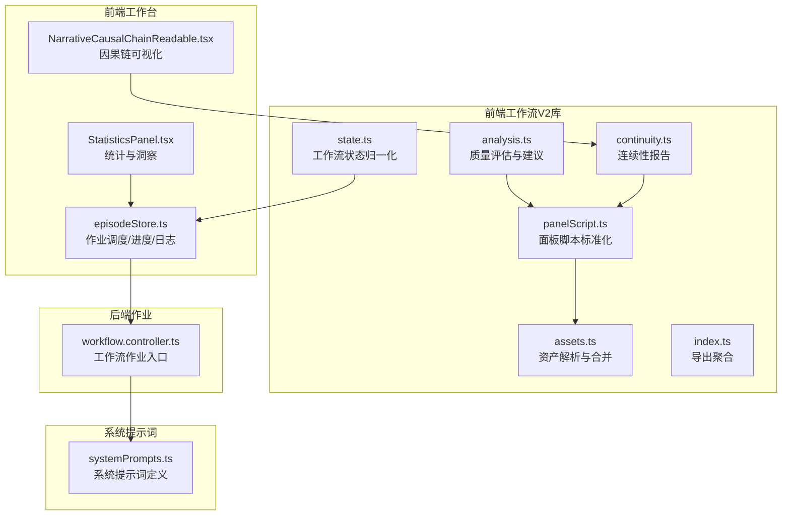
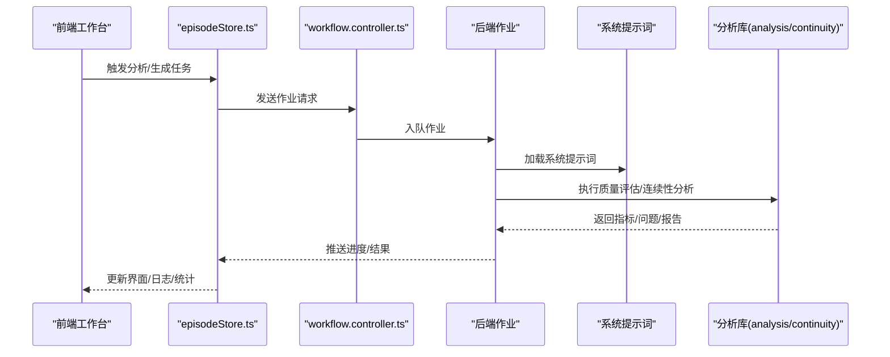
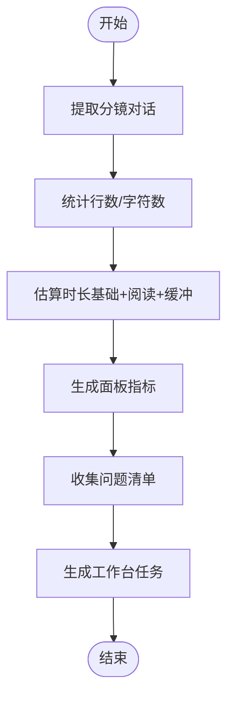
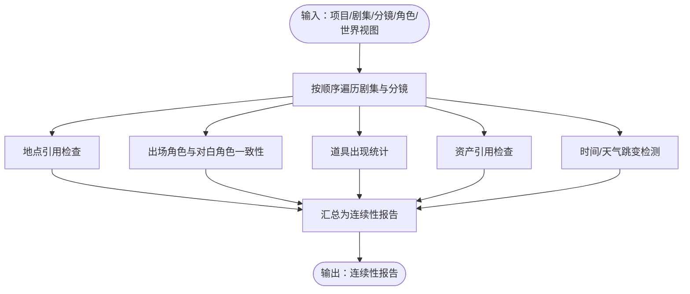
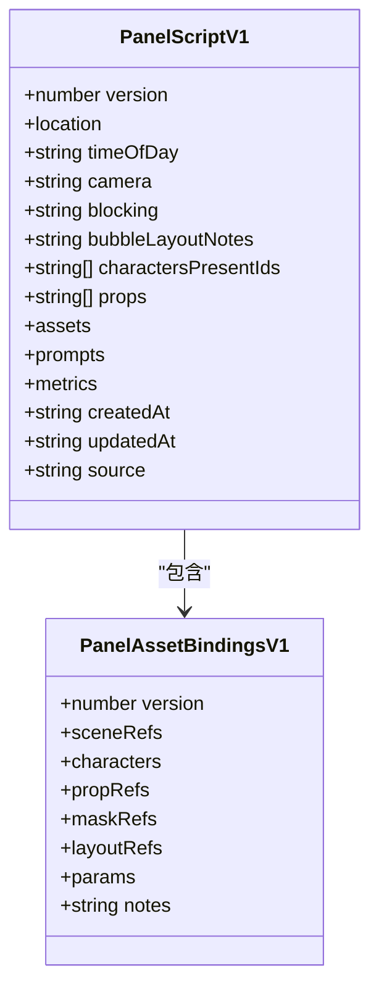
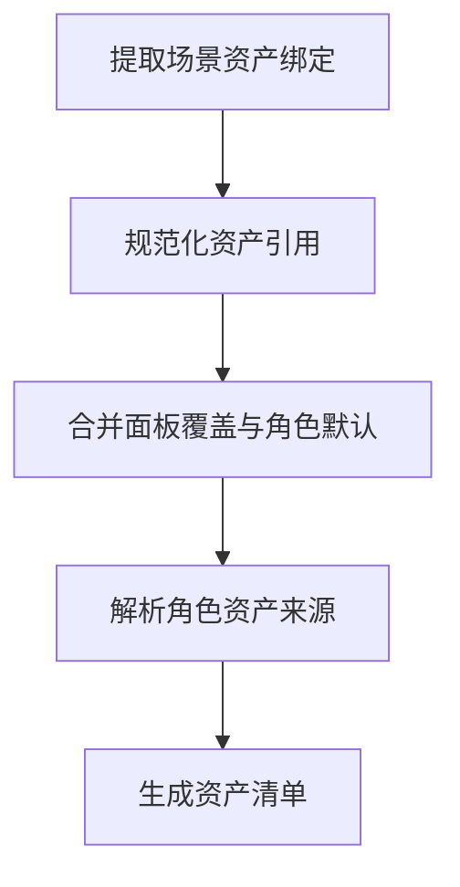
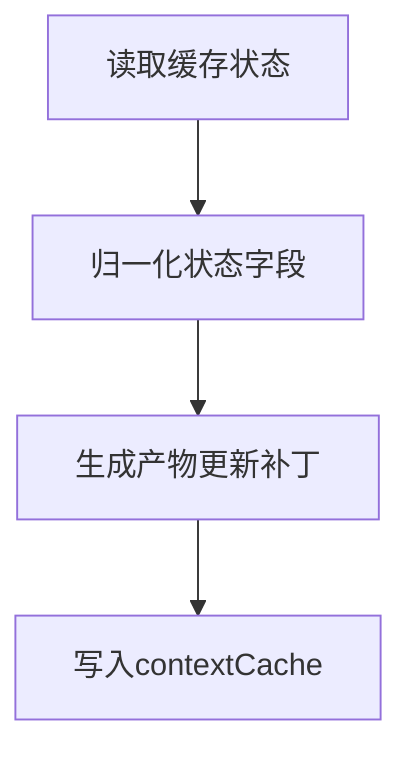
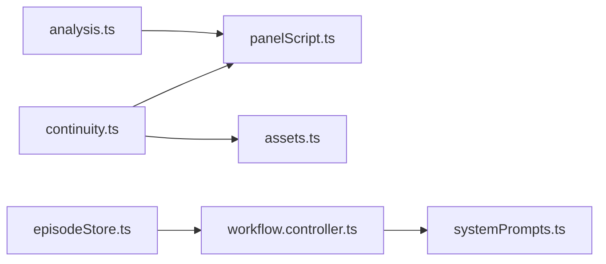

# 分析模块

<cite>
**本文档引用的文件**
- [analysis.ts](file://apps/web/src/lib/workflowV2/analysis.ts)
- [continuity.ts](file://apps/web/src/lib/workflowV2/continuity.ts)
- [panelScript.ts](file://apps/web/src/lib/workflowV2/panelScript.ts)
- [assets.ts](file://apps/web/src/lib/workflowV2/assets.ts)
- [state.ts](file://apps/web/src/lib/workflowV2/state.ts)
- [index.ts](file://apps/web/src/lib/workflowV2/index.ts)
- [episodeStore.ts](file://apps/web/src/stores/episodeStore.ts)
- [NarrativeCausalChainReadable.tsx](file://apps/web/src/components/editor/NarrativeCausalChainReadable.tsx)
- [StatisticsPanel.tsx](file://apps/web/src/components/editor/StatisticsPanel.tsx)
- [workflow.controller.ts](file://apps/api/src/jobs/workflow.controller.ts)
- [systemPrompts.ts](file://packages/shared/src/systemPrompts.ts)
</cite>

## 目录

1. [简介](#简介)
2. [项目结构](#项目结构)
3. [核心组件](#核心组件)
4. [架构总览](#架构总览)
5. [详细组件分析](#详细组件分析)
6. [依赖关系分析](#依赖关系分析)
7. [性能考量](#性能考量)
8. [故障排查指南](#故障排查指南)
9. [结论](#结论)
10. [附录](#附录)

## 简介

本文件面向AIXSSS工作流分析模块，系统化梳理分析引擎的架构设计、数据处理算法与结果生成机制。重点覆盖：

- 连续性分析：跨集/跨格一致性检查与统计
- 内容质量评估：对话密度、时长估算、镜头/站位提示完整性
- 创作建议生成：基于问题与任务清单的建议与工作台指引
- 工作流集成：与前端工作台、后端作业队列、系统提示词的对接
- 实时与批量模式：前端交互与后端批处理的协同
- 配置参数与评估指标：系统提示词键、令牌用量、工作流状态
- 结果可视化：统计面板、因果链可读视图、工作台任务状态
- 定制与扩展：系统提示词、工作流状态、资产绑定与面板脚本

## 项目结构

分析模块位于前端工作流V2库中，围绕“项目-剧集-分镜-场景”层级进行质量评估与连续性检查，并通过工作台组件与后端作业控制器进行集成。

图表来源

- [analysis.ts](file://apps/web/src/lib/workflowV2/analysis.ts#L1-L444)
- [continuity.ts](file://apps/web/src/lib/workflowV2/continuity.ts#L1-L390)
- [panelScript.ts](file://apps/web/src/lib/workflowV2/panelScript.ts#L1-L345)
- [assets.ts](file://apps/web/src/lib/workflowV2/assets.ts#L1-L137)
- [state.ts](file://apps/web/src/lib/workflowV2/state.ts#L1-L139)
- [index.ts](file://apps/web/src/lib/workflowV2/index.ts#L1-L9)
- [episodeStore.ts](file://apps/web/src/stores/episodeStore.ts#L225-L461)
- [NarrativeCausalChainReadable.tsx](file://apps/web/src/components/editor/NarrativeCausalChainReadable.tsx#L497-L521)
- [StatisticsPanel.tsx](file://apps/web/src/components/editor/StatisticsPanel.tsx#L1-L200)
- [workflow.controller.ts](file://apps/api/src/jobs/workflow.controller.ts#L44-L68)
- [systemPrompts.ts](file://packages/shared/src/systemPrompts.ts#L1-L680)

章节来源

- [index.ts](file://apps/web/src/lib/workflowV2/index.ts#L1-L9)

## 核心组件

- 质量评估与建议（analysis.ts）
  - 计算面板指标（对白行数、字符数、估计时长）
  - 项目/剧集/分镜层级的问题清单与工作台任务
- 连续性分析（continuity.ts）
  - 构建连续性报告：按剧集汇总、角色出场统计、道具出现统计、问题计数
  - 地点引用、出场角色、对白角色一致性检查
- 面板脚本标准化（panelScript.ts）
  - 将场景中的上下文摘要标准化为面板脚本，合并提示词与指标
- 资产解析与合并（assets.ts）
  - 解析场景资产清单，合并面板覆盖与角色默认参考图
- 工作流状态归一化（state.ts）
  - 归一化项目/剧集工作流产物状态（草稿/审核/锁定）

章节来源

- [analysis.ts](file://apps/web/src/lib/workflowV2/analysis.ts#L1-L444)
- [continuity.ts](file://apps/web/src/lib/workflowV2/continuity.ts#L1-L390)
- [panelScript.ts](file://apps/web/src/lib/workflowV2/panelScript.ts#L1-L345)
- [assets.ts](file://apps/web/src/lib/workflowV2/assets.ts#L1-L137)
- [state.ts](file://apps/web/src/lib/workflowV2/state.ts#L1-L139)

## 架构总览

分析模块采用“数据标准化-指标计算-问题识别-报告生成”的流水线式架构，前端负责实时评估与可视化，后端负责批处理与系统提示词加载。

图表来源

- [episodeStore.ts](file://apps/web/src/stores/episodeStore.ts#L225-L461)
- [workflow.controller.ts](file://apps/api/src/jobs/workflow.controller.ts#L44-L68)
- [systemPrompts.ts](file://packages/shared/src/systemPrompts.ts#L1-L680)
- [analysis.ts](file://apps/web/src/lib/workflowV2/analysis.ts#L1-L444)
- [continuity.ts](file://apps/web/src/lib/workflowV2/continuity.ts#L1-L390)

## 详细组件分析

### 组件A：质量评估与建议（analysis.ts）

- 面板指标计算
  - 对白行数、字符数、估计时长（考虑基础展示时间、阅读节奏与气泡切换缓冲）
- 项目级问题
  - 故事梗概长度、画风Full Prompt、角色库、世界观、剧集规划
- 剧集级问题
  - 本集一句话概要、核心表达、Outline、分镜列表、时长估算区间
- 分镜级问题
  - 概要/场景锚点/关键帧提示词缺失、对白气泡过多/字数过多、未知角色、镜头/站位提示不足
- 工作台任务
  - 项目圣经、因果链、剧集规划、世界视图、本集核心表达、分镜列表、关键帧提示词、对白

图表来源

- [analysis.ts](file://apps/web/src/lib/workflowV2/analysis.ts#L49-L91)
- [analysis.ts](file://apps/web/src/lib/workflowV2/analysis.ts#L93-L167)
- [analysis.ts](file://apps/web/src/lib/workflowV2/analysis.ts#L169-L335)
- [analysis.ts](file://apps/web/src/lib/workflowV2/analysis.ts#L337-L443)

章节来源

- [analysis.ts](file://apps/web/src/lib/workflowV2/analysis.ts#L1-L444)

### 组件B：连续性分析（continuity.ts）

- 输入：项目、剧集、分镜、角色、世界视图元素
- 输出：连续性报告（生成时间、剧集数、面板总数、问题计数、问题列表、按剧集汇总、角色统计、道具统计）
- 关键检查点
  - 地点引用有效性与缺失
  - 出场角色勾选与对白角色一致性
  - 资产引用完整性（场景参考图、角色参考图）
  - 时间/天气跳变提示
- 统计维度
  - 每集面板数、缺失项计数、唯一道具数
  - 角色出场/对白行数按剧集分布
  - 道具出现次数按剧集分布

图表来源

- [continuity.ts](file://apps/web/src/lib/workflowV2/continuity.ts#L80-L390)

章节来源

- [continuity.ts](file://apps/web/src/lib/workflowV2/continuity.ts#L1-L390)

### 组件C：面板脚本标准化（panelScript.ts）

- 标准化面板脚本字段（地点、时间/天气、镜头、站位、气泡布局说明、出场角色、道具、资产、提示词、指标）
- 合并场景描述/关键帧提示词/运动提示词到面板脚本
- 与面板指标计算联动，确保指标字段一致

图表来源

- [panelScript.ts](file://apps/web/src/lib/workflowV2/panelScript.ts#L1-L345)

章节来源

- [panelScript.ts](file://apps/web/src/lib/workflowV2/panelScript.ts#L1-L345)

### 组件D：资产解析与合并（assets.ts）

- 解析场景资产绑定，合并面板覆盖与角色默认参考图
- 生成角色资产解析结果（来源：面板覆盖/角色默认/缺失）
- 支持权重、表情、姿态、服装、互动、备注等扩展属性

图表来源

- [assets.ts](file://apps/web/src/lib/workflowV2/assets.ts#L71-L136)

章节来源

- [assets.ts](file://apps/web/src/lib/workflowV2/assets.ts#L1-L137)

### 组件E：工作流状态归一化（state.ts）

- 归一化项目/剧集工作流产物状态（草稿/审核/锁定）
- 生成产物更新补丁，支持锁定时间记录

图表来源

- [state.ts](file://apps/web/src/lib/workflowV2/state.ts#L27-L139)

章节来源

- [state.ts](file://apps/web/src/lib/workflowV2/state.ts#L1-L139)

## 依赖关系分析

- analysis.ts 依赖 panelScript.ts（指标计算依赖面板脚本）
- continuity.ts 依赖 panelScript.ts 与 assets.ts（连续性检查依赖面板脚本与资产解析）
- episodeStore.ts 依赖 workflow.controller.ts（前端触发后端作业）
- systemPrompts.ts 为后端作业提供系统提示词（键名约定）

图表来源

- [analysis.ts](file://apps/web/src/lib/workflowV2/analysis.ts#L1-L444)
- [continuity.ts](file://apps/web/src/lib/workflowV2/continuity.ts#L1-L390)
- [panelScript.ts](file://apps/web/src/lib/workflowV2/panelScript.ts#L1-L345)
- [assets.ts](file://apps/web/src/lib/workflowV2/assets.ts#L1-L137)
- [episodeStore.ts](file://apps/web/src/stores/episodeStore.ts#L225-L461)
- [workflow.controller.ts](file://apps/api/src/jobs/workflow.controller.ts#L44-L68)
- [systemPrompts.ts](file://packages/shared/src/systemPrompts.ts#L1-L680)

章节来源

- [index.ts](file://apps/web/src/lib/workflowV2/index.ts#L1-L9)

## 性能考量

- 指标计算复杂度
  - 面板指标：O(n)（n为分镜数），主要为字符计数与简单加法
  - 剧集/项目指标：O(n)（n为分镜总数）
- 连续性报告
  - 复杂度近似 O(E+S+C+P)，E为剧集数，S为分镜数，C为角色数，P为道具数
  - 使用Map/Set进行去重与计数，避免重复扫描
- 建议
  - 在大规模数据下，优先增量更新（仅对变更分镜重算指标）
  - 对重复引用（如世界视图元素、角色）进行缓存映射
  - 将系统提示词加载与解析前置，减少作业执行时延

[本节为通用性能讨论，不直接分析具体文件]

## 故障排查指南

- 无法生成因果链
  - 确认处于API模式，检查系统提示词键是否存在
  - 查看作业日志与进度回调，定位解析失败与JSON修复尝试
- 连续性报告异常
  - 检查地点ID是否存在于世界视图元素
  - 确认出场角色ID与角色库一致
  - 核对资产绑定（场景参考图/角色参考图）是否齐全
- 质量评估告警过多
  - 对白气泡/字数阈值可适当放宽
  - 时长估算受对白密度影响，建议结合镜头与转场调整

章节来源

- [episodeStore.ts](file://apps/web/src/stores/episodeStore.ts#L432-L461)
- [NarrativeCausalChainReadable.tsx](file://apps/web/src/components/editor/NarrativeCausalChainReadable.tsx#L497-L521)
- [continuity.ts](file://apps/web/src/lib/workflowV2/continuity.ts#L140-L294)

## 结论

分析模块通过“标准化-指标-问题-报告”的闭环，为AIXSSS工作流提供了高质量的内容质量评估与连续性保障。前端负责实时反馈与可视化，后端负责批处理与系统提示词管理，二者协同实现从创作到产出的一致性与效率提升。

[本节为总结性内容，不直接分析具体文件]

## 附录

### 分析模块与工作流集成方式

- 前端工作台
  - 通过 episodeStore.ts 触发作业、接收进度与结果
  - 通过 StatisticsPanel.tsx 展示使用统计与洞察
  - 通过 NarrativeCausalChainReadable.tsx 展示因果链产物
- 后端作业
  - 通过 workflow.controller.ts 暴露工作流作业接口
  - 通过 systemPrompts.ts 提供系统提示词键与默认内容

章节来源

- [episodeStore.ts](file://apps/web/src/stores/episodeStore.ts#L225-L461)
- [StatisticsPanel.tsx](file://apps/web/src/components/editor/StatisticsPanel.tsx#L1-L200)
- [NarrativeCausalChainReadable.tsx](file://apps/web/src/components/editor/NarrativeCausalChainReadable.tsx#L497-L521)
- [workflow.controller.ts](file://apps/api/src/jobs/workflow.controller.ts#L44-L68)
- [systemPrompts.ts](file://packages/shared/src/systemPrompts.ts#L1-L680)

### 实时分析与批量分析模式

- 实时分析
  - 前端在编辑器中即时计算面板指标与问题，提供即时反馈
- 批量分析
  - 后端作业队列异步执行，支持系统提示词加载与JSON修复流程

章节来源

- [episodeStore.ts](file://apps/web/src/stores/episodeStore.ts#L225-L461)
- [analysis.ts](file://apps/web/src/lib/workflowV2/analysis.ts#L1-L444)

### 分析配置参数与评估指标

- 配置参数
  - 系统提示词键：项目/剧集/分镜相关键集合
  - 令牌用量：作业完成后统计
  - AI配置：提供者、模型、最大生成长度、AI配置ID
- 评估指标
  - 面板指标：对话行数、对话字符数、估计时长
  - 剧集指标：面板总数、总对话字符数、总估计时长、平均每格时长
  - 连续性指标：缺失地点/未知地点/缺失出场/未知角色ID/未知对白角色名/资产缺失/时间跳变/唯一道具数

章节来源

- [episodeStore.ts](file://apps/web/src/stores/episodeStore.ts#L438-L461)
- [analysis.ts](file://apps/web/src/lib/workflowV2/analysis.ts#L17-L91)
- [continuity.ts](file://apps/web/src/lib/workflowV2/continuity.ts#L28-L78)

### 结果可视化

- 统计面板
  - 使用图表展示调用趋势、成功率、令牌用量、存储占用等
- 因果链可视化
  - 展示阶段产物与一致性校验结果
- 工作台任务
  - 任务状态（待办/阻塞/完成）、级别（错误/警告/信息）

章节来源

- [StatisticsPanel.tsx](file://apps/web/src/components/editor/StatisticsPanel.tsx#L1-L200)
- [NarrativeCausalChainReadable.tsx](file://apps/web/src/components/editor/NarrativeCausalChainReadable.tsx#L497-L521)
- [analysis.ts](file://apps/web/src/lib/workflowV2/analysis.ts#L337-L443)

### 定制与扩展方案

- 系统提示词定制
  - 通过 systemPrompts.ts 中的键名扩展或替换默认内容
- 工作流状态扩展
  - 通过 state.ts 的产物状态结构扩展新的制品类型
- 面板脚本扩展
  - 在 panelScript.ts 中增加新字段与标准化逻辑
- 资产绑定扩展
  - 在 assets.ts 中增加新的资产类型与解析策略

章节来源

- [systemPrompts.ts](file://packages/shared/src/systemPrompts.ts#L1-L680)
- [state.ts](file://apps/web/src/lib/workflowV2/state.ts#L1-L139)
- [panelScript.ts](file://apps/web/src/lib/workflowV2/panelScript.ts#L1-L345)
- [assets.ts](file://apps/web/src/lib/workflowV2/assets.ts#L1-L137)
