# 工作流编排

<cite>
**本文引用的文件**   
- [apps/web/src/lib/workflowV2/index.ts](file://apps/web/src/lib/workflowV2/index.ts)
- [apps/web/src/lib/workflowV2/state.ts](file://apps/web/src/lib/workflowV2/state.ts)
- [apps/web/src/lib/workflowV2/analysis.ts](file://apps/web/src/lib/workflowV2/analysis.ts)
- [apps/web/src/lib/workflowV2/panelScript.ts](file://apps/web/src/lib/workflowV2/panelScript.ts)
- [apps/web/src/lib/workflowV2/finalPrompts.ts](file://apps/web/src/lib/workflowV2/finalPrompts.ts)
- [apps/web/src/lib/workflowV2/continuity.ts](file://apps/web/src/lib/workflowV2/continuity.ts)
- [apps/web/src/lib/workflowV2/assets.ts](file://apps/web/src/lib/workflowV2/assets.ts)
- [apps/web/src/lib/workflowV2/promptLayers.ts](file://apps/web/src/lib/workflowV2/promptLayers.ts)
- [apps/web/src/lib/workflowV2/copyText.ts](file://apps/web/src/lib/workflowV2/copyText.ts)
- [apps/web/src/components/editor/WorkflowWorkbench.tsx](file://apps/web/src/components/editor/WorkflowWorkbench.tsx)
- [apps/web/src/stores/projectStore.ts](file://apps/web/src/stores/projectStore.ts)
- [apps/web/src/types/index.ts](file://apps/web/src/types/index.ts)
</cite>

## 目录

1. [简介](#简介)
2. [项目结构](#项目结构)
3. [核心组件](#核心组件)
4. [架构总览](#架构总览)
5. [详细组件分析](#详细组件分析)
6. [依赖关系分析](#依赖关系分析)
7. [性能考量](#性能考量)
8. [故障排查指南](#故障排查指南)
9. [结论](#结论)
10. [附录](#附录)

## 简介

本文件面向AIXSSS前端应用的工作流编排系统，聚焦于工作流V2的状态机设计、状态转换逻辑与事件处理机制，系统化阐述以下方面：

- 状态机与状态转换：项目/剧集制品状态的规范化、补丁构建与持久化路径
- 任务编排与工作台：基于AI能力与数据完备性的任务清单与阻塞判定
- 分析与质量控制：面板指标计算、问题检测与连续性报告
- 提示词工程：分层提示词、最终提示包与一键复制文本
- 代理系统与自动化：以“制品状态”为驱动的智能决策与自动化处理
- 可扩展性：配置示例、状态流转图、调试工具与定制方案

## 项目结构

工作流V2位于前端应用的lib目录下，围绕“制品状态”“分析与质量”“提示词工程”“资产与连续性”四大域组织代码，入口聚合导出便于上层组件按需使用。

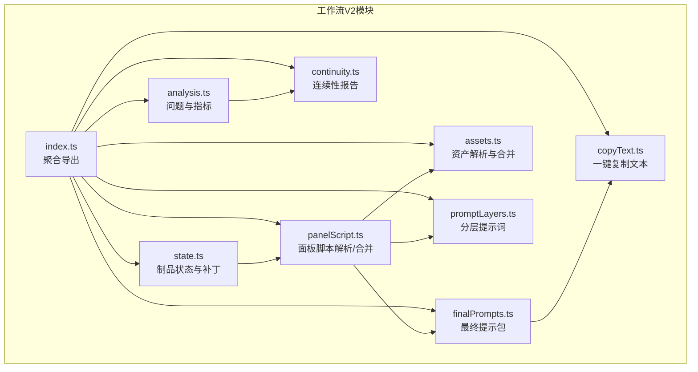

图表来源

- [apps/web/src/lib/workflowV2/index.ts](file://apps/web/src/lib/workflowV2/index.ts#L1-L9)
- [apps/web/src/lib/workflowV2/state.ts](file://apps/web/src/lib/workflowV2/state.ts#L1-L139)
- [apps/web/src/lib/workflowV2/analysis.ts](file://apps/web/src/lib/workflowV2/analysis.ts#L1-L444)
- [apps/web/src/lib/workflowV2/panelScript.ts](file://apps/web/src/lib/workflowV2/panelScript.ts#L1-L345)
- [apps/web/src/lib/workflowV2/finalPrompts.ts](file://apps/web/src/lib/workflowV2/finalPrompts.ts#L1-L231)
- [apps/web/src/lib/workflowV2/continuity.ts](file://apps/web/src/lib/workflowV2/continuity.ts#L1-L390)
- [apps/web/src/lib/workflowV2/assets.ts](file://apps/web/src/lib/workflowV2/assets.ts#L1-L137)
- [apps/web/src/lib/workflowV2/promptLayers.ts](file://apps/web/src/lib/workflowV2/promptLayers.ts#L1-L82)
- [apps/web/src/lib/workflowV2/copyText.ts](file://apps/web/src/lib/workflowV2/copyText.ts#L1-L138)

章节来源

- [apps/web/src/lib/workflowV2/index.ts](file://apps/web/src/lib/workflowV2/index.ts#L1-L9)

## 核心组件

- 制品状态与补丁（state.ts）
  - 将项目/剧集上下文中的workflowV2缓存标准化为制品状态对象
  - 提供构建制品补丁的方法，支持草稿/评审/锁定三态及更新时间戳、锁定时间戳
- 分析与质量（analysis.ts）
  - 面板指标：对话行数、字符数、估算时长
  - 项目/剧集问题清单：基于输入完整性与规范性触发
  - 工作台任务：根据AI配置与数据完备性动态生成可执行/阻塞任务
- 面板脚本（panelScript.ts）
  - 解析/归一化面板脚本，合并用户修改与计算指标（对话、时长）
  - 构建面板脚本补丁，支持增量更新与版本化
- 提示词工程（finalPrompts.ts、promptLayers.ts、copyText.ts）
  - 最终提示包：按关键帧/运动生成图像与负向提示词
  - 分层提示词：基础风格、剧集上下文、面板差量
  - 一键复制文本：整合资产、参数与最终提示词，便于外部工具使用
- 资产解析（assets.ts）
  - 将面板脚本中的资产绑定与角色默认参考图合并，形成解析清单
- 连续性（continuity.ts）
  - 跨集连续性检查：地点引用、出场角色、道具、时间/天气跳变等
  - 生成连续性报告与统计

章节来源

- [apps/web/src/lib/workflowV2/state.ts](file://apps/web/src/lib/workflowV2/state.ts#L27-L138)
- [apps/web/src/lib/workflowV2/analysis.ts](file://apps/web/src/lib/workflowV2/analysis.ts#L59-L443)
- [apps/web/src/lib/workflowV2/panelScript.ts](file://apps/web/src/lib/workflowV2/panelScript.ts#L207-L344)
- [apps/web/src/lib/workflowV2/finalPrompts.ts](file://apps/web/src/lib/workflowV2/finalPrompts.ts#L193-L230)
- [apps/web/src/lib/workflowV2/promptLayers.ts](file://apps/web/src/lib/workflowV2/promptLayers.ts#L21-L81)
- [apps/web/src/lib/workflowV2/copyText.ts](file://apps/web/src/lib/workflowV2/copyText.ts#L23-L137)
- [apps/web/src/lib/workflowV2/assets.ts](file://apps/web/src/lib/workflowV2/assets.ts#L88-L136)
- [apps/web/src/lib/workflowV2/continuity.ts](file://apps/web/src/lib/workflowV2/continuity.ts#L80-L389)

## 架构总览

工作流V2采用“状态驱动 + 数据驱动”的架构：

- 状态驱动：制品状态（草稿/评审/锁定）决定下游任务是否可执行
- 数据驱动：面板脚本、角色、世界观等数据驱动分析与提示词生成
- 上层组件（工作台、面板编辑器）通过调用V2模块函数完成可视化与自动化

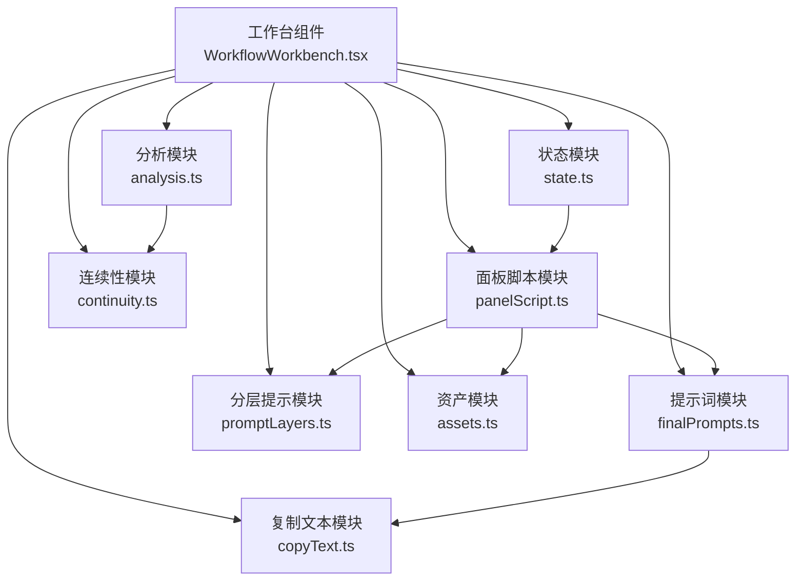

图表来源

- [apps/web/src/components/editor/WorkflowWorkbench.tsx](file://apps/web/src/components/editor/WorkflowWorkbench.tsx#L1-L200)
- [apps/web/src/lib/workflowV2/state.ts](file://apps/web/src/lib/workflowV2/state.ts#L1-L139)
- [apps/web/src/lib/workflowV2/analysis.ts](file://apps/web/src/lib/workflowV2/analysis.ts#L1-L444)
- [apps/web/src/lib/workflowV2/panelScript.ts](file://apps/web/src/lib/workflowV2/panelScript.ts#L1-L345)
- [apps/web/src/lib/workflowV2/finalPrompts.ts](file://apps/web/src/lib/workflowV2/finalPrompts.ts#L1-L231)
- [apps/web/src/lib/workflowV2/promptLayers.ts](file://apps/web/src/lib/workflowV2/promptLayers.ts#L1-L82)
- [apps/web/src/lib/workflowV2/assets.ts](file://apps/web/src/lib/workflowV2/assets.ts#L1-L137)
- [apps/web/src/lib/workflowV2/continuity.ts](file://apps/web/src/lib/workflowV2/continuity.ts#L1-L390)
- [apps/web/src/lib/workflowV2/copyText.ts](file://apps/web/src/lib/workflowV2/copyText.ts#L1-L138)

## 详细组件分析

### 状态机与状态转换（制品状态）

- 设计要点
  - 标准化：将缓存中的workflowV2映射为固定结构，保证字段存在性与类型安全
  - 三态：draft/review/locked，支持锁定时间戳与更新时间戳
  - 补丁：以不可变方式合并新状态，返回可直接写入contextCache的补丁
- 关键流程
  - 项目制品状态：bible/seasonArc（若存在）
  - 剧集制品状态：outline/storyboard/promptPack
  - 状态变更：通过构建补丁写回上下文缓存，驱动UI与后续任务

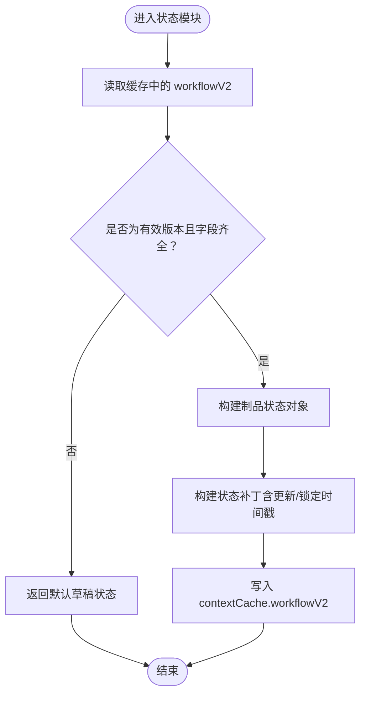

图表来源

- [apps/web/src/lib/workflowV2/state.ts](file://apps/web/src/lib/workflowV2/state.ts#L27-L138)

章节来源

- [apps/web/src/lib/workflowV2/state.ts](file://apps/web/src/lib/workflowV2/state.ts#L27-L138)

### 分析与质量（问题检测与工作台任务）

- 面板指标
  - 基于对话行数与字符数估算时长，兼顾气泡切换与基础展示时间
- 项目问题
  - 概要长度、画风Full Prompt、角色库、世界观、剧集规划
- 剧集问题
  - 本集一句话概要、核心表达、Outline、分镜列表、时长范围、镜头/站位提示、未知角色名、气泡/字符上限
- 工作台任务
  - 依据AI配置与数据完备性动态生成任务状态（待办/阻塞/完成），并标注级别

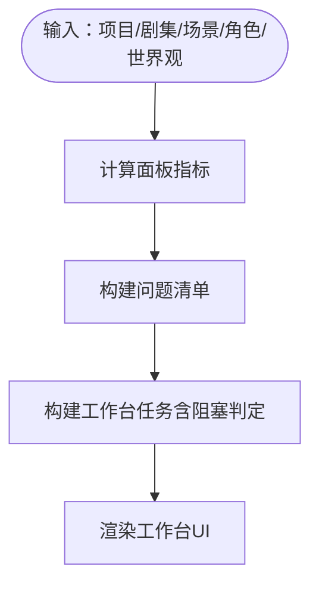

图表来源

- [apps/web/src/lib/workflowV2/analysis.ts](file://apps/web/src/lib/workflowV2/analysis.ts#L59-L443)

章节来源

- [apps/web/src/lib/workflowV2/analysis.ts](file://apps/web/src/lib/workflowV2/analysis.ts#L59-L443)

### 面板脚本（解析、合并与补丁）

- 功能
  - 归一化面板脚本：位置、时间/天气、镜头、站位、气泡版面、出场角色、道具、资产、提示词、指标、来源
  - 合并：将场景描述/关键帧/运动提示词与计算指标合并到面板脚本
  - 补丁：支持增量更新与版本化，保留createdAt/updatedAt/source
- 依赖
  - 依赖分析模块的面板指标计算

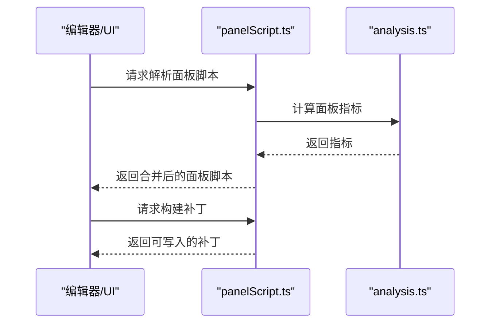

图表来源

- [apps/web/src/lib/workflowV2/panelScript.ts](file://apps/web/src/lib/workflowV2/panelScript.ts#L207-L344)
- [apps/web/src/lib/workflowV2/analysis.ts](file://apps/web/src/lib/workflowV2/analysis.ts#L59-L91)

章节来源

- [apps/web/src/lib/workflowV2/panelScript.ts](file://apps/web/src/lib/workflowV2/panelScript.ts#L207-L344)

### 提示词工程（分层提示词、最终提示包与复制文本）

- 分层提示词
  - Base：画风Full Prompt
  - Episode：项目/剧集标题、概要
  - Panel Delta：地点、时间/天气、镜头、站位、气泡、道具、角色资产差量与约束
- 最终提示包
  - 图像提示词：按关键帧生成，叠加风格锚点与关键帧提示词
  - 负向提示词：锚点避免项 + 关键帧避免项
  - I2V提示词：风格锚点 + 锚点主体 + 运动提示词
- 一键复制文本
  - 整合输入图片、角色参考图、布局/掩码、参数建议、分层提示词与最终提示词

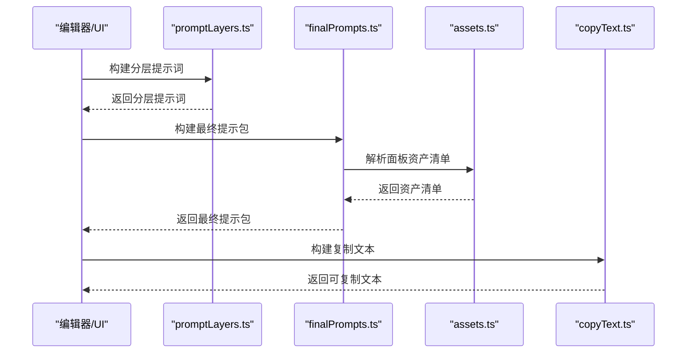

图表来源

- [apps/web/src/lib/workflowV2/promptLayers.ts](file://apps/web/src/lib/workflowV2/promptLayers.ts#L21-L81)
- [apps/web/src/lib/workflowV2/finalPrompts.ts](file://apps/web/src/lib/workflowV2/finalPrompts.ts#L193-L230)
- [apps/web/src/lib/workflowV2/assets.ts](file://apps/web/src/lib/workflowV2/assets.ts#L88-L136)
- [apps/web/src/lib/workflowV2/copyText.ts](file://apps/web/src/lib/workflowV2/copyText.ts#L23-L137)

章节来源

- [apps/web/src/lib/workflowV2/promptLayers.ts](file://apps/web/src/lib/workflowV2/promptLayers.ts#L21-L81)
- [apps/web/src/lib/workflowV2/finalPrompts.ts](file://apps/web/src/lib/workflowV2/finalPrompts.ts#L193-L230)
- [apps/web/src/lib/workflowV2/copyText.ts](file://apps/web/src/lib/workflowV2/copyText.ts#L23-L137)

### 资产解析与合并

- 功能
  - 将面板脚本中的资产绑定与角色默认参考图合并，形成解析清单
  - 支持按URL去重、权重、表情/姿态/服装/交互等差量指令
- 用途
  - 为提示词工程与连续性检查提供统一的资产视图

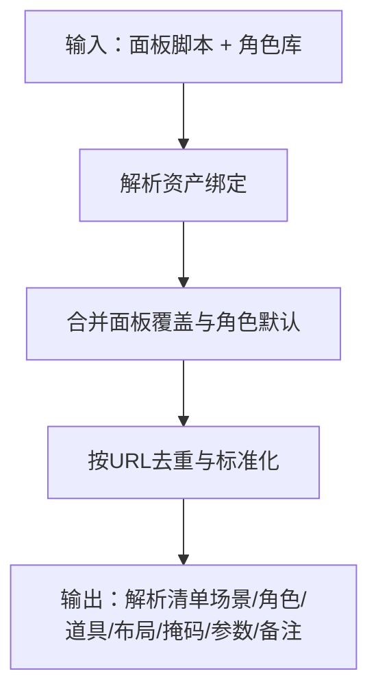

图表来源

- [apps/web/src/lib/workflowV2/assets.ts](file://apps/web/src/lib/workflowV2/assets.ts#L88-L136)

章节来源

- [apps/web/src/lib/workflowV2/assets.ts](file://apps/web/src/lib/workflowV2/assets.ts#L88-L136)

### 连续性检查与报告

- 功能
  - 地点引用校验、出场角色与对白角色一致性、道具出现统计、时间/天气跳变检测
  - 生成按剧集/角色/道具维度的统计与问题清单
- 用途
  - 保障跨集一致性与叙事连贯性

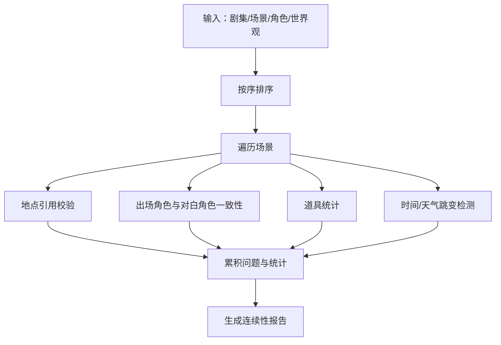

图表来源

- [apps/web/src/lib/workflowV2/continuity.ts](file://apps/web/src/lib/workflowV2/continuity.ts#L80-L389)

章节来源

- [apps/web/src/lib/workflowV2/continuity.ts](file://apps/web/src/lib/workflowV2/continuity.ts#L80-L389)

### 代理系统与自动化（以制品状态为驱动）

- 设计模式
  - 策略模式：不同制品状态对应不同的自动化策略（如锁定后允许下游任务）
  - 观察者模式：状态变化触发UI更新与任务重算
- 自动化处理
  - 当制品状态为锁定时，工作台任务自动变为可执行
  - 当数据不完整时，任务被标记为阻塞，引导用户补齐
- 事件处理
  - UI通过状态补丁接口更新制品状态，触发分析与提示词模块重新计算

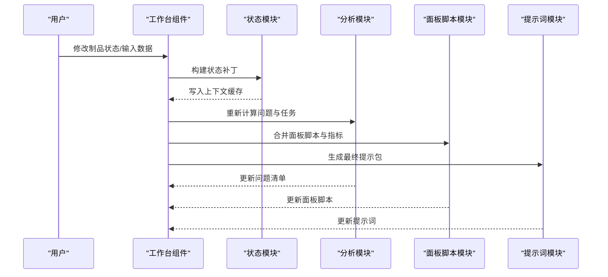

图表来源

- [apps/web/src/lib/workflowV2/state.ts](file://apps/web/src/lib/workflowV2/state.ts#L76-L138)
- [apps/web/src/lib/workflowV2/analysis.ts](file://apps/web/src/lib/workflowV2/analysis.ts#L337-L443)
- [apps/web/src/lib/workflowV2/panelScript.ts](file://apps/web/src/lib/workflowV2/panelScript.ts#L255-L344)
- [apps/web/src/lib/workflowV2/finalPrompts.ts](file://apps/web/src/lib/workflowV2/finalPrompts.ts#L193-L230)

章节来源

- [apps/web/src/lib/workflowV2/state.ts](file://apps/web/src/lib/workflowV2/state.ts#L76-L138)
- [apps/web/src/components/editor/WorkflowWorkbench.tsx](file://apps/web/src/components/editor/WorkflowWorkbench.tsx#L1-L200)

## 依赖关系分析

- 模块内聚与耦合
  - state.ts为底层基础设施，panelScript.ts/analysis.ts/continuity.ts依赖其制品状态
  - assets.ts为通用解析模块，被panelScript.ts、finalPrompts.ts、copyText.ts复用
  - promptLayers.ts与finalPrompts.ts共同依赖panelScript.ts与assets.ts
  - copyText.ts聚合多个模块输出，形成最终交付物
- 外部依赖
  - 类型定义来自types/index.ts
  - UI组件来自components/editor/WorkflowWorkbench.tsx

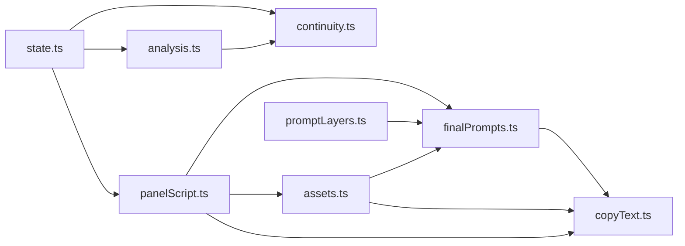

图表来源

- [apps/web/src/lib/workflowV2/state.ts](file://apps/web/src/lib/workflowV2/state.ts#L1-L139)
- [apps/web/src/lib/workflowV2/panelScript.ts](file://apps/web/src/lib/workflowV2/panelScript.ts#L1-L345)
- [apps/web/src/lib/workflowV2/analysis.ts](file://apps/web/src/lib/workflowV2/analysis.ts#L1-L444)
- [apps/web/src/lib/workflowV2/continuity.ts](file://apps/web/src/lib/workflowV2/continuity.ts#L1-L390)
- [apps/web/src/lib/workflowV2/assets.ts](file://apps/web/src/lib/workflowV2/assets.ts#L1-L137)
- [apps/web/src/lib/workflowV2/finalPrompts.ts](file://apps/web/src/lib/workflowV2/finalPrompts.ts#L1-L231)
- [apps/web/src/lib/workflowV2/promptLayers.ts](file://apps/web/src/lib/workflowV2/promptLayers.ts#L1-L82)
- [apps/web/src/lib/workflowV2/copyText.ts](file://apps/web/src/lib/workflowV2/copyText.ts#L1-L138)

章节来源

- [apps/web/src/lib/workflowV2/index.ts](file://apps/web/src/lib/workflowV2/index.ts#L1-L9)
- [apps/web/src/types/index.ts](file://apps/web/src/types/index.ts#L1-L200)

## 性能考量

- 计算复杂度
  - 面板指标与问题检测：O(N)（N为场景数）
  - 连续性统计：O(S + C + P)，S为场景数，C为角色数，P为道具数
  - 资产解析：O(R + K)，R为角色绑定数，K为关键帧数
- 优化建议
  - 批量场景处理时进行分页/节流
  - 缓存面板指标与资产解析结果，避免重复计算
  - 在UI侧对高频更新进行防抖

## 故障排查指南

- 常见问题定位
  - 画风Full Prompt缺失：导致任务阻塞与提示词不完整
  - 分镜列表为空：导致关键帧/对白任务阻塞
  - 地点引用不存在：连续性报告会提示未知ID
  - 出场角色与对白角色不一致：提示勾选缺失
- 调试工具
  - 工作台问题面板：按级别（错误/警告/提示）展示
  - 连续性报告：查看跨集统计与问题明细
  - 一键复制文本：核对最终提示词与资产清单
- 操作建议
  - 先完善项目圣经（画风/角色/世界观），再进行剧集规划
  - 锁定关键制品（如本集核心表达/Outline）以解锁下游任务
  - 使用连续性报告定期校验跨集一致性

章节来源

- [apps/web/src/lib/workflowV2/analysis.ts](file://apps/web/src/lib/workflowV2/analysis.ts#L93-L167)
- [apps/web/src/lib/workflowV2/continuity.ts](file://apps/web/src/lib/workflowV2/continuity.ts#L140-L294)
- [apps/web/src/components/editor/WorkflowWorkbench.tsx](file://apps/web/src/components/editor/WorkflowWorkbench.tsx#L183-L215)

## 结论

工作流V2通过“制品状态 + 数据驱动”的设计，实现了从项目到剧集再到面板脚本的全链路自动化与质量控制。模块化架构使分析、提示词工程与连续性检查解耦，便于扩展与维护。配合工作台UI与一键复制文本，显著提升了创作效率与产出质量。

## 附录

### 工作流配置示例（概念性）

- 项目圣经
  - 画风Full Prompt：用于统一风格锚点
  - 角色卡：外观锚点、口吻、动机
  - 世界观/地点：空间一致性基础
- 剧集规划
  - 每集一句话概要：功能定位（推进/反转/情绪高点/铺垫/收尾钩子）
  - 核心表达：主题/情绪/冲突方向
  - Outline：节拍拆分与信息点/情绪标注
- 面板脚本
  - 场景锚点：环境一致性信息（地点/人物/关键道具/氛围）
  - 关键帧提示词：可直接给生图工具的静态提示词
  - 运动提示词：I2V相关提示词

### 状态流转图（概念性）

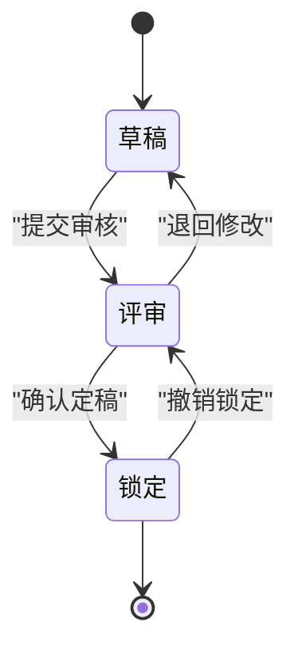

### 调试工具使用指南

- 工作台问题面板：点击“处理”按钮快速跳转至对应步骤
- 连续性报告：按剧集/角色/道具筛选，定位异常
- 一键复制文本：复制到外部工具（如生图/视频生成平台）
