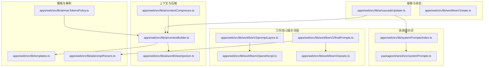
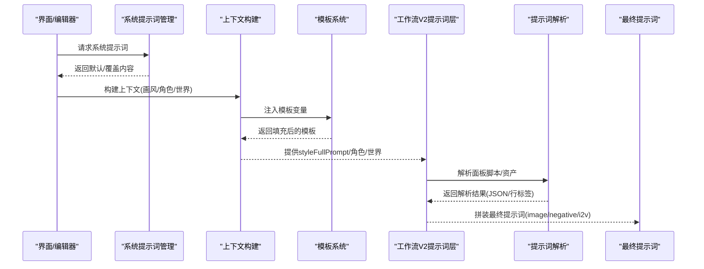
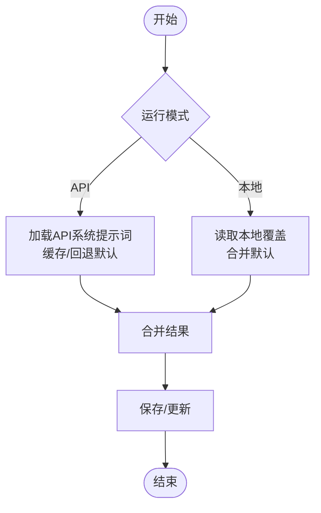
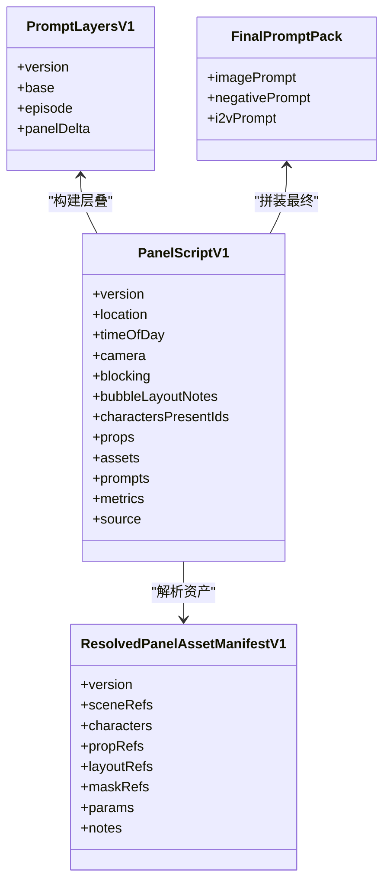
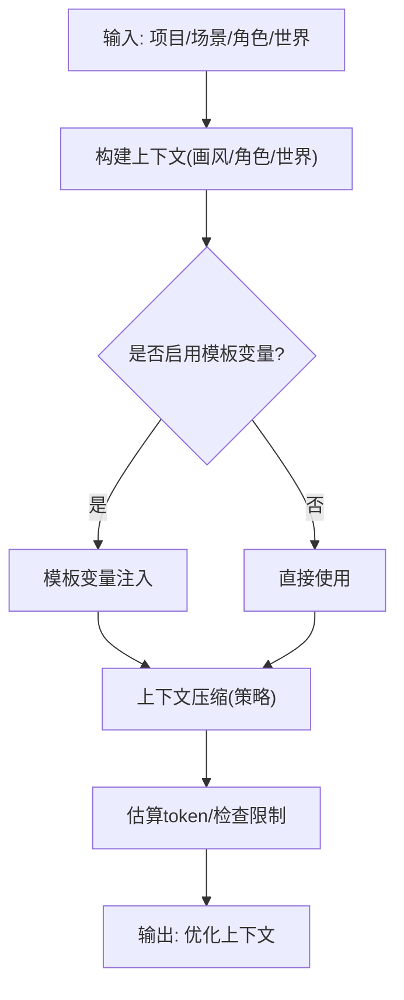
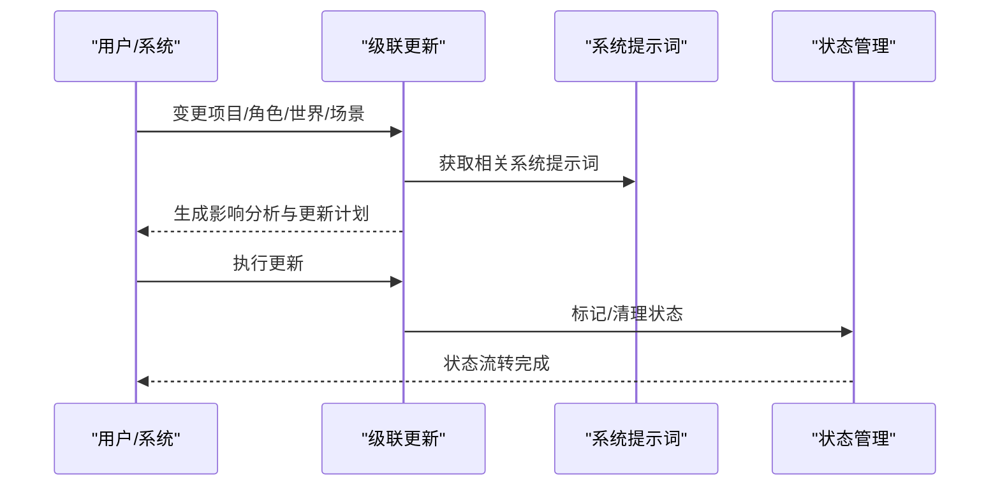
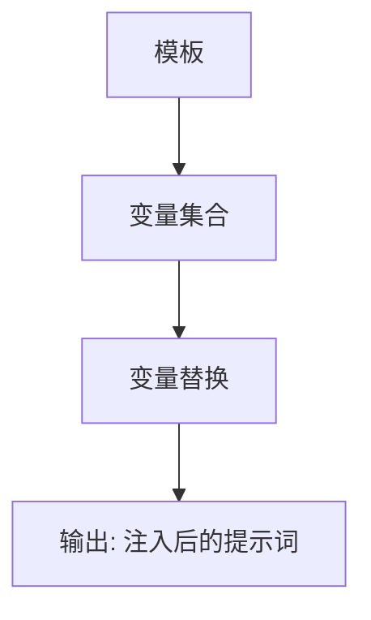
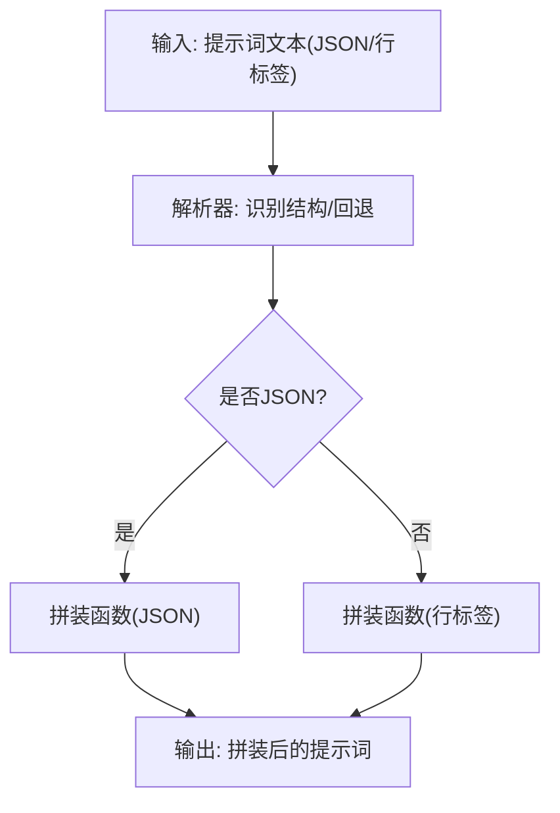
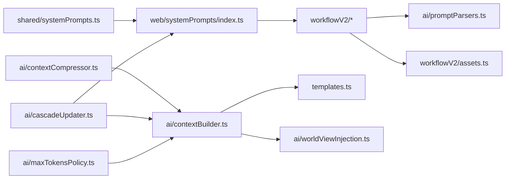

# 提示词工程

<cite>
**本文档引用的文件**
- [apps/web/src/lib/systemPrompts/index.ts](file://apps/web/src/lib/systemPrompts/index.ts)
- [packages/shared/src/systemPrompts.ts](file://packages/shared/src/systemPrompts.ts)
- [apps/web/src/lib/workflowV2/promptLayers.ts](file://apps/web/src/lib/workflowV2/promptLayers.ts)
- [apps/web/src/lib/workflowV2/panelScript.ts](file://apps/web/src/lib/workflowV2/panelScript.ts)
- [apps/web/src/lib/workflowV2/finalPrompts.ts](file://apps/web/src/lib/workflowV2/finalPrompts.ts)
- [apps/web/src/lib/ai/contextBuilder.ts](file://apps/web/src/lib/ai/contextBuilder.ts)
- [apps/web/src/lib/ai/contextCompressor.ts](file://apps/web/src/lib/ai/contextCompressor.ts)
- [apps/web/src/lib/ai/cascadeUpdater.ts](file://apps/web/src/lib/ai/cascadeUpdater.ts)
- [apps/web/src/lib/ai/promptParsers.ts](file://apps/web/src/lib/ai/promptParsers.ts)
- [apps/web/src/lib/templates.ts](file://apps/web/src/lib/templates.ts)
- [apps/web/src/lib/ai/worldViewInjection.ts](file://apps/web/src/lib/ai/worldViewInjection.ts)
- [apps/web/src/lib/workflowV2/assets.ts](file://apps/web/src/lib/workflowV2/assets.ts)
- [apps/web/src/lib/ai/maxTokensPolicy.ts](file://apps/web/src/lib/ai/maxTokensPolicy.ts)
- [apps/web/src/components/SystemPromptsPage.tsx](file://apps/web/src/components/SystemPromptsPage.tsx)
- [apps/web/src/lib/workflowV2/state.ts](file://apps/web/src/lib/workflowV2/state.ts)
</cite>

## 目录

1. [简介](#简介)
2. [项目结构](#项目结构)
3. [核心组件](#核心组件)
4. [架构总览](#架构总览)
5. [详细组件分析](#详细组件分析)
6. [依赖分析](#依赖分析)
7. [性能考量](#性能考量)
8. [故障排查指南](#故障排查指南)
9. [结论](#结论)
10. [附录](#附录)

## 简介

本文件面向AIXSSS提示词工程系统，系统性梳理提示词生成策略、多层提示词架构与最终提示词优化机制，覆盖分镜脚本文本生成、提示词层叠处理、内容连贯性保障、模板系统与动态参数注入、上下文适配算法、配置示例、效果对比与优化技巧，并提供自定义提示词模板开发指南。文档旨在帮助开发者与运营人员高效理解与扩展提示词工程能力。

## 项目结构

提示词工程相关代码主要分布在前端Web应用与共享包中：

- 系统提示词定义与运行时加载：shared包提供默认系统提示词清单，Web端提供运行时读取、覆盖与API同步逻辑。
- 工作流V2提示词层：封装分镜脚本、面板资产、最终提示词拼装与复制。
- 上下文构建与压缩：整合画风、角色、世界观信息，支持模板变量注入与上下文压缩。
- 级联更新与连贯性：基于依赖关系与影响分析，驱动分镜级联更新与状态流转。
- 模板库与注入：内置模板与动态参数注入，支持世界注入时机控制。

图表来源

- [apps/web/src/lib/systemPrompts/index.ts](file://apps/web/src/lib/systemPrompts/index.ts#L1-L197)
- [packages/shared/src/systemPrompts.ts](file://packages/shared/src/systemPrompts.ts#L1-L800)
- [apps/web/src/lib/workflowV2/promptLayers.ts](file://apps/web/src/lib/workflowV2/promptLayers.ts#L1-L82)
- [apps/web/src/lib/workflowV2/panelScript.ts](file://apps/web/src/lib/workflowV2/panelScript.ts#L1-L345)
- [apps/web/src/lib/workflowV2/finalPrompts.ts](file://apps/web/src/lib/workflowV2/finalPrompts.ts#L1-L231)
- [apps/web/src/lib/workflowV2/assets.ts](file://apps/web/src/lib/workflowV2/assets.ts#L1-L137)
- [apps/web/src/lib/ai/contextBuilder.ts](file://apps/web/src/lib/ai/contextBuilder.ts#L1-L435)
- [apps/web/src/lib/ai/contextCompressor.ts](file://apps/web/src/lib/ai/contextCompressor.ts#L1-L519)
- [apps/web/src/lib/ai/worldViewInjection.ts](file://apps/web/src/lib/ai/worldViewInjection.ts#L40-L191)
- [apps/web/src/lib/ai/cascadeUpdater.ts](file://apps/web/src/lib/ai/cascadeUpdater.ts#L1-L694)
- [apps/web/src/lib/workflowV2/state.ts](file://apps/web/src/lib/workflowV2/state.ts#L1-L139)
- [apps/web/src/lib/templates.ts](file://apps/web/src/lib/templates.ts#L1-L313)
- [apps/web/src/lib/ai/promptParsers.ts](file://apps/web/src/lib/ai/promptParsers.ts#L1-L637)
- [apps/web/src/lib/ai/maxTokensPolicy.ts](file://apps/web/src/lib/ai/maxTokensPolicy.ts#L1-L63)

章节来源

- [apps/web/src/lib/systemPrompts/index.ts](file://apps/web/src/lib/systemPrompts/index.ts#L1-L197)
- [packages/shared/src/systemPrompts.ts](file://packages/shared/src/systemPrompts.ts#L1-L800)

## 核心组件

- 系统提示词管理：提供默认系统提示词清单、运行时读取/覆盖、API同步与缓存失效。
- 工作流V2提示词层：构建分镜脚本、解析面板资产、拼装最终提示词与复制文本。
- 上下文构建与压缩：聚合画风、角色、世界观，模板变量注入，上下文压缩与token预算控制。
- 级联更新与状态：分析项目/角色/世界设定变更对分镜的影响，生成更新计划与状态流转。
- 模板系统与动态参数：内置模板库与变量注入，支持世界注入时机控制。
- 提示词解析与拼装：解析JSON/行标签格式，拼装场景锚点、关键帧、运动提示词。

章节来源

- [apps/web/src/lib/systemPrompts/index.ts](file://apps/web/src/lib/systemPrompts/index.ts#L84-L197)
- [apps/web/src/lib/workflowV2/promptLayers.ts](file://apps/web/src/lib/workflowV2/promptLayers.ts#L21-L82)
- [apps/web/src/lib/workflowV2/panelScript.ts](file://apps/web/src/lib/workflowV2/panelScript.ts#L255-L281)
- [apps/web/src/lib/workflowV2/finalPrompts.ts](file://apps/web/src/lib/workflowV2/finalPrompts.ts#L193-L231)
- [apps/web/src/lib/ai/contextBuilder.ts](file://apps/web/src/lib/ai/contextBuilder.ts#L276-L435)
- [apps/web/src/lib/ai/contextCompressor.ts](file://apps/web/src/lib/ai/contextCompressor.ts#L240-L298)
- [apps/web/src/lib/ai/cascadeUpdater.ts](file://apps/web/src/lib/ai/cascadeUpdater.ts#L72-L223)
- [apps/web/src/lib/templates.ts](file://apps/web/src/lib/templates.ts#L1-L313)
- [apps/web/src/lib/ai/promptParsers.ts](file://apps/web/src/lib/ai/promptParsers.ts#L389-L637)

## 架构总览

提示词工程采用“系统提示词 + 上下文构建 + 模板注入 + 层叠提示词 + 最终拼装”的多层架构，配合级联更新与上下文压缩，确保生成质量与效率。

图表来源

- [apps/web/src/lib/systemPrompts/index.ts](file://apps/web/src/lib/systemPrompts/index.ts#L84-L124)
- [apps/web/src/lib/ai/contextBuilder.ts](file://apps/web/src/lib/ai/contextBuilder.ts#L310-L387)
- [apps/web/src/lib/templates.ts](file://apps/web/src/lib/templates.ts#L297-L313)
- [apps/web/src/lib/workflowV2/promptLayers.ts](file://apps/web/src/lib/workflowV2/promptLayers.ts#L21-L82)
- [apps/web/src/lib/workflowV2/panelScript.ts](file://apps/web/src/lib/workflowV2/panelScript.ts#L255-L281)
- [apps/web/src/lib/ai/promptParsers.ts](file://apps/web/src/lib/ai/promptParsers.ts#L389-L470)
- [apps/web/src/lib/workflowV2/finalPrompts.ts](file://apps/web/src/lib/workflowV2/finalPrompts.ts#L193-L231)

## 详细组件分析

### 系统提示词管理

- 默认系统提示词：集中定义于共享包，涵盖工作流、修复、叙事因果链等类别，提供中文/英文默认内容与用途说明。
- 运行时加载：Web端支持本地覆盖与API同步，优先使用覆盖内容，否则回退默认；API模式下维护缓存并支持失效刷新。
- UI优化：提供系统提示词页面，内置优化器提示词与用户提示词构建逻辑，便于人工优化与对比。

图表来源

- [apps/web/src/lib/systemPrompts/index.ts](file://apps/web/src/lib/systemPrompts/index.ts#L64-L124)
- [apps/web/src/lib/systemPrompts/index.ts](file://apps/web/src/lib/systemPrompts/index.ts#L126-L197)
- [apps/web/src/components/SystemPromptsPage.tsx](file://apps/web/src/components/SystemPromptsPage.tsx#L53-L89)

章节来源

- [packages/shared/src/systemPrompts.ts](file://packages/shared/src/systemPrompts.ts#L22-L800)
- [apps/web/src/lib/systemPrompts/index.ts](file://apps/web/src/lib/systemPrompts/index.ts#L84-L197)
- [apps/web/src/components/SystemPromptsPage.tsx](file://apps/web/src/components/SystemPromptsPage.tsx#L47-L89)

### 工作流V2提示词层

- 分镜脚本解析：规范化面板脚本，合并场景描述、关键帧与运动提示词，计算指标，支持增量补丁。
- 面板资产解析：整合场景/角色/道具/布局/掩码等资源引用，支持权重与备注。
- 提示词层叠：构建base/episode/panelDelta三层提示词，统一中英文本，保证上下文一致性。
- 最终提示词拼装：按JSON/行标签两种格式解析，拼装图像提示词、负向提示词与I2V提示词，支持一键复制。

图表来源

- [apps/web/src/lib/workflowV2/panelScript.ts](file://apps/web/src/lib/workflowV2/panelScript.ts#L207-L281)
- [apps/web/src/lib/workflowV2/assets.ts](file://apps/web/src/lib/workflowV2/assets.ts#L60-L137)
- [apps/web/src/lib/workflowV2/promptLayers.ts](file://apps/web/src/lib/workflowV2/promptLayers.ts#L14-L82)
- [apps/web/src/lib/workflowV2/finalPrompts.ts](file://apps/web/src/lib/workflowV2/finalPrompts.ts#L177-L231)

章节来源

- [apps/web/src/lib/workflowV2/panelScript.ts](file://apps/web/src/lib/workflowV2/panelScript.ts#L255-L281)
- [apps/web/src/lib/workflowV2/assets.ts](file://apps/web/src/lib/workflowV2/assets.ts#L88-L137)
- [apps/web/src/lib/workflowV2/promptLayers.ts](file://apps/web/src/lib/workflowV2/promptLayers.ts#L21-L82)
- [apps/web/src/lib/workflowV2/finalPrompts.ts](file://apps/web/src/lib/workflowV2/finalPrompts.ts#L193-L231)

### 上下文构建与压缩

- 上下文构建：聚合画风、角色（外观/性格/关系/出场）、世界观，支持多种模式与长度限制，提供模板变量注入。
- 上下文压缩：按策略压缩项目核心信息、分镜摘要与历史上下文，估算token并检查限制，支持AI智能压缩与关键词回退。
- 世界注入：控制在分镜列表/场景描述/角色生成等时机注入世界设定，支持持久化设置与时机推断。

图表来源

- [apps/web/src/lib/ai/contextBuilder.ts](file://apps/web/src/lib/ai/contextBuilder.ts#L276-L435)
- [apps/web/src/lib/ai/contextCompressor.ts](file://apps/web/src/lib/ai/contextCompressor.ts#L240-L298)
- [apps/web/src/lib/ai/worldViewInjection.ts](file://apps/web/src/lib/ai/worldViewInjection.ts#L40-L191)

章节来源

- [apps/web/src/lib/ai/contextBuilder.ts](file://apps/web/src/lib/ai/contextBuilder.ts#L105-L435)
- [apps/web/src/lib/ai/contextCompressor.ts](file://apps/web/src/lib/ai/contextCompressor.ts#L55-L298)
- [apps/web/src/lib/ai/worldViewInjection.ts](file://apps/web/src/lib/ai/worldViewInjection.ts#L66-L191)

### 级联更新与状态

- 影响分析：分析项目设定/角色/世界/场景变更对后续分镜的影响，生成更新计划与优先级。
- 状态管理：标记needs_update，按字段更新后清理标记并进入相应状态，支持批量快照与恢复。
- AI回退：提供AI智能分析与规则引擎回退，保证稳定性。

图表来源

- [apps/web/src/lib/ai/cascadeUpdater.ts](file://apps/web/src/lib/ai/cascadeUpdater.ts#L72-L223)
- [apps/web/src/lib/systemPrompts/index.ts](file://apps/web/src/lib/systemPrompts/index.ts#L84-L124)
- [apps/web/src/lib/workflowV2/state.ts](file://apps/web/src/lib/workflowV2/state.ts#L76-L139)

章节来源

- [apps/web/src/lib/ai/cascadeUpdater.ts](file://apps/web/src/lib/ai/cascadeUpdater.ts#L72-L440)
- [apps/web/src/lib/workflowV2/state.ts](file://apps/web/src/lib/workflowV2/state.ts#L27-L139)

### 模板系统与动态参数注入

- 内置模板：场景锚点、动作描述、镜头提示词、风格化模板等，支持变量占位与样式标记。
- 变量注入：按模板变量集合替换占位符，支持多处复用与组合。
- 世界注入：根据注入时机在不同阶段注入世界设定，支持持久化与默认设置。

图表来源

- [apps/web/src/lib/templates.ts](file://apps/web/src/lib/templates.ts#L297-L313)
- [apps/web/src/lib/ai/contextBuilder.ts](file://apps/web/src/lib/ai/contextBuilder.ts#L310-L387)
- [apps/web/src/lib/ai/worldViewInjection.ts](file://apps/web/src/lib/ai/worldViewInjection.ts#L133-L191)

章节来源

- [apps/web/src/lib/templates.ts](file://apps/web/src/lib/templates.ts#L7-L281)
- [apps/web/src/lib/ai/contextBuilder.ts](file://apps/web/src/lib/ai/contextBuilder.ts#L310-L387)
- [apps/web/src/lib/ai/worldViewInjection.ts](file://apps/web/src/lib/ai/worldViewInjection.ts#L133-L191)

### 提示词解析与拼装

- 解析器：支持JSON与行标签两种格式，自动识别结构化标签/JSON，回退到旧格式解析。
- 拼装器：按JSON/行标签分别拼装场景锚点、关键帧、运动提示词，支持复制文本与最终提示词打包。

图表来源

- [apps/web/src/lib/ai/promptParsers.ts](file://apps/web/src/lib/ai/promptParsers.ts#L389-L637)
- [apps/web/src/lib/workflowV2/finalPrompts.ts](file://apps/web/src/lib/workflowV2/finalPrompts.ts#L29-L95)

章节来源

- [apps/web/src/lib/ai/promptParsers.ts](file://apps/web/src/lib/ai/promptParsers.ts#L389-L637)
- [apps/web/src/lib/workflowV2/finalPrompts.ts](file://apps/web/src/lib/workflowV2/finalPrompts.ts#L193-L231)

## 依赖分析

- 组件耦合：系统提示词管理与共享包强耦合；工作流V2层依赖面板脚本与资产解析；上下文构建依赖模板与世界注入；级联更新依赖系统提示词与上下文构建。
- 外部依赖：API模式下的系统提示词同步、Provider类型与模型能力对maxTokens策略的影响。
- 循环依赖：当前文件组织避免循环依赖，模块职责清晰。

图表来源

- [packages/shared/src/systemPrompts.ts](file://packages/shared/src/systemPrompts.ts#L1-L800)
- [apps/web/src/lib/systemPrompts/index.ts](file://apps/web/src/lib/systemPrompts/index.ts#L1-L197)
- [apps/web/src/lib/workflowV2/promptLayers.ts](file://apps/web/src/lib/workflowV2/promptLayers.ts#L1-L82)
- [apps/web/src/lib/workflowV2/panelScript.ts](file://apps/web/src/lib/workflowV2/panelScript.ts#L1-L345)
- [apps/web/src/lib/workflowV2/finalPrompts.ts](file://apps/web/src/lib/workflowV2/finalPrompts.ts#L1-L231)
- [apps/web/src/lib/workflowV2/assets.ts](file://apps/web/src/lib/workflowV2/assets.ts#L1-L137)
- [apps/web/src/lib/ai/contextBuilder.ts](file://apps/web/src/lib/ai/contextBuilder.ts#L1-L435)
- [apps/web/src/lib/ai/contextCompressor.ts](file://apps/web/src/lib/ai/contextCompressor.ts#L1-L519)
- [apps/web/src/lib/ai/cascadeUpdater.ts](file://apps/web/src/lib/ai/cascadeUpdater.ts#L1-L694)
- [apps/web/src/lib/templates.ts](file://apps/web/src/lib/templates.ts#L1-L313)
- [apps/web/src/lib/ai/worldViewInjection.ts](file://apps/web/src/lib/ai/worldViewInjection.ts#L1-L191)
- [apps/web/src/lib/ai/maxTokensPolicy.ts](file://apps/web/src/lib/ai/maxTokensPolicy.ts#L1-L63)

章节来源

- [apps/web/src/lib/systemPrompts/index.ts](file://apps/web/src/lib/systemPrompts/index.ts#L1-L197)
- [apps/web/src/lib/workflowV2/finalPrompts.ts](file://apps/web/src/lib/workflowV2/finalPrompts.ts#L1-L231)
- [apps/web/src/lib/ai/contextBuilder.ts](file://apps/web/src/lib/ai/contextBuilder.ts#L1-L435)
- [apps/web/src/lib/ai/cascadeUpdater.ts](file://apps/web/src/lib/ai/cascadeUpdater.ts#L1-L694)

## 性能考量

- 上下文压缩：通过策略化压缩与token估算，避免超限；AI智能压缩提供回退保障。
- 级联更新：基于规则引擎快速评估影响，AI版本提供语义理解回退。
- 模板注入：变量替换为简单字符串替换，成本低；建议控制模板复杂度与变量数量。
- 提示词解析：JSON优先解析，行标签回退路径保证兼容性；建议优先使用JSON以减少解析开销。

## 故障排查指南

- 系统提示词异常
  - 现象：提示词为空或默认值未生效。
  - 排查：检查运行模式（API/本地）、本地覆盖是否为空、API缓存是否失效。
  - 参考
    - [apps/web/src/lib/systemPrompts/index.ts](file://apps/web/src/lib/systemPrompts/index.ts#L84-L124)
    - [apps/web/src/lib/systemPrompts/index.ts](file://apps/web/src/lib/systemPrompts/index.ts#L165-L197)
- 提示词解析失败
  - 现象：关键帧/场景锚点/运动提示词无法正确拼装。
  - 排查：确认输入格式（JSON/行标签），检查解析器回退路径；核对键名与语言版本。
  - 参考
    - [apps/web/src/lib/ai/promptParsers.ts](file://apps/web/src/lib/ai/promptParsers.ts#L389-L470)
    - [apps/web/src/lib/ai/promptParsers.ts](file://apps/web/src/lib/ai/promptParsers.ts#L549-L637)
- 上下文超限
  - 现象：token估算过高，请求失败。
  - 排查：调整压缩策略（aggressive/balanced/conservative），减少角色/世界设定长度。
  - 参考
    - [apps/web/src/lib/ai/contextCompressor.ts](file://apps/web/src/lib/ai/contextCompressor.ts#L18-L50)
    - [apps/web/src/lib/ai/contextCompressor.ts](file://apps/web/src/lib/ai/contextCompressor.ts#L187-L200)
- 级联更新未触发
  - 现象：设定变更后分镜未更新。
  - 排查：确认变更字段映射、影响分析结果与更新计划；必要时手动标记needs_update。
  - 参考
    - [apps/web/src/lib/ai/cascadeUpdater.ts](file://apps/web/src/lib/ai/cascadeUpdater.ts#L72-L223)
    - [apps/web/src/lib/workflowV2/state.ts](file://apps/web/src/lib/workflowV2/state.ts#L27-L74)

章节来源

- [apps/web/src/lib/systemPrompts/index.ts](file://apps/web/src/lib/systemPrompts/index.ts#L84-L197)
- [apps/web/src/lib/ai/promptParsers.ts](file://apps/web/src/lib/ai/promptParsers.ts#L389-L637)
- [apps/web/src/lib/ai/contextCompressor.ts](file://apps/web/src/lib/ai/contextCompressor.ts#L18-L200)
- [apps/web/src/lib/ai/cascadeUpdater.ts](file://apps/web/src/lib/ai/cascadeUpdater.ts#L72-L223)
- [apps/web/src/lib/workflowV2/state.ts](file://apps/web/src/lib/workflowV2/state.ts#L27-L74)

## 结论

AIXSSS提示词工程系统通过系统化、模块化的提示词管理与工作流层叠，结合上下文构建、压缩与级联更新机制，实现了高质量、可维护、可扩展的提示词生成与优化流程。建议在实际使用中：

- 优先采用JSON格式提示词以提升解析稳定性；
- 合理配置上下文压缩策略，平衡质量与性能；
- 使用系统提示词与模板库，结合世界注入时机，确保内容一致性；
- 借助级联更新与状态管理，降低手工维护成本。

## 附录

### 提示词生成策略与多层架构

- 策略
  - 系统提示词：标准化任务目标与输出格式，减少歧义。
  - 上下文注入：模板变量与世界注入，确保全局一致性。
  - 层叠提示词：base/episode/panelDelta三层，逐层叠加。
  - 最终拼装：按JSON/行标签解析，统一输出格式。
- 多层架构
  - 系统提示词层：定义任务与约束。
  - 上下文层：聚合画风/角色/世界。
  - 模板层：变量注入与风格化。
  - 工作流层：面板脚本与资产解析。
  - 优化层：解析与拼装、复制与打包。

章节来源

- [packages/shared/src/systemPrompts.ts](file://packages/shared/src/systemPrompts.ts#L22-L800)
- [apps/web/src/lib/ai/contextBuilder.ts](file://apps/web/src/lib/ai/contextBuilder.ts#L310-L387)
- [apps/web/src/lib/workflowV2/promptLayers.ts](file://apps/web/src/lib/workflowV2/promptLayers.ts#L21-L82)
- [apps/web/src/lib/workflowV2/finalPrompts.ts](file://apps/web/src/lib/workflowV2/finalPrompts.ts#L193-L231)

### 分镜脚本文本生成与层叠处理

- 分镜脚本：规范化location/timeOfDay/camera/blocking/bubble/props/characters等字段，合并prompts与metrics。
- 层叠处理：base来自styleFullPrompt，episode层汇总项目与单集信息，panelDelta聚焦场景差异与约束。
- 资产解析：统一场景/角色/道具/布局/掩码引用，支持权重与备注。

章节来源

- [apps/web/src/lib/workflowV2/panelScript.ts](file://apps/web/src/lib/workflowV2/panelScript.ts#L255-L281)
- [apps/web/src/lib/workflowV2/promptLayers.ts](file://apps/web/src/lib/workflowV2/promptLayers.ts#L21-L82)
- [apps/web/src/lib/workflowV2/assets.ts](file://apps/web/src/lib/workflowV2/assets.ts#L88-L137)

### 内容连贯性保证

- 依赖关系：项目设定/前序分镜/场景内容变更都会触发影响分析。
- 状态流转：needs_update标记与字段更新后的状态清理，确保流程可控。
- 世界注入：在合适时机注入世界设定，避免前后文割裂。

章节来源

- [apps/web/src/lib/ai/cascadeUpdater.ts](file://apps/web/src/lib/ai/cascadeUpdater.ts#L72-L223)
- [apps/web/src/lib/workflowV2/state.ts](file://apps/web/src/lib/workflowV2/state.ts#L27-L74)
- [apps/web/src/lib/ai/worldViewInjection.ts](file://apps/web/src/lib/ai/worldViewInjection.ts#L133-L191)

### 提示词模板系统与动态参数注入

- 模板库：场景锚点、动作描述、镜头提示词、风格化模板等，支持变量占位。
- 注入方式：模板变量替换，支持多处复用。
- 世界注入：按时机注入，支持持久化与默认设置。

章节来源

- [apps/web/src/lib/templates.ts](file://apps/web/src/lib/templates.ts#L7-L281)
- [apps/web/src/lib/ai/contextBuilder.ts](file://apps/web/src/lib/ai/contextBuilder.ts#L310-L387)
- [apps/web/src/lib/ai/worldViewInjection.ts](file://apps/web/src/lib/ai/worldViewInjection.ts#L133-L191)

### 上下文适配算法

- 画风/角色/世界：按需聚合，控制长度，避免超限。
- 压缩策略：激进/平衡/保守三种策略，动态调整token预算。
- AI回退：情绪/关键元素/摘要压缩提供AI智能与关键词/截断回退。

章节来源

- [apps/web/src/lib/ai/contextBuilder.ts](file://apps/web/src/lib/ai/contextBuilder.ts#L105-L197)
- [apps/web/src/lib/ai/contextCompressor.ts](file://apps/web/src/lib/ai/contextCompressor.ts#L240-L519)

### 提示词配置示例与效果对比

- 示例
  - 系统提示词：使用系统提示词页面进行优化与对比。
  - 模板变量：在模板中使用{{variable}}占位，按需注入。
  - 世界注入：在分镜列表/场景描述/角色生成等时机注入世界设定。
- 对比
  - JSON格式 vs 行标签格式：JSON更稳定，行标签兼容旧版本。
  - 压缩策略：保守策略质量更高，激进策略更节省token。

章节来源

- [apps/web/src/components/SystemPromptsPage.tsx](file://apps/web/src/components/SystemPromptsPage.tsx#L53-L89)
- [apps/web/src/lib/templates.ts](file://apps/web/src/lib/templates.ts#L297-L313)
- [apps/web/src/lib/ai/worldViewInjection.ts](file://apps/web/src/lib/ai/worldViewInjection.ts#L133-L191)
- [apps/web/src/lib/ai/promptParsers.ts](file://apps/web/src/lib/ai/promptParsers.ts#L389-L470)

### 优化技巧

- 优先使用JSON格式，减少解析歧义。
- 控制上下文长度，合理选择压缩策略。
- 使用模板库与变量注入，减少重复劳动。
- 借助级联更新与状态管理，自动化维护一致性。
- 配置maxTokens策略，适配不同Provider与模型能力。

章节来源

- [apps/web/src/lib/ai/promptParsers.ts](file://apps/web/src/lib/ai/promptParsers.ts#L389-L470)
- [apps/web/src/lib/ai/contextCompressor.ts](file://apps/web/src/lib/ai/contextCompressor.ts#L240-L298)
- [apps/web/src/lib/ai/maxTokensPolicy.ts](file://apps/web/src/lib/ai/maxTokensPolicy.ts#L26-L63)

### 自定义提示词模板开发指南

- 设计原则
  - 明确任务目标与输出格式，约束清晰。
  - 避免引入外部上下文依赖，保持可执行性。
  - 使用条目化结构，明确“必须/禁止/只输出”等约束。
- 开发步骤
  - 定义模板变量集合，确保覆盖关键上下文。
  - 编写模板文本，遵循系统提示词优化要求。
  - 在模板库中注册模板，设置分类与样式标记。
  - 在上下文构建中注入变量，验证输出质量。
- 最佳实践
  - 优先采用JSON格式输出，便于解析与拼装。
  - 控制模板长度，避免超限。
  - 提供中文/英文双语版本，满足国际化需求。

章节来源

- [apps/web/src/lib/templates.ts](file://apps/web/src/lib/templates.ts#L7-L281)
- [apps/web/src/lib/ai/contextBuilder.ts](file://apps/web/src/lib/ai/contextBuilder.ts#L310-L387)
- [apps/web/src/lib/systemPrompts/index.ts](file://apps/web/src/lib/systemPrompts/index.ts#L84-L124)
