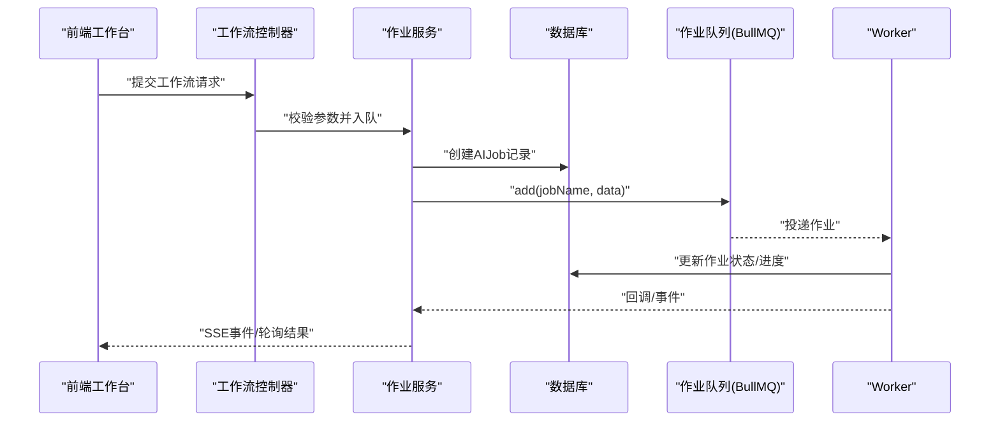
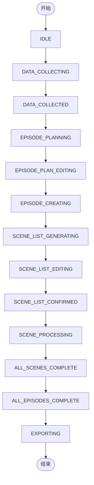
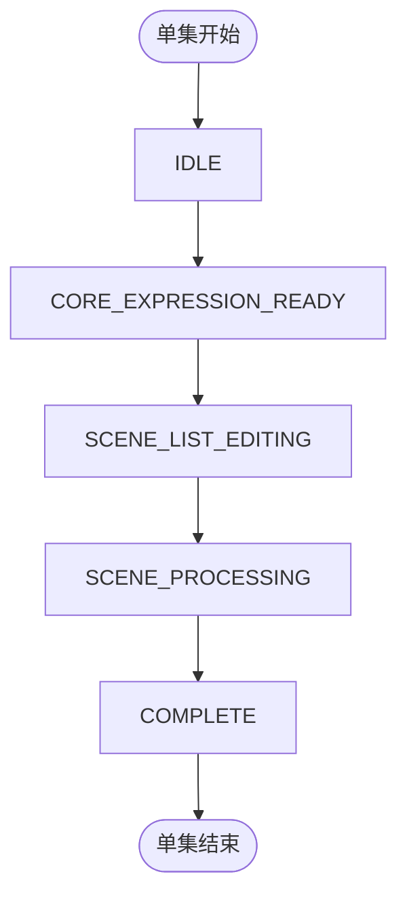
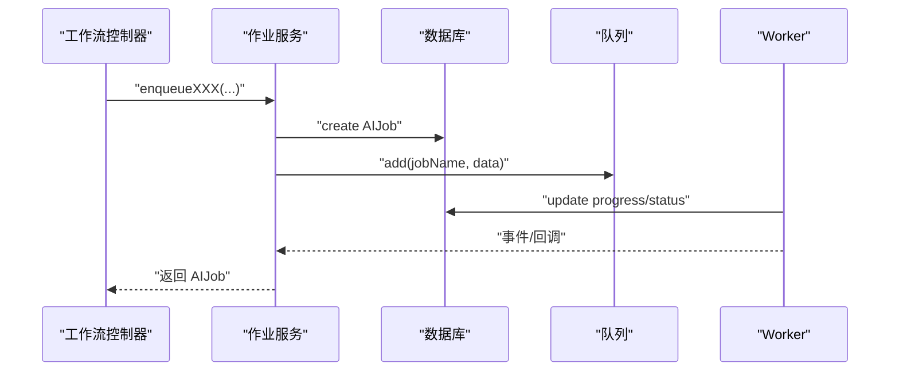
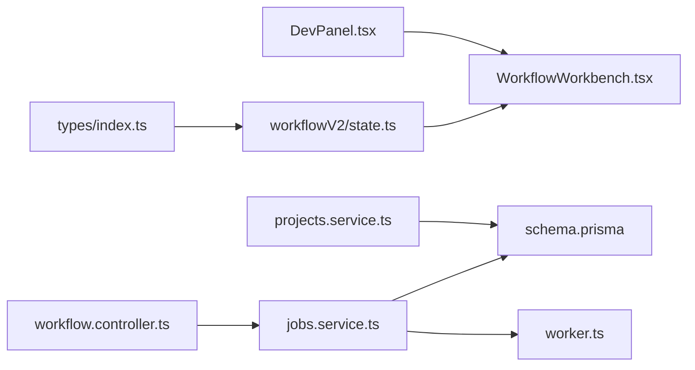

# 状态机设计

<cite>
**本文引用的文件**
- [apps/web/src/lib/workflowV2/state.ts](file://apps/web/src/lib/workflowV2/state.ts)
- [apps/web/src/types/index.ts](file://apps/web/src/types/index.ts)
- [apps/api/src/jobs/jobs.service.ts](file://apps/api/src/jobs/jobs.service.ts)
- [apps/api/src/jobs/workflow.controller.ts](file://apps/api/src/jobs/workflow.controller.ts)
- [apps/api/src/projects/projects.service.ts](file://apps/api/src/projects/projects.service.ts)
- [apps/api/prisma/schema.prisma](file://apps/api/prisma/schema.prisma)
- [apps/worker/src/worker.ts](file://apps/worker/src/worker.ts)
- [apps/web/src/components/DevPanel.tsx](file://apps/web/src/components/DevPanel.tsx)
- [apps/web/src/components/editor/WorkflowWorkbench.tsx](file://apps/web/src/components/editor/WorkflowWorkbench.tsx)
- [apps/web/src/lib/workflowLabels.ts](file://apps/web/src/lib/workflowLabels.ts)
- [docs/prd/episode-planning-workflow.md](file://docs/prd/episode-planning-workflow.md)
</cite>

## 目录

1. [简介](#简介)
2. [项目结构](#项目结构)
3. [核心组件](#核心组件)
4. [架构总览](#架构总览)
5. [详细组件分析](#详细组件分析)
6. [依赖分析](#依赖分析)
7. [性能考虑](#性能考虑)
8. [故障排查指南](#故障排查指南)
9. [结论](#结论)
10. [附录](#附录)

## 简介

本文件为 AIXSSS 工作流编排的状态机设计文档，聚焦项目级、场景级与作业级状态的统一建模与流转。状态机以“项目工作流状态”为主线，结合“单集工作流状态”和“产物成熟度状态（ArtifactStatus）”形成三层状态体系，配合后端队列与前端工作台，实现从“全局设定→剧集规划→单集创作→细化→导出”的闭环。

## 项目结构

围绕状态机的关键代码分布在前端工作台、API 控制器与服务、数据库模型以及 Worker 任务执行层：

- 前端工作台与状态展示
  - 产物状态构建与补丁生成：apps/web/src/lib/workflowV2/state.ts
  - 类型与状态枚举：apps/web/src/types/index.ts
  - 工作台 UI 与状态标签：apps/web/src/components/editor/WorkflowWorkbench.tsx、apps/web/src/lib/workflowLabels.ts
  - 开发者面板与调试：apps/web/src/components/DevPanel.tsx

- 后端控制器与服务
  - 工作流 API 控制器：apps/api/src/jobs/workflow.controller.ts
  - 作业队列入队与状态回写：apps/api/src/jobs/jobs.service.ts
  - 项目状态更新与统计：apps/api/src/projects/projects.service.ts
  - 数据模型与枚举：apps/api/prisma/schema.prisma

- Worker 执行层
  - 作业执行与进度上报：apps/worker/src/worker.ts

```mermaid
graph TB
subgraph "前端"
UI["工作台组件<br/>WorkflowWorkbench"]
StateLib["状态构建库<br/>workflowV2/state.ts"]
Types["类型与状态枚举<br/>types/index.ts"]
DevPanel["开发者面板<br/>DevPanel"]
end
subgraph "后端"
Ctrl["工作流控制器<br/>workflow.controller.ts"]
Svc["作业服务<br/>jobs.service.ts"]
ProjSvc["项目服务<br/>projects.service.ts"]
DB["数据库模型<br/>schema.prisma"]
end
subgraph "Worker"
Worker["作业执行器<br/>worker.ts"]
end
UI --> StateLib
UI --> Types
UI --> Ctrl
Ctrl --> Svc
Svc --> DB
Svc --> Worker
Worker --> Svc
ProjSvc --> DB
DevPanel --> UI
```

**图表来源**

- [apps/web/src/components/editor/WorkflowWorkbench.tsx](file://apps/web/src/components/editor/WorkflowWorkbench.tsx#L101-L142)
- [apps/web/src/lib/workflowV2/state.ts](file://apps/web/src/lib/workflowV2/state.ts#L1-L139)
- [apps/web/src/types/index.ts](file://apps/web/src/types/index.ts#L240-L376)
- [apps/api/src/jobs/workflow.controller.ts](file://apps/api/src/jobs/workflow.controller.ts#L44-L266)
- [apps/api/src/jobs/jobs.service.ts](file://apps/api/src/jobs/jobs.service.ts#L37-L800)
- [apps/api/prisma/schema.prisma](file://apps/api/prisma/schema.prisma#L16-L51)
- [apps/worker/src/worker.ts](file://apps/worker/src/worker.ts#L62-L687)

**章节来源**

- [apps/web/src/lib/workflowV2/state.ts](file://apps/web/src/lib/workflowV2/state.ts#L1-L139)
- [apps/web/src/types/index.ts](file://apps/web/src/types/index.ts#L240-L376)
- [apps/api/src/jobs/workflow.controller.ts](file://apps/api/src/jobs/workflow.controller.ts#L44-L266)
- [apps/api/src/jobs/jobs.service.ts](file://apps/api/src/jobs/jobs.service.ts#L37-L800)
- [apps/api/prisma/schema.prisma](file://apps/api/prisma/schema.prisma#L16-L51)
- [apps/worker/src/worker.ts](file://apps/worker/src/worker.ts#L62-L687)

## 核心组件

- 项目工作流状态（ProjectWorkflowState）
  - 定义于数据库枚举与类型中，覆盖从“基础设定收集”到“导出”的完整生命周期。
  - 关键状态包括：IDLE、DATA_COLLECTING、DATA_COLLECTED、WORLD_VIEW_BUILDING、CHARACTER_MANAGING、EPISODE_PLANNING、EPISODE_PLAN_EDITING、EPISODE_CREATING、SCENE_LIST_GENERATING、SCENE_LIST_EDITING、SCENE_LIST_CONFIRMED、SCENE_PROCESSING、ALL_SCENES_COMPLETE、ALL_EPISODES_COMPLETE、EXPORTING。

- 单集工作流状态（EpisodeWorkflowState）
  - 新增于 PRD 与类型定义，覆盖“核心表达→分镜列表→细化→完成”的单集生命周期。
  - 关键状态包括：IDLE、CORE_EXPRESSION_READY、SCENE_LIST_EDITING、SCENE_PROCESSING、COMPLETE。

- 产物成熟度状态（ArtifactStatus）
  - draft/review/locked，用于替代或补充线性工作流状态，体现产物的成熟度与锁定机制。
  - 前端通过 buildProjectArtifactPatch/buildEpisodeArtifactPatch 生成 contextCache.patch，写入 updatedAt/lockedAt。

- 作业状态（AIJobStatus）
  - queued/running/succeeded/failed/cancelled，由后端队列与 Worker 维护，前端通过 SSE 轮询获取。

**章节来源**

- [apps/api/prisma/schema.prisma](file://apps/api/prisma/schema.prisma#L16-L51)
- [apps/web/src/types/index.ts](file://apps/web/src/types/index.ts#L240-L376)
- [apps/web/src/lib/workflowV2/state.ts](file://apps/web/src/lib/workflowV2/state.ts#L13-L138)
- [docs/prd/episode-planning-workflow.md](file://docs/prd/episode-planning-workflow.md#L332-L353)

## 架构总览

状态机整体架构由“前端工作台 + 后端控制器/服务 + 数据库 + Worker 队列”构成。前端负责状态展示与用户交互，后端负责工作流 API 与作业入队，数据库持久化状态与上下文，Worker 执行具体任务并回写进度与结果。



**图表来源**

- [apps/api/src/jobs/workflow.controller.ts](file://apps/api/src/jobs/workflow.controller.ts#L44-L266)
- [apps/api/src/jobs/jobs.service.ts](file://apps/api/src/jobs/jobs.service.ts#L101-L149)
- [apps/worker/src/worker.ts](file://apps/worker/src/worker.ts#L62-L687)

## 详细组件分析

### 项目工作流状态机

- 状态定义与流转
  - 项目级状态覆盖从“基础设定收集”到“导出”的完整流程，包含“剧集规划中/编辑/创作中/细化中/完成/导出”等关键节点。
  - 入口事件：创建项目、提交工作流请求、用户确认/编辑、作业完成。
  - 触发条件：参数校验通过、全局设定满足规划门槛、作业状态变更。

- 状态持久化
  - 项目状态写入 Project.workflowState；同时 Project.contextCache 中可携带 narrativeCausalChain 及 workflowV2 产物状态，用于前端工作台体验。

- 前端展示
  - 通过 getWorkflowStateLabel 将状态映射为中文标签；工作台根据状态渲染步骤与进度。



**图表来源**

- [apps/api/prisma/schema.prisma](file://apps/api/prisma/schema.prisma#L16-L32)
- [apps/web/src/lib/workflowLabels.ts](file://apps/web/src/lib/workflowLabels.ts#L1-L21)

**章节来源**

- [apps/api/prisma/schema.prisma](file://apps/api/prisma/schema.prisma#L16-L32)
- [apps/web/src/lib/workflowLabels.ts](file://apps/web/src/lib/workflowLabels.ts#L1-L21)
- [docs/prd/episode-planning-workflow.md](file://docs/prd/episode-planning-workflow.md#L332-L353)

### 单集工作流状态机

- 状态定义与流转
  - 单集状态包括：IDLE、CORE_EXPRESSION_READY、SCENE_LIST_EDITING、SCENE_PROCESSING、COMPLETE。
  - 核心表达生成后进入“分镜列表编辑”，随后细化与完成。

- 产物成熟度联动
  - 前端通过 buildEpisodeArtifactPatch 更新 Episode.contextCache.workflowV2.artifacts（outline/storyboard/promptPack），并维护 updatedAt/lockedAt。



**图表来源**

- [apps/web/src/types/index.ts](file://apps/web/src/types/index.ts#L369-L376)
- [apps/web/src/lib/workflowV2/state.ts](file://apps/web/src/lib/workflowV2/state.ts#L108-L138)

**章节来源**

- [apps/web/src/types/index.ts](file://apps/web/src/types/index.ts#L369-L376)
- [apps/web/src/lib/workflowV2/state.ts](file://apps/web/src/lib/workflowV2/state.ts#L108-L138)

### 作业状态机与队列集成

- 入队与状态回写
  - 控制器接收工作流请求，调用 JobsService 入队；服务层创建 AIJob 记录并写入队列，同时尝试更新项目状态（如 EPISODE_PLANNING/EPISODE_CREATING/SCENE_PROCESSING）。
  - Worker 执行作业时，协作式取消：若作业被取消，将不再写入产物/覆盖状态，避免“前端已报错，后端仍在跑”的错觉。

- 进度与事件
  - 前端通过 SSE /ai-jobs/:jobId/events 获取进度与事件；Worker 在执行过程中定期更新进度并记录日志。



**图表来源**

- [apps/api/src/jobs/workflow.controller.ts](file://apps/api/src/jobs/workflow.controller.ts#L44-L266)
- [apps/api/src/jobs/jobs.service.ts](file://apps/api/src/jobs/jobs.service.ts#L101-L149)
- [apps/worker/src/worker.ts](file://apps/worker/src/worker.ts#L62-L687)

**章节来源**

- [apps/api/src/jobs/workflow.controller.ts](file://apps/api/src/jobs/workflow.controller.ts#L44-L266)
- [apps/api/src/jobs/jobs.service.ts](file://apps/api/src/jobs/jobs.service.ts#L37-L800)
- [apps/worker/src/worker.ts](file://apps/worker/src/worker.ts#L62-L687)

### 状态持久化与一致性

- 项目状态
  - ProjectsService.update 支持直接更新 workflowState、currentSceneOrder/currentSceneStep 与 contextCache；当检测到 narrativeCausalChain 更新时，自动写入版本快照（手动来源）。

- 产物状态
  - buildProjectArtifactPatch/buildEpisodeArtifactPatch 生成 contextCache.patch，写入 updatedAt/lockedAt，用于前端工作台与产物成熟度管理。

- 作业状态
  - AIJobStatus 由队列与 Worker 维护；SSE 事件与轮询确保前端可见性。

**章节来源**

- [apps/api/src/projects/projects.service.ts](file://apps/api/src/projects/projects.service.ts#L141-L198)
- [apps/web/src/lib/workflowV2/state.ts](file://apps/web/src/lib/workflowV2/state.ts#L76-L138)
- [apps/api/prisma/schema.prisma](file://apps/api/prisma/schema.prisma#L61-L67)

### 状态转换表（示例）

以下为部分关键状态转换的示例（基于控制器与服务的入队逻辑）：

- 项目级
  - EPISODE_PLANNING ← 提交 /workflow/projects/:projectId/episode-plan
  - EPISODE_CREATING ← 提交 /workflow/projects/:projectId/episodes/:episodeId/core-expression
  - SCENE_PROCESSING ← 提交 /workflow/projects/:projectId/scenes/:sceneId/\*（细化类任务）

- 单集级
  - CORE_EXPRESSION_READY ← 生成核心表达完成后（由 Worker 写入）
  - SCENE_PROCESSING ← 生成分镜锚点/关键帧提示词/运动提示词/对白等任务完成后

- 产物成熟度
  - draft → review → locked（由前端 patch 触发）

**章节来源**

- [apps/api/src/jobs/workflow.controller.ts](file://apps/api/src/jobs/workflow.controller.ts#L49-L266)
- [apps/api/src/jobs/jobs.service.ts](file://apps/api/src/jobs/jobs.service.ts#L101-L800)
- [apps/web/src/lib/workflowV2/state.ts](file://apps/web/src/lib/workflowV2/state.ts#L76-L138)

### 状态查询接口

- 项目状态
  - GET /projects/:projectId 获取项目详情，包含 workflowState、currentSceneOrder/currentSceneStep、contextCache 等。
  - GET /projects/:projectId/episodes 获取单集列表（按 order 排序）。

- 作业状态
  - GET /ai-jobs/:jobId 获取作业详情（含 progress）。
  - GET /ai-jobs/:jobId/events SSE 流式事件。

- 工作流 API
  - POST /workflow/projects/:projectId/episode-plan
  - POST /workflow/projects/:projectId/episodes/:episodeId/core-expression
  - POST /workflow/projects/:projectId/episodes/:episodeId/scene-list
  - POST /workflow/projects/:projectId/scenes/:sceneId/\*

**章节来源**

- [apps/api/src/jobs/workflow.controller.ts](file://apps/api/src/jobs/workflow.controller.ts#L44-L266)
- [apps/api/src/jobs/jobs.service.ts](file://apps/api/src/jobs/jobs.service.ts#L88-L99)

### 状态机配置示例

- 入队参数
  - /workflow/projects/:projectId/episode-plan：{ aiProfileId, targetEpisodeCount? }
  - /workflow/projects/:projectId/episodes/:episodeId/core-expression：{ aiProfileId }
  - /workflow/projects/:projectId/episodes/:episodeId/scene-list：{ aiProfileId, sceneCountHint? }

- Worker 任务数据约定
  - { teamId, projectId, episodeId?, aiProfileId, jobId, options? }

**章节来源**

- [docs/prd/episode-planning-workflow.md](file://docs/prd/episode-planning-workflow.md#L371-L383)
- [apps/api/src/jobs/workflow.controller.ts](file://apps/api/src/jobs/workflow.controller.ts#L9-L42)
- [apps/worker/src/worker.ts](file://apps/worker/src/worker.ts#L62-L687)

### 状态调试工具使用指南

- 开发者面板（DevPanel）
  - 进度：查看当前运行/排队中的任务与实时输出。
  - 历史：导出/清空日志，查看最近任务。
  - 错误：查看最近错误与异常。
  - 统计：成功率、平均响应时间、Token 消耗、按类型拆分。
  - 优化：基于调用数据给出优化建议。
  - 批量：监控批量任务状态与进度。

- 前端工作台
  - 步骤导航与状态颜色：根据 ArtifactStatus/draft/review/locked 展示不同样式。
  - 标签映射：getWorkflowStateLabel 将状态映射为中文标签。

**章节来源**

- [apps/web/src/components/DevPanel.tsx](file://apps/web/src/components/DevPanel.tsx#L1-L800)
- [apps/web/src/components/editor/WorkflowWorkbench.tsx](file://apps/web/src/components/editor/WorkflowWorkbench.tsx#L101-L142)
- [apps/web/src/lib/workflowLabels.ts](file://apps/web/src/lib/workflowLabels.ts#L1-L21)

## 依赖分析

- 前端
  - WorkflowWorkbench 依赖状态构建库与类型定义；DevPanel 依赖状态与日志工具。
- 后端
  - WorkflowController 依赖 JobsService；ProjectsService 依赖 PrismaService 与版本快照服务。
- 数据库
  - Project/Episode/Scene/AIJob 枚举与索引支撑状态查询与统计。
- Worker
  - 依据队列事件与作业数据执行任务，回写进度与结果。



**图表来源**

- [apps/web/src/types/index.ts](file://apps/web/src/types/index.ts#L240-L376)
- [apps/web/src/lib/workflowV2/state.ts](file://apps/web/src/lib/workflowV2/state.ts#L1-L139)
- [apps/web/src/components/editor/WorkflowWorkbench.tsx](file://apps/web/src/components/editor/WorkflowWorkbench.tsx#L101-L142)
- [apps/api/src/jobs/workflow.controller.ts](file://apps/api/src/jobs/workflow.controller.ts#L44-L266)
- [apps/api/src/jobs/jobs.service.ts](file://apps/api/src/jobs/jobs.service.ts#L37-L800)
- [apps/api/prisma/schema.prisma](file://apps/api/prisma/schema.prisma#L16-L51)
- [apps/worker/src/worker.ts](file://apps/worker/src/worker.ts#L62-L687)
- [apps/api/src/projects/projects.service.ts](file://apps/api/src/projects/projects.service.ts#L34-L215)
- [apps/web/src/components/DevPanel.tsx](file://apps/web/src/components/DevPanel.tsx#L1-L800)

**章节来源**

- [apps/web/src/types/index.ts](file://apps/web/src/types/index.ts#L240-L376)
- [apps/api/src/jobs/workflow.controller.ts](file://apps/api/src/jobs/workflow.controller.ts#L44-L266)
- [apps/api/src/jobs/jobs.service.ts](file://apps/api/src/jobs/jobs.service.ts#L37-L800)
- [apps/api/prisma/schema.prisma](file://apps/api/prisma/schema.prisma#L16-L51)
- [apps/worker/src/worker.ts](file://apps/worker/src/worker.ts#L62-L687)
- [apps/api/src/projects/projects.service.ts](file://apps/api/src/projects/projects.service.ts#L34-L215)
- [apps/web/src/components/DevPanel.tsx](file://apps/web/src/components/DevPanel.tsx#L1-L800)

## 性能考虑

- 队列与重试
  - 作业配置 attempts/backoff/removeOnComplete/removeOnFail，平衡吞吐与可靠性。
- 进度上报
  - Worker 定期 updateProgress，前端 SSE 轮询减少长连接压力。
- 统计与日志
  - DevPanel 提供统计与导出能力，便于定位性能瓶颈与成本优化点。

[本节为通用指导，无需特定文件引用]

## 故障排查指南

- 作业状态异常
  - 检查 /ai-jobs/:jobId 是否返回 cancelled/failed；确认 Worker 是否协作式取消。
- 项目状态不一致
  - 核对 ProjectsService.update 的 contextCache 变更与 narrativeCausalChain 版本写入逻辑。
- 前端状态未更新
  - 确认 SSE 事件订阅与轮询；检查 buildProjectArtifactPatch/buildEpisodeArtifactPatch 的 patch 写入。

**章节来源**

- [apps/api/src/jobs/jobs.service.ts](file://apps/api/src/jobs/jobs.service.ts#L674-L687)
- [apps/api/src/projects/projects.service.ts](file://apps/api/src/projects/projects.service.ts#L171-L196)
- [apps/web/src/lib/workflowV2/state.ts](file://apps/web/src/lib/workflowV2/state.ts#L76-L138)

## 结论

AIXSSS 的状态机设计通过“项目工作流状态 + 单集工作流状态 + 产物成熟度状态”的三层体系，结合后端队列与前端工作台，实现了从全局设定到导出的全链路编排。通过严格的入队参数、幂等写入与协作式取消，保障了状态一致性与并发安全；通过开发者面板与工作台标签映射，提升了可观测性与可用性。

[本节为总结性内容，无需特定文件引用]

## 附录

- 状态枚举与类型定义
  - 项目工作流状态：见 apps/api/prisma/schema.prisma 与 apps/web/src/types/index.ts
  - 单集工作流状态：见 apps/web/src/types/index.ts
  - 产物成熟度状态：见 apps/web/src/types/index.ts 与 workflowV2/state.ts
- API 示例
  - 工作流 API：见 apps/api/src/jobs/workflow.controller.ts
  - 作业查询：见 apps/api/src/jobs/jobs.service.ts
- Worker 约定
  - 作业数据结构与执行流程：见 apps/worker/src/worker.ts

**章节来源**

- [apps/api/prisma/schema.prisma](file://apps/api/prisma/schema.prisma#L16-L51)
- [apps/web/src/types/index.ts](file://apps/web/src/types/index.ts#L240-L376)
- [apps/api/src/jobs/workflow.controller.ts](file://apps/api/src/jobs/workflow.controller.ts#L44-L266)
- [apps/api/src/jobs/jobs.service.ts](file://apps/api/src/jobs/jobs.service.ts#L88-L99)
- [apps/worker/src/worker.ts](file://apps/worker/src/worker.ts#L62-L687)
