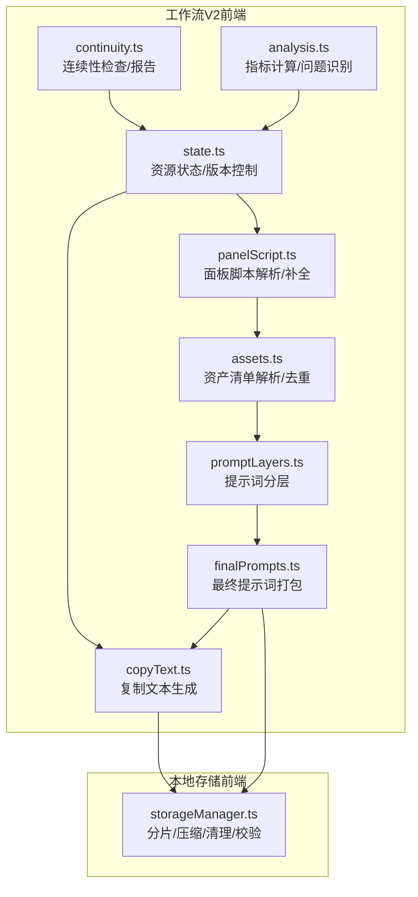
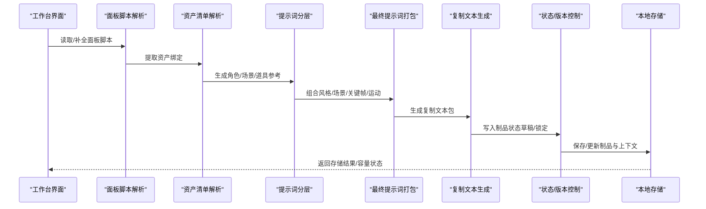
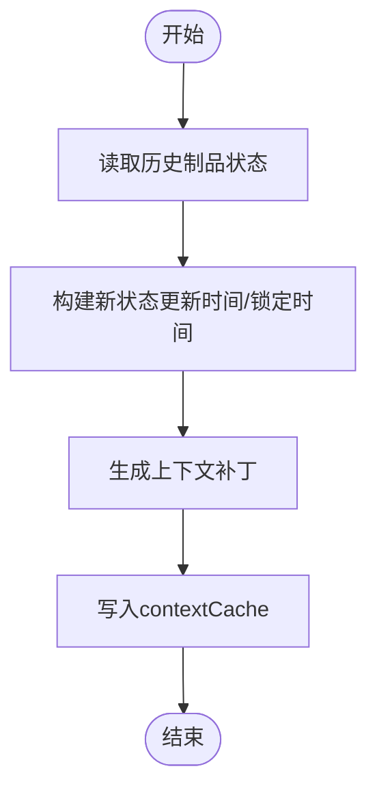
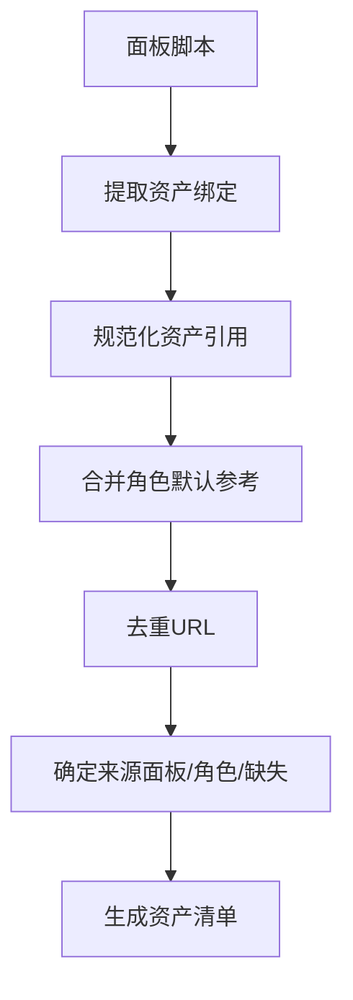
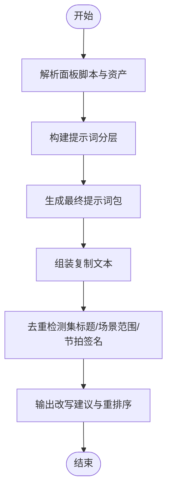
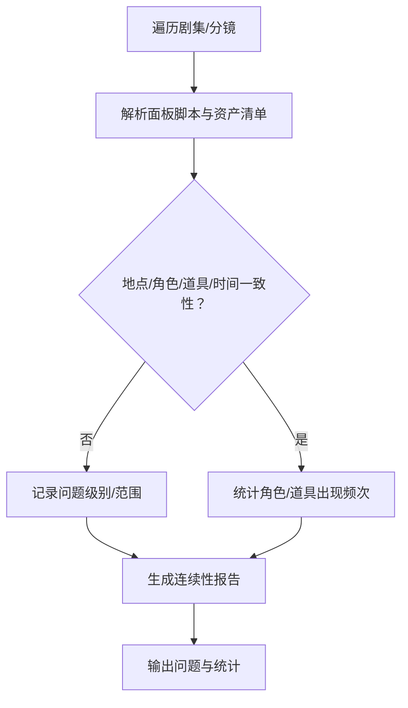
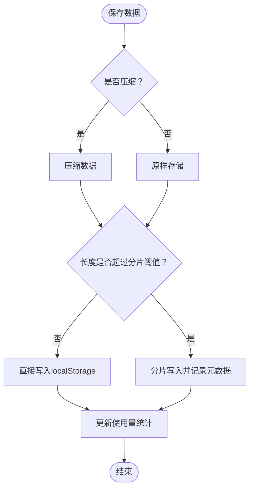
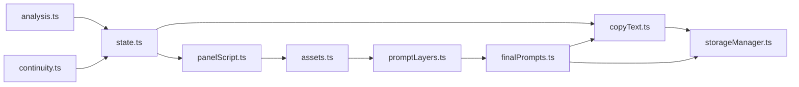

# 资源管理

<cite>
**本文引用的文件**
- [apps/web/src/lib/workflowV2/assets.ts](file://apps/web/src/lib/workflowV2/assets.ts)
- [apps/web/src/lib/workflowV2/copyText.ts](file://apps/web/src/lib/workflowV2/copyText.ts)
- [apps/web/src/lib/workflowV2/finalPrompts.ts](file://apps/web/src/lib/workflowV2/finalPrompts.ts)
- [apps/web/src/lib/workflowV2/promptLayers.ts](file://apps/web/src/lib/workflowV2/promptLayers.ts)
- [apps/web/src/lib/workflowV2/panelScript.ts](file://apps/web/src/lib/workflowV2/panelScript.ts)
- [apps/web/src/lib/workflowV2/state.ts](file://apps/web/src/lib/workflowV2/state.ts)
- [apps/web/src/lib/workflowV2/continuity.ts](file://apps/web/src/lib/workflowV2/continuity.ts)
- [apps/web/src/lib/workflowV2/analysis.ts](file://apps/web/src/lib/workflowV2/analysis.ts)
- [apps/web/src/lib/storageManager.ts](file://apps/web/src/lib/storageManager.ts)
- [apps/web/src/lib/performance.test.ts](file://apps/web/src/lib/performance.test.ts)
- [apps/web/src/lib/storage.test.ts](file://apps/web/src/lib/storage.test.ts)
- [apps/web/src/components/editor/WorkflowWorkbench.tsx](file://apps/web/src/components/editor/WorkflowWorkbench.tsx)
- [apps/web/src/types/index.ts](file://apps/web/src/types/index.ts)
</cite>

## 目录

1. [简介](#简介)
2. [项目结构](#项目结构)
3. [核心组件](#核心组件)
4. [架构总览](#架构总览)
5. [详细组件分析](#详细组件分析)
6. [依赖关系分析](#依赖关系分析)
7. [性能考量](#性能考量)
8. [故障排除指南](#故障排除指南)
9. [结论](#结论)
10. [附录](#附录)

## 简介

本文件面向AIXSSS工作流资源管理系统，系统性阐述资源生命周期管理、内容复制策略与文本处理机制，详解资产版本控制、资源依赖管理与缓存策略，深入解析文本复制算法、内容去重与一致性保证，并提供资源配置参数、性能优化与存储策略建议，以及最佳实践与故障排除指南。

## 项目结构

本系统围绕“工作流V2（workflowV2）”模块组织资源管理能力，前端Web应用通过一系列工具函数与状态管理模块，实现从面板脚本、资产清单、提示词分层到最终复制文本的全链路处理；同时配合本地存储管理器实现大体量数据的分片、压缩与清理，保障资源在浏览器端的稳定持久化。



图表来源

- [apps/web/src/lib/workflowV2/panelScript.ts](file://apps/web/src/lib/workflowV2/panelScript.ts#L255-L281)
- [apps/web/src/lib/workflowV2/assets.ts](file://apps/web/src/lib/workflowV2/assets.ts#L88-L137)
- [apps/web/src/lib/workflowV2/promptLayers.ts](file://apps/web/src/lib/workflowV2/promptLayers.ts#L21-L82)
- [apps/web/src/lib/workflowV2/finalPrompts.ts](file://apps/web/src/lib/workflowV2/finalPrompts.ts#L193-L231)
- [apps/web/src/lib/workflowV2/copyText.ts](file://apps/web/src/lib/workflowV2/copyText.ts#L23-L138)
- [apps/web/src/lib/workflowV2/state.ts](file://apps/web/src/lib/workflowV2/state.ts#L76-L139)
- [apps/web/src/lib/workflowV2/continuity.ts](file://apps/web/src/lib/workflowV2/continuity.ts#L80-L390)
- [apps/web/src/lib/workflowV2/analysis.ts](file://apps/web/src/lib/workflowV2/analysis.ts#L59-L91)
- [apps/web/src/lib/storageManager.ts](file://apps/web/src/lib/storageManager.ts#L90-L179)

章节来源

- [apps/web/src/lib/workflowV2/index.ts](file://apps/web/src/lib/workflowV2/index.ts#L1-L9)
- [apps/web/src/components/editor/WorkflowWorkbench.tsx](file://apps/web/src/components/editor/WorkflowWorkbench.tsx#L403-L425)

## 核心组件

- 面板脚本解析与补全：规范化面板脚本字段，合并资产与指标，形成稳定的上下文摘要。
- 资产清单解析与去重：从角色与场景中抽取图像引用，去重并确定来源（面板覆盖/角色默认/缺失）。
- 提示词分层：将风格、剧集与面板差异三段式组合，形成可复制的提示词层次。
- 最终提示词打包：整合场景锚点、关键帧与运动提示，生成图像/负向/I2V提示词集合。
- 复制文本生成：将上述结果汇总为可直接粘贴到外部工具的文本包。
- 资源状态与版本控制：标准化制品状态（草稿/审核/锁定），记录更新与锁定时间戳。
- 连续性检查：跨集/跨格一致性校验，输出问题与统计报表。
- 本地存储管理：分片、压缩、清理、完整性校验与迁移升级。

章节来源

- [apps/web/src/lib/workflowV2/panelScript.ts](file://apps/web/src/lib/workflowV2/panelScript.ts#L255-L281)
- [apps/web/src/lib/workflowV2/assets.ts](file://apps/web/src/lib/workflowV2/assets.ts#L88-L137)
- [apps/web/src/lib/workflowV2/promptLayers.ts](file://apps/web/src/lib/workflowV2/promptLayers.ts#L21-L82)
- [apps/web/src/lib/workflowV2/finalPrompts.ts](file://apps/web/src/lib/workflowV2/finalPrompts.ts#L193-L231)
- [apps/web/src/lib/workflowV2/copyText.ts](file://apps/web/src/lib/workflowV2/copyText.ts#L23-L138)
- [apps/web/src/lib/workflowV2/state.ts](file://apps/web/src/lib/workflowV2/state.ts#L76-L139)
- [apps/web/src/lib/workflowV2/continuity.ts](file://apps/web/src/lib/workflowV2/continuity.ts#L80-L390)
- [apps/web/src/lib/storageManager.ts](file://apps/web/src/lib/storageManager.ts#L90-L179)

## 架构总览

资源管理贯穿“输入（面板脚本/资产）→ 处理（分层/提示词/复制）→ 输出（制品文本/状态）→ 存储（本地分片/压缩/清理）”全流程。前端通过工具函数与状态模块驱动工作流，持续性检查与分析模块提供质量保障，存储模块确保数据安全与容量控制。



图表来源

- [apps/web/src/lib/workflowV2/panelScript.ts](file://apps/web/src/lib/workflowV2/panelScript.ts#L261-L281)
- [apps/web/src/lib/workflowV2/assets.ts](file://apps/web/src/lib/workflowV2/assets.ts#L88-L137)
- [apps/web/src/lib/workflowV2/promptLayers.ts](file://apps/web/src/lib/workflowV2/promptLayers.ts#L21-L82)
- [apps/web/src/lib/workflowV2/finalPrompts.ts](file://apps/web/src/lib/workflowV2/finalPrompts.ts#L193-L231)
- [apps/web/src/lib/workflowV2/copyText.ts](file://apps/web/src/lib/workflowV2/copyText.ts#L23-L138)
- [apps/web/src/lib/workflowV2/state.ts](file://apps/web/src/lib/workflowV2/state.ts#L76-L139)
- [apps/web/src/lib/storageManager.ts](file://apps/web/src/lib/storageManager.ts#L90-L179)

## 详细组件分析

### 资产版本控制与状态管理

- 标准化制品状态：支持草稿、审核、锁定三种状态，记录更新时间与首次锁定时间，确保版本演进可追溯。
- 项目与剧集两级制品：项目级（如“项目圣经”）、剧集级（如“大纲/分镜/提示词包”）分别维护状态。
- Patch构建：针对制品状态变更生成最小上下文补丁，写入contextCache，避免全量替换。



图表来源

- [apps/web/src/lib/workflowV2/state.ts](file://apps/web/src/lib/workflowV2/state.ts#L76-L139)

章节来源

- [apps/web/src/lib/workflowV2/state.ts](file://apps/web/src/lib/workflowV2/state.ts#L27-L74)
- [apps/web/src/lib/workflowV2/state.ts](file://apps/web/src/lib/workflowV2/state.ts#L76-L139)

### 资产解析与依赖管理

- 面板脚本中的资产绑定被规范化，支持场景参考图、角色参考图、道具、布局与遮罩等。
- 角色默认头像与附加参考图自动合并，去重URL，确定来源（面板覆盖/角色默认/缺失）。
- 依赖关系：资产清单依赖面板脚本中的角色呈现列表与资产绑定，最终服务于提示词分层与复制文本。



图表来源

- [apps/web/src/lib/workflowV2/panelScript.ts](file://apps/web/src/lib/workflowV2/panelScript.ts#L136-L162)
- [apps/web/src/lib/workflowV2/assets.ts](file://apps/web/src/lib/workflowV2/assets.ts#L88-L137)

章节来源

- [apps/web/src/lib/workflowV2/panelScript.ts](file://apps/web/src/lib/workflowV2/panelScript.ts#L255-L281)
- [apps/web/src/lib/workflowV2/assets.ts](file://apps/web/src/lib/workflowV2/assets.ts#L88-L137)

### 文本复制算法与内容去重

- 复制文本生成：将项目/剧集/分镜信息、资产清单、参数建议、提示词分层与最终提示词打包为可粘贴文本。
- 内容去重：在剧集规划阶段，采用标准化与双字符集（bigram）Jaccard相似度检测重复集，输出改写建议与重排序列表，降低重复度并减少连锁影响。



图表来源

- [apps/web/src/lib/workflowV2/copyText.ts](file://apps/web/src/lib/workflowV2/copyText.ts#L23-L138)
- [apps/worker/src/tasks/planEpisodes.ts](file://apps/worker/src/tasks/planEpisodes.ts#L122-L151)

章节来源

- [apps/web/src/lib/workflowV2/copyText.ts](file://apps/web/src/lib/workflowV2/copyText.ts#L23-L138)
- [apps/worker/src/tasks/planEpisodes.ts](file://apps/worker/src/tasks/planEpisodes.ts#L113-L151)

### 提示词分层与最终提示词打包

- 分层策略：基础层（风格Full Prompt）、剧集层（项目/剧集信息）、面板差异层（地点/时间/镜头/站位/道具/角色资产差量）。
- 最终打包：按关键帧拆分图像提示词，生成负向与I2V提示词，支持中英双语输出。

```mermaid
classDiagram
class PromptLayers {
+version : number
+base : {zh,en}
+episode : {zh,en}
+panelDelta : {zh,en}
}
class FinalPromptPack {
+imagePrompt : {keys,zh[],en[]}
+negativePrompt : {zh,en}
+i2vPrompt : {zh,en}
}
PromptLayers --> FinalPromptPack : "输入分层"
```

图表来源

- [apps/web/src/lib/workflowV2/promptLayers.ts](file://apps/web/src/lib/workflowV2/promptLayers.ts#L14-L82)
- [apps/web/src/lib/workflowV2/finalPrompts.ts](file://apps/web/src/lib/workflowV2/finalPrompts.ts#L177-L231)

章节来源

- [apps/web/src/lib/workflowV2/promptLayers.ts](file://apps/web/src/lib/workflowV2/promptLayers.ts#L21-L82)
- [apps/web/src/lib/workflowV2/finalPrompts.ts](file://apps/web/src/lib/workflowV2/finalPrompts.ts#L193-L231)

### 连续性检查与一致性保证

- 地点/角色/道具/时间一致性：检查地点引用有效性、出场角色与对白角色一致性、角色参考图缺失、道具出现次数统计、时间/天气跳变等。
- 报告与统计：按剧集/角色/道具聚合统计，输出问题计数与明细，辅助质量把关。



图表来源

- [apps/web/src/lib/workflowV2/continuity.ts](file://apps/web/src/lib/workflowV2/continuity.ts#L80-L390)
- [apps/web/src/lib/workflowV2/analysis.ts](file://apps/web/src/lib/workflowV2/analysis.ts#L59-L91)

章节来源

- [apps/web/src/lib/workflowV2/continuity.ts](file://apps/web/src/lib/workflowV2/continuity.ts#L80-L390)
- [apps/web/src/lib/workflowV2/analysis.ts](file://apps/web/src/lib/workflowV2/analysis.ts#L93-L167)

### 本地存储策略与缓存

- 分片与压缩：单条数据超过阈值则分片存储，支持可选压缩，写入元数据（压缩标志、分片数、版本、时间戳）。
- 清理与迁移：初始化时检查版本并迁移，当使用率超过阈值自动清理过期数据；提供完整性校验与损坏修复。
- 使用监控：实时统计使用量、配额与可用空间，预留冗余以应对突发增长。



图表来源

- [apps/web/src/lib/storageManager.ts](file://apps/web/src/lib/storageManager.ts#L90-L179)
- [apps/web/src/lib/storageManager.ts](file://apps/web/src/lib/storageManager.ts#L24-L46)

章节来源

- [apps/web/src/lib/storageManager.ts](file://apps/web/src/lib/storageManager.ts#L90-L179)
- [apps/web/src/lib/storageManager.ts](file://apps/web/src/lib/storageManager.ts#L24-L46)
- [apps/web/src/lib/storageManager.ts](file://apps/web/src/lib/storageManager.ts#L337-L357)

## 依赖关系分析

- 工具函数内聚：assets、promptLayers、finalPrompts、copyText均依赖panelScript提供的标准化上下文。
- 状态与分析耦合：state与analysis共同为工作台提供任务状态与问题识别，支撑UI渲染与流程推进。
- 存储解耦：storageManager独立于业务逻辑，通过统一接口提供持久化能力，避免业务侧分支污染。



图表来源

- [apps/web/src/lib/workflowV2/panelScript.ts](file://apps/web/src/lib/workflowV2/panelScript.ts#L255-L281)
- [apps/web/src/lib/workflowV2/assets.ts](file://apps/web/src/lib/workflowV2/assets.ts#L88-L137)
- [apps/web/src/lib/workflowV2/promptLayers.ts](file://apps/web/src/lib/workflowV2/promptLayers.ts#L21-L82)
- [apps/web/src/lib/workflowV2/finalPrompts.ts](file://apps/web/src/lib/workflowV2/finalPrompts.ts#L193-L231)
- [apps/web/src/lib/workflowV2/copyText.ts](file://apps/web/src/lib/workflowV2/copyText.ts#L23-L138)
- [apps/web/src/lib/workflowV2/state.ts](file://apps/web/src/lib/workflowV2/state.ts#L76-L139)
- [apps/web/src/lib/workflowV2/analysis.ts](file://apps/web/src/lib/workflowV2/analysis.ts#L59-L91)
- [apps/web/src/lib/workflowV2/continuity.ts](file://apps/web/src/lib/workflowV2/continuity.ts#L80-L390)
- [apps/web/src/lib/storageManager.ts](file://apps/web/src/lib/storageManager.ts#L90-L179)

## 性能考量

- 浏览器端性能：通过分片与压缩降低localStorage压力，避免一次性写入超大对象导致阻塞；使用throttle等节流策略控制高频事件。
- 计算复杂度：资产去重采用Set与标准化字符串，时间复杂度近似O(n)；相似度计算对短文本友好，适合批处理。
- 缓存与复用：提示词分层与最终打包结果可缓存至内存，避免重复计算；状态变更采用最小补丁写入，减少渲染抖动。

章节来源

- [apps/web/src/lib/performance.test.ts](file://apps/web/src/lib/performance.test.ts#L68-L187)
- [apps/web/src/lib/storageManager.ts](file://apps/web/src/lib/storageManager.ts#L90-L179)

## 故障排除指南

- 存储异常
  - 现象：保存失败或读取为空
  - 排查：检查存储使用率与可用空间；确认分片完整性；必要时执行损坏修复
  - 参考
    - [apps/web/src/lib/storageManager.ts](file://apps/web/src/lib/storageManager.ts#L24-L46)
    - [apps/web/src/lib/storageManager.ts](file://apps/web/src/lib/storageManager.ts#L291-L332)
- 数据迁移
  - 现象：版本升级后数据不可用
  - 排查：确认版本号与迁移逻辑；必要时手动触发迁移
  - 参考
    - [apps/web/src/lib/storageManager.ts](file://apps/web/src/lib/storageManager.ts#L337-L357)
    - [apps/web/src/lib/storageManager.ts](file://apps/web/src/lib/storageManager.ts#L362-L368)
- 复制文本缺失
  - 现象：导出文本不完整
  - 排查：确认面板脚本与资产绑定是否齐全；检查提示词分层与最终打包是否生成
  - 参考
    - [apps/web/src/lib/workflowV2/copyText.ts](file://apps/web/src/lib/workflowV2/copyText.ts#L23-L138)
    - [apps/web/src/lib/workflowV2/finalPrompts.ts](file://apps/web/src/lib/workflowV2/finalPrompts.ts#L193-L231)
- 连续性问题
  - 现象：跨集一致性告警较多
  - 排查：核对地点引用、出场角色与对白角色一致性、角色参考图是否缺失
  - 参考
    - [apps/web/src/lib/workflowV2/continuity.ts](file://apps/web/src/lib/workflowV2/continuity.ts#L140-L159)
    - [apps/web/src/lib/workflowV2/continuity.ts](file://apps/web/src/lib/workflowV2/continuity.ts#L247-L278)

章节来源

- [apps/web/src/lib/storage.test.ts](file://apps/web/src/lib/storage.test.ts#L394-L439)
- [apps/web/src/lib/storageManager.ts](file://apps/web/src/lib/storageManager.ts#L291-L332)

## 结论

AIXSSS资源管理系统通过“面板脚本→资产解析→提示词分层→最终打包→状态控制→本地存储”的闭环，实现了工作流制品的全生命周期管理。系统在前端侧完成高质量文本处理与一致性校验，在存储侧提供稳健的分片压缩与清理策略，兼顾性能与可靠性。建议在实际使用中结合画风配置、角色与世界观条目，持续完善制品状态与复制文本，以获得最佳产出质量与效率。

## 附录

### 配置参数与建议

- 画风配置
  - 预设ID、基础风格、技法、色彩、文化特征与完整提示词，用于统一风格锚点
  - 参考
    - [apps/web/src/types/index.ts](file://apps/web/src/types/index.ts#L5-L200)
- 存储配额
  - 单条数据分片阈值与压缩开关，建议根据业务体量调整
  - 参考
    - [apps/web/src/lib/storageManager.ts](file://apps/web/src/lib/storageManager.ts#L14-L16)
    - [apps/web/src/lib/storageManager.ts](file://apps/web/src/lib/storageManager.ts#L90-L134)

### 最佳实践

- 在项目初期锁定“项目圣经”（画风Full Prompt + 角色卡 + 世界观/地点空间卡），作为多集一致性的根。
- 优先生成并锁定“本集核心表达”，再批量产出分镜与提示词。
- 严格维护面板脚本与资产绑定，确保场景参考图与角色参考图齐全，减少后续复制与修正成本。
- 定期运行连续性检查，及时发现并修复跨集一致性问题。
- 合理使用分层提示词，将风格、场景与面板差异清晰分离，提升复制文本的可读性与可操作性。
