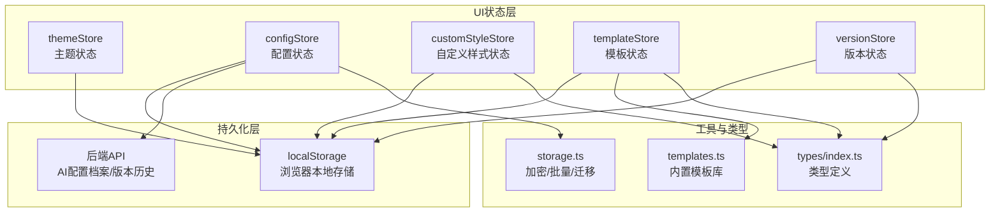
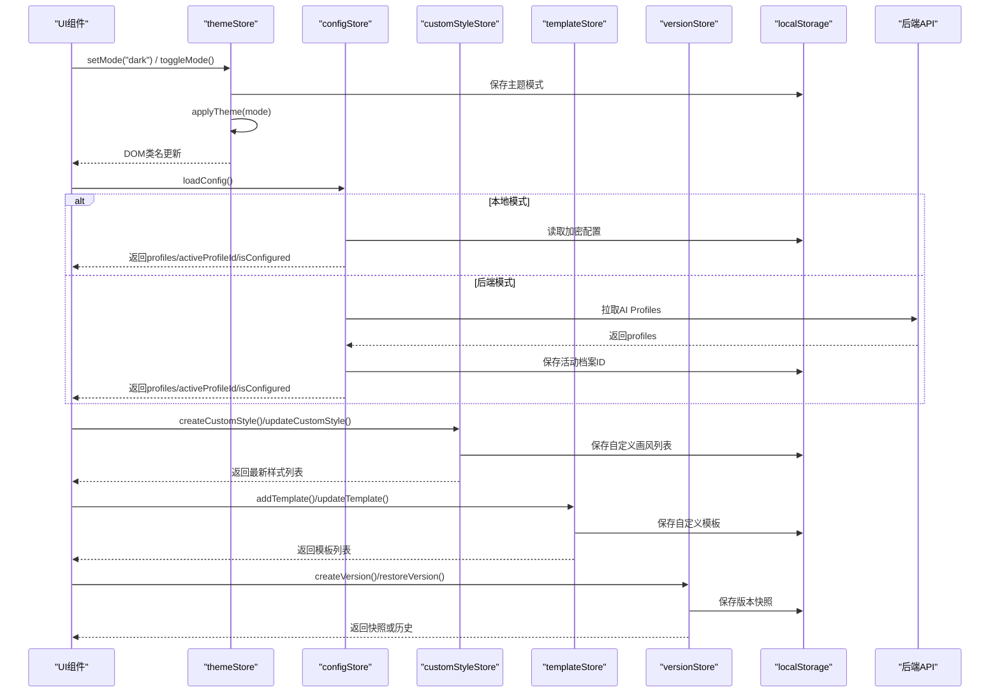
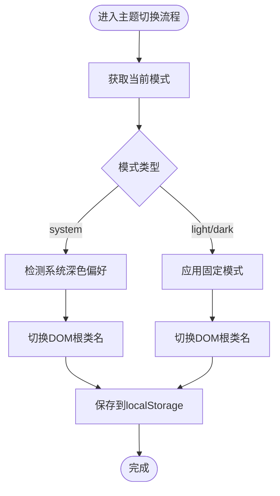
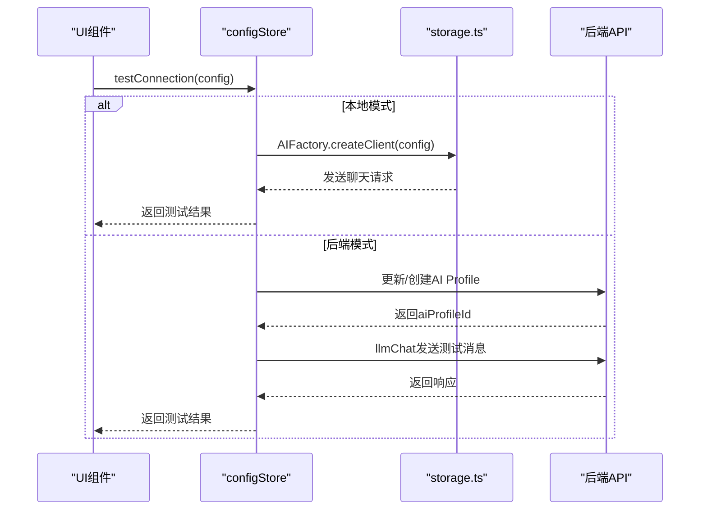
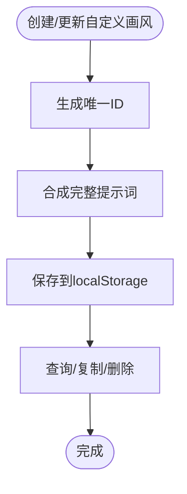
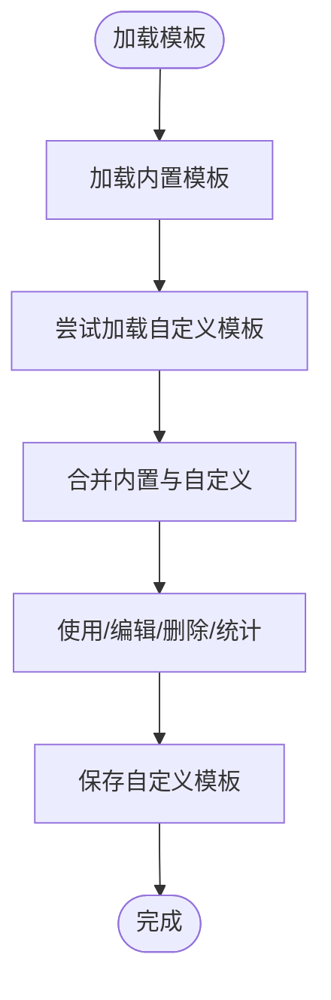
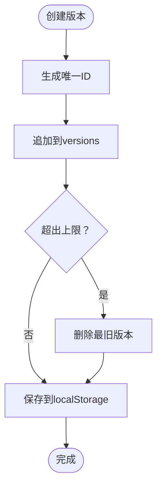
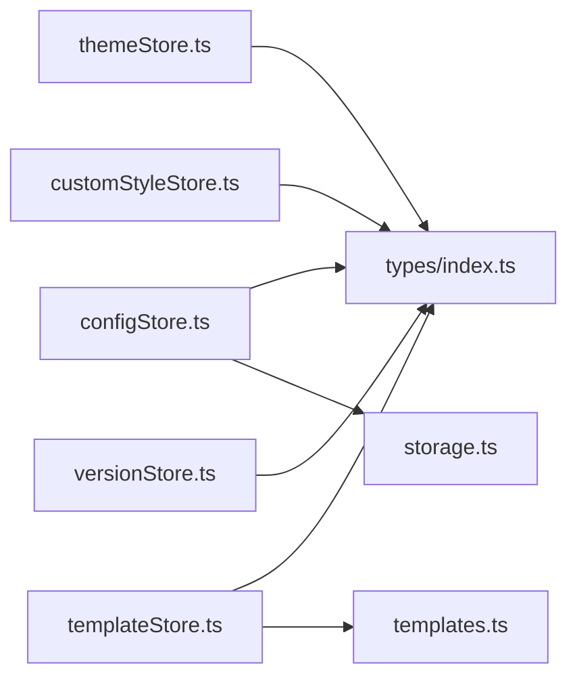

# UI相关Store模块

<cite>
**本文档引用的文件**
- [themeStore.ts](file://apps/web/src/stores/themeStore.ts)
- [configStore.ts](file://apps/web/src/stores/configStore.ts)
- [customStyleStore.ts](file://apps/web/src/stores/customStyleStore.ts)
- [templateStore.ts](file://apps/web/src/stores/templateStore.ts)
- [versionStore.ts](file://apps/web/src/stores/versionStore.ts)
- [storage.ts](file://apps/web/src/lib/storage.ts)
- [templates.ts](file://apps/web/src/lib/templates.ts)
- [index.ts](file://apps/web/src/types/index.ts)
</cite>

## 目录

1. [简介](#简介)
2. [项目结构](#项目结构)
3. [核心组件](#核心组件)
4. [架构总览](#架构总览)
5. [详细组件分析](#详细组件分析)
6. [依赖关系分析](#依赖关系分析)
7. [性能考虑](#性能考虑)
8. [故障排查指南](#故障排查指南)
9. [结论](#结论)
10. [附录](#附录)

## 简介

本文件面向AIXSSS项目的UI相关状态管理模块，系统性梳理并解读以下五个Store模块的设计理念与实现方式：

- 主题状态管理（themeStore）：负责主题模式的切换、持久化与系统主题联动
- 配置状态管理（configStore）：负责用户AI配置的多档案管理、连接测试、前后端模式适配与安全存储
- 自定义样式状态管理（customStyleStore）：负责画风配置的创建、更新、删除与查询，并提供内置+自定义画风的统一访问接口
- 模板状态管理（templateStore）：负责提示词模板的内置模板加载、自定义模板管理与使用统计
- 版本状态管理（versionStore）：负责项目/场景版本快照的创建、恢复、清理与历史查询

同时，文档将阐述UI状态的持久化策略、主题切换机制、配置同步与模板管理功能，解释状态更新的触发条件、响应式更新与性能优化技巧，并给出UI状态流转示例、配置项说明与实际应用场景。

## 项目结构

UI相关状态管理模块位于应用前端的stores目录，采用独立的Zustand Store设计，每个Store聚焦单一职责，通过LocalStorage进行持久化，并在必要时与后端API进行同步。

图表来源

- [themeStore.ts](file://apps/web/src/stores/themeStore.ts#L1-L57)
- [configStore.ts](file://apps/web/src/stores/configStore.ts#L1-L822)
- [customStyleStore.ts](file://apps/web/src/stores/customStyleStore.ts#L1-L240)
- [templateStore.ts](file://apps/web/src/stores/templateStore.ts#L1-L143)
- [versionStore.ts](file://apps/web/src/stores/versionStore.ts#L1-L139)
- [storage.ts](file://apps/web/src/lib/storage.ts#L1-L1015)
- [templates.ts](file://apps/web/src/lib/templates.ts#L1-L313)
- [index.ts](file://apps/web/src/types/index.ts#L1-L1019)

章节来源

- [themeStore.ts](file://apps/web/src/stores/themeStore.ts#L1-L57)
- [configStore.ts](file://apps/web/src/stores/configStore.ts#L1-L822)
- [customStyleStore.ts](file://apps/web/src/stores/customStyleStore.ts#L1-L240)
- [templateStore.ts](file://apps/web/src/stores/templateStore.ts#L1-L143)
- [versionStore.ts](file://apps/web/src/stores/versionStore.ts#L1-L139)
- [storage.ts](file://apps/web/src/lib/storage.ts#L1-L1015)
- [templates.ts](file://apps/web/src/lib/templates.ts#L1-L313)
- [index.ts](file://apps/web/src/types/index.ts#L1-L1019)

## 核心组件

- 主题状态管理（themeStore）
  - 职责：维护主题模式（浅色/深色/系统），持久化到localStorage，监听系统主题变化并自动同步
  - 关键能力：setMode/toggleMode/initTheme，applyTheme与系统媒体查询联动
- 配置状态管理（configStore）
  - 职责：管理用户AI配置（provider、model、apiKey、baseURL等），支持多档案（profiles）与活动档案（activeProfileId）
  - 关键能力：loadConfig/saveConfig/clearConfig/testConnection，多档案创建/更新/删除/切换
  - 安全与兼容：本地模式下加密存储，后端模式下仅保存服务端档案ID，连接测试结果持久化
- 自定义样式状态管理（customStyleStore）
  - 职责：管理用户自定义画风（CustomArtStyle），提供创建/更新/删除/复制与查询接口
  - 关键能力：create/update/delete/duplicate/getArtStyleConfigById，getAllAvailableStyles聚合内置与自定义
- 模板状态管理（templateStore）
  - 职责：管理提示词模板（PromptTemplate），内置模板与自定义模板的统一管理
  - 关键能力：loadBuiltInTemplates/loadTemplates/add/update/delete/incrementUsage，按分类/搜索/热门排序查询
- 版本状态管理（versionStore）
  - 职责：管理项目/场景版本快照，支持创建、恢复、删除、清理与历史查询
  - 关键能力：createVersion/restoreVersion/deleteVersion/clearOldVersions，按项目/目标对象查询历史

章节来源

- [themeStore.ts](file://apps/web/src/stores/themeStore.ts#L1-L57)
- [configStore.ts](file://apps/web/src/stores/configStore.ts#L1-L822)
- [customStyleStore.ts](file://apps/web/src/stores/customStyleStore.ts#L1-L240)
- [templateStore.ts](file://apps/web/src/stores/templateStore.ts#L1-L143)
- [versionStore.ts](file://apps/web/src/stores/versionStore.ts#L1-L139)

## 架构总览

UI状态管理采用Zustand函数式Store，围绕LocalStorage与后端API构建持久化与同步机制。主题状态直接作用于DOM根节点类名，配置状态在本地模式与后端模式间切换，自定义样式与模板提供统一的查询与组合接口，版本状态提供项目/场景级别的快照管理。

图表来源

- [themeStore.ts](file://apps/web/src/stores/themeStore.ts#L13-L34)
- [configStore.ts](file://apps/web/src/stores/configStore.ts#L183-L287)
- [customStyleStore.ts](file://apps/web/src/stores/customStyleStore.ts#L82-L193)
- [templateStore.ts](file://apps/web/src/stores/templateStore.ts#L36-L133)
- [versionStore.ts](file://apps/web/src/stores/versionStore.ts#L28-L130)

## 详细组件分析

### 主题状态管理（themeStore）

设计理念

- 将主题模式抽象为轻量状态，通过DOM类名切换实现全局样式切换
- 支持系统主题跟随，自动监听媒体查询变化
- 通过localStorage实现跨会话持久化

实现要点

- 状态结构：mode（ThemeMode）
- 持久化：setMode后写入localStorage并调用applyTheme
- 系统主题联动：监听prefers-color-scheme变化，当mode为system时自动同步

图表来源

- [themeStore.ts](file://apps/web/src/stores/themeStore.ts#L37-L56)

章节来源

- [themeStore.ts](file://apps/web/src/stores/themeStore.ts#L1-L57)

### 配置状态管理（configStore）

设计理念

- 将用户AI配置抽象为多档案（profiles）与活动档案（activeProfileId），支持本地与后端两种运行模式
- 在本地模式下，配置通过加密存储于localStorage；在后端模式下，仅保存服务端档案ID，避免浏览器保存敏感信息
- 提供连接测试能力，将测试结果持久化到profiles中，辅助用户诊断问题

实现要点

- 状态结构：config、isConfigured、profiles、activeProfileId
- 多模式适配：isApiMode()判断，分别走apiListAIProfiles/apiUpdateAIProfile等API或本地存储
- 安全存储：通过storage.ts的加密/解密与版本迁移机制保障数据安全
- 连接测试：buildConnectionTestResult根据错误类型与HTTP状态生成建议，提升用户体验

图表来源

- [configStore.ts](file://apps/web/src/stores/configStore.ts#L343-L488)
- [storage.ts](file://apps/web/src/lib/storage.ts#L696-L773)

章节来源

- [configStore.ts](file://apps/web/src/stores/configStore.ts#L1-L822)
- [storage.ts](file://apps/web/src/lib/storage.ts#L1-L1015)
- [index.ts](file://apps/web/src/types/index.ts#L644-L710)

### 自定义样式状态管理（customStyleStore）

设计理念

- 将用户自定义画风抽象为CustomArtStyle，提供完整的CRUD与查询能力
- 通过composeStyleFullPrompt合成完整英文提示词，确保与绘图AI的兼容性
- 提供getAllAvailableStyles与getStyleConfigById，统一内置预设与自定义画风的访问

实现要点

- 状态结构：customStyles、isLoaded
- 持久化：localStorage保存自定义画风列表，JSON序列化/反序列化
- 工具函数：getAllAvailableStyles聚合内置与自定义；getStyleConfigById区分自定义与内置

图表来源

- [customStyleStore.ts](file://apps/web/src/stores/customStyleStore.ts#L82-L193)
- [index.ts](file://apps/web/src/types/index.ts#L9-L55)

章节来源

- [customStyleStore.ts](file://apps/web/src/stores/customStyleStore.ts#L1-L240)
- [index.ts](file://apps/web/src/types/index.ts#L1-L238)

### 模板状态管理（templateStore）

设计理念

- 将提示词模板分为内置模板与自定义模板两类，统一管理与查询
- 通过localStorage保存自定义模板，避免与内置模板混淆
- 提供分类、搜索、热门排序等查询能力，提升模板使用效率

实现要点

- 状态结构：templates、currentTemplateId
- 持久化：saveCustomTemplates仅保存非内置模板
- 查询：getTemplatesByCategory/searchTemplates/getPopularTemplates

图表来源

- [templateStore.ts](file://apps/web/src/stores/templateStore.ts#L24-L133)
- [templates.ts](file://apps/web/src/lib/templates.ts#L1-L313)

章节来源

- [templateStore.ts](file://apps/web/src/stores/templateStore.ts#L1-L143)
- [templates.ts](file://apps/web/src/lib/templates.ts#L1-L313)
- [index.ts](file://apps/web/src/types/index.ts#L907-L920)

### 版本状态管理（versionStore）

设计理念

- 为项目与场景提供版本快照管理，支持创建、恢复、删除与清理
- 通过localStorage按项目隔离存储，限制最大版本数，防止无限增长
- 提供按目标对象的历史查询，便于回溯与审计

实现要点

- 状态结构：versions、maxVersions
- 持久化：按项目ID保存版本列表
- 限制：超过maxVersions时删除最旧版本
- 查询：getVersionHistory/getProjectVersions/getSceneVersions

图表来源

- [versionStore.ts](file://apps/web/src/stores/versionStore.ts#L42-L130)

章节来源

- [versionStore.ts](file://apps/web/src/stores/versionStore.ts#L1-L139)
- [index.ts](file://apps/web/src/types/index.ts#L893-L905)

## 依赖关系分析

- 主题状态管理（themeStore）
  - 依赖：ThemeMode类型定义、DOM根节点类名切换
- 配置状态管理（configStore）
  - 依赖：UserConfig/UserConfigState/ConfigProfile/ConnectionTestResult类型
  - 依赖：storage.ts（加密/解密、版本迁移、批量/防抖）
  - 依赖：后端API（AI Profiles、LLM聊天）
- 自定义样式状态管理（customStyleStore）
  - 依赖：CustomArtStyle/ArtStyleConfig/ArtStylePreset类型
  - 依赖：composeStyleFullPrompt、ART_STYLE_PRESETS
- 模板状态管理（templateStore）
  - 依赖：PromptTemplate类型
  - 依赖：BUILT_IN_TEMPLATES（templates.ts）
- 版本状态管理（versionStore）
  - 依赖：Version类型

图表来源

- [themeStore.ts](file://apps/web/src/stores/themeStore.ts#L1-L11)
- [configStore.ts](file://apps/web/src/stores/configStore.ts#L1-L18)
- [customStyleStore.ts](file://apps/web/src/stores/customStyleStore.ts#L1-L10)
- [templateStore.ts](file://apps/web/src/stores/templateStore.ts#L1-L3)
- [versionStore.ts](file://apps/web/src/stores/versionStore.ts#L1-L3)
- [storage.ts](file://apps/web/src/lib/storage.ts#L1-L10)
- [templates.ts](file://apps/web/src/lib/templates.ts#L1-L6)
- [index.ts](file://apps/web/src/types/index.ts#L1-L1019)

章节来源

- [index.ts](file://apps/web/src/types/index.ts#L1-L1019)
- [storage.ts](file://apps/web/src/lib/storage.ts#L1-L1015)
- [templates.ts](file://apps/web/src/lib/templates.ts#L1-L313)

## 性能考虑

- 防抖与批量写入
  - storage.ts中对项目保存、场景保存与场景补丁批量写入进行了防抖与队列优化，减少localStorage写入频率，降低主线程阻塞风险
- 版本数量限制
  - versionStore限制每项目最多保留maxVersions个版本，避免localStorage膨胀
- 本地模式下的加密与迁移
  - storage.ts提供版本迁移与备份/恢复机制，确保数据结构演进时的安全与可恢复性
- UI响应式更新
  - 所有Store均采用Zustand原子化状态更新，最小化re-render范围，结合use callbacks减少不必要的订阅

[本节为通用性能建议，不直接分析具体代码文件]

## 故障排查指南

- 主题切换无效
  - 检查applyTheme是否被调用，确认DOM根节点类名是否包含dark
  - 确认系统主题监听事件是否注册
- 配置连接测试失败
  - 查看buildConnectionTestResult生成的建议列表，核对provider/model/baseURL/apiKey
  - 后端模式下检查aiProfileId是否正确，本地模式下确认apiKey未被浏览器保存策略拦截
- 自定义画风无法显示
  - 检查localStorage中的自定义样式列表是否保存成功
  - 确认composeStyleFullPrompt是否生成完整提示词
- 模板不可用或丢失
  - 检查localStorage中的自定义模板是否被正确保存
  - 确认内置模板加载逻辑是否正常
- 版本恢复失败
  - 检查版本是否存在，确认snapshot数据结构是否匹配当前版本

章节来源

- [themeStore.ts](file://apps/web/src/stores/themeStore.ts#L37-L56)
- [configStore.ts](file://apps/web/src/stores/configStore.ts#L72-L181)
- [customStyleStore.ts](file://apps/web/src/stores/customStyleStore.ts#L18-L39)
- [templateStore.ts](file://apps/web/src/stores/templateStore.ts#L135-L142)
- [versionStore.ts](file://apps/web/src/stores/versionStore.ts#L75-L81)

## 结论

AIXSSS项目的UI相关Store模块以Zustand为核心，围绕LocalStorage与后端API构建了高内聚、低耦合的状态管理体系。主题状态管理提供了简洁的主题切换与系统跟随能力；配置状态管理兼顾安全与易用，支持多档案与前后端模式；自定义样式与模板管理提升了创作灵活性；版本管理为项目/场景提供了可靠的快照与回溯能力。整体设计在保证用户体验的同时，兼顾了性能与安全性。

[本节为总结性内容，不直接分析具体代码文件]

## 附录

### UI状态流转示例

- 主题切换
  - setMode("dark") -> 写入localStorage -> applyTheme -> DOM类名切换
  - toggleMode -> 切换light/dark -> 写入localStorage -> applyTheme
- 配置切换
  - loadConfig -> 本地模式：读取加密配置 -> 解密 -> 设置activeProfile -> isConfigured
  - 后端模式：拉取AI Profiles -> 保存活动档案ID -> 设置activeProfile -> isConfigured
- 自定义样式
  - createCustomStyle -> 生成ID/合成fullPrompt -> 保存至localStorage -> 返回最新列表
  - getArtStyleConfigById -> 自定义ID：从store查询；内置ID：从内置预设获取
- 模板管理
  - addTemplate -> 生成ID/初始化计数 -> 保存至localStorage -> 返回模板
  - searchTemplates -> 模糊匹配名称/描述/分类
- 版本管理
  - createVersion -> 生成ID/限制数量 -> 保存至localStorage -> 返回版本
  - restoreVersion -> 从versions查找并返回snapshot

章节来源

- [themeStore.ts](file://apps/web/src/stores/themeStore.ts#L13-L34)
- [configStore.ts](file://apps/web/src/stores/configStore.ts#L183-L287)
- [customStyleStore.ts](file://apps/web/src/stores/customStyleStore.ts#L82-L193)
- [templateStore.ts](file://apps/web/src/stores/templateStore.ts#L36-L133)
- [versionStore.ts](file://apps/web/src/stores/versionStore.ts#L28-L130)

### 配置项说明（节选）

- UserConfig
  - provider：AI供应商类型
  - apiKey：API密钥（本地模式下加密存储）
  - baseURL：供应商Base URL（部分供应商可省略）
  - model：模型名称
  - generationParams：生成参数（温度、采样等）
  - aiProfileId：后端模式下的服务端档案ID
- ConfigProfile
  - id/name/config/createdAt/updatedAt/lastTest/pricing
- ConnectionTestResult
  - status/testedAt/durationMs/httpStatus/errorMessage/suggestions

章节来源

- [index.ts](file://apps/web/src/types/index.ts#L644-L710)
- [configStore.ts](file://apps/web/src/stores/configStore.ts#L72-L181)
