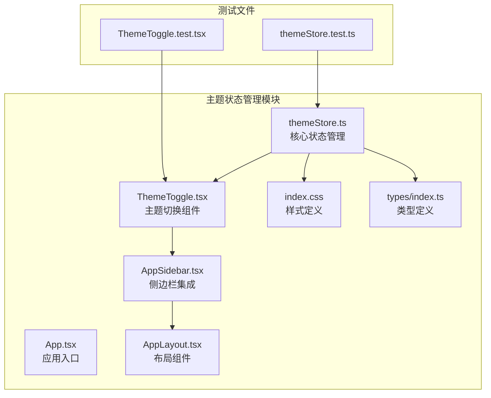
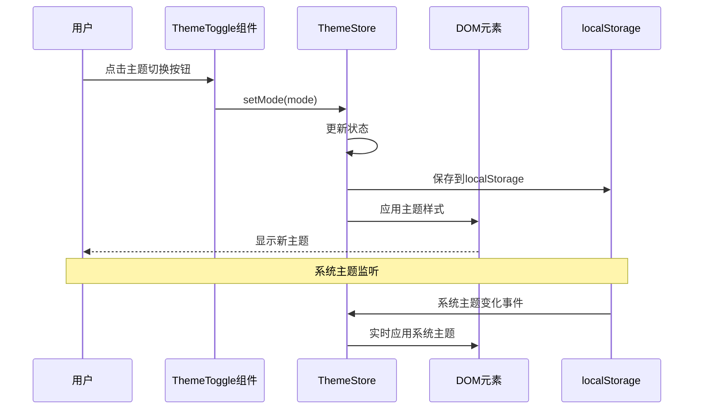
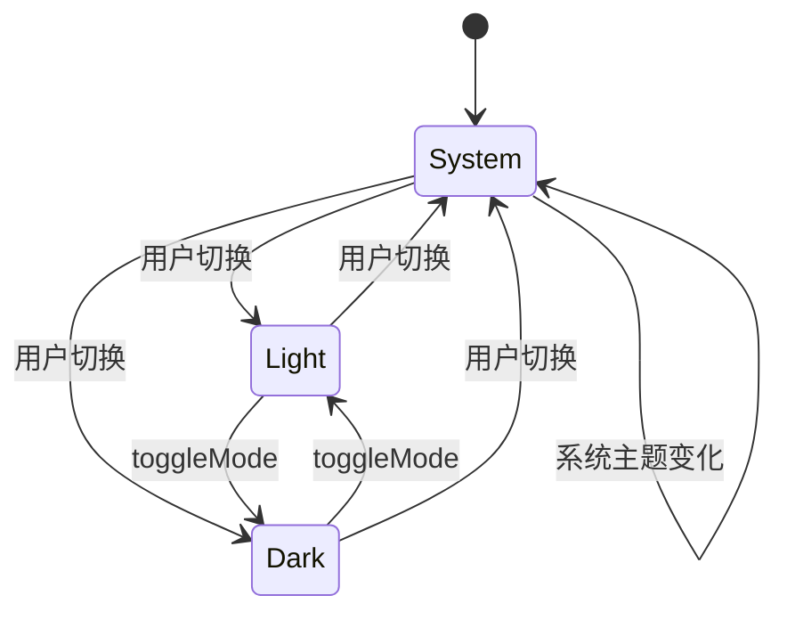
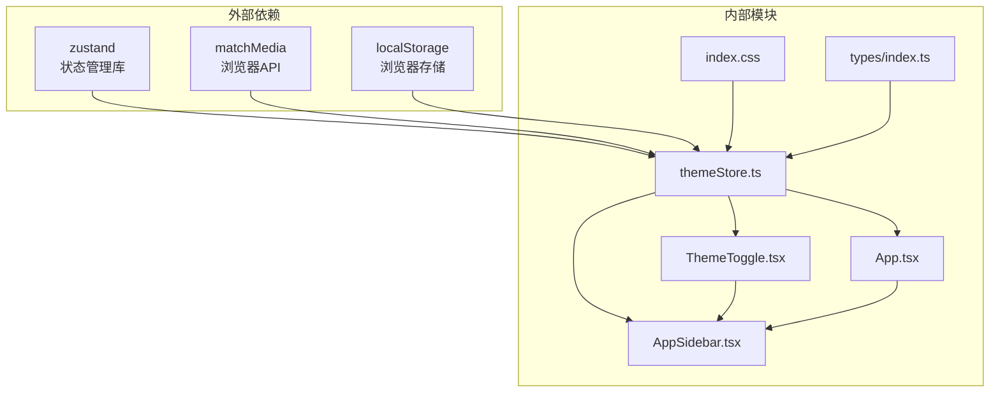

# 主题状态管理

<cite>
**本文档引用的文件**
- [themeStore.ts](file://apps/web/src/stores/themeStore.ts)
- [themeStore.test.ts](file://apps/web/src/stores/themeStore.test.ts)
- [ThemeToggle.tsx](file://apps/web/src/components/ThemeToggle.tsx)
- [ThemeToggle.test.tsx](file://apps/web/src/components/ThemeToggle.test.tsx)
- [App.tsx](file://apps/web/src/App.tsx)
- [AppLayout.tsx](file://apps/web/src/components/layout/AppLayout.tsx)
- [AppSidebar.tsx](file://apps/web/src/components/layout/AppSidebar.tsx)
- [index.css](file://apps/web/src/index.css)
- [types/index.ts](file://apps/web/src/types/index.ts)
</cite>

## 目录

1. [简介](#简介)
2. [项目结构](#项目结构)
3. [核心组件](#核心组件)
4. [架构概览](#架构概览)
5. [详细组件分析](#详细组件分析)
6. [依赖关系分析](#依赖关系分析)
7. [性能考虑](#性能考虑)
8. [故障排除指南](#故障排除指南)
9. [结论](#结论)

## 简介

AIXSSS项目的主题状态管理模块是一个基于Zustand的状态管理解决方案，负责管理应用的主题模式（亮色、暗色、跟随系统）。该模块实现了完整的主题切换机制，包括状态持久化、系统主题监听和实时主题应用功能。通过统一的主题状态管理，确保了用户界面在不同主题模式下的视觉一致性和用户体验的连贯性。

## 项目结构

主题状态管理模块主要分布在以下文件中：



**图表来源**

- [themeStore.ts](file://apps/web/src/stores/themeStore.ts#L1-L57)
- [ThemeToggle.tsx](file://apps/web/src/components/ThemeToggle.tsx#L1-L71)
- [App.tsx](file://apps/web/src/App.tsx#L1-L392)

**章节来源**

- [themeStore.ts](file://apps/web/src/stores/themeStore.ts#L1-L57)
- [ThemeToggle.tsx](file://apps/web/src/components/ThemeToggle.tsx#L1-L71)
- [App.tsx](file://apps/web/src/App.tsx#L1-L392)

## 核心组件

### 主题状态存储（ThemeStore）

主题状态存储是整个模块的核心，基于Zustand创建了一个全局状态管理实例。它包含了以下关键特性：

- **状态结构**：维护当前主题模式（ThemeMode）
- **操作方法**：提供主题切换、模式设置和初始化功能
- **持久化策略**：自动将主题偏好保存到localStorage
- **实时应用**：即时应用主题变化到DOM元素

### 主题切换组件（ThemeToggle）

一个轻量级的React组件，提供了直观的主题切换界面：

- **三种模式支持**：亮色、暗色、跟随系统
- **图标反馈**：根据当前模式显示相应的图标
- **无障碍设计**：支持键盘导航和屏幕阅读器
- **性能优化**：使用memo和useCallback进行渲染优化

### 类型定义

项目定义了明确的主题模式类型，确保类型安全：

```typescript
export type ThemeMode = 'light' | 'dark' | 'system';
```

**章节来源**

- [themeStore.ts](file://apps/web/src/stores/themeStore.ts#L4-L11)
- [ThemeToggle.tsx](file://apps/web/src/components/ThemeToggle.tsx#L22-L24)
- [types/index.ts](file://apps/web/src/types/index.ts#L822-L823)

## 架构概览

主题状态管理模块采用了分层架构设计，确保了模块间的清晰分离和职责单一：



**图表来源**

- [themeStore.ts](file://apps/web/src/stores/themeStore.ts#L16-L46)
- [ThemeToggle.tsx](file://apps/web/src/components/ThemeToggle.tsx#L26-L34)

## 详细组件分析

### ThemeStore 设计与实现

#### 状态管理模式

主题状态存储实现了三种模式的管理：



**图表来源**

- [themeStore.ts](file://apps/web/src/stores/themeStore.ts#L13-L34)

#### 核心方法详解

##### setMode 方法

`setMode` 是主题状态管理的核心方法，负责处理所有主题模式的设置：

**功能特性**：

- 更新内存中的主题状态
- 将主题偏好持久化到localStorage
- 即时应用主题到DOM元素
- 支持三种主题模式：light、dark、system

**实现逻辑**：

1. 接收目标主题模式参数
2. 使用Zustand的set方法更新状态
3. 通过localStorage.setItem保存主题偏好
4. 调用applyTheme函数应用主题样式

**使用场景**：

- 用户手动切换主题模式
- 应用启动时初始化主题
- 系统主题变化时的响应处理

##### toggleMode 方法

`toggleMode` 提供了快速的主题切换功能：

**实现机制**：

- 读取当前主题模式
- 在light和dark之间进行切换
- 自动调用setMode方法完成切换

**特殊处理**：

- 当当前模式为system时，toggleMode会将其视为light模式进行切换
- 这种设计确保了用户期望的一致性行为

##### initTheme 方法

`initTheme` 负责应用的初始化主题加载：

**加载流程**：

1. 从localStorage读取保存的主题偏好
2. 如果没有保存，则默认使用system模式
3. 更新内存状态
4. 应用主题到DOM元素

**错误处理**：

- 处理localStorage访问异常
- 提供默认主题回退机制

#### applyTheme 函数

`applyTheme` 是主题应用的核心函数，负责将主题模式转换为实际的CSS样式：

**工作原理**：

- 获取document.documentElement作为根元素
- 根据主题模式动态添加或移除'dark'类
- 支持三种模式的不同处理逻辑

**系统主题监听**：

- 使用window.matchMedia监听系统主题变化
- 当检测到系统主题变化时，自动应用新的主题
- 仅在当前模式为system时生效

**章节来源**

- [themeStore.ts](file://apps/web/src/stores/themeStore.ts#L16-L56)

### ThemeToggle 组件分析

#### 组件架构

ThemeToggle组件采用了函数式组件设计，结合React Hooks实现：

**组件特性**：

- 使用memo进行渲染优化
- 通过useCallback缓存回调函数
- 仅订阅必要的状态片段
- 支持className属性定制

#### 用户交互设计

**交互流程**：

1. 用户点击主题切换按钮
2. 组件根据当前模式显示相应的菜单
3. 用户选择目标主题模式
4. 触发setMode方法更新主题

**图标系统**：

- 亮色模式：太阳图标（Sun）
- 暗色模式：月亮图标（Moon）
- 跟随系统：显示器图标（Monitor）

#### 性能优化策略

**渲染优化**：

- 使用React.memo避免不必要的重渲染
- useCallback缓存回调函数引用
- 选择器优化：只订阅需要的状态字段

**内存管理**：

- 合理的事件处理器绑定
- 及时清理可能的副作用

**章节来源**

- [ThemeToggle.tsx](file://apps/web/src/components/ThemeToggle.tsx#L26-L70)

### 应用集成分析

#### App.tsx 中的主题初始化

在应用入口处，主题状态管理被正确初始化：

**初始化时机**：

- 应用启动时立即执行
- 确保主题在其他UI组件之前就绪
- 避免主题闪烁问题

**集成方式**：

- 通过useThemeStore选择器订阅特定方法
- 在useEffect中调用initTheme
- 集成键盘快捷键支持

#### AppSidebar 中的主题切换

侧边栏提供了便捷的主题切换入口：

**集成特点**：

- 直接使用useThemeStore的toggleMode方法
- 根据当前主题动态显示图标
- 支持工具提示和键盘快捷键

**用户体验**：

- 一键切换主题模式
- 即时反馈主题变化
- 保持界面的一致性

**章节来源**

- [App.tsx](file://apps/web/src/App.tsx#L109-L116)
- [AppSidebar.tsx](file://apps/web/src/components/layout/AppSidebar.tsx#L43-L44)

## 依赖关系分析

主题状态管理模块的依赖关系相对简洁，遵循了最小依赖原则：



**图表来源**

- [themeStore.ts](file://apps/web/src/stores/themeStore.ts#L1-L2)
- [ThemeToggle.tsx](file://apps/web/src/components/ThemeToggle.tsx#L10-L11)

**依赖特点**：

- **外部依赖极少**：仅依赖zustand和浏览器原生API
- **内部耦合度低**：各组件职责明确，相互独立
- **类型安全**：通过TypeScript确保类型正确性

**章节来源**

- [themeStore.ts](file://apps/web/src/stores/themeStore.ts#L1-L2)
- [ThemeToggle.tsx](file://apps/web/src/components/ThemeToggle.tsx#L10-L11)

## 性能考虑

### 渲染性能优化

**组件级优化**：

- ThemeToggle使用React.memo避免不必要的重渲染
- useCallback缓存事件处理器，减少函数重新创建
- 选择器优化：仅订阅必要的状态字段

**状态管理优化**：

- Zustand的轻量级设计减少了状态管理开销
- 局部状态更新，避免全局重渲染
- 合理的状态拆分，提高更新效率

### 内存使用优化

**生命周期管理**：

- 主题切换监听器在组件卸载时自动清理
- localStorage访问采用异步非阻塞方式
- 避免内存泄漏和资源浪费

**存储策略优化**：

- 仅存储必要的主题偏好信息
- 键值对设计简单高效
- 错误处理确保数据完整性

## 故障排除指南

### 常见问题及解决方案

#### 主题切换无效

**可能原因**：

- localStorage访问权限受限
- DOM元素未正确应用'dark'类
- 浏览器不支持matchMedia API

**解决步骤**：

1. 检查浏览器控制台是否有错误信息
2. 验证localStorage是否可用
3. 确认document.documentElement存在
4. 测试matchMedia API支持情况

#### 主题初始化失败

**可能原因**：

- localStorage中存储的数据格式错误
- 浏览器隐私模式限制localStorage
- 应用启动时机过早

**诊断方法**：

1. 检查localStorage中'aixs_theme'键值
2. 验证存储值是否为有效的ThemeMode类型
3. 确认应用初始化顺序正确

#### 系统主题监听失效

**可能原因**：

- 浏览器不支持matchMedia监听
- 事件监听器注册失败
- 页面可见性变化导致监听器移除

**修复方案**：

1. 检查浏览器兼容性
2. 重新注册事件监听器
3. 处理页面可见性变化事件

**章节来源**

- [themeStore.test.ts](file://apps/web/src/stores/themeStore.test.ts#L128-L149)

## 结论

AIXSSS项目的主题状态管理模块展现了优秀的软件工程实践：

**设计优势**：

- **简洁高效**：最小化的依赖和清晰的职责划分
- **用户体验**：流畅的主题切换和即时反馈
- **可维护性**：模块化设计和完善的测试覆盖
- **性能优化**：多层面的渲染和内存优化

**技术亮点**：

- 基于Zustand的轻量级状态管理
- 完整的系统主题监听机制
- 类型安全的TypeScript实现
- 全面的单元测试覆盖

该模块为整个应用提供了稳定可靠的主题管理基础，确保了用户在不同使用场景下的视觉体验一致性。其设计原则和实现模式可以作为其他前端项目主题管理的最佳实践参考。
