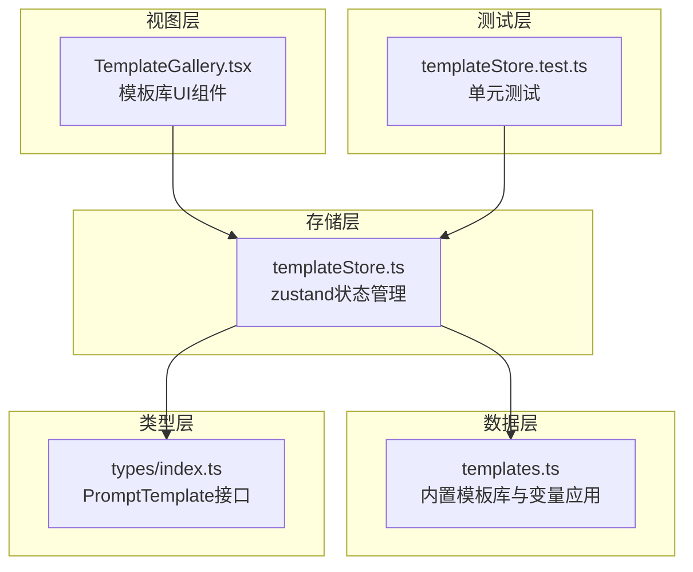
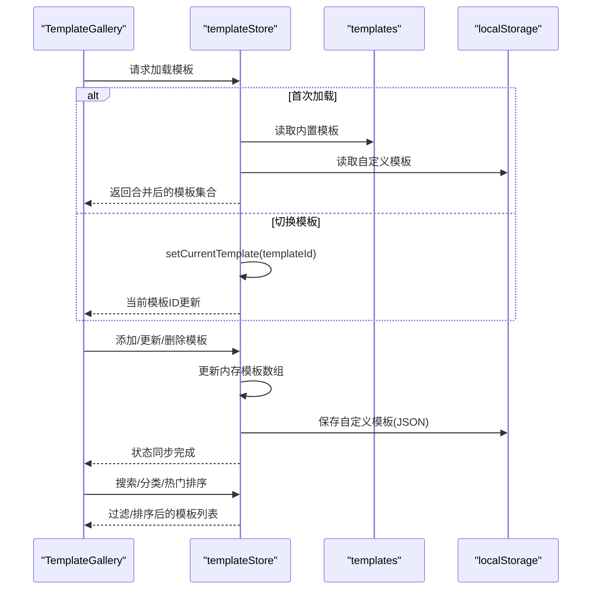
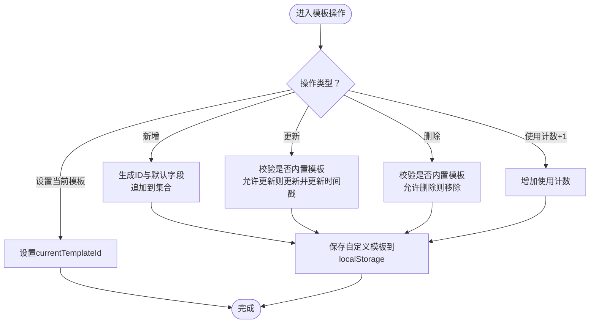
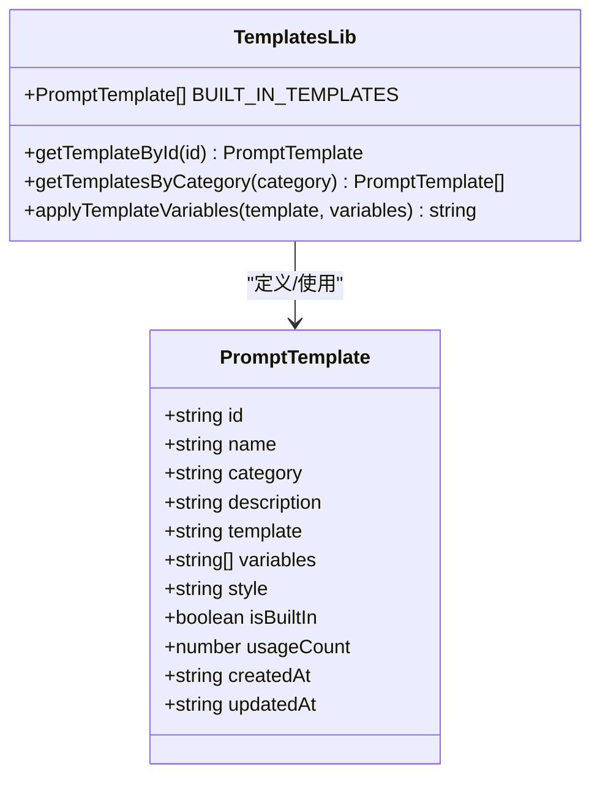
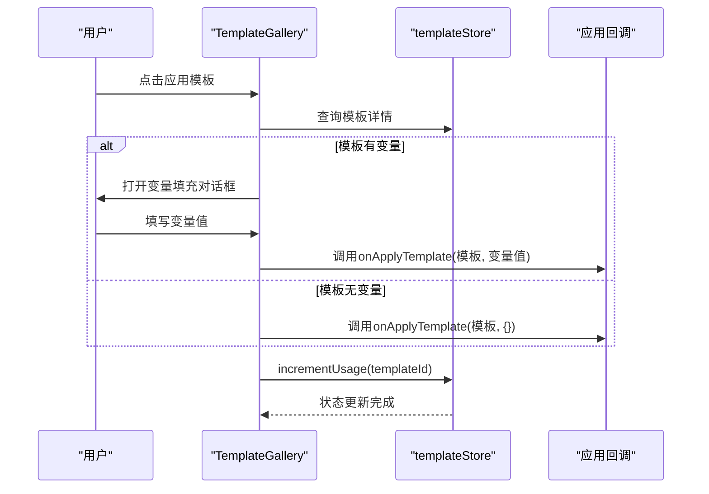
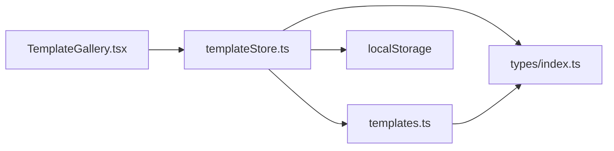

# 模板状态管理

<cite>
**本文档引用的文件**
- [templateStore.ts](file://apps/web/src/stores/templateStore.ts)
- [templates.ts](file://apps/web/src/lib/templates.ts)
- [TemplateGallery.tsx](file://apps/web/src/components/editor/TemplateGallery.tsx)
- [index.ts](file://apps/web/src/types/index.ts)
- [templateStore.test.ts](file://apps/web/src/stores/templateStore.test.ts)
</cite>

## 目录

1. [简介](#简介)
2. [项目结构](#项目结构)
3. [核心组件](#核心组件)
4. [架构总览](#架构总览)
5. [详细组件分析](#详细组件分析)
6. [依赖关系分析](#依赖关系分析)
7. [性能考量](#性能考量)
8. [故障排查指南](#故障排查指南)
9. [结论](#结论)
10. [附录](#附录)

## 简介

本文件面向AIXSSS项目的模板状态管理模块，系统性阐述templateStore的设计理念与实现方式，覆盖模板的状态管理、数据结构定义、加载/选择/持久化机制、变更响应式更新以及模板应用策略。文档同时提供模板状态流转示例、配置项说明与实际应用场景，帮助开发者与使用者快速理解并高效使用模板系统。

## 项目结构

模板状态管理位于Web前端应用中，采用分层组织：

- 存储层：templateStore.ts 使用zustand进行状态管理，负责模板集合、当前选中模板、持久化与查询能力
- 数据层：templates.ts 定义内置模板库与模板变量应用逻辑
- 类型层：types/index.ts 定义PromptTemplate接口与相关类型
- 视图层：TemplateGallery.tsx 提供模板浏览、搜索、分类、创建、删除与应用的UI交互
- 测试层：templateStore.test.ts 验证模板增删改查、搜索、热门排序等行为

图表来源

- [templateStore.ts](file://apps/web/src/stores/templateStore.ts#L1-L143)
- [templates.ts](file://apps/web/src/lib/templates.ts#L1-L313)
- [TemplateGallery.tsx](file://apps/web/src/components/editor/TemplateGallery.tsx#L1-L449)
- [index.ts](file://apps/web/src/types/index.ts#L907-L920)
- [templateStore.test.ts](file://apps/web/src/stores/templateStore.test.ts#L1-L200)

章节来源

- [templateStore.ts](file://apps/web/src/stores/templateStore.ts#L1-L143)
- [templates.ts](file://apps/web/src/lib/templates.ts#L1-L313)
- [TemplateGallery.tsx](file://apps/web/src/components/editor/TemplateGallery.tsx#L1-L449)
- [index.ts](file://apps/web/src/types/index.ts#L907-L920)
- [templateStore.test.ts](file://apps/web/src/stores/templateStore.test.ts#L1-L200)

## 核心组件

- templateStore：基于zustand的状态容器，提供模板集合、当前模板ID、内置模板加载、自定义模板增删改查、使用计数、分类检索、全文搜索、热门模板排序等功能，并自动将自定义模板持久化至localStorage
- templates：内置模板库与模板变量应用函数，提供模板ID查询、分类筛选与变量替换逻辑
- TemplateGallery：模板库UI组件，支持模板浏览、搜索、分类、创建、删除、应用与变量填充
- PromptTemplate类型：模板数据结构定义，包含基础元数据、变量列表、风格标签、内置标志与使用计数等

章节来源

- [templateStore.ts](file://apps/web/src/stores/templateStore.ts#L5-L22)
- [templates.ts](file://apps/web/src/lib/templates.ts#L283-L312)
- [TemplateGallery.tsx](file://apps/web/src/components/editor/TemplateGallery.tsx#L38-L40)
- [index.ts](file://apps/web/src/types/index.ts#L907-L920)

## 架构总览

templateStore通过zustand集中管理模板状态，结合localStorage实现跨会话持久化；templates提供内置模板与变量应用；TemplateGallery作为UI入口，驱动模板的浏览、选择与应用流程。

图表来源

- [templateStore.ts](file://apps/web/src/stores/templateStore.ts#L36-L133)
- [templates.ts](file://apps/web/src/lib/templates.ts#L283-L312)
- [TemplateGallery.tsx](file://apps/web/src/components/editor/TemplateGallery.tsx#L75-L99)

## 详细组件分析

### templateStore 设计与实现

- 状态字段
  - templates：模板数组，初始值来自内置模板与localStorage合并
  - currentTemplateId：当前选中模板ID，支持空值表示未选择
- 初始化逻辑
  - getInitialTemplates：优先从localStorage读取自定义模板，若失败则回退到内置模板
- 模板操作
  - loadBuiltInTemplates：仅加载内置模板
  - loadTemplates：合并内置与localStorage中的自定义模板
  - addTemplate：生成唯一ID、设置默认字段、追加到集合并持久化
  - updateTemplate：禁止修改内置模板，其余模板支持部分字段更新并更新时间戳
  - deleteTemplate：禁止删除内置模板，其余模板直接移除并持久化
  - incrementUsage：增加模板使用计数并持久化
  - setCurrentTemplate：设置当前模板ID
  - getTemplatesByCategory：按分类过滤
  - searchTemplates：按名称/描述/分类进行不区分大小写的模糊搜索
  - getPopularTemplates：按使用计数降序取前N条
- 持久化策略
  - saveCustomTemplates：仅保存非内置模板，避免污染内置模板
  - localStorage键：aixs_templates

图表来源

- [templateStore.ts](file://apps/web/src/stores/templateStore.ts#L56-L110)
- [templateStore.ts](file://apps/web/src/stores/templateStore.ts#L135-L142)

章节来源

- [templateStore.ts](file://apps/web/src/stores/templateStore.ts#L24-L34)
- [templateStore.ts](file://apps/web/src/stores/templateStore.ts#L40-L54)
- [templateStore.ts](file://apps/web/src/stores/templateStore.ts#L56-L110)
- [templateStore.ts](file://apps/web/src/stores/templateStore.ts#L112-L132)
- [templateStore.ts](file://apps/web/src/stores/templateStore.ts#L135-L142)

### templates 内置模板库与变量应用

- 内置模板库
  - 场景锚点：写实、动漫、赛博朋克等风格
  - 动作描述：戏剧性、战斗等
  - 镜头提示词：Midjourney、Stable Diffusion、ComfyUI等平台格式
  - 风格化：水墨国风、像素艺术等
- 辅助函数
  - getTemplateById：按ID查找内置模板
  - getTemplatesByCategory：按分类筛选内置模板
  - applyTemplateVariables：将变量对象替换到模板字符串中

图表来源

- [index.ts](file://apps/web/src/types/index.ts#L907-L920)
- [templates.ts](file://apps/web/src/lib/templates.ts#L7-L281)
- [templates.ts](file://apps/web/src/lib/templates.ts#L283-L312)

章节来源

- [templates.ts](file://apps/web/src/lib/templates.ts#L7-L281)
- [templates.ts](file://apps/web/src/lib/templates.ts#L283-L312)
- [index.ts](file://apps/web/src/types/index.ts#L907-L920)

### TemplateGallery 模板库UI组件

- 功能特性
  - 模板浏览：按热门、内置、自定义三类展示
  - 搜索与筛选：支持按名称/描述/分类搜索
  - 模板应用：点击应用触发变量填充或直接应用
  - 模板管理：创建、删除自定义模板
- 交互流程
  - 选择模板 -> 若存在变量则弹出变量对话框 -> 填充变量 -> 应用模板 -> 增加使用计数
  - 创建模板时自动解析模板字符串中的变量占位符

图表来源

- [TemplateGallery.tsx](file://apps/web/src/components/editor/TemplateGallery.tsx#L75-L99)
- [templateStore.ts](file://apps/web/src/stores/templateStore.ts#L103-L110)

章节来源

- [TemplateGallery.tsx](file://apps/web/src/components/editor/TemplateGallery.tsx#L38-L40)
- [TemplateGallery.tsx](file://apps/web/src/components/editor/TemplateGallery.tsx#L58-L73)
- [TemplateGallery.tsx](file://apps/web/src/components/editor/TemplateGallery.tsx#L75-L99)
- [TemplateGallery.tsx](file://apps/web/src/components/editor/TemplateGallery.tsx#L101-L132)

### PromptTemplate 数据模型

- 字段说明
  - id：模板唯一标识
  - name：模板名称
  - category：模板分类（如场景、角色、动作等）
  - description：模板描述
  - template：模板内容（可包含变量占位符）
  - variables：变量名数组
  - style：推荐画风（可选）
  - isBuiltIn：是否为内置模板
  - usageCount：使用计数
  - createdAt/updatedAt：创建与更新时间

章节来源

- [index.ts](file://apps/web/src/types/index.ts#L907-L920)

## 依赖关系分析

- 组件耦合
  - TemplateGallery依赖templateStore进行状态读取与操作
  - templateStore依赖templates进行内置模板访问与localStorage进行持久化
  - PromptTemplate类型被templateStore与templates共同使用
- 外部依赖
  - localStorage：用于自定义模板的持久化
  - zustand：用于状态管理与响应式更新

图表来源

- [TemplateGallery.tsx](file://apps/web/src/components/editor/TemplateGallery.tsx#L11-L12)
- [templateStore.ts](file://apps/web/src/stores/templateStore.ts#L1-L3)
- [templates.ts](file://apps/web/src/lib/templates.ts#L5)
- [index.ts](file://apps/web/src/types/index.ts#L907-L920)

章节来源

- [TemplateGallery.tsx](file://apps/web/src/components/editor/TemplateGallery.tsx#L11-L12)
- [templateStore.ts](file://apps/web/src/stores/templateStore.ts#L1-L3)
- [templates.ts](file://apps/web/src/lib/templates.ts#L5)
- [index.ts](file://apps/web/src/types/index.ts#L907-L920)

## 性能考量

- 搜索与过滤
  - searchTemplates与getTemplatesByCategory采用数组过滤，复杂度O(n)，在模板数量适中时性能可接受
  - 建议在模板数量较大时考虑索引或分页展示
- 变量替换
  - applyTemplateVariables使用正则替换，复杂度近似O(m·k)，其中m为模板长度，k为变量数量
  - 建议避免在高频路径中重复执行大量变量替换
- 持久化
  - saveCustomTemplates仅保存自定义模板，避免频繁写入内置模板
  - localStorage读写为同步操作，建议在批量更新后统一持久化

[本节为通用性能讨论，不直接分析具体文件]

## 故障排查指南

- 模板无法加载
  - 检查localStorage中aixs_templates键是否存在且JSON格式正确
  - 若解析失败，store会回退到内置模板
- 内置模板被误修改或删除
  - updateTemplate与deleteTemplate对isBuiltIn=true的模板进行保护，不会执行修改或删除
- 模板应用后未增加使用计数
  - 确认TemplateGallery在应用模板后调用了incrementUsage
- 搜索结果异常
  - 确认searchTemplates的查询字符串已转换为小写进行匹配
- 热门模板排序错误
  - 确认getPopularTemplates按usageCount降序排序

章节来源

- [templateStore.ts](file://apps/web/src/stores/templateStore.ts#L77-L80)
- [templateStore.ts](file://apps/web/src/stores/templateStore.ts#L93-L96)
- [TemplateGallery.tsx](file://apps/web/src/components/editor/TemplateGallery.tsx#L84-L96)
- [templateStore.test.ts](file://apps/web/src/stores/templateStore.test.ts#L142-L177)
- [templateStore.test.ts](file://apps/web/src/stores/templateStore.test.ts#L179-L198)

## 结论

templateStore通过zustand实现了模板状态的集中管理与响应式更新，结合localStorage提供了跨会话的自定义模板持久化能力。templates模块提供了丰富的内置模板与变量应用逻辑，TemplateGallery则为用户提供直观的模板浏览、搜索、分类与应用体验。整体设计在保证易用性的同时兼顾了扩展性与可维护性。

[本节为总结性内容，不直接分析具体文件]

## 附录

### 模板状态流转示例

- 加载流程
  - 首次加载：读取内置模板 + localStorage自定义模板，合并后初始化
  - 切换模板：setCurrentTemplate更新当前模板ID
- 应用流程
  - 选择模板 -> 若存在变量 -> 弹出变量对话框 -> 填写变量 -> 应用模板 -> 增加使用计数
- 管理流程
  - 创建：addTemplate生成唯一ID与默认字段，追加并持久化
  - 更新：updateTemplate仅允许非内置模板，更新时间戳并持久化
  - 删除：deleteTemplate仅允许非内置模板，移除并持久化

章节来源

- [templateStore.ts](file://apps/web/src/stores/templateStore.ts#L40-L54)
- [templateStore.ts](file://apps/web/src/stores/templateStore.ts#L112-L114)
- [TemplateGallery.tsx](file://apps/web/src/components/editor/TemplateGallery.tsx#L75-L99)
- [templateStore.ts](file://apps/web/src/stores/templateStore.ts#L56-L71)
- [templateStore.ts](file://apps/web/src/stores/templateStore.ts#L73-L88)
- [templateStore.ts](file://apps/web/src/stores/templateStore.ts#L90-L101)

### 模板配置项说明

- PromptTemplate字段
  - id：模板唯一标识
  - name：模板名称
  - category：模板分类
  - description：模板描述
  - template：模板内容（支持变量占位符）
  - variables：变量名数组
  - style：推荐画风（可选）
  - isBuiltIn：是否内置模板
  - usageCount：使用计数
  - createdAt/updatedAt：创建与更新时间

章节来源

- [index.ts](file://apps/web/src/types/index.ts#L907-L920)

### 实际应用场景

- 场景锚点模板：用于生成环境一致性描述，适用于写实、动漫、赛博朋克等多种风格
- 动作描述模板：用于生成具有戏剧张力或战斗强度的动作描述
- 镜头提示词模板：针对不同AI绘图/生图平台（如Midjourney、Stable Diffusion、ComfyUI）生成优化提示词
- 风格化模板：提供水墨国风、像素艺术等风格化场景与动作描述

章节来源

- [templates.ts](file://apps/web/src/lib/templates.ts#L7-L281)
