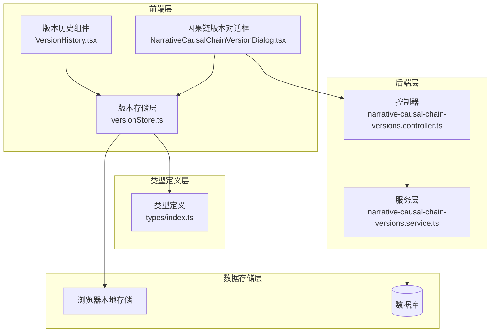
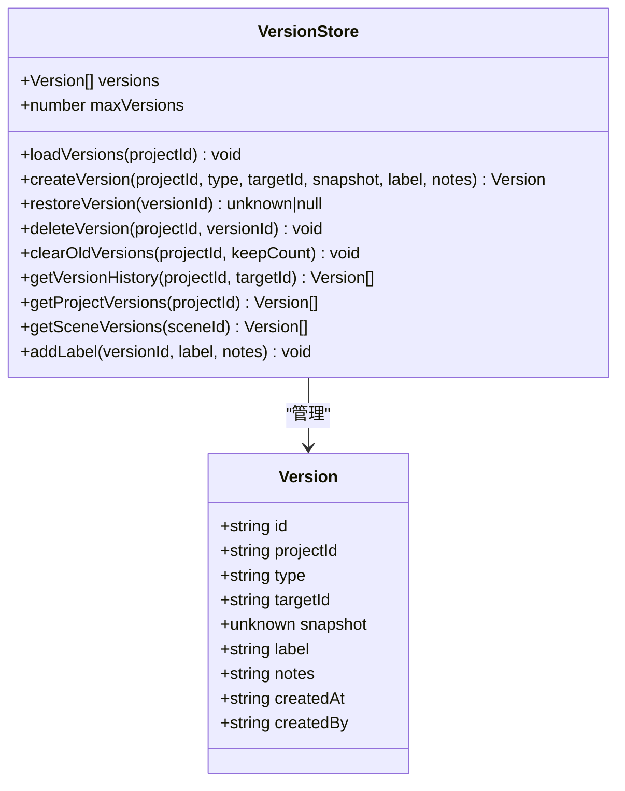
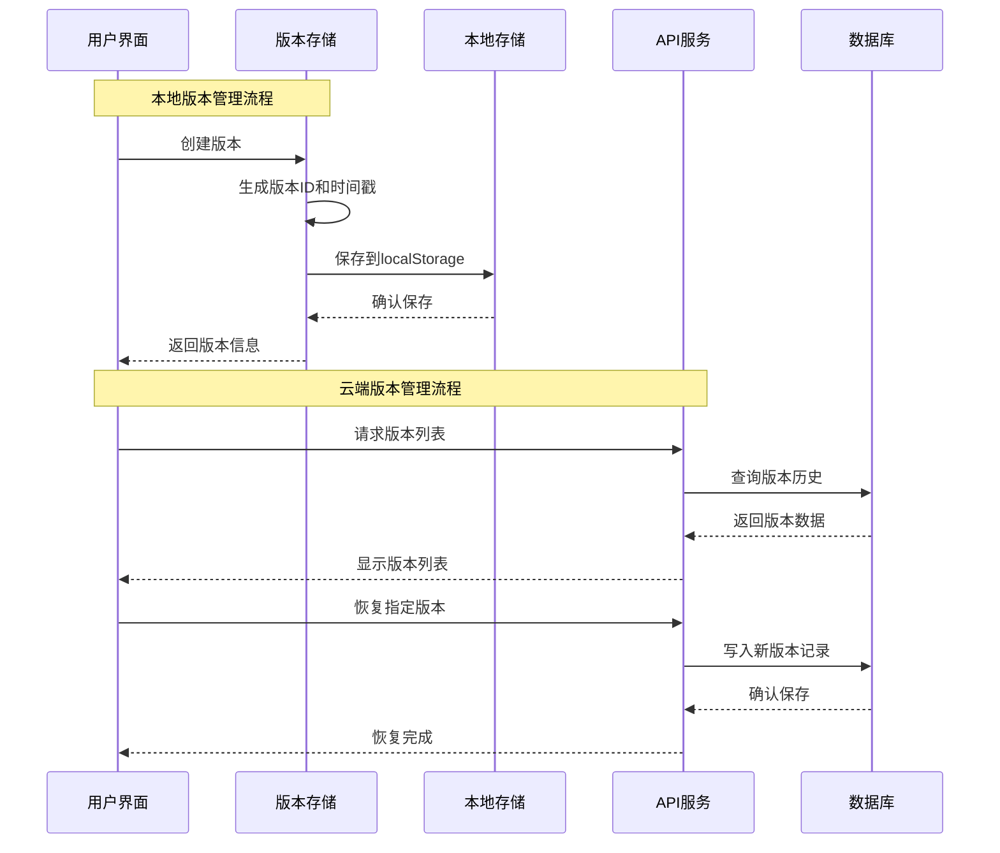
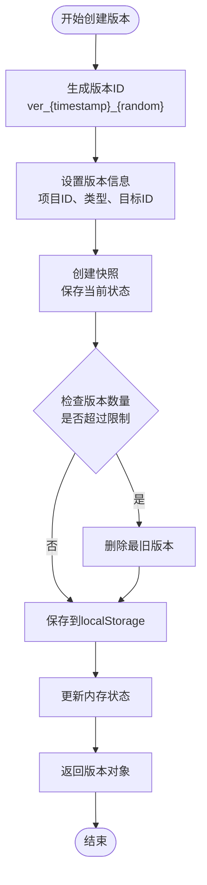
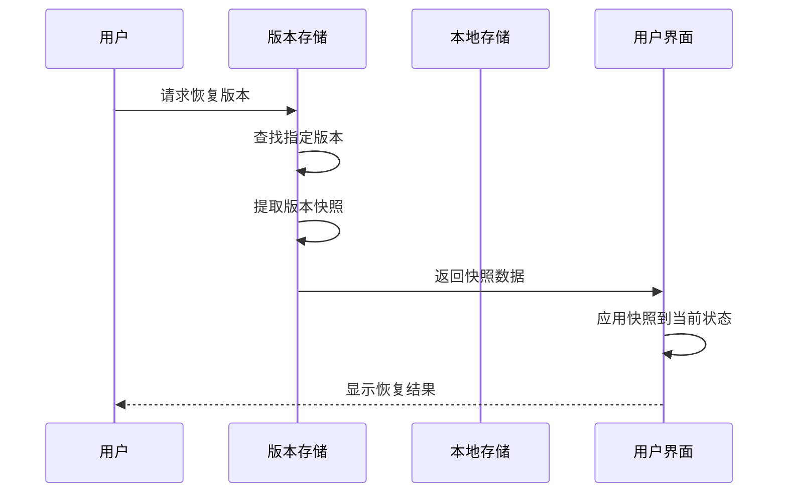
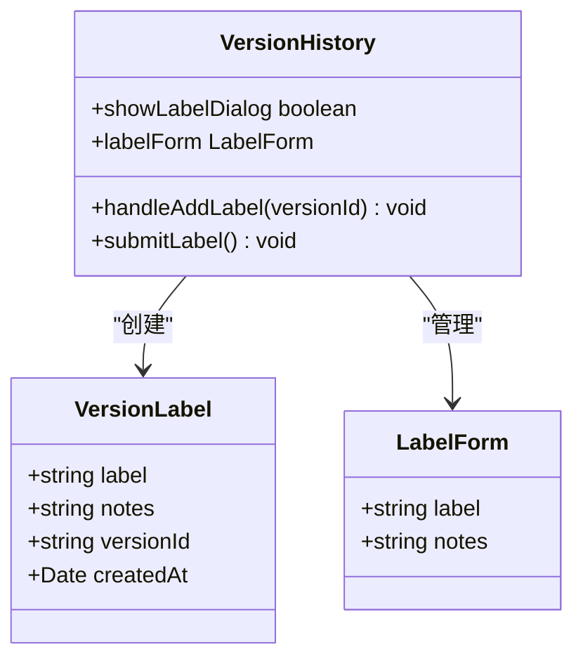
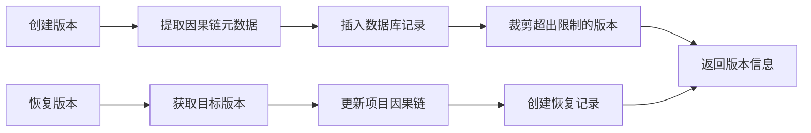
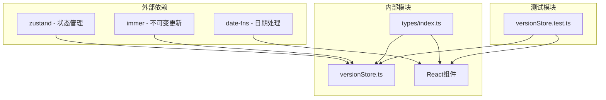
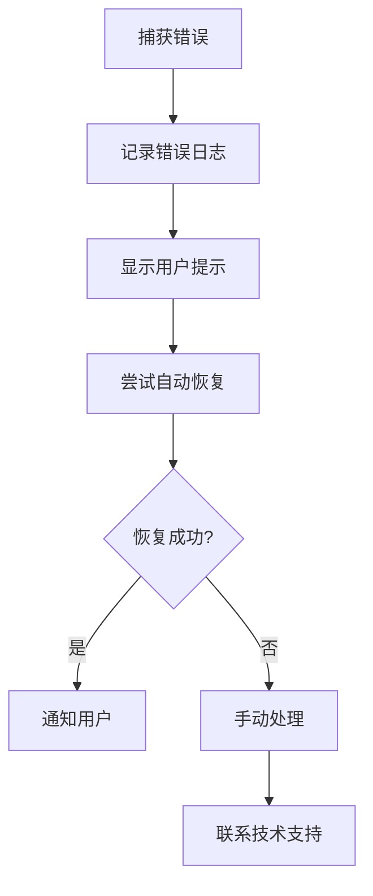

# 版本状态管理

<cite>
**本文档引用的文件**
- [apps/web/src/stores/versionStore.ts](file://apps/web/src/stores/versionStore.ts)
- [apps/web/src/stores/versionStore.test.ts](file://apps/web/src/stores/versionStore.test.ts)
- [apps/web/src/components/editor/VersionHistory.tsx](file://apps/web/src/components/editor/VersionHistory.tsx)
- [apps/web/src/components/editor/NarrativeCausalChainVersionDialog.tsx](file://apps/web/src/components/editor/NarrativeCausalChainVersionDialog.tsx)
- [apps/api/src/projects/narrative-causal-chain-versions.controller.ts](file://apps/api/src/projects/narrative-causal-chain-versions.controller.ts)
- [apps/api/src/projects/narrative-causal-chain-versions.service.ts](file://apps/api/src/projects/narrative-causal-chain-versions.service.ts)
- [apps/web/src/types/index.ts](file://apps/web/src/types/index.ts)
</cite>

## 目录

1. [简介](#简介)
2. [项目结构](#项目结构)
3. [核心组件](#核心组件)
4. [架构概览](#架构概览)
5. [详细组件分析](#详细组件分析)
6. [依赖关系分析](#依赖关系分析)
7. [性能考虑](#性能考虑)
8. [故障排除指南](#故障排除指南)
9. [结论](#结论)

## 简介

AIXSSS项目的版本状态管理模块是一个完整的版本控制系统，旨在为项目创作提供可靠的版本追踪、管理和恢复能力。该模块支持两种主要的版本管理场景：

1. **本地版本管理**：基于浏览器本地存储的轻量级版本控制，适用于个人创作和快速迭代
2. **云端版本管理**：基于API的完整版本控制系统，支持团队协作和企业级版本管理

该模块的核心设计理念是提供统一的版本管理接口，同时支持多种版本类型（项目版本和场景版本），并通过响应式更新确保用户界面的实时同步。

## 项目结构

版本状态管理模块采用分层架构设计，主要包含以下层次：

**图表来源**

- [apps/web/src/stores/versionStore.ts](file://apps/web/src/stores/versionStore.ts#L1-L139)
- [apps/web/src/components/editor/VersionHistory.tsx](file://apps/web/src/components/editor/VersionHistory.tsx#L1-L230)
- [apps/web/src/components/editor/NarrativeCausalChainVersionDialog.tsx](file://apps/web/src/components/editor/NarrativeCausalChainVersionDialog.tsx#L1-L467)

**章节来源**

- [apps/web/src/stores/versionStore.ts](file://apps/web/src/stores/versionStore.ts#L1-L139)
- [apps/web/src/types/index.ts](file://apps/web/src/types/index.ts#L893-L920)

## 核心组件

### 版本存储接口定义

版本存储模块提供了完整的版本管理接口，包括版本的创建、查询、恢复和删除功能：

**图表来源**

- [apps/web/src/stores/versionStore.ts](file://apps/web/src/stores/versionStore.ts#L5-L26)
- [apps/web/src/types/index.ts](file://apps/web/src/types/index.ts#L893-L920)

### 版本类型定义

版本数据结构支持灵活的快照存储，可以保存任何类型的项目状态：

| 字段名    | 类型                 | 描述           | 必填 |
| --------- | -------------------- | -------------- | ---- |
| id        | string               | 版本唯一标识符 | 是   |
| projectId | string               | 所属项目ID     | 是   |
| type      | 'project' \| 'scene' | 版本类型       | 是   |
| targetId  | string               | 目标对象ID     | 是   |
| snapshot  | unknown              | 状态快照数据   | 是   |
| label     | string               | 版本标签       | 否   |
| notes     | string               | 版本备注       | 否   |
| createdAt | string               | 创建时间       | 是   |
| createdBy | string               | 创建者         | 是   |

**章节来源**

- [apps/web/src/stores/versionStore.ts](file://apps/web/src/stores/versionStore.ts#L42-L54)
- [apps/web/src/types/index.ts](file://apps/web/src/types/index.ts#L893-L920)

## 架构概览

版本状态管理模块采用分层架构，实现了前后端分离的版本管理方案：

**图表来源**

- [apps/web/src/stores/versionStore.ts](file://apps/web/src/stores/versionStore.ts#L32-L73)
- [apps/web/src/components/editor/NarrativeCausalChainVersionDialog.tsx](file://apps/web/src/components/editor/NarrativeCausalChainVersionDialog.tsx#L75-L117)

## 详细组件分析

### 版本存储模块

版本存储模块是整个版本管理系统的核心，基于Zustand状态管理库构建，提供了完整的版本生命周期管理：

#### 版本创建机制

版本创建过程包含以下关键步骤：

1. **版本信息生成**：自动生成唯一ID、时间戳和创建者信息
2. **版本数量控制**：自动限制每个项目的版本数量（默认50个）
3. **持久化存储**：将版本信息保存到localStorage中
4. **状态更新**：通过响应式更新通知UI组件

**图表来源**

- [apps/web/src/stores/versionStore.ts](file://apps/web/src/stores/versionStore.ts#L42-L73)

#### 版本恢复机制

版本恢复功能允许用户将项目状态恢复到任意历史版本：

**图表来源**

- [apps/web/src/stores/versionStore.ts](file://apps/web/src/stores/versionStore.ts#L75-L81)

**章节来源**

- [apps/web/src/stores/versionStore.ts](file://apps/web/src/stores/versionStore.ts#L28-L130)

### 版本历史组件

版本历史组件提供了可视化的版本管理界面，支持版本浏览、标签添加和版本恢复功能：

#### 组件功能特性

| 功能         | 描述                     | 实现方式         |
| ------------ | ------------------------ | ---------------- |
| 版本列表显示 | 展示项目的所有版本历史   | 使用滚动区域组件 |
| 版本排序     | 按创建时间降序排列       | 内置排序逻辑     |
| 版本标签     | 为版本添加标签和备注     | 对话框表单       |
| 版本恢复     | 将项目状态恢复到指定版本 | 确认对话框       |
| 快照预览     | 查看版本的详细快照信息   | 折叠面板         |

#### 版本标签系统

版本标签系统支持为重要版本添加描述性标签：

**图表来源**

- [apps/web/src/components/editor/VersionHistory.tsx](file://apps/web/src/components/editor/VersionHistory.tsx#L76-L87)

**章节来源**

- [apps/web/src/components/editor/VersionHistory.tsx](file://apps/web/src/components/editor/VersionHistory.tsx#L1-L230)

### 因果链版本管理

对于复杂的叙事结构，系统提供了专门的因果链版本管理功能：

#### 版本管理模式

| 模式     | 功能                 | 适用场景           |
| -------- | -------------------- | ------------------ |
| 浏览模式 | 查看版本历史和详情   | 版本审计和比较     |
| 快照模式 | 创建新的版本快照     | 关键里程碑记录     |
| 恢复模式 | 将项目恢复到指定版本 | 错误回滚和实验验证 |

#### 版本元数据管理

因果链版本支持丰富的元数据信息：

| 元数据字段         | 描述       | 示例值                    |
| ------------------ | ---------- | ------------------------- |
| phase              | 工作流阶段 | 1-4                       |
| completedPhase     | 完成阶段   | 1-4                       |
| validationStatus   | 校验状态   | "通过"、"待审核"          |
| chainSchemaVersion | 结构版本   | "1.0.0"                   |
| source             | 版本来源   | "ai"、"manual"、"restore" |

**章节来源**

- [apps/web/src/components/editor/NarrativeCausalChainVersionDialog.tsx](file://apps/web/src/components/editor/NarrativeCausalChainVersionDialog.tsx#L1-L467)

### API版本管理服务

云端版本管理通过RESTful API提供完整的版本控制功能：

#### 版本管理API

| 端点                                                                      | 方法 | 功能         | 参数            |
| ------------------------------------------------------------------------- | ---- | ------------ | --------------- |
| `/projects/:projectId/narrative-causal-chain/versions`                    | GET  | 获取版本列表 | limit: 数量限制 |
| `/projects/:projectId/narrative-causal-chain/versions`                    | POST | 创建快照     | label, note     |
| `/projects/:projectId/narrative-causal-chain/versions/:versionId`         | GET  | 获取版本详情 | -               |
| `/projects/:projectId/narrative-causal-chain/versions/:versionId/restore` | POST | 恢复版本     | label, note     |

#### 版本服务实现

版本服务提供了版本的创建、查询和恢复功能，支持最大50个版本的限制：

**图表来源**

- [apps/api/src/projects/narrative-causal-chain-versions.service.ts](file://apps/api/src/projects/narrative-causal-chain-versions.service.ts#L174-L205)

**章节来源**

- [apps/api/src/projects/narrative-causal-chain-versions.controller.ts](file://apps/api/src/projects/narrative-causal-chain-versions.controller.ts#L1-L84)
- [apps/api/src/projects/narrative-causal-chain-versions.service.ts](file://apps/api/src/projects/narrative-causal-chain-versions.service.ts#L1-L339)

## 依赖关系分析

版本状态管理模块的依赖关系相对简洁，主要依赖于以下核心组件：

**图表来源**

- [apps/web/src/stores/versionStore.ts](file://apps/web/src/stores/versionStore.ts#L1-L3)
- [apps/web/src/stores/versionStore.test.ts](file://apps/web/src/stores/versionStore.test.ts#L1-L5)

### 核心依赖说明

| 依赖库       | 版本     | 用途           | 重要性   |
| ------------ | -------- | -------------- | -------- |
| zustand      | 最新版本 | 状态管理       | 核心依赖 |
| immer        | 最新版本 | 不可变数据更新 | 核心依赖 |
| date-fns     | 最新版本 | 日期格式化     | 辅助功能 |
| lucide-react | 最新版本 | 图标组件       | UI组件   |

**章节来源**

- [apps/web/src/stores/versionStore.ts](file://apps/web/src/stores/versionStore.ts#L1-L3)

## 性能考虑

版本状态管理模块在设计时充分考虑了性能优化：

### 内存管理

1. **版本数量限制**：默认限制每个项目最多50个版本，防止内存泄漏
2. **懒加载策略**：版本详情按需加载，减少初始渲染负担
3. **增量更新**：使用Immer进行不可变更新，避免不必要的重渲染

### 存储优化

1. **本地存储分片**：按项目ID分片存储，提高查询效率
2. **压缩存储**：对版本快照进行JSON序列化存储
3. **清理机制**：自动清理超出限制的历史版本

### 响应式更新

1. **细粒度更新**：只更新受影响的组件
2. **批量操作**：支持批量版本操作
3. **防抖处理**：对频繁操作进行防抖处理

## 故障排除指南

### 常见问题及解决方案

| 问题类型 | 症状           | 可能原因     | 解决方案                             |
| -------- | -------------- | ------------ | ------------------------------------ |
| 版本丢失 | 版本历史为空   | 本地存储损坏 | 清除浏览器缓存或检查存储权限         |
| 恢复失败 | 恢复操作报错   | 版本数据损坏 | 检查版本快照完整性或联系技术支持     |
| 性能问题 | 页面加载缓慢   | 版本过多     | 使用版本清理功能删除不需要的历史版本 |
| 同步问题 | 版本状态不一致 | 网络异常     | 检查网络连接或重启应用               |

### 调试工具

版本存储模块提供了完善的错误处理和调试支持：

**章节来源**

- [apps/web/src/stores/versionStore.ts](file://apps/web/src/stores/versionStore.ts#L33-L39)
- [apps/web/src/stores/versionStore.test.ts](file://apps/web/src/stores/versionStore.test.ts#L53-L59)

## 结论

AIXSSS项目的版本状态管理模块是一个设计精良、功能完整的版本控制系统。其主要特点包括：

1. **双模式支持**：同时支持本地和云端版本管理，满足不同使用场景
2. **响应式设计**：基于Zustand的状态管理，提供流畅的用户体验
3. **类型安全**：完整的TypeScript类型定义，确保代码质量
4. **扩展性强**：模块化设计，易于功能扩展和维护
5. **性能优化**：合理的内存管理和存储策略，保证系统性能

该模块为AIXSSS项目提供了可靠的数据版本管理能力，支持创作者进行安全的实验和迭代，是项目成功的重要基础设施。
