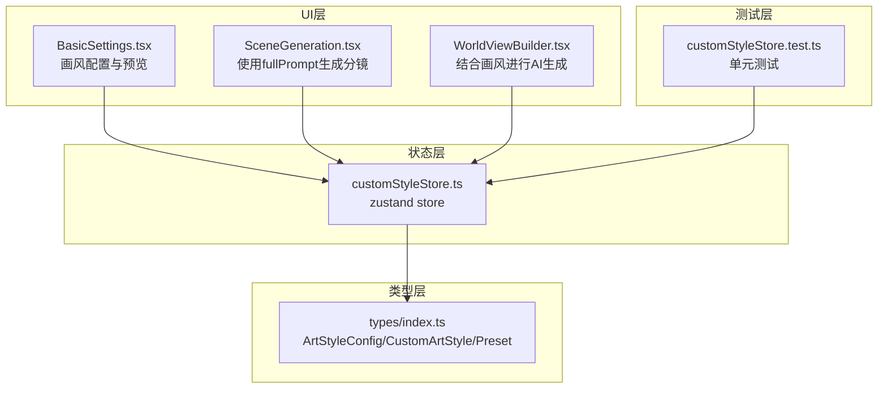
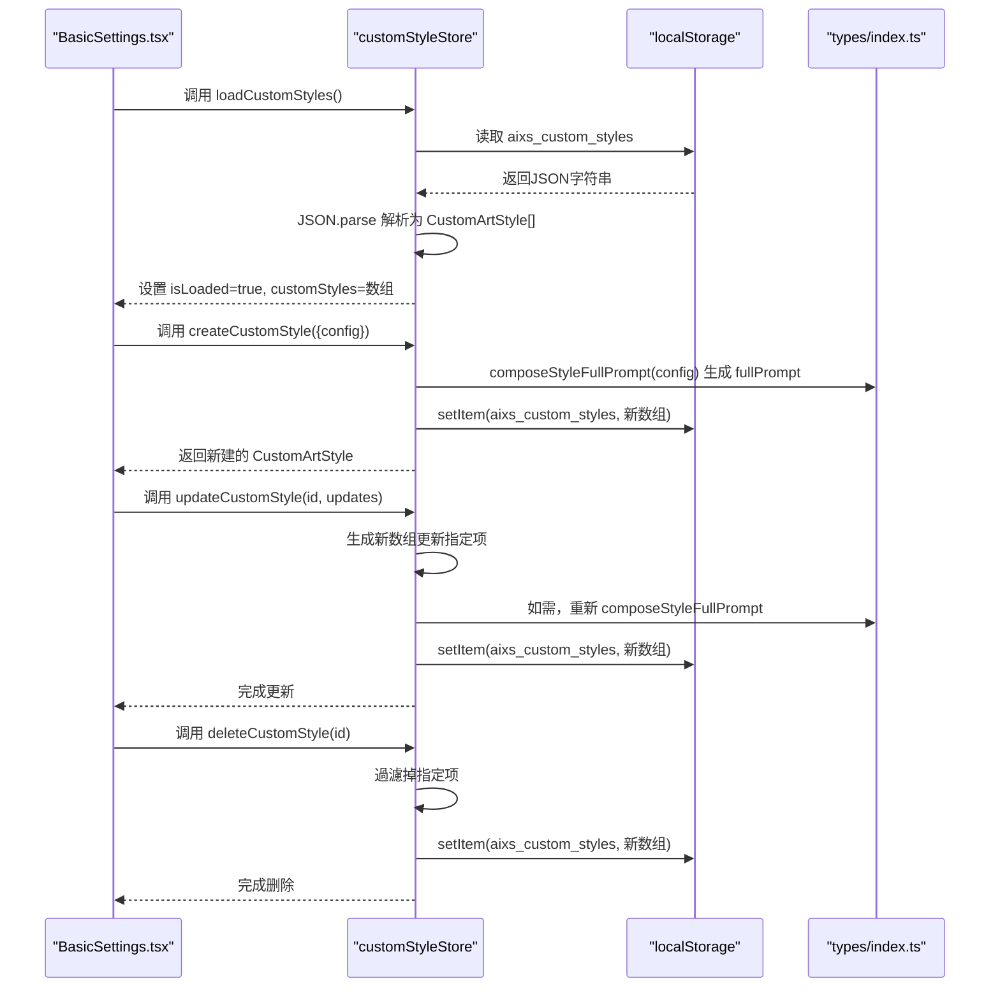
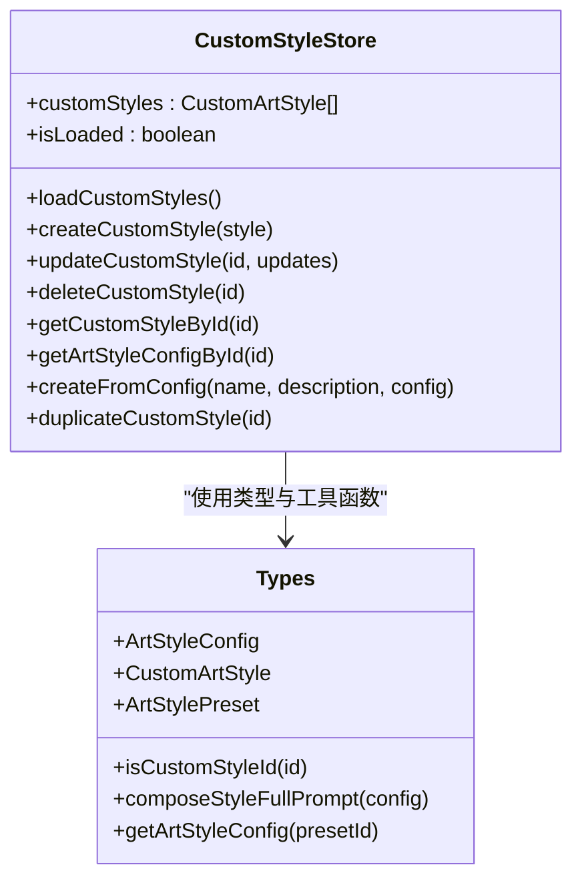
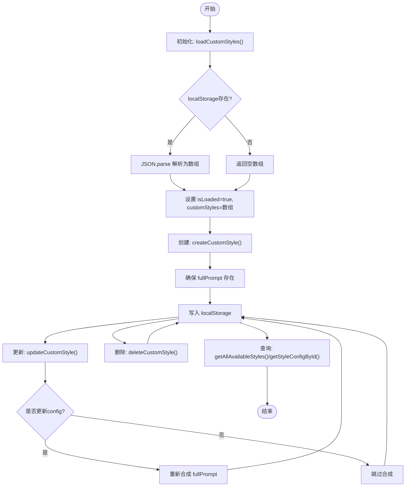
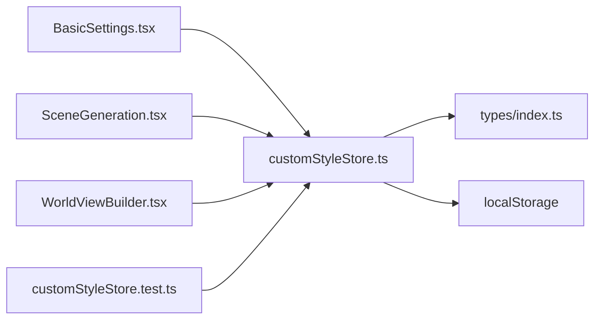

# 自定义样式状态管理

<cite>
**本文档引用的文件**
- [customStyleStore.ts](file://apps/web/src/stores/customStyleStore.ts)
- [customStyleStore.test.ts](file://apps/web/src/stores/customStyleStore.test.ts)
- [index.ts](file://apps/web/src/types/index.ts)
- [BasicSettings.tsx](file://apps/web/src/components/editor/BasicSettings.tsx)
- [SceneGeneration.tsx](file://apps/web/src/components/editor/SceneGeneration.tsx)
- [WorldViewBuilder.tsx](file://apps/web/src/components/editor/WorldViewBuilder.tsx)
</cite>

## 目录

1. [简介](#简介)
2. [项目结构](#项目结构)
3. [核心组件](#核心组件)
4. [架构总览](#架构总览)
5. [详细组件分析](#详细组件分析)
6. [依赖关系分析](#依赖关系分析)
7. [性能考量](#性能考量)
8. [故障排查指南](#故障排查指南)
9. [结论](#结论)
10. [附录](#附录)

## 简介

本文件面向AIXSSS项目的“自定义样式状态管理”模块，系统性阐述customStyleStore的设计理念、实现细节与使用方式。该模块负责管理用户自定义画风（ArtStyle）的生命周期：创建、更新、删除、复制、持久化与查询，并提供与内置预设的统一访问接口。同时，文档覆盖样式初始化、更新与持久化的机制，以及样式变更的响应式更新与实时预览功能，给出状态流转示例、配置项说明与典型应用场景，帮助开发者与使用者高效理解与扩展该模块。

## 项目结构

- 状态层：位于apps/web/src/stores/customStyleStore.ts，基于zustand实现轻量状态管理。
- 类型层：位于apps/web/src/types/index.ts，定义ArtStyleConfig、CustomArtStyle、ArtStylePreset及辅助函数。
- UI层：位于apps/web/src/components/editor/BasicSettings.tsx等组件，消费store并提供画风配置界面与实时预览。
- 测试层：位于apps/web/src/stores/customStyleStore.test.ts，覆盖加载、创建、更新、删除、复制、查询等核心行为。

图表来源

- [customStyleStore.ts](file://apps/web/src/stores/customStyleStore.ts#L82-L193)
- [index.ts](file://apps/web/src/types/index.ts#L13-L55)
- [BasicSettings.tsx](file://apps/web/src/components/editor/BasicSettings.tsx#L88-L150)
- [SceneGeneration.tsx](file://apps/web/src/components/editor/SceneGeneration.tsx#L40-L51)
- [WorldViewBuilder.tsx](file://apps/web/src/components/editor/WorldViewBuilder.tsx#L134-L137)
- [customStyleStore.test.ts](file://apps/web/src/stores/customStyleStore.test.ts#L1-L380)

章节来源

- [customStyleStore.ts](file://apps/web/src/stores/customStyleStore.ts#L1-L240)
- [index.ts](file://apps/web/src/types/index.ts#L1-L240)

## 核心组件

- customStyleStore：基于zustand的状态容器，提供自定义画风的CRUD、查询与持久化能力。
- 类型系统：ArtStyleConfig、CustomArtStyle、ArtStylePreset及其辅助函数（如isCustomStyleId、composeStyleFullPrompt、getArtStyleConfig）。
- UI集成：BasicSettings.tsx等组件通过store读取/写入画风配置，实现实时预览与草稿保存。

章节来源

- [customStyleStore.ts](file://apps/web/src/stores/customStyleStore.ts#L48-L193)
- [index.ts](file://apps/web/src/types/index.ts#L13-L189)

## 架构总览

customStyleStore采用“状态即数据”的设计，将自定义画风列表与加载状态存放在store内，并通过localStorage实现持久化。UI组件通过store暴露的方法进行操作，store内部在每次变更后同步更新localStorage，确保刷新后仍可恢复。

图表来源

- [customStyleStore.ts](file://apps/web/src/stores/customStyleStore.ts#L86-L150)
- [index.ts](file://apps/web/src/types/index.ts#L228-L238)

## 详细组件分析

### customStyleStore 设计与实现

- 状态字段
  - customStyles: 自定义画风数组
  - isLoaded: 标识是否完成本地加载
- 持久化策略
  - 键名：aixs_custom_styles
  - 读取：loadCustomStyles() 从localStorage.getItem解析
  - 写入：saveCustomStyles() 在每次CRUD后调用setItem
- 核心方法
  - loadCustomStyles(): 初始化加载
  - createCustomStyle(): 生成唯一ID、补全createdAt/updatedAt、确保fullPrompt存在
  - updateCustomStyle(): 支持部分字段更新，必要时重新合成fullPrompt
  - deleteCustomStyle(): 过滤删除
  - getCustomStyleById(): 按ID查找
  - getArtStyleConfigById(): 将CustomArtStyle包装为ArtStyleConfig（presetId=自定义ID）
  - createFromConfig(): 从现有配置创建自定义画风
  - duplicateCustomStyle(): 复制现有自定义画风
- 辅助函数
  - getAllAvailableStyles(): 合并内置预设与自定义画风，用于UI选择器
  - getStyleConfigById(): 统一入口，区分内置与自定义

图表来源

- [customStyleStore.ts](file://apps/web/src/stores/customStyleStore.ts#L48-L193)
- [index.ts](file://apps/web/src/types/index.ts#L13-L189)

章节来源

- [customStyleStore.ts](file://apps/web/src/stores/customStyleStore.ts#L82-L193)
- [customStyleStore.test.ts](file://apps/web/src/stores/customStyleStore.test.ts#L26-L293)

### 类型系统与工具函数

- ArtStyleConfig：包含presetId、baseStyle、technique、colorPalette、culturalFeature、fullPrompt六个字段
- CustomArtStyle：在ArtStyleConfig基础上增加id、name、description、createdAt、updatedAt
- ArtStylePreset：内置预设集合，包含id、label、description与config
- 工具函数
  - isCustomStyleId(): 判断是否为自定义ID（以custom\_前缀）
  - composeStyleFullPrompt(): 将四个维度拼接为完整提示词
  - getArtStyleConfig(): 仅处理内置预设
  - createConfigFromCustomStyle(): 将CustomArtStyle转换为ArtStyleConfig
  - migrateOldStyleToConfig(): 旧style字符串迁移至新配置

章节来源

- [index.ts](file://apps/web/src/types/index.ts#L13-L238)

### UI集成与实时预览

- BasicSettings.tsx
  - 初始化：优先使用项目已有artStyleConfig，否则回退到旧style迁移，再回退到内置默认
  - 画风选择：支持内置预设与自定义ID；自定义ID通过getArtStyleConfigById包装为ArtStyleConfig
  - 实时预览：单字段修改时，presetId强制设为custom并重新合成fullPrompt
  - 草稿保存：基于hasDraftChanges与memoized draftPayload自动保存
- SceneGeneration.tsx
  - 读取项目画风：getStyleFullPrompt优先使用artStyleConfig.fullPrompt，其次迁移旧style
- WorldViewBuilder.tsx
  - 生成AI提示词时，读取currentProject.artStyleConfig.fullPrompt作为风格上下文

章节来源

- [BasicSettings.tsx](file://apps/web/src/components/editor/BasicSettings.tsx#L102-L116)
- [BasicSettings.tsx](file://apps/web/src/components/editor/BasicSettings.tsx#L245-L276)
- [SceneGeneration.tsx](file://apps/web/src/components/editor/SceneGeneration.tsx#L40-L51)
- [WorldViewBuilder.tsx](file://apps/web/src/components/editor/WorldViewBuilder.tsx#L134-L137)

### 样式状态流转示例

- 初始化
  - UI首次渲染时，若isLoaded=false，则调用loadCustomStyles()从localStorage加载
  - 若localStorage为空，返回空数组，isLoaded=true
- 创建
  - 用户在BasicSettings中填写自定义画风，调用createCustomStyle
  - store生成唯一ID、时间戳，确保fullPrompt存在，写入localStorage
- 更新
  - 用户修改任一字段，presetId强制设为custom并重新合成fullPrompt
  - store更新数组并写入localStorage
- 删除
  - 调用deleteCustomStyle过滤数组并写入localStorage
- 查询
  - getAllAvailableStyles合并内置与自定义，用于画风选择器
  - getStyleConfigById根据ID区分内置/自定义，统一返回ArtStyleConfig

图表来源

- [customStyleStore.ts](file://apps/web/src/stores/customStyleStore.ts#L86-L150)
- [customStyleStore.ts](file://apps/web/src/stores/customStyleStore.ts#L195-L239)
- [customStyleStore.test.ts](file://apps/web/src/stores/customStyleStore.test.ts#L36-L72)

章节来源

- [customStyleStore.test.ts](file://apps/web/src/stores/customStyleStore.test.ts#L26-L293)

### 样式配置项说明

- ArtStyleConfig
  - presetId: 预设ID（内置预设如anime*cel，自定义时为custom*前缀）
  - baseStyle: 整体风格描述
  - technique: 渲染技法描述
  - colorPalette: 色彩倾向描述
  - culturalFeature: 文化/时代特征描述
  - fullPrompt: 四个维度拼接后的完整英文提示词
- CustomArtStyle
  - 在ArtStyleConfig基础上增加id、name、description、createdAt、updatedAt
- ArtStylePreset
  - 内置预设集合，包含id、label、description与config

章节来源

- [index.ts](file://apps/web/src/types/index.ts#L13-L165)

### 实际应用场景

- 画风定制：用户在BasicSettings中按维度填写，实时预览合成提示词
- 项目复用：自定义画风可被项目直接引用，生成分镜、场景锚点、关键帧提示词时使用
- 一致性保障：自定义画风ID以custom\_开头，与内置预设严格区分，避免混淆
- 迁移兼容：旧style字符串通过migrateOldStyleToConfig迁移至新配置结构

章节来源

- [BasicSettings.tsx](file://apps/web/src/components/editor/BasicSettings.tsx#L656-L924)
- [SceneGeneration.tsx](file://apps/web/src/components/editor/SceneGeneration.tsx#L40-L51)
- [index.ts](file://apps/web/src/types/index.ts#L204-L223)

## 依赖关系分析

- store依赖类型系统：使用ArtStyleConfig、CustomArtStyle、ArtStylePreset与工具函数
- UI依赖store：BasicSettings、SceneGeneration、WorldViewBuilder等组件通过store读取/写入画风配置
- 持久化依赖localStorage：store封装load/save，避免UI直接操作存储
- 测试依赖store：通过mock localStorage验证CRUD与持久化行为

图表来源

- [customStyleStore.ts](file://apps/web/src/stores/customStyleStore.ts#L1-L240)
- [index.ts](file://apps/web/src/types/index.ts#L1-L240)
- [BasicSettings.tsx](file://apps/web/src/components/editor/BasicSettings.tsx#L88-L150)
- [SceneGeneration.tsx](file://apps/web/src/components/editor/SceneGeneration.tsx#L53-L110)
- [WorldViewBuilder.tsx](file://apps/web/src/components/editor/WorldViewBuilder.tsx#L40-L82)
- [customStyleStore.test.ts](file://apps/web/src/stores/customStyleStore.test.ts#L1-L35)

章节来源

- [customStyleStore.ts](file://apps/web/src/stores/customStyleStore.ts#L1-L240)
- [customStyleStore.test.ts](file://apps/web/src/stores/customStyleStore.test.ts#L1-L35)

## 性能考量

- 状态粒度：store仅维护customStyles与isLoaded两个字段，状态树小，更新成本低
- 持久化策略：批量写入localStorage，避免频繁IO；在updateCustomStyle中仅在必要时重新合成fullPrompt
- UI渲染：BasicSettings使用memo与hasDraftChanges避免不必要的重渲染
- 数据结构：数组遍历与过滤在小规模数据下开销可忽略；如需大规模自定义画风，可考虑引入索引或分页

## 故障排查指南

- 加载失败
  - 现象：loadCustomStyles()后customStyles为空且isLoaded=true
  - 排查：检查localStorage中aixs_custom_styles键是否存在、JSON格式是否正确
- 保存失败
  - 现象：create/update/delete后localStorage未更新
  - 排查：确认localStorage.setItem抛错；store内部try/catch会记录错误
- fullPrompt异常
  - 现象：更新配置后fullPrompt未更新
  - 排查：确保updates.config存在且未显式提供fullPrompt；store会在缺失时自动合成
- ID冲突
  - 现象：自定义ID与内置预设ID冲突
  - 排查：isCustomStyleId()以custom\_前缀判断；确保生成的ID唯一

章节来源

- [customStyleStore.ts](file://apps/web/src/stores/customStyleStore.ts#L18-L39)
- [customStyleStore.ts](file://apps/web/src/stores/customStyleStore.ts#L114-L141)
- [index.ts](file://apps/web/src/types/index.ts#L168-L172)

## 结论

customStyleStore通过简洁的状态模型与完善的持久化机制，实现了自定义画风的全生命周期管理。配合类型系统与UI组件，提供了良好的开发体验与用户体验。其设计遵循单一职责与最小依赖原则，易于扩展与维护。建议在后续迭代中关注大规模数据下的性能优化与更丰富的画风模板库。

## 附录

- 常用方法速览
  - loadCustomStyles(): 初始化加载
  - createCustomStyle(): 创建自定义画风
  - updateCustomStyle(): 更新画风配置
  - deleteCustomStyle(): 删除画风
  - getCustomStyleById(): 按ID查询
  - getArtStyleConfigById(): 包装为ArtStyleConfig
  - createFromConfig(): 从配置创建
  - duplicateCustomStyle(): 复制画风
  - getAllAvailableStyles(): 合并内置与自定义
  - getStyleConfigById(): 统一入口
