# 配置状态管理

<cite>
**本文档引用的文件**
- [apps/web/src/stores/configStore.ts](file://apps/web/src/stores/configStore.ts)
- [apps/web/src/stores/configStore.test.ts](file://apps/web/src/stores/configStore.test.ts)
- [apps/web/src/types/index.ts](file://apps/web/src/types/index.ts)
- [apps/web/src/lib/storage.ts](file://apps/web/src/lib/storage.ts)
- [apps/web/src/lib/runtime/mode.ts](file://apps/web/src/lib/runtime/mode.ts)
- [apps/web/src/lib/api/aiProfiles.ts](file://apps/web/src/lib/api/aiProfiles.ts)
- [apps/web/src/lib/ai/factory.ts](file://apps/web/src/lib/ai/factory.ts)
- [apps/web/src/components/ConfigDialog.tsx](file://apps/web/src/components/ConfigDialog.tsx)
</cite>

## 目录

1. [简介](#简介)
2. [项目结构](#项目结构)
3. [核心组件](#核心组件)
4. [架构概览](#架构概览)
5. [详细组件分析](#详细组件分析)
6. [依赖关系分析](#依赖关系分析)
7. [性能考虑](#性能考虑)
8. [故障排除指南](#故障排除指南)
9. [结论](#结论)

## 简介

AIXSSS项目的配置状态管理模块是整个AI创作系统的核心基础设施，负责管理用户的AI服务配置、多配置档案管理和配置状态的持久化。该模块采用Zustand状态管理库实现，提供了完整的配置生命周期管理，包括配置的初始化、验证、更新、测试连接和持久化等功能。

配置状态管理模块支持两种运行模式：本地模式（Local Mode）和API模式（API Mode），能够根据环境变量动态切换不同的配置策略。在本地模式下，配置信息存储在浏览器的localStorage中；在API模式下，配置信息通过服务端API进行管理，浏览器不直接存储敏感的API密钥。

## 项目结构

配置状态管理模块主要分布在以下文件中：

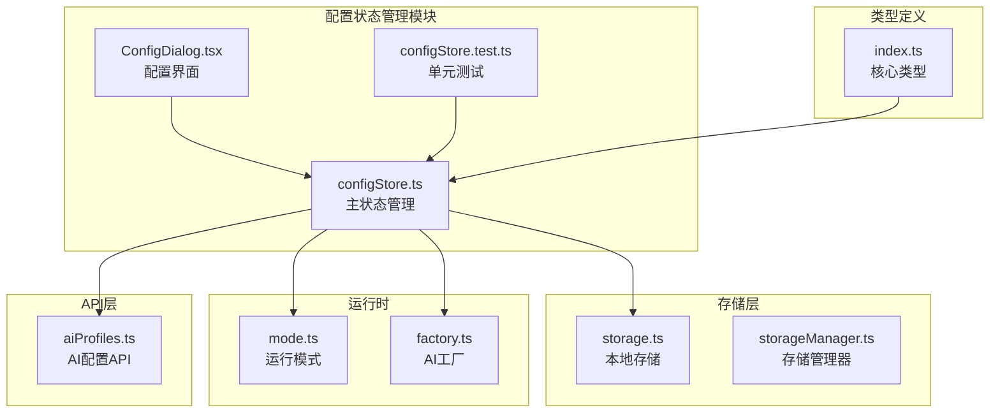

**图表来源**

- [apps/web/src/stores/configStore.ts](file://apps/web/src/stores/configStore.ts#L1-L822)
- [apps/web/src/stores/configStore.test.ts](file://apps/web/src/stores/configStore.test.ts#L1-L301)
- [apps/web/src/types/index.ts](file://apps/web/src/types/index.ts#L640-L710)

**章节来源**

- [apps/web/src/stores/configStore.ts](file://apps/web/src/stores/configStore.ts#L1-L822)
- [apps/web/src/stores/configStore.test.ts](file://apps/web/src/stores/configStore.test.ts#L1-L301)

## 核心组件

### 配置状态接口定义

配置状态管理模块的核心接口定义如下：

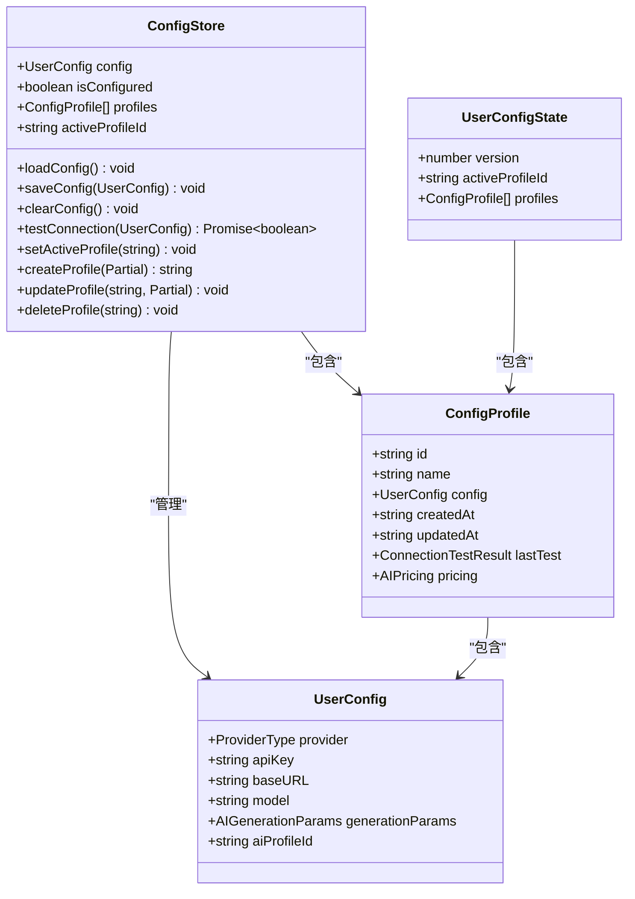

**图表来源**

- [apps/web/src/stores/configStore.ts](file://apps/web/src/stores/configStore.ts#L20-L40)
- [apps/web/src/types/index.ts](file://apps/web/src/types/index.ts#L646-L710)

### 配置状态流转

配置状态在不同模式下的流转过程：

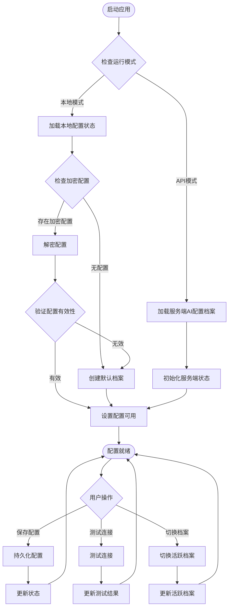

**图表来源**

- [apps/web/src/stores/configStore.ts](file://apps/web/src/stores/configStore.ts#L183-L287)
- [apps/web/src/lib/runtime/mode.ts](file://apps/web/src/lib/runtime/mode.ts#L8-L21)

**章节来源**

- [apps/web/src/stores/configStore.ts](file://apps/web/src/stores/configStore.ts#L183-L287)
- [apps/web/src/types/index.ts](file://apps/web/src/types/index.ts#L646-L710)

## 架构概览

配置状态管理模块采用分层架构设计，各层职责明确：

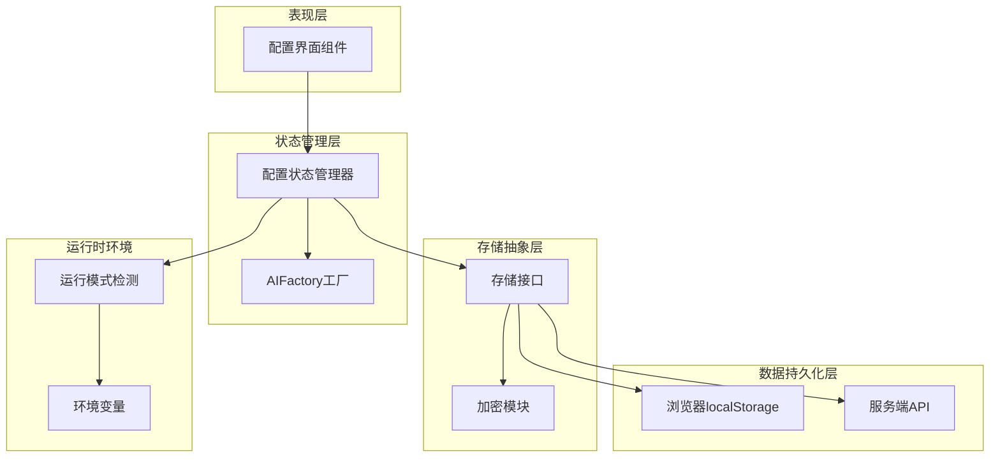

**图表来源**

- [apps/web/src/stores/configStore.ts](file://apps/web/src/stores/configStore.ts#L1-L12)
- [apps/web/src/lib/storage.ts](file://apps/web/src/lib/storage.ts#L1-L10)
- [apps/web/src/lib/runtime/mode.ts](file://apps/web/src/lib/runtime/mode.ts#L1-L30)

### 核心设计理念

1. **双模式支持**：模块支持本地模式和API模式，通过运行时检测动态切换
2. **响应式更新**：基于Zustand的状态管理，提供实时的状态更新和组件响应
3. **安全性优先**：在API模式下不存储敏感信息，确保用户数据安全
4. **可扩展性**：模块化设计，易于添加新的AI供应商和配置选项

## 详细组件分析

### 配置状态管理器

配置状态管理器是整个模块的核心，负责管理用户的所有AI配置信息：

#### 主要功能特性

| 功能类别 | 方法名称             | 描述                     |
| -------- | -------------------- | ------------------------ |
| 配置加载 | `loadConfig()`       | 根据运行模式加载配置状态 |
| 配置保存 | `saveConfig()`       | 保存用户配置到存储层     |
| 配置清理 | `clearConfig()`      | 清空所有配置信息         |
| 连接测试 | `testConnection()`   | 测试AI服务连接有效性     |
| 档案管理 | `setActiveProfile()` | 切换活跃配置档案         |
| 档案创建 | `createProfile()`    | 创建新的配置档案         |
| 档案更新 | `updateProfile()`    | 更新现有配置档案         |
| 档案删除 | `deleteProfile()`    | 删除配置档案             |

#### 配置状态结构

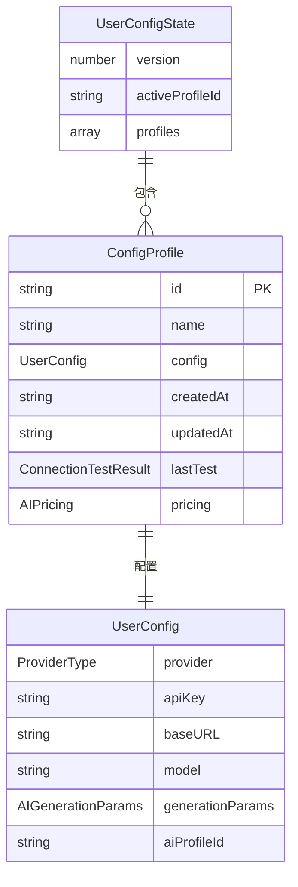

**图表来源**

- [apps/web/src/types/index.ts](file://apps/web/src/types/index.ts#L706-L710)
- [apps/web/src/types/index.ts](file://apps/web/src/types/index.ts#L696-L704)
- [apps/web/src/types/index.ts](file://apps/web/src/types/index.ts#L646-L657)

#### 配置验证机制

配置验证在多个层面进行，确保配置的有效性和安全性：

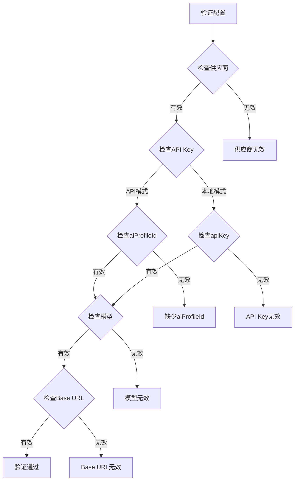

**图表来源**

- [apps/web/src/stores/configStore.ts](file://apps/web/src/stores/configStore.ts#L56-L66)
- [apps/web/src/stores/configStore.ts](file://apps/web/src/stores/configStore.ts#L72-L181)

**章节来源**

- [apps/web/src/stores/configStore.ts](file://apps/web/src/stores/configStore.ts#L183-L822)
- [apps/web/src/types/index.ts](file://apps/web/src/types/index.ts#L646-L710)

### 存储层设计

存储层采用分层设计，支持多种存储介质和加密机制：

#### 本地存储策略

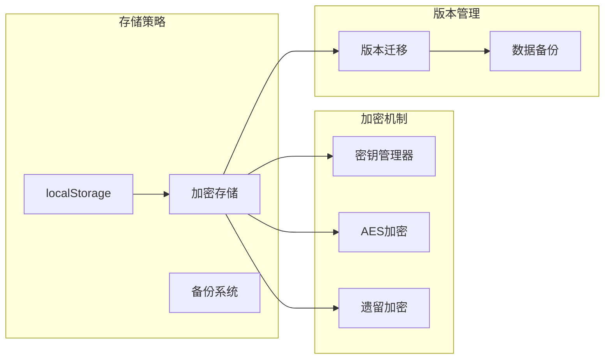

**图表来源**

- [apps/web/src/lib/storage.ts](file://apps/web/src/lib/storage.ts#L1-L10)
- [apps/web/src/lib/storage.ts](file://apps/web/src/lib/storage.ts#L119-L155)
- [apps/web/src/lib/storage.ts](file://apps/web/src/lib/storage.ts#L236-L250)

#### 存储键值管理

存储系统使用特定的键值来组织不同类型的数据：

| 键值前缀        | 数据类型   | 描述                     |
| --------------- | ---------- | ------------------------ |
| `aixs_version`  | 字符串     | 应用版本信息             |
| `aixs_projects` | JSON数组   | 项目数据                 |
| `aixs_scenes_`  | JSON数组   | 分镜数据（按项目ID分类） |
| `aixs_config`   | 加密字符串 | 配置状态数据             |

**章节来源**

- [apps/web/src/lib/storage.ts](file://apps/web/src/lib/storage.ts#L177-L182)
- [apps/web/src/lib/storage.ts](file://apps/web/src/lib/storage.ts#L696-L761)

### API集成层

API集成层负责与服务端进行通信，实现配置的云端同步：

#### AI配置档案API

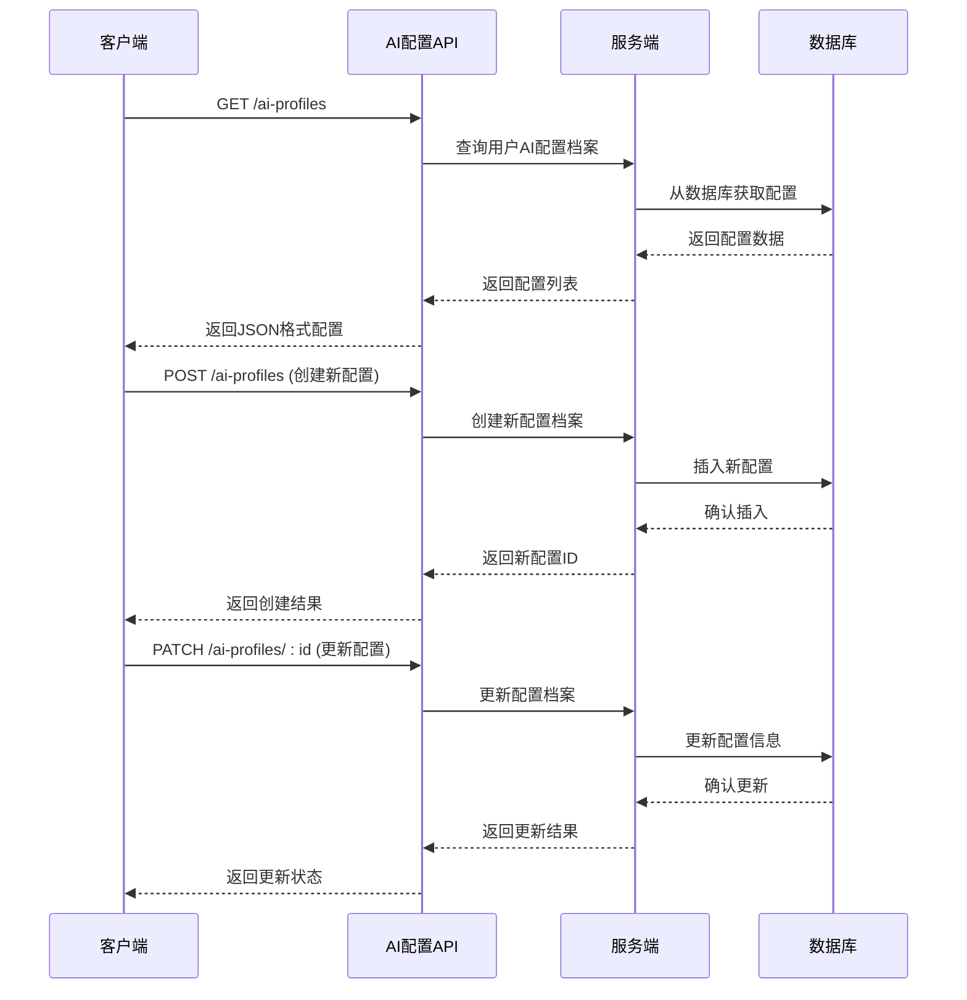

**图表来源**

- [apps/web/src/lib/api/aiProfiles.ts](file://apps/web/src/lib/api/aiProfiles.ts#L23-L62)

#### 运行模式检测

运行模式检测机制根据环境变量动态确定应用的运行模式：

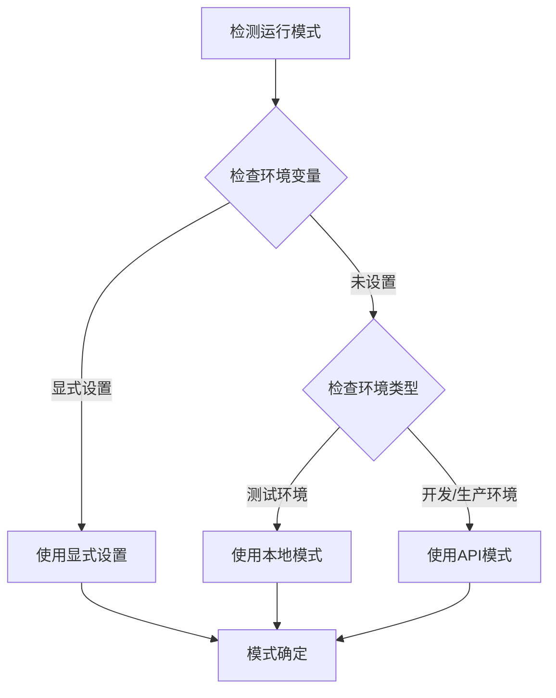

**图表来源**

- [apps/web/src/lib/runtime/mode.ts](file://apps/web/src/lib/runtime/mode.ts#L8-L21)

**章节来源**

- [apps/web/src/lib/api/aiProfiles.ts](file://apps/web/src/lib/api/aiProfiles.ts#L1-L63)
- [apps/web/src/lib/runtime/mode.ts](file://apps/web/src/lib/runtime/mode.ts#L1-L30)

### 用户界面集成

配置界面组件与状态管理器紧密集成，提供直观的配置管理体验：

#### 配置对话框组件

配置对话框组件提供了完整的配置管理界面，包括：

- **连接配置**：供应商选择、API Key输入、Base URL配置
- **生成参数**：温度、最大令牌数、惩罚系数等参数调整
- **用量统计**：显示24小时内的使用统计和费用估算
- **安全设置**：加密密码管理和配置锁定功能

#### 实时状态同步

配置界面通过React Hooks与状态管理器建立双向绑定：

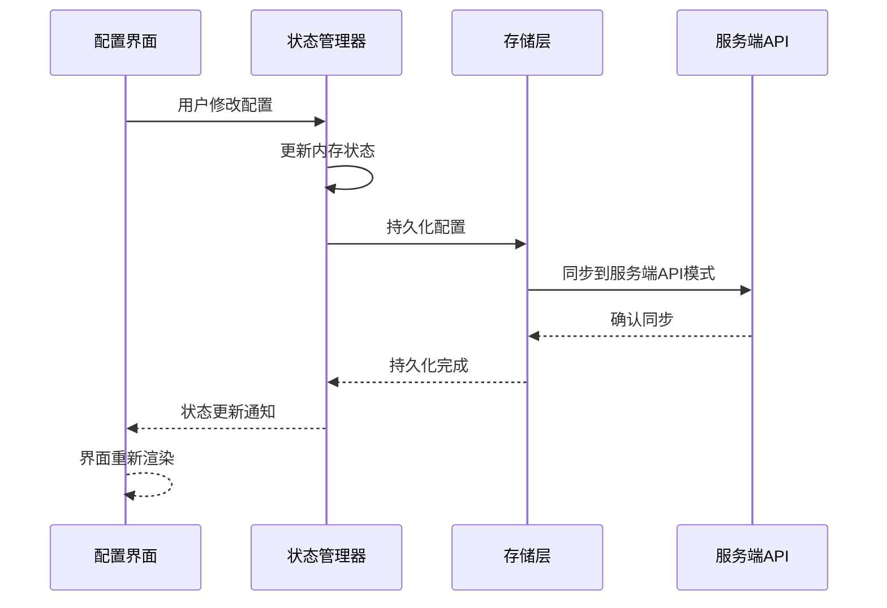

**图表来源**

- [apps/web/src/components/ConfigDialog.tsx](file://apps/web/src/components/ConfigDialog.tsx#L241-L252)

**章节来源**

- [apps/web/src/components/ConfigDialog.tsx](file://apps/web/src/components/ConfigDialog.tsx#L1-L1200)

## 依赖关系分析

配置状态管理模块的依赖关系复杂而有序，各组件之间的耦合度适中：

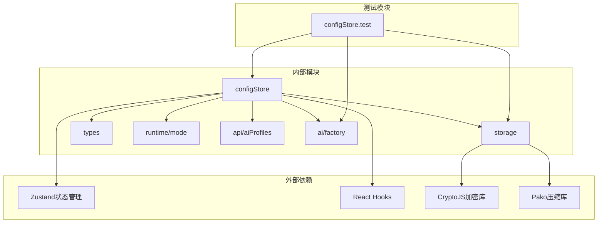

**图表来源**

- [apps/web/src/stores/configStore.ts](file://apps/web/src/stores/configStore.ts#L1-L11)
- [apps/web/src/lib/storage.ts](file://apps/web/src/lib/storage.ts#L1-L4)

### 关键依赖关系

1. **Zustand集成**：状态管理器基于Zustand实现，提供轻量级的状态管理解决方案
2. **加密依赖**：使用CryptoJS进行数据加密，确保配置信息的安全存储
3. **API通信**：通过自定义API模块与服务端进行配置同步
4. **类型安全**：完整的TypeScript类型定义确保编译时类型检查

**章节来源**

- [apps/web/src/stores/configStore.ts](file://apps/web/src/stores/configStore.ts#L1-L11)
- [apps/web/src/lib/storage.ts](file://apps/web/src/lib/storage.ts#L1-L4)

## 性能考虑

配置状态管理模块在设计时充分考虑了性能优化：

### 存储优化策略

1. **批量写入**：使用防抖和批量队列减少localStorage的写入次数
2. **数据压缩**：对大型数据进行压缩存储，节省存储空间
3. **分片存储**：突破localStorage大小限制，支持大数据存储
4. **增量更新**：只更新发生变化的部分，避免全量重写

### 状态更新优化

1. **局部更新**：使用Zustand的局部状态更新机制，避免不必要的重渲染
2. **记忆化计算**：对复杂的计算结果进行缓存
3. **异步处理**：后台持久化操作，不影响用户体验

### 内存管理

1. **垃圾回收**：及时释放不再使用的配置数据
2. **缓存策略**：合理设置缓存大小和过期时间
3. **内存监控**：定期检查内存使用情况

## 故障排除指南

### 常见问题及解决方案

#### 配置加载失败

**问题症状**：应用启动时配置加载失败，显示空配置状态

**可能原因**：

1. localStorage访问被阻止
2. 加密配置无法解密
3. 服务端API连接失败

**解决步骤**：

1. 检查浏览器的localStorage权限
2. 验证加密密钥是否正确
3. 确认网络连接和API可达性

#### 连接测试失败

**问题症状**：配置测试连接时返回失败

**诊断方法**：

1. 检查API Key格式和有效性
2. 验证Base URL配置正确性
3. 确认网络代理设置

**解决方案**：

1. 重新输入API Key，去除多余字符
2. 检查供应商的API文档
3. 联系供应商技术支持

#### 配置同步问题

**问题症状**：本地配置与服务端配置不一致

**排查步骤**：

1. 检查运行模式设置
2. 验证服务端同步状态
3. 查看同步日志

**解决方案**：

1. 手动触发配置同步
2. 清除本地缓存后重新加载
3. 检查服务端配置权限

**章节来源**

- [apps/web/src/stores/configStore.ts](file://apps/web/src/stores/configStore.ts#L343-L488)
- [apps/web/src/lib/storage.ts](file://apps/web/src/lib/storage.ts#L696-L755)

## 结论

AIXSSS项目的配置状态管理模块是一个设计精良、功能完备的状态管理解决方案。模块采用了现代化的架构设计，支持多种运行模式，具有良好的扩展性和维护性。

### 主要优势

1. **双模式支持**：灵活适应不同的部署需求
2. **安全性保障**：在API模式下保护敏感信息
3. **用户体验**：提供直观的配置管理界面
4. **性能优化**：采用多种优化策略确保高效运行
5. **类型安全**：完整的TypeScript类型定义

### 技术亮点

- 基于Zustand的轻量级状态管理
- 分层存储架构支持多种存储介质
- 完整的配置验证和错误处理机制
- 响应式的用户界面集成
- 可扩展的API集成架构

该模块为AIXSSS项目提供了坚实的配置管理基础，能够满足当前和未来的业务需求，是项目成功的关键基础设施之一。
