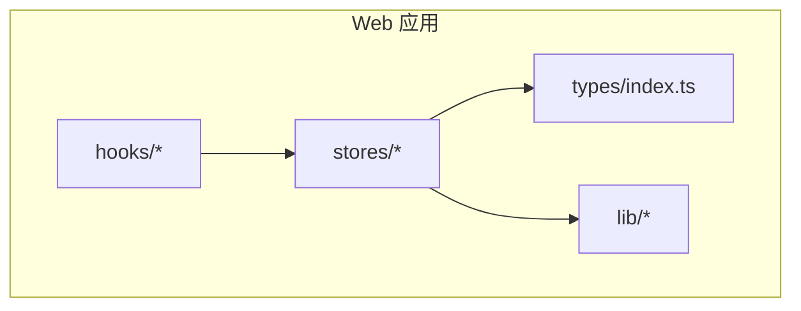
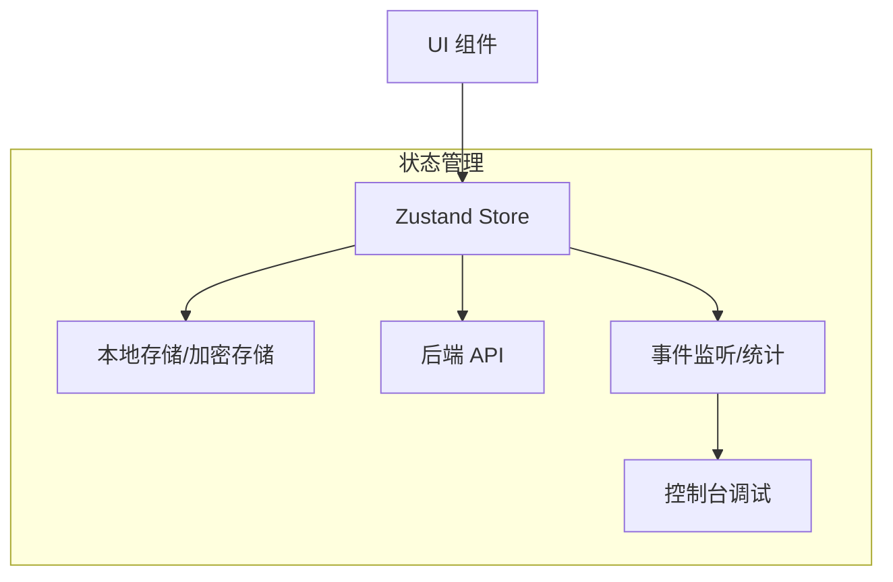
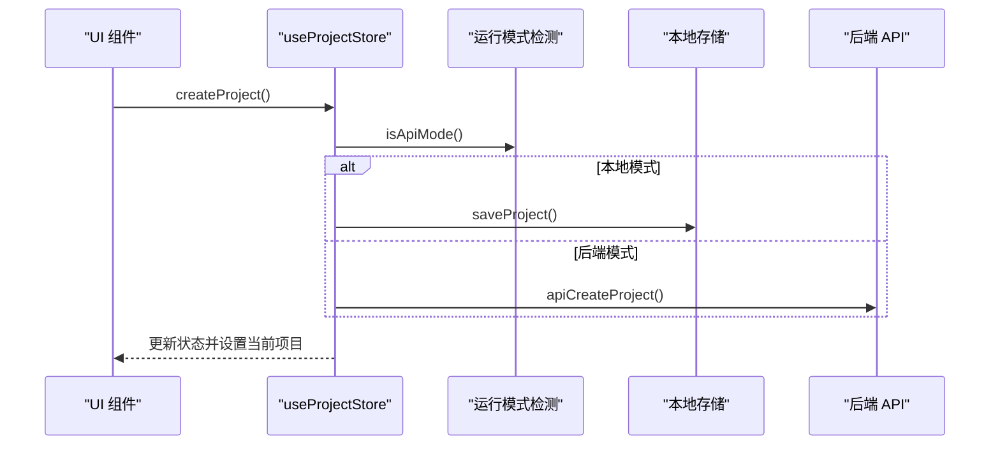
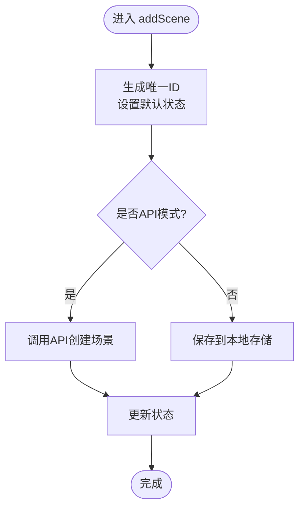
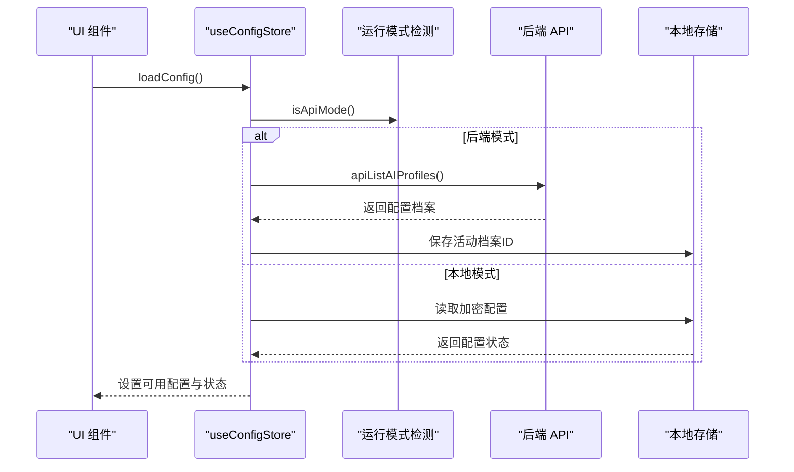
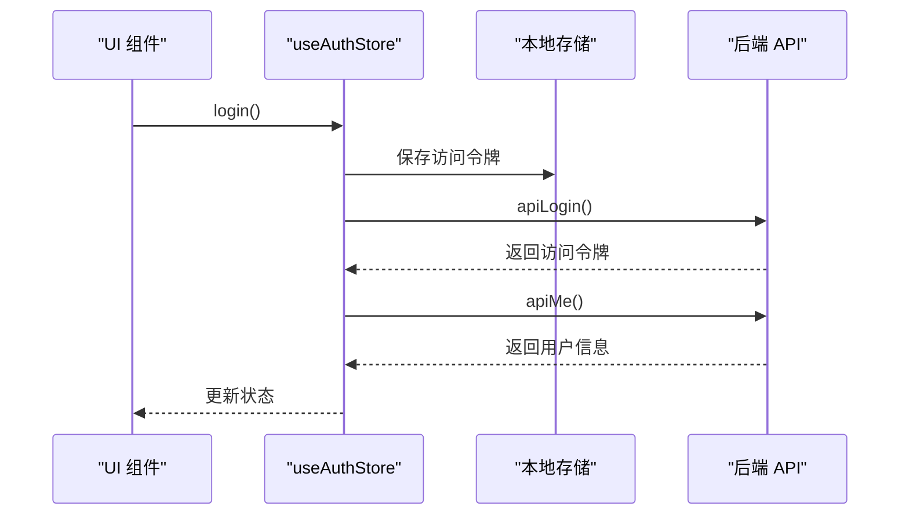
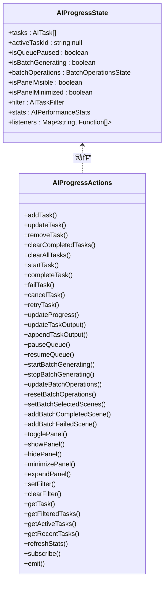
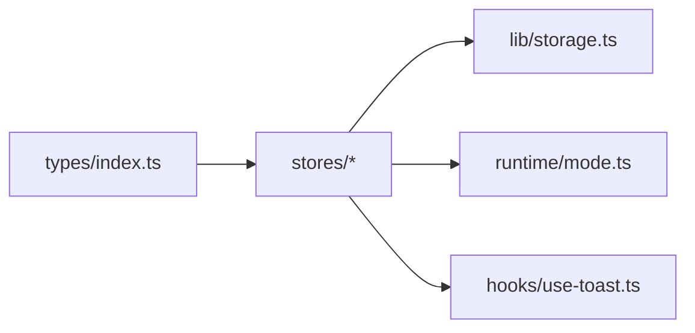

# Zustand Store架构

<cite>
**本文档引用的文件**
- [apps/web/src/stores/projectStore.ts](file://apps/web/src/stores/projectStore.ts)
- [apps/web/src/stores/storyboardStore.ts](file://apps/web/src/stores/storyboardStore.ts)
- [apps/web/src/stores/configStore.ts](file://apps/web/src/stores/configStore.ts)
- [apps/web/src/stores/authStore.ts](file://apps/web/src/stores/authStore.ts)
- [apps/web/src/stores/characterStore.ts](file://apps/web/src/stores/characterStore.ts)
- [apps/web/src/stores/worldViewStore.ts](file://apps/web/src/stores/worldViewStore.ts)
- [apps/web/src/stores/themeStore.ts](file://apps/web/src/stores/themeStore.ts)
- [apps/web/src/stores/aiProgressStore.ts](file://apps/web/src/stores/aiProgressStore.ts)
- [apps/web/src/stores/aiUsageStore.ts](file://apps/web/src/stores/aiUsageStore.ts)
- [apps/web/src/stores/searchStore.ts](file://apps/web/src/stores/searchStore.ts)
- [apps/web/src/lib/storage.ts](file://apps/web/src/lib/storage.ts)
- [apps/web/src/types/index.ts](file://apps/web/src/types/index.ts)
- [apps/web/src/hooks/use-toast.ts](file://apps/web/src/hooks/use-toast.ts)
- [apps/web/FEATURES.md](file://apps/web/FEATURES.md)
</cite>

## 目录

1. [简介](#简介)
2. [项目结构](#项目结构)
3. [核心组件](#核心组件)
4. [架构总览](#架构总览)
5. [详细组件分析](#详细组件分析)
6. [依赖关系分析](#依赖关系分析)
7. [性能考虑](#性能考虑)
8. [故障排除指南](#故障排除指南)
9. [结论](#结论)
10. [附录](#附录)

## 简介

本文件系统性梳理 AIXSSS 项目中基于 Zustand 的状态管理架构，重点阐述以下方面：

- Zustand 核心设计理念与 store 创建模式
- 状态持久化与运行时模式（本地/后端 API）的适配
- 中间件与调试工具集成（事件监听、性能统计、控制台调试）
- 状态选择器优化、订阅机制与性能监控
- store 组合模式、模块化设计与跨 store 通信策略
- 实际使用示例与常见问题解决方案

## 项目结构

Zustand store 位于 Web 应用的 stores 目录，采用按功能模块拆分的组织方式，每个 store 独立封装状态、动作与持久化逻辑，并通过统一的类型定义确保数据一致性。

**图表来源**

- [apps/web/src/stores/projectStore.ts](file://apps/web/src/stores/projectStore.ts#L1-L181)
- [apps/web/src/types/index.ts](file://apps/web/src/types/index.ts#L453-L618)
- [apps/web/src/lib/storage.ts](file://apps/web/src/lib/storage.ts#L1-L1015)

**章节来源**

- [apps/web/src/stores/projectStore.ts](file://apps/web/src/stores/projectStore.ts#L1-L181)
- [apps/web/src/stores/storyboardStore.ts](file://apps/web/src/stores/storyboardStore.ts#L1-L321)
- [apps/web/src/stores/configStore.ts](file://apps/web/src/stores/configStore.ts#L1-L822)
- [apps/web/src/stores/authStore.ts](file://apps/web/src/stores/authStore.ts#L1-L82)
- [apps/web/src/stores/characterStore.ts](file://apps/web/src/stores/characterStore.ts#L1-L346)
- [apps/web/src/stores/worldViewStore.ts](file://apps/web/src/stores/worldViewStore.ts#L1-L211)
- [apps/web/src/stores/themeStore.ts](file://apps/web/src/stores/themeStore.ts#L1-L57)
- [apps/web/src/stores/aiProgressStore.ts](file://apps/web/src/stores/aiProgressStore.ts#L1-L758)
- [apps/web/src/stores/aiUsageStore.ts](file://apps/web/src/stores/aiUsageStore.ts#L1-L217)
- [apps/web/src/stores/searchStore.ts](file://apps/web/src/stores/searchStore.ts#L1-L131)
- [apps/web/src/lib/storage.ts](file://apps/web/src/lib/storage.ts#L1-L1015)
- [apps/web/src/types/index.ts](file://apps/web/src/types/index.ts#L1-L1019)

## 核心组件

- 项目管理 store（项目列表、当前项目、工作流状态）
- 分镜故事板 store（分镜增删改、重排、生成状态）
- 配置 store（AI 供应商配置、多档案管理、连接测试）
- 认证 store（登录、注册、登出、令牌管理）
- 角色 store（角色增删改、外观记录、肖像提示词）
- 世界观 store（要素增删改、重排、上下文聚合）
- 主题 store（明暗主题切换、系统主题监听）
- AI 进度 store（任务队列、批量操作、事件监听、统计）
- AI 使用 store（调用事件记录、统计计算、成本估算）
- 搜索 store（查询、过滤、历史）

**章节来源**

- [apps/web/src/stores/projectStore.ts](file://apps/web/src/stores/projectStore.ts#L32-L44)
- [apps/web/src/stores/storyboardStore.ts](file://apps/web/src/stores/storyboardStore.ts#L17-L43)
- [apps/web/src/stores/configStore.ts](file://apps/web/src/stores/configStore.ts#L20-L40)
- [apps/web/src/stores/authStore.ts](file://apps/web/src/stores/authStore.ts#L7-L17)
- [apps/web/src/stores/characterStore.ts](file://apps/web/src/stores/characterStore.ts#L122-L145)
- [apps/web/src/stores/worldViewStore.ts](file://apps/web/src/stores/worldViewStore.ts#L25-L48)
- [apps/web/src/stores/themeStore.ts](file://apps/web/src/stores/themeStore.ts#L4-L11)
- [apps/web/src/stores/aiProgressStore.ts](file://apps/web/src/stores/aiProgressStore.ts#L120-L149)
- [apps/web/src/stores/aiUsageStore.ts](file://apps/web/src/stores/aiUsageStore.ts#L186-L194)
- [apps/web/src/stores/searchStore.ts](file://apps/web/src/stores/searchStore.ts#L10-L28)

## 架构总览

Zustand store 采用 create 函数创建，内部通过 set/get 访问状态与动作，结合本地存储与 API 两种持久化路径，实现离线可用与云端同步的统一体验。AI 进度与使用 store 提供事件驱动的可观测性与性能监控。

**图表来源**

- [apps/web/src/stores/projectStore.ts](file://apps/web/src/stores/projectStore.ts#L46-L180)
- [apps/web/src/stores/storyboardStore.ts](file://apps/web/src/stores/storyboardStore.ts#L45-L321)
- [apps/web/src/stores/configStore.ts](file://apps/web/src/stores/configStore.ts#L183-L822)
- [apps/web/src/lib/storage.ts](file://apps/web/src/lib/storage.ts#L1-L1015)
- [apps/web/src/stores/aiProgressStore.ts](file://apps/web/src/stores/aiProgressStore.ts#L249-L677)

**章节来源**

- [apps/web/FEATURES.md](file://apps/web/FEATURES.md#L582-L594)

## 详细组件分析

### 项目管理 store（ProjectStore）

- 设计理念：围绕 Project 实体构建 CRUD 与工作流状态管理，支持本地与 API 两种模式的无缝切换。
- 生命周期管理：初始化时根据运行模式加载/创建数据，更新时自动持久化。
- 中间件与调试：通过 isApiMode 切换持久化路径，错误时记录日志并回退。
- 性能优化：批量保存项目、防抖合并更新，减少 localStorage 写入频率。

**图表来源**

- [apps/web/src/stores/projectStore.ts](file://apps/web/src/stores/projectStore.ts#L108-L134)
- [apps/web/src/stores/projectStore.ts](file://apps/web/src/stores/projectStore.ts#L136-L161)
- [apps/web/src/stores/projectStore.ts](file://apps/web/src/stores/projectStore.ts#L163-L175)

**章节来源**

- [apps/web/src/stores/projectStore.ts](file://apps/web/src/stores/projectStore.ts#L18-L30)
- [apps/web/src/stores/projectStore.ts](file://apps/web/src/stores/projectStore.ts#L46-L81)
- [apps/web/src/stores/projectStore.ts](file://apps/web/src/stores/projectStore.ts#L83-L106)
- [apps/web/src/stores/projectStore.ts](file://apps/web/src/stores/projectStore.ts#L108-L180)

### 分镜故事板 store（StoryboardStore）

- 设计理念：围绕 Scene 实体构建增删改、重排与生成状态管理，支持批量操作与上下文摘要的细粒度控制。
- 生命周期管理：加载时根据上下文摘要提取 skipSteps 与 manualOverrides，保持 UI 与数据一致。
- 中间件与调试：提供 setSceneSkipSteps 与 setSceneManualOverrides 动作，自动更新上下文摘要并持久化。
- 性能优化：批量保存场景、场景补丁队列（防抖/合并）减少写入次数。

**图表来源**

- [apps/web/src/stores/storyboardStore.ts](file://apps/web/src/stores/storyboardStore.ts#L188-L208)
- [apps/web/src/stores/storyboardStore.ts](file://apps/web/src/stores/storyboardStore.ts#L210-L238)
- [apps/web/src/stores/storyboardStore.ts](file://apps/web/src/stores/storyboardStore.ts#L240-L275)

**章节来源**

- [apps/web/src/stores/storyboardStore.ts](file://apps/web/src/stores/storyboardStore.ts#L17-L43)
- [apps/web/src/stores/storyboardStore.ts](file://apps/web/src/stores/storyboardStore.ts#L45-L154)
- [apps/web/src/stores/storyboardStore.ts](file://apps/web/src/stores/storyboardStore.ts#L156-L186)
- [apps/web/src/stores/storyboardStore.ts](file://apps/web/src/stores/storyboardStore.ts#L188-L321)

### 配置 store（ConfigStore）

- 设计理念：围绕 UserConfig 与 ConfigProfile 构建多档案管理，支持本地与后端 API 两种模式下的配置同步与连接测试。
- 生命周期管理：加载时根据 isApiMode 选择从服务端拉取或本地读取，激活档案变更时更新可用配置。
- 中间件与调试：提供 testConnection 动作，支持在线测试与错误诊断，生成详细的建议信息。
- 性能优化：本地模式下使用加密存储，后端模式下避免在浏览器保存敏感信息。

**图表来源**

- [apps/web/src/stores/configStore.ts](file://apps/web/src/stores/configStore.ts#L189-L287)
- [apps/web/src/stores/configStore.ts](file://apps/web/src/stores/configStore.ts#L289-L341)
- [apps/web/src/stores/configStore.ts](file://apps/web/src/stores/configStore.ts#L343-L488)

**章节来源**

- [apps/web/src/stores/configStore.ts](file://apps/web/src/stores/configStore.ts#L20-L40)
- [apps/web/src/stores/configStore.ts](file://apps/web/src/stores/configStore.ts#L183-L287)
- [apps/web/src/stores/configStore.ts](file://apps/web/src/stores/configStore.ts#L289-L341)
- [apps/web/src/stores/configStore.ts](file://apps/web/src/stores/configStore.ts#L343-L488)

### 认证 store（AuthStore）

- 设计理念：围绕认证令牌与用户信息管理，提供登录、注册、登出与令牌持久化。
- 生命周期管理：启动时从本地存储加载令牌并验证有效性，登录后更新令牌与用户信息。
- 中间件与调试：通过 setApiAccessToken 注入请求头，错误时清理无效令牌。

**图表来源**

- [apps/web/src/stores/authStore.ts](file://apps/web/src/stores/authStore.ts#L46-L74)

**章节来源**

- [apps/web/src/stores/authStore.ts](file://apps/web/src/stores/authStore.ts#L7-L17)
- [apps/web/src/stores/authStore.ts](file://apps/web/src/stores/authStore.ts#L19-L81)

### 角色 store（CharacterStore）

- 设计理念：围绕 Character 实体构建增删改与外观记录，支持本地存储与 API 同步。
- 生命周期管理：加载时进行数据归一化，更新时自动保存并同步到后端。
- 性能优化：本地模式下直接保存到 localStorage，API 模式下异步同步。

**章节来源**

- [apps/web/src/stores/characterStore.ts](file://apps/web/src/stores/characterStore.ts#L122-L145)
- [apps/web/src/stores/characterStore.ts](file://apps/web/src/stores/characterStore.ts#L147-L179)
- [apps/web/src/stores/characterStore.ts](file://apps/web/src/stores/characterStore.ts#L181-L255)

### 世界观 store（WorldViewStore）

- 设计理念：围绕 WorldViewElement 实体构建增删改、重排与上下文聚合，支持按类型分组与检索。
- 生命周期管理：加载时根据类型分组生成上下文字符串，用于 AI 注入。
- 性能优化：本地模式下直接保存到 localStorage，API 模式下异步同步。

**章节来源**

- [apps/web/src/stores/worldViewStore.ts](file://apps/web/src/stores/worldViewStore.ts#L25-L48)
- [apps/web/src/stores/worldViewStore.ts](file://apps/web/src/stores/worldViewStore.ts#L50-L77)
- [apps/web/src/stores/worldViewStore.ts](file://apps/web/src/stores/worldViewStore.ts#L79-L127)
- [apps/web/src/stores/worldViewStore.ts](file://apps/web/src/stores/worldViewStore.ts#L157-L201)

### 主题 store（ThemeStore）

- 设计理念：围绕主题模式管理，支持系统主题监听与手动切换。
- 生命周期管理：初始化时从本地存储读取主题偏好，应用到 DOM。

**章节来源**

- [apps/web/src/stores/themeStore.ts](file://apps/web/src/stores/themeStore.ts#L4-L11)
- [apps/web/src/stores/themeStore.ts](file://apps/web/src/stores/themeStore.ts#L13-L34)
- [apps/web/src/stores/themeStore.ts](file://apps/web/src/stores/themeStore.ts#L36-L56)

### AI 进度 store（AIProgressStore）

- 设计理念：围绕 AITask 与批量操作构建任务队列、进度跟踪与事件驱动的可观测性。
- 生命周期管理：任务状态机（排队/执行/完成/失败/取消），支持重试与统计刷新。
- 中间件与调试：事件订阅/发射机制，控制台暴露便捷调试接口。

**图表来源**

- [apps/web/src/stores/aiProgressStore.ts](file://apps/web/src/stores/aiProgressStore.ts#L120-L211)
- [apps/web/src/stores/aiProgressStore.ts](file://apps/web/src/stores/aiProgressStore.ts#L249-L677)

**章节来源**

- [apps/web/src/stores/aiProgressStore.ts](file://apps/web/src/stores/aiProgressStore.ts#L120-L149)
- [apps/web/src/stores/aiProgressStore.ts](file://apps/web/src/stores/aiProgressStore.ts#L249-L320)
- [apps/web/src/stores/aiProgressStore.ts](file://apps/web/src/stores/aiProgressStore.ts#L342-L433)
- [apps/web/src/stores/aiProgressStore.ts](file://apps/web/src/stores/aiProgressStore.ts#L457-L493)
- [apps/web/src/stores/aiProgressStore.ts](file://apps/web/src/stores/aiProgressStore.ts#L648-L677)

### AI 使用 store（AIUsageStore）

- 设计理念：围绕 AIUsageEvent 构建调用事件记录、统计计算与成本估算。
- 生命周期管理：事件上限保护与本地存储持久化，支持过滤与统计刷新。
- 性能优化：事件截断与写入失败回退策略。

**章节来源**

- [apps/web/src/stores/aiUsageStore.ts](file://apps/web/src/stores/aiUsageStore.ts#L186-L194)
- [apps/web/src/stores/aiUsageStore.ts](file://apps/web/src/stores/aiUsageStore.ts#L196-L216)

### 搜索 store（SearchStore）

- 设计理念：围绕查询与过滤构建搜索结果管理，支持历史记录与去重。
- 生命周期管理：搜索时根据查询与过滤条件匹配项目与分镜，更新结果状态。

**章节来源**

- [apps/web/src/stores/searchStore.ts](file://apps/web/src/stores/searchStore.ts#L10-L28)
- [apps/web/src/stores/searchStore.ts](file://apps/web/src/stores/searchStore.ts#L30-L98)
- [apps/web/src/stores/searchStore.ts](file://apps/web/src/stores/searchStore.ts#L100-L131)

## 依赖关系分析

- 类型依赖：所有 store 依赖 types/index.ts 中的类型定义，确保数据结构一致性。
- 存储依赖：store 通过 lib/storage.ts 进行本地持久化，支持加密与批量队列优化。
- 运行时模式：isApiMode 控制 store 在本地与 API 之间的行为差异。
- 事件与通知：use-toast 提供全局通知能力，与 store 的状态变化配合使用。

**图表来源**

- [apps/web/src/types/index.ts](file://apps/web/src/types/index.ts#L453-L618)
- [apps/web/src/stores/projectStore.ts](file://apps/web/src/stores/projectStore.ts#L1-L17)
- [apps/web/src/lib/storage.ts](file://apps/web/src/lib/storage.ts#L1-L1015)
- [apps/web/src/hooks/use-toast.ts](file://apps/web/src/hooks/use-toast.ts#L1-L190)

**章节来源**

- [apps/web/src/types/index.ts](file://apps/web/src/types/index.ts#L1-L1019)
- [apps/web/src/lib/storage.ts](file://apps/web/src/lib/storage.ts#L1-L1015)
- [apps/web/src/hooks/use-toast.ts](file://apps/web/src/hooks/use-toast.ts#L1-L190)

## 性能考虑

- 批量与防抖：storage.ts 提供批量队列与防抖机制，显著降低 localStorage 写入频率与竞争冲突。
- 事件上限与截断：AI 使用 store 对事件数量进行限制，避免本地存储膨胀。
- 状态选择器优化：store 内部通过局部状态更新与最小化重渲染，结合 React.memo 与 selector 模式进一步优化。
- 订阅与事件：AI 进度 store 的事件订阅机制允许组件按需订阅特定事件，减少全局监听带来的性能开销。

**章节来源**

- [apps/web/src/lib/storage.ts](file://apps/web/src/lib/storage.ts#L16-L113)
- [apps/web/src/stores/aiUsageStore.ts](file://apps/web/src/stores/aiUsageStore.ts#L5-L7)
- [apps/web/src/stores/aiProgressStore.ts](file://apps/web/src/stores/aiProgressStore.ts#L648-L677)

## 故障排除指南

- 令牌失效：认证 store 在加载用户信息失败时会清理本地令牌并重置状态，需重新登录。
- API 模式配置：配置 store 在后端模式下不保存 apiKey，需确保服务端已绑定有效档案。
- 本地存储异常：storage.ts 提供写入失败回退策略与备份/恢复机制，必要时可手动清理或恢复。
- 事件监听错误：AI 进度 store 的事件发射包含错误捕获，避免单个监听器异常影响整体流程。

**章节来源**

- [apps/web/src/stores/authStore.ts](file://apps/web/src/stores/authStore.ts#L25-L44)
- [apps/web/src/stores/configStore.ts](file://apps/web/src/stores/configStore.ts#L190-L235)
- [apps/web/src/lib/storage.ts](file://apps/web/src/lib/storage.ts#L287-L443)
- [apps/web/src/stores/aiProgressStore.ts](file://apps/web/src/stores/aiProgressStore.ts#L666-L676)

## 结论

AIXSSS 项目的 Zustand 状态管理架构通过模块化 store、统一类型系统与运行时模式适配，实现了本地与云端的协同工作。借助事件驱动的可观测性与性能优化策略，系统在复杂业务场景下仍能保持良好的可维护性与用户体验。建议在后续迭代中持续完善状态选择器与订阅机制，进一步降低不必要的渲染与监听开销。

## 附录

- 实际使用示例（路径指引）
  - 创建项目：[apps/web/src/stores/projectStore.ts](file://apps/web/src/stores/projectStore.ts#L108-L134)
  - 添加分镜：[apps/web/src/stores/storyboardStore.ts](file://apps/web/src/stores/storyboardStore.ts#L188-L208)
  - 更新配置：[apps/web/src/stores/configStore.ts](file://apps/web/src/stores/configStore.ts#L289-L341)
  - 登录认证：[apps/web/src/stores/authStore.ts](file://apps/web/src/stores/authStore.ts#L46-L74)
  - 记录角色外观：[apps/web/src/stores/characterStore.ts](file://apps/web/src/stores/characterStore.ts#L261-L303)
  - 生成世界观上下文：[apps/web/src/stores/worldViewStore.ts](file://apps/web/src/stores/worldViewStore.ts#L174-L201)
  - 切换主题：[apps/web/src/stores/themeStore.ts](file://apps/web/src/stores/themeStore.ts#L16-L26)
  - 订阅 AI 任务事件：[apps/web/src/stores/aiProgressStore.ts](file://apps/web/src/stores/aiProgressStore.ts#L648-L676)
  - 记录 AI 使用事件：[apps/web/src/stores/aiUsageStore.ts](file://apps/web/src/stores/aiUsageStore.ts#L199-L204)
  - 执行搜索：[apps/web/src/stores/searchStore.ts](file://apps/web/src/stores/searchStore.ts#L52-L98)
