# AI使用状态管理 (aiUsageStore)

<cite>
**本文档引用的文件**
- [apps/web/src/stores/aiUsageStore.ts](file://apps/web/src/stores/aiUsageStore.ts)
- [apps/web/src/types/index.ts](file://apps/web/src/types/index.ts)
- [apps/web/src/lib/ai/debugLogger.ts](file://apps/web/src/lib/ai/debugLogger.ts)
- [apps/web/src/components/editor/StatisticsPanel.tsx](file://apps/web/src/components/editor/StatisticsPanel.tsx)
</cite>

## 目录

1. [简介](#简介)
2. [项目结构](#项目结构)
3. [核心组件](#核心组件)
4. [架构概览](#架构概览)
5. [详细组件分析](#详细组件分析)
6. [依赖关系分析](#依赖关系分析)
7. [性能考虑](#性能考虑)
8. [故障排除指南](#故障排除指南)
9. [结论](#结论)

## 简介

AI使用状态管理模块是AIXSSS项目中的核心监控组件，负责跟踪和分析AI服务的使用情况。该模块提供了完整的AI资源使用统计、成本计算和限额管理功能，帮助开发者和用户了解AI服务的使用效率和成本控制。

该模块的核心价值在于：

- **实时监控**：跟踪所有AI调用的执行状态和性能指标
- **成本透明化**：提供精确的成本估算和历史成本分析
- **使用洞察**：通过统计分析发现使用模式和潜在问题
- **预算控制**：为成本控制和预算管理提供数据支撑

## 项目结构

AI使用状态管理模块主要分布在以下文件中：

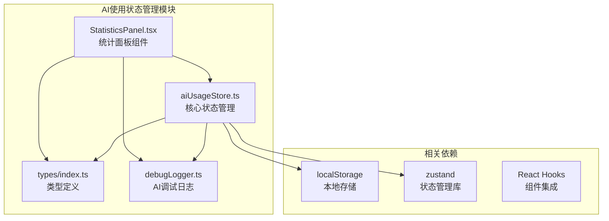

**图表来源**

- [apps/web/src/stores/aiUsageStore.ts](file://apps/web/src/stores/aiUsageStore.ts#L1-L217)
- [apps/web/src/types/index.ts](file://apps/web/src/types/index.ts#L640-L710)
- [apps/web/src/lib/ai/debugLogger.ts](file://apps/web/src/lib/ai/debugLogger.ts#L10-L32)

**章节来源**

- [apps/web/src/stores/aiUsageStore.ts](file://apps/web/src/stores/aiUsageStore.ts#L1-L217)
- [apps/web/src/types/index.ts](file://apps/web/src/types/index.ts#L640-L710)

## 核心组件

### AI使用事件模型

AI使用状态管理模块的核心数据结构基于统一的事件模型：

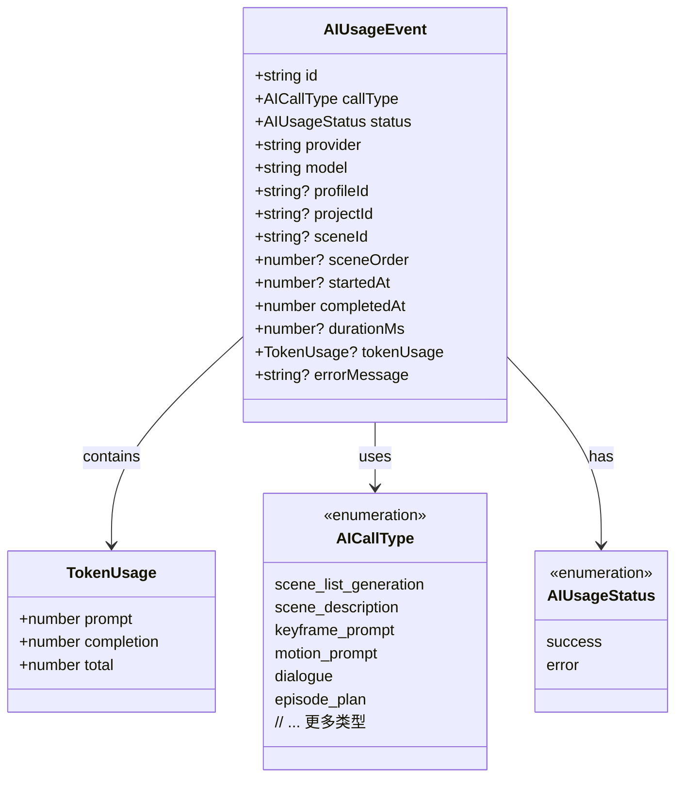

**图表来源**

- [apps/web/src/stores/aiUsageStore.ts](file://apps/web/src/stores/aiUsageStore.ts#L10-L34)
- [apps/web/src/lib/ai/debugLogger.ts](file://apps/web/src/lib/ai/debugLogger.ts#L10-L31)

### 统计指标体系

模块提供全面的统计指标来衡量AI使用情况：

| 指标类别      | 具体指标         | 描述                 | 计算方式                     |
| ------------- | ---------------- | -------------------- | ---------------------------- |
| **调用统计**  | totalCalls       | 总调用次数           | 事件总数                     |
|               | successCount     | 成功调用次数         | 状态为success的数量          |
|               | errorCount       | 失败调用次数         | 状态为error的数量            |
|               | successRate      | 成功率               | successCount/totalCalls×100% |
| **性能指标**  | avgDurationMs    | 平均耗时             | 所有耗时的算术平均值         |
|               | p95DurationMs    | P95耗时              | 排序后第95百分位耗时         |
| **Token统计** | promptTokens     | Prompt Token总量     | 所有prompt Token求和         |
|               | completionTokens | Completion Token总量 | 所有completion Token求和     |
|               | totalTokens      | Token总量            | 所有事件Token求和            |
|               | tokenizedCalls   | 有Token统计的调用数  | 包含tokenUsage的事件数       |

**章节来源**

- [apps/web/src/stores/aiUsageStore.ts](file://apps/web/src/stores/aiUsageStore.ts#L36-L51)
- [apps/web/src/stores/aiUsageStore.ts](file://apps/web/src/stores/aiUsageStore.ts#L140-L184)

## 架构概览

AI使用状态管理模块采用分层架构设计，确保了良好的可维护性和扩展性：

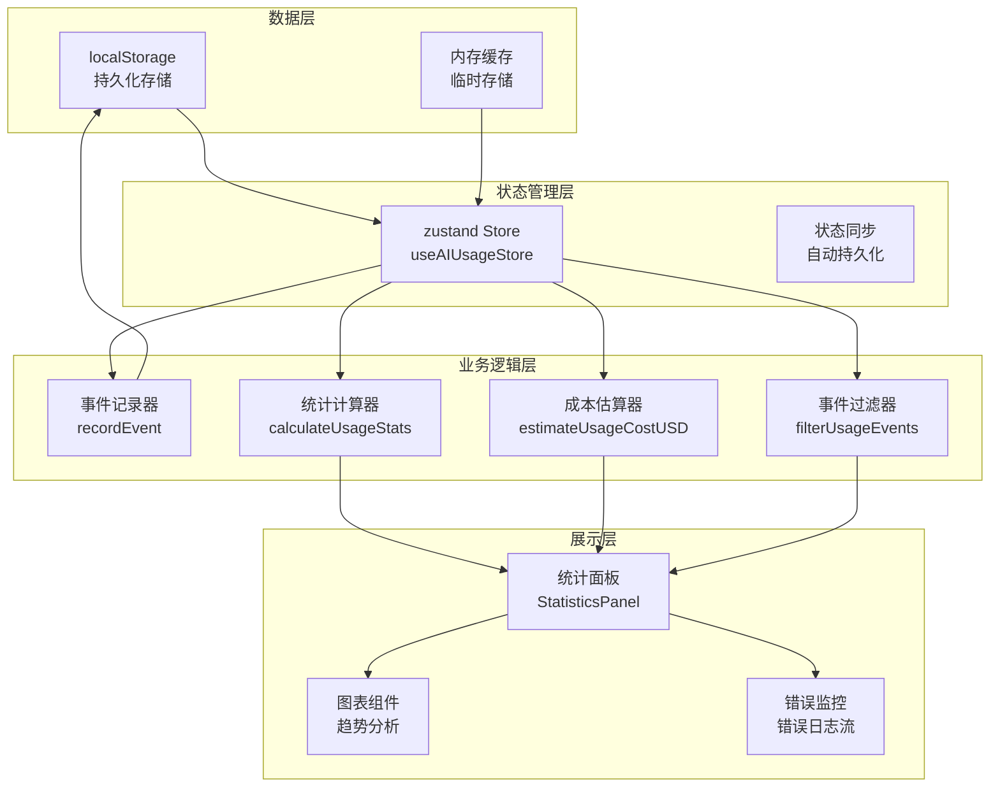

**图表来源**

- [apps/web/src/stores/aiUsageStore.ts](file://apps/web/src/stores/aiUsageStore.ts#L196-L216)
- [apps/web/src/components/editor/StatisticsPanel.tsx](file://apps/web/src/components/editor/StatisticsPanel.tsx#L331-L559)

### 数据流处理流程

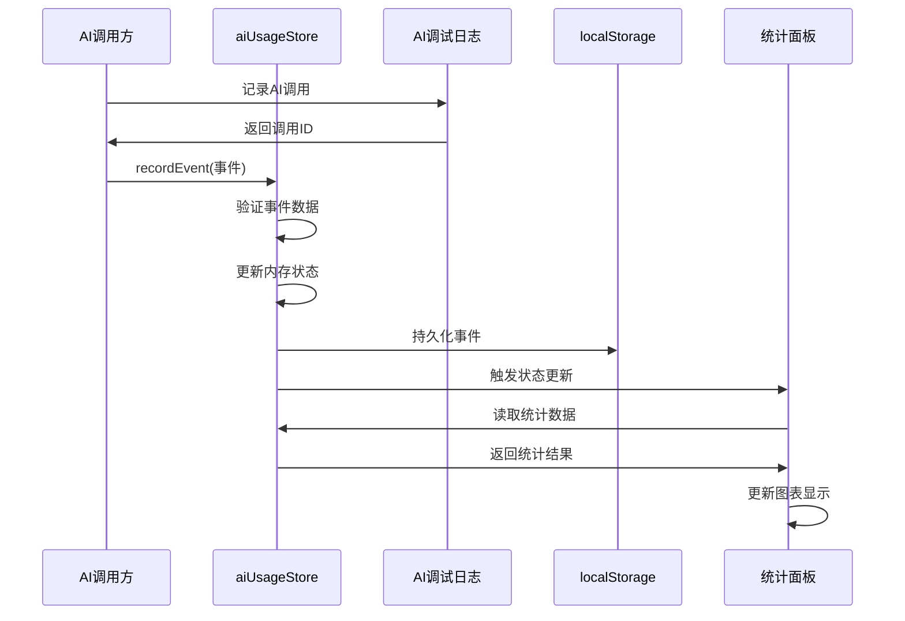

**图表来源**

- [apps/web/src/stores/aiUsageStore.ts](file://apps/web/src/stores/aiUsageStore.ts#L199-L204)
- [apps/web/src/lib/ai/debugLogger.ts](file://apps/web/src/lib/ai/debugLogger.ts#L310-L356)

## 详细组件分析

### 事件记录与存储机制

#### 事件持久化策略

模块采用智能的事件持久化策略，平衡了存储效率和数据完整性：

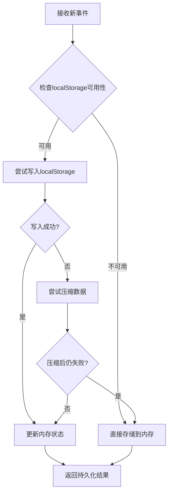

**图表来源**

- [apps/web/src/stores/aiUsageStore.ts](file://apps/web/src/stores/aiUsageStore.ts#L113-L129)

#### 存储容量管理

模块实现了严格的存储容量控制机制：

| 参数                           | 值                        | 用途                 |
| ------------------------------ | ------------------------- | -------------------- |
| STORAGE_KEY                    | 'aixs_ai_usage_events_v1' | 本地存储键名         |
| MAX_EVENTS                     | 2000                      | 最大事件数量限制     |
| DEFAULT_COST_PER_1K_TOKENS_USD | 0.002                     | 默认每千Token成本($) |

**章节来源**

- [apps/web/src/stores/aiUsageStore.ts](file://apps/web/src/stores/aiUsageStore.ts#L5-L6)
- [apps/web/src/stores/aiUsageStore.ts](file://apps/web/src/stores/aiUsageStore.ts#L59)

### 使用量统计算法

#### 统计指标计算逻辑

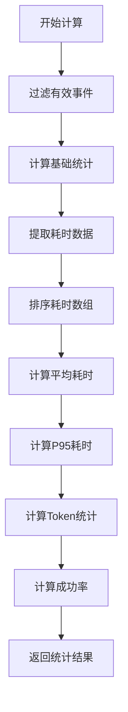

**图表来源**

- [apps/web/src/stores/aiUsageStore.ts](file://apps/web/src/stores/aiUsageStore.ts#L140-L184)

#### 性能指标分析

模块提供了多层次的性能分析能力：

| 指标          | 计算方法             | 用途             |
| ------------- | -------------------- | ---------------- |
| avgDurationMs | Σ耗时/n              | 衡量平均响应性能 |
| p95DurationMs | 排序后第95百分位     | 识别异常慢的请求 |
| successRate   | 成功调用/总调用×100% | 评估服务稳定性   |

**章节来源**

- [apps/web/src/stores/aiUsageStore.ts](file://apps/web/src/stores/aiUsageStore.ts#L145-L156)

### 成本计算逻辑

#### 多层次成本估算

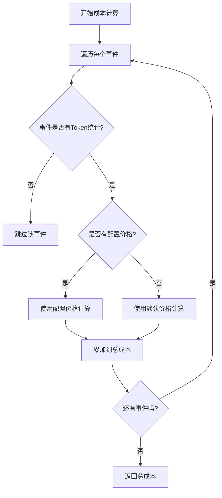

**图表来源**

- [apps/web/src/stores/aiUsageStore.ts](file://apps/web/src/stores/aiUsageStore.ts#L61-L95)

#### 成本计算公式

模块支持两种定价策略：

1. **配置定价**：基于AI配置档案中的具体价格
2. **默认定价**：使用统一的默认价格0.002美元/1000 Token

对于支持缓存的供应商，模块还考虑了缓存Token的特殊定价：

| 成本类型          | 计算公式                                | 说明                 |
| ----------------- | --------------------------------------- | -------------------- |
| Prompt成本        | uncachedPromptTokens/1000 × promptPer1K | 未缓存部分按标准价格 |
| Cached Prompt成本 | cachedPromptTokens/1000 × cachedPrice   | 缓存部分按缓存价格   |
| Completion成本    | completionTokens/1000 × completionPer1K | 输出部分成本         |

**章节来源**

- [apps/web/src/stores/aiUsageStore.ts](file://apps/web/src/stores/aiUsageStore.ts#L67-L92)
- [apps/web/src/types/index.ts](file://apps/web/src/types/index.ts#L677-L694)

### 预算控制机制

#### 预算预警系统

模块提供了智能化的预算预警功能：

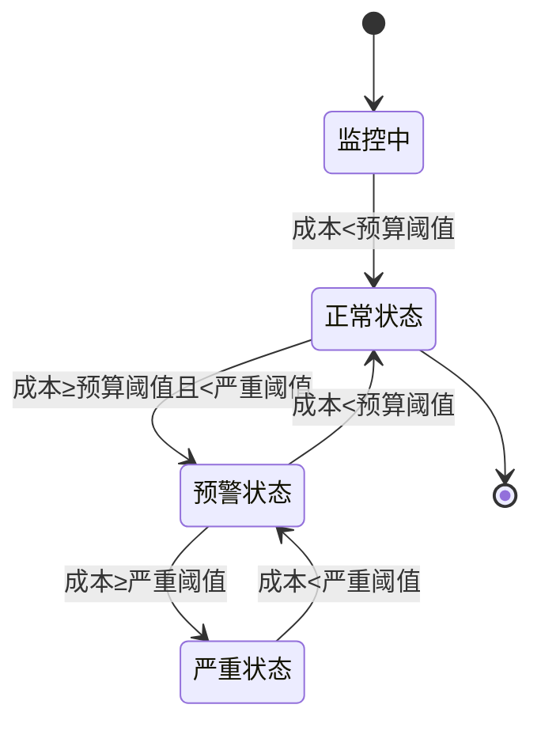

#### 预算阈值设置

| 阈值级别 | 预算比例 | 颜色标识 | 建议行动         |
| -------- | -------- | -------- | ---------------- |
| 正常     | < 80%    | 绿色     | 继续正常使用     |
| 预警     | 80%-90%  | 黄色     | 开始关注使用情况 |
| 严重     | > 90%    | 红色     | 立即采取措施     |

**章节来源**

- [apps/web/src/components/editor/StatisticsPanel.tsx](file://apps/web/src/components/editor/StatisticsPanel.tsx#L188-L225)

### 历史记录管理

#### 事件过滤与查询

模块提供了灵活的事件过滤机制：

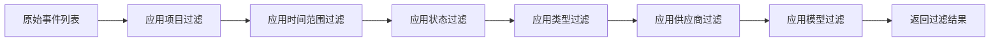

**图表来源**

- [apps/web/src/stores/aiUsageStore.ts](file://apps/web/src/stores/aiUsageStore.ts#L131-L138)

#### 时间范围分析

模块支持多种时间粒度的分析：

| 时间范围 | 粒度 | 适用场景 |
| -------- | ---- | -------- |
| 24小时   | 小时 | 实时监控 |
| 7天      | 天   | 周度分析 |
| 30天     | 天   | 月度趋势 |
| 全部     | 月   | 长期趋势 |

**章节来源**

- [apps/web/src/components/editor/StatisticsPanel.tsx](file://apps/web/src/components/editor/StatisticsPanel.tsx#L394-L400)

### 报表生成功能

#### 数据导出格式

模块支持将统计结果导出为JSON格式：

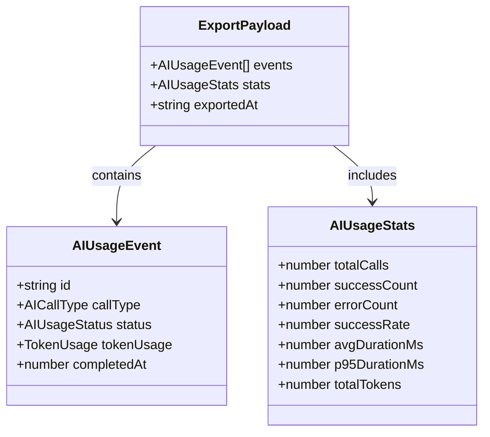

**图表来源**

- [apps/web/src/components/editor/StatisticsPanel.tsx](file://apps/web/src/components/editor/StatisticsPanel.tsx#L512-L518)

**章节来源**

- [apps/web/src/components/editor/StatisticsPanel.tsx](file://apps/web/src/components/editor/StatisticsPanel.tsx#L520-L530)

## 依赖关系分析

### 核心依赖关系

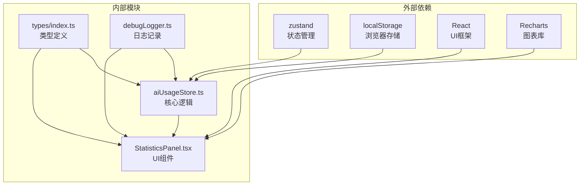

**图表来源**

- [apps/web/src/stores/aiUsageStore.ts](file://apps/web/src/stores/aiUsageStore.ts#L1-L3)
- [apps/web/src/components/editor/StatisticsPanel.tsx](file://apps/web/src/components/editor/StatisticsPanel.tsx#L1-L20)

### 类型系统依赖

模块的类型系统确保了数据的一致性和安全性：

```mermaid
erDiagram
AI_USAGE_EVENT {
string id PK
AICallType call_type
AIUsageStatus status
string provider
string model
string? profile_id
string? project_id
string? scene_id
number? scene_order
number? started_at
number completed_at
number? duration_ms
TokenUsage? token_usage
string? error_message
}
AIPRICE {
string currency
number prompt_per_1k
number completion_per_1k
number? cached_prompt_per_1k
}
AICALLTYPE {
string scene_list_generation
string scene_description
string keyframe_prompt
string motion_prompt
string dialogue
string episode_plan
string narrative_causal_chain
string episode_core_expression
string episode_scene_list
string character_basic_info
string character_portrait
string custom
}
AIUSAGESTATS {
number total_calls
number success_count
number error_count
number success_rate
number avg_duration_ms
number p95_duration_ms
number total_tokens
}
AI_USAGE_EVENT ||--|| AICALLTYPE : uses
AI_USAGE_EVENT ||--|| AIUSAGESTATS : generates
AI_USAGE_EVENT ||--|| AIPRICE : priced_by
```

**图表来源**

- [apps/web/src/stores/aiUsageStore.ts](file://apps/web/src/stores/aiUsageStore.ts#L10-L51)
- [apps/web/src/types/index.ts](file://apps/web/src/types/index.ts#L677-L694)

**章节来源**

- [apps/web/src/types/index.ts](file://apps/web/src/types/index.ts#L640-L710)

## 性能考虑

### 存储性能优化

模块采用了多项性能优化策略：

1. **内存限制**：最大存储2000个事件，防止内存溢出
2. **增量更新**：只更新必要的状态，避免全量重渲染
3. **懒加载**：统计数据按需计算，减少不必要的计算开销
4. **压缩存储**：在存储失败时自动压缩数据

### 计算性能优化

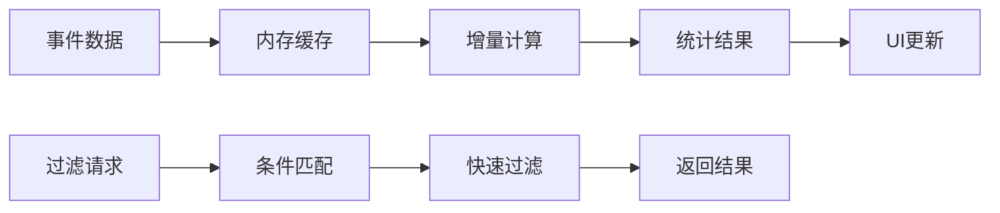

### 内存管理策略

模块实现了智能的内存管理：

| 策略     | 实现方式           | 效果         |
| -------- | ------------------ | ------------ |
| 事件截断 | 保持最新2000个事件 | 控制内存使用 |
| 数据压缩 | 存储失败时自动压缩 | 提高存储效率 |
| 按需计算 | 统计按需触发       | 减少CPU开销  |
| 缓存机制 | 频繁访问的数据缓存 | 提升响应速度 |

## 故障排除指南

### 常见问题诊断

#### 事件丢失问题

**症状**：统计数据不完整或事件突然消失

**可能原因**：

1. localStorage存储空间不足
2. 浏览器隐私模式限制
3. 浏览器缓存清理
4. 存储格式损坏

**解决方案**：

1. 检查localStorage使用情况
2. 清理不必要的数据
3. 禁用隐私模式
4. 重新初始化存储

#### 成本计算异常

**症状**：成本估算与实际不符

**可能原因**：

1. 配置价格缺失
2. Token统计不准确
3. 缓存Token计算错误
4. 默认价格设置不当

**解决方案**：

1. 检查AI配置档案
2. 验证Token统计准确性
3. 确认缓存支持状态
4. 调整默认价格设置

#### 性能问题

**症状**：界面响应缓慢或卡顿

**可能原因**：

1. 事件数量过多
2. 统计计算复杂度过高
3. 图表渲染压力大
4. 内存泄漏

**解决方案**：

1. 清理历史事件
2. 优化过滤条件
3. 减少图表数据量
4. 检查内存使用情况

**章节来源**

- [apps/web/src/stores/aiUsageStore.ts](file://apps/web/src/stores/aiUsageStore.ts#L97-L129)

### 调试工具使用

模块提供了丰富的调试工具：

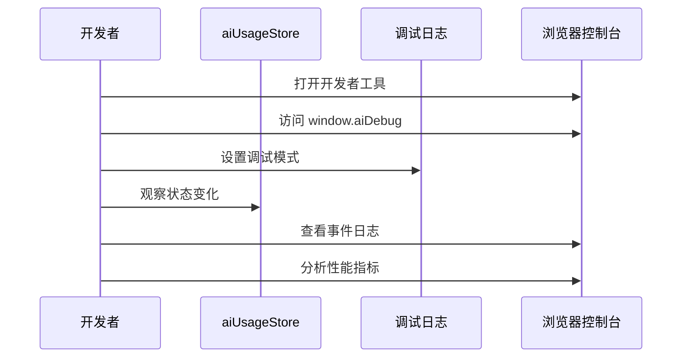

## 结论

AI使用状态管理模块为AIXSSS项目提供了全面的AI资源使用监控和管理能力。通过精心设计的架构和算法，该模块不仅能够准确跟踪AI服务的使用情况，还能提供有价值的洞察和预警功能。

### 主要优势

1. **全面的监控能力**：涵盖调用统计、性能指标、成本分析等多个维度
2. **智能的成本控制**：支持多种定价策略和预算预警机制
3. **高效的性能表现**：通过多项优化策略确保系统的流畅运行
4. **灵活的扩展性**：模块化的架构设计便于功能扩展和定制

### 应用场景

该模块适用于以下场景：

- **个人开发者**：监控个人项目的AI使用成本
- **小型团队**：跟踪团队项目的整体AI消耗
- **企业环境**：实施AI使用成本控制和预算管理
- **研究机构**：分析AI资源使用模式和优化机会

### 未来发展

建议在未来版本中增加以下功能：

1. **云端同步**：支持多设备间的数据同步
2. **高级分析**：提供更深入的使用模式分析
3. **自动化告警**：集成邮件或消息通知系统
4. **报告生成**：自动生成详细的使用报告

通过持续的优化和功能扩展，AI使用状态管理模块将成为AIXSSS项目中不可或缺的重要组成部分。
