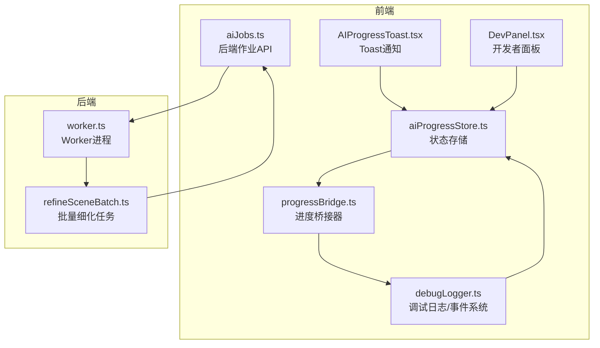
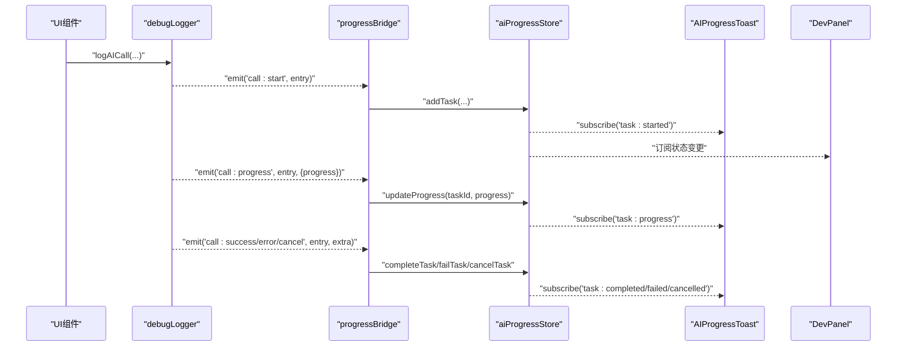
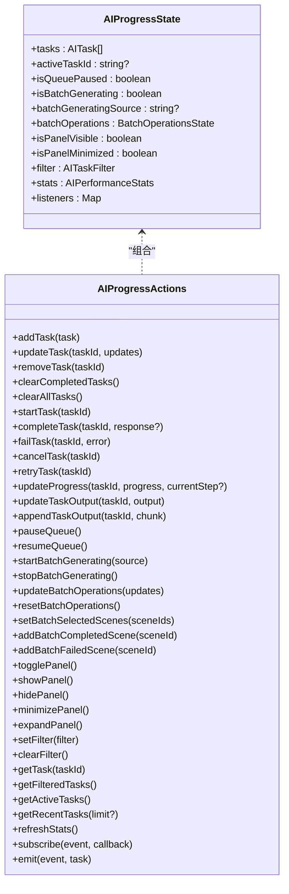
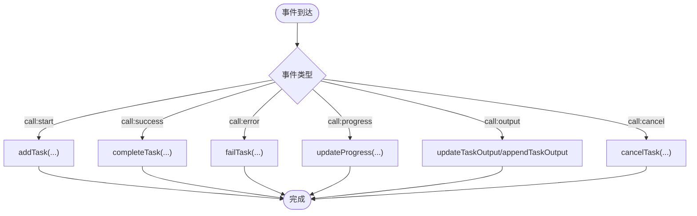

# AI进度状态管理 (aiProgressStore)

<cite>
**本文引用的文件**
- [aiProgressStore.ts](file://apps/web/src/stores/aiProgressStore.ts)
- [progressBridge.ts](file://apps/web/src/lib/ai/progressBridge.ts)
- [debugLogger.ts](file://apps/web/src/lib/ai/debugLogger.ts)
- [AIProgressToast.tsx](file://apps/web/src/components/AIProgressToast.tsx)
- [DevPanel.tsx](file://apps/web/src/components/DevPanel.tsx)
- [aiJobs.ts](file://apps/web/src/lib/api/aiJobs.ts)
- [worker.ts](file://apps/worker/src/worker.ts)
- [refineSceneBatch.ts](file://apps/worker/src/tasks/refineSceneBatch.ts)
- [storage.ts](file://apps/web/src/lib/storage.ts)
</cite>

## 目录

1. [简介](#简介)
2. [项目结构](#项目结构)
3. [核心组件](#核心组件)
4. [架构总览](#架构总览)
5. [详细组件分析](#详细组件分析)
6. [依赖关系分析](#依赖关系分析)
7. [性能考量](#性能考量)
8. [故障排查指南](#故障排查指南)
9. [结论](#结论)
10. [附录](#附录)

## 简介

本文件面向AIXSSS项目的AI进度状态管理模块，系统性阐述aiProgressStore的设计理念与实现细节，涵盖：

- AI任务进度追踪、状态更新机制与用户反馈
- 进度条显示逻辑、任务队列管理与实时状态同步
- 进度数据的缓存策略、错误处理与重试机制
- 进度监控示例、状态变更监听与用户体验优化方案

## 项目结构

围绕AI进度状态管理的相关代码主要分布在以下位置：

- 状态存储：apps/web/src/stores/aiProgressStore.ts
- 进度桥接器：apps/web/src/lib/ai/progressBridge.ts
- 调试日志与事件系统：apps/web/src/lib/ai/debugLogger.ts
- UI反馈组件：apps/web/src/components/AIProgressToast.tsx、apps/web/src/components/DevPanel.tsx
- 后端作业与进度轮询：apps/web/src/lib/api/aiJobs.ts、apps/worker/src/worker.ts、apps/worker/src/tasks/refineSceneBatch.ts
- 本地持久化与批处理：apps/web/src/lib/storage.ts



图表来源

- [aiProgressStore.ts](file://apps/web/src/stores/aiProgressStore.ts#L249-L677)
- [progressBridge.ts](file://apps/web/src/lib/ai/progressBridge.ts#L66-L182)
- [debugLogger.ts](file://apps/web/src/lib/ai/debugLogger.ts#L37-L77)
- [AIProgressToast.tsx](file://apps/web/src/components/AIProgressToast.tsx#L18-L159)
- [DevPanel.tsx](file://apps/web/src/components/DevPanel.tsx#L54-L101)
- [aiJobs.ts](file://apps/web/src/lib/api/aiJobs.ts#L57-L137)
- [worker.ts](file://apps/worker/src/worker.ts#L689-L733)
- [refineSceneBatch.ts](file://apps/worker/src/tasks/refineSceneBatch.ts#L122-L147)

章节来源

- [aiProgressStore.ts](file://apps/web/src/stores/aiProgressStore.ts#L1-L758)
- [progressBridge.ts](file://apps/web/src/lib/ai/progressBridge.ts#L1-L388)
- [debugLogger.ts](file://apps/web/src/lib/ai/debugLogger.ts#L1-L624)
- [AIProgressToast.tsx](file://apps/web/src/components/AIProgressToast.tsx#L1-L296)
- [DevPanel.tsx](file://apps/web/src/components/DevPanel.tsx#L1-L200)
- [aiJobs.ts](file://apps/web/src/lib/api/aiJobs.ts#L1-L137)
- [worker.ts](file://apps/worker/src/worker.ts#L689-L733)
- [refineSceneBatch.ts](file://apps/worker/src/tasks/refineSceneBatch.ts#L122-L147)

## 核心组件

- aiProgressStore：基于Zustand的状态存储，统一管理AI任务生命周期、进度、错误与性能统计；提供事件订阅/发射能力，支持UI组件实时联动。
- progressBridge：将debugLogger的事件桥接到aiProgressStore，实现从调用日志到UI进度的自动同步。
- debugLogger：提供AI调用事件（开始/成功/失败/进度/输出/取消）的发布订阅机制，支持导出日志与统计。
- UI反馈组件：AIProgressToast与DevPanel分别负责轻量Toast通知与全量开发者面板展示。
- 后端作业与Worker：通过API轮询与Worker任务实现后端进度上报与自动重试。

章节来源

- [aiProgressStore.ts](file://apps/web/src/stores/aiProgressStore.ts#L120-L211)
- [progressBridge.ts](file://apps/web/src/lib/ai/progressBridge.ts#L66-L182)
- [debugLogger.ts](file://apps/web/src/lib/ai/debugLogger.ts#L37-L77)
- [AIProgressToast.tsx](file://apps/web/src/components/AIProgressToast.tsx#L18-L159)
- [DevPanel.tsx](file://apps/web/src/components/DevPanel.tsx#L54-L101)

## 架构总览

整体流程：前端发起AI调用 → debugLogger记录并发布事件 → progressBridge将事件映射为任务并写入aiProgressStore → UI组件订阅状态变更并渲染。



图表来源

- [debugLogger.ts](file://apps/web/src/lib/ai/debugLogger.ts#L353-L444)
- [progressBridge.ts](file://apps/web/src/lib/ai/progressBridge.ts#L70-L172)
- [aiProgressStore.ts](file://apps/web/src/stores/aiProgressStore.ts#L284-L433)
- [AIProgressToast.tsx](file://apps/web/src/components/AIProgressToast.tsx#L24-L107)

## 详细组件分析

### aiProgressStore 设计与实现

- 数据模型
  - AITask：封装任务标识、类型、标题、描述、状态、优先级、进度、时间戳、流式输出、响应与错误、重试计数与上限等。
  - BatchOperationsState：批量操作的选中场景、处理状态、暂停/取消请求、进度、当前/总数场景、开始时间、完成/失败场景列表、当前场景ID与状态消息。
  - AIPerformanceStats：调用总数、成功数、失败数、平均响应时间、Token总量、成本估算。
  - AITaskFilter：按状态、类型、项目ID、时间范围过滤任务。
- 状态管理
  - 任务生命周期：addTask → startTask → updateProgress → completeTask/failTask/cancelTask/retryTask。
  - 队列控制：pauseQueue/resumeQueue，配合isQueuePaused在调度层决定是否推进下一个任务。
  - 批量生成：startBatchGenerating/stopBatchGenerating与批量操作状态updateBatchOperations/resetBatchOperations/setBatchSelectedScenes/addBatchCompletedScene/addBatchFailedScene。
  - 面板控制：togglePanel/showPanel/hidePanel/minimizePanel/expandPanel。
  - 过滤与查询：setFilter/clearFilter/getFilteredTasks/getActiveTasks/getRecentTasks。
  - 统计刷新：refreshStats基于已完成/错误任务计算统计数据。
  - 事件系统：subscribe/emit，支持task:added/started/completed/failed/cancelled/progress/retry等事件。
- 进度与输出
  - updateProgress：更新任务进度与当前步骤。
  - updateTaskOutput/appendTaskOutput：覆盖或增量更新流式输出，便于实时监控。
- 性能与成本
  - calculateStats：基于完成/错误任务统计平均响应时间、Token总量与成本估算。
- 全局调试入口
  - 暴露aiProgress到window，便于控制台调试与快速查看状态。



图表来源

- [aiProgressStore.ts](file://apps/web/src/stores/aiProgressStore.ts#L120-L211)
- [aiProgressStore.ts](file://apps/web/src/stores/aiProgressStore.ts#L249-L677)

章节来源

- [aiProgressStore.ts](file://apps/web/src/stores/aiProgressStore.ts#L1-L758)

### progressBridge 桥接器

- 作用：将debugLogger的事件映射为aiProgressStore的任务，实现从日志到UI的自动同步。
- 关键映射：
  - call:start → addTask（根据调用类型生成标题/描述，注入上下文如项目/分镜/角色信息）。
  - call:success → completeTask（携带响应内容与Token使用）。
  - call:error → failTask（携带错误信息与可重试标记）。
  - call:progress → updateProgress（进度与步骤）。
  - call:output → updateTaskOutput/appendTaskOutput（流式输出监控）。
  - call:cancel → cancelTask。
- 手动任务：createProgressTask用于非debugLogger路径的调用也能纳入进度追踪。
- Fallback通知：notifyAIFallback在AI调用失败回退到规则引擎时，通过aiProgressStore发出告警任务并自动清理。



图表来源

- [progressBridge.ts](file://apps/web/src/lib/ai/progressBridge.ts#L70-L172)

章节来源

- [progressBridge.ts](file://apps/web/src/lib/ai/progressBridge.ts#L1-L388)

### debugLogger 调试日志与事件系统

- 事件类型：call:start、call:success、call:error、call:progress、call:output、call:cancel。
- 订阅/发射：subscribeToAIEvents/emitAIEvent，支持回调异常捕获与日志格式化输出。
- 日志条目：包含调用ID、时间戳、调用类型、技能名、提示词模板/填充后内容、消息数组、上下文、配置、响应与状态、错误信息。
- 进度追踪开关：setProgressTrackingEnabled/isProgressTrackingEnabled。
- 日志导出与统计：exportLogs/printLogSummary/getCallStatsByType/getRecentErrors/getOptimizationSuggestions。

章节来源

- [debugLogger.ts](file://apps/web/src/lib/ai/debugLogger.ts#L1-L624)

### UI反馈组件

- AIProgressToast：订阅任务事件，按状态显示进度条、成功/失败/取消提示，支持折叠/展开与自动隐藏。
- DevPanel：开发者面板，展示任务列表、统计、错误与优化建议，支持最小化与展开、导出日志、复制任务信息等。

章节来源

- [AIProgressToast.tsx](file://apps/web/src/components/AIProgressToast.tsx#L1-L296)
- [DevPanel.tsx](file://apps/web/src/components/DevPanel.tsx#L1-L200)

### 后端作业与Worker

- 前端API：apiGetAIJob/apiWaitForAIJob，支持轮询、超时、中断取消、进度回调。
- Worker：在任务失败时自动重试并更新进度提示，失败后标记状态与错误；成功后标记完成。
- 批量细化：refineSceneBatch将每个场景的进度映射为整体进度，确保UI显示准确的整体百分比。

章节来源

- [aiJobs.ts](file://apps/web/src/lib/api/aiJobs.ts#L57-L137)
- [worker.ts](file://apps/worker/src/worker.ts#L689-L733)
- [refineSceneBatch.ts](file://apps/worker/src/tasks/refineSceneBatch.ts#L122-L147)

## 依赖关系分析

- aiProgressStore依赖Zustand创建状态容器，内部维护任务数组、活动任务ID、队列状态、批量操作状态、过滤器、统计与事件监听器。
- progressBridge依赖debugLogger事件系统与aiProgressStore，负责事件到任务的映射与写入。
- debugLogger提供事件发布/订阅与日志格式化，支持进度追踪集成开关。
- UI组件通过useAIProgressStore订阅状态变更，实现轻量Toast与全量面板的联动。
- 后端通过API轮询与Worker任务提供真实进度，前端通过progressBridge与debugLogger事件实现一致的进度体验。

```mermaid
graph LR
Store["aiProgressStore"] <- --> Bridge["progressBridge"]
Bridge --> Logger["debugLogger"]
UI1["AIProgressToast"] --> Store
UI2["DevPanel"] --> Store
API["aiJobs API"] --> Worker["Worker"]
Worker --> API
```

图表来源

- [aiProgressStore.ts](file://apps/web/src/stores/aiProgressStore.ts#L249-L677)
- [progressBridge.ts](file://apps/web/src/lib/ai/progressBridge.ts#L66-L182)
- [debugLogger.ts](file://apps/web/src/lib/ai/debugLogger.ts#L37-L77)
- [AIProgressToast.tsx](file://apps/web/src/components/AIProgressToast.tsx#L18-L159)
- [DevPanel.tsx](file://apps/web/src/components/DevPanel.tsx#L54-L101)
- [aiJobs.ts](file://apps/web/src/lib/api/aiJobs.ts#L57-L137)
- [worker.ts](file://apps/worker/src/worker.ts#L689-L733)

章节来源

- [aiProgressStore.ts](file://apps/web/src/stores/aiProgressStore.ts#L1-L758)
- [progressBridge.ts](file://apps/web/src/lib/ai/progressBridge.ts#L1-L388)
- [debugLogger.ts](file://apps/web/src/lib/ai/debugLogger.ts#L1-L624)
- [AIProgressToast.tsx](file://apps/web/src/components/AIProgressToast.tsx#L1-L296)
- [DevPanel.tsx](file://apps/web/src/components/DevPanel.tsx#L1-L200)
- [aiJobs.ts](file://apps/web/src/lib/api/aiJobs.ts#L1-L137)
- [worker.ts](file://apps/worker/src/worker.ts#L689-L733)

## 性能考量

- 状态更新与渲染
  - 使用Zustand的原子化状态更新，避免不必要的重渲染；事件订阅粒度明确，仅在必要时触发UI更新。
- 批量与防抖
  - 本地存储层采用debounce与BatchQueue对项目/场景的保存进行批量合并，降低localStorage写入频率；进度桥接器与UI组件均按需更新，避免高频重绘。
- 进度计算
  - 统计计算在refreshStats中按需触发，避免每次状态变更都进行昂贵计算。
- 后端轮询
  - apiWaitForAIJob支持可配置轮询间隔与超时，结合AbortSignal在取消时主动停止轮询并可选地向后端发送取消请求，减少资源浪费。

章节来源

- [storage.ts](file://apps/web/src/lib/storage.ts#L16-L113)
- [aiJobs.ts](file://apps/web/src/lib/api/aiJobs.ts#L64-L137)
- [aiProgressStore.ts](file://apps/web/src/stores/aiProgressStore.ts#L641-L646)

## 故障排查指南

- 任务未显示
  - 检查是否启用了进度追踪集成：setProgressTrackingEnabled(true)，并在调用时未设置skipProgressBridge。
  - 确认事件是否正确发射：subscribeToAIEvents('call:start')是否被调用。
- 进度不更新
  - 确认call:progress事件是否被发射与接收；检查updateLogProgress与updateProgress调用链。
- 错误未分类
  - 检查call:error事件是否携带message；确认failTask是否正确设置retryable标志。
- 重试无效
  - 确认retryCount未超过maxRetries；检查retryTask调用与状态回退逻辑。
- UI不联动
  - 确认AIProgressToast与DevPanel是否正确订阅事件；检查store.emit是否抛出异常。
- 后端进度不同步
  - 检查apiWaitForAIJob轮询与onProgress回调；确认Worker任务是否正确更新进度并标记状态。

章节来源

- [progressBridge.ts](file://apps/web/src/lib/ai/progressBridge.ts#L70-L172)
- [debugLogger.ts](file://apps/web/src/lib/ai/debugLogger.ts#L438-L444)
- [aiProgressStore.ts](file://apps/web/src/stores/aiProgressStore.ts#L435-L455)
- [AIProgressToast.tsx](file://apps/web/src/components/AIProgressToast.tsx#L24-L107)
- [aiJobs.ts](file://apps/web/src/lib/api/aiJobs.ts#L64-L137)
- [worker.ts](file://apps/worker/src/worker.ts#L689-L733)

## 结论

aiProgressStore通过清晰的数据模型、完善的事件系统与UI联动，实现了从AI调用到用户反馈的全链路进度管理。progressBridge将日志事件无缝桥接至状态存储，配合Toast与开发者面板提供即时可视化反馈。后端通过API轮询与Worker任务保障真实进度与自动重试，形成前后端协同的一致体验。建议在实际使用中：

- 明确任务类型与优先级，合理设置maxRetries与队列暂停策略。
- 使用事件订阅精细化控制UI更新，避免过度渲染。
- 在复杂批量操作中，利用批量操作状态与进度映射，确保整体进度准确呈现。
- 结合debugLogger导出与统计，持续优化提示词与调用策略。

## 附录

- 进度监控示例
  - 在调用前启用进度追踪：setProgressTrackingEnabled(true)。
  - 订阅任务事件：useAIProgressStore.getState().subscribe('task:progress', handler)。
  - 手动创建任务：createProgressTask(type, context)返回taskId与updateProgress/complete/fail。
- 状态变更监听
  - 支持task:added/started/completed/failed/cancelled/progress/retry等事件，便于扩展业务逻辑。
- 用户体验优化
  - Toast自动隐藏与折叠/展开；开发者面板最小化模式；批量操作进度与状态消息实时更新；错误重试提示与成本估算。

章节来源

- [progressBridge.ts](file://apps/web/src/lib/ai/progressBridge.ts#L187-L230)
- [AIProgressToast.tsx](file://apps/web/src/components/AIProgressToast.tsx#L18-L159)
- [DevPanel.tsx](file://apps/web/src/components/DevPanel.tsx#L54-L101)
- [aiProgressStore.ts](file://apps/web/src/stores/aiProgressStore.ts#L648-L676)
