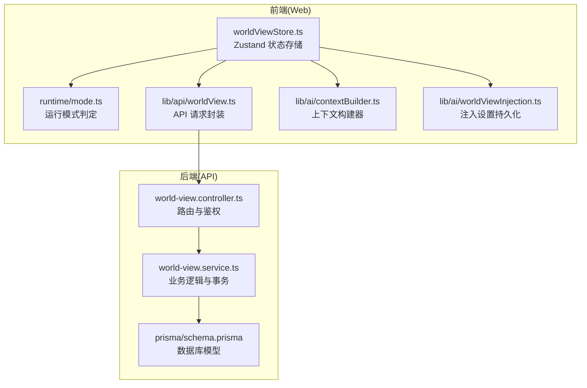
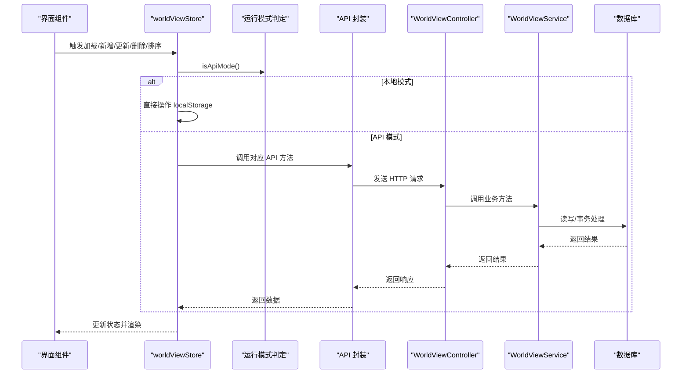
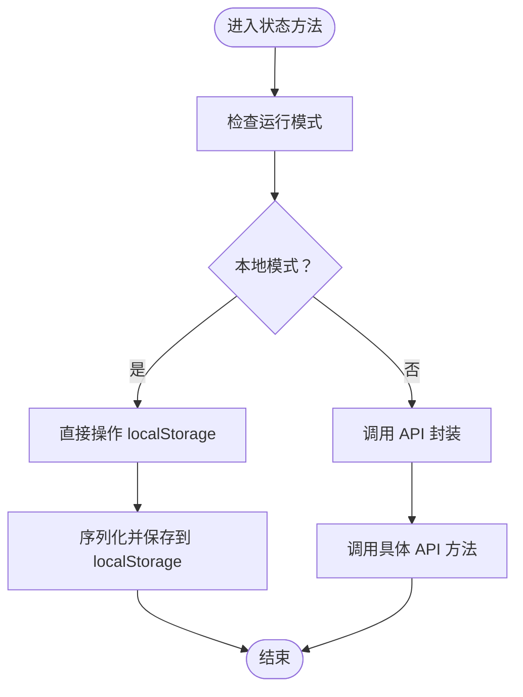
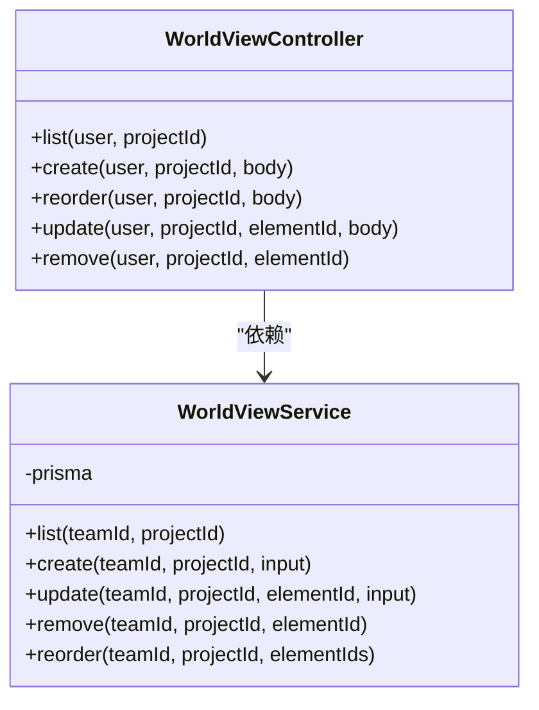
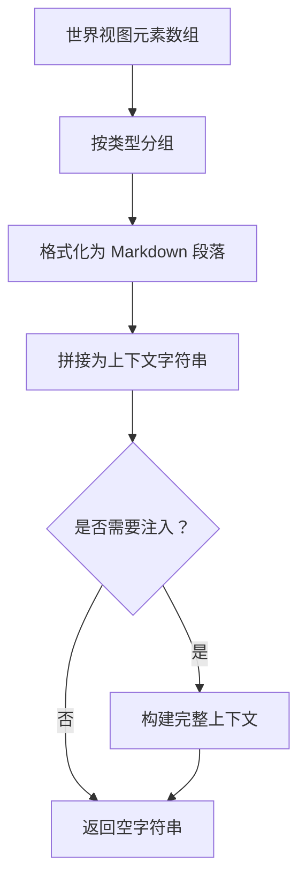
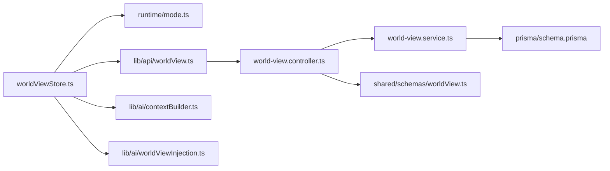

# 世界观状态管理 (worldViewStore)

<cite>
**本文档引用的文件**
- [apps/web/src/stores/worldViewStore.ts](file://apps/web/src/stores/worldViewStore.ts)
- [apps/web/src/stores/worldViewStore.test.ts](file://apps/web/src/stores/worldViewStore.test.ts)
- [apps/web/src/lib/api/worldView.ts](file://apps/web/src/lib/api/worldView.ts)
- [apps/web/src/lib/runtime/mode.ts](file://apps/web/src/lib/runtime/mode.ts)
- [apps/web/src/lib/ai/worldViewInjection.ts](file://apps/web/src/lib/ai/worldViewInjection.ts)
- [apps/web/src/lib/ai/contextBuilder.ts](file://apps/web/src/lib/ai/contextBuilder.ts)
- [apps/api/src/world-view/world-view.controller.ts](file://apps/api/src/world-view/world-view.controller.ts)
- [apps/api/src/world-view/world-view.service.ts](file://apps/api/src/world-view/world-view.service.ts)
- [apps/api/src/world-view/world-view.module.ts](file://apps/api/src/world-view/world-view.module.ts)
- [packages/shared/src/schemas/worldView.ts](file://packages/shared/src/schemas/worldView.ts)
- [apps/api/prisma/schema.prisma](file://apps/api/prisma/schema.prisma)
- [apps/web/src/types/index.ts](file://apps/web/src/types/index.ts)
</cite>

## 目录

1. [简介](#简介)
2. [项目结构](#项目结构)
3. [核心组件](#核心组件)
4. [架构总览](#架构总览)
5. [详细组件分析](#详细组件分析)
6. [依赖关系分析](#依赖关系分析)
7. [性能考量](#性能考量)
8. [故障排除指南](#故障排除指南)
9. [结论](#结论)
10. [附录](#附录)

## 简介

本文件针对 AIXSSS 项目中的“世界观状态管理”模块进行系统化技术文档整理，重点围绕前端 Zustand 状态存储 worldViewStore 的设计与实现，涵盖以下方面：

- 世界观元素的数据结构与类型约束
- 本地与 API 双模式运行机制
- 世界视图元素的增删改查与排序
- 上下文注入策略与构建算法
- 持久化策略、版本迁移与冲突处理
- 实际使用示例与最佳实践

## 项目结构

该模块横跨前端 Web 应用与后端 API 两部分，形成“前端状态 + 后端持久化”的协作架构。核心文件分布如下：

- 前端状态与 UI：worldViewStore.ts、runtime/mode.ts、api/worldView.ts、ai/contextBuilder.ts、ai/worldViewInjection.ts
- 后端 API：world-view.controller.ts、world-view.service.ts、world-view.module.ts
- 类型与校验：shared/schemas/worldView.ts、web/types/index.ts
- 数据库模式：prisma/schema.prisma

图表来源

- [apps/web/src/stores/worldViewStore.ts](file://apps/web/src/stores/worldViewStore.ts#L1-L211)
- [apps/web/src/lib/runtime/mode.ts](file://apps/web/src/lib/runtime/mode.ts#L1-L30)
- [apps/web/src/lib/api/worldView.ts](file://apps/web/src/lib/api/worldView.ts#L1-L60)
- [apps/web/src/lib/ai/contextBuilder.ts](file://apps/web/src/lib/ai/contextBuilder.ts#L1-L435)
- [apps/web/src/lib/ai/worldViewInjection.ts](file://apps/web/src/lib/ai/worldViewInjection.ts#L1-L192)
- [apps/api/src/world-view/world-view.controller.ts](file://apps/api/src/world-view/world-view.controller.ts#L1-L58)
- [apps/api/src/world-view/world-view.service.ts](file://apps/api/src/world-view/world-view.service.ts#L1-L129)
- [apps/api/prisma/schema.prisma](file://apps/api/prisma/schema.prisma#L259-L273)

章节来源

- [apps/web/src/stores/worldViewStore.ts](file://apps/web/src/stores/worldViewStore.ts#L1-L211)
- [apps/api/src/world-view/world-view.controller.ts](file://apps/api/src/world-view/world-view.controller.ts#L1-L58)

## 核心组件

- 状态存储：worldViewStore（Zustand）提供元素列表、当前选中项、加载状态及 CRUD、排序、分组与上下文构建能力
- 运行模式：根据环境变量选择本地或 API 模式，决定数据来源与持久化策略
- API 封装：统一的 HTTP 请求封装，负责与后端交互
- 上下文构建：将世界视图元素按类型分组并格式化为 AI 可理解的上下文字符串
- 注入设置：持久化控制在哪些时机注入世界视图上下文

章节来源

- [apps/web/src/stores/worldViewStore.ts](file://apps/web/src/stores/worldViewStore.ts#L25-L202)
- [apps/web/src/lib/runtime/mode.ts](file://apps/web/src/lib/runtime/mode.ts#L8-L21)
- [apps/web/src/lib/api/worldView.ts](file://apps/web/src/lib/api/worldView.ts#L6-L59)
- [apps/web/src/lib/ai/contextBuilder.ts](file://apps/web/src/lib/ai/contextBuilder.ts#L227-L270)
- [apps/web/src/lib/ai/worldViewInjection.ts](file://apps/web/src/lib/ai/worldViewInjection.ts#L66-L97)

## 架构总览

前端通过 worldViewStore 管理世界视图元素，支持本地存储与 API 两种模式。API 模式下，控制器接收请求，服务层执行业务逻辑与数据库事务，最终返回标准化数据。

图表来源

- [apps/web/src/stores/worldViewStore.ts](file://apps/web/src/stores/worldViewStore.ts#L55-L151)
- [apps/web/src/lib/runtime/mode.ts](file://apps/web/src/lib/runtime/mode.ts#L19-L21)
- [apps/web/src/lib/api/worldView.ts](file://apps/web/src/lib/api/worldView.ts#L6-L59)
- [apps/api/src/world-view/world-view.controller.ts](file://apps/api/src/world-view/world-view.controller.ts#L19-L54)
- [apps/api/src/world-view/world-view.service.ts](file://apps/api/src/world-view/world-view.service.ts#L35-L126)

## 详细组件分析

### 1) 状态存储与数据结构（worldViewStore）

- 状态字段
  - elements：世界视图元素数组
  - currentElementId：当前选中元素 ID
  - isLoading：加载状态
- 核心方法
  - loadElements：按项目 ID 加载元素（本地或 API）
  - addElement/updateElement/deleteElement/reorderElements：CRUD 与排序
  - setCurrentElement：设置当前元素
  - getElementsByType/getElementsByTypeGrouped：按类型筛选与分组
  - getWorldViewContext：构建上下文字符串
- 本地持久化
  - 使用 localStorage，键名为 aixs*worldview*{projectId}
  - 保存时序列化整个元素数组
- API 模式
  - 通过 isApiMode() 判定，调用 apiListWorldViewElements 等方法
  - 错误捕获与降级处理

图表来源

- [apps/web/src/stores/worldViewStore.ts](file://apps/web/src/stores/worldViewStore.ts#L55-L151)
- [apps/web/src/lib/runtime/mode.ts](file://apps/web/src/lib/runtime/mode.ts#L19-L21)

章节来源

- [apps/web/src/stores/worldViewStore.ts](file://apps/web/src/stores/worldViewStore.ts#L25-L202)
- [apps/web/src/stores/worldViewStore.test.ts](file://apps/web/src/stores/worldViewStore.test.ts#L32-L77)

### 2) API 层设计（控制器与服务）

- 控制器
  - 路由：/projects/:projectId/world-view（GET/POST/POST reorder/PATCH/DELETE）
  - 鉴权：JWT 守卫
  - 参数校验：使用 Zod Schema 校验请求体
- 服务层
  - list/create/update/remove/reorder：执行查询、更新与事务
  - 排序采用两阶段更新策略，避免唯一索引冲突
  - 返回 ISO 时间字符串，保证前后端一致

图表来源

- [apps/api/src/world-view/world-view.controller.ts](file://apps/api/src/world-view/world-view.controller.ts#L14-L54)
- [apps/api/src/world-view/world-view.service.ts](file://apps/api/src/world-view/world-view.service.ts#L23-L127)

章节来源

- [apps/api/src/world-view/world-view.controller.ts](file://apps/api/src/world-view/world-view.controller.ts#L1-L58)
- [apps/api/src/world-view/world-view.service.ts](file://apps/api/src/world-view/world-view.service.ts#L1-L129)

### 3) 数据模型与类型约束

- 数据库模型（Prisma）
  - WorldViewElement：包含 id、projectId、type、title、content、order、createdAt、updatedAt
  - 唯一约束：(projectId, order)
- 类型与校验（Shared）
  - WORLD_VIEW_TYPES：era/geography/society/technology/magic/custom
  - CreateWorldViewElementInputSchema/UpdateWorldViewElementInputSchema：字段长度、类型与可选性约束
- 前端类型
  - WorldViewElement：与数据库字段一致，含 createdAt/updatedAt

章节来源

- [apps/api/prisma/schema.prisma](file://apps/api/prisma/schema.prisma#L259-L273)
- [packages/shared/src/schemas/worldView.ts](file://packages/shared/src/schemas/worldView.ts#L1-L26)
- [apps/web/src/types/index.ts](file://apps/web/src/types/index.ts#L574-L618)

### 4) 上下文构建与注入机制

- 上下文构建
  - buildWorldViewContext：按类型分组并格式化为 Markdown 风格的段落
  - buildFullContext/fillPromptTemplate：整合画风、角色与世界视图，支持占位符替换
- 注入设置
  - DEFAULT_INJECTION_SETTINGS：默认在分镜列表与场景描述生成时注入
  - getInjectionSettings/saveInjectionSettings：持久化注入设置
  - shouldInjectAtSceneList/shouldInjectAtSceneDescription：注入时机判断

图表来源

- [apps/web/src/lib/ai/contextBuilder.ts](file://apps/web/src/lib/ai/contextBuilder.ts#L227-L270)
- [apps/web/src/lib/ai/worldViewInjection.ts](file://apps/web/src/lib/ai/worldViewInjection.ts#L66-L97)

章节来源

- [apps/web/src/lib/ai/contextBuilder.ts](file://apps/web/src/lib/ai/contextBuilder.ts#L227-L304)
- [apps/web/src/lib/ai/worldViewInjection.ts](file://apps/web/src/lib/ai/worldViewInjection.ts#L14-L97)

### 5) API 请求封装

- 提供 list/create/update/delete/reorder 方法，统一处理请求体与响应
- 自动处理 id、type、title、content、order 等字段的可选与必填

章节来源

- [apps/web/src/lib/api/worldView.ts](file://apps/web/src/lib/api/worldView.ts#L6-L59)

### 6) 运行模式与持久化策略

- 运行模式
  - getDataMode()/isApiMode()：根据环境变量与测试环境决定本地或 API 模式
  - API 基础路径：getApiBasePath()
- 本地持久化
  - localStorage 键：aixs*worldview*{projectId}
  - 保存时机：add/update/delete/reorder 后（本地模式）
- 版本迁移与备份（通用）
  - 项目中存在通用的版本迁移与备份机制，可作为本地数据治理参考

章节来源

- [apps/web/src/lib/runtime/mode.ts](file://apps/web/src/lib/runtime/mode.ts#L8-L29)
- [apps/web/src/stores/worldViewStore.ts](file://apps/web/src/stores/worldViewStore.ts#L204-L210)

## 依赖关系分析

- 前端依赖
  - worldViewStore 依赖 runtime/mode.ts 判定模式，依赖 api/worldView.ts 发起请求
  - 上下文构建依赖 contextBuilder.ts，注入设置依赖 worldViewInjection.ts
- 后端依赖
  - controller 依赖 service，service 依赖 prisma 数据模型
- 类型与校验
  - shared/schemas/worldView.ts 为前后端共享的输入校验依据

图表来源

- [apps/web/src/stores/worldViewStore.ts](file://apps/web/src/stores/worldViewStore.ts#L1-L11)
- [apps/web/src/lib/runtime/mode.ts](file://apps/web/src/lib/runtime/mode.ts#L1-L30)
- [apps/web/src/lib/api/worldView.ts](file://apps/web/src/lib/api/worldView.ts#L1-L60)
- [apps/web/src/lib/ai/contextBuilder.ts](file://apps/web/src/lib/ai/contextBuilder.ts#L1-L435)
- [apps/web/src/lib/ai/worldViewInjection.ts](file://apps/web/src/lib/ai/worldViewInjection.ts#L1-L192)
- [apps/api/src/world-view/world-view.controller.ts](file://apps/api/src/world-view/world-view.controller.ts#L1-L58)
- [apps/api/src/world-view/world-view.service.ts](file://apps/api/src/world-view/world-view.service.ts#L1-L129)
- [apps/api/prisma/schema.prisma](file://apps/api/prisma/schema.prisma#L259-L273)
- [packages/shared/src/schemas/worldView.ts](file://packages/shared/src/schemas/worldView.ts#L1-L26)

章节来源

- [apps/web/src/stores/worldViewStore.ts](file://apps/web/src/stores/worldViewStore.ts#L1-L11)
- [apps/api/src/world-view/world-view.controller.ts](file://apps/api/src/world-view/world-view.controller.ts#L1-L58)

## 性能考量

- 本地模式
  - localStorage 读写为同步操作，适合小规模数据；频繁写入可能阻塞 UI
  - 建议在高频变更场景下考虑批量写入或节流
- API 模式
  - 通过异步请求与错误捕获提升稳定性
  - 排序采用两阶段更新避免唯一索引冲突，减少回滚风险
- 上下文构建
  - buildWorldViewContext 与 fillPromptTemplate 为纯函数，复杂度与元素数量线性相关
  - 建议在长列表场景下限制显示数量或延迟构建

[本节为通用性能建议，不直接分析具体文件]

## 故障排除指南

- 本地模式下数据未持久化
  - 检查 localStorage 是否被清理或受限
  - 确认键名格式 aixs*worldview*{projectId}
- API 模式下请求失败
  - 检查 JWT 认证与路由路径
  - 查看服务层异常处理与数据库连接
- 排序异常
  - 确认 elementIds 与现有元素集合一致
  - 两阶段更新策略已在服务层实现，避免并发冲突
- 上下文注入未生效
  - 检查注入设置是否启用及对应时机
  - 确认上下文构建函数已正确调用

章节来源

- [apps/web/src/stores/worldViewStore.ts](file://apps/web/src/stores/worldViewStore.ts#L55-L151)
- [apps/api/src/world-view/world-view.service.ts](file://apps/api/src/world-view/world-view.service.ts#L92-L126)
- [apps/web/src/lib/ai/worldViewInjection.ts](file://apps/web/src/lib/ai/worldViewInjection.ts#L66-L97)

## 结论

worldViewStore 通过清晰的状态划分与双模式运行机制，实现了世界视图元素的本地与云端统一管理。配合严格的类型约束、稳健的 API 事务与灵活的上下文注入策略，为上层工作流提供了可靠的世界观基础。建议在大规模数据场景下引入批量写入与分页加载，并持续完善版本迁移与冲突处理机制。

[本节为总结性内容，不直接分析具体文件]

## 附录

### A. 世界视图元素数据结构

- 字段
  - id：字符串，唯一标识
  - projectId：所属项目
  - type：枚举（era/geography/society/technology/magic/custom）
  - title：标题
  - content：内容
  - order：排序序号
  - createdAt/updatedAt：时间戳（ISO 字符串）

章节来源

- [apps/api/prisma/schema.prisma](file://apps/api/prisma/schema.prisma#L259-L273)
- [packages/shared/src/schemas/worldView.ts](file://packages/shared/src/schemas/worldView.ts#L6-L23)
- [apps/web/src/types/index.ts](file://apps/web/src/types/index.ts#L574-L618)

### B. API 端点定义

- GET /projects/{projectId}/world-view：列出元素
- POST /projects/{projectId}/world-view：创建元素
- POST /projects/{projectId}/world-view/reorder：批量重排
- PATCH /projects/{projectId}/world-view/{elementId}：更新元素
- DELETE /projects/{projectId}/world-view/{elementId}：删除元素

章节来源

- [apps/api/src/world-view/world-view.controller.ts](file://apps/api/src/world-view/world-view.controller.ts#L19-L54)

### C. 配置示例与操作指引

- 配置示例
  - 本地模式：VITE_DATA_MODE=local 或测试环境自动本地模式
  - API 模式：VITE_DATA_MODE=api，默认 API 基础路径为 /api
- 元素添加/删除/更新/排序
  - 使用 addElement/updateElement/deleteElement/reorderElements
  - 本地模式直接写入 localStorage；API 模式调用对应 API
- 上下文注入
  - 通过 getInjectionSettings/saveInjectionSettings 控制注入时机
  - 使用 getWorldViewContext 构建上下文字符串

章节来源

- [apps/web/src/lib/runtime/mode.ts](file://apps/web/src/lib/runtime/mode.ts#L8-L29)
- [apps/web/src/stores/worldViewStore.ts](file://apps/web/src/stores/worldViewStore.ts#L79-L151)
- [apps/web/src/lib/ai/worldViewInjection.ts](file://apps/web/src/lib/ai/worldViewInjection.ts#L66-L97)
