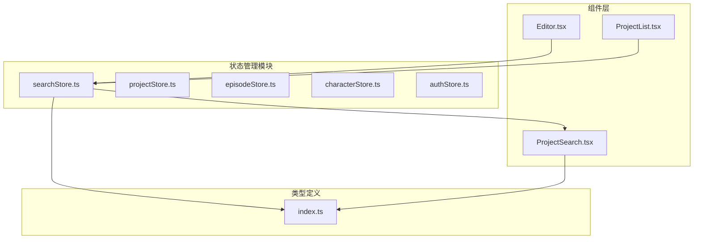
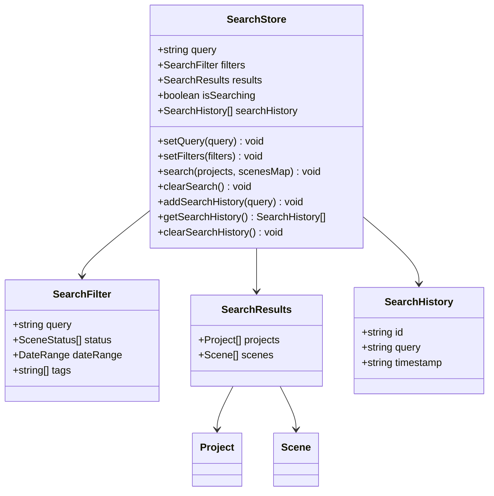
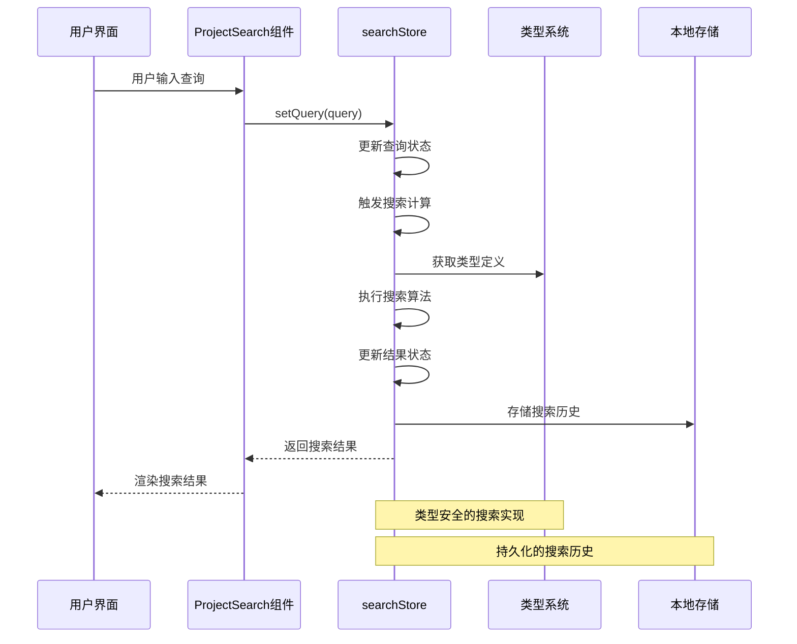
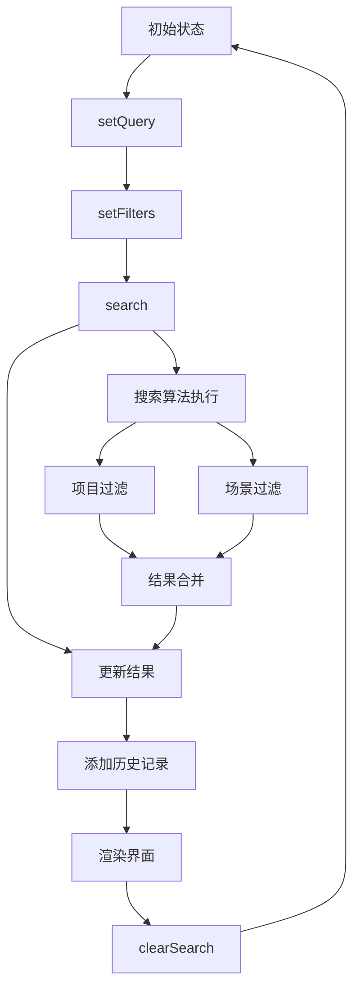
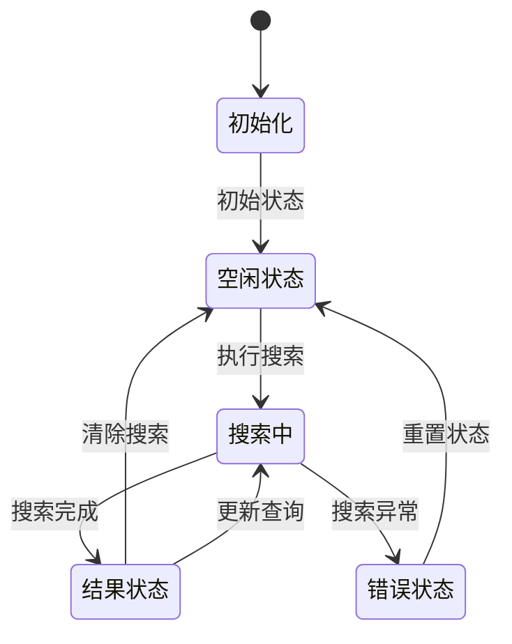
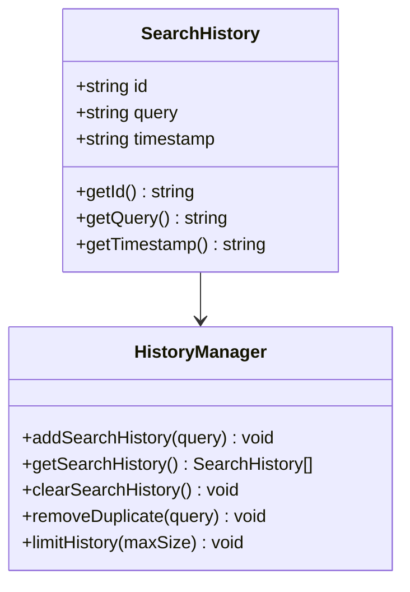
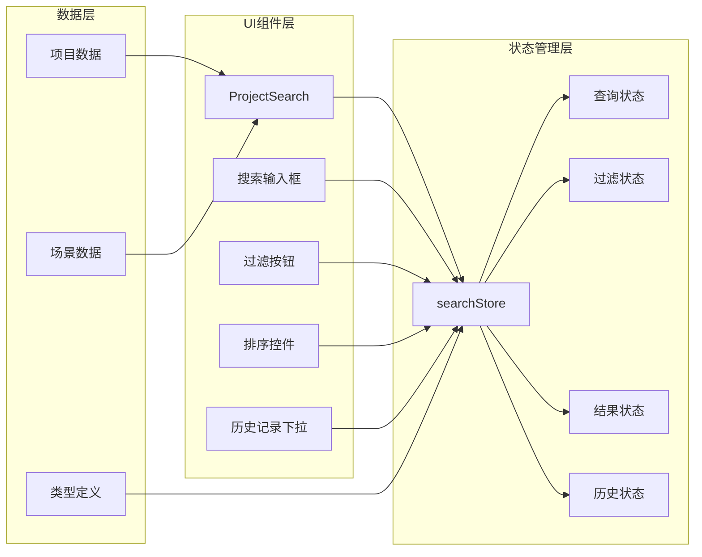
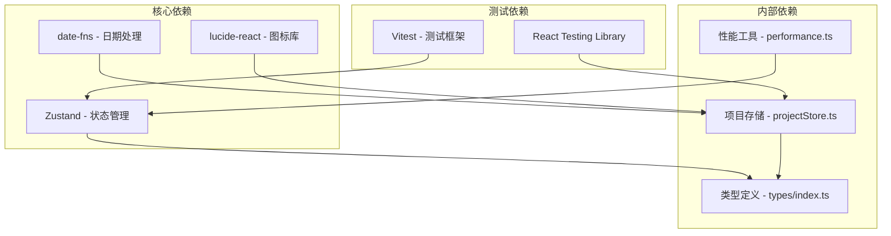
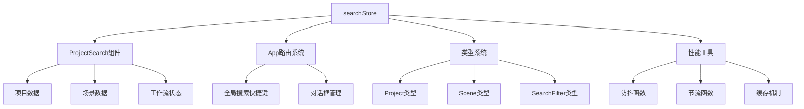
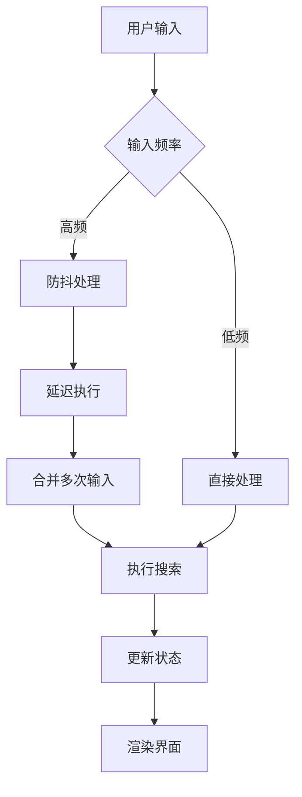

# 搜索状态管理 (searchStore)

<cite>
**本文档引用的文件**
- [searchStore.ts](file://apps/web/src/stores/searchStore.ts)
- [searchStore.test.ts](file://apps/web/src/stores/searchStore.test.ts)
- [ProjectSearch.tsx](file://apps/web/src/components/editor/ProjectSearch.tsx)
- [index.ts](file://apps/web/src/types/index.ts)
- [App.tsx](file://apps/web/src/App.tsx)
- [performance.ts](file://apps/web/src/lib/performance.ts)
</cite>

## 目录

1. [简介](#简介)
2. [项目结构](#项目结构)
3. [核心组件](#核心组件)
4. [架构概览](#架构概览)
5. [详细组件分析](#详细组件分析)
6. [依赖关系分析](#依赖关系分析)
7. [性能考虑](#性能考虑)
8. [故障排除指南](#故障排除指南)
9. [结论](#结论)

## 简介

searchStore 是 AIXSSS 项目中的核心搜索状态管理模块，负责管理项目和场景的搜索、过滤、缓存和历史记录功能。该模块基于 Zustand 状态管理库构建，提供了完整的搜索生命周期管理和高性能的搜索算法实现。

该模块主要包含以下核心功能：

- 查询状态管理：维护当前搜索查询、过滤条件和搜索结果
- 实时搜索过滤：支持项目和场景的多字段模糊匹配
- 搜索历史记录：提供搜索历史的存储、管理和清理功能
- 性能优化：通过防抖、节流和缓存机制提升搜索性能
- 增量更新：支持动态更新搜索结果和状态

## 项目结构

searchStore 模块位于应用的 stores 目录中，与项目其他状态管理模块并列：

**图表来源**

- [searchStore.ts](file://apps/web/src/stores/searchStore.ts#L1-L130)
- [ProjectSearch.tsx](file://apps/web/src/components/editor/ProjectSearch.tsx#L1-L354)

**章节来源**

- [searchStore.ts](file://apps/web/src/stores/searchStore.ts#L1-L130)
- [ProjectSearch.tsx](file://apps/web/src/components/editor/ProjectSearch.tsx#L1-L354)

## 核心组件

searchStore 模块的核心数据结构和组件包括：

### 状态接口定义

**图表来源**

- [searchStore.ts](file://apps/web/src/stores/searchStore.ts#L10-L28)
- [index.ts](file://apps/web/src/types/index.ts#L955-L964)

### 搜索算法实现

searchStore 提供了高效的搜索算法，支持多字段模糊匹配：

1. **项目搜索算法**：支持标题、摘要、主角和风格字段的模糊匹配
2. **场景搜索算法**：支持摘要、场景描述、动作描述和镜头提示词的模糊匹配
3. **实时过滤**：基于状态的动态过滤和排序
4. **性能优化**：使用小写转换和早期退出优化

**章节来源**

- [searchStore.ts](file://apps/web/src/stores/searchStore.ts#L52-L98)
- [searchStore.test.ts](file://apps/web/src/stores/searchStore.test.ts#L77-L234)

## 架构概览

searchStore 采用模块化的架构设计，与其他系统组件紧密集成：

**图表来源**

- [ProjectSearch.tsx](file://apps/web/src/components/editor/ProjectSearch.tsx#L38-L91)
- [searchStore.ts](file://apps/web/src/stores/searchStore.ts#L30-L130)

### 状态管理模式

searchStore 使用 Zustand 的函数式状态管理模式：

**图表来源**

- [searchStore.ts](file://apps/web/src/stores/searchStore.ts#L30-L130)

**章节来源**

- [searchStore.ts](file://apps/web/src/stores/searchStore.ts#L30-L130)
- [App.tsx](file://apps/web/src/App.tsx#L100-L178)

## 详细组件分析

### searchStore 核心实现

#### 状态初始化和生命周期

searchStore 在创建时初始化所有必要的状态：

**图表来源**

- [searchStore.ts](file://apps/web/src/stores/searchStore.ts#L30-L130)

#### 搜索算法详细实现

searchStore 实现了高效的搜索算法，支持多字段模糊匹配：

**项目搜索算法**：

- 标题字段：`project.title.toLowerCase().includes(lowerQuery)`
- 摘要字段：`project.summary.toLowerCase().includes(lowerQuery)`
- 主角字段：`project.protagonist.toLowerCase().includes(lowerQuery)`
- 风格字段：`project.style.toLowerCase().includes(lowerQuery)`

**场景搜索算法**：

- 摘要字段：`scene.summary.toLowerCase().includes(lowerQuery)`
- 场景描述：`scene.sceneDescription.toLowerCase().includes(lowerQuery)`
- 动作描述：`scene.actionDescription.toLowerCase().includes(lowerQuery)`
- 镜头提示词：`scene.shotPrompt.toLowerCase().includes(lowerQuery)`

**章节来源**

- [searchStore.ts](file://apps/web/src/stores/searchStore.ts#L58-L89)

### 搜索历史管理系统

#### 历史记录数据结构

**图表来源**

- [searchStore.ts](file://apps/web/src/stores/searchStore.ts#L4-L8)
- [searchStore.ts](file://apps/web/src/stores/searchStore.ts#L108-L129)

#### 历史记录管理策略

searchStore 实现了智能的历史记录管理：

1. **去重机制**：自动移除重复的查询历史
2. **长度限制**：最多保持 10 条历史记录
3. **时间戳管理**：自动添加搜索时间
4. **空白字符处理**：自动去除首尾空白字符

**章节来源**

- [searchStore.ts](file://apps/web/src/stores/searchStore.ts#L108-L120)
- [searchStore.test.ts](file://apps/web/src/stores/searchStore.test.ts#L270-L337)

### 与 UI 组件的集成

#### ProjectSearch 组件集成

ProjectSearch 组件与 searchStore 紧密集成，提供完整的搜索界面：

**图表来源**

- [ProjectSearch.tsx](file://apps/web/src/components/editor/ProjectSearch.tsx#L38-L91)
- [searchStore.ts](file://apps/web/src/stores/searchStore.ts#L30-L130)

**章节来源**

- [ProjectSearch.tsx](file://apps/web/src/components/editor/ProjectSearch.tsx#L38-L91)
- [App.tsx](file://apps/web/src/App.tsx#L212-L229)

## 依赖关系分析

### 外部依赖

searchStore 模块依赖以下外部库和工具：

**图表来源**

- [searchStore.ts](file://apps/web/src/stores/searchStore.ts#L1-L2)
- [ProjectSearch.tsx](file://apps/web/src/components/editor/ProjectSearch.tsx#L11-L31)

### 内部耦合关系

searchStore 与其他模块的耦合关系：

**图表来源**

- [searchStore.ts](file://apps/web/src/stores/searchStore.ts#L1-L2)
- [index.ts](file://apps/web/src/types/index.ts#L452-L618)

**章节来源**

- [searchStore.ts](file://apps/web/src/stores/searchStore.ts#L1-L2)
- [index.ts](file://apps/web/src/types/index.ts#L452-L618)

## 性能考虑

### 性能优化策略

searchStore 实现了多种性能优化策略：

#### 防抖和节流机制

#### 内存缓存优化

searchStore 使用 SimpleCache 类进行内存缓存：

- **最大容量**：默认 100 个缓存项
- **TTL设置**：默认 5 分钟过期时间
- **自动清理**：过期项自动清理
- **LRU策略**：超出容量时删除最旧项

#### 搜索算法优化

1. **早期退出**：空查询时快速返回
2. **小写转换**：统一转换为小写进行比较
3. **索引访问**：使用场景映射表进行快速查找
4. **增量更新**：只更新变化的部分

**章节来源**

- [performance.ts](file://apps/web/src/lib/performance.ts#L60-L122)
- [searchStore.ts](file://apps/web/src/stores/searchStore.ts#L52-L98)

### 性能监控

searchStore 支持性能监控和调试：

- **性能标记**：使用 `performance.mark()` 和 `performance.measure()`
- **渲染计数**：跟踪组件渲染次数
- **内存使用**：监控缓存大小和内存使用情况

## 故障排除指南

### 常见问题和解决方案

#### 搜索结果不准确

**问题**：搜索结果与预期不符
**可能原因**：

1. 查询字符串大小写敏感
2. 字段匹配逻辑错误
3. 数据类型不匹配

**解决方案**：

1. 确保查询字符串转换为小写
2. 检查字段映射是否正确
3. 验证数据类型一致性

#### 性能问题

**问题**：搜索响应缓慢
**可能原因**：

1. 大数据集处理
2. 缺少防抖机制
3. 缓存未启用

**解决方案**：

1. 实现防抖和节流
2. 启用内存缓存
3. 优化搜索算法

#### 内存泄漏

**问题**：应用内存持续增长
**可能原因**：

1. 缓存项未清理
2. 事件监听器未移除
3. 循环引用

**解决方案**：

1. 定期清理过期缓存
2. 正确管理事件监听器
3. 检查循环引用

**章节来源**

- [searchStore.test.ts](file://apps/web/src/stores/searchStore.test.ts#L1-L369)

### 调试技巧

#### 状态检查

使用浏览器开发者工具检查 Zustand 状态：

1. 访问 `window.__REDUX_DEVTOOLS_GLOBAL_HOOK__`
2. 查看 searchStore 的当前状态
3. 监控状态变化

#### 性能分析

使用浏览器性能面板分析：

1. 记录搜索操作的性能指标
2. 分析内存使用情况
3. 检查渲染性能

## 结论

searchStore 模块是 AIXSSS 项目中设计精良的状态管理组件，具有以下特点：

### 设计优势

1. **模块化设计**：清晰的职责分离和接口定义
2. **类型安全**：完整的 TypeScript 类型定义
3. **性能优化**：多种性能优化策略的综合运用
4. **易于扩展**：灵活的架构支持功能扩展

### 技术亮点

1. **高效的搜索算法**：支持多字段模糊匹配
2. **智能历史管理**：自动去重和长度限制
3. **实时状态更新**：基于 Zustand 的响应式状态管理
4. **完善的测试覆盖**：全面的单元测试确保代码质量

### 改进建议

1. **搜索索引**：为大数据集实现搜索索引
2. **并发处理**：支持异步搜索和并发处理
3. **搜索建议**：实现智能搜索建议功能
4. **搜索统计**：添加搜索使用统计和分析

searchStore 模块为 AIXSSS 项目提供了强大而灵活的搜索功能，是项目成功的关键组件之一。
