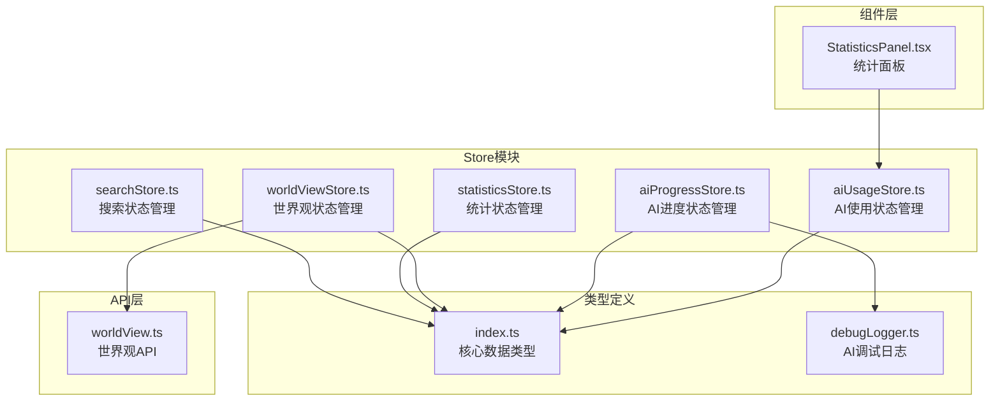
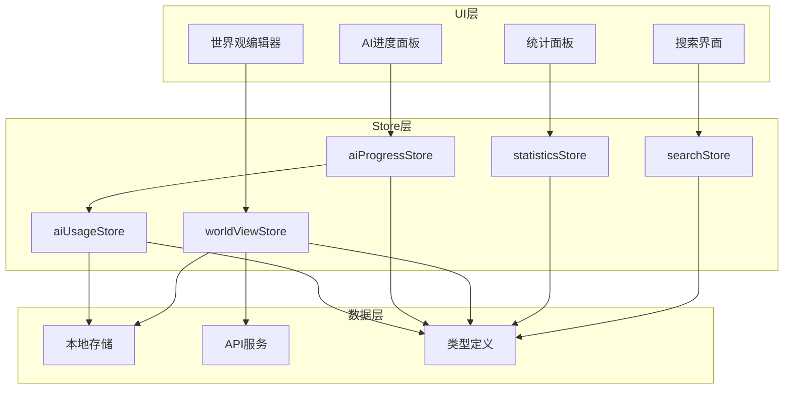
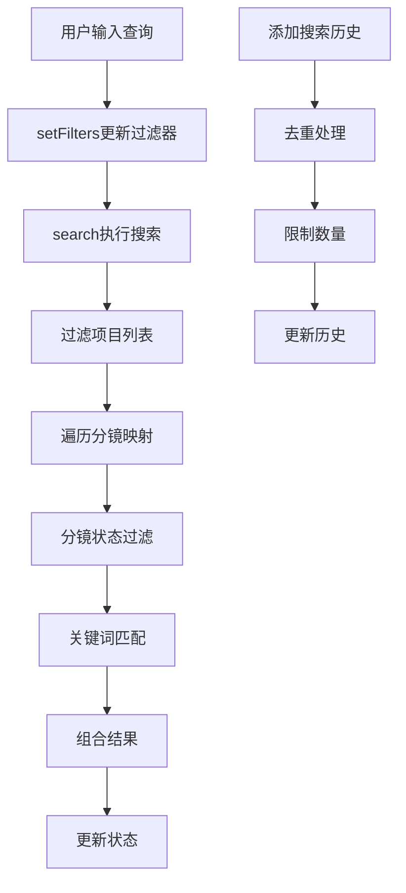
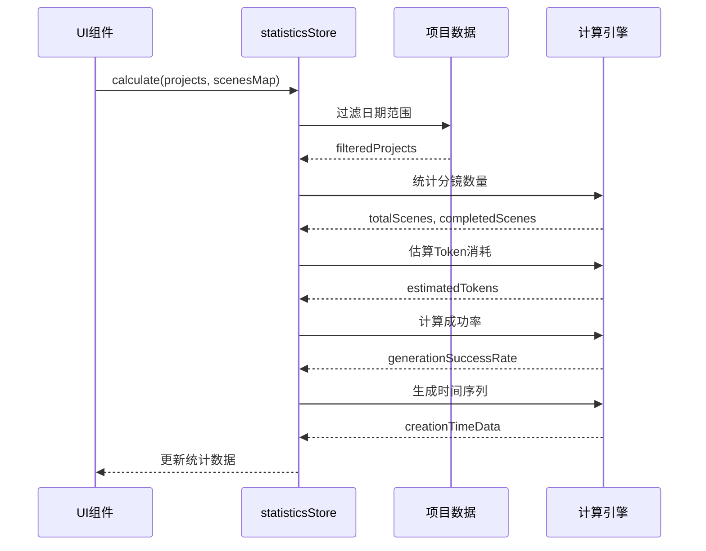
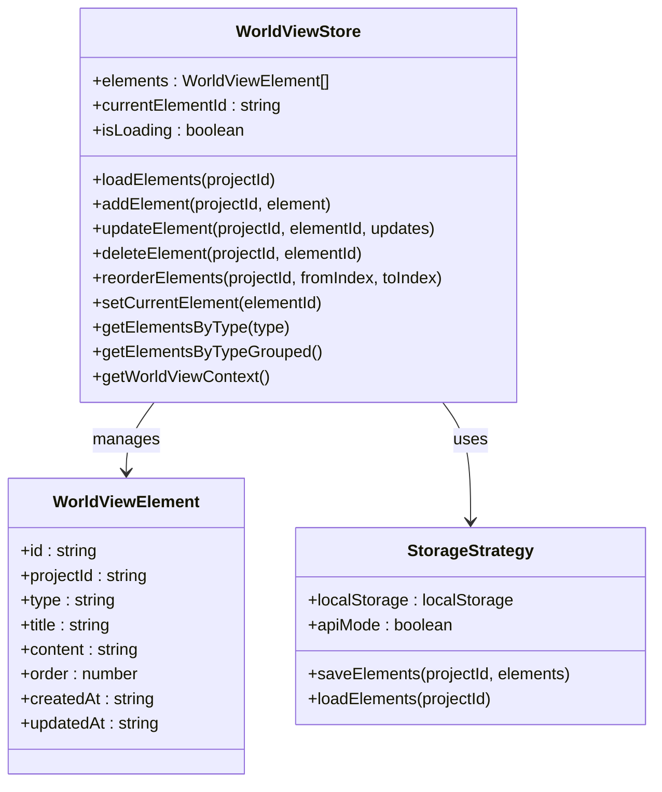
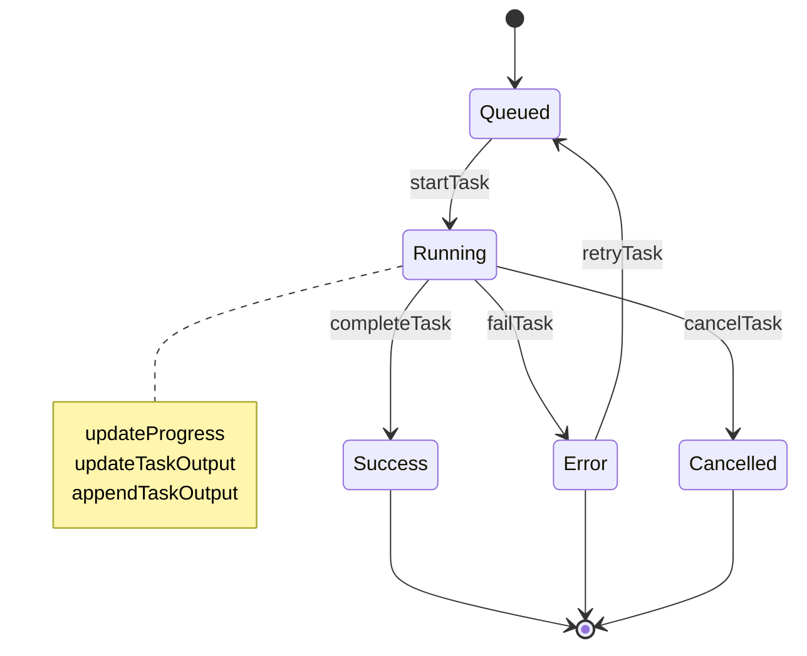
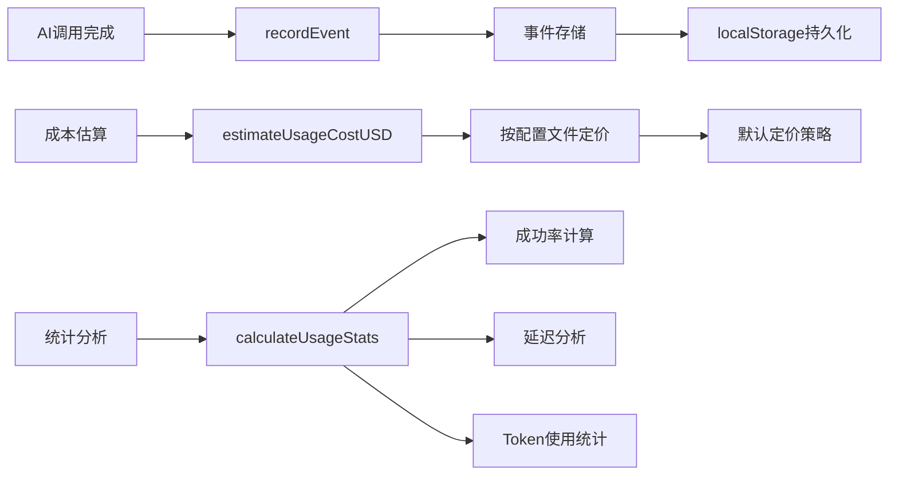
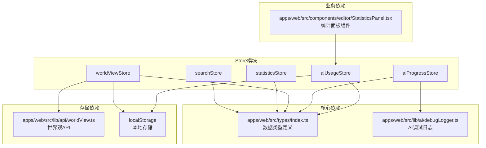
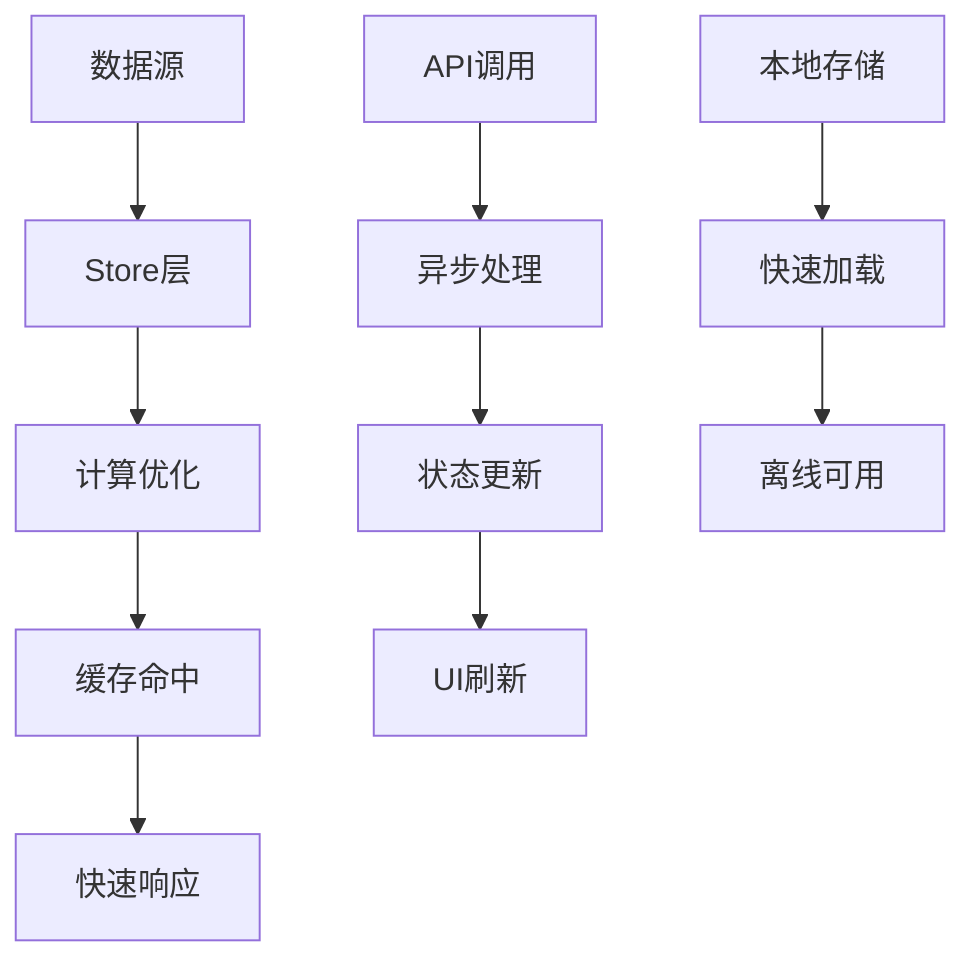

# 数据相关Store模块

<cite>
**本文档引用的文件**
- [apps/web/src/stores/searchStore.ts](file://apps/web/src/stores/searchStore.ts)
- [apps/web/src/stores/statisticsStore.ts](file://apps/web/src/stores/statisticsStore.ts)
- [apps/web/src/stores/worldViewStore.ts](file://apps/web/src/stores/worldViewStore.ts)
- [apps/web/src/stores/aiProgressStore.ts](file://apps/web/src/stores/aiProgressStore.ts)
- [apps/web/src/stores/aiUsageStore.ts](file://apps/web/src/stores/aiUsageStore.ts)
- [apps/web/src/types/index.ts](file://apps/web/src/types/index.ts)
- [apps/web/src/lib/ai/debugLogger.ts](file://apps/web/src/lib/ai/debugLogger.ts)
- [apps/web/src/lib/api/worldView.ts](file://apps/web/src/lib/api/worldView.ts)
- [apps/web/src/components/editor/StatisticsPanel.tsx](file://apps/web/src/components/editor/StatisticsPanel.tsx)
</cite>

## 目录

1. [简介](#简介)
2. [项目结构](#项目结构)
3. [核心组件](#核心组件)
4. [架构概览](#架构概览)
5. [详细组件分析](#详细组件分析)
6. [依赖分析](#依赖分析)
7. [性能考虑](#性能考虑)
8. [故障排除指南](#故障排除指南)
9. [结论](#结论)

## 简介

AIXSSS项目的数据相关状态管理模块是一套基于Zustand的轻量级状态管理解决方案，专门设计用于管理项目创作过程中的各种数据状态。该模块包含五个核心Store：搜索状态管理(searchStore)、统计状态管理(statisticsStore)、世界观状态管理(worldViewStore)、AI进度状态管理(aiProgressStore)和AI使用状态管理(aiUsageStore)。

这些Store模块共同构成了一个完整的数据状态管理体系，涵盖了从基础搜索过滤到复杂AI任务追踪的全方位需求。每个Store都采用了函数式编程范式，提供了简洁而强大的状态管理能力。

## 项目结构

数据相关Store模块位于应用的前端代码结构中，采用按功能模块组织的方式：

**图表来源**

- [apps/web/src/stores/searchStore.ts](file://apps/web/src/stores/searchStore.ts#L1-L131)
- [apps/web/src/stores/statisticsStore.ts](file://apps/web/src/stores/statisticsStore.ts#L1-L118)
- [apps/web/src/stores/worldViewStore.ts](file://apps/web/src/stores/worldViewStore.ts#L1-L211)
- [apps/web/src/stores/aiProgressStore.ts](file://apps/web/src/stores/aiProgressStore.ts#L1-L758)
- [apps/web/src/stores/aiUsageStore.ts](file://apps/web/src/stores/aiUsageStore.ts#L1-L217)

**章节来源**

- [apps/web/src/stores/searchStore.ts](file://apps/web/src/stores/searchStore.ts#L1-L131)
- [apps/web/src/stores/statisticsStore.ts](file://apps/web/src/stores/statisticsStore.ts#L1-L118)
- [apps/web/src/stores/worldViewStore.ts](file://apps/web/src/stores/worldViewStore.ts#L1-L211)
- [apps/web/src/stores/aiProgressStore.ts](file://apps/web/src/stores/aiProgressStore.ts#L1-L758)
- [apps/web/src/stores/aiUsageStore.ts](file://apps/web/src/stores/aiUsageStore.ts#L1-L217)

## 核心组件

### 搜索状态管理(searchStore)

searchStore是项目中最基础的状态管理模块，负责处理用户搜索请求和结果展示。它维护着查询字符串、过滤条件、搜索结果和搜索历史等状态。

**主要特性：**

- 实时搜索过滤机制
- 支持项目和分镜的双重搜索
- 智能查询历史管理
- 多维度过滤支持

### 统计状态管理(statisticsStore)

statisticsStore专注于项目和分镜的统计分析，提供数据驱动的洞察和报告生成功能。

**核心功能：**

- 项目创建趋势分析
- 分镜完成度统计
- Token消耗估算
- 成本预算计算

### 世界观状态管理(worldViewStore)

worldViewStore是项目的核心数据管理模块，负责管理世界观要素的完整生命周期。

**关键能力：**

- 本地存储与API同步
- 多类型世界观要素管理
- AI上下文注入支持
- 实时数据持久化

### AI进度状态管理(aiProgressStore)

aiProgressStore是整个AI工作流的心脏，负责跟踪所有AI调用的状态、进度和性能指标。

**高级特性：**

- 任务队列管理
- 实时进度追踪
- 批量操作支持
- 详细的性能统计

### AI使用状态管理(aiUsageStore)

aiUsageStore专注于AI使用情况的监控和分析，提供详细的使用统计和成本分析。

**监控能力：**

- 使用事件记录
- 成本估算
- 性能指标分析
- 数据持久化

**章节来源**

- [apps/web/src/stores/searchStore.ts](file://apps/web/src/stores/searchStore.ts#L10-L28)
- [apps/web/src/stores/statisticsStore.ts](file://apps/web/src/stores/statisticsStore.ts#L5-L17)
- [apps/web/src/stores/worldViewStore.ts](file://apps/web/src/stores/worldViewStore.ts#L25-L48)
- [apps/web/src/stores/aiProgressStore.ts](file://apps/web/src/stores/aiProgressStore.ts#L120-L149)
- [apps/web/src/stores/aiUsageStore.ts](file://apps/web/src/stores/aiUsageStore.ts#L186-L194)

## 架构概览

整个数据状态管理架构采用分层设计，每个Store模块都有明确的职责边界：

**图表来源**

- [apps/web/src/stores/searchStore.ts](file://apps/web/src/stores/searchStore.ts#L30-L131)
- [apps/web/src/stores/statisticsStore.ts](file://apps/web/src/stores/statisticsStore.ts#L19-L118)
- [apps/web/src/stores/worldViewStore.ts](file://apps/web/src/stores/worldViewStore.ts#L50-L211)
- [apps/web/src/stores/aiProgressStore.ts](file://apps/web/src/stores/aiProgressStore.ts#L249-L677)
- [apps/web/src/stores/aiUsageStore.ts](file://apps/web/src/stores/aiUsageStore.ts#L196-L217)

## 详细组件分析

### 搜索状态管理(searchStore)深度分析

searchStore实现了高效的搜索算法，支持模糊匹配和多字段检索：

**图表来源**

- [apps/web/src/stores/searchStore.ts](file://apps/web/src/stores/searchStore.ts#L52-L98)
- [apps/web/src/stores/searchStore.ts](file://apps/web/src/stores/searchStore.ts#L108-L130)

**实现特点：**

- 大小写不敏感的全文搜索
- 支持项目标题、摘要、主角、风格的多字段匹配
- 分镜搜索包含状态过滤和关键词匹配
- 智能历史管理，自动去重和数量限制

**章节来源**

- [apps/web/src/stores/searchStore.ts](file://apps/web/src/stores/searchStore.ts#L52-L98)
- [apps/web/src/stores/searchStore.ts](file://apps/web/src/stores/searchStore.ts#L108-L130)

### 统计状态管理(statisticsStore)深度分析

statisticsStore提供了全面的项目数据分析功能：

**图表来源**

- [apps/web/src/stores/statisticsStore.ts](file://apps/web/src/stores/statisticsStore.ts#L26-L81)

**统计指标：**

- 项目创建趋势分析（最近7天）
- 分镜完成度统计
- Token消耗估算（每完成分镜2000 tokens）
- 成本预算计算（每1M tokens $0.002）
- 平均分镜完成时间估算（30分钟）

**章节来源**

- [apps/web/src/stores/statisticsStore.ts](file://apps/web/src/stores/statisticsStore.ts#L26-L81)
- [apps/web/src/stores/statisticsStore.ts](file://apps/web/src/stores/statisticsStore.ts#L87-L116)

### 世界观状态管理(worldViewStore)深度分析

worldViewStore是数据持久化的核心，支持本地存储和API两种模式：

**图表来源**

- [apps/web/src/stores/worldViewStore.ts](file://apps/web/src/stores/worldViewStore.ts#L25-L48)
- [apps/web/src/stores/worldViewStore.ts](file://apps/web/src/stores/worldViewStore.ts#L827-L835)

**存储策略：**

- 本地存储模式：使用localStorage持久化
- API模式：通过REST API进行数据同步
- 自动模式切换：根据运行环境选择最优策略

**AI上下文注入：**

- 支持按类型分组的世界观要素
- 自动生成AI注入的上下文字符串
- 多种类型标签（时代背景、地理设定、社会制度等）

**章节来源**

- [apps/web/src/stores/worldViewStore.ts](file://apps/web/src/stores/worldViewStore.ts#L55-L151)
- [apps/web/src/stores/worldViewStore.ts](file://apps/web/src/stores/worldViewStore.ts#L174-L201)

### AI进度状态管理(aiProgressStore)深度分析

aiProgressStore是整个AI工作流的监控中心，提供了完整的任务生命周期管理：

**图表来源**

- [apps/web/src/stores/aiProgressStore.ts](file://apps/web/src/stores/aiProgressStore.ts#L13-L18)

**任务管理：**

- 任务状态转换：排队 → 执行中 → 完成/失败/取消
- 进度追踪：0-100%的实时进度更新
- 流式输出：增量更新AI响应内容
- 重试机制：支持最大重试次数配置

**批量操作支持：**

- 批量生成状态管理
- 选中分镜集合跟踪
- 进度计算和状态同步
- 取消请求处理

**性能统计：**

- 响应时间统计
- Token使用量追踪
- 成本估算（每1K tokens $0.002）
- 任务队列状态监控

**章节来源**

- [apps/web/src/stores/aiProgressStore.ts](file://apps/web/src/stores/aiProgressStore.ts#L285-L455)
- [apps/web/src/stores/aiProgressStore.ts](file://apps/web/src/stores/aiProgressStore.ts#L501-L591)
- [apps/web/src/stores/aiProgressStore.ts](file://apps/web/src/stores/aiProgressStore.ts#L219-L247)

### AI使用状态管理(aiUsageStore)深度分析

aiUsageStore专注于AI使用情况的详细记录和分析：

**图表来源**

- [apps/web/src/stores/aiUsageStore.ts](file://apps/web/src/stores/aiUsageStore.ts#L199-L204)
- [apps/web/src/stores/aiUsageStore.ts](file://apps/web/src/stores/aiUsageStore.ts#L61-L95)
- [apps/web/src/stores/aiUsageStore.ts](file://apps/web/src/stores/aiUsageStore.ts#L140-L184)

**监控指标：**

- 成功/失败率统计
- 响应时间分析（平均值和P95）
- Token使用量追踪
- 成本估算和预算控制

**数据持久化：**

- localStorage存储，支持2000条事件限制
- 自动数据清理和轮换
- 安全的读写操作，包含异常处理

**章节来源**

- [apps/web/src/stores/aiUsageStore.ts](file://apps/web/src/stores/aiUsageStore.ts#L196-L217)
- [apps/web/src/stores/aiUsageStore.ts](file://apps/web/src/stores/aiUsageStore.ts#L97-L129)
- [apps/web/src/stores/aiUsageStore.ts](file://apps/web/src/stores/aiUsageStore.ts#L140-L184)

## 依赖分析

各Store模块之间的依赖关系体现了清晰的分层架构：

**图表来源**

- [apps/web/src/stores/worldViewStore.ts](file://apps/web/src/stores/worldViewStore.ts#L1-L10)
- [apps/web/src/stores/aiProgressStore.ts](file://apps/web/src/stores/aiProgressStore.ts#L6-L6)
- [apps/web/src/components/editor/StatisticsPanel.tsx](file://apps/web/src/components/editor/StatisticsPanel.tsx#L338-L346)

**依赖特点：**

- 所有Store共享统一的数据类型定义
- worldViewStore依赖API层进行云端同步
- aiProgressStore依赖AI调试日志系统
- 组件层通过Store进行数据访问

**章节来源**

- [apps/web/src/stores/worldViewStore.ts](file://apps/web/src/stores/worldViewStore.ts#L1-L10)
- [apps/web/src/stores/aiProgressStore.ts](file://apps/web/src/stores/aiProgressStore.ts#L6-L6)
- [apps/web/src/components/editor/StatisticsPanel.tsx](file://apps/web/src/components/editor/StatisticsPanel.tsx#L338-L346)

## 性能考虑

### 缓存策略

各Store模块采用了多层次的缓存策略来优化性能：

**搜索缓存：**

- 查询结果缓存，避免重复计算
- 搜索历史本地持久化
- 智能去重和数量限制

**统计缓存：**

- 计算结果缓存，支持日期范围切换
- 避免重复的数据库查询
- 增量更新机制

**AI进度缓存：**

- 任务状态本地持久化
- 实时进度更新优化
- 批量操作状态缓存

### 数据流优化

**优化策略：**

- 异步数据加载，避免阻塞UI
- 智能状态合并，减少不必要的渲染
- 批量操作优化，提升用户体验

### 内存管理

- AI进度Store使用增量输出更新，避免内存泄漏
- 事件存储限制最大数量，防止内存溢出
- 自动清理机制，释放不再使用的资源

## 故障排除指南

### 常见问题及解决方案

**搜索功能异常：**

- 检查查询字符串是否为空
- 验证过滤器配置是否正确
- 确认数据源是否可用

**统计数据显示异常：**

- 验证日期范围设置
- 检查数据完整性
- 确认计算逻辑正确性

**AI进度追踪问题：**

- 检查AI调试日志是否启用
- 验证任务状态转换
- 确认事件监听器正常工作

**数据持久化失败：**

- 检查localStorage权限
- 验证存储配额
- 确认数据格式正确

**章节来源**

- [apps/web/src/stores/searchStore.ts](file://apps/web/src/stores/searchStore.ts#L108-L130)
- [apps/web/src/stores/aiProgressStore.ts](file://apps/web/src/stores/aiProgressStore.ts#L648-L677)
- [apps/web/src/stores/aiUsageStore.ts](file://apps/web/src/stores/aiUsageStore.ts#L113-L129)

## 结论

AIXSSS项目的数据相关Store模块展现了现代前端状态管理的最佳实践。通过精心设计的模块化架构，该系统成功地平衡了功能完整性、性能优化和用户体验。

**主要优势：**

- 清晰的职责分离和模块化设计
- 高效的缓存策略和性能优化
- 完善的错误处理和故障恢复机制
- 灵活的扩展性和维护性

**技术亮点：**

- 基于Zustand的轻量级状态管理
- 多层次的数据持久化策略
- 实时的AI工作流监控
- 全面的使用统计和分析

这套Store模块为AIXSSS项目的创作流程提供了坚实的数据基础，支持从基础搜索到复杂AI生成的全方位需求，是项目成功的关键基础设施之一。
