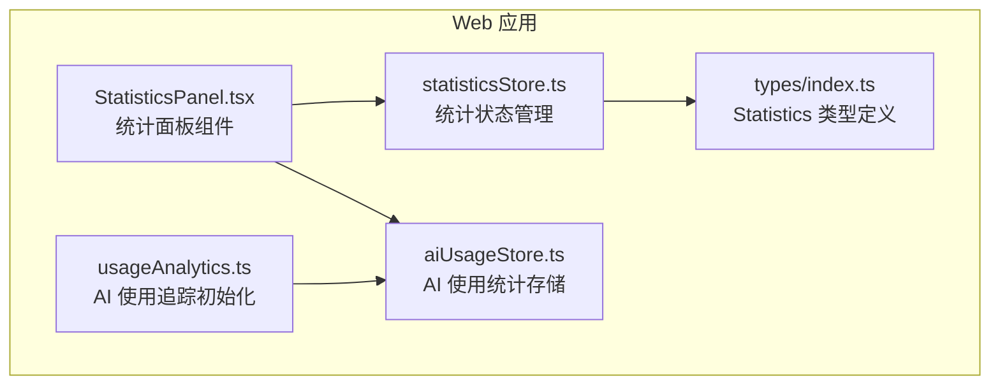
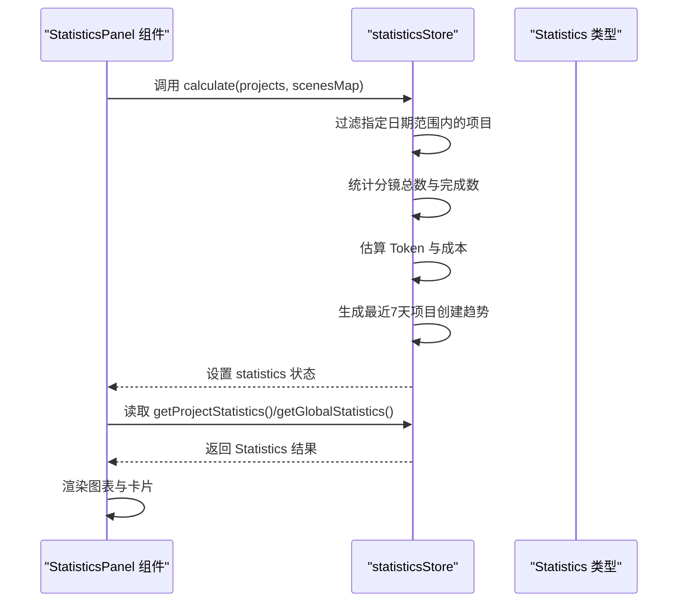
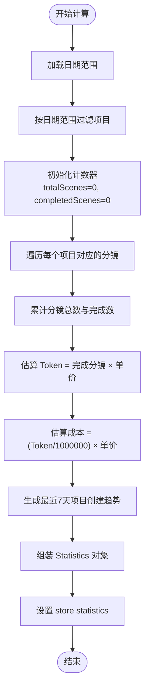
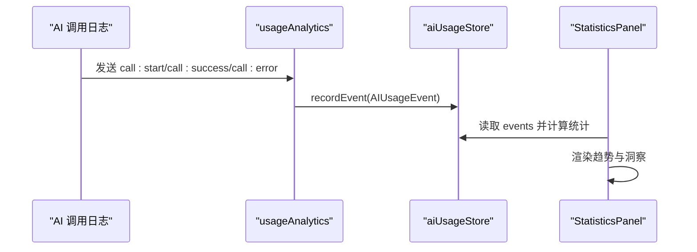
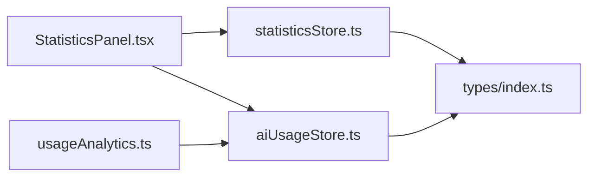

# 统计状态管理 (statisticsStore)

<cite>
**本文档引用的文件**
- [statisticsStore.ts](file://apps/web/src/stores/statisticsStore.ts)
- [statisticsStore.test.ts](file://apps/web/src/stores/statisticsStore.test.ts)
- [StatisticsPanel.tsx](file://apps/web/src/components/editor/StatisticsPanel.tsx)
- [aiUsageStore.ts](file://apps/web/src/stores/aiUsageStore.ts)
- [usageAnalytics.ts](file://apps/web/src/lib/ai/usageAnalytics.ts)
- [index.ts](file://apps/web/src/types/index.ts)
</cite>

## 目录

1. [简介](#简介)
2. [项目结构](#项目结构)
3. [核心组件](#核心组件)
4. [架构概览](#架构概览)
5. [详细组件分析](#详细组件分析)
6. [依赖关系分析](#依赖关系分析)
7. [性能考量](#性能考量)
8. [故障排查指南](#故障排查指南)
9. [结论](#结论)
10. [附录](#附录)

## 简介

本文件系统性梳理 AIXSSS 项目中的统计状态管理模块（statisticsStore），重点阐释其设计思路、数据采集与聚合流程、可视化数据准备以及与 AI 使用统计的协同关系。模块围绕以下关键指标展开：

- 项目完成度统计（项目数、分镜总数、完成分镜数）
- 场景生成数量与趋势
- 估算 Token 消耗与成本
- 平均分镜完成时间与生成成功率
- 最近7天项目创建趋势

同时，文档覆盖缓存策略、增量更新机制与性能监控能力，并提供 API 使用示例、数据聚合方法与图表展示配置说明。

## 项目结构

statisticsStore 位于前端 Web 应用的状态层，采用轻量状态管理方案，配合组件层的统计面板进行数据消费与可视化展示。

**图表来源**

- [statisticsStore.ts](file://apps/web/src/stores/statisticsStore.ts#L1-L118)
- [StatisticsPanel.tsx](file://apps/web/src/components/editor/StatisticsPanel.tsx#L1-L1029)
- [aiUsageStore.ts](file://apps/web/src/stores/aiUsageStore.ts#L1-L217)
- [usageAnalytics.ts](file://apps/web/src/lib/ai/usageAnalytics.ts#L1-L77)
- [index.ts](file://apps/web/src/types/index.ts#L966-L980)

**章节来源**

- [statisticsStore.ts](file://apps/web/src/stores/statisticsStore.ts#L1-L118)
- [StatisticsPanel.tsx](file://apps/web/src/components/editor/StatisticsPanel.tsx#L1-L1029)
- [aiUsageStore.ts](file://apps/web/src/stores/aiUsageStore.ts#L1-L217)
- [usageAnalytics.ts](file://apps/web/src/lib/ai/usageAnalytics.ts#L1-L77)
- [index.ts](file://apps/web/src/types/index.ts#L966-L980)

## 核心组件

- statisticsStore：负责接收项目与分镜数据，按日期范围过滤，计算统计指标并生成可视化所需的时间序列数据。
- StatisticsPanel：消费 statisticsStore 的统计结果，渲染完成度饼图、项目概况、资源消耗等卡片，并与 AI 使用统计联动展示趋势与洞察。
- aiUsageStore：记录与计算 AI 调用事件的统计指标（调用量、成功率、耗时、Token 消耗），并与 pricing 配置联动估算成本。
- usageAnalytics：订阅 AI 调用生命周期事件，构建 AI 使用事件并持久化到 aiUsageStore。
- Statistics 类型：统一的统计结果数据结构，确保前后端一致的字段定义。

**章节来源**

- [statisticsStore.ts](file://apps/web/src/stores/statisticsStore.ts#L5-L17)
- [StatisticsPanel.tsx](file://apps/web/src/components/editor/StatisticsPanel.tsx#L331-L531)
- [aiUsageStore.ts](file://apps/web/src/stores/aiUsageStore.ts#L10-L51)
- [usageAnalytics.ts](file://apps/web/src/lib/ai/usageAnalytics.ts#L7-L25)
- [index.ts](file://apps/web/src/types/index.ts#L966-L980)

## 架构概览

statisticsStore 与 StatisticsPanel 的交互流程如下：

**图表来源**

- [statisticsStore.ts](file://apps/web/src/stores/statisticsStore.ts#L26-L81)
- [StatisticsPanel.tsx](file://apps/web/src/components/editor/StatisticsPanel.tsx#L331-L531)
- [index.ts](file://apps/web/src/types/index.ts#L966-L980)

## 详细组件分析

### statisticsStore 设计与实现

- 数据输入
  - projects：项目数组，包含创建时间等元数据。
  - scenesMap：以项目 ID 为键的分镜映射，便于按项目聚合统计。
- 日期范围过滤
  - 默认日期范围为当前日期前30天至当前日期，可通过 setDateRange 动态调整。
- 统计指标计算
  - 项目数：按日期范围过滤后的项目数量。
  - 分镜总数与完成数：遍历分镜映射，累加长度与完成状态计数。
  - 估算 Token 与成本：基于完成分镜数乘以单位估算值，并换算为美元成本。
  - 平均分镜完成时间与生成成功率：当前实现为固定常量（演示用途）。
- 可视化数据准备
  - creationTimeData：生成最近7天的项目创建数量时间序列，用于趋势展示。
- 状态读取
  - getProjectStatistics/getGlobalStatistics：在无可用统计时返回默认结构，保证 UI 稳健性。

**图表来源**

- [statisticsStore.ts](file://apps/web/src/stores/statisticsStore.ts#L26-L81)

**章节来源**

- [statisticsStore.ts](file://apps/web/src/stores/statisticsStore.ts#L19-L117)

### 统计 API 使用示例

- 计算统计
  - 调用 calculate(projects, scenesMap)，传入项目与分镜映射，得到最新统计结果。
  - 示例路径：[calculate 方法](file://apps/web/src/stores/statisticsStore.ts#L26-L81)
- 设置日期范围
  - 调用 setDateRange(start, end)，支持动态调整统计窗口。
  - 示例路径：[setDateRange 方法](file://apps/web/src/stores/statisticsStore.ts#L83-L85)
- 读取统计结果
  - getProjectStatistics(projectId)：按项目维度返回统计。
  - getGlobalStatistics()：返回全局统计。
  - 示例路径：
    - [getProjectStatistics 方法](file://apps/web/src/stores/statisticsStore.ts#L87-L101)
    - [getGlobalStatistics 方法](file://apps/web/src/stores/statisticsStore.ts#L103-L116)

**章节来源**

- [statisticsStore.ts](file://apps/web/src/stores/statisticsStore.ts#L19-L117)

### 数据聚合与可视化配置

- 统计聚合
  - 项目维度：按 createdAt 在指定日期范围内过滤。
  - 分镜维度：按 status 聚合完成数，按数量累加总数。
  - 时间序列：按自然日聚合项目创建数量，形成最近7天趋势。
- 可视化展示
  - 完成度饼图：已完成 vs 进行中。
  - 项目概况：活跃项目数。
  - 资源消耗：本地存储占用与进度条。
  - 与 AI 使用统计联动：成功率、平均耗时、估算成本与 Token 消耗趋势。
- 图表组件
  - 饼图、柱状图、面积图、环形 KPI 等，详见组件文件。

**章节来源**

- [StatisticsPanel.tsx](file://apps/web/src/components/editor/StatisticsPanel.tsx#L592-L1029)

### AI 使用统计协同

- 事件采集
  - usageAnalytics 订阅 AI 调用生命周期事件，构建 AIUsageEvent 并写入 aiUsageStore。
- 统计计算
  - aiUsageStore 提供 calculateUsageStats 与 estimateUsageCostUSD，支持按项目、时间范围、调用类型等过滤。
- 展示联动
  - StatisticsPanel 将 AI 使用统计与项目统计并列展示，提供洞察徽章与趋势图。

**图表来源**

- [usageAnalytics.ts](file://apps/web/src/lib/ai/usageAnalytics.ts#L32-L76)
- [aiUsageStore.ts](file://apps/web/src/stores/aiUsageStore.ts#L196-L216)
- [StatisticsPanel.tsx](file://apps/web/src/components/editor/StatisticsPanel.tsx#L331-L531)

**章节来源**

- [usageAnalytics.ts](file://apps/web/src/lib/ai/usageAnalytics.ts#L1-L77)
- [aiUsageStore.ts](file://apps/web/src/stores/aiUsageStore.ts#L1-L217)
- [StatisticsPanel.tsx](file://apps/web/src/components/editor/StatisticsPanel.tsx#L331-L531)

## 依赖关系分析

- 组件耦合
  - StatisticsPanel 依赖 statisticsStore 的计算结果与日期范围控制。
  - StatisticsPanel 同时依赖 aiUsageStore 的事件数据与统计计算。
- 数据类型契约
  - Statistics 接口定义了所有统计字段，确保 store 与组件之间的数据一致性。
- 外部依赖
  - 日期处理与本地存储持久化（localStorage）。
  - 图表库（Recharts）用于可视化呈现。

**图表来源**

- [StatisticsPanel.tsx](file://apps/web/src/components/editor/StatisticsPanel.tsx#L1-L1029)
- [statisticsStore.ts](file://apps/web/src/stores/statisticsStore.ts#L1-L118)
- [aiUsageStore.ts](file://apps/web/src/stores/aiUsageStore.ts#L1-L217)
- [usageAnalytics.ts](file://apps/web/src/lib/ai/usageAnalytics.ts#L1-L77)
- [index.ts](file://apps/web/src/types/index.ts#L966-L980)

**章节来源**

- [StatisticsPanel.tsx](file://apps/web/src/components/editor/StatisticsPanel.tsx#L1-L1029)
- [statisticsStore.ts](file://apps/web/src/stores/statisticsStore.ts#L1-L118)
- [aiUsageStore.ts](file://apps/web/src/stores/aiUsageStore.ts#L1-L217)
- [usageAnalytics.ts](file://apps/web/src/lib/ai/usageAnalytics.ts#L1-L77)
- [index.ts](file://apps/web/src/types/index.ts#L966-L980)

## 性能考量

- 计算复杂度
  - 项目过滤与分镜统计为线性扫描，时间复杂度 O(P + S)，其中 P 为项目数，S 为分镜数。
  - creationTimeData 生成为固定窗口（7天）的聚合，开销可控。
- 存储与缓存
  - statisticsStore 的统计结果为内存态，适合快速渲染；若需持久化，可在应用层进行本地缓存。
  - AI 使用统计使用 localStorage 持久化，限制最大事件数以控制存储开销。
- 渲染优化
  - 组件侧广泛使用 useMemo 与 useCallback，避免不必要的重渲染。
  - 图表组件采用响应式容器与禁用动画参数，提升大数据量下的渲染性能。

[本节为通用性能讨论，不直接分析具体代码文件]

## 故障排查指南

- 统计结果为空或异常
  - 检查日期范围是否合理，确认 setDateRange 是否正确设置。
  - 确认 projects 与 scenesMap 的数据结构是否符合预期。
  - 参考测试用例验证边界条件（空数组、无分镜、日期不匹配）。
- AI 使用统计缺失
  - 确认 usageAnalytics 已初始化并订阅到正确的事件源。
  - 检查 localStorage 是否可用，事件是否被截断（受最大事件数限制）。
- 成本估算偏差
  - 若使用了带缓存提示词的供应商，需确保 pricing 配置中包含缓存单价，否则将按默认单价估算。

**章节来源**

- [statisticsStore.test.ts](file://apps/web/src/stores/statisticsStore.test.ts#L121-L152)
- [aiUsageStore.ts](file://apps/web/src/stores/aiUsageStore.ts#L97-L129)
- [usageAnalytics.ts](file://apps/web/src/lib/ai/usageAnalytics.ts#L32-L76)

## 结论

statisticsStore 以简洁的计算逻辑与稳定的类型契约，实现了项目与分镜层面的关键统计指标，并为可视化提供了高质量的时间序列数据。结合 AI 使用统计，形成了从生成行为到资源消耗的闭环监控。建议后续在以下方面持续演进：

- 将平均分镜完成时间与生成成功率改为基于实际数据的动态计算。
- 支持更多维度的聚合（如按项目、场景、调用类型等）。
- 增强缓存与增量更新机制，降低大规模数据下的计算压力。
- 扩展图表配置项，提升可视化灵活性与可定制性。

[本节为总结性内容，不直接分析具体文件]

## 附录

### 统计指标定义与计算逻辑

- 项目完成度统计
  - 项目数：按日期范围过滤后的项目数量。
  - 分镜总数：所有项目分镜数量之和。
  - 完成分镜数：status 为完成的分镜数量之和。
- 场景生成数量与趋势
  - creationTimeData：最近7天每日项目创建数量，按自然日聚合。
- 估算 Token 消耗与成本
  - totalTokens：完成分镜数 × 单价。
  - estimatedCost：totalTokens ÷ 1,000,000 × 单价（美元/千 Token）。
- 平均分镜完成时间与生成成功率
  - 当前实现为固定常量（演示用途），建议替换为基于实际数据的动态计算。

**章节来源**

- [statisticsStore.ts](file://apps/web/src/stores/statisticsStore.ts#L26-L81)
- [index.ts](file://apps/web/src/types/index.ts#L966-L980)

### API 使用示例（路径指引）

- 计算统计
  - [calculate 方法](file://apps/web/src/stores/statisticsStore.ts#L26-L81)
- 设置日期范围
  - [setDateRange 方法](file://apps/web/src/stores/statisticsStore.ts#L83-L85)
- 读取统计结果
  - [getProjectStatistics 方法](file://apps/web/src/stores/statisticsStore.ts#L87-L101)
  - [getGlobalStatistics 方法](file://apps/web/src/stores/statisticsStore.ts#L103-L116)

**章节来源**

- [statisticsStore.ts](file://apps/web/src/stores/statisticsStore.ts#L19-L117)

### 图表展示配置要点

- 完成度饼图：数据来源于分镜完成数与进行中数量。
- 项目概况卡片：显示活跃项目数。
- 资源消耗卡片：显示本地存储占用与百分比进度条。
- AI 使用统计联动：成功率、平均耗时、估算成本与 Token 消耗趋势。

**章节来源**

- [StatisticsPanel.tsx](file://apps/web/src/components/editor/StatisticsPanel.tsx#L592-L1029)
