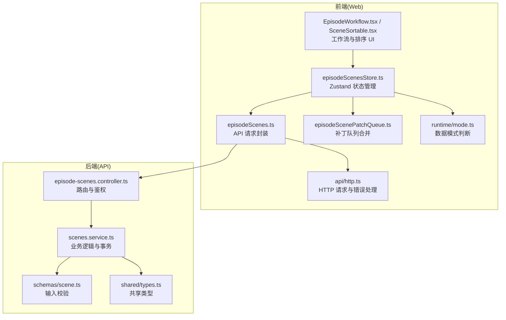
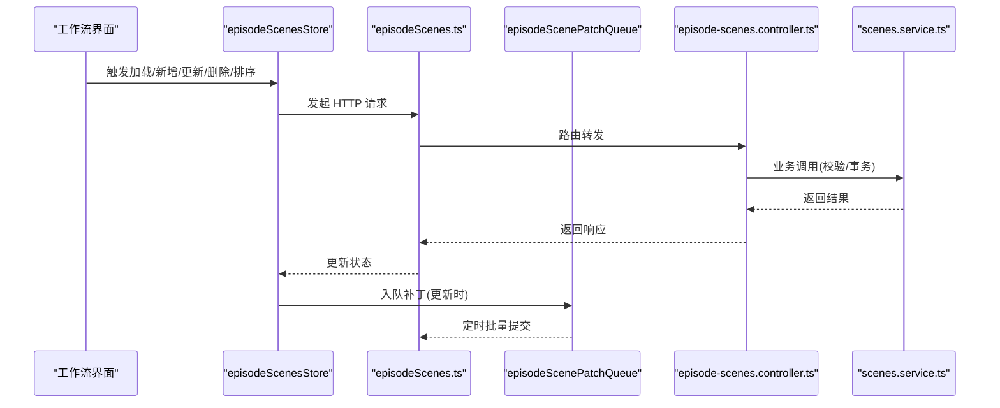
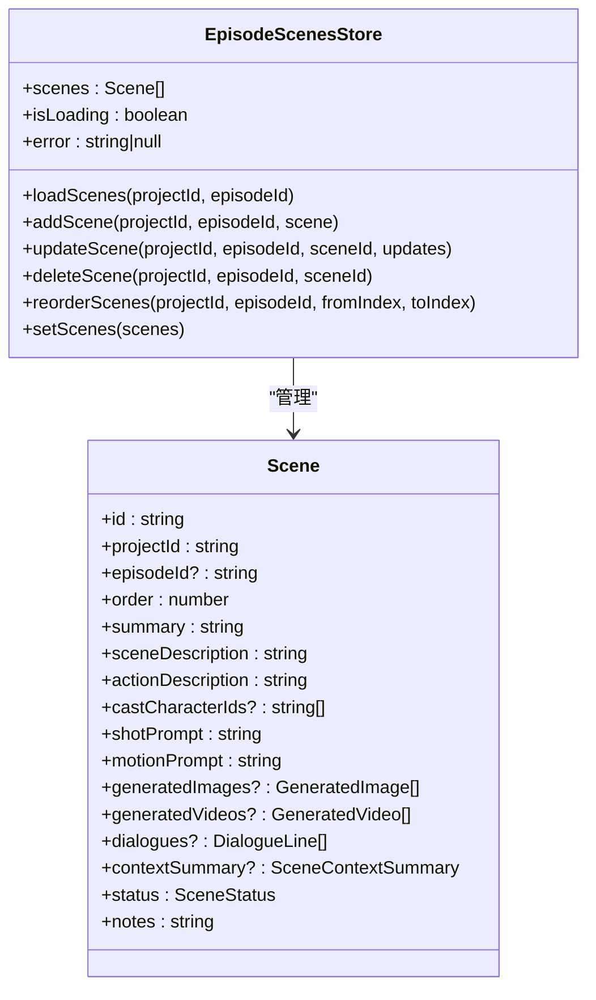
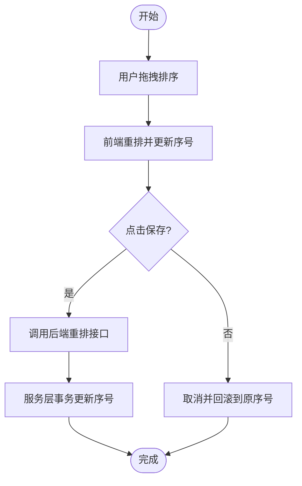
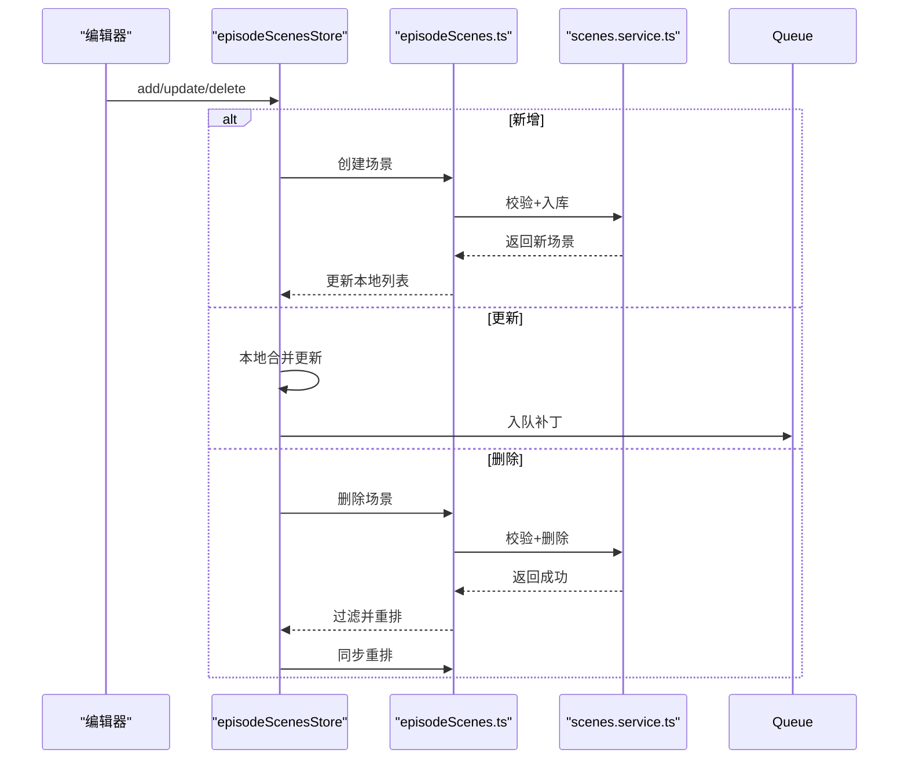
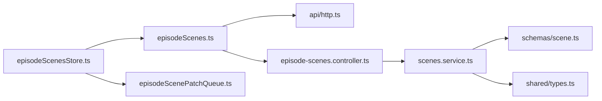

# 剧集场景状态管理

<cite>
**本文档引用的文件**
- [apps/web/src/stores/episodeScenesStore.ts](file://apps/web/src/stores/episodeScenesStore.ts)
- [apps/web/src/lib/api/episodeScenes.ts](file://apps/web/src/lib/api/episodeScenes.ts)
- [apps/web/src/lib/api/episodeScenePatchQueue.ts](file://apps/web/src/lib/api/episodeScenePatchQueue.ts)
- [apps/web/src/lib/runtime/mode.ts](file://apps/web/src/lib/runtime/mode.ts)
- [apps/web/src/lib/api/http.ts](file://apps/web/src/lib/api/http.ts)
- [apps/api/src/episodes/episode-scenes.controller.ts](file://apps/api/src/episodes/episode-scenes.controller.ts)
- [apps/api/src/scenes/scenes.service.ts](file://apps/api/src/scenes/scenes.service.ts)
- [packages/shared/src/schemas/scene.ts](file://packages/shared/src/schemas/scene.ts)
- [packages/shared/src/types.ts](file://packages/shared/src/types.ts)
- [apps/web/src/types/index.ts](file://apps/web/src/types/index.ts)
- [apps/web/src/stores/episodeScenesStore.test.ts](file://apps/web/src/stores/episodeScenesStore.test.ts)
- [apps/web/src/components/editor/EpisodeWorkflow.tsx](file://apps/web/src/components/editor/EpisodeWorkflow.tsx)
- [apps/web/src/components/editor/SceneSortable.tsx](file://apps/web/src/components/editor/SceneSortable.tsx)
</cite>

## 目录

1. [简介](#简介)
2. [项目结构](#项目结构)
3. [核心组件](#核心组件)
4. [架构总览](#架构总览)
5. [详细组件分析](#详细组件分析)
6. [依赖分析](#依赖分析)
7. [性能考虑](#性能考虑)
8. [故障排查指南](#故障排查指南)
9. [结论](#结论)
10. [附录](#附录)

## 简介

本文件系统性阐述 AIXSSS 项目中“剧集场景状态管理”模块的设计与实现，重点围绕 episodeScenesStore 的数据结构、排序管理、状态跟踪、搜索能力、创建/编辑/删除流程、与剧集/项目的关联关系、本地存储与 API 同步机制、实时更新与批量操作、场景序列管理，以及与工作流的集成方式。文档同时提供可视化图示、最佳实践与性能优化建议，帮助开发者与产品人员快速理解并高效使用该模块。

## 项目结构

该模块横跨前端 Web 应用与后端 API 两部分：

- 前端负责状态管理、UI 交互、本地/远程模式切换、请求封装与批处理合并。
- 后端提供 REST 接口，进行数据持久化、权限控制与事务一致性保证。

图表来源

- [apps/web/src/stores/episodeScenesStore.ts](file://apps/web/src/stores/episodeScenesStore.ts#L1-L157)
- [apps/web/src/lib/api/episodeScenes.ts](file://apps/web/src/lib/api/episodeScenes.ts#L1-L95)
- [apps/web/src/lib/api/episodeScenePatchQueue.ts](file://apps/web/src/lib/api/episodeScenePatchQueue.ts#L1-L95)
- [apps/web/src/lib/runtime/mode.ts](file://apps/web/src/lib/runtime/mode.ts#L1-L30)
- [apps/web/src/lib/api/http.ts](file://apps/web/src/lib/api/http.ts#L1-L93)
- [apps/api/src/episodes/episode-scenes.controller.ts](file://apps/api/src/episodes/episode-scenes.controller.ts#L1-L83)
- [apps/api/src/scenes/scenes.service.ts](file://apps/api/src/scenes/scenes.service.ts#L1-L365)
- [packages/shared/src/schemas/scene.ts](file://packages/shared/src/schemas/scene.ts#L1-L56)
- [packages/shared/src/types.ts](file://packages/shared/src/types.ts#L1-L77)

章节来源

- [apps/web/src/stores/episodeScenesStore.ts](file://apps/web/src/stores/episodeScenesStore.ts#L1-L157)
- [apps/api/src/episodes/episode-scenes.controller.ts](file://apps/api/src/episodes/episode-scenes.controller.ts#L1-L83)

## 核心组件

- 状态存储：episodeScenesStore 使用 Zustand 管理场景列表、加载状态与错误信息，并提供加载、新增、更新、删除、排序等方法。
- API 封装：episodeScenes.ts 定义了与后端的 REST 接口，包括列表、创建、更新、删除、重排等。
- 补丁队列：episodeScenePatchQueue 在前端聚合多次更新，定时批量发送至后端，降低网络压力。
- 数据模式：runtime/mode.ts 控制前端在本地模式与 API 模式下的行为差异。
- 类型系统：shared/types.ts 与 types/index.ts 定义了 Scene、Episode、状态枚举等核心类型。

章节来源

- [apps/web/src/stores/episodeScenesStore.ts](file://apps/web/src/stores/episodeScenesStore.ts#L32-L48)
- [apps/web/src/lib/api/episodeScenes.ts](file://apps/web/src/lib/api/episodeScenes.ts#L1-L95)
- [apps/web/src/lib/api/episodeScenePatchQueue.ts](file://apps/web/src/lib/api/episodeScenePatchQueue.ts#L1-L95)
- [apps/web/src/lib/runtime/mode.ts](file://apps/web/src/lib/runtime/mode.ts#L1-L30)
- [packages/shared/src/types.ts](file://packages/shared/src/types.ts#L37-L47)
- [apps/web/src/types/index.ts](file://apps/web/src/types/index.ts#L586-L618)

## 架构总览

前端通过 episodeScenesStore 统一调度场景数据，依据运行模式决定是否调用后端接口。后端控制器接收请求，经服务层校验与事务处理，最终返回标准化结果。类型定义确保前后端一致。

图表来源

- [apps/web/src/stores/episodeScenesStore.ts](file://apps/web/src/stores/episodeScenesStore.ts#L55-L155)
- [apps/web/src/lib/api/episodeScenes.ts](file://apps/web/src/lib/api/episodeScenes.ts#L6-L94)
- [apps/web/src/lib/api/episodeScenePatchQueue.ts](file://apps/web/src/lib/api/episodeScenePatchQueue.ts#L54-L94)
- [apps/api/src/episodes/episode-scenes.controller.ts](file://apps/api/src/episodes/episode-scenes.controller.ts#L14-L81)
- [apps/api/src/scenes/scenes.service.ts](file://apps/api/src/scenes/scenes.service.ts#L78-L84)

## 详细组件分析

### 状态存储与数据模型

- 数据结构
  - 场景对象包含项目/剧集归属、序号、摘要、描述、提示词、生成物、上下文摘要、状态与备注等字段。
  - 场景状态枚举覆盖从待处理到完成的全生命周期。
- 状态管理
  - 支持加载、设置、新增、更新、删除、重排等操作。
  - 更新时支持深合并上下文摘要，避免局部更新导致的字段丢失。
  - 删除后自动重排剩余场景序号，并异步同步后端重排结果。

图表来源

- [apps/web/src/stores/episodeScenesStore.ts](file://apps/web/src/stores/episodeScenesStore.ts#L32-L48)
- [apps/web/src/types/index.ts](file://apps/web/src/types/index.ts#L586-L618)
- [packages/shared/src/types.ts](file://packages/shared/src/types.ts#L37-L47)

章节来源

- [apps/web/src/stores/episodeScenesStore.ts](file://apps/web/src/stores/episodeScenesStore.ts#L50-L155)
- [apps/web/src/types/index.ts](file://apps/web/src/types/index.ts#L586-L618)
- [packages/shared/src/types.ts](file://packages/shared/src/types.ts#L37-L47)

### 场景排序管理

- 前端排序
  - 通过数组重排计算新的序号，立即反映在 UI。
  - 支持拖拽排序组件 SceneSortable，提供保存/取消操作。
- 后端重排
  - 通过 reorder 接口一次性更新多个场景的序号，使用数据库事务保证一致性。
  - 校验场景集合属于同一剧集，防止跨集污染。

图表来源

- [apps/web/src/stores/episodeScenesStore.ts](file://apps/web/src/stores/episodeScenesStore.ts#L141-L155)
- [apps/web/src/components/editor/SceneSortable.tsx](file://apps/web/src/components/editor/SceneSortable.tsx#L41-L127)
- [apps/api/src/scenes/scenes.service.ts](file://apps/api/src/scenes/scenes.service.ts#L340-L363)

章节来源

- [apps/web/src/stores/episodeScenesStore.ts](file://apps/web/src/stores/episodeScenesStore.ts#L141-L155)
- [apps/web/src/components/editor/SceneSortable.tsx](file://apps/web/src/components/editor/SceneSortable.tsx#L41-L127)
- [apps/api/src/scenes/scenes.service.ts](file://apps/api/src/scenes/scenes.service.ts#L340-L363)

### 场景状态跟踪

- 状态枚举与标签映射
  - 前端提供状态到中文标签与样式映射，便于 UI 展示。
- 生命周期流转
  - 从待处理到场景锚点生成、关键帧生成、运动/台词生成，直至完成或标记需更新。
- 工作流集成
  - EpisodeWorkflow 中根据状态展示不同操作按钮与进度提示。

章节来源

- [apps/web/src/components/editor/EpisodeWorkflow.tsx](file://apps/web/src/components/editor/EpisodeWorkflow.tsx#L245-L309)
- [packages/shared/src/types.ts](file://packages/shared/src/types.ts#L37-L47)

### 场景搜索功能

- 当前实现聚焦于场景列表的过滤与排序，未发现专门的全文检索实现。
- 建议在 UI 层基于 summary、sceneDescription、dialogues 等字段进行客户端筛选；后端可扩展模糊查询接口以提升大列表性能。

章节来源

- [apps/web/src/stores/episodeScenesStore.ts](file://apps/web/src/stores/episodeScenesStore.ts#L55-L70)

### 场景创建、编辑、删除流程

- 创建
  - 前端生成临时 id 与初始序号与状态，随后调用后端创建接口，成功后加入列表。
- 编辑
  - 支持局部字段更新与上下文摘要深合并，更新后入队补丁队列异步提交。
- 删除
  - 调用后端删除接口，前端过滤掉该场景并重排剩余项，异步触发后端重排。

图表来源

- [apps/web/src/stores/episodeScenesStore.ts](file://apps/web/src/stores/episodeScenesStore.ts#L76-L139)
- [apps/web/src/lib/api/episodeScenes.ts](file://apps/web/src/lib/api/episodeScenes.ts#L22-L83)
- [apps/api/src/scenes/scenes.service.ts](file://apps/api/src/scenes/scenes.service.ts#L133-L159)

章节来源

- [apps/web/src/stores/episodeScenesStore.ts](file://apps/web/src/stores/episodeScenesStore.ts#L76-L139)
- [apps/web/src/lib/api/episodeScenes.ts](file://apps/web/src/lib/api/episodeScenes.ts#L22-L83)
- [apps/api/src/scenes/scenes.service.ts](file://apps/api/src/scenes/scenes.service.ts#L133-L159)

### 与剧集、项目的关联关系

- 场景对象包含 projectId 与可选的 episodeId，明确归属关系。
- 后端控制器按项目/剧集维度进行权限校验与数据隔离。
- 工作流界面通过项目/剧集选择器联动加载对应场景列表。

章节来源

- [apps/web/src/types/index.ts](file://apps/web/src/types/index.ts#L586-L591)
- [apps/api/src/episodes/episode-scenes.controller.ts](file://apps/api/src/episodes/episode-scenes.controller.ts#L14-L26)
- [apps/web/src/components/editor/EpisodeWorkflow.tsx](file://apps/web/src/components/editor/EpisodeWorkflow.tsx#L512-L523)

### 本地存储与 API 同步机制

- 数据模式
  - 通过运行模式判断是否启用 API，本地模式下 store 会清空列表或抛错。
- 请求封装
  - 统一的 apiRequest 封装，处理鉴权、错误提取与响应解析。
- 同步策略
  - 加载：首次进入页面拉取后端数据。
  - 写入：更新采用补丁队列合并，定时批量提交，减少请求次数。
  - 删除：本地先移除，再异步重排后端。

章节来源

- [apps/web/src/lib/runtime/mode.ts](file://apps/web/src/lib/runtime/mode.ts#L8-L21)
- [apps/web/src/lib/api/http.ts](file://apps/web/src/lib/api/http.ts#L58-L92)
- [apps/web/src/stores/episodeScenesStore.ts](file://apps/web/src/stores/episodeScenesStore.ts#L55-L70)

### 实时更新、批量操作与场景序列管理

- 实时更新
  - 本地即时更新，补丁队列异步提交，避免阻塞 UI。
- 批量操作
  - 补丁队列合并相邻更新，减少网络往返。
  - 工作流中提供批量细化场景的操作入口，结合进度与错误收集。
- 序列管理
  - 前端重排即刻生效，后端重排保证一致性与原子性。

章节来源

- [apps/web/src/lib/api/episodeScenePatchQueue.ts](file://apps/web/src/lib/api/episodeScenePatchQueue.ts#L33-L41)
- [apps/web/src/components/editor/EpisodeWorkflow.tsx](file://apps/web/src/components/editor/EpisodeWorkflow.tsx#L455-L491)
- [apps/api/src/scenes/scenes.service.ts](file://apps/api/src/scenes/scenes.service.ts#L327-L338)

### 工作流集成与最佳实践

- 集成点
  - EpisodeWorkflow 在关键节点（如生成场景圣经、细化场景等）会刷新补丁队列，确保数据一致性。
- 最佳实践
  - 优先使用拖拽排序组件进行重排，统一触发后端重排。
  - 更新场景时尽量使用局部更新，利用上下文摘要深合并避免覆盖。
  - 大规模操作前先刷新补丁队列，减少并发冲突。

章节来源

- [apps/web/src/components/editor/EpisodeWorkflow.tsx](file://apps/web/src/components/editor/EpisodeWorkflow.tsx#L970-L971)
- [apps/web/src/components/editor/SceneSortable.tsx](file://apps/web/src/components/editor/SceneSortable.tsx#L68-L88)

## 依赖分析

- 前端依赖
  - Zustand：状态管理。
  - DnD Kit：拖拽排序。
  - Zod：输入校验（共享类型定义）。
- 后端依赖
  - NestJS：控制器与守卫。
  - Prisma：数据库访问与事务。
  - Zod：输入校验。

图表来源

- [apps/web/src/stores/episodeScenesStore.ts](file://apps/web/src/stores/episodeScenesStore.ts#L1-L10)
- [apps/web/src/lib/api/episodeScenes.ts](file://apps/web/src/lib/api/episodeScenes.ts#L1-L2)
- [apps/web/src/lib/api/episodeScenePatchQueue.ts](file://apps/web/src/lib/api/episodeScenePatchQueue.ts#L1-L2)
- [apps/web/src/lib/api/http.ts](file://apps/web/src/lib/api/http.ts#L1-L2)
- [apps/api/src/episodes/episode-scenes.controller.ts](file://apps/api/src/episodes/episode-scenes.controller.ts#L1-L8)
- [apps/api/src/scenes/scenes.service.ts](file://apps/api/src/scenes/scenes.service.ts#L1-L4)
- [packages/shared/src/schemas/scene.ts](file://packages/shared/src/schemas/scene.ts#L1-L2)
- [packages/shared/src/types.ts](file://packages/shared/src/types.ts#L1-L2)

章节来源

- [apps/web/src/stores/episodeScenesStore.ts](file://apps/web/src/stores/episodeScenesStore.ts#L1-L10)
- [apps/api/src/scenes/scenes.service.ts](file://apps/api/src/scenes/scenes.service.ts#L1-L4)

## 性能考虑

- 补丁合并
  - 合并相邻更新，减少网络请求与后端写入次数。
- 批量提交
  - 定时器批量刷新补丁队列，避免频繁 IO。
- 事务重排
  - 后端使用事务一次性更新多个场景序号，保证一致性与性能。
- 前端渲染
  - 拖拽排序组件仅在保存时触发后端重排，降低频繁请求带来的抖动。

章节来源

- [apps/web/src/lib/api/episodeScenePatchQueue.ts](file://apps/web/src/lib/api/episodeScenePatchQueue.ts#L46-L52)
- [apps/api/src/scenes/scenes.service.ts](file://apps/api/src/scenes/scenes.service.ts#L327-L338)

## 故障排查指南

- 常见错误
  - API 请求失败：检查鉴权令牌与网络连接，查看统一错误封装中的状态码与详情。
  - 删除失败：若场景正被 AI 作业处理，后端会拒绝删除，需先取消对应作业。
  - 重排异常：确保所选场景均属于同一剧集，否则后端会拒绝。
- 定位方法
  - 查看 store 中的 error 字段与控制台日志。
  - 在测试用例中复现问题，观察 mock 行为与断言。

章节来源

- [apps/web/src/lib/api/http.ts](file://apps/web/src/lib/api/http.ts#L3-L13)
- [apps/api/src/scenes/scenes.service.ts](file://apps/api/src/scenes/scenes.service.ts#L290-L303)
- [apps/web/src/stores/episodeScenesStore.test.ts](file://apps/web/src/stores/episodeScenesStore.test.ts#L1-L161)

## 结论

episodeScenesStore 通过清晰的状态模型、可靠的前后端协作与高效的批处理机制，实现了对剧集场景的全生命周期管理。配合拖拽排序与工作流集成，既满足了创意编辑的灵活性，也保障了数据一致性与性能表现。建议在后续迭代中引入更完善的搜索与索引能力，进一步提升大规模场景列表的可用性。

## 附录

- 测试用例
  - 覆盖加载、更新、新增、删除与重排等核心路径，验证 store 行为与 API 交互。
- 类型规范
  - 前后端共享类型与输入校验，确保数据结构一致与安全。

章节来源

- [apps/web/src/stores/episodeScenesStore.test.ts](file://apps/web/src/stores/episodeScenesStore.test.ts#L25-L161)
- [packages/shared/src/schemas/scene.ts](file://packages/shared/src/schemas/scene.ts#L26-L56)
