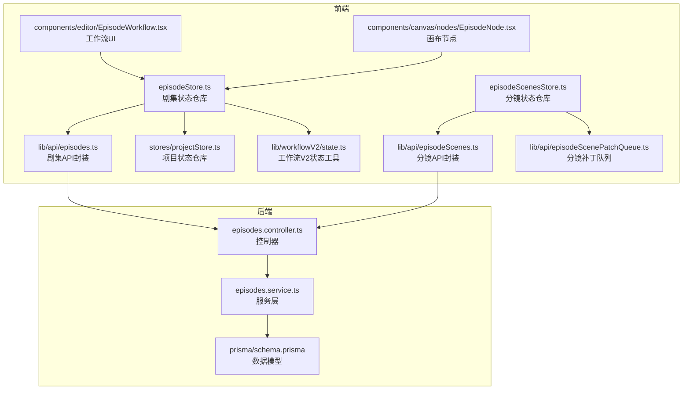
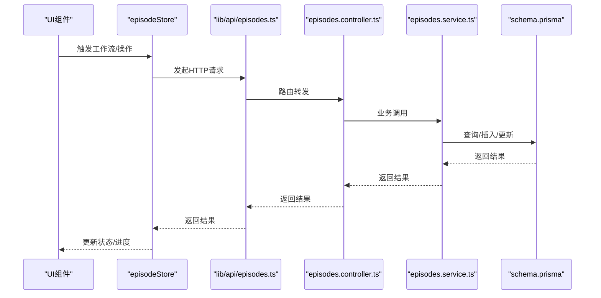
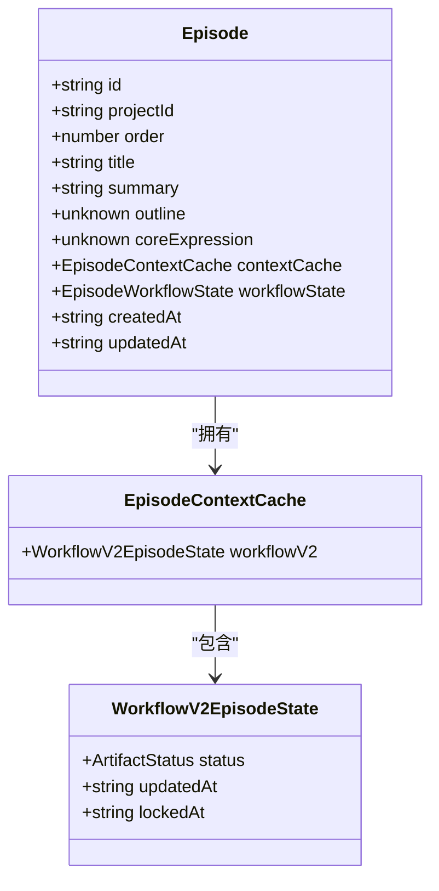
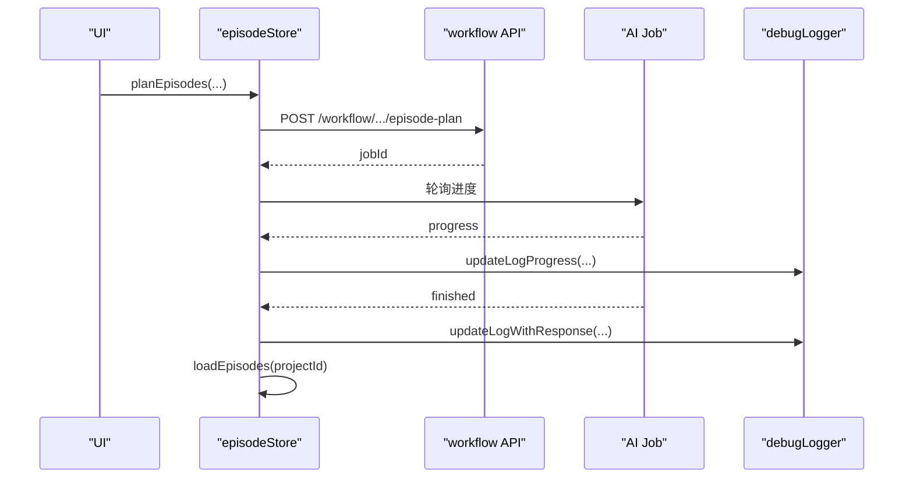
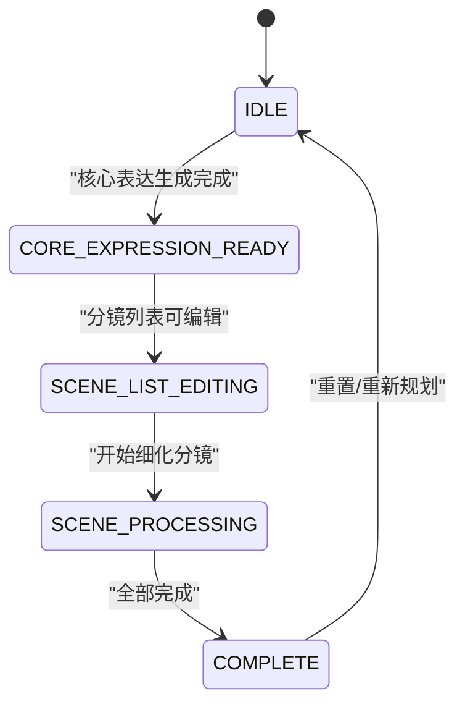
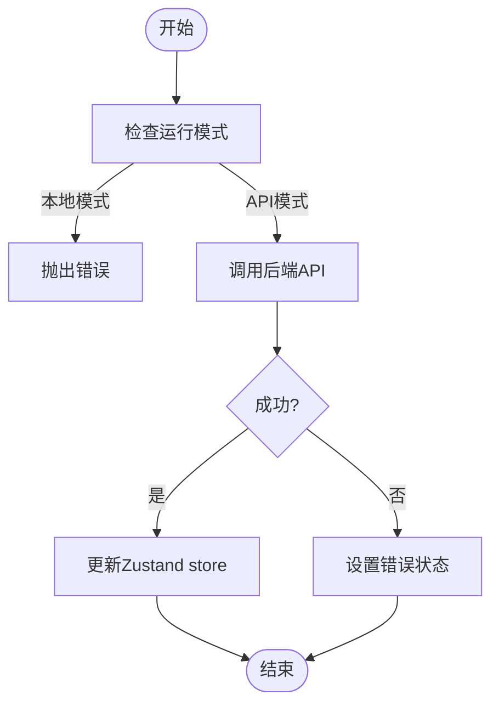
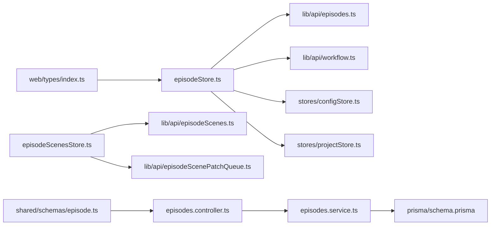

# 剧集状态管理

<cite>
**本文档引用的文件**
- [apps/web/src/stores/episodeStore.ts](file://apps/web/src/stores/episodeStore.ts)
- [apps/api/src/episodes/episodes.service.ts](file://apps/api/src/episodes/episodes.service.ts)
- [apps/api/src/episodes/episodes.controller.ts](file://apps/api/src/episodes/episodes.controller.ts)
- [packages/shared/src/schemas/episode.ts](file://packages/shared/src/schemas/episode.ts)
- [apps/web/src/lib/api/episodes.ts](file://apps/web/src/lib/api/episodes.ts)
- [apps/web/src/types/index.ts](file://apps/web/src/types/index.ts)
- [packages/shared/src/types.ts](file://packages/shared/src/types.ts)
- [apps/web/src/stores/episodeScenesStore.ts](file://apps/web/src/stores/episodeScenesStore.ts)
- [apps/api/prisma/schema.prisma](file://apps/api/prisma/schema.prisma)
- [apps/web/src/lib/workflowV2/state.ts](file://apps/web/src/lib/workflowV2/state.ts)
- [apps/web/src/stores/projectStore.ts](file://apps/web/src/stores/projectStore.ts)
- [apps/web/src/lib/api/episodeScenePatchQueue.ts](file://apps/web/src/lib/api/episodeScenePatchQueue.ts)
- [apps/web/src/components/editor/BatchOperations.tsx](file://apps/web/src/components/editor/BatchOperations.tsx)
- [apps/web/src/components/editor/EpisodeWorkflow.tsx](file://apps/web/src/components/editor/EpisodeWorkflow.tsx)
- [apps/web/src/components/canvas/nodes/EpisodeNode.tsx](file://apps/web/src/components/canvas/nodes/EpisodeNode.tsx)
</cite>

## 目录

1. [简介](#简介)
2. [项目结构](#项目结构)
3. [核心组件](#核心组件)
4. [架构总览](#架构总览)
5. [详细组件分析](#详细组件分析)
6. [依赖关系分析](#依赖关系分析)
7. [性能考量](#性能考量)
8. [故障排查指南](#故障排查指南)
9. [结论](#结论)
10. [附录](#附录)

## 简介

本文件系统性阐述 AIXSSS 项目中“剧集状态管理”的设计与实现，围绕前端 Zustand 状态仓库、后端 API 服务、数据库模型、工作流状态机与批处理机制展开，重点覆盖以下主题：

- 剧集数据结构与字段语义
- 剧集计划管理与工作流集成
- 剧集状态跟踪与生命周期
- 剧集 CRUD 流程与与项目/场景的关联
- 本地存储与 API 同步策略
- 批量操作与实时更新
- 数据同步优化与实际应用场景

## 项目结构

围绕剧集状态管理的关键文件分布如下：

- 前端状态与 UI
  - 剧集状态仓库：apps/web/src/stores/episodeStore.ts
  - 分镜状态仓库：apps/web/src/stores/episodeScenesStore.ts
  - 剧集 API 封装：apps/web/src/lib/api/episodes.ts
  - 分镜 API 封装与补丁队列：apps/web/src/lib/api/episodeScenes.ts、apps/web/src/lib/api/episodeScenePatchQueue.ts
  - 工作流 V2 状态工具：apps/web/src/lib/workflowV2/state.ts
  - 项目状态仓库：apps/web/src/stores/projectStore.ts
  - UI 组件：apps/web/src/components/editor/EpisodeWorkflow.tsx、apps/web/src/components/canvas/nodes/EpisodeNode.tsx
- 后端 API 与数据模型
  - 控制器：apps/api/src/episodes/episodes.controller.ts
  - 服务层：apps/api/src/episodes/episodes.service.ts
  - 数据模型：apps/api/prisma/schema.prisma
  - 类型与校验：packages/shared/src/schemas/episode.ts、packages/shared/src/types.ts
  - 前端类型：apps/web/src/types/index.ts

图表来源

- [apps/web/src/stores/episodeStore.ts](file://apps/web/src/stores/episodeStore.ts#L124-L504)
- [apps/web/src/stores/episodeScenesStore.ts](file://apps/web/src/stores/episodeScenesStore.ts#L50-L157)
- [apps/web/src/lib/api/episodes.ts](file://apps/web/src/lib/api/episodes.ts#L1-L63)
- [apps/web/src/lib/api/episodeScenes.ts](file://apps/web/src/lib/api/episodeScenes.ts#L1-L200)
- [apps/web/src/lib/api/episodeScenePatchQueue.ts](file://apps/web/src/lib/api/episodeScenePatchQueue.ts#L1-L95)
- [apps/web/src/lib/workflowV2/state.ts](file://apps/web/src/lib/workflowV2/state.ts#L1-L139)
- [apps/web/src/stores/projectStore.ts](file://apps/web/src/stores/projectStore.ts#L1-L181)
- [apps/api/src/episodes/episodes.controller.ts](file://apps/api/src/episodes/episodes.controller.ts#L1-L55)
- [apps/api/src/episodes/episodes.service.ts](file://apps/api/src/episodes/episodes.service.ts#L1-L146)
- [apps/api/prisma/schema.prisma](file://apps/api/prisma/schema.prisma#L176-L195)

章节来源

- [apps/web/src/stores/episodeStore.ts](file://apps/web/src/stores/episodeStore.ts#L124-L504)
- [apps/api/src/episodes/episodes.controller.ts](file://apps/api/src/episodes/episodes.controller.ts#L1-L55)
- [apps/api/src/episodes/episodes.service.ts](file://apps/api/src/episodes/episodes.service.ts#L1-L146)
- [apps/api/prisma/schema.prisma](file://apps/api/prisma/schema.prisma#L176-L195)

## 核心组件

- 剧集状态仓库（episodeStore）
  - 负责剧集列表加载、当前剧集切换、创建/更新/删除剧集、工作流执行（规划、核心表达生成、分镜生成、叙事因果链构建）、进度与错误管理。
  - 支持 API 模式与本地模式切换，API 模式下与后端接口对接，本地模式下抛出异常以阻止操作。
- 分镜状态仓库（episodeScenesStore）
  - 负责分镜列表加载、新增/更新/删除分镜、分镜重排、上下文合并与补丁队列异步提交。
- 剧集 API 封装（lib/api/episodes.ts）
  - 提供 GET/POST/PATCH/DELETE 剧集接口调用，统一序列化与反序列化。
- 分镜 API 封装与补丁队列（lib/api/episodeScenes.ts、episodeScenePatchQueue.ts）
  - 提供分镜 CRUD 与重排接口，并通过队列合并多次更新，降低网络请求频率。
- 工作流 V2 状态工具（lib/workflowV2/state.ts）
  - 提供项目/剧集工作流 V2 产物状态规范化与补丁构建，支撑前端工作台体验。
- 项目状态仓库（projectStore）
  - 提供项目级上下文缓存读取与刷新，如叙事因果链等，确保剧集状态与项目上下文一致。
- UI 组件
  - EpisodeWorkflow：工作流面板，集成剧集规划、核心表达生成、分镜生成、因果链构建等。
  - EpisodeNode：画布节点，展示剧集状态与进度。

章节来源

- [apps/web/src/stores/episodeStore.ts](file://apps/web/src/stores/episodeStore.ts#L69-L122)
- [apps/web/src/stores/episodeScenesStore.ts](file://apps/web/src/stores/episodeScenesStore.ts#L32-L48)
- [apps/web/src/lib/api/episodes.ts](file://apps/web/src/lib/api/episodes.ts#L1-L63)
- [apps/web/src/lib/api/episodeScenes.ts](file://apps/web/src/lib/api/episodeScenes.ts#L1-L200)
- [apps/web/src/lib/api/episodeScenePatchQueue.ts](file://apps/web/src/lib/api/episodeScenePatchQueue.ts#L1-L95)
- [apps/web/src/lib/workflowV2/state.ts](file://apps/web/src/lib/workflowV2/state.ts#L1-L139)
- [apps/web/src/stores/projectStore.ts](file://apps/web/src/stores/projectStore.ts#L1-L181)
- [apps/web/src/components/editor/EpisodeWorkflow.tsx](file://apps/web/src/components/editor/EpisodeWorkflow.tsx#L332-L375)
- [apps/web/src/components/canvas/nodes/EpisodeNode.tsx](file://apps/web/src/components/canvas/nodes/EpisodeNode.tsx#L41-L68)

## 架构总览

前端通过 episodeStore 与后端 API 交互，后端控制器接收请求并调用服务层，服务层基于 Prisma 访问数据库模型。工作流相关任务通过 AI Job 管道异步执行，前端通过轮询或回调获取进度与结果，并在成功后刷新剧集/项目数据。

图表来源

- [apps/web/src/stores/episodeStore.ts](file://apps/web/src/stores/episodeStore.ts#L169-L208)
- [apps/web/src/lib/api/episodes.ts](file://apps/web/src/lib/api/episodes.ts#L1-L63)
- [apps/api/src/episodes/episodes.controller.ts](file://apps/api/src/episodes/episodes.controller.ts#L1-L55)
- [apps/api/src/episodes/episodes.service.ts](file://apps/api/src/episodes/episodes.service.ts#L39-L143)
- [apps/api/prisma/schema.prisma](file://apps/api/prisma/schema.prisma#L176-L195)

## 详细组件分析

### 剧集数据结构与字段语义

- 核心实体：Episode
  - 字段要点：id、projectId、order、title、summary、outline、coreExpression、contextCache、workflowState、createdAt、updatedAt。
  - workflowState：单集工作流状态，枚举值包括 IDLE、CORE_EXPRESSION_READY、SCENE_LIST_EDITING、SCENE_PROCESSING、COMPLETE。
- 类型与校验
  - Create/Update 输入校验：字段长度、范围、可选 JSON 字段等。
  - EpisodePlan/核心表达 Schema：用于工作流输出解析与校验。
- 前端类型与共享类型
  - 前端 types/index.ts 定义了 Episode 接口与上下文缓存结构。
  - shared/types.ts 定义了 EPISODE_WORKFLOW_STATES 枚举。

图表来源

- [apps/web/src/types/index.ts](file://apps/web/src/types/index.ts#L620-L637)
- [packages/shared/src/types.ts](file://packages/shared/src/types.ts#L25-L32)
- [apps/web/src/lib/workflowV2/state.ts](file://apps/web/src/lib/workflowV2/state.ts#L48-L74)

章节来源

- [apps/web/src/types/index.ts](file://apps/web/src/types/index.ts#L620-L637)
- [packages/shared/src/schemas/episode.ts](file://packages/shared/src/schemas/episode.ts#L1-L80)
- [packages/shared/src/types.ts](file://packages/shared/src/types.ts#L25-L32)

### 剧集计划管理与工作流集成

- 规划剧集（planEpisodes）
  - 触发后端工作流，返回 AI Job，前端轮询进度，成功后刷新剧集列表。
  - 日志记录：记录技能名、模板、填充后的提示、上下文与配置。
- 核心表达生成（generateCoreExpression/generateCoreExpressionBatch）
  - 支持单集与批量生成，带进度回调与输出日志。
- 分镜生成（generateSceneList）
  - 基于核心表达生成分镜列表，支持场景数量提示。
- 叙事因果链构建（buildNarrativeCausalChain）
  - 多阶段工作流，成功后刷新项目上下文缓存中的因果链。

图表来源

- [apps/web/src/stores/episodeStore.ts](file://apps/web/src/stores/episodeStore.ts#L210-L267)
- [apps/web/src/stores/episodeStore.ts](file://apps/web/src/stores/episodeStore.ts#L269-L323)
- [apps/web/src/stores/episodeStore.ts](file://apps/web/src/stores/episodeStore.ts#L325-L380)
- [apps/web/src/stores/episodeStore.ts](file://apps/web/src/stores/episodeStore.ts#L382-L430)
- [apps/web/src/stores/episodeStore.ts](file://apps/web/src/stores/episodeStore.ts#L432-L502)

章节来源

- [apps/web/src/stores/episodeStore.ts](file://apps/web/src/stores/episodeStore.ts#L92-L122)

### 剧集状态跟踪与生命周期

- 生命周期状态
  - 单集工作流状态：IDLE → CORE_EXPRESSION_READY → SCENE_LIST_EDITING → SCENE_PROCESSING → COMPLETE。
  - 项目工作流状态：包含 EPISODE_PLANNING、EPISODE_CREATING 等，用于 UI 与工作台状态同步。
- 状态持久化
  - 前端：Zustand store 中维护 episodes、currentEpisodeId、isLoading、isRunningWorkflow、lastJobProgress、error。
  - 后端：Prisma 模型 Episode 的 workflowState 字段与唯一索引保证 order 连续性。
- 项目上下文联动
  - 叙事因果链构建完成后，刷新项目上下文缓存，确保后续工作流能读取最新因果链。

图表来源

- [packages/shared/src/types.ts](file://packages/shared/src/types.ts#L25-L32)
- [apps/api/prisma/schema.prisma](file://apps/api/prisma/schema.prisma#L34-L40)

章节来源

- [packages/shared/src/types.ts](file://packages/shared/src/types.ts#L25-L32)
- [apps/api/prisma/schema.prisma](file://apps/api/prisma/schema.prisma#L34-L40)

### 剧集 CRUD 流程与项目/场景关联

- 创建/更新/删除
  - 前端通过 episodeStore 调用 apiCreateEpisode/apiUpdateEpisode/apiDeleteEpisode，后端控制器校验 JWT 并调用服务层。
  - 服务层校验项目归属、唯一性约束、存在性，删除前检查是否存在未完成的 AI 作业。
- 与项目/场景的关联
  - Episode 属于 Project（projectId），并包含多个 Scene。
  - 删除剧集前若存在与之关联的场景且有未完成的 AI 作业，将拒绝删除并提示先取消作业。

图表来源

- [apps/web/src/stores/episodeStore.ts](file://apps/web/src/stores/episodeStore.ts#L169-L208)
- [apps/web/src/lib/api/episodes.ts](file://apps/web/src/lib/api/episodes.ts#L17-L62)
- [apps/api/src/episodes/episodes.controller.ts](file://apps/api/src/episodes/episodes.controller.ts#L19-L52)
- [apps/api/src/episodes/episodes.service.ts](file://apps/api/src/episodes/episodes.service.ts#L57-L143)

章节来源

- [apps/web/src/stores/episodeStore.ts](file://apps/web/src/stores/episodeStore.ts#L78-L208)
- [apps/api/src/episodes/episodes.controller.ts](file://apps/api/src/episodes/episodes.controller.ts#L14-L52)
- [apps/api/src/episodes/episodes.service.ts](file://apps/api/src/episodes/episodes.service.ts#L39-L143)

### 本地存储与 API 同步机制

- 模式检测
  - isApiMode() 控制是否启用 API 模式，API 模式下才允许 CRUD 与工作流操作。
- 项目切换与剧集清空
  - 切换项目时清空剧集列表与当前剧集 ID，避免旧数据污染。
- 项目上下文刷新
  - 工作流完成后刷新项目上下文缓存，确保因果链等信息最新。

章节来源

- [apps/web/src/stores/episodeStore.ts](file://apps/web/src/stores/episodeStore.ts#L133-L163)
- [apps/web/src/stores/projectStore.ts](file://apps/web/src/stores/projectStore.ts#L83-L94)

### 批量操作处理与实时更新策略

- 批量操作组件（BatchOperations）
  - 支持批量生成、批量导出、批量删除、暂停/继续、取消。
  - 通过全局 AI 进度状态管理批量流程。
- 分镜补丁队列（episodeScenePatchQueue）
  - 合并多次上下文更新，定时批量提交，减少网络开销。
- 实时更新
  - 工作流进度通过回调实时更新，错误与日志同步记录。

章节来源

- [apps/web/src/components/editor/BatchOperations.tsx](file://apps/web/src/components/editor/BatchOperations.tsx#L1-L346)
- [apps/web/src/lib/api/episodeScenePatchQueue.ts](file://apps/web/src/lib/api/episodeScenePatchQueue.ts#L1-L95)
- [apps/web/src/stores/episodeStore.ts](file://apps/web/src/stores/episodeStore.ts#L240-L247)

### 数据同步优化

- 补丁合并与去抖
  - 分镜补丁队列在 800ms 内合并多次更新，避免频繁网络请求。
- 项目/剧集刷新
  - 工作流完成后主动刷新项目上下文与剧集列表，确保前端状态与后端一致。
- 错误与回退
  - 补丁队列失败时重试并回填队列，保证最终一致性。

章节来源

- [apps/web/src/lib/api/episodeScenePatchQueue.ts](file://apps/web/src/lib/api/episodeScenePatchQueue.ts#L46-L95)
- [apps/web/src/stores/episodeStore.ts](file://apps/web/src/stores/episodeStore.ts#L258-L258)

## 依赖关系分析

- 前端依赖
  - episodeStore 依赖：api/episodes.ts、api/workflow.ts、debugLogger、configStore、projectStore。
  - episodeScenesStore 依赖：episodeScenes API、episodeScenePatchQueue。
- 后端依赖
  - episodes.controller.ts 依赖 episodes.service.ts。
  - episodes.service.ts 依赖 PrismaService 与 Prisma 模型。
- 类型与校验
  - shared/schemas/episode.ts 提供输入校验与输出 Schema。
  - shared/types.ts 与 web/types/index.ts 提供状态枚举与实体定义。

图表来源

- [apps/web/src/stores/episodeStore.ts](file://apps/web/src/stores/episodeStore.ts#L1-L27)
- [apps/web/src/stores/episodeScenesStore.ts](file://apps/web/src/stores/episodeScenesStore.ts#L1-L11)
- [apps/api/src/episodes/episodes.controller.ts](file://apps/api/src/episodes/episodes.controller.ts#L1-L12)
- [apps/api/src/episodes/episodes.service.ts](file://apps/api/src/episodes/episodes.service.ts#L1-L29)
- [packages/shared/src/schemas/episode.ts](file://packages/shared/src/schemas/episode.ts#L1-L26)
- [apps/web/src/types/index.ts](file://apps/web/src/types/index.ts#L620-L637)

章节来源

- [apps/web/src/stores/episodeStore.ts](file://apps/web/src/stores/episodeStore.ts#L1-L27)
- [apps/web/src/stores/episodeScenesStore.ts](file://apps/web/src/stores/episodeScenesStore.ts#L1-L11)
- [apps/api/src/episodes/episodes.controller.ts](file://apps/api/src/episodes/episodes.controller.ts#L1-L12)
- [apps/api/src/episodes/episodes.service.ts](file://apps/api/src/episodes/episodes.service.ts#L1-L29)
- [packages/shared/src/schemas/episode.ts](file://packages/shared/src/schemas/episode.ts#L1-L26)
- [apps/web/src/types/index.ts](file://apps/web/src/types/index.ts#L620-L637)

## 性能考量

- 请求合并与去抖
  - 分镜补丁队列 800ms 去抖，显著降低网络请求次数。
- 批量操作
  - 批量生成/导出/删除减少 UI 交互成本与后端压力。
- 状态更新
  - 仅在必要时刷新剧集列表与项目上下文，避免无谓重渲染。
- 错误处理
  - 工作流失败时记录日志并设置错误状态，便于快速定位问题。

## 故障排查指南

- API 模式限制
  - 在本地模式下执行 CRUD 或工作流会抛出错误，需切换至 API 模式。
- 删除剧集失败
  - 若剧集内存在未完成的 AI 作业，删除会被拒绝。请先取消对应作业再重试。
- 进度不更新
  - 确认工作流已正确返回 jobId 并开启进度回调；检查日志记录是否正常。
- 项目上下文不同步
  - 工作流完成后需刷新项目上下文缓存，确保因果链等信息最新。

章节来源

- [apps/web/src/stores/episodeStore.ts](file://apps/web/src/stores/episodeStore.ts#L169-L172)
- [apps/api/src/episodes/episodes.service.ts](file://apps/api/src/episodes/episodes.service.ts#L125-L139)
- [apps/web/src/stores/episodeStore.ts](file://apps/web/src/stores/episodeStore.ts#L240-L247)
- [apps/web/src/stores/episodeStore.ts](file://apps/web/src/stores/episodeStore.ts#L493-L493)

## 结论

本模块通过前端 Zustand 状态仓库与后端 API 服务协同，实现了从剧集规划、核心表达生成、分镜生成到叙事因果链构建的完整工作流闭环。配合分镜补丁队列与项目上下文刷新机制，确保了数据一致性与用户体验的流畅性。建议在实际应用中：

- 严格遵循工作流状态机，避免跨状态直接跳转。
- 使用补丁队列与批量操作提升性能与稳定性。
- 在删除剧集前清理相关作业，避免阻塞。
- 定期刷新项目上下文，确保因果链等关键信息最新。

## 附录

- 相关文件路径与用途
  - 剧集状态仓库：apps/web/src/stores/episodeStore.ts
  - 分镜状态仓库：apps/web/src/stores/episodeScenesStore.ts
  - 剧集 API 封装：apps/web/src/lib/api/episodes.ts
  - 分镜 API 封装与补丁队列：apps/web/src/lib/api/episodeScenes.ts、apps/web/src/lib/api/episodeScenePatchQueue.ts
  - 工作流 V2 状态工具：apps/web/src/lib/workflowV2/state.ts
  - 项目状态仓库：apps/web/src/stores/projectStore.ts
  - UI 组件：apps/web/src/components/editor/EpisodeWorkflow.tsx、apps/web/src/components/canvas/nodes/EpisodeNode.tsx
  - 后端控制器与服务：apps/api/src/episodes/episodes.controller.ts、apps/api/src/episodes/episodes.service.ts
  - 数据模型：apps/api/prisma/schema.prisma
  - 类型与校验：packages/shared/src/schemas/episode.ts、packages/shared/src/types.ts、apps/web/src/types/index.ts
